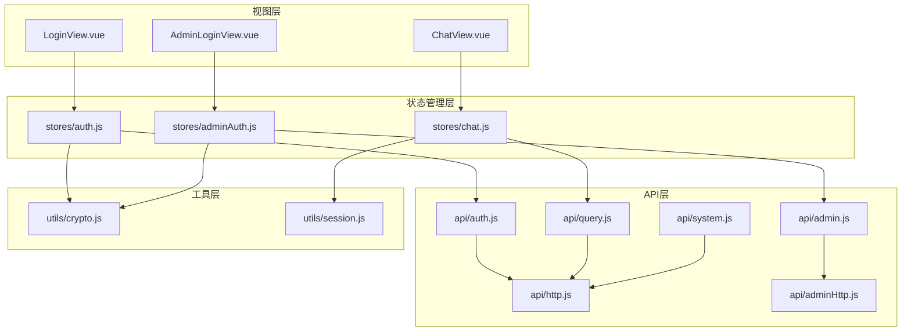
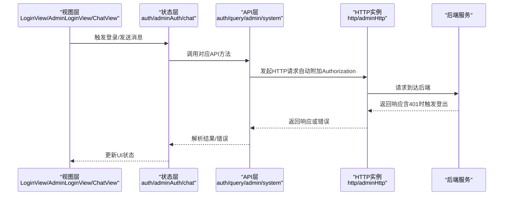
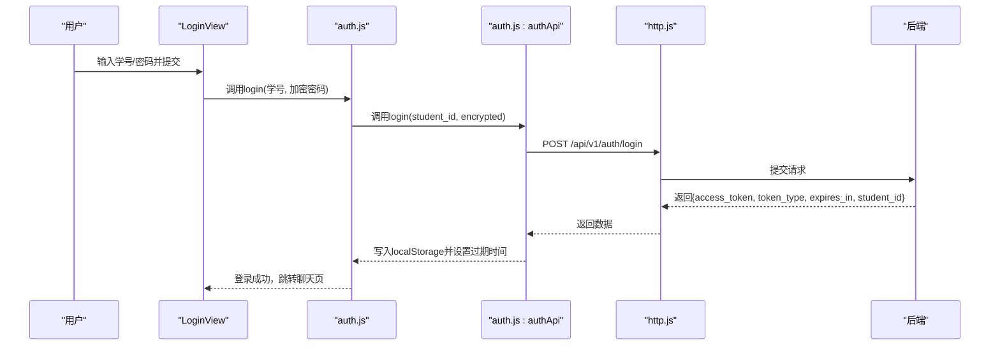
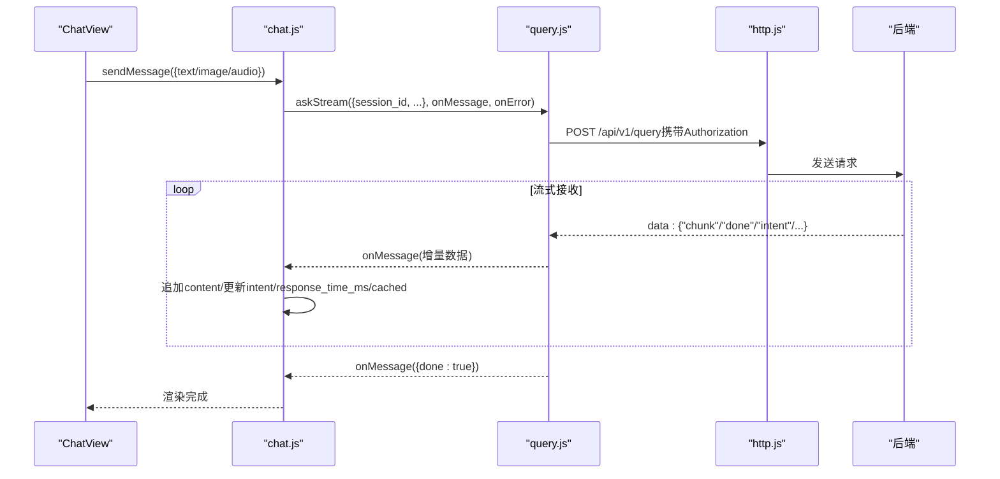
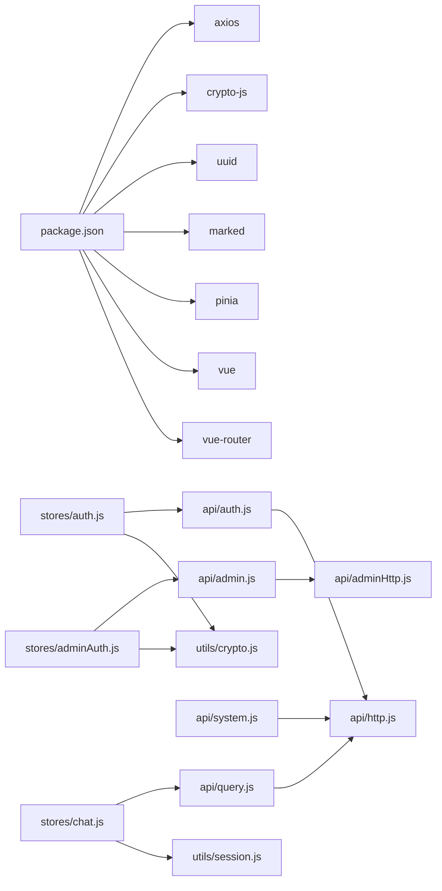

# API客户端

<cite>
**本文引用的文件**
- [frontend/ai_assistant/src/api/http.js](file://frontend/ai_assistant/src/api/http.js)
- [frontend/ai_assistant/src/api/adminHttp.js](file://frontend/ai_assistant/src/api/adminHttp.js)
- [frontend/ai_assistant/src/api/auth.js](file://frontend/ai_assistant/src/api/auth.js)
- [frontend/ai_assistant/src/api/query.js](file://frontend/ai_assistant/src/api/query.js)
- [frontend/ai_assistant/src/api/system.js](file://frontend/ai_assistant/src/api/system.js)
- [frontend/ai_assistant/src/api/admin.js](file://frontend/ai_assistant/src/api/admin.js)
- [frontend/ai_assistant/src/stores/auth.js](file://frontend/ai_assistant/src/stores/auth.js)
- [frontend/ai_assistant/src/stores/adminAuth.js](file://frontend/ai_assistant/src/stores/adminAuth.js)
- [frontend/ai_assistant/src/stores/chat.js](file://frontend/ai_assistant/src/stores/chat.js)
- [frontend/ai_assistant/src/utils/crypto.js](file://frontend/ai_assistant/src/utils/crypto.js)
- [frontend/ai_assistant/src/utils/session.js](file://frontend/ai_assistant/src/utils/session.js)
- [frontend/ai_assistant/src/views/LoginView.vue](file://frontend/ai_assistant/src/views/LoginView.vue)
- [frontend/ai_assistant/src/views/AdminLoginView.vue](file://frontend/ai_assistant/src/views/AdminLoginView.vue)
- [frontend/ai_assistant/src/views/ChatView.vue](file://frontend/ai_assistant/src/views/ChatView.vue)
- [frontend/ai_assistant/package.json](file://frontend/ai_assistant/package.json)
</cite>

## 目录
1. [简介](#简介)
2. [项目结构](#项目结构)
3. [核心组件](#核心组件)
4. [架构总览](#架构总览)
5. [详细组件分析](#详细组件分析)
6. [依赖关系分析](#依赖关系分析)
7. [性能考虑](#性能考虑)
8. [故障排查指南](#故障排查指南)
9. [结论](#结论)
10. [附录](#附录)

## 简介
本文件面向AI校园助手前端API客户端，系统性阐述HTTP请求封装、认证拦截器与错误处理机制，并逐项说明认证API、查询API、管理员API与系统API的功能、参数与返回值约定。文档同时覆盖令牌管理与自动登出流程、流式响应处理、错误解析与重试策略建议、超时配置、客户端配置项与扩展方法、最佳实践与性能优化建议，以及测试与调试指导。

## 项目结构
前端采用Vue 3 + Pinia + Vue Router + Axios的典型SPA架构，API层分为通用HTTP实例、认证API、查询API、管理员API与系统API五类；状态管理通过Pinia Store统一维护；工具模块负责加密与会话/设备标识管理；视图层负责UI交互与调用Store。

图表来源
- [frontend/ai_assistant/src/views/LoginView.vue](file://frontend/ai_assistant/src/views/LoginView.vue)
- [frontend/ai_assistant/src/views/AdminLoginView.vue](file://frontend/ai_assistant/src/views/AdminLoginView.vue)
- [frontend/ai_assistant/src/views/ChatView.vue](file://frontend/ai_assistant/src/views/ChatView.vue)
- [frontend/ai_assistant/src/stores/auth.js](file://frontend/ai_assistant/src/stores/auth.js)
- [frontend/ai_assistant/src/stores/adminAuth.js](file://frontend/ai_assistant/src/stores/adminAuth.js)
- [frontend/ai_assistant/src/stores/chat.js](file://frontend/ai_assistant/src/stores/chat.js)
- [frontend/ai_assistant/src/api/http.js](file://frontend/ai_assistant/src/api/http.js)
- [frontend/ai_assistant/src/api/adminHttp.js](file://frontend/ai_assistant/src/api/adminHttp.js)
- [frontend/ai_assistant/src/api/auth.js](file://frontend/ai_assistant/src/api/auth.js)
- [frontend/ai_assistant/src/api/query.js](file://frontend/ai_assistant/src/api/query.js)
- [frontend/ai_assistant/src/api/admin.js](file://frontend/ai_assistant/src/api/admin.js)
- [frontend/ai_assistant/src/api/system.js](file://frontend/ai_assistant/src/api/system.js)
- [frontend/ai_assistant/src/utils/crypto.js](file://frontend/ai_assistant/src/utils/crypto.js)
- [frontend/ai_assistant/src/utils/session.js](file://frontend/ai_assistant/src/utils/session.js)

章节来源
- [frontend/ai_assistant/src/api/http.js](file://frontend/ai_assistant/src/api/http.js)
- [frontend/ai_assistant/src/api/adminHttp.js](file://frontend/ai_assistant/src/api/adminHttp.js)
- [frontend/ai_assistant/src/api/auth.js](file://frontend/ai_assistant/src/api/auth.js)
- [frontend/ai_assistant/src/api/query.js](file://frontend/ai_assistant/src/api/query.js)
- [frontend/ai_assistant/src/api/admin.js](file://frontend/ai_assistant/src/api/admin.js)
- [frontend/ai_assistant/src/api/system.js](file://frontend/ai_assistant/src/api/system.js)
- [frontend/ai_assistant/src/stores/auth.js](file://frontend/ai_assistant/src/stores/auth.js)
- [frontend/ai_assistant/src/stores/adminAuth.js](file://frontend/ai_assistant/src/stores/adminAuth.js)
- [frontend/ai_assistant/src/stores/chat.js](file://frontend/ai_assistant/src/stores/chat.js)
- [frontend/ai_assistant/src/utils/crypto.js](file://frontend/ai_assistant/src/utils/crypto.js)
- [frontend/ai_assistant/src/utils/session.js](file://frontend/ai_assistant/src/utils/session.js)
- [frontend/ai_assistant/src/views/LoginView.vue](file://frontend/ai_assistant/src/views/LoginView.vue)
- [frontend/ai_assistant/src/views/AdminLoginView.vue](file://frontend/ai_assistant/src/views/AdminLoginView.vue)
- [frontend/ai_assistant/src/views/ChatView.vue](file://frontend/ai_assistant/src/views/ChatView.vue)
- [frontend/ai_assistant/package.json](file://frontend/ai_assistant/package.json)

## 核心组件
- HTTP实例与拦截器
  - 通用HTTP实例：统一基础路径、超时、Content-Type，请求头自动附加Bearer Token，响应401自动登出并跳转登录页。
  - 管理员HTTP实例：与通用实例类似，但使用独立的令牌键与路由跳转。
- 认证与状态管理
  - 学生认证：登录加密密码、写入令牌与过期时间、计算有效状态；修改密码、登出清理。
  - 管理员认证：登录加密密码、写入管理员信息与过期时间、计算有效状态；登出清理。
- 查询与聊天
  - 查询API：支持普通POST与SSE流式输出；支持清除会话缓存。
  - 聊天Store：会话生命周期管理、消息发送与流式渲染、错误解析与占位消息。
- 工具
  - AES-CBC加密：URL安全Base64编码，格式为iv_base64:ciphertext_base64。
  - 会话与设备ID：会话ID与设备ID生成与持久化，会话列表管理。

章节来源
- [frontend/ai_assistant/src/api/http.js](file://frontend/ai_assistant/src/api/http.js)
- [frontend/ai_assistant/src/api/adminHttp.js](file://frontend/ai_assistant/src/api/adminHttp.js)
- [frontend/ai_assistant/src/stores/auth.js](file://frontend/ai_assistant/src/stores/auth.js)
- [frontend/ai_assistant/src/stores/adminAuth.js](file://frontend/ai_assistant/src/stores/adminAuth.js)
- [frontend/ai_assistant/src/stores/chat.js](file://frontend/ai_assistant/src/stores/chat.js)
- [frontend/ai_assistant/src/api/query.js](file://frontend/ai_assistant/src/api/query.js)
- [frontend/ai_assistant/src/utils/crypto.js](file://frontend/ai_assistant/src/utils/crypto.js)
- [frontend/ai_assistant/src/utils/session.js](file://frontend/ai_assistant/src/utils/session.js)

## 架构总览
下图展示了从视图层到API层再到后端的整体调用链路与关键拦截逻辑。

图表来源
- [frontend/ai_assistant/src/views/LoginView.vue](file://frontend/ai_assistant/src/views/LoginView.vue)
- [frontend/ai_assistant/src/views/AdminLoginView.vue](file://frontend/ai_assistant/src/views/AdminLoginView.vue)
- [frontend/ai_assistant/src/views/ChatView.vue](file://frontend/ai_assistant/src/views/ChatView.vue)
- [frontend/ai_assistant/src/stores/auth.js](file://frontend/ai_assistant/src/stores/auth.js)
- [frontend/ai_assistant/src/stores/adminAuth.js](file://frontend/ai_assistant/src/stores/adminAuth.js)
- [frontend/ai_assistant/src/stores/chat.js](file://frontend/ai_assistant/src/stores/chat.js)
- [frontend/ai_assistant/src/api/auth.js](file://frontend/ai_assistant/src/api/auth.js)
- [frontend/ai_assistant/src/api/query.js](file://frontend/ai_assistant/src/api/query.js)
- [frontend/ai_assistant/src/api/admin.js](file://frontend/ai_assistant/src/api/admin.js)
- [frontend/ai_assistant/src/api/system.js](file://frontend/ai_assistant/src/api/system.js)
- [frontend/ai_assistant/src/api/http.js](file://frontend/ai_assistant/src/api/http.js)
- [frontend/ai_assistant/src/api/adminHttp.js](file://frontend/ai_assistant/src/api/adminHttp.js)

## 详细组件分析

### HTTP请求封装与拦截器
- 通用HTTP实例
  - 基础配置：baseURL、timeout、Content-Type。
  - 请求拦截：从localStorage读取令牌并附加Authorization头。
  - 响应拦截：捕获401，调用认证Store登出并跳转登录页。
- 管理员HTTP实例
  - 与通用实例一致，但使用独立令牌键与路由跳转至管理员登录页。

章节来源
- [frontend/ai_assistant/src/api/http.js](file://frontend/ai_assistant/src/api/http.js)
- [frontend/ai_assistant/src/api/adminHttp.js](file://frontend/ai_assistant/src/api/adminHttp.js)

### 认证API与令牌管理
- 学生认证API
  - 登录：提交学号与加密后的密码，返回access_token、token_type、expires_in、student_id。
  - 修改密码：提交student_id与两组加密密码，返回success、student_id、detail。
- 管理员认证API
  - 登录：提交用户名与加密密码，返回管理员信息与令牌。
  - me：获取当前管理员信息。
  - dashboard/summary、meta/terms、meta/classes、schedules、schedules/status等。
- 令牌管理与自动登出
  - 登录成功后写入localStorage中的令牌键、student_id、过期时间戳；计算isAuthenticated。
  - 401时自动清空本地存储并跳转登录页。
  - 管理员侧同理，使用独立令牌键与路由。

图表来源
- [frontend/ai_assistant/src/views/LoginView.vue](file://frontend/ai_assistant/src/views/LoginView.vue)
- [frontend/ai_assistant/src/stores/auth.js](file://frontend/ai_assistant/src/stores/auth.js)
- [frontend/ai_assistant/src/api/auth.js](file://frontend/ai_assistant/src/api/auth.js)
- [frontend/ai_assistant/src/api/http.js](file://frontend/ai_assistant/src/api/http.js)

章节来源
- [frontend/ai_assistant/src/api/auth.js](file://frontend/ai_assistant/src/api/auth.js)
- [frontend/ai_assistant/src/stores/auth.js](file://frontend/ai_assistant/src/stores/auth.js)
- [frontend/ai_assistant/src/views/LoginView.vue](file://frontend/ai_assistant/src/views/LoginView.vue)

### 查询API与流式响应
- 普通问答
  - ask(params)：支持文本/图片/语音，请求体包含session_id与多模态字段。
  - clearSessions()：删除Redis会话缓存与历史。
- 流式问答（SSE）
  - askStream(params, onMessage, onError)：兼容JSON全量返回与SSE增量推送；解析data行或裸JSON块；错误以特定名称抛出；兜底确保done状态。
- 聊天Store集成
  - sendMessage：自动创建用户消息与占位助手消息；流式更新content；完成后回填intent、response_time_ms、cached；错误解析并标记isError。

图表来源
- [frontend/ai_assistant/src/views/ChatView.vue](file://frontend/ai_assistant/src/views/ChatView.vue)
- [frontend/ai_assistant/src/stores/chat.js](file://frontend/ai_assistant/src/stores/chat.js)
- [frontend/ai_assistant/src/api/query.js](file://frontend/ai_assistant/src/api/query.js)
- [frontend/ai_assistant/src/api/http.js](file://frontend/ai_assistant/src/api/http.js)

章节来源
- [frontend/ai_assistant/src/api/query.js](file://frontend/ai_assistant/src/api/query.js)
- [frontend/ai_assistant/src/stores/chat.js](file://frontend/ai_assistant/src/stores/chat.js)
- [frontend/ai_assistant/src/views/ChatView.vue](file://frontend/ai_assistant/src/views/ChatView.vue)

### 管理员API
- 登录、个人信息、仪表盘摘要、术语与班级元数据、课表查询与状态更新。
- 独立的adminHttp实例与adminAuth Store，401时自动登出并跳转管理员登录页。

章节来源
- [frontend/ai_assistant/src/api/admin.js](file://frontend/ai_assistant/src/api/admin.js)
- [frontend/ai_assistant/src/api/adminHttp.js](file://frontend/ai_assistant/src/api/adminHttp.js)
- [frontend/ai_assistant/src/stores/adminAuth.js](file://frontend/ai_assistant/src/stores/adminAuth.js)
- [frontend/ai_assistant/src/views/AdminLoginView.vue](file://frontend/ai_assistant/src/views/AdminLoginView.vue)

### 系统API
- 健康检查与版本信息，基于通用HTTP实例。

章节来源
- [frontend/ai_assistant/src/api/system.js](file://frontend/ai_assistant/src/api/system.js)

### 加密与会话工具
- AES-CBC加密：随机IV + PKCS7填充，输出URL安全Base64格式。
- 会话与设备ID：会话ID唯一且可持久化；设备ID首次生成并持久化；会话列表与当前活跃会话管理。

章节来源
- [frontend/ai_assistant/src/utils/crypto.js](file://frontend/ai_assistant/src/utils/crypto.js)
- [frontend/ai_assistant/src/utils/session.js](file://frontend/ai_assistant/src/utils/session.js)

## 依赖关系分析
- 外部依赖：axios、crypto-js、uuid、marked、pinia、vue、vue-router。
- 内部耦合：API层依赖HTTP实例；状态层依赖API层；视图层依赖状态层；工具层被状态与API共享。

图表来源
- [frontend/ai_assistant/package.json](file://frontend/ai_assistant/package.json)
- [frontend/ai_assistant/src/stores/auth.js](file://frontend/ai_assistant/src/stores/auth.js)
- [frontend/ai_assistant/src/stores/adminAuth.js](file://frontend/ai_assistant/src/stores/adminAuth.js)
- [frontend/ai_assistant/src/stores/chat.js](file://frontend/ai_assistant/src/stores/chat.js)
- [frontend/ai_assistant/src/api/auth.js](file://frontend/ai_assistant/src/api/auth.js)
- [frontend/ai_assistant/src/api/admin.js](file://frontend/ai_assistant/src/api/admin.js)
- [frontend/ai_assistant/src/api/query.js](file://frontend/ai_assistant/src/api/query.js)
- [frontend/ai_assistant/src/api/system.js](file://frontend/ai_assistant/src/api/system.js)
- [frontend/ai_assistant/src/api/http.js](file://frontend/ai_assistant/src/api/http.js)
- [frontend/ai_assistant/src/api/adminHttp.js](file://frontend/ai_assistant/src/api/adminHttp.js)
- [frontend/ai_assistant/src/utils/crypto.js](file://frontend/ai_assistant/src/utils/crypto.js)
- [frontend/ai_assistant/src/utils/session.js](file://frontend/ai_assistant/src/utils/session.js)

章节来源
- [frontend/ai_assistant/package.json](file://frontend/ai_assistant/package.json)

## 性能考虑
- 超时与并发
  - HTTP实例统一超时配置，建议根据网络环境调整；避免过多并发请求导致阻塞。
- 流式渲染
  - 使用askStream增量更新content，减少首屏延迟；注意在done前保持占位消息，避免闪烁。
- 图片与语音
  - 图片上传前压缩，控制体积；语音录制时长与阈值判断，避免无效请求。
- 本地存储
  - 会话列表与令牌持久化，减少重复请求；清理过期令牌避免无效尝试。

[本节为通用建议，无需具体文件引用]

## 故障排查指南
- 401未授权
  - 通用HTTP与管理员HTTP均在401时自动登出并跳转登录页；检查令牌是否过期或被撤销。
- 登录失败
  - 视图层根据状态码与detail提示具体原因；确认学号/密码正确与网络连通。
- 流式响应异常
  - 确认后端SSE格式；若网关改写格式，需兼容裸JSON块；错误以特定名称抛出，onError回调中处理。
- 语音/图片问题
  - 语音时长过短或静音会被拒绝；图片过大需压缩；检查浏览器权限与格式支持。

章节来源
- [frontend/ai_assistant/src/api/http.js](file://frontend/ai_assistant/src/api/http.js)
- [frontend/ai_assistant/src/api/adminHttp.js](file://frontend/ai_assistant/src/api/adminHttp.js)
- [frontend/ai_assistant/src/views/LoginView.vue](file://frontend/ai_assistant/src/views/LoginView.vue)
- [frontend/ai_assistant/src/views/AdminLoginView.vue](file://frontend/ai_assistant/src/views/AdminLoginView.vue)
- [frontend/ai_assistant/src/stores/chat.js](file://frontend/ai_assistant/src/stores/chat.js)
- [frontend/ai_assistant/src/api/query.js](file://frontend/ai_assistant/src/api/query.js)

## 结论
本API客户端通过统一的HTTP实例与拦截器实现了认证透明化与错误自动化；通过Pinia Store将认证、聊天与工具能力解耦；查询API支持多模态与流式输出，满足实时交互需求。建议在生产环境中结合超时与重试策略、日志监控与缓存优化，持续提升稳定性与用户体验。

[本节为总结性内容，无需具体文件引用]

## 附录

### API调用方法、参数与返回值说明
- 认证API
  - 登录
    - 方法：POST /api/v1/auth/login
    - 参数：student_id, encrypted_password
    - 返回：access_token, token_type, expires_in, student_id
  - 修改密码
    - 方法：POST /api/v1/auth/change-password
    - 参数：student_id, encrypted_old_password, encrypted_new_password
    - 返回：success, student_id, detail
- 查询API
  - 普通问答
    - 方法：POST /api/v1/query
    - 参数：session_id, text, image_base64, audio_base64
    - 返回：answer（全量）、intent、response_time_ms、cached等（流式或一次性）
  - 清除会话
    - 方法：DELETE /api/v1/sessions
- 管理员API
  - 登录
    - 方法：POST /api/v1/admin/auth/login
    - 参数：username, encrypted_password
    - 返回：管理员令牌与信息
  - 其他
    - /admin/auth/me、/admin/dashboard/summary、/admin/meta/terms、/admin/meta/classes、/admin/schedules、/admin/schedules/{id}/status
- 系统API
  - 健康检查：GET /api/v1/health
  - 版本信息：GET /api/v1/version

章节来源
- [frontend/ai_assistant/src/api/auth.js](file://frontend/ai_assistant/src/api/auth.js)
- [frontend/ai_assistant/src/api/query.js](file://frontend/ai_assistant/src/api/query.js)
- [frontend/ai_assistant/src/api/admin.js](file://frontend/ai_assistant/src/api/admin.js)
- [frontend/ai_assistant/src/api/system.js](file://frontend/ai_assistant/src/api/system.js)

### 认证令牌管理与自动刷新机制
- 令牌存储：localStorage中分别保存学生与管理员令牌、ID、过期时间戳。
- 有效性判定：基于当前时间与过期时间比较。
- 自动登出：401时清空本地存储并跳转登录页。
- 注意：当前实现未包含令牌自动刷新逻辑，建议在后端支持刷新令牌或在请求前检查过期并主动刷新。

章节来源
- [frontend/ai_assistant/src/stores/auth.js](file://frontend/ai_assistant/src/stores/auth.js)
- [frontend/ai_assistant/src/stores/adminAuth.js](file://frontend/ai_assistant/src/stores/adminAuth.js)
- [frontend/ai_assistant/src/api/http.js](file://frontend/ai_assistant/src/api/http.js)
- [frontend/ai_assistant/src/api/adminHttp.js](file://frontend/ai_assistant/src/api/adminHttp.js)

### 错误处理、重试策略与超时配置
- 错误处理
  - 通用HTTP与管理员HTTP：401自动登出。
  - 聊天Store：根据状态码与detail解析错误消息，对特定后端错误做友好提示。
  - 流式错误：以特定名称抛出，onError回调中处理。
- 重试策略
  - 建议：对非幂等请求不重试；对幂等请求在业务层按需重试，避免无限循环。
- 超时配置
  - HTTP实例统一超时；可根据网络状况调整。

章节来源
- [frontend/ai_assistant/src/api/http.js](file://frontend/ai_assistant/src/api/http.js)
- [frontend/ai_assistant/src/api/adminHttp.js](file://frontend/ai_assistant/src/api/adminHttp.js)
- [frontend/ai_assistant/src/stores/chat.js](file://frontend/ai_assistant/src/stores/chat.js)
- [frontend/ai_assistant/src/api/query.js](file://frontend/ai_assistant/src/api/query.js)

### API客户端配置选项与扩展方法
- 配置选项
  - baseURL、timeout、headers（Content-Type）可在HTTP实例中统一调整。
  - 管理员实例使用独立令牌键与路由。
- 扩展方法
  - 新增API模块：在api目录新增文件，导出API方法并注入相应HTTP实例。
  - 新增拦截器：在现有HTTP实例基础上扩展请求/响应拦截器。
  - 新增Store：在stores目录新增Store，封装状态与副作用。

章节来源
- [frontend/ai_assistant/src/api/http.js](file://frontend/ai_assistant/src/api/http.js)
- [frontend/ai_assistant/src/api/adminHttp.js](file://frontend/ai_assistant/src/api/adminHttp.js)
- [frontend/ai_assistant/src/stores/auth.js](file://frontend/ai_assistant/src/stores/auth.js)
- [frontend/ai_assistant/src/stores/adminAuth.js](file://frontend/ai_assistant/src/stores/adminAuth.js)
- [frontend/ai_assistant/src/stores/chat.js](file://frontend/ai_assistant/src/stores/chat.js)

### 最佳实践与性能优化建议
- 最佳实践
  - 所有敏感数据在传输前加密；避免在内存中长期持有明文。
  - 使用占位消息与增量渲染，提升交互体验。
  - 对图片与语音进行预处理，降低后端压力。
- 性能优化
  - 控制并发请求数量；合理设置超时与重试。
  - 本地持久化会话与令牌，减少重复请求。
  - 对流式响应进行节流与防抖，避免频繁渲染。

[本节为通用建议，无需具体文件引用]

### API测试与调试指导
- 单元测试
  - 对API方法与Store逻辑进行隔离测试，模拟HTTP响应与错误。
- 集成测试
  - 模拟登录、发送消息、流式响应与401场景，验证UI与状态同步。
- 调试技巧
  - 开启浏览器网络面板观察Authorization头与401行为。
  - 在onError中打印错误详情，定位服务端异常。
  - 使用本地开发环境验证SSE格式与兼容性。

[本节为通用建议，无需具体文件引用]