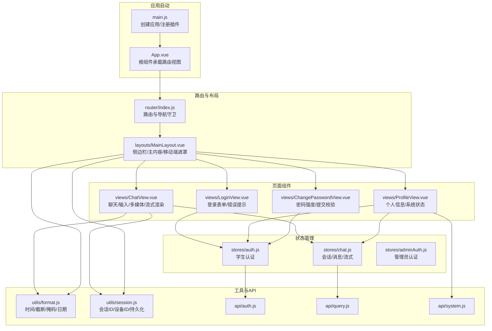
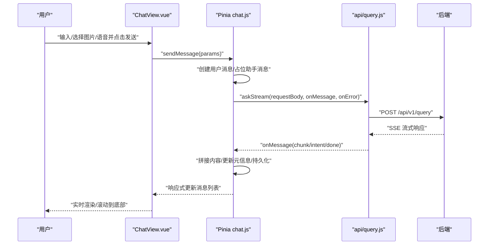
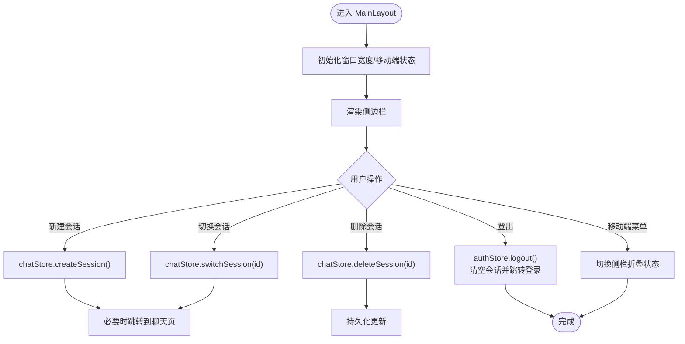
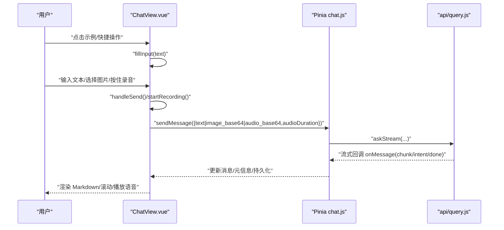
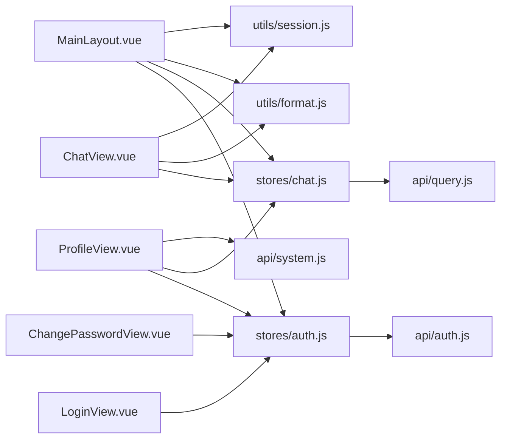

# 前端组件

<cite>
**本文引用的文件**
- [App.vue](file://frontend/ai_assistant/src/App.vue)
- [main.js](file://frontend/ai_assistant/src/main.js)
- [MainLayout.vue](file://frontend/ai_assistant/src/layouts/MainLayout.vue)
- [ChatView.vue](file://frontend/ai_assistant/src/views/ChatView.vue)
- [LoginView.vue](file://frontend/ai_assistant/src/views/LoginView.vue)
- [ProfileView.vue](file://frontend/ai_assistant/src/views/ProfileView.vue)
- [ChangePasswordView.vue](file://frontend/ai_assistant/src/views/ChangePasswordView.vue)
- [index.js](file://frontend/ai_assistant/src/router/index.js)
- [auth.js](file://frontend/ai_assistant/src/stores/auth.js)
- [chat.js](file://frontend/ai_assistant/src/stores/chat.js)
- [adminAuth.js](file://frontend/ai_assistant/src/stores/adminAuth.js)
- [auth.js](file://frontend/ai_assistant/src/api/auth.js)
- [query.js](file://frontend/ai_assistant/src/api/query.js)
- [system.js](file://frontend/ai_assistant/src/api/system.js)
- [format.js](file://frontend/ai_assistant/src/utils/format.js)
- [session.js](file://frontend/ai_assistant/src/utils/session.js)
- [global.css](file://frontend/ai_assistant/src/styles/global.css)
- [package.json](file://frontend/ai_assistant/package.json)
- [vite.config.js](file://frontend/ai_assistant/vite.config.js)
</cite>

## 目录
1. [简介](#简介)
2. [项目结构](#项目结构)
3. [核心组件](#核心组件)
4. [架构总览](#架构总览)
5. [详细组件分析](#详细组件分析)
6. [依赖关系分析](#依赖关系分析)
7. [性能考量](#性能考量)
8. [故障排查指南](#故障排查指南)
9. [结论](#结论)
10. [附录](#附录)

## 简介
本文件面向前端开发者，系统性梳理 AI 校园助手的 Vue 3 组件体系，覆盖布局组件、页面组件与工具组件，并深入讲解状态管理、数据流、通信机制、样式主题、响应式与移动端适配、性能优化、测试与调试方法，以及扩展与自定义建议。

## 项目结构
- 应用入口与根组件
  - 应用通过根组件承载路由视图，应用初始化注册 Pinia、路由与全局样式。
- 布局与页面
  - 布局组件负责侧边栏、移动端遮罩、主内容区与底部导航；页面组件分别承担聊天、登录、个人资料、修改密码等业务场景。
- 状态管理
  - 使用 Pinia 管理认证、聊天与管理员认证状态，提供会话持久化、消息流式渲染与加载状态。
- API 层
  - 封装认证、查询（含流式）、系统健康检查与版本查询等接口。
- 工具模块
  - 时间格式化、会话与设备标识管理、密码加密工具等。
- 样式与主题
  - 通过 CSS 变量统一主题色、阴影、圆角与过渡，支持暗/亮主题扩展。

图表来源
- [main.js:1-10](file://frontend/ai_assistant/src/main.js#L1-L10)
- [App.vue:1-7](file://frontend/ai_assistant/src/App.vue#L1-L7)
- [index.js:1-75](file://frontend/ai_assistant/src/router/index.js#L1-L75)
- [MainLayout.vue:1-487](file://frontend/ai_assistant/src/layouts/MainLayout.vue#L1-L487)
- [ChatView.vue:1-800](file://frontend/ai_assistant/src/views/ChatView.vue#L1-L800)
- [LoginView.vue:1-343](file://frontend/ai_assistant/src/views/LoginView.vue#L1-L343)
- [ProfileView.vue:1-380](file://frontend/ai_assistant/src/views/ProfileView.vue#L1-L380)
- [ChangePasswordView.vue:1-466](file://frontend/ai_assistant/src/views/ChangePasswordView.vue#L1-L466)
- [auth.js:1-77](file://frontend/ai_assistant/src/stores/auth.js#L1-L77)
- [chat.js:1-278](file://frontend/ai_assistant/src/stores/chat.js#L1-L278)
- [adminAuth.js:1-77](file://frontend/ai_assistant/src/stores/adminAuth.js#L1-L77)
- [auth.js:1-36](file://frontend/ai_assistant/src/api/auth.js#L1-L36)
- [query.js:1-141](file://frontend/ai_assistant/src/api/query.js#L1-L141)
- [system.js:1-18](file://frontend/ai_assistant/src/api/system.js#L1-L18)
- [format.js:1-67](file://frontend/ai_assistant/src/utils/format.js#L1-L67)
- [session.js:1-70](file://frontend/ai_assistant/src/utils/session.js#L1-L70)

章节来源
- [main.js:1-10](file://frontend/ai_assistant/src/main.js#L1-L10)
- [App.vue:1-7](file://frontend/ai_assistant/src/App.vue#L1-L7)
- [index.js:1-75](file://frontend/ai_assistant/src/router/index.js#L1-L75)

## 核心组件
- 根组件 App.vue
  - 功能：承载路由视图，作为应用顶层容器。
  - 依赖：router-view。
- 主布局 MainLayout.vue
  - 功能：左侧会话侧栏、顶部 Logo/关闭按钮、搜索、会话列表、底部导航、移动端遮罩与菜单、用户信息展示、响应式布局。
  - 交互：新建会话、切换会话、删除会话、登出、移动端侧栏开关。
  - 数据：依赖 Pinia 认证与聊天状态，计算窗口宽度与移动端状态。
- 聊天视图 ChatView.vue
  - 功能：欢迎屏、消息列表、Markdown 渲染、图片/语音输入、流式响应、意图与缓存/耗时元信息、滚动到底部。
  - 交互：示例问题填充、快捷操作、发送、录音、播放语音、删除消息。
  - 数据：依赖 Pinia 聊天状态，使用工具函数格式化时间与响应时间。
- 登录视图 LoginView.vue
  - 功能：学号/密码登录、显示/隐藏密码、错误提示、跳转管理员入口。
  - 交互：表单校验、提交登录、错误映射。
- 个人资料 ProfileView.vue
  - 功能：展示学号、令牌有效期、设备标识、会话/消息统计、清除数据、系统健康检查与版本查询。
  - 交互：刷新系统信息、清除所有会话。
- 修改密码 ChangePasswordView.vue
  - 功能：当前密码、新密码、确认密码输入，密码强度可视化，规则提示，提交修改。
  - 交互：表单校验、提交修改、错误映射。
- 状态管理
  - 认证 stores/auth.js：登录、修改密码、登出、本地存储与过期控制。
  - 聊天 stores/chat.js：会话 CRUD、消息发送（含流式）、搜索过滤、本地持久化。
  - 管理员认证 stores/adminAuth.js：管理员登录、登出、本地存储。
- API 层
  - 认证 api/auth.js：登录、修改密码。
  - 查询 api/query.js：普通请求与流式请求（SSE 兼容）、清除会话。
  - 系统 api/system.js：健康检查、版本查询。
- 工具模块
  - utils/format.js：时间格式化、响应时间格式化、截断、学号掩码、日期格式化。
  - utils/session.js：会话 ID 生成、设备 ID 生成与持久化、会话列表读写、当前会话 ID 读写。

章节来源
- [App.vue:1-7](file://frontend/ai_assistant/src/App.vue#L1-L7)
- [MainLayout.vue:1-487](file://frontend/ai_assistant/src/layouts/MainLayout.vue#L1-L487)
- [ChatView.vue:1-800](file://frontend/ai_assistant/src/views/ChatView.vue#L1-L800)
- [LoginView.vue:1-343](file://frontend/ai_assistant/src/views/LoginView.vue#L1-L343)
- [ProfileView.vue:1-380](file://frontend/ai_assistant/src/views/ProfileView.vue#L1-L380)
- [ChangePasswordView.vue:1-466](file://frontend/ai_assistant/src/views/ChangePasswordView.vue#L1-L466)
- [auth.js:1-77](file://frontend/ai_assistant/src/stores/auth.js#L1-L77)
- [chat.js:1-278](file://frontend/ai_assistant/src/stores/chat.js#L1-L278)
- [adminAuth.js:1-77](file://frontend/ai_assistant/src/stores/adminAuth.js#L1-L77)
- [auth.js:1-36](file://frontend/ai_assistant/src/api/auth.js#L1-L36)
- [query.js:1-141](file://frontend/ai_assistant/src/api/query.js#L1-L141)
- [system.js:1-18](file://frontend/ai_assistant/src/api/system.js#L1-L18)
- [format.js:1-67](file://frontend/ai_assistant/src/utils/format.js#L1-L67)
- [session.js:1-70](file://frontend/ai_assistant/src/utils/session.js#L1-L70)

## 架构总览
- 应用启动流程
  - main.js 创建应用实例，安装 Pinia 与路由，挂载根组件 App.vue。
  - App.vue 仅承载 router-view，实际布局与页面由路由装载。
- 路由与导航守卫
  - index.js 定义路由与导航守卫，区分游客/认证/管理员权限，未登录跳转登录页，已登录跳转主页。
- 状态与数据流
  - ChatView 通过 Pinia chatStore 发送消息，queryApi.askStream 接收流式数据，store 更新消息与加载状态。
  - LoginView 通过 authStore.login 触发登录，成功后跳转聊天页。
- 主题与样式
  - global.css 定义 CSS 变量与全局样式，组件通过变量实现主题一致性。

图表来源
- [ChatView.vue:312-333](file://frontend/ai_assistant/src/views/ChatView.vue#L312-L333)
- [chat.js:133-230](file://frontend/ai_assistant/src/stores/chat.js#L133-L230)
- [query.js:28-141](file://frontend/ai_assistant/src/api/query.js#L28-L141)

章节来源
- [main.js:1-10](file://frontend/ai_assistant/src/main.js#L1-L10)
- [index.js:57-73](file://frontend/ai_assistant/src/router/index.js#L57-L73)
- [chat.js:133-230](file://frontend/ai_assistant/src/stores/chat.js#L133-L230)
- [query.js:28-141](file://frontend/ai_assistant/src/api/query.js#L28-L141)

## 详细组件分析

### 布局组件 MainLayout
- 功能要点
  - 侧边栏：Logo、折叠按钮、新建会话、搜索框、会话列表（带过渡动画）、底部导航与用户信息。
  - 主内容区：移动端顶栏与 router-view。
  - 移动端遮罩：在展开侧栏时覆盖全屏，点击关闭侧栏。
- 响应式
  - 监听窗口宽度，小于阈值时默认折叠侧栏，移动端顶栏显示菜单按钮。
- 交互逻辑
  - 新建/切换/删除会话、登出、移动端侧栏开关。
- 数据与状态
  - 依赖 Pinia 认证与聊天状态，计算用户 ID 掩码与移动端状态。

图表来源
- [MainLayout.vue:118-175](file://frontend/ai_assistant/src/layouts/MainLayout.vue#L118-L175)
- [chat.js:66-101](file://frontend/ai_assistant/src/stores/chat.js#L66-L101)
- [auth.js:59-66](file://frontend/ai_assistant/src/stores/auth.js#L59-L66)

章节来源
- [MainLayout.vue:1-487](file://frontend/ai_assistant/src/layouts/MainLayout.vue#L1-L487)
- [chat.js:66-101](file://frontend/ai_assistant/src/stores/chat.js#L66-L101)
- [auth.js:59-66](file://frontend/ai_assistant/src/stores/auth.js#L59-L66)

### 聊天视图 ChatView
- 功能要点
  - 欢迎屏：示例问题与快捷操作。
  - 消息列表：用户/助手头像、图片/语音展示、Markdown 渲染、意图/缓存/耗时/设备标识元信息。
  - 输入区：文本域自适应高度、图片上传（前端压缩）、语音录制（WebRTC/MediaRecorder）、发送按钮禁用逻辑、底部锚点自动滚动。
- 交互与事件
  - 填充输入、发送消息、删除消息、播放语音、录音开始/停止/取消。
- 数据与状态
  - 依赖 chatStore.currentMessages/currentSession/loading 等计算属性；使用 format.js 与 marked 渲染。
- 性能与体验
  - 首条消息自动设为会话标题；消息列表使用 TransitionGroup 动画；滚动到底部优化体验。

图表来源
- [ChatView.vue:303-333](file://frontend/ai_assistant/src/views/ChatView.vue#L303-L333)
- [chat.js:133-230](file://frontend/ai_assistant/src/stores/chat.js#L133-L230)
- [query.js:28-141](file://frontend/ai_assistant/src/api/query.js#L28-L141)

章节来源
- [ChatView.vue:1-800](file://frontend/ai_assistant/src/views/ChatView.vue#L1-L800)
- [chat.js:133-230](file://frontend/ai_assistant/src/stores/chat.js#L133-L230)
- [query.js:28-141](file://frontend/ai_assistant/src/api/query.js#L28-L141)

### 登录视图 LoginView
- 功能要点
  - 学号/密码输入、显示/隐藏密码、错误提示、管理员入口。
- 交互与校验
  - 表单必填校验、提交登录、错误映射（401 等）。
- 状态与数据
  - 使用 authStore.login，成功后跳转聊天页。

章节来源
- [LoginView.vue:1-343](file://frontend/ai_assistant/src/views/LoginView.vue#L1-L343)
- [auth.js:29-43](file://frontend/ai_assistant/src/stores/auth.js#L29-L43)

### 个人资料 ProfileView
- 功能要点
  - 展示学号、令牌有效期、设备标识、会话/消息统计、清除数据、系统健康检查与版本查询。
- 交互与数据
  - 刷新系统信息（并发健康检查与版本查询），清除数据调用 chatStore.clearAllSessions。

章节来源
- [ProfileView.vue:1-380](file://frontend/ai_assistant/src/views/ProfileView.vue#L1-L380)
- [chat.js:104-116](file://frontend/ai_assistant/src/stores/chat.js#L104-L116)
- [system.js:9-18](file://frontend/ai_assistant/src/api/system.js#L9-L18)

### 修改密码 ChangePasswordView
- 功能要点
  - 当前密码、新密码、确认密码，密码强度可视化与规则提示，提交修改。
- 交互与校验
  - 前端校验（长度、大小写、数字、特殊字符、一致性），提交后根据状态码映射错误信息。

章节来源
- [ChangePasswordView.vue:1-466](file://frontend/ai_assistant/src/views/ChangePasswordView.vue#L1-L466)
- [auth.js:46-56](file://frontend/ai_assistant/src/stores/auth.js#L46-L56)

### 状态管理与工具
- 认证 stores/auth.js
  - 状态：token/studentId/expiresAt。
  - 计算：isAuthenticated。
  - 方法：login/changePassword/logout（本地存储与过期控制）。
- 聊天 stores/chat.js
  - 状态：sessions/activeSessionId/loadingStates/searchKeyword。
  - 计算：loading/currentSession/currentMessages/filteredSessions。
  - 方法：create/switch/delete/clear/deleteMessage/sendMessage（含流式）。
- 管理员认证 stores/adminAuth.js
  - 状态：token/adminId/username/displayName/role/expiresAt。
  - 计算：isAuthenticated。
  - 方法：login/logout。
- 工具模块
  - format.js：时间/响应时间/截断/学号掩码/日期。
  - session.js：会话 ID/设备 ID 生成与持久化、会话列表读写。

章节来源
- [auth.js:17-77](file://frontend/ai_assistant/src/stores/auth.js#L17-L77)
- [chat.js:22-278](file://frontend/ai_assistant/src/stores/chat.js#L22-L278)
- [adminAuth.js:16-77](file://frontend/ai_assistant/src/stores/adminAuth.js#L16-L77)
- [format.js:10-67](file://frontend/ai_assistant/src/utils/format.js#L10-L67)
- [session.js:14-70](file://frontend/ai_assistant/src/utils/session.js#L14-L70)

## 依赖关系分析
- 组件依赖
  - ChatView 依赖 chatStore 与 format/session 工具。
  - LoginView 依赖 authStore。
  - ProfileView 依赖 authStore/chatStore/systemApi。
  - ChangePasswordView 依赖 authStore。
  - MainLayout 依赖 authStore/chatStore/format/session。
- 外部依赖
  - Vue 3、Vue Router、Pinia、Axios、CryptoJS、UUID、Marked。
- 开发依赖
  - Vite、@vitejs/plugin-vue。

图表来源
- [ChatView.vue:224-226](file://frontend/ai_assistant/src/views/ChatView.vue#L224-L226)
- [LoginView.vue:81-84](file://frontend/ai_assistant/src/views/LoginView.vue#L81-L84)
- [ProfileView.vue:100-103](file://frontend/ai_assistant/src/views/ProfileView.vue#L100-L103)
- [ChangePasswordView.vue:138-140](file://frontend/ai_assistant/src/views/ChangePasswordView.vue#L138-L140)
- [MainLayout.vue:121-128](file://frontend/ai_assistant/src/layouts/MainLayout.vue#L121-L128)
- [chat.js:10-20](file://frontend/ai_assistant/src/stores/chat.js#L10-L20)
- [auth.js:9-11](file://frontend/ai_assistant/src/stores/auth.js#L9-L11)
- [system.js:6](file://frontend/ai_assistant/src/api/system.js#L6)
- [query.js:5](file://frontend/ai_assistant/src/api/query.js#L5)
- [auth.js:6](file://frontend/ai_assistant/src/api/auth.js#L6)

章节来源
- [package.json:11-23](file://frontend/ai_assistant/package.json#L11-L23)
- [vite.config.js:1-23](file://frontend/ai_assistant/vite.config.js#L1-L23)

## 性能考量
- 组件渲染优化
  - 使用 TransitionGroup 实现列表项动画，减少不必要的整块重绘。
  - 消息列表使用自适应高度与滚动到底部，避免频繁布局抖动。
- 状态与持久化
  - 聊天状态与会话列表本地持久化，减少重复请求与初始化成本。
  - loadingStates 仅针对活跃会话，避免全局状态膨胀。
- 网络与流式
  - queryApi.askStream 支持流式输出，逐步渲染提升感知速度；兜底处理未发送 done 的情况。
- 媒体与资源
  - 图片上传前端压缩（最大边 1024，JPEG 质量 0.7），降低带宽与服务器压力。
  - 语音录制时长与数据量前置校验，避免无效请求。
- 主题与样式
  - CSS 变量集中管理，便于主题切换与维护；滚动条样式统一。

[本节为通用性能建议，无需特定文件引用]

## 故障排查指南
- 登录失败
  - 检查后端返回状态码与 detail，401 显示学号/密码错误，其他显示网络或服务异常。
- 流式响应异常
  - 确认 Authorization 头与 /api/v1/query 路径；检查 SSE 格式兼容与 done 标记。
- 语音录制失败
  - 检查浏览器麦克风权限；录音时长过短或数据过小会提示并阻止发送。
- 会话数据异常
  - 清除本地存储中的会话键值，或通过 ProfileView 清空所有会话。
- 样式主题问题
  - 确认 CSS 变量是否被覆盖；检查全局样式是否正确引入。

章节来源
- [LoginView.vue:94-121](file://frontend/ai_assistant/src/views/LoginView.vue#L94-L121)
- [query.js:34-141](file://frontend/ai_assistant/src/api/query.js#L34-L141)
- [ChatView.vue:400-481](file://frontend/ai_assistant/src/views/ChatView.vue#L400-L481)
- [ProfileView.vue:169-174](file://frontend/ai_assistant/src/views/ProfileView.vue#L169-L174)
- [global.css:12-48](file://frontend/ai_assistant/src/styles/global.css#L12-L48)

## 结论
本项目采用清晰的分层架构：布局组件承载导航与会话管理，页面组件聚焦业务功能，Pinia 管理状态与持久化，API 层抽象网络请求，工具模块提供通用能力。通过 CSS 变量与响应式设计实现一致的主题与良好的移动端体验。整体具备良好的可扩展性与可维护性，适合进一步增强主题系统、国际化与无障碍支持。

[本节为总结，无需特定文件引用]

## 附录

### 组件通信与数据传递
- Props/Events
  - 本项目以 Pinia 状态共享为主，组件间通过 store 访问与更新状态，未见显式 props/event 定义。
- 插槽
  - 未发现具名/作用域插槽使用。

[本节为概览，无需特定文件引用]

### 样式定制与主题支持
- 主题变量
  - 通过 :root 定义主色、强调色、背景、边框、文字、语义色、阴影、圆角与过渡。
- 组件样式
  - 组件内部使用变量实现主题一致性，支持通过覆盖变量实现主题切换。
- 响应式
  - 媒体查询适配移动端布局与输入控件。

章节来源
- [global.css:12-48](file://frontend/ai_assistant/src/styles/global.css#L12-L48)
- [MainLayout.vue:471-486](file://frontend/ai_assistant/src/layouts/MainLayout.vue#L471-L486)
- [LoginView.vue:332-342](file://frontend/ai_assistant/src/views/LoginView.vue#L332-L342)
- [ProfileView.vue:372-379](file://frontend/ai_assistant/src/views/ProfileView.vue#L372-L379)
- [ChangePasswordView.vue:454-465](file://frontend/ai_assistant/src/views/ChangePasswordView.vue#L454-L465)

### 响应式设计与移动端适配
- 布局
  - 侧栏固定定位与 transform 切换，移动端遮罩覆盖全屏。
- 输入与媒体
  - 文本域自适应高度、图片压缩、语音录制与播放。
- 导航
  - 移动端顶栏菜单按钮，路由高亮与导航守卫保障权限。

章节来源
- [MainLayout.vue:95-114](file://frontend/ai_assistant/src/layouts/MainLayout.vue#L95-L114)
- [ChatView.vue:288-300](file://frontend/ai_assistant/src/views/ChatView.vue#L288-L300)
- [ChatView.vue:335-395](file://frontend/ai_assistant/src/views/ChatView.vue#L335-L395)
- [ChatView.vue:397-525](file://frontend/ai_assistant/src/views/ChatView.vue#L397-L525)

### 测试方法与调试技巧
- 单元测试
  - 对工具函数（format.js、session.js）编写单元测试，覆盖边界条件（空值、超长、掩码）。
- 集成测试
  - 使用 mock API 测试 ChatView 的流式渲染与错误处理；模拟本地存储验证会话持久化。
- 调试技巧
  - 在 store 中打印关键状态变更；在 queryApi 中捕获并记录流式片段；使用浏览器开发者工具监控网络与存储。
- 性能分析
  - 使用浏览器性能面板观察渲染帧率与布局抖动；对图片压缩与滚动行为进行节流/防抖优化。

[本节为通用指导，无需特定文件引用]

### 扩展与自定义建议
- 主题扩展
  - 新增 CSS 变量与主题切换函数，动态替换 :root 变量。
- 组件扩展
  - 将常用 UI 抽象为通用组件（如消息气泡、输入框、按钮），复用逻辑与样式。
- 功能增强
  - 增加 Markdown 预览、消息导出、多轮上下文管理、意图分类可视化。
- 国际化与无障碍
  - 引入 i18n 与无障碍标签，完善键盘导航与屏幕阅读器支持。

[本节为通用建议，无需特定文件引用]