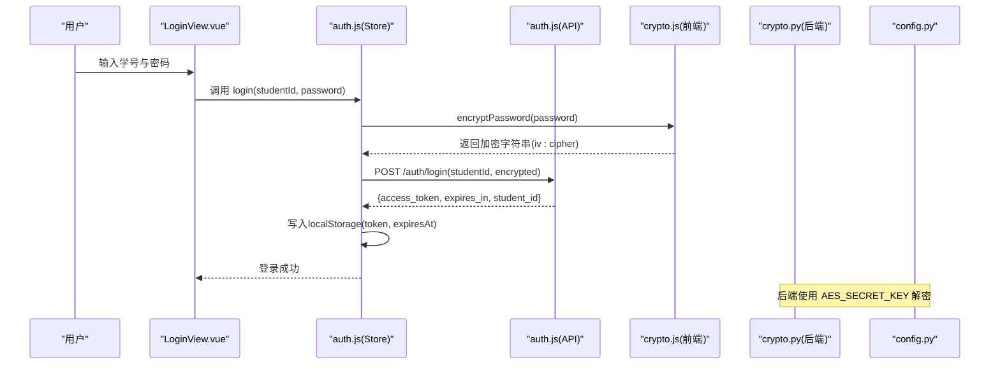
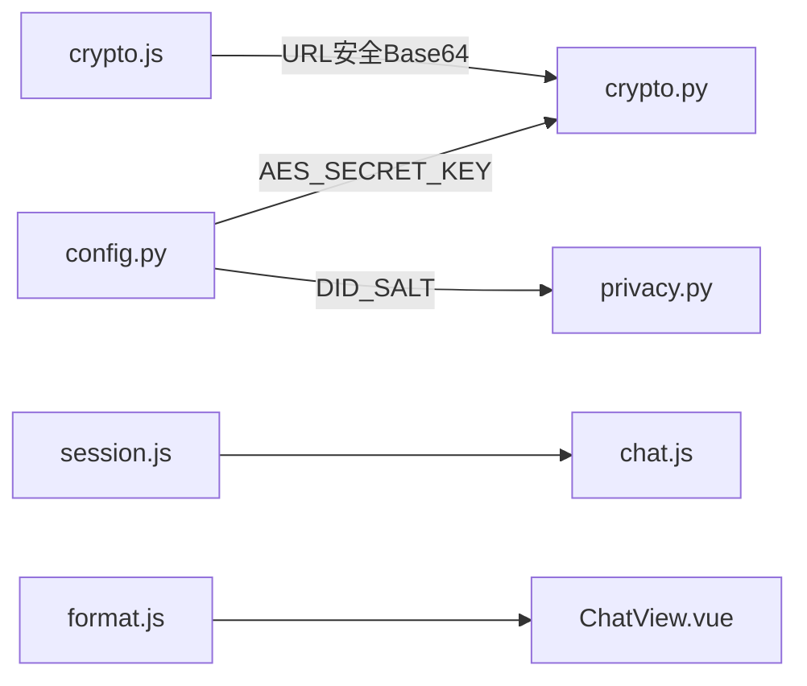
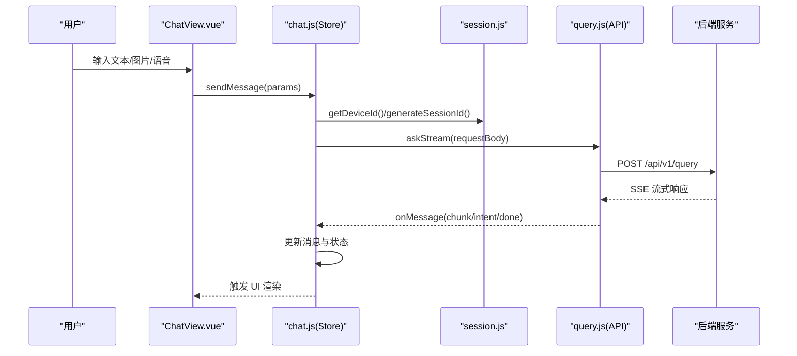

# 工具函数

<cite>
**本文引用的文件**
- [crypto.js](file://frontend/ai_assistant/src/utils/crypto.js)
- [format.js](file://frontend/ai_assistant/src/utils/format.js)
- [session.js](file://frontend/ai_assistant/src/utils/session.js)
- [crypto.py](file://service/ai_assistant/app/utils/crypto.py)
- [privacy.py](file://service/ai_assistant/app/utils/privacy.py)
- [config.py](file://service/ai_assistant/app/config.py)
- [auth.js](file://frontend/ai_assistant/src/stores/auth.js)
- [chat.js](file://frontend/ai_assistant/src/stores/chat.js)
- [auth.js](file://frontend/ai_assistant/src/api/auth.js)
- [query.js](file://frontend/ai_assistant/src/api/query.js)
- [LoginView.vue](file://frontend/ai_assistant/src/views/LoginView.vue)
- [ChatView.vue](file://frontend/ai_assistant/src/views/ChatView.vue)
- [logger.py](file://service/ai_assistant/app/utils/logger.py)
</cite>

## 目录
1. [简介](#简介)
2. [项目结构](#项目结构)
3. [核心组件](#核心组件)
4. [架构总览](#架构总览)
5. [详细组件分析](#详细组件分析)
6. [依赖分析](#依赖分析)
7. [性能考量](#性能考量)
8. [故障排查指南](#故障排查指南)
9. [结论](#结论)
10. [附录](#附录)

## 简介
本文件系统性梳理 AI 校园助手的工具函数体系，覆盖以下方面：
- 加密工具：前端 AES-CBC 密码加密与后端解密的双向实现与一致性校验
- 格式化工具：时间、响应时长、字符串截断、学号掩码、日期格式化
- 会话管理工具：会话 ID 生成、设备 ID（DID）持久化、会话列表存储与活跃会话切换
- 安全机制与过期处理：JWT 过期控制、本地存储令牌与过期时间、错误消息解析
- 国际化与可扩展性：格式化规则与可定制点、加密算法选择与安全建议
- 测试与性能：测试方法建议与性能优化要点

## 项目结构
工具函数主要分布在前端 utils 与后端 app/utils 两个目录，并在业务 Store 与 View 中被广泛使用。

```mermaid
graph TB
subgraph "前端"
FE_CRYPTO["utils/crypto.js<br/>前端密码加密"]
FE_FORMAT["utils/format.js<br/>格式化工具"]
FE_SESSION["utils/session.js<br/>会话与设备ID"]
FE_STORE_AUTH["stores/auth.js<br/>认证状态"]
FE_STORE_CHAT["stores/chat.js<br/>聊天状态"]
FE_VIEW_LOGIN["views/LoginView.vue<br/>登录视图"]
FE_VIEW_CHAT["views/ChatView.vue<br/>聊天视图"]
end
subgraph "后端"
BE_CRYPTO["app/utils/crypto.py<br/>后端密码解密"]
BE_PRIVACY["app/utils/privacy.py<br/>DID 生成"]
BE_CONFIG["app/config.py<br/>配置与密钥"]
BE_LOGGER["app/utils/logger.py<br/>日志"]
end
FE_STORE_AUTH --> FE_CRYPTO
FE_STORE_CHAT --> FE_SESSION
FE_VIEW_LOGIN --> FE_STORE_AUTH
FE_VIEW_CHAT --> FE_STORE_CHAT
FE_STORE_CHAT --> FE_FORMAT
FE_STORE_CHAT --> BE_PRIVACY
BE_CRYPTO <- --> BE_CONFIG
BE_LOGGER -.-> BE_CRYPTO
```

图表来源
- [crypto.js:1-40](file://frontend/ai_assistant/src/utils/crypto.js#L1-L40)
- [format.js:1-67](file://frontend/ai_assistant/src/utils/format.js#L1-L67)
- [session.js:1-70](file://frontend/ai_assistant/src/utils/session.js#L1-L70)
- [auth.js:1-77](file://frontend/ai_assistant/src/stores/auth.js#L1-L77)
- [chat.js:1-278](file://frontend/ai_assistant/src/stores/chat.js#L1-L278)
- [crypto.py:1-73](file://service/ai_assistant/app/utils/crypto.py#L1-L73)
- [privacy.py:1-23](file://service/ai_assistant/app/utils/privacy.py#L1-L23)
- [config.py:1-113](file://service/ai_assistant/app/config.py#L1-L113)
- [logger.py:1-53](file://service/ai_assistant/app/utils/logger.py#L1-L53)

章节来源
- [crypto.js:1-40](file://frontend/ai_assistant/src/utils/crypto.js#L1-L40)
- [format.js:1-67](file://frontend/ai_assistant/src/utils/format.js#L1-L67)
- [session.js:1-70](file://frontend/ai_assistant/src/utils/session.js#L1-L70)
- [auth.js:1-77](file://frontend/ai_assistant/src/stores/auth.js#L1-L77)
- [chat.js:1-278](file://frontend/ai_assistant/src/stores/chat.js#L1-L278)
- [crypto.py:1-73](file://service/ai_assistant/app/utils/crypto.py#L1-L73)
- [privacy.py:1-23](file://service/ai_assistant/app/utils/privacy.py#L1-L23)
- [config.py:1-113](file://service/ai_assistant/app/config.py#L1-L113)
- [logger.py:1-53](file://service/ai_assistant/app/utils/logger.py#L1-L53)

## 核心组件
- 加密工具（前端）：提供 AES-CBC 密码加密，输出格式为 iv_base64:ciphertext_base64，采用 URL 安全 Base64 编码
- 格式化工具：提供时间相对显示、响应时长单位转换、字符串截断、学号掩码、日期格式化
- 会话管理工具：生成会话 ID、获取/生成设备 ID（DID）、持久化会话列表与活跃会话切换
- 后端解密工具：与前端一致的解密流程，验证格式与长度，返回明文密码
- 隐私工具：基于学生 ID 与盐值生成稳定的 DID，用于日志与追踪脱敏

章节来源
- [crypto.js:26-40](file://frontend/ai_assistant/src/utils/crypto.js#L26-L40)
- [format.js:10-67](file://frontend/ai_assistant/src/utils/format.js#L10-L67)
- [session.js:17-70](file://frontend/ai_assistant/src/utils/session.js#L17-L70)
- [crypto.py:39-73](file://service/ai_assistant/app/utils/crypto.py#L39-L73)
- [privacy.py:9-23](file://service/ai_assistant/app/utils/privacy.py#L9-L23)

## 架构总览
前端工具函数与后端工具函数协同工作，贯穿认证与聊天两大场景：
- 认证流程：前端加密密码 → 后端解密比对 → 生成 JWT 并设置过期时间 → 前端持久化令牌与过期时间
- 聊天流程：生成会话 ID 与设备 ID → 发送消息携带 session_id 与 did → 流式接收响应并更新 UI



图表来源
- [LoginView.vue:94-121](file://frontend/ai_assistant/src/views/LoginView.vue#L94-L121)
- [auth.js:29-43](file://frontend/ai_assistant/src/stores/auth.js#L29-L43)
- [auth.js:15-20](file://frontend/ai_assistant/src/api/auth.js#L15-L20)
- [crypto.js:26-40](file://frontend/ai_assistant/src/utils/crypto.js#L26-L40)
- [crypto.py:39-73](file://service/ai_assistant/app/utils/crypto.py#L39-L73)
- [config.py:38-40](file://service/ai_assistant/app/config.py#L38-L40)

## 详细组件分析

### 加密工具（前端）
- 功能
  - 生成随机 IV（16 字节）
  - 使用 AES-CBC + PKCS7 填充加密明文
  - 将 IV 与密文分别进行 URL 安全 Base64 编码并拼接为 iv_base64:ciphertext_base64
- 参数
  - plainText: 待加密的字符串（密码）
- 返回值
  - 字符串：格式为 iv_base64:ciphertext_base64
- 关键点
  - 密钥来自环境变量 VITE_AES_SECRET_KEY，需与后端一致
  - Base64 编码替换 + - 与 / _，并去除尾部 =，保证 URL 安全
- 使用示例路径
  - [encryptPassword 调用处](file://frontend/ai_assistant/src/stores/auth.js#L30)
  - [修改密码加密调用:47-53](file://frontend/ai_assistant/src/stores/auth.js#L47-L53)

章节来源
- [crypto.js:9-40](file://frontend/ai_assistant/src/utils/crypto.js#L9-L40)
- [auth.js:29-56](file://frontend/ai_assistant/src/stores/auth.js#L29-L56)

### 后端解密工具（Python）
- 功能
  - 从配置读取 AES 密钥（16/24/32 字符）
  - 还原 URL 安全 Base64 编码并校验 IV 长度（16 字节）
  - 使用 AES-CBC 解密并去除 PKCS7 填充，返回明文
- 参数
  - encrypted_data: 前端加密生成的字符串 iv_base64:ciphertext_base64
- 返回值
  - 明文密码字符串（UTF-8）
- 错误处理
  - 格式缺失、长度不合法、解密失败均抛出异常
- 使用示例路径
  - [后端认证路由中使用解密:1-200](file://service/ai_assistant/app/routers/auth.py#L1-L200)（调用 decrypt_password）

章节来源
- [crypto.py:17-73](file://service/ai_assistant/app/utils/crypto.py#L17-L73)
- [config.py:38-40](file://service/ai_assistant/app/config.py#L38-L40)

### 格式化工具
- 时间格式化（相对时间）
  - 输入：时间戳或 Date 对象
  - 输出：刚刚、X分钟前、X小时前、X天前、或 YYYY-MM-DD HH:mm
- 响应时长格式化
  - 输入：毫秒数
  - 输出：Xms 或 X.Xs
- 字符串截断
  - 输入：字符串与最大长度
  - 输出：截断并追加 ...
- 学号掩码
  - 输入：学号字符串
  - 输出：保留前缀与后缀，中间用 **** 替代
- 日期格式化
  - 输入：时间戳或 Date 对象
  - 输出：YYYY-MM-DD

使用示例路径
- [时间格式化在聊天视图使用:114-125](file://frontend/ai_assistant/src/views/ChatView.vue#L114-L125)
- [响应时长格式化在聊天视图使用:123-125](file://frontend/ai_assistant/src/views/ChatView.vue#L123-L125)

章节来源
- [format.js:10-67](file://frontend/ai_assistant/src/utils/format.js#L10-L67)
- [ChatView.vue:114-125](file://frontend/ai_assistant/src/views/ChatView.vue#L114-L125)

### 会话管理工具
- 会话 ID 生成
  - 使用 UUID v4，移除连字符并加前缀 sess_
- 设备 ID（DID）管理
  - 首次访问生成 did_uuid 并持久化至 localStorage；后续直接读取
- 会话列表持久化
  - 以 campus_ai_sessions 为键，JSON 序列化存储数组
- 活跃会话管理
  - 以 campus_ai_active_session 为键，存储当前会话 ID；支持设置与移除

使用示例路径
- [生成会话 ID 与设备 ID:66-142](file://frontend/ai_assistant/src/stores/chat.js#L66-L142)
- [持久化与切换活跃会话:60-101](file://frontend/ai_assistant/src/stores/chat.js#L60-L101)

章节来源
- [session.js:17-70](file://frontend/ai_assistant/src/utils/session.js#L17-L70)
- [chat.js:60-101](file://frontend/ai_assistant/src/stores/chat.js#L60-L101)

### 隐私与 DID 生成
- 功能
  - 基于 student_id 与盐值（DID_SALT）生成稳定的 SHA-256 十六进制字符串
  - 用于聊天日志中替代真实学号，实现隐私保护
- 参数
  - student_id: 学生真实 ID
- 返回值
  - 64 字符十六进制字符串

使用示例路径
- [DID 生成调用](file://frontend/ai_assistant/src/stores/chat.js#L175)

章节来源
- [privacy.py:9-23](file://service/ai_assistant/app/utils/privacy.py#L9-L23)
- [chat.js](file://frontend/ai_assistant/src/stores/chat.js#L175)

### 安全机制与过期处理
- JWT 过期控制
  - 后端配置 JWT_EXPIRE_MINUTES（默认 1 天），登录成功后计算过期时间并写入 localStorage
  - 前端计算当前时间与过期时间比较，决定是否认证有效
- 错误消息解析
  - 统一解析后端错误与网络异常，提供用户可读提示

使用示例路径
- [JWT 过期时间计算与存储:34-40](file://frontend/ai_assistant/src/stores/auth.js#L34-L40)
- [错误解析逻辑:235-257](file://frontend/ai_assistant/src/stores/chat.js#L235-L257)

章节来源
- [config.py:32-36](file://service/ai_assistant/app/config.py#L32-L36)
- [auth.js:24-26](file://frontend/ai_assistant/src/stores/auth.js#L24-L26)
- [auth.js:34-40](file://frontend/ai_assistant/src/stores/auth.js#L34-L40)
- [chat.js:235-257](file://frontend/ai_assistant/src/stores/chat.js#L235-L257)

### 国际化支持
- 当前格式化工具为中文本地化（例如“刚刚”、“分钟前”等），若需国际化，可在工具函数中引入语言环境参数或外部 i18n 库，将文案映射到不同语言资源文件。

章节来源
- [format.js:18-24](file://frontend/ai_assistant/src/utils/format.js#L18-L24)

### 扩展与自定义指导
- 加密算法扩展
  - 若更换加密方案，需同时更新前后端实现与密钥长度要求，并保持编码格式一致
- 格式化扩展
  - 新增格式化函数时，建议提供默认参数与边界处理，便于多组件复用
- 会话管理扩展
  - 可增加会话标签、归档策略、跨设备同步等能力，但需注意本地存储容量与性能

章节来源
- [crypto.js:26-40](file://frontend/ai_assistant/src/utils/crypto.js#L26-L40)
- [format.js:10-67](file://frontend/ai_assistant/src/utils/format.js#L10-L67)
- [session.js:17-70](file://frontend/ai_assistant/src/utils/session.js#L17-L70)

## 依赖分析
- 前端依赖
  - crypto.js 依赖 CryptoJS 与环境变量密钥
  - session.js 依赖 uuid 与 localStorage
  - format.js 为纯 JS 工具函数，无外部依赖
- 后端依赖
  - crypto.py 依赖 pycryptodome 与配置项 AES_SECRET_KEY
  - privacy.py 依赖 hashlib 与配置项 DID_SALT
- 前后端耦合点
  - 加密格式与密钥长度必须一致
  - DID 生成依赖后端盐值



图表来源
- [crypto.js:7-9](file://frontend/ai_assistant/src/utils/crypto.js#L7-L9)
- [crypto.py:17-22](file://service/ai_assistant/app/utils/crypto.py#L17-L22)
- [privacy.py:21-22](file://service/ai_assistant/app/utils/privacy.py#L21-L22)
- [session.js](file://frontend/ai_assistant/src/utils/session.js#L8)
- [chat.js:13-20](file://frontend/ai_assistant/src/stores/chat.js#L13-L20)
- [format.js:1-3](file://frontend/ai_assistant/src/utils/format.js#L1-L3)
- [ChatView.vue](file://frontend/ai_assistant/src/views/ChatView.vue#L225)

章节来源
- [crypto.js:7-9](file://frontend/ai_assistant/src/utils/crypto.js#L7-L9)
- [crypto.py:17-22](file://service/ai_assistant/app/utils/crypto.py#L17-L22)
- [privacy.py:21-22](file://service/ai_assistant/app/utils/privacy.py#L21-L22)
- [session.js](file://frontend/ai_assistant/src/utils/session.js#L8)
- [chat.js:13-20](file://frontend/ai_assistant/src/stores/chat.js#L13-L20)
- [format.js:1-3](file://frontend/ai_assistant/src/utils/format.js#L1-L3)
- [ChatView.vue](file://frontend/ai_assistant/src/views/ChatView.vue#L225)

## 性能考量
- 加密性能
  - AES-CBC 在现代浏览器中性能良好；建议避免在主线程频繁执行大量加密操作
- 前端存储
  - localStorage 读写为同步阻塞，建议批量持久化（如聊天 store 中的 persist 调用时机）
- 格式化函数
  - 时间与字符串处理为 O(n) 复杂度，通常可忽略；注意在高频渲染场景下减少重复计算
- 日志与调试
  - 后端日志落盘与旋转策略有助于定位性能瓶颈，建议仅在开发环境开启详细日志

章节来源
- [logger.py:28-43](file://service/ai_assistant/app/utils/logger.py#L28-L43)
- [chat.js:61-63](file://frontend/ai_assistant/src/stores/chat.js#L61-L63)

## 故障排查指南
- 密码加密/解密失败
  - 检查前端密钥是否与后端一致，且长度满足 16/24/32 字符
  - 确认加密格式为 iv_base64:ciphertext_base64，且 Base64 编码为 URL 安全
- 会话/设备 ID 异常
  - 清理 localStorage 中相关键值，重新生成
- 登录过期或 401
  - 检查本地过期时间是否正确写入与计算
- 错误消息不友好
  - 使用聊天 store 的错误解析逻辑，结合后端 detail 字段进行提示

章节来源
- [crypto.py:52-71](file://service/ai_assistant/app/utils/crypto.py#L52-L71)
- [session.js:24-30](file://frontend/ai_assistant/src/utils/session.js#L24-L30)
- [auth.js:24-26](file://frontend/ai_assistant/src/stores/auth.js#L24-L26)
- [chat.js:235-257](file://frontend/ai_assistant/src/stores/chat.js#L235-L257)

## 结论
本工具函数体系在前端与后端之间建立了安全、一致的数据通道，并在聊天与认证场景中提供了良好的用户体验。通过明确的格式规范、严格的错误处理与可扩展的设计，开发者可以在此基础上进一步增强功能与安全性。

## 附录

### API 工作流（序列图：聊天消息发送）


图表来源
- [ChatView.vue:312-333](file://frontend/ai_assistant/src/views/ChatView.vue#L312-L333)
- [chat.js:133-230](file://frontend/ai_assistant/src/stores/chat.js#L133-L230)
- [session.js:17-31](file://frontend/ai_assistant/src/utils/session.js#L17-L31)
- [query.js:28-141](file://frontend/ai_assistant/src/api/query.js#L28-L141)