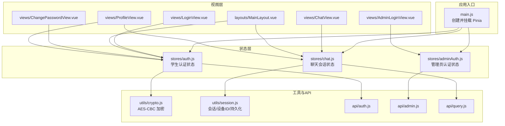
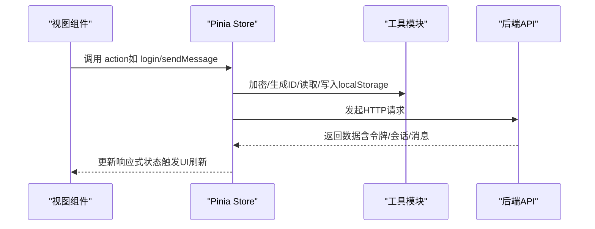
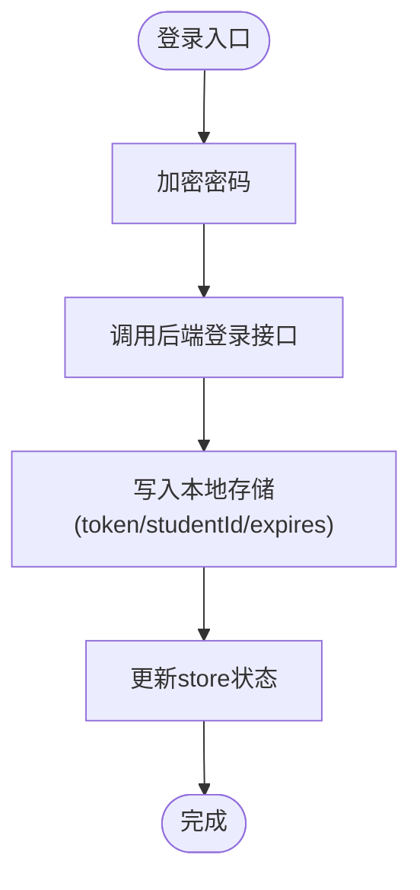
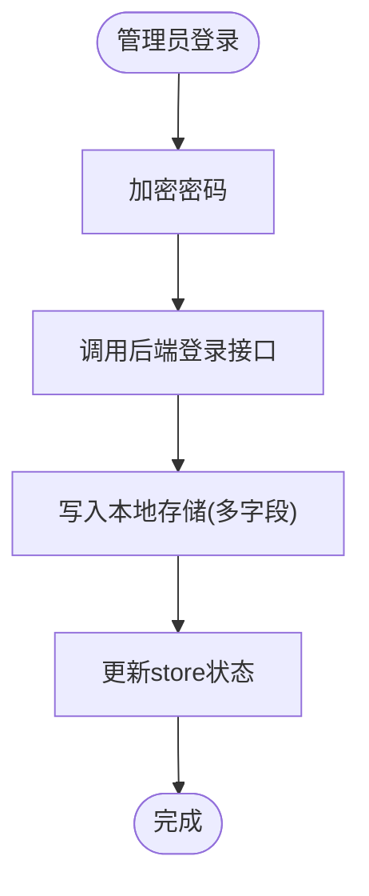
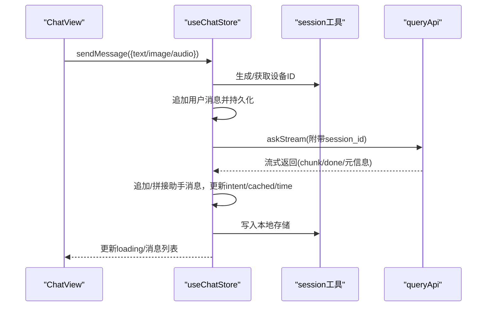
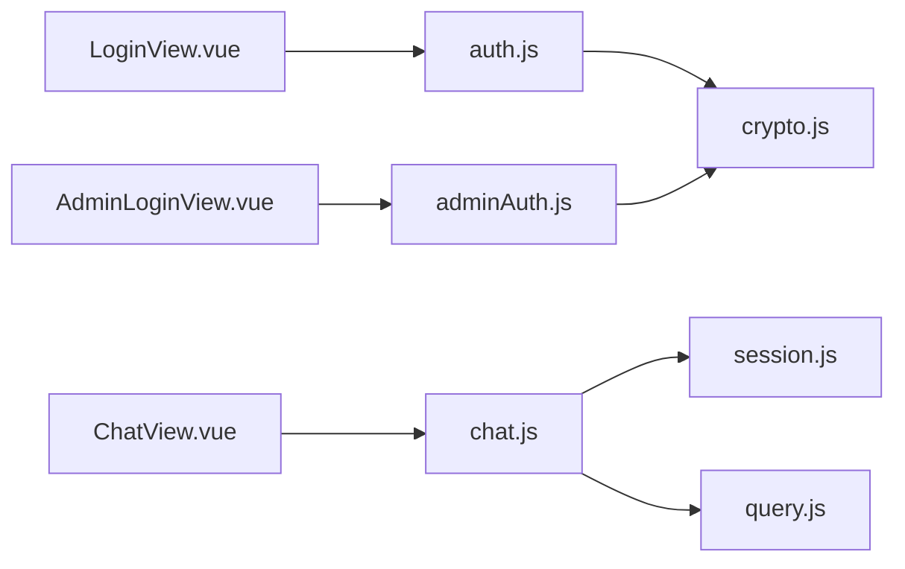

# 状态管理

<cite>
**本文引用的文件**
- [frontend/ai_assistant/src/main.js](file://frontend/ai_assistant/src/main.js)
- [frontend/ai_assistant/package.json](file://frontend/ai_assistant/package.json)
- [frontend/ai_assistant/src/stores/auth.js](file://frontend/ai_assistant/src/stores/auth.js)
- [frontend/ai_assistant/src/stores/adminAuth.js](file://frontend/ai_assistant/src/stores/adminAuth.js)
- [frontend/ai_assistant/src/stores/chat.js](file://frontend/ai_assistant/src/stores/chat.js)
- [frontend/ai_assistant/src/utils/session.js](file://frontend/ai_assistant/src/utils/session.js)
- [frontend/ai_assistant/src/utils/crypto.js](file://frontend/ai_assistant/src/utils/crypto.js)
- [frontend/ai_assistant/src/api/auth.js](file://frontend/ai_assistant/src/api/auth.js)
- [frontend/ai_assistant/src/api/admin.js](file://frontend/ai_assistant/src/api/admin.js)
- [frontend/ai_assistant/src/api/query.js](file://frontend/ai_assistant/src/api/query.js)
- [frontend/ai_assistant/src/views/LoginView.vue](file://frontend/ai_assistant/src/views/LoginView.vue)
- [frontend/ai_assistant/src/views/AdminLoginView.vue](file://frontend/ai_assistant/src/views/AdminLoginView.vue)
- [frontend/ai_assistant/src/views/ChatView.vue](file://frontend/ai_assistant/src/views/ChatView.vue)
- [frontend/ai_assistant/src/layouts/MainLayout.vue](file://frontend/ai_assistant/src/layouts/MainLayout.vue)
- [frontend/ai_assistant/src/views/ChangePasswordView.vue](file://frontend/ai_assistant/src/views/ChangePasswordView.vue)
- [frontend/ai_assistant/src/views/ProfileView.vue](file://frontend/ai_assistant/src/views/ProfileView.vue)
</cite>

## 目录
1. [简介](#简介)
2. [项目结构](#项目结构)
3. [核心组件](#核心组件)
4. [架构总览](#架构总览)
5. [详细组件分析](#详细组件分析)
6. [依赖分析](#依赖分析)
7. [性能考虑](#性能考虑)
8. [故障排查指南](#故障排查指南)
9. [结论](#结论)
10. [附录](#附录)

## 简介
本文件面向“AI校园助手”前端项目，系统性梳理基于 Pinia 的状态管理实现与最佳实践，覆盖以下主题：
- 用户认证状态（学生）、管理员状态与聊天会话状态的定义、getter、action 与持久化机制
- 状态在组件间的共享与通信方式
- 初始化、更新与清理流程
- 调试方法与开发工具使用建议
- 状态扩展与自定义指导
- 与 Vuex 的对比与迁移注意事项

## 项目结构
前端采用 Vue 3 + Pinia 架构，状态集中在 stores 目录下，配合 utils 与 api 层完成加密、会话持久化与后端交互。

图表来源
- [frontend/ai_assistant/src/main.js:1-10](file://frontend/ai_assistant/src/main.js#L1-L10)
- [frontend/ai_assistant/src/stores/auth.js:1-77](file://frontend/ai_assistant/src/stores/auth.js#L1-L77)
- [frontend/ai_assistant/src/stores/adminAuth.js:1-77](file://frontend/ai_assistant/src/stores/adminAuth.js#L1-L77)
- [frontend/ai_assistant/src/stores/chat.js:1-278](file://frontend/ai_assistant/src/stores/chat.js#L1-L278)
- [frontend/ai_assistant/src/utils/crypto.js:1-40](file://frontend/ai_assistant/src/utils/crypto.js#L1-L40)
- [frontend/ai_assistant/src/utils/session.js:1-70](file://frontend/ai_assistant/src/utils/session.js#L1-L70)
- [frontend/ai_assistant/src/api/auth.js:1-36](file://frontend/ai_assistant/src/api/auth.js#L1-L36)
- [frontend/ai_assistant/src/api/admin.js:1-41](file://frontend/ai_assistant/src/api/admin.js#L1-L41)
- [frontend/ai_assistant/src/api/query.js:1-141](file://frontend/ai_assistant/src/api/query.js#L1-L141)
- [frontend/ai_assistant/src/views/LoginView.vue:1-343](file://frontend/ai_assistant/src/views/LoginView.vue#L1-L343)
- [frontend/ai_assistant/src/views/AdminLoginView.vue:1-261](file://frontend/ai_assistant/src/views/AdminLoginView.vue#L1-L261)
- [frontend/ai_assistant/src/views/ChatView.vue:1-1168](file://frontend/ai_assistant/src/views/ChatView.vue#L1-L1168)
- [frontend/ai_assistant/src/layouts/MainLayout.vue:120-127](file://frontend/ai_assistant/src/layouts/MainLayout.vue#L120-L127)
- [frontend/ai_assistant/src/views/ChangePasswordView.vue:137-139](file://frontend/ai_assistant/src/views/ChangePasswordView.vue#L137-L139)
- [frontend/ai_assistant/src/views/ProfileView.vue:99-105](file://frontend/ai_assistant/src/views/ProfileView.vue#L99-L105)

章节来源
- [frontend/ai_assistant/src/main.js:1-10](file://frontend/ai_assistant/src/main.js#L1-L10)
- [frontend/ai_assistant/package.json:1-24](file://frontend/ai_assistant/package.json#L1-L24)

## 核心组件
本项目的状态管理由三个 Pinia Store 组成：学生认证、管理员认证与聊天会话。它们分别负责：
- 认证状态：令牌、用户标识、过期时间、登录/修改密码/登出动作，以及本地持久化
- 管理员认证：管理员令牌、身份信息、角色、登录/登出动作，以及本地持久化
- 聊天会话：会话列表、当前会话、消息列表、搜索过滤、消息发送与流式渲染、本地持久化

章节来源
- [frontend/ai_assistant/src/stores/auth.js:1-77](file://frontend/ai_assistant/src/stores/auth.js#L1-L77)
- [frontend/ai_assistant/src/stores/adminAuth.js:1-77](file://frontend/ai_assistant/src/stores/adminAuth.js#L1-L77)
- [frontend/ai_assistant/src/stores/chat.js:1-278](file://frontend/ai_assistant/src/stores/chat.js#L1-L278)

## 架构总览
Pinia Store 通过组合式 API 定义状态与动作，配合工具模块完成加密与本地持久化；视图层通过组合式函数 useXxxStore 获取状态并驱动 UI 更新。

图表来源
- [frontend/ai_assistant/src/stores/auth.js:28-66](file://frontend/ai_assistant/src/stores/auth.js#L28-L66)
- [frontend/ai_assistant/src/stores/chat.js:133-230](file://frontend/ai_assistant/src/stores/chat.js#L133-L230)
- [frontend/ai_assistant/src/utils/crypto.js:26-40](file://frontend/ai_assistant/src/utils/crypto.js#L26-L40)
- [frontend/ai_assistant/src/utils/session.js:37-70](file://frontend/ai_assistant/src/utils/session.js#L37-L70)
- [frontend/ai_assistant/src/api/auth.js:15-35](file://frontend/ai_assistant/src/api/auth.js#L15-L35)
- [frontend/ai_assistant/src/api/query.js:28-140](file://frontend/ai_assistant/src/api/query.js#L28-L140)

## 详细组件分析

### 学生认证状态（auth.js）
- 状态定义
  - 令牌、学号、过期时间均来自本地存储初始化
- 计算属性
  - 认证状态：基于令牌存在且未过期
- 动作
  - 登录：加密密码、调用后端、写入本地存储
  - 修改密码：加密旧/新密码、调用后端
  - 登出：清空状态并移除本地存储项
- 持久化
  - 使用本地存储保存令牌、学号、过期时间戳

图表来源
- [frontend/ai_assistant/src/stores/auth.js:28-43](file://frontend/ai_assistant/src/stores/auth.js#L28-L43)
- [frontend/ai_assistant/src/utils/crypto.js:26-40](file://frontend/ai_assistant/src/utils/crypto.js#L26-L40)
- [frontend/ai_assistant/src/api/auth.js:15-20](file://frontend/ai_assistant/src/api/auth.js#L15-L20)

章节来源
- [frontend/ai_assistant/src/stores/auth.js:1-77](file://frontend/ai_assistant/src/stores/auth.js#L1-L77)
- [frontend/ai_assistant/src/api/auth.js:1-36](file://frontend/ai_assistant/src/api/auth.js#L1-L36)
- [frontend/ai_assistant/src/utils/crypto.js:1-40](file://frontend/ai_assistant/src/utils/crypto.js#L1-L40)

### 管理员认证状态（adminAuth.js）
- 状态定义
  - 管理员ID、用户名、显示名、角色、令牌、过期时间
- 计算属性
  - 认证状态：基于令牌存在且未过期
- 动作
  - 登录：加密密码、调用后端、写入本地存储
  - 登出：清空状态并移除本地存储项
- 持久化
  - 使用本地存储保存管理员相关键值

图表来源
- [frontend/ai_assistant/src/stores/adminAuth.js:28-47](file://frontend/ai_assistant/src/stores/adminAuth.js#L28-L47)
- [frontend/ai_assistant/src/utils/crypto.js:26-40](file://frontend/ai_assistant/src/utils/crypto.js#L26-L40)
- [frontend/ai_assistant/src/api/admin.js:7-12](file://frontend/ai_assistant/src/api/admin.js#L7-L12)

章节来源
- [frontend/ai_assistant/src/stores/adminAuth.js:1-77](file://frontend/ai_assistant/src/stores/adminAuth.js#L1-L77)
- [frontend/ai_assistant/src/api/admin.js:1-41](file://frontend/ai_assistant/src/api/admin.js#L1-L41)
- [frontend/ai_assistant/src/utils/crypto.js:1-40](file://frontend/ai_assistant/src/utils/crypto.js#L1-L40)

### 聊天会话状态（chat.js）
- 状态定义
  - 会话列表、当前会话ID、各会话加载状态、搜索关键词
- 计算属性
  - 当前会话、当前消息列表、按关键词过滤的会话列表、当前会话加载状态
- 动作
  - 创建/切换/删除/清空会话
  - 删除消息
  - 发送消息：自动创建用户消息、占位助手消息、流式接收、更新意图/耗时/缓存标记、更新时间戳并持久化
  - 持久化：将会话列表写入本地存储
- 持久化
  - 使用本地存储保存会话列表、当前会话ID、设备ID
- 错误处理
  - 解析后端状态码与错误详情，统一转为用户可读提示

图表来源
- [frontend/ai_assistant/src/stores/chat.js:133-230](file://frontend/ai_assistant/src/stores/chat.js#L133-L230)
- [frontend/ai_assistant/src/utils/session.js:37-70](file://frontend/ai_assistant/src/utils/session.js#L37-L70)
- [frontend/ai_assistant/src/api/query.js:28-140](file://frontend/ai_assistant/src/api/query.js#L28-L140)

章节来源
- [frontend/ai_assistant/src/stores/chat.js:1-278](file://frontend/ai_assistant/src/stores/chat.js#L1-L278)
- [frontend/ai_assistant/src/utils/session.js:1-70](file://frontend/ai_assistant/src/utils/session.js#L1-L70)
- [frontend/ai_assistant/src/api/query.js:1-141](file://frontend/ai_assistant/src/api/query.js#L1-L141)

### 视图层与状态共享
- 登录页与管理员登录页通过 useAuthStore/useAdminAuthStore 获取认证状态并驱动导航
- 聊天页通过 useChatStore 获取会话与消息列表，实现消息渲染、输入与发送
- 主布局与个人资料页同时使用认证与聊天状态，实现顶部导航与侧边栏联动

章节来源
- [frontend/ai_assistant/src/views/LoginView.vue:80-121](file://frontend/ai_assistant/src/views/LoginView.vue#L80-L121)
- [frontend/ai_assistant/src/views/AdminLoginView.vue:60-105](file://frontend/ai_assistant/src/views/AdminLoginView.vue#L60-L105)
- [frontend/ai_assistant/src/views/ChatView.vue:223-333](file://frontend/ai_assistant/src/views/ChatView.vue#L223-L333)
- [frontend/ai_assistant/src/layouts/MainLayout.vue:120-127](file://frontend/ai_assistant/src/layouts/MainLayout.vue#L120-L127)
- [frontend/ai_assistant/src/views/ProfileView.vue:99-105](file://frontend/ai_assistant/src/views/ProfileView.vue#L99-L105)

## 依赖分析
- 状态层依赖
  - 加密：CryptoJS 提供 AES-CBC 加密，确保密码传输安全
  - 本地存储：localStorage 用于令牌与会话持久化
  - 设备ID：UUID 生成器保证跨会话唯一性
- API 层依赖
  - axios 作为 HTTP 客户端（在 http.js 中封装）
  - queryApi 支持流式输出（SSE），兼容 JSON 返回兜底
- 视图层依赖
  - 组合式函数 useXxxStore 获取状态
  - marked 渲染 Markdown

图表来源
- [frontend/ai_assistant/src/stores/auth.js:1-77](file://frontend/ai_assistant/src/stores/auth.js#L1-L77)
- [frontend/ai_assistant/src/stores/adminAuth.js:1-77](file://frontend/ai_assistant/src/stores/adminAuth.js#L1-L77)
- [frontend/ai_assistant/src/stores/chat.js:1-278](file://frontend/ai_assistant/src/stores/chat.js#L1-L278)
- [frontend/ai_assistant/src/utils/crypto.js:1-40](file://frontend/ai_assistant/src/utils/crypto.js#L1-L40)
- [frontend/ai_assistant/src/utils/session.js:1-70](file://frontend/ai_assistant/src/utils/session.js#L1-L70)
- [frontend/ai_assistant/src/api/query.js:1-141](file://frontend/ai_assistant/src/api/query.js#L1-L141)
- [frontend/ai_assistant/src/views/LoginView.vue:80-84](file://frontend/ai_assistant/src/views/LoginView.vue#L80-L84)
- [frontend/ai_assistant/src/views/AdminLoginView.vue:60-65](file://frontend/ai_assistant/src/views/AdminLoginView.vue#L60-L65)
- [frontend/ai_assistant/src/views/ChatView.vue:223-228](file://frontend/ai_assistant/src/views/ChatView.vue#L223-L228)

章节来源
- [frontend/ai_assistant/package.json:11-18](file://frontend/ai_assistant/package.json#L11-L18)

## 性能考虑
- 状态粒度与响应式更新
  - 将 loadingStates 以会话ID为键的轻量对象维护，避免全局状态大范围抖动
  - 计算属性按需派生，减少不必要的重计算
- 本地存储策略
  - 仅持久化必要字段，避免存储超大数据
  - 会话列表按需序列化/反序列化，异常时回退为空数组
- 网络与流式渲染
  - 流式输出按块增量更新，首包后立即渲染，提升感知速度
  - 兜底逻辑确保服务端未发送 done 时也能结束加载状态
- UI 交互
  - 文本域自适应高度，减少重排
  - 消息列表使用过渡动画，但仅在必要节点启用

章节来源
- [frontend/ai_assistant/src/stores/chat.js:32-56](file://frontend/ai_assistant/src/stores/chat.js#L32-L56)
- [frontend/ai_assistant/src/stores/chat.js:60-63](file://frontend/ai_assistant/src/stores/chat.js#L60-L63)
- [frontend/ai_assistant/src/stores/chat.js:189-230](file://frontend/ai_assistant/src/stores/chat.js#L189-L230)
- [frontend/ai_assistant/src/api/query.js:111-140](file://frontend/ai_assistant/src/api/query.js#L111-L140)
- [frontend/ai_assistant/src/views/ChatView.vue:288-293](file://frontend/ai_assistant/src/views/ChatView.vue#L288-L293)

## 故障排查指南
- 登录失败
  - 检查后端返回状态码与 detail，前端已根据 401/403 等给出明确提示
  - 确认本地存储中是否存在 token 与过期时间
- 会话异常
  - 若会话列表为空，确认 localStorage 中会话键是否存在
  - 清空会话时同步尝试调用后端清理接口，若失败可在控制台看到警告
- 流式输出卡住
  - 确认后端返回 content-type 是否为流式类型，否则将走 JSON 兜底
  - 若服务端未发送 done，前端会在最后补发完成信号
- 错误信息解析
  - resolveErrorMessage 统一处理后端 detail、HTTP 状态与通用网络错误

章节来源
- [frontend/ai_assistant/src/views/LoginView.vue:108-121](file://frontend/ai_assistant/src/views/LoginView.vue#L108-L121)
- [frontend/ai_assistant/src/views/AdminLoginView.vue:87-105](file://frontend/ai_assistant/src/views/AdminLoginView.vue#L87-L105)
- [frontend/ai_assistant/src/stores/chat.js:104-116](file://frontend/ai_assistant/src/stores/chat.js#L104-L116)
- [frontend/ai_assistant/src/stores/chat.js:235-257](file://frontend/ai_assistant/src/stores/chat.js#L235-L257)
- [frontend/ai_assistant/src/api/query.js:51-71](file://frontend/ai_assistant/src/api/query.js#L51-L71)
- [frontend/ai_assistant/src/api/query.js:132-135](file://frontend/ai_assistant/src/api/query.js#L132-L135)

## 结论
本项目以 Pinia 为核心构建了清晰、可维护的状态管理方案：
- 认证与会话状态职责分离，便于扩展与测试
- 通过工具模块统一处理加密与本地持久化，降低重复代码
- 视图层通过组合式函数与计算属性实现高效响应式更新
- 提供完善的错误处理与性能优化策略，保障用户体验

## 附录

### 状态生命周期与清理
- 初始化：从 localStorage 读取令牌/会话/设备ID，恢复状态
- 更新：action 成功后同步更新 store 与本地存储
- 清理：登出/清空会话时移除本地存储项并重置 store

章节来源
- [frontend/ai_assistant/src/stores/auth.js:19-26](file://frontend/ai_assistant/src/stores/auth.js#L19-L26)
- [frontend/ai_assistant/src/stores/adminAuth.js:17-26](file://frontend/ai_assistant/src/stores/adminAuth.js#L17-L26)
- [frontend/ai_assistant/src/stores/chat.js:60-63](file://frontend/ai_assistant/src/stores/chat.js#L60-L63)
- [frontend/ai_assistant/src/stores/chat.js:104-116](file://frontend/ai_assistant/src/stores/chat.js#L104-L116)

### 调试与开发工具
- Vue DevTools：查看 Pinia Store 的 state/getters/actions 与变更历史
- 浏览器开发者工具：断点观察 action 流程与本地存储变化
- 控制台日志：流式输出中的 tryParseLine 与错误分支便于定位问题

### 状态扩展与自定义建议
- 新增领域状态：遵循现有 store 模式，拆分状态、计算属性与动作，统一通过 utils 处理副作用
- 持久化策略：优先使用 localStorage，避免存储大对象；必要时引入 IndexedDB
- 错误处理：统一在 store 中解析后端错误，向用户展示友好提示

### 与 Vuex 的对比与迁移注意事项
- Composition API 与 Options API
  - Pinia 使用组合式 API，更契合 Vue 3；Vuex 仍支持 Options API
- 类型推断
  - Pinia 在 TypeScript 下具备更好的类型推断能力
- 模块化与命名空间
  - Pinia 通过独立 store 文件组织，无需命名空间；Vuex 需要模块化配置
- 插件生态
  - Vuex 生态成熟；Pinia 插件较少，但官方提供了插件机制
- 迁移建议
  - 保持 action 与 getter 的语义不变，逐步替换为 defineStore
  - 将 mutations 替换为 store 内部的响应式赋值
  - 将 actions 中的副作用迁移到 utils 或 api 层