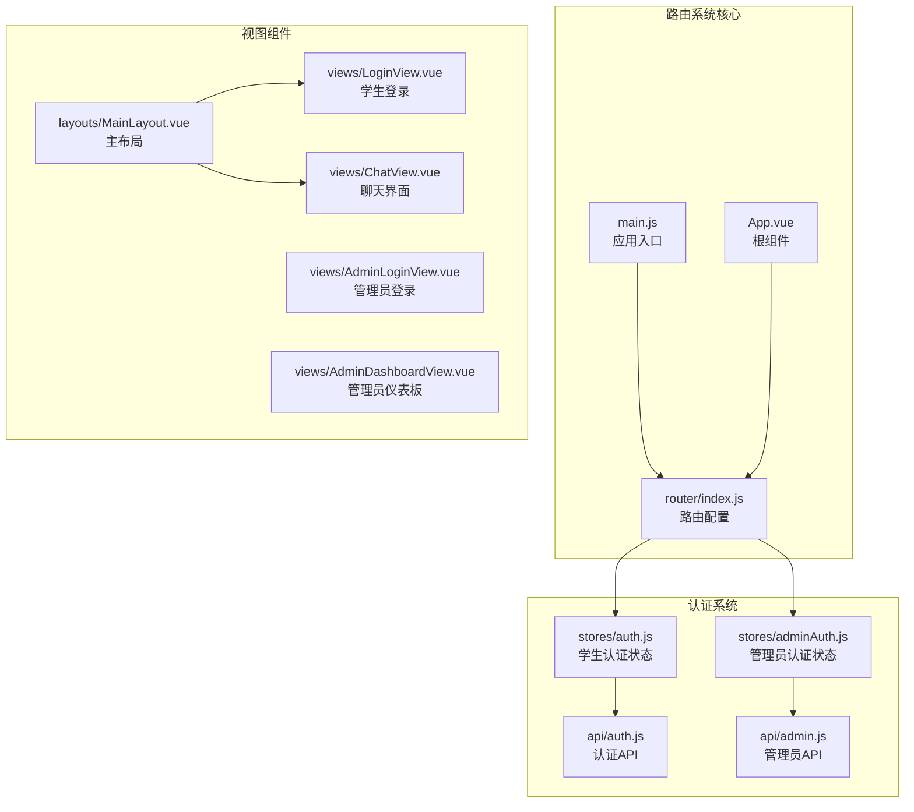
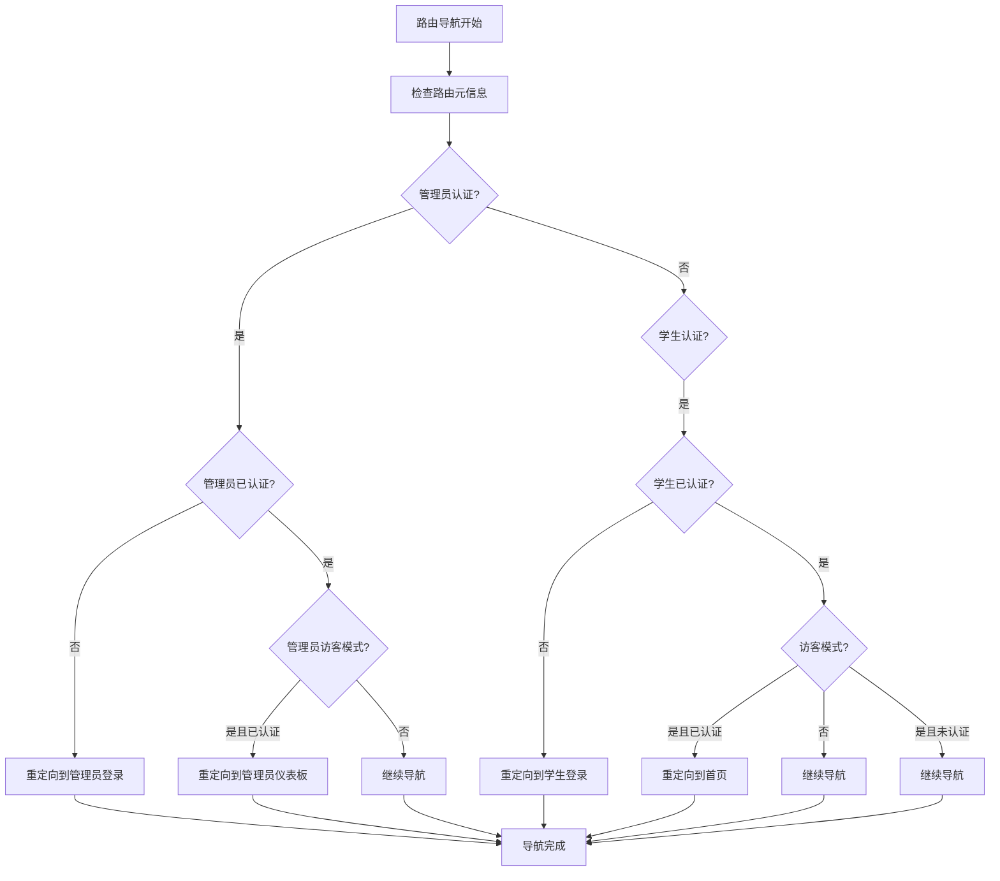
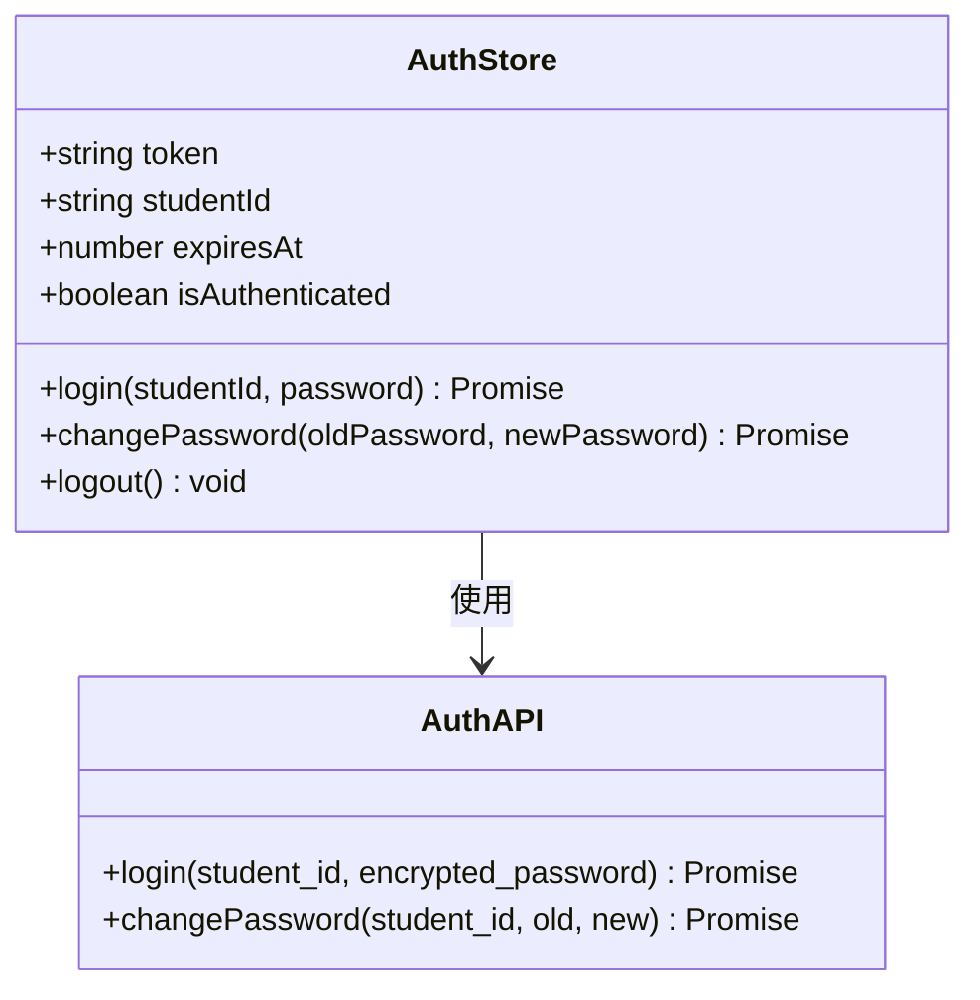
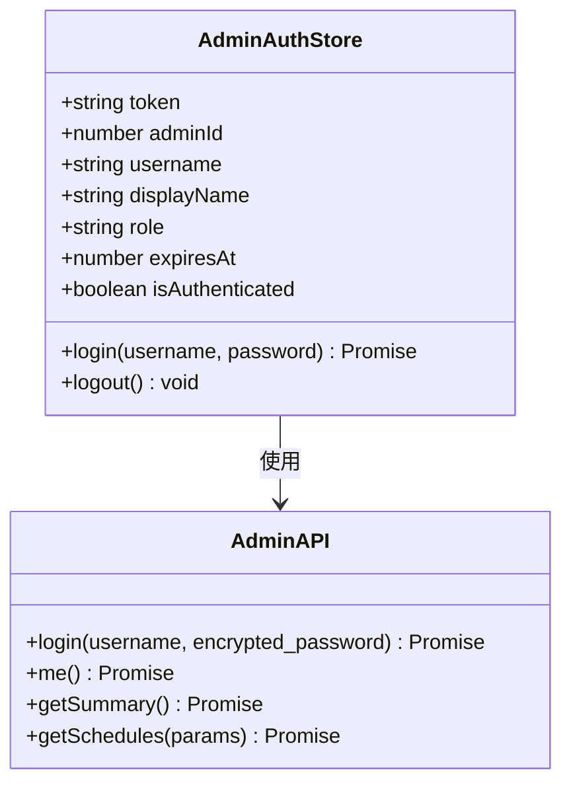
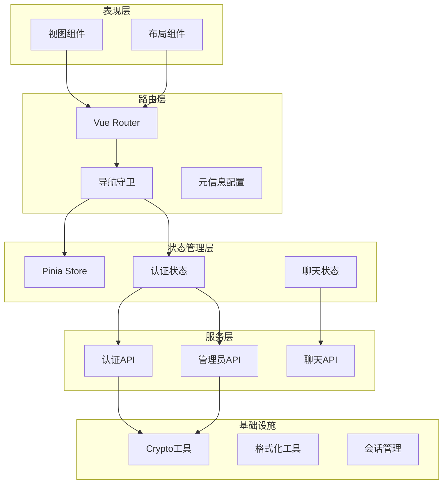
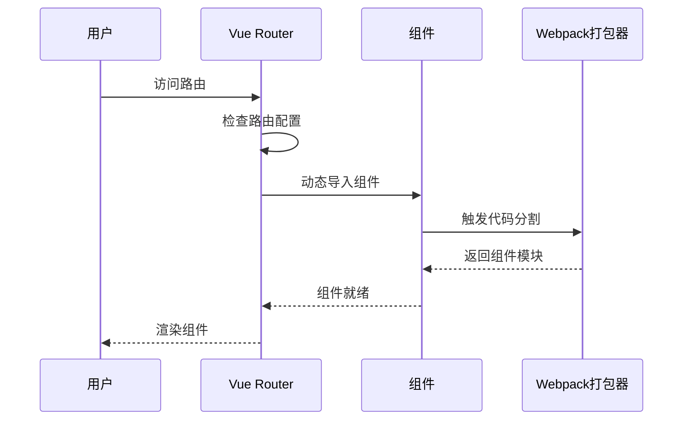
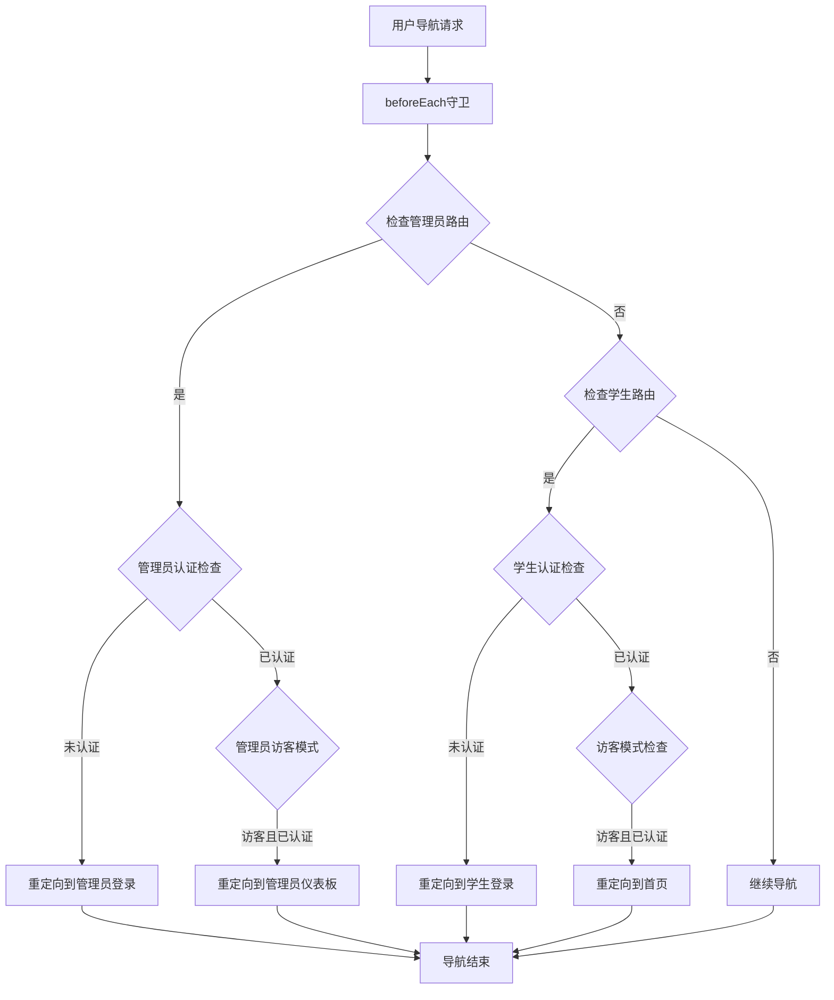
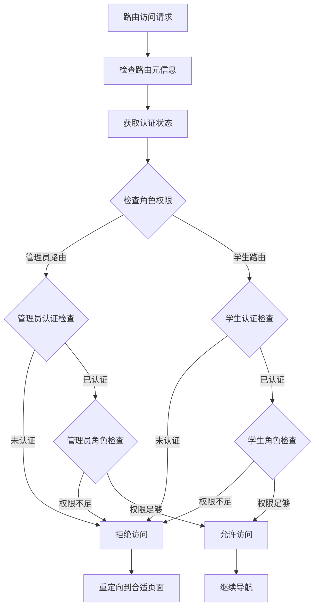
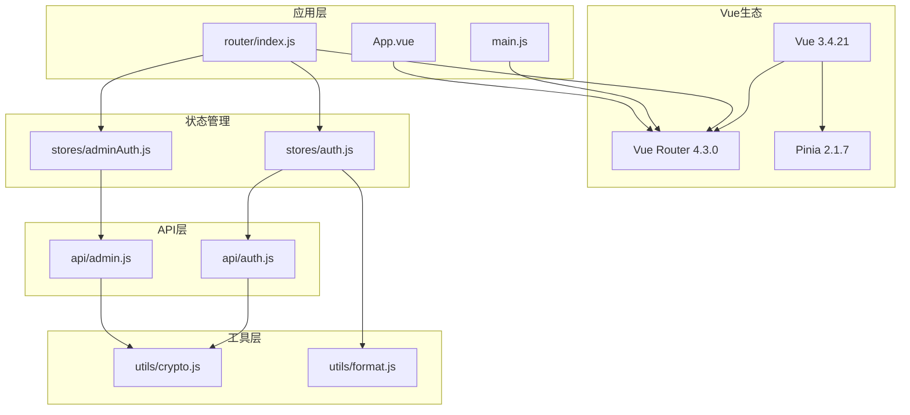
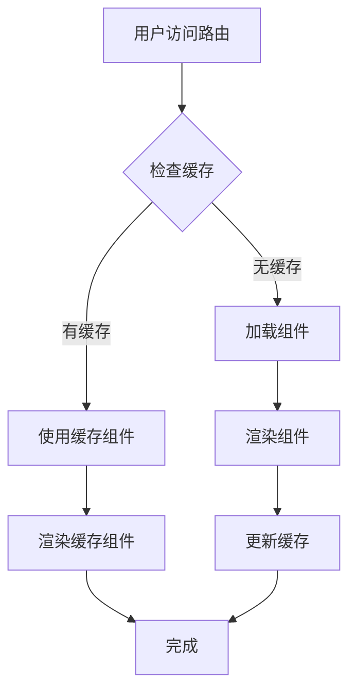

# 路由系统

<cite>
**本文档引用的文件**
- [router/index.js](file://frontend/ai_assistant/src/router/index.js)
- [main.js](file://frontend/ai_assistant/src/main.js)
- [App.vue](file://frontend/ai_assistant/src/App.vue)
- [auth.js](file://frontend/ai_assistant/src/stores/auth.js)
- [adminAuth.js](file://frontend/ai_assistant/src/stores/adminAuth.js)
- [MainLayout.vue](file://frontend/ai_assistant/src/layouts/MainLayout.vue)
- [LoginView.vue](file://frontend/ai_assistant/src/views/LoginView.vue)
- [AdminLoginView.vue](file://frontend/ai_assistant/src/views/AdminLoginView.vue)
- [AdminDashboardView.vue](file://frontend/ai_assistant/src/views/AdminDashboardView.vue)
- [ChatView.vue](file://frontend/ai_assistant/src/views/ChatView.vue)
- [auth.js](file://frontend/ai_assistant/src/api/auth.js)
- [admin.js](file://frontend/ai_assistant/src/api/admin.js)
- [vite.config.js](file://frontend/ai_assistant/vite.config.js)
</cite>

## 目录
1. [简介](#简介)
2. [项目结构](#项目结构)
3. [核心组件](#核心组件)
4. [架构概览](#架构概览)
5. [详细组件分析](#详细组件分析)
6. [依赖关系分析](#依赖关系分析)
7. [性能考虑](#性能考虑)
8. [故障排除指南](#故障排除指南)
9. [结论](#结论)

## 简介

AI校园助手路由系统是一个基于Vue Router 4.x构建的现代化前端路由解决方案。该系统实现了完整的认证流程、权限控制、嵌套路由结构和动态路由功能。系统采用模块化的架构设计，支持学生用户和管理员用户的双重身份验证，并提供了丰富的导航守卫机制来确保应用的安全性和用户体验。

## 项目结构

AI校园助手路由系统主要分布在以下关键目录中：



**图表来源**
- [router/index.js:1-75](file://frontend/ai_assistant/src/router/index.js#L1-L75)
- [main.js:1-10](file://frontend/ai_assistant/src/main.js#L1-L10)

**章节来源**
- [router/index.js:1-75](file://frontend/ai_assistant/src/router/index.js#L1-L75)
- [main.js:1-10](file://frontend/ai_assistant/src/main.js#L1-L10)
- [App.vue:1-7](file://frontend/ai_assistant/src/App.vue#L1-L7)

## 核心组件

### 路由配置系统

路由系统采用Vue Router 4.x的组合式API设计，提供了完整的路由定义、导航守卫和权限控制功能。

#### 路由定义结构

系统包含三个主要的路由组：

1. **公共路由组**：登录页面和管理员登录页面
2. **受保护路由组**：学生用户的功能页面
3. **管理员路由组**：管理员认证和管理功能

#### 导航守卫机制

系统实现了多层次的导航守卫来确保路由安全：



**图表来源**
- [router/index.js:57-73](file://frontend/ai_assistant/src/router/index.js#L57-L73)

**章节来源**
- [router/index.js:5-75](file://frontend/ai_assistant/src/router/index.js#L5-L75)

### 认证状态管理系统

系统采用了Pinia状态管理来处理认证状态，提供了两个独立的认证存储：

#### 学生认证存储 (auth.js)



**图表来源**
- [auth.js:17-77](file://frontend/ai_assistant/src/stores/auth.js#L17-L77)
- [auth.js:8-36](file://frontend/ai_assistant/src/api/auth.js#L8-L36)

#### 管理员认证存储 (adminAuth.js)



**图表来源**
- [adminAuth.js:16-77](file://frontend/ai_assistant/src/stores/adminAuth.js#L16-L77)
- [admin.js:6-41](file://frontend/ai_assistant/src/api/admin.js#L6-L41)

**章节来源**
- [auth.js:1-77](file://frontend/ai_assistant/src/stores/auth.js#L1-L77)
- [adminAuth.js:1-77](file://frontend/ai_assistant/src/stores/adminAuth.js#L1-L77)

## 架构概览

AI校园助手路由系统采用分层架构设计，实现了清晰的关注点分离：



**图表来源**
- [router/index.js:1-75](file://frontend/ai_assistant/src/router/index.js#L1-L75)
- [main.js:1-10](file://frontend/ai_assistant/src/main.js#L1-L10)

## 详细组件分析

### 嵌套路由结构

系统实现了清晰的嵌套路由结构，支持主布局和子路由的组合：

#### 主布局路由

```mermaid
graph TD
Home[/ 路由] --> MainLayout[MainLayout.vue]
MainLayout --> Chat[ChatView.vue]
MainLayout --> Profile[ProfileView.vue]
MainLayout --> ChangePassword[ChangePasswordView.vue]
subgraph "路由元信息"
HomeMeta[requiresAuth: true]
ChatMeta[无特殊元信息]
ProfileMeta[无特殊元信息]
ChangePasswordMeta[无特殊元信息]
end
Home -.-> HomeMeta
Chat -.-> ChatMeta
Profile -.-> ProfileMeta
ChangePassword -.-> ChangePasswordMeta
```

**图表来源**
- [router/index.js:25-45](file://frontend/ai_assistant/src/router/index.js#L25-L45)
- [MainLayout.vue:113](file://frontend/ai_assistant/src/layouts/MainLayout.vue#L113)

#### 路由元信息配置

每个路由都配置了相应的元信息来控制访问权限：

| 路由路径 | 元信息键 | 功能描述 |
|---------|----------|----------|
| `/admin/login` | `adminGuest: true` | 管理员访客模式，已认证用户重定向到仪表板 |
| `/admin` | `requiresAdminAuth: true` | 管理员认证要求，未认证用户重定向到登录页 |
| `/login` | `guest: true` | 访客模式，已认证用户重定向到首页 |
| `/` | `requiresAuth: true` | 学生认证要求，未认证用户重定向到登录页 |

**章节来源**
- [router/index.js:5-49](file://frontend/ai_assistant/src/router/index.js#L5-L49)

### 动态路由和懒加载

系统采用了Vue Router的动态导入功能来实现路由懒加载：

#### 懒加载实现



**图表来源**
- [router/index.js:9](file://frontend/ai_assistant/src/router/index.js#L9)
- [router/index.js:15](file://frontend/ai_assistant/src/router/index.js#L15)
- [router/index.js:21](file://frontend/ai_assistant/src/router/index.js#L21)

#### 懒加载优势

1. **减少初始包大小**：只加载当前页面需要的组件
2. **提升首屏加载速度**：避免一次性加载所有组件
3. **按需加载**：用户访问时才加载对应模块
4. **缓存优化**：独立的代码块可以被浏览器缓存

**章节来源**
- [router/index.js:1-75](file://frontend/ai_assistant/src/router/index.js#L1-L75)

### 导航守卫详解

系统实现了多层次的导航守卫来确保路由安全：

#### 守卫执行流程



**图表来源**
- [router/index.js:57-73](file://frontend/ai_assistant/src/router/index.js#L57-L73)

#### 守卫逻辑实现

导航守卫根据路由元信息和认证状态执行相应的重定向逻辑：

1. **管理员路由优先级**：管理员路由具有最高优先级
2. **认证状态检查**：实时检查认证状态的有效性
3. **访客模式处理**：区分访客模式和正常访问模式
4. **自动重定向**：根据用户状态自动重定向到合适页面

**章节来源**
- [router/index.js:57-73](file://frontend/ai_assistant/src/router/index.js#L57-L73)

### 编程式导航和声明式导航

系统同时支持两种导航方式，为不同场景提供最佳体验：

#### 声明式导航

在模板中使用`<router-link>`组件进行声明式导航：

```html
<router-link to="/" class="nav-link" :class="{ active: $route.name === 'Chat' }">
  💬 智能问答
</router-link>
```

#### 编程式导航

在JavaScript中使用`useRouter`组合函数进行编程式导航：

```javascript
const router = useRouter()

// 推荐新路由
router.push({ name: 'Chat' })

// 替换当前路由
router.replace({ name: 'Login' })
```

#### 导航方法对比

| 导航方式 | 使用场景 | 优点 | 缺点 |
|---------|----------|------|------|
| 声明式导航 | 静态链接、菜单项 | 简单易用、语义明确 | 灵活性较低 |
| 编程式导航 | 动态路由、条件导航 | 灵活强大、可编程 | 代码复杂度较高 |

**章节来源**
- [MainLayout.vue:71-83](file://frontend/ai_assistant/src/layouts/MainLayout.vue#L71-L83)
- [MainLayout.vue:146-174](file://frontend/ai_assistant/src/layouts/MainLayout.vue#L146-L174)

### 权限控制机制

系统实现了基于角色的权限控制机制：

#### 权限检查流程



**图表来源**
- [router/index.js:57-73](file://frontend/ai_assistant/src/router/index.js#L57-L73)

**章节来源**
- [router/index.js:57-73](file://frontend/ai_assistant/src/router/index.js#L57-L73)

## 依赖关系分析

### 核心依赖关系



**图表来源**
- [package.json:11-19](file://frontend/ai_assistant/package.json#L11-L19)
- [main.js:1-10](file://frontend/ai_assistant/src/main.js#L1-L10)

### 外部依赖

系统的主要外部依赖包括：

| 依赖包 | 版本 | 用途 |
|-------|------|------|
| vue | ^3.4.21 | 核心框架 |
| vue-router | ^4.3.0 | 路由管理 |
| pinia | ^2.1.7 | 状态管理 |
| axios | ^1.6.8 | HTTP客户端 |
| crypto-js | ^4.2.0 | 加密工具 |
| marked | ^12.0.1 | Markdown渲染 |

**章节来源**
- [package.json:1-24](file://frontend/ai_assistant/package.json#L1-L24)

## 性能考虑

### 代码分割和懒加载

系统通过动态导入实现了有效的代码分割：

1. **按需加载**：只有访问特定路由时才加载对应组件
2. **并行加载**：多个路由可以并行加载，提升整体性能
3. **缓存优化**：独立的代码块可以被浏览器缓存，重复访问更快

### 路由缓存策略



### 性能优化建议

1. **路由预加载**：对于高频访问的路由可以考虑预加载
2. **组件优化**：使用`keep-alive`缓存频繁切换的组件
3. **异步组件**：合理使用异步组件减少初始包大小
4. **路由守卫优化**：避免在导航守卫中执行耗时操作

## 故障排除指南

### 常见问题及解决方案

#### 认证状态异常

**问题**：用户已登录但被重定向到登录页

**可能原因**：
1. Token过期或无效
2. 本地存储损坏
3. 服务器时间不同步

**解决方案**：
1. 检查localStorage中的认证信息
2. 验证Token的有效期
3. 重新登录获取新的Token

#### 路由跳转异常

**问题**：导航守卫导致意外的路由跳转

**排查步骤**：
1. 检查路由元信息配置
2. 验证认证状态的计算属性
3. 确认导航守卫的执行顺序

#### 组件加载失败

**问题**：动态导入的组件无法加载

**解决方法**：
1. 检查webpack配置
2. 验证组件路径正确性
3. 确认文件存在且可访问

**章节来源**
- [auth.js:24-26](file://frontend/ai_assistant/src/stores/auth.js#L24-L26)
- [adminAuth.js:24-26](file://frontend/ai_assistant/src/stores/adminAuth.js#L24-L26)

## 结论

AI校园助手路由系统展现了现代前端路由的最佳实践，通过合理的架构设计和完善的权限控制机制，为用户提供了安全、流畅的使用体验。系统的主要优势包括：

1. **清晰的架构分离**：路由、状态管理和业务逻辑分离明确
2. **强大的权限控制**：支持多角色认证和细粒度权限管理
3. **优秀的性能表现**：通过懒加载和缓存优化提升用户体验
4. **灵活的扩展性**：模块化设计便于功能扩展和维护

该路由系统为类似的企业级应用提供了良好的参考模板，特别是在认证集成、权限控制和用户体验优化方面具有重要的借鉴价值。