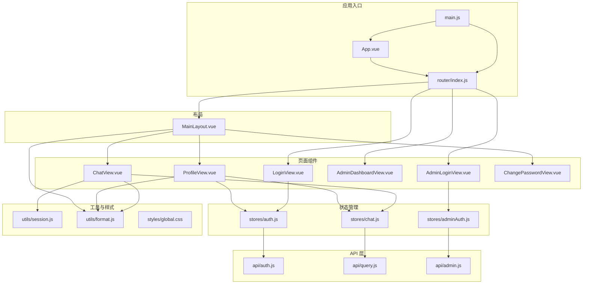
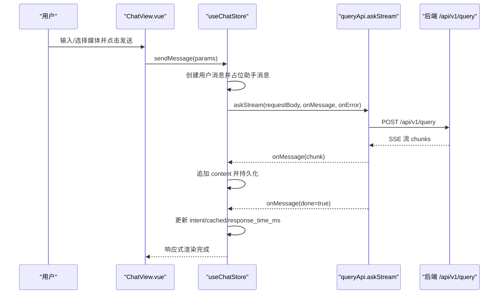
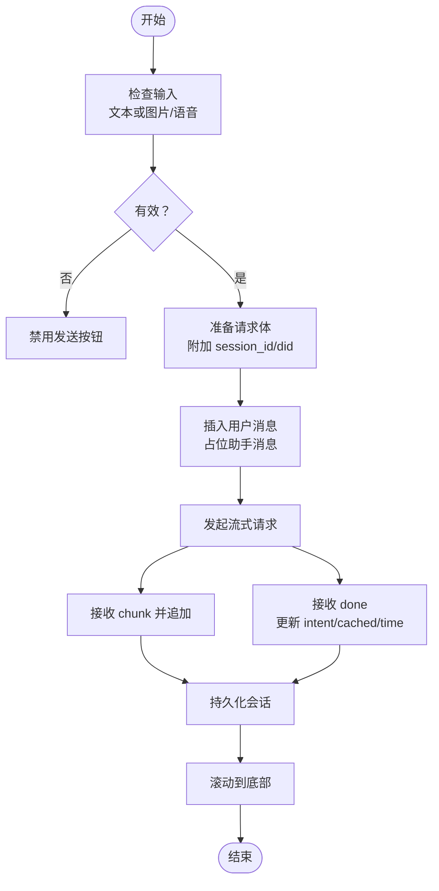
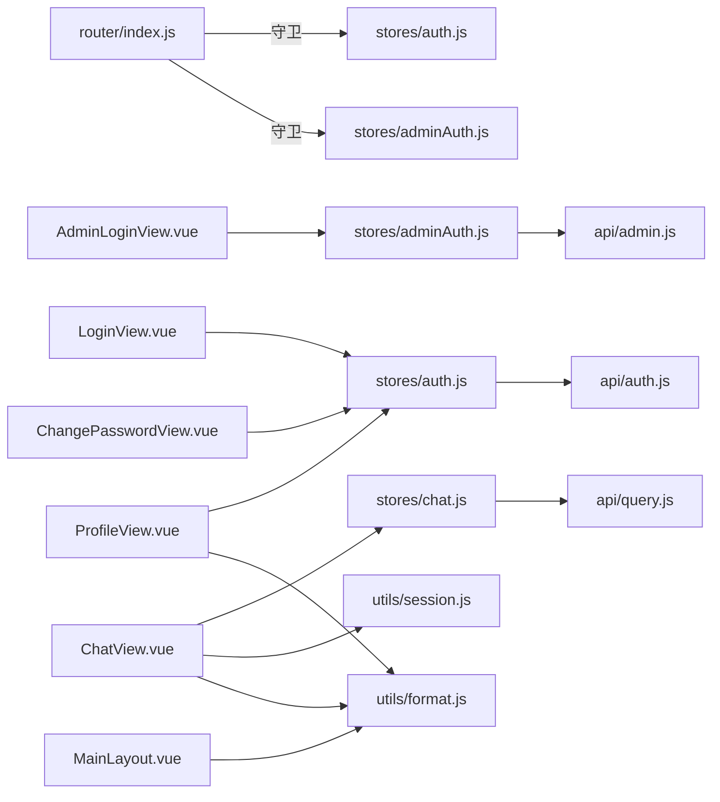

# 页面组件

<cite>
**本文引用的文件**
- [ChatView.vue](file://frontend/ai_assistant/src/views/ChatView.vue)
- [LoginView.vue](file://frontend/ai_assistant/src/views/LoginView.vue)
- [AdminLoginView.vue](file://frontend/ai_assistant/src/views/AdminLoginView.vue)
- [AdminDashboardView.vue](file://frontend/ai_assistant/src/views/AdminDashboardView.vue)
- [ProfileView.vue](file://frontend/ai_assistant/src/views/ProfileView.vue)
- [ChangePasswordView.vue](file://frontend/ai_assistant/src/views/ChangePasswordView.vue)
- [MainLayout.vue](file://frontend/ai_assistant/src/layouts/MainLayout.vue)
- [router/index.js](file://frontend/ai_assistant/src/router/index.js)
- [main.js](file://frontend/ai_assistant/src/main.js)
- [App.vue](file://frontend/ai_assistant/src/App.vue)
- [stores/auth.js](file://frontend/ai_assistant/src/stores/auth.js)
- [stores/adminAuth.js](file://frontend/ai_assistant/src/stores/adminAuth.js)
- [stores/chat.js](file://frontend/ai_assistant/src/stores/chat.js)
- [api/auth.js](file://frontend/ai_assistant/src/api/auth.js)
- [api/query.js](file://frontend/ai_assistant/src/api/query.js)
- [api/admin.js](file://frontend/ai_assistant/src/api/admin.js)
- [utils/session.js](file://frontend/ai_assistant/src/utils/session.js)
- [utils/format.js](file://frontend/ai_assistant/src/utils/format.js)
- [styles/global.css](file://frontend/ai_assistant/src/styles/global.css)
</cite>

## 目录
1. [简介](#简介)
2. [项目结构](#项目结构)
3. [核心组件](#核心组件)
4. [架构总览](#架构总览)
5. [详细组件分析](#详细组件分析)
6. [依赖关系分析](#依赖关系分析)
7. [性能考量](#性能考量)
8. [故障排查指南](#故障排查指南)
9. [结论](#结论)
10. [附录](#附录)

## 简介
本文件面向开发者，系统性梳理 AI 校园助手前端页面组件，覆盖聊天界面、登录界面、管理员界面、个人资料界面等。文档从架构、数据流、状态管理、路由集成、交互与体验、样式与响应式、错误处理与性能优化等方面进行全面说明，并提供扩展与自定义建议。

## 项目结构
前端采用 Vue 3 + Pinia + Vue Router 架构，页面组件位于 views 目录，状态管理位于 stores 目录，API 层位于 api 目录，通用工具位于 utils 目录，全局样式位于 styles 目录；主布局 MainLayout.vue 提供侧边栏与移动端交互；路由配置集中于 router/index.js；应用入口在 main.js。

图表来源
- [main.js:1-10](file://frontend/ai_assistant/src/main.js#L1-L10)
- [router/index.js:1-75](file://frontend/ai_assistant/src/router/index.js#L1-L75)
- [App.vue:1-7](file://frontend/ai_assistant/src/App.vue#L1-L7)
- [MainLayout.vue:1-487](file://frontend/ai_assistant/src/layouts/MainLayout.vue#L1-L487)
- [ChatView.vue:1-1168](file://frontend/ai_assistant/src/views/ChatView.vue#L1-L1168)
- [LoginView.vue:1-343](file://frontend/ai_assistant/src/views/LoginView.vue#L1-L343)
- [AdminLoginView.vue:1-261](file://frontend/ai_assistant/src/views/AdminLoginView.vue#L1-L261)
- [AdminDashboardView.vue:1-688](file://frontend/ai_assistant/src/views/AdminDashboardView.vue#L1-L688)
- [ProfileView.vue:1-380](file://frontend/ai_assistant/src/views/ProfileView.vue#L1-L380)
- [ChangePasswordView.vue:1-466](file://frontend/ai_assistant/src/views/ChangePasswordView.vue#L1-L466)
- [stores/auth.js:1-77](file://frontend/ai_assistant/src/stores/auth.js#L1-L77)
- [stores/adminAuth.js:1-77](file://frontend/ai_assistant/src/stores/adminAuth.js#L1-L77)
- [stores/chat.js:1-278](file://frontend/ai_assistant/src/stores/chat.js#L1-L278)
- [api/auth.js:1-36](file://frontend/ai_assistant/src/api/auth.js#L1-L36)
- [api/query.js:1-141](file://frontend/ai_assistant/src/api/query.js#L1-L141)
- [api/admin.js:1-41](file://frontend/ai_assistant/src/api/admin.js#L1-L41)
- [utils/session.js:1-70](file://frontend/ai_assistant/src/utils/session.js#L1-L70)
- [utils/format.js](file://frontend/ai_assistant/src/utils/format.js)
- [styles/global.css:1-113](file://frontend/ai_assistant/src/styles/global.css#L1-L113)

章节来源
- [main.js:1-10](file://frontend/ai_assistant/src/main.js#L1-L10)
- [router/index.js:1-75](file://frontend/ai_assistant/src/router/index.js#L1-L75)
- [App.vue:1-7](file://frontend/ai_assistant/src/App.vue#L1-L7)

## 核心组件
- 聊天界面（ChatView.vue）：多模态输入（文本/图片/语音）、流式响应渲染、意图与缓存标签、消息删除、滚动与自动聚焦。
- 登录界面（LoginView.vue）：学号+密码登录、密码可见性切换、错误提示、跳转管理员入口。
- 管理员登录（AdminLoginView.vue）：用户名+密码登录、错误码分支提示、返回学生登录。
- 管理后台（AdminDashboardView.vue）：课表筛选与分页、状态切换、汇总统计、错误提示与加载状态。
- 个人资料（ProfileView.vue）：账户信息展示、系统健康检查、版本查询、清除对话。
- 修改密码（ChangePasswordView.vue）：密码强度可视化、前后端校验、提交反馈。
- 主布局（MainLayout.vue）：侧边栏会话列表、搜索、移动端抽屉、导航与退出登录。

章节来源
- [ChatView.vue:1-1168](file://frontend/ai_assistant/src/views/ChatView.vue#L1-L1168)
- [LoginView.vue:1-343](file://frontend/ai_assistant/src/views/LoginView.vue#L1-L343)
- [AdminLoginView.vue:1-261](file://frontend/ai_assistant/src/views/AdminLoginView.vue#L1-L261)
- [AdminDashboardView.vue:1-688](file://frontend/ai_assistant/src/views/AdminDashboardView.vue#L1-L688)
- [ProfileView.vue:1-380](file://frontend/ai_assistant/src/views/ProfileView.vue#L1-L380)
- [ChangePasswordView.vue:1-466](file://frontend/ai_assistant/src/views/ChangePasswordView.vue#L1-L466)
- [MainLayout.vue:1-487](file://frontend/ai_assistant/src/layouts/MainLayout.vue#L1-L487)

## 架构总览
- 应用启动：main.js 创建应用，挂载 Pinia 与 Router。
- 路由守卫：根据 meta 标记进行鉴权重定向（学生/管理员）。
- 页面组件：通过 Pinia Store 读写状态，调用 API 层发起请求。
- 数据持久化：会话与设备 ID 使用 localStorage，聊天 Store 自动持久化。
- 流式渲染：查询接口支持 SSE，Store 逐块更新消息内容。

图表来源
- [ChatView.vue:312-333](file://frontend/ai_assistant/src/views/ChatView.vue#L312-L333)
- [stores/chat.js:133-230](file://frontend/ai_assistant/src/stores/chat.js#L133-L230)
- [api/query.js:28-141](file://frontend/ai_assistant/src/api/query.js#L28-L141)

章节来源
- [main.js:1-10](file://frontend/ai_assistant/src/main.js#L1-L10)
- [router/index.js:57-73](file://frontend/ai_assistant/src/router/index.js#L57-L73)
- [stores/chat.js:1-278](file://frontend/ai_assistant/src/stores/chat.js#L1-L278)
- [api/query.js:1-141](file://frontend/ai_assistant/src/api/query.js#L1-L141)

## 详细组件分析

### 聊天界面（ChatView.vue）
- 功能要点
  - 欢迎屏与示例问题、快捷操作引导。
  - 消息列表：头像、图片/语音预览、Markdown 渲染、意图/缓存/响应时间/设备标识徽章。
  - 输入区：文本域自适应高度、图片上传（前端压缩）、语音录制（MediaRecorder）、发送与禁用逻辑。
  - 语音播放：单实例播放、播放状态同步、错误兜底。
  - 自动滚动到底部，监听消息长度变化。
- Props/事件/插槽
  - 无外部 props。
  - 无自定义事件。
  - 无具名插槽。
- 生命周期钩子
  - mounted：滚动到底部。
  - watch：监听消息数量变化并滚动。
- 数据绑定与状态管理
  - 依赖 useChatStore：currentSession/currentMessages/loading、sendMessage/deleteMessage、会话持久化。
  - 本地状态：inputText/imageBase64/imagePreview、isRecording、录音流与片段、播放器实例。
- 用户交互
  - 点击示例/快捷操作填充输入框并聚焦。
  - Enter 发送、Shift+Enter 换行。
  - 点击语音气泡播放/暂停。
  - 点击删除按钮删除消息。
- 错误处理
  - 语音录制时长/音量阈值校验，权限错误提示。
  - Store resolveErrorMessage 统一解析后端/网络错误。
- 性能与体验
  - 前端图片压缩避免超限。
  - 流式渲染减少首屏等待。
  - 消息动画与滚动提升流畅度。

图表来源
- [ChatView.vue:312-333](file://frontend/ai_assistant/src/views/ChatView.vue#L312-L333)
- [stores/chat.js:133-230](file://frontend/ai_assistant/src/stores/chat.js#L133-L230)

章节来源
- [ChatView.vue:1-1168](file://frontend/ai_assistant/src/views/ChatView.vue#L1-L1168)
- [stores/chat.js:1-278](file://frontend/ai_assistant/src/stores/chat.js#L1-L278)

### 登录界面（LoginView.vue）
- 功能要点
  - 学号与密码输入，密码可见性切换。
  - 前端基础校验，提交后调用 useAuthStore.login。
  - 成功后跳转到聊天页；失败按状态码分支提示。
- Props/事件/插槽
  - 无 props。
  - 无自定义事件。
  - 无插槽。
- 生命周期钩子
  - 无。
- 数据绑定与状态管理
  - 表单响应式对象 form，状态 isSubmitting/errorMsg/showPassword。
  - useAuthStore.login 返回 token、expiresAt 等并写入本地存储。
- 用户交互
  - 提交表单触发登录流程。
  - “管理员入口”跳转至管理员登录页。
- 错误处理
  - 401：学号/密码错误。
  - 其他：网络/服务异常。
- 样式与响应式
  - 卡片居中、渐入动画、圆角阴影。
  - 移动端适配。

章节来源
- [LoginView.vue:1-343](file://frontend/ai_assistant/src/views/LoginView.vue#L1-L343)
- [stores/auth.js:1-77](file://frontend/ai_assistant/src/stores/auth.js#L1-L77)
- [api/auth.js:1-36](file://frontend/ai_assistant/src/api/auth.js#L1-L36)

### 管理员登录（AdminLoginView.vue）
- 功能要点
  - 用户名+密码登录，密码可见性切换。
  - 成功后跳转管理后台；失败按状态码分支提示。
- Props/事件/插槽
  - 无 props。
  - 无自定义事件。
  - 无插槽。
- 生命周期钩子
  - 无。
- 数据绑定与状态管理
  - 表单响应式对象 form，状态 isSubmitting/errorMsg/showPassword。
  - useAdminAuthStore.login 写入管理员 token、角色等。
- 用户交互
  - 提交表单触发登录。
  - “返回学生登录”跳转。

章节来源
- [AdminLoginView.vue:1-261](file://frontend/ai_assistant/src/views/AdminLoginView.vue#L1-L261)
- [stores/adminAuth.js:1-77](file://frontend/ai_assistant/src/stores/adminAuth.js#L1-L77)
- [api/admin.js:1-41](file://frontend/ai_assistant/src/api/admin.js#L1-L41)

### 管理后台（AdminDashboardView.vue）
- 功能要点
  - 汇总统计卡片、学期/班级/状态/周次筛选、关键词搜索。
  - 课表表格：状态切换（启用/停用）、版本与更新时间、分页。
  - 刷新统计、退出登录。
- Props/事件/插槽
  - 无 props。
  - 无自定义事件。
  - 无插槽。
- 生命周期钩子
  - onMounted：initialize（并行加载元数据、汇总、课表）。
- 数据绑定与状态管理
  - filters（term_id/class_id/week_no/status/keyword/limit/offset），loadingSchedules/errorMsg。
  - 计算 currentPage/totalPages。
- 用户交互
  - 查询/重置、上下页翻页、状态切换弹窗确认。
- 错误处理
  - 统一错误提示，失败回退空数据与 total=0。
- 样式与响应式
  - 摘要网格、筛选栅格、表格横向滚动、分页居右。
  - 多断点适配（1280px/768px）。

章节来源
- [AdminDashboardView.vue:1-688](file://frontend/ai_assistant/src/views/AdminDashboardView.vue#L1-L688)
- [api/admin.js:1-41](file://frontend/ai_assistant/src/api/admin.js#L1-L41)
- [stores/adminAuth.js:1-77](file://frontend/ai_assistant/src/stores/adminAuth.js#L1-L77)

### 个人资料（ProfileView.vue）
- 功能要点
  - 展示学号、账户状态、令牌有效期、设备 DID、会话数/消息总数、套餐与认证方式。
  - 系统健康检查与版本查询，刷新状态。
  - 清除所有对话（确认后调用 chatStore.clearAllSessions）。
- Props/事件/插槽
  - 无 props。
  - 无自定义事件。
  - 无插槽。
- 生命周期钩子
  - onMounted：refreshSystemInfo（并行健康检查与版本查询）。
- 数据绑定与状态管理
  - 计算 expiresAtFormatted/totalMessages/healthStatusClass/healthStatusText。
  - 依赖 useAuthStore/useChatStore/systemApi。
- 用户交互
  - “修改密码”跳转、“清除所有对话”确认。
- 错误处理
  - 健康检查失败降级为 error 状态。
- 样式与响应式
  - 信息网格、系统信息面板、状态指示点动画。
  - 移动端网格单列。

章节来源
- [ProfileView.vue:1-380](file://frontend/ai_assistant/src/views/ProfileView.vue#L1-L380)
- [stores/auth.js:1-77](file://frontend/ai_assistant/src/stores/auth.js#L1-L77)
- [stores/chat.js:1-278](file://frontend/ai_assistant/src/stores/chat.js#L1-L278)

### 修改密码（ChangePasswordView.vue）
- 功能要点
  - 当前密码、新密码、确认密码输入，密码强度可视化与规则提示。
  - 前端校验：长度、字母/数字/特殊字符、一致性、新旧密码不同。
  - 提交后调用 useAuthStore.changePassword，成功清空表单并提示。
- Props/事件/插槽
  - 无 props。
  - 无自定义事件。
  - 无插槽。
- 生命周期钩子
  - 无。
- 数据绑定与状态管理
  - 表单响应式对象 form，状态 isSubmitting/errorMsg/successMsg/showOld/showNew/showConfirm。
  - strengthScore/strengthPercent/strengthClass/strengthText 计算。
- 用户交互
  - 显示/隐藏密码、提交按钮禁用条件、返回按钮。
- 错误处理
  - 400/403/404 等状态码分支提示。
- 样式与响应式
  - 强度条、规则徽标、消息提示、移动端按钮堆叠。

章节来源
- [ChangePasswordView.vue:1-466](file://frontend/ai_assistant/src/views/ChangePasswordView.vue#L1-L466)
- [stores/auth.js:1-77](file://frontend/ai_assistant/src/stores/auth.js#L1-L77)

### 主布局（MainLayout.vue）
- 功能要点
  - 侧边栏：Logo、新建对话、搜索、会话列表、底部导航、用户信息。
  - 移动端：抽屉菜单、遮罩层、移动端顶栏。
  - 与路由联动：导航高亮、跳转、退出登录并清理会话。
- Props/事件/插槽
  - 无 props。
  - 无自定义事件。
  - 无插槽。
- 生命周期钩子
  - onMounted/onUnmounted：监听窗口宽度变化，移动端侧栏折叠。
- 数据绑定与状态管理
  - 依赖 useAuthStore/useChatStore/useRoute/useRouter。
  - maskedId（学号脱敏）。
- 用户交互
  - 新建/切换/删除会话、搜索、退出登录、移动端菜单开关。
- 样式与响应式
  - 固定侧栏、抽屉动画、移动端 overlay、导航高亮。

章节来源
- [MainLayout.vue:1-487](file://frontend/ai_assistant/src/layouts/MainLayout.vue#L1-L487)

## 依赖关系分析
- 路由与鉴权
  - 路由配置包含 meta 标记（requiresAuth/requiresAdminAuth/guest/adminGuest），beforeEach 实现重定向。
- 组件与 Store
  - ChatView 依赖 useChatStore；Login/AdminLogin 依赖 auth/adminAuth Store；Profile/ChangePassword 依赖 auth Store。
- Store 与 API
  - useChatStore 调用 queryApi.askStream；useAuthStore 调用 authApi；useAdminAuthStore 调用 adminApi。
- 工具与持久化
  - utils/session 提供会话/设备 ID 生成与持久化；ChatView 与 Store 共同维护本地存储。

图表来源
- [router/index.js:57-73](file://frontend/ai_assistant/src/router/index.js#L57-L73)
- [stores/chat.js:1-278](file://frontend/ai_assistant/src/stores/chat.js#L1-L278)
- [stores/auth.js:1-77](file://frontend/ai_assistant/src/stores/auth.js#L1-L77)
- [stores/adminAuth.js:1-77](file://frontend/ai_assistant/src/stores/adminAuth.js#L1-L77)
- [api/query.js:1-141](file://frontend/ai_assistant/src/api/query.js#L1-L141)
- [api/auth.js:1-36](file://frontend/ai_assistant/src/api/auth.js#L1-L36)
- [api/admin.js:1-41](file://frontend/ai_assistant/src/api/admin.js#L1-L41)
- [utils/session.js:1-70](file://frontend/ai_assistant/src/utils/session.js#L1-L70)
- [utils/format.js](file://frontend/ai_assistant/src/utils/format.js)

章节来源
- [router/index.js:1-75](file://frontend/ai_assistant/src/router/index.js#L1-L75)
- [stores/chat.js:1-278](file://frontend/ai_assistant/src/stores/chat.js#L1-L278)
- [stores/auth.js:1-77](file://frontend/ai_assistant/src/stores/auth.js#L1-L77)
- [stores/adminAuth.js:1-77](file://frontend/ai_assistant/src/stores/adminAuth.js#L1-L77)

## 性能考量
- 前端压缩与上传限制：图片上传前压缩，避免超过网关限制。
- 流式渲染：SSE 分块增量渲染，降低感知延迟。
- 本地持久化：会话列表与活跃会话 ID 持久化，减少重复请求。
- 滚动优化：消息变化自动滚动到底部，避免阻塞主线程。
- 响应式布局：侧边栏抽屉与表格横向滚动，兼顾桌面与移动端性能。

## 故障排查指南
- 登录失败
  - 学生登录：401 提示学号/密码错误；其他网络异常统一提示。
  - 管理员登录：401/403 分支提示用户名/密码错误或账号不可用。
- 聊天发送
  - 无输入或正在录音时禁用发送；语音录制时长过短/无声会提示。
  - 后端错误由 resolveErrorMessage 统一转换为友好提示。
- 管理后台
  - 加载失败显示错误提示并清空数据；状态切换需二次确认。
- 个人资料
  - 健康检查失败降级为异常状态；版本查询失败忽略。

章节来源
- [LoginView.vue:94-121](file://frontend/ai_assistant/src/views/LoginView.vue#L94-L121)
- [AdminLoginView.vue:75-105](file://frontend/ai_assistant/src/views/AdminLoginView.vue#L75-L105)
- [stores/chat.js:235-257](file://frontend/ai_assistant/src/stores/chat.js#L235-L257)
- [AdminDashboardView.vue:248-263](file://frontend/ai_assistant/src/views/AdminDashboardView.vue#L248-L263)
- [ProfileView.vue:144-160](file://frontend/ai_assistant/src/views/ProfileView.vue#L144-L160)

## 结论
本项目页面组件围绕“多模态聊天 + 鉴权 + 管理后台 + 个人中心”的核心业务展开，采用模块化的组件设计与 Pinia 状态管理，结合路由守卫与本地持久化，实现了良好的用户体验与可维护性。通过流式渲染与前端压缩等手段优化性能，配合完善的错误处理与响应式布局，满足校园场景下的多终端使用需求。

## 附录

### 路由与导航控制
- 学生路由：/login、/、/profile、/change-password；带 requiresAuth 守卫。
- 管理员路由：/admin/login、/admin；带 requiresAdminAuth 守卫。
- 未登录/已登录重定向策略见 beforeEach。

章节来源
- [router/index.js:5-49](file://frontend/ai_assistant/src/router/index.js#L5-L49)
- [router/index.js:57-73](file://frontend/ai_assistant/src/router/index.js#L57-L73)

### 样式定制与响应式
- 全局变量：颜色、阴影、圆角、过渡。
- 组件内 scoped 样式：卡片、表单、按钮、表格、动画。
- 响应式断点：768px/1280px，移动端抽屉与网格调整。

章节来源
- [styles/global.css:1-113](file://frontend/ai_assistant/src/styles/global.css#L1-L113)
- [LoginView.vue:124-343](file://frontend/ai_assistant/src/views/LoginView.vue#L124-L343)
- [AdminDashboardView.vue:655-687](file://frontend/ai_assistant/src/views/AdminDashboardView.vue#L655-L687)
- [ProfileView.vue:372-380](file://frontend/ai_assistant/src/views/ProfileView.vue#L372-L380)

### 状态管理概览
- useAuthStore：token/studentId/expiresAt/isAuthenticated，登录/修改密码/登出。
- useAdminAuthStore：管理员 token/角色/过期时间，登录/登出。
- useChatStore：sessions/activeSessionId/loadingStates/searchKeyword，会话 CRUD、消息发送与持久化。

章节来源
- [stores/auth.js:17-77](file://frontend/ai_assistant/src/stores/auth.js#L17-L77)
- [stores/adminAuth.js:16-77](file://frontend/ai_assistant/src/stores/adminAuth.js#L16-L77)
- [stores/chat.js:22-278](file://frontend/ai_assistant/src/stores/chat.js#L22-L278)