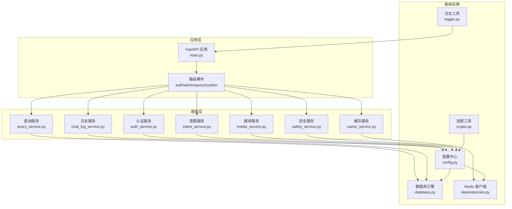
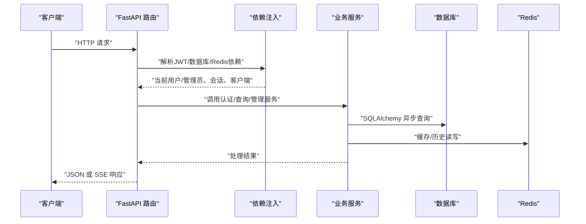
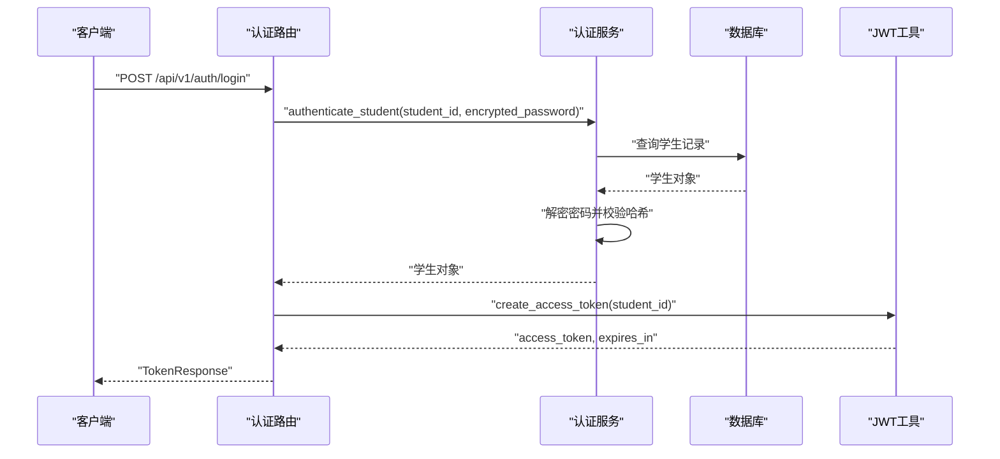
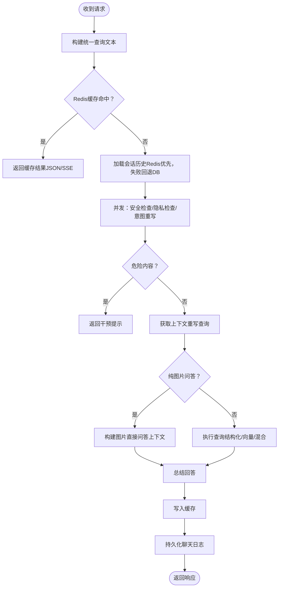
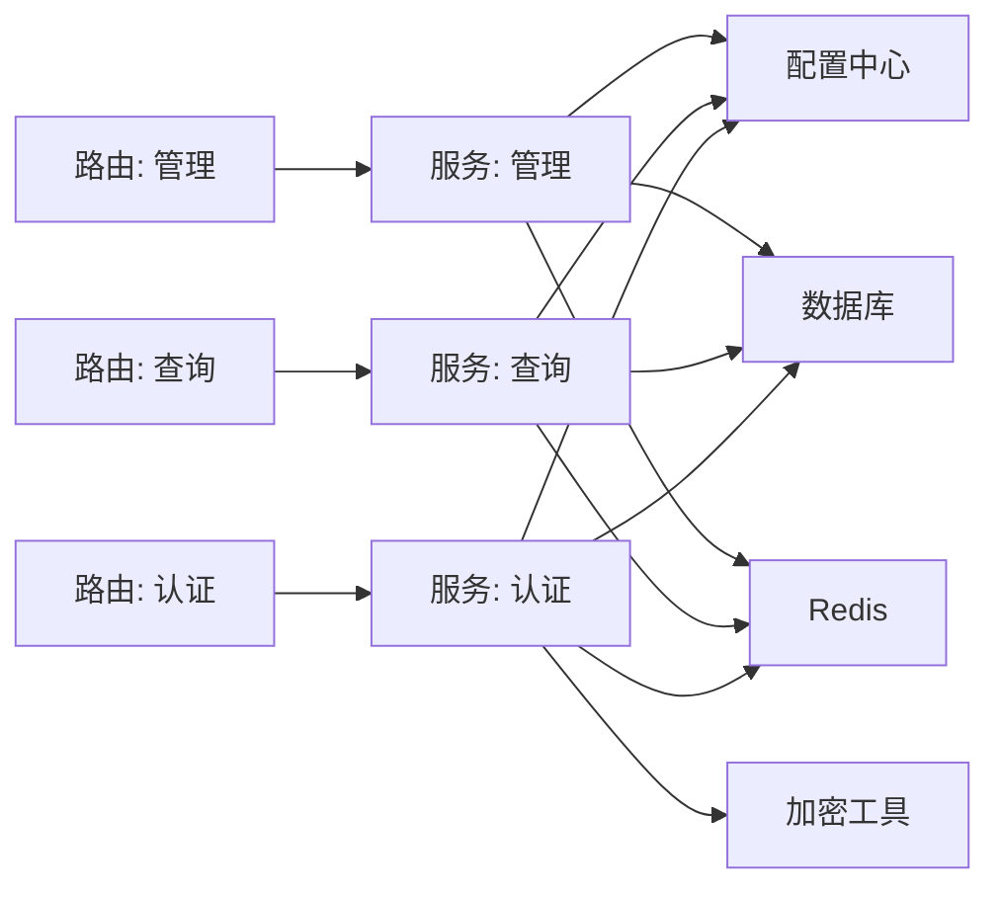

# 后端API文档

<cite>
**本文档引用的文件**
- [main.py](file://service/ai_assistant/app/main.py)
- [config.py](file://service/ai_assistant/app/config.py)
- [database.py](file://service/ai_assistant/app/database.py)
- [dependencies.py](file://service/ai_assistant/app/dependencies.py)
- [requirements.txt](file://service/ai_assistant/requirements.txt)
- [auth.py](file://service/ai_assistant/app/routers/auth.py)
- [admin.py](file://service/ai_assistant/app/routers/admin.py)
- [query.py](file://service/ai_assistant/app/routers/query.py)
- [system.py](file://service/ai_assistant/app/routers/system.py)
- [auth_service.py](file://service/ai_assistant/app/services/auth_service.py)
- [auth.py](file://service/ai_assistant/app/schemas/auth.py)
- [admin.py](file://service/ai_assistant/app/schemas/admin.py)
- [query.py](file://service/ai_assistant/app/schemas/query.py)
- [crypto.py](file://service/ai_assistant/app/utils/crypto.py)
- [logger.py](file://service/ai_assistant/app/utils/logger.py)
- [models.py](file://service/ai_assistant/app/models/models.py)
</cite>

## 目录
1. [简介](#简介)
2. [项目结构](#项目结构)
3. [核心组件](#核心组件)
4. [架构总览](#架构总览)
5. [详细组件分析](#详细组件分析)
6. [依赖分析](#依赖分析)
7. [性能考虑](#性能考虑)
8. [故障排查指南](#故障排查指南)
9. [结论](#结论)
10. [附录](#附录)

## 简介
本文件为“AI校园助手”后端API的完整参考文档，覆盖认证、查询、管理与系统接口，详述HTTP方法、URL模式、请求参数、响应格式、错误码、认证机制（JWT）、权限控制、安全策略、版本管理、速率限制与错误处理策略，并提供API测试与调试建议，帮助前端与第三方集成者快速、准确地对接。

## 项目结构
后端采用FastAPI + SQLAlchemy异步ORM + Redis缓存 + JWT认证的分层架构：
- 应用入口与中间件：应用初始化、CORS、路由注册
- 配置中心：环境变量与运行参数
- 数据层：MySQL异步引擎与会话管理
- 依赖注入：数据库会话、Redis客户端、当前用户/管理员解析
- 路由模块：认证、查询、管理、系统
- 服务层：认证服务、缓存、查询、意图、媒体、日志、安全
- 模型与Schema：数据库实体与请求/响应模型
- 工具与日志：加密、日志记录

图表来源
- [main.py:52-86](file://service/ai_assistant/app/main.py#L52-L86)
- [dependencies.py:27-51](file://service/ai_assistant/app/dependencies.py#L27-L51)
- [config.py:85-110](file://service/ai_assistant/app/config.py#L85-L110)

章节来源
- [main.py:1-86](file://service/ai_assistant/app/main.py#L1-L86)
- [config.py:1-113](file://service/ai_assistant/app/config.py#L1-L113)
- [database.py:1-35](file://service/ai_assistant/app/database.py#L1-L35)
- [dependencies.py:1-109](file://service/ai_assistant/app/dependencies.py#L1-L109)

## 核心组件
- 应用入口与生命周期：初始化日志、CORS、路由注册、启动/关闭钩子
- 配置中心：应用名称/版本、数据库/Redis连接、JWT与AES密钥、LLM模型、缓存TTL、跨域白名单
- 数据库：异步引擎、会话工厂、基础模型基类
- 依赖注入：数据库会话、Redis客户端、当前用户/管理员解析与鉴权
- 路由模块：认证、查询、管理、系统
- 服务层：认证、缓存、查询、意图、媒体、日志、安全
- Schema：请求/响应模型
- 工具：AES解密、日志

章节来源
- [main.py:52-86](file://service/ai_assistant/app/main.py#L52-L86)
- [config.py:6-113](file://service/ai_assistant/app/config.py#L6-L113)
- [database.py:7-35](file://service/ai_assistant/app/database.py#L7-L35)
- [dependencies.py:27-109](file://service/ai_assistant/app/dependencies.py#L27-L109)
- [auth_service.py:45-123](file://service/ai_assistant/app/services/auth_service.py#L45-L123)
- [auth.py:24-102](file://service/ai_assistant/app/routers/auth.py#L24-L102)
- [query.py:198-788](file://service/ai_assistant/app/routers/query.py#L198-L788)
- [admin.py:51-388](file://service/ai_assistant/app/routers/admin.py#L51-L388)
- [system.py:22-38](file://service/ai_assistant/app/routers/system.py#L22-L38)

## 架构总览
系统通过FastAPI提供REST接口，使用JWT进行认证与授权，结合Redis实现缓存与会话历史，调用多种服务完成多模态查询与管理操作。

图表来源
- [dependencies.py:56-109](file://service/ai_assistant/app/dependencies.py#L56-L109)
- [auth_service.py:125-253](file://service/ai_assistant/app/services/auth_service.py#L125-L253)
- [query.py:207-745](file://service/ai_assistant/app/routers/query.py#L207-L745)
- [admin.py:57-387](file://service/ai_assistant/app/routers/admin.py#L57-L387)

## 详细组件分析

### 认证API
- 版本：/api/v1
- 认证方式：JWT Bearer
- 适用角色：学生
- 依赖：JWT密钥、AES密钥（用于解密密码）

接口一览
- POST /api/v1/auth/login
  - 功能：学生登录，返回JWT访问令牌
  - 请求体：LoginRequest
    - student_id: 学号
    - encrypted_password: AES-CBC加密密码（格式：iv_base64:ciphertext_base64）
  - 成功响应：TokenResponse
    - access_token: JWT字符串
    - token_type: bearer
    - expires_in: 过期秒数
    - student_id: 学号
  - 错误码：400/401/422
  - 示例请求（路径）：[auth.py:33-52](file://service/ai_assistant/app/routers/auth.py#L33-L52)
  - 示例响应（路径）：[auth.py:47-52](file://service/ai_assistant/app/routers/auth.py#L47-L52)

- POST /api/v1/auth/change-password
  - 功能：修改密码，需携带旧/新加密密码
  - 请求头：Authorization: Bearer <access_token>
  - 请求体：ChangePasswordRequest
    - student_id: 学号（需与令牌匹配）
    - encrypted_old_password: 旧密码加密
    - encrypted_new_password: 新密码加密
  - 成功响应：ChangePasswordResponse
    - success: true
    - student_id: 学号
    - detail: 提示信息
  - 错误码：400/401/403/404
  - 示例请求（路径）：[auth.py:61-101](file://service/ai_assistant/app/routers/auth.py#L61-L101)

认证流程（序列图）

图表来源
- [auth.py:33-52](file://service/ai_assistant/app/routers/auth.py#L33-L52)
- [auth_service.py:125-169](file://service/ai_assistant/app/services/auth_service.py#L125-L169)
- [auth_service.py:45-61](file://service/ai_assistant/app/services/auth_service.py#L45-L61)

章节来源
- [auth.py:24-102](file://service/ai_assistant/app/routers/auth.py#L24-L102)
- [auth_service.py:125-210](file://service/ai_assistant/app/services/auth_service.py#L125-L210)
- [auth.py:4-21](file://service/ai_assistant/app/schemas/auth.py#L4-L21)
- [auth.py:45-56](file://service/ai_assistant/app/schemas/auth.py#L45-L56)

### 查询API
- 版本：/api/v1
- 认证方式：JWT Bearer（学生）
- 接口：POST /api/v1/query
  - 功能：接收文本/图像/音频多模态输入，返回JSON或SSE流式响应
  - 请求头：Authorization: Bearer <access_token>
  - 请求体：QueryRequest
    - text: 文本问题
    - image_base64: Base64图像
    - audio_base64: Base64音频（wav/mp3）
    - session_id: 会话ID（用于上下文关联）
    - output_type: 输出类型，"json"返回结构化JSON，否则SSE流式
  - 成功响应：
    - JSON：QueryResponse
      - answer: 回答文本
      - intent: 意图类型（structured/vector/hybrid/smalltalk）
      - session_id: 会话ID
      - response_time_ms: 耗时（毫秒）
      - cached: 是否来自缓存
    - SSE：事件流，包含chunks与最终元数据包
  - 错误码：400/401/403/422/502
  - 示例请求（路径）：[query.py:207-212](file://service/ai_assistant/app/routers/query.py#L207-L212)
  - 示例响应（路径）：[query.py:296-302](file://service/ai_assistant/app/routers/query.py#L296-L302)

- DELETE /api/v1/sessions
  - 功能：清除当前学生的缓存与会话历史
  - 请求头：Authorization: Bearer <access_token>
  - 成功响应：{"message": "清除成功", "deleted_keys_count": 数字}
  - 示例请求（路径）：[query.py:752-755](file://service/ai_assistant/app/routers/query.py#L752-L755)

查询处理流程（流程图）

图表来源
- [query.py:207-745](file://service/ai_assistant/app/routers/query.py#L207-L745)

章节来源
- [query.py:198-788](file://service/ai_assistant/app/routers/query.py#L198-L788)
- [query.py:15-33](file://service/ai_assistant/app/schemas/query.py#L15-L33)
- [query.py:207-745](file://service/ai_assistant/app/routers/query.py#L207-L745)

### 管理API
- 版本：/api/v1/admin
- 认证方式：JWT Bearer（管理员）
- 依赖：管理员角色校验、数据库会话、Redis客户端

接口一览
- POST /api/v1/admin/auth/login
  - 功能：管理员登录，返回JWT访问令牌
  - 请求体：AdminLoginRequest
    - username: 用户名
    - encrypted_password: AES加密密码
  - 成功响应：AdminTokenResponse
    - access_token: JWT
    - token_type: bearer
    - expires_in: 过期秒数
    - admin_id: 管理员ID
    - username/display_name/role
  - 错误码：401/403
  - 示例请求（路径）：[admin.py:57-82](file://service/ai_assistant/app/routers/admin.py#L57-L82)

- GET /api/v1/admin/auth/me
  - 功能：获取当前管理员信息
  - 成功响应：AdminMeResponse
  - 示例请求（路径）：[admin.py:90-99](file://service/ai_assistant/app/routers/admin.py#L90-L99)

- GET /api/v1/admin/dashboard/summary
  - 功能：管理员概览统计
  - 成功响应：AdminDashboardSummaryResponse
  - 示例请求（路径）：[admin.py:107-144](file://service/ai_assistant/app/routers/admin.py#L107-L144)

- GET /api/v1/admin/meta/terms
  - 功能：获取学期列表
  - 成功响应：列表[AdminTermItem]
  - 示例请求（路径）：[admin.py:152-166](file://service/ai_assistant/app/routers/admin.py#L152-L166)

- GET /api/v1/admin/meta/classes
  - 功能：获取班级列表
  - 成功响应：列表[AdminClassItem]
  - 示例请求（路径）：[admin.py:174-196](file://service/ai_assistant/app/routers/admin.py#L174-L196)

- GET /api/v1/admin/schedules
  - 功能：管理员课表列表（支持筛选与分页）
  - 查询参数：
    - term_id: 学期ID
    - class_id: 班级ID
    - week_no: 第几周
    - schedule_status: 课表状态
    - keyword: 关键词
    - limit: 1-200，默认50
    - offset: 默认0
  - 成功响应：AdminScheduleListResponse
  - 示例请求（路径）：[admin.py:204-301](file://service/ai_assistant/app/routers/admin.py#L204-L301)

- PATCH /api/v1/admin/schedules/{schedule_id}/status
  - 功能：更新课表状态
  - 请求体：UpdateScheduleStatusRequest
    - schedule_status: "active"/"cancelled"
    - reason: 可选原因（<=255字符）
  - 成功响应：UpdateScheduleStatusResponse
  - 示例请求（路径）：[admin.py:309-387](file://service/ai_assistant/app/routers/admin.py#L309-L387)

章节来源
- [admin.py:51-388](file://service/ai_assistant/app/routers/admin.py#L51-L388)
- [admin.py:11-28](file://service/ai_assistant/app/schemas/admin.py#L11-L28)
- [admin.py:30-105](file://service/ai_assistant/app/schemas/admin.py#L30-L105)
- [dependencies.py:75-109](file://service/ai_assistant/app/dependencies.py#L75-L109)

### 系统API
- 版本：/api/v1
- 接口：
  - GET /api/v1/health
    - 功能：健康检查
    - 响应：HealthResponse
  - GET /api/v1/version
    - 功能：版本信息
    - 响应：VersionResponse

章节来源
- [system.py:22-38](file://service/ai_assistant/app/routers/system.py#L22-L38)

## 依赖分析
- 外部依赖：FastAPI、SQLAlchemy异步、aiomysql、Redis、python-jose、passlib、pycryptodome、dashscope、langchain-core、loguru等
- 运行时依赖：MySQL、Redis、LLM服务（DashScope/阿里百炼）
- 关键耦合点：
  - 路由依赖依赖注入（JWT解析、数据库、Redis）
  - 服务层依赖配置中心与外部LLM/存储
  - AES解密依赖前端加密格式（iv_base64:ciphertext_base64）

图表来源
- [requirements.txt:1-22](file://service/ai_assistant/requirements.txt#L1-L22)
- [auth_service.py:125-253](file://service/ai_assistant/app/services/auth_service.py#L125-L253)
- [query.py:207-745](file://service/ai_assistant/app/routers/query.py#L207-L745)
- [admin.py:57-387](file://service/ai_assistant/app/routers/admin.py#L57-L387)
- [crypto.py:39-73](file://service/ai_assistant/app/utils/crypto.py#L39-L73)

章节来源
- [requirements.txt:1-22](file://service/ai_assistant/requirements.txt#L1-L22)
- [dependencies.py:1-109](file://service/ai_assistant/app/dependencies.py#L1-L109)

## 性能考虑
- 流式输出：SSE流式返回，降低反向代理缓冲风险，提升感知速度
- 并发优化：安全检查、隐私检查与意图重写并行执行
- 缓存策略：Redis缓存热点查询，敏感查询按TTL区分
- 会话历史：Redis按会话隔离存储，避免并发污染
- 数据库连接：流式阶段及时回滚并释放连接，缩短锁占用
- LLM调用：按意图选择合适模型，必要时降级为向量或结构化查询

## 故障排查指南
- 认证失败（401/403）
  - 检查Authorization头是否为Bearer令牌
  - 确认JWT未过期、角色匹配
  - 管理员账号状态需为active
  - 参考：[dependencies.py:56-109](file://service/ai_assistant/app/dependencies.py#L56-L109)
- 密码错误（400）
  - 确认encrypted_password格式为iv_base64:ciphertext_base64
  - AES密钥与前端一致
  - 参考：[crypto.py:39-73](file://service/ai_assistant/app/utils/crypto.py#L39-L73)
- 查询失败（502）
  - 检查媒体转文本服务（图像/音频）
  - 检查LLM服务可用性与输入长度限制
  - 参考：[query.py:234-260](file://service/ai_assistant/app/routers/query.py#L234-L260)
- 缓存异常
  - Redis连接失败时自动降级，不影响功能
  - 参考：[query.py:282-312](file://service/ai_assistant/app/routers/query.py#L282-L312)
- 日志定位
  - 使用统一日志工具，查看运行时日志文件
  - 参考：[logger.py:17-53](file://service/ai_assistant/app/utils/logger.py#L17-L53)

章节来源
- [dependencies.py:56-109](file://service/ai_assistant/app/dependencies.py#L56-L109)
- [crypto.py:39-73](file://service/ai_assistant/app/utils/crypto.py#L39-L73)
- [query.py:234-260](file://service/ai_assistant/app/routers/query.py#L234-L260)
- [query.py:282-312](file://service/ai_assistant/app/routers/query.py#L282-L312)
- [logger.py:17-53](file://service/ai_assistant/app/utils/logger.py#L17-L53)

## 结论
本API文档提供了从认证、查询、管理到系统监控的完整接口说明与最佳实践。建议在生产环境严格配置JWT与AES密钥、启用HTTPS、限制CORS白名单，并结合日志与缓存策略保障稳定性与性能。

## 附录

### 认证机制详解
- JWT生成
  - 学生令牌：包含sub（学号）、role（student）、exp、iat
  - 管理员令牌：包含sub（管理员ID）、role（admin）、username、exp、iat
  - 过期时间：由配置项决定
  - 参考：[auth_service.py:45-76](file://service/ai_assistant/app/services/auth_service.py#L45-L76)
- JWT验证
  - 学生端：decode_access_token
  - 管理端：decode_admin_access_token
  - 角色与主体校验
  - 参考：[auth_service.py:78-123](file://service/ai_assistant/app/services/auth_service.py#L78-L123)
- 密码传输加密
  - AES-CBC，格式：iv_base64:ciphertext_base64
  - URL安全编码还原
  - 参考：[crypto.py:25-73](file://service/ai_assistant/app/utils/crypto.py#L25-L73)

章节来源
- [auth_service.py:45-123](file://service/ai_assistant/app/services/auth_service.py#L45-L123)
- [crypto.py:25-73](file://service/ai_assistant/app/utils/crypto.py#L25-L73)

### 权限控制与安全
- 角色权限
  - 学生：仅能访问自身数据与查询接口
  - 管理员：按角色细分（超级/调度/安全/只读）
  - 参考：[models.py:28-39](file://service/ai_assistant/app/models/models.py#L28-L39)
- 隐私保护
  - 检测查询他人学号的行为并阻断
  - 参考：[query.py:354-414](file://service/ai_assistant/app/routers/query.py#L354-L414)
- 危险内容拦截
  - 安全检查触发干预提示
  - 参考：[query.py:415-471](file://service/ai_assistant/app/routers/query.py#L415-L471)

章节来源
- [models.py:28-39](file://service/ai_assistant/app/models/models.py#L28-L39)
- [query.py:354-471](file://service/ai_assistant/app/routers/query.py#L354-L471)

### API版本管理、速率限制与错误处理
- 版本管理
  - 路由前缀：/api/v1
  - 应用版本：由配置提供
  - 参考：[main.py:52-62](file://service/ai_assistant/app/main.py#L52-L62)，[config.py:14-16](file://service/ai_assistant/app/config.py#L14-L16)
- 速率限制
  - 未内置全局速率限制，建议在网关/反向代理层配置
- 错误处理
  - 统一HTTP状态码与错误详情
  - SSE流式错误包装为可读提示
  - 参考：[query.py:142-151](file://service/ai_assistant/app/routers/query.py#L142-L151)

章节来源
- [main.py:52-62](file://service/ai_assistant/app/main.py#L52-L62)
- [config.py:14-16](file://service/ai_assistant/app/config.py#L14-L16)
- [query.py:142-151](file://service/ai_assistant/app/routers/query.py#L142-L151)

### API测试指南与调试技巧
- 测试步骤
  - 获取JWT：POST /api/v1/auth/login（学生）或 /api/v1/admin/auth/login（管理员）
  - 设置Authorization头：Bearer <access_token>
  - 查询接口：POST /api/v1/query，output_type=json获取结构化响应
  - 清理缓存：DELETE /api/v1/sessions
- 调试技巧
  - 查看运行日志文件定位异常
  - 使用SSE客户端观察流式进度
  - 检查Redis键空间与TTL确认缓存行为
  - 参考：[logger.py:17-53](file://service/ai_assistant/app/utils/logger.py#L17-L53)

章节来源
- [logger.py:17-53](file://service/ai_assistant/app/utils/logger.py#L17-L53)