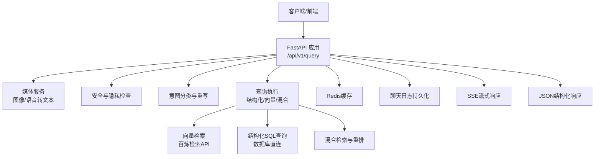
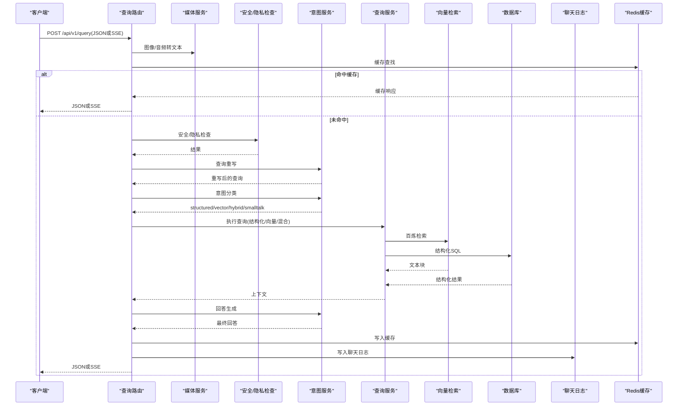
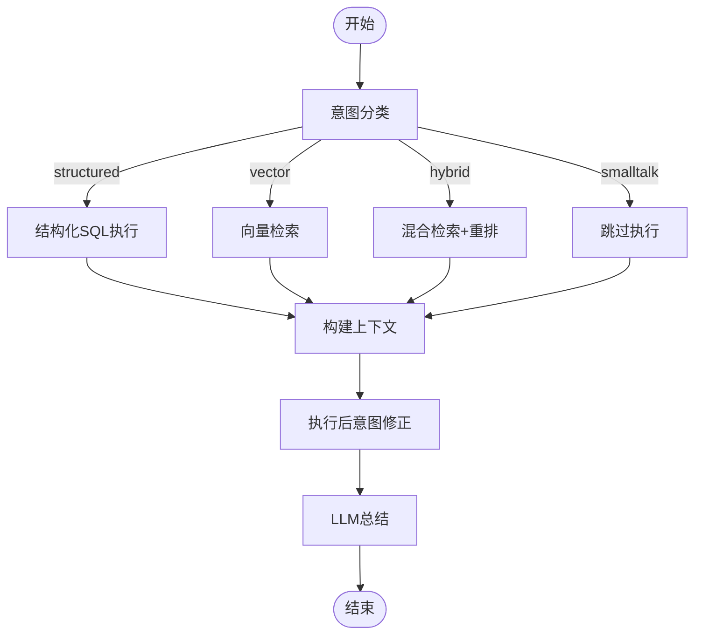
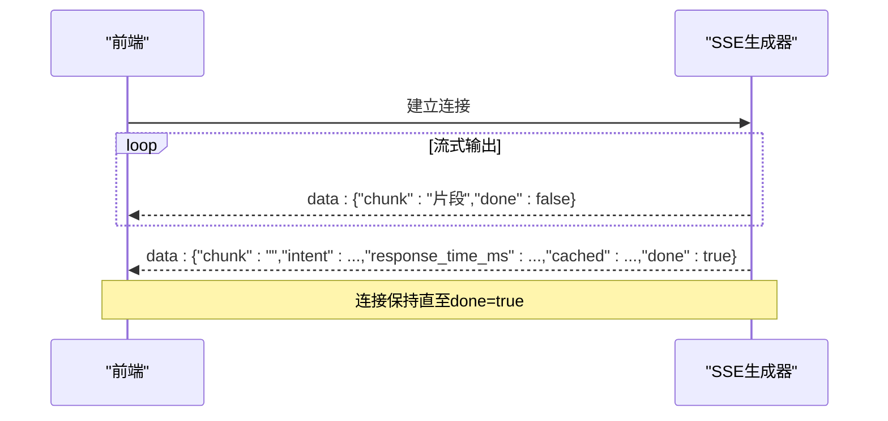
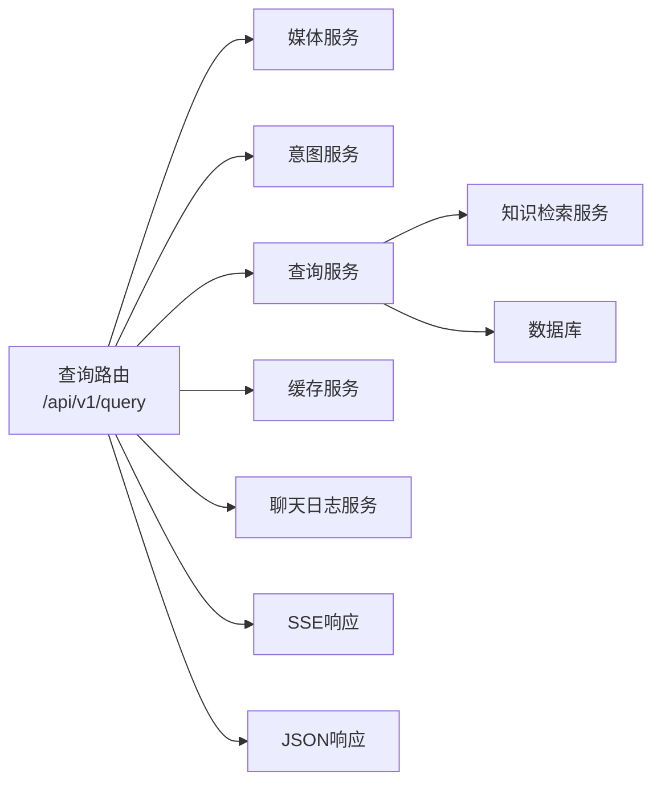

# 查询API

<cite>
**本文档引用的文件**
- [service/ai_assistant/app/routers/query.py](file://service/ai_assistant/app/routers/query.py)
- [service/ai_assistant/app/schemas/query.py](file://service/ai_assistant/app/schemas/query.py)
- [service/ai_assistant/app/services/query_service.py](file://service/ai_assistant/app/services/query_service.py)
- [service/ai_assistant/app/services/intent_service.py](file://service/ai_assistant/app/services/intent_service.py)
- [service/ai_assistant/app/services/retriever_service.py](file://service/ai_assistant/app/services/retriever_service.py)
- [service/ai_assistant/app/services/cache_service.py](file://service/ai_assistant/app/services/cache_service.py)
- [service/ai_assistant/app/services/media_service.py](file://service/ai_assistant/app/services/media_service.py)
- [service/ai_assistant/app/services/chat_log_service.py](file://service/ai_assistant/app/services/chat_log_service.py)
- [service/ai_assistant/app/utils/logger.py](file://service/ai_assistant/app/utils/logger.py)
- [service/ai_assistant/app/utils/privacy.py](file://service/ai_assistant/app/utils/privacy.py)
- [service/ai_assistant/app/config.py](file://service/ai_assistant/app/config.py)
- [service/ai_assistant/app/main.py](file://service/ai_assistant/app/main.py)
- [frontend/ai_assistant/src/api/query.js](file://frontend/ai_assistant/src/api/query.js)
</cite>

## 目录
1. [简介](#简介)
2. [项目结构](#项目结构)
3. [核心组件](#核心组件)
4. [架构总览](#架构总览)
5. [详细组件分析](#详细组件分析)
6. [依赖关系分析](#依赖关系分析)
7. [性能考量](#性能考量)
8. [故障排查指南](#故障排查指南)
9. [结论](#结论)
10. [附录](#附录)

## 简介
本文件为“AI校园助手查询API”的权威技术文档，面向后端开发者与集成方，系统阐述统一查询接口（POST /api/v1/query）的设计与实现，涵盖多模态输入处理（文本、图片、语音）、意图分类与查询重写、结构化SQL查询、向量检索与RAG融合、流式响应（SSE）、缓存策略与性能优化、错误处理与异常情况说明，并提供请求与响应示例，帮助快速集成与稳定运行。

## 项目结构
后端采用FastAPI + SQLAlchemy + Redis + 多模态与知识检索服务的分层架构。查询路由位于统一入口，请求经多模态预处理、安全与隐私检查、意图分类与重写、查询执行（结构化/向量/混合）、LLM总结与缓存，最终返回JSON或SSE流式响应。

图表来源
- [service/ai_assistant/app/routers/query.py:198-745](file://service/ai_assistant/app/routers/query.py#L198-L745)
- [service/ai_assistant/app/services/media_service.py:115-246](file://service/ai_assistant/app/services/media_service.py#L115-L246)
- [service/ai_assistant/app/services/intent_service.py:218-346](file://service/ai_assistant/app/services/intent_service.py#L218-L346)
- [service/ai_assistant/app/services/query_service.py:1034-1067](file://service/ai_assistant/app/services/query_service.py#L1034-L1067)
- [service/ai_assistant/app/services/retriever_service.py:46-135](file://service/ai_assistant/app/services/retriever_service.py#L46-L135)
- [service/ai_assistant/app/services/cache_service.py:92-176](file://service/ai_assistant/app/services/cache_service.py#L92-L176)
- [service/ai_assistant/app/services/chat_log_service.py](file://service/ai_assistant/app/services/chat_log_service.py)

章节来源
- [service/ai_assistant/app/main.py:52-86](file://service/ai_assistant/app/main.py#L52-L86)

## 核心组件
- 路由与控制流：统一查询端点负责多模态输入解码、缓存查找、安全与隐私检查、意图分类、查询执行、LLM总结、缓存与日志持久化、SSE/JSON响应。
- 模型与服务：
  - 媒体服务：图像理解（Qwen-VL系列）、语音识别（Paraformer实时）。
  - 意图服务：意图分类（structured/vector/hybrid/smalltalk）、查询重写、回答生成与流式输出。
  - 查询服务：结构化SQL工具集、向量检索、混合检索与重排、工具规划与执行。
  - 缓存服务：基于Redis的查询缓存，带敏感性与时间维度TTL。
  - 知识检索：百炼检索API封装，支持并发检索与重排。
  - 日志服务：聊天日志持久化与会话历史管理。

章节来源
- [service/ai_assistant/app/routers/query.py:198-745](file://service/ai_assistant/app/routers/query.py#L198-L745)
- [service/ai_assistant/app/schemas/query.py:8-33](file://service/ai_assistant/app/schemas/query.py#L8-L33)

## 架构总览
统一查询流程如下：
1) 多模态输入解码：Base64图像/音频转文本，拼接为统一查询文本。
2) 缓存查找：按DID+查询哈希命中缓存，命中则直接返回（JSON或SSE）。
3) 历史加载：从Redis或DB加载最近N轮历史，避免跨会话污染。
4) 并发执行：安全检查、隐私检查、查询重写。
5) 意图分类：基于重写后的查询进行意图判定。
6) 图片纯问答：若满足条件，直接基于图片描述回答，跳过检索。
7) 查询执行：结构化SQL、向量检索或混合检索，生成上下文。
8) 意图修正：根据执行结果修正意图（如vector→structured/hybrid）。
9) 回答生成：LLM总结，生成最终回答。
10) 缓存与日志：写入缓存与聊天日志，区分敏感与普通查询。
11) 响应：JSON或SSE流式输出。

图表来源
- [service/ai_assistant/app/routers/query.py:207-745](file://service/ai_assistant/app/routers/query.py#L207-L745)
- [service/ai_assistant/app/services/media_service.py:115-246](file://service/ai_assistant/app/services/media_service.py#L115-L246)
- [service/ai_assistant/app/services/intent_service.py:298-346](file://service/ai_assistant/app/services/intent_service.py#L298-L346)
- [service/ai_assistant/app/services/query_service.py:1034-1067](file://service/ai_assistant/app/services/query_service.py#L1034-L1067)
- [service/ai_assistant/app/services/retriever_service.py:46-135](file://service/ai_assistant/app/services/retriever_service.py#L46-L135)
- [service/ai_assistant/app/services/cache_service.py:92-176](file://service/ai_assistant/app/services/cache_service.py#L92-L176)
- [service/ai_assistant/app/services/chat_log_service.py](file://service/ai_assistant/app/services/chat_log_service.py)

## 详细组件分析

### 请求与响应模型
- 请求体（QueryRequest）
  - 字段：text（可选）、image_base64（可选）、audio_base64（可选）、session_id（可选）、output_type（可选，仅当值为"json"时返回结构化JSON）。
  - 编码：Base64图像与音频，UTF-8文本。
- 响应体（QueryResponse）
  - 字段：answer（回答）、intent（意图枚举）、session_id（本次会话ID）、response_time_ms（耗时毫秒）、cached（是否来自缓存）。
- 意图枚举（IntentType）
  - structured：结构化数据查询（SQL）。
  - vector：知识库向量检索。
  - hybrid：混合查询（结构化+向量）。
  - smalltalk：闲聊/寒暄等无需检索。

章节来源
- [service/ai_assistant/app/schemas/query.py:8-33](file://service/ai_assistant/app/schemas/query.py#L8-L33)

### 多模态输入处理
- 图像处理：将Base64图像优化（缩放、转JPEG）后，调用多模态模型生成自然语言描述。
- 语音处理：将Base64音频转换为16kHz单声道WAV，调用ASR模型转录为文本。
- 输入校验：至少提供文本、图像或音频之一；否则返回400。
- 统一查询文本：按顺序拼接“[图片内容]”、“[语音转文字]”、“用户文本”。

章节来源
- [service/ai_assistant/app/routers/query.py:230-273](file://service/ai_assistant/app/routers/query.py#L230-L273)
- [service/ai_assistant/app/services/media_service.py:115-246](file://service/ai_assistant/app/services/media_service.py#L115-L246)

### 安全与隐私检查
- 危险内容检测：对统一查询文本进行危险内容筛查，命中则返回干预提示。
- 隐私检查：识别是否试图查询他人学号，若命中则返回隐私提示并记录。
- 历史隔离：按DID+会话ID隔离历史，避免并发会话串话。

章节来源
- [service/ai_assistant/app/routers/query.py:347-471](file://service/ai_assistant/app/routers/query.py#L347-L471)
- [service/ai_assistant/app/routers/query.py:153-196](file://service/ai_assistant/app/routers/query.py#L153-L196)

### 意图分类与查询重写
- 意图分类：基于重写后的查询，返回structured/vector/hybrid/smalltalk。
- 查询重写：结合最近N轮历史，将最新问题重写为独立、完整的查询，补充缺失信息。
- 重写与分类失败回退：均回退到向量检索。

章节来源
- [service/ai_assistant/app/services/intent_service.py:218-249](file://service/ai_assistant/app/services/intent_service.py#L218-L249)
- [service/ai_assistant/app/services/intent_service.py:251-296](file://service/ai_assistant/app/services/intent_service.py#L251-L296)

### 图片纯问答与直接回答
- 判断逻辑：若用户文本包含特定关键词或文本极短且非结构化查询意图，则视为图片纯问答。
- 直接回答：根据图片内容生成回答，不触发检索；校园相关图片强调直接回答，无关图片引导关注校园活动。
- 意图强制：纯问答场景强制为smalltalk，避免检索。

章节来源
- [service/ai_assistant/app/routers/query.py:505-525](file://service/ai_assistant/app/routers/query.py#L505-L525)
- [service/ai_assistant/app/routers/query.py:90-112](file://service/ai_assistant/app/routers/query.py#L90-L112)

### 查询执行机制
- 结构化SQL：基于工具规划（计划器+规则），支持多意图联合查询，自动补齐学期ID。
- 向量检索：并发分解查询关键词，调用百炼检索API，合并去重后返回。
- 混合检索：并发获取向量与应用检索结果，由LLM重排融合。
- 执行后意图修正：根据上下文是否包含结构化/向量内容，动态修正意图。

图表来源
- [service/ai_assistant/app/services/query_service.py:1034-1067](file://service/ai_assistant/app/services/query_service.py#L1034-L1067)
- [service/ai_assistant/app/services/query_service.py:1075-1251](file://service/ai_assistant/app/services/query_service.py#L1075-L1251)
- [service/ai_assistant/app/services/retriever_service.py:46-135](file://service/ai_assistant/app/services/retriever_service.py#L46-L135)

章节来源
- [service/ai_assistant/app/services/query_service.py:1034-1067](file://service/ai_assistant/app/services/query_service.py#L1034-L1067)
- [service/ai_assistant/app/services/query_service.py:1075-1251](file://service/ai_assistant/app/services/query_service.py#L1075-L1251)

### 流式响应（SSE）机制
- SSE构造：统一SSE响应头，禁用缓存与反向代理缓冲。
- 数据格式：每次推送包含chunk字段；最后一条推送包含intent、response_time_ms、cached、done=true。
- 错误处理：捕获异常并返回包含error字段的最后一条数据包。
- 前端解析：兼容JSON与SSE两种返回；SSE按data:行解析，支持部分网关改写格式。

图表来源
- [service/ai_assistant/app/routers/query.py:115-125](file://service/ai_assistant/app/routers/query.py#L115-L125)
- [service/ai_assistant/app/routers/query.py:659-745](file://service/ai_assistant/app/routers/query.py#L659-L745)
- [frontend/ai_assistant/src/api/query.js:28-141](file://frontend/ai_assistant/src/api/query.js#L28-L141)

章节来源
- [service/ai_assistant/app/routers/query.py:115-125](file://service/ai_assistant/app/routers/query.py#L115-L125)
- [service/ai_assistant/app/routers/query.py:659-745](file://service/ai_assistant/app/routers/query.py#L659-L745)
- [frontend/ai_assistant/src/api/query.js:28-141](file://frontend/ai_assistant/src/api/query.js#L28-L141)

### 缓存策略与性能优化
- 缓存键：chat_cache:{version}:{did}:{query_md5}，版本号随查询/总结逻辑升级而更新。
- TTL策略：敏感查询30分钟，普通查询1天；时间敏感查询按“当日桶”校验；课表相关查询按版本号校验。
- 会话历史：Redis隔离存储，限制长度并设置过期，避免跨会话污染。
- 并发优化：安全检查、隐私检查与查询重写并发执行；向量检索并发分解关键词；SSE生成器在数据库连接释放后继续输出。
- 降级与回退：意图分类/重写失败回退向量；向量检索失败回退“未命中”文本；混合检索任一侧为空时直接返回另一侧。

章节来源
- [service/ai_assistant/app/services/cache_service.py:49-176](file://service/ai_assistant/app/services/cache_service.py#L49-L176)
- [service/ai_assistant/app/routers/query.py:347-352](file://service/ai_assistant/app/routers/query.py#L347-L352)
- [service/ai_assistant/app/routers/query.py:934-1031](file://service/ai_assistant/app/routers/query.py#L934-L1031)

### 错误处理与异常情况
- 多模态失败：图像/语音处理失败返回502，包含具体错误信息。
- 查询执行失败：返回502并包含异常详情。
- SSE异常：捕获异常并返回包含error字段的最后一条数据包。
- 隐私与危险：命中隐私或危险内容时返回定制化提示并记录日志。
- 前端兼容：SSE解析容错，兼容网关改写格式；JSON返回时前端兜底完成状态。

章节来源
- [service/ai_assistant/app/routers/query.py:237-260](file://service/ai_assistant/app/routers/query.py#L237-L260)
- [service/ai_assistant/app/routers/query.py:544-549](file://service/ai_assistant/app/routers/query.py#L544-L549)
- [service/ai_assistant/app/routers/query.py:740-744](file://service/ai_assistant/app/routers/query.py#L740-L744)
- [frontend/ai_assistant/src/api/query.js:78-109](file://frontend/ai_assistant/src/api/query.js#L78-L109)

## 依赖关系分析

图表来源
- [service/ai_assistant/app/routers/query.py:35-42](file://service/ai_assistant/app/routers/query.py#L35-L42)
- [service/ai_assistant/app/services/query_service.py:1034-1067](file://service/ai_assistant/app/services/query_service.py#L1034-L1067)
- [service/ai_assistant/app/services/retriever_service.py:46-135](file://service/ai_assistant/app/services/retriever_service.py#L46-L135)
- [service/ai_assistant/app/services/cache_service.py:92-176](file://service/ai_assistant/app/services/cache_service.py#L92-L176)

章节来源
- [service/ai_assistant/app/routers/query.py:35-42](file://service/ai_assistant/app/routers/query.py#L35-L42)

## 性能考量
- 并发与异步：多任务并发执行（安全检查、隐私检查、查询重写、向量检索），缩短端到端延迟。
- 连接池与资源释放：SSE生成器在数据库连接释放后继续输出，避免长时间占用连接。
- 缓存命中：对重复查询直接返回缓存，显著降低延迟与成本。
- 模型与外部API：合理设置模型温度与最大token，避免超长输出；向量检索启用重排与最小分数阈值，提高质量与稳定性。
- 前端体验：SSE流式输出提升感知速度；JSON返回时前端兜底完成状态，避免“正在思考”卡死。

## 故障排查指南
- 400错误：请求体缺少必要字段（至少提供text、image_base64或audio_base64之一）。
- 502错误：图像/语音处理失败、查询执行失败、ASR/API调用失败。
- 缓存异常：缓存键解析失败或payload类型不符，将删除旧键并继续执行。
- 意图/重写失败：自动回退到向量检索；检查模型配置与提示词。
- SSE无done：前端解析兜底，若服务端未发送done包，前端也会结束状态。
- Redis异常：降级到DB历史加载与缓存写入失败，不影响主流程。

章节来源
- [service/ai_assistant/app/routers/query.py:265-270](file://service/ai_assistant/app/routers/query.py#L265-L270)
- [service/ai_assistant/app/routers/query.py:544-549](file://service/ai_assistant/app/routers/query.py#L544-L549)
- [service/ai_assistant/app/services/cache_service.py:102-113](file://service/ai_assistant/app/services/cache_service.py#L102-L113)
- [frontend/ai_assistant/src/api/query.js:132-135](file://frontend/ai_assistant/src/api/query.js#L132-L135)

## 结论
本查询API通过统一端点整合多模态输入、意图理解、结构化与向量检索、混合RAG与LLM总结，提供高性能、可扩展、可缓存的校园智能问答能力。SSE流式响应与完善的错误处理保障了良好的用户体验与系统稳定性。建议在生产环境正确配置模型与外部服务密钥、Redis与数据库连接、CORS白名单，并持续监控缓存命中率与响应延迟。

## 附录

### 请求与响应示例（路径引用）
- JSON请求体（文本+图片+语音）
  - 示例路径：[service/ai_assistant/app/schemas/query.py:15-24](file://service/ai_assistant/app/schemas/query.py#L15-L24)
- JSON响应（answer、intent、session_id、response_time_ms、cached）
  - 示例路径：[service/ai_assistant/app/schemas/query.py:26-32](file://service/ai_assistant/app/schemas/query.py#L26-L32)
- SSE流式响应（chunk、intent、response_time_ms、cached、done）
  - 示例路径：[service/ai_assistant/app/routers/query.py:699-706](file://service/ai_assistant/app/routers/query.py#L699-L706)
- 前端SSE解析与兜底
  - 示例路径：[frontend/ai_assistant/src/api/query.js:28-141](file://frontend/ai_assistant/src/api/query.js#L28-L141)