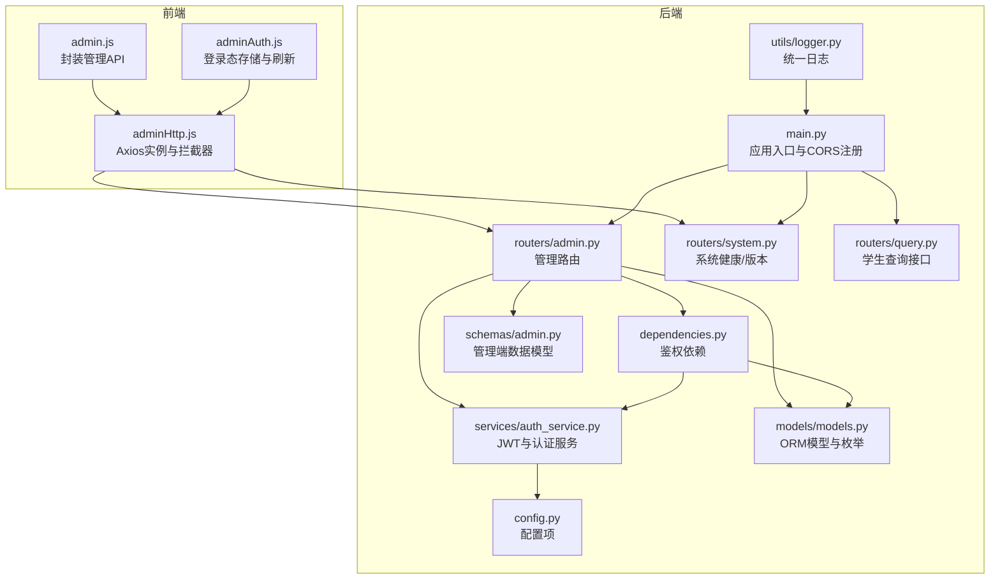
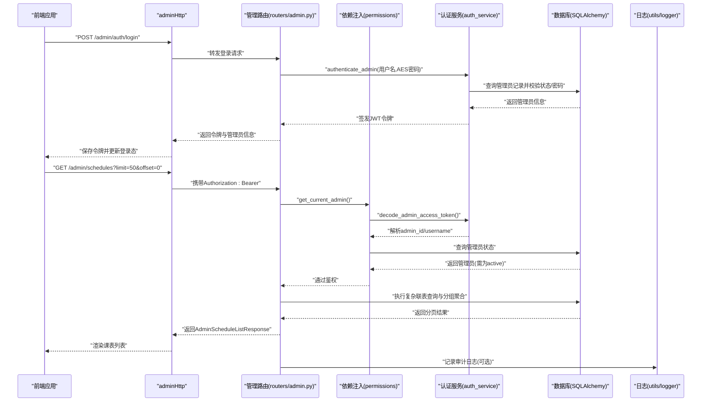
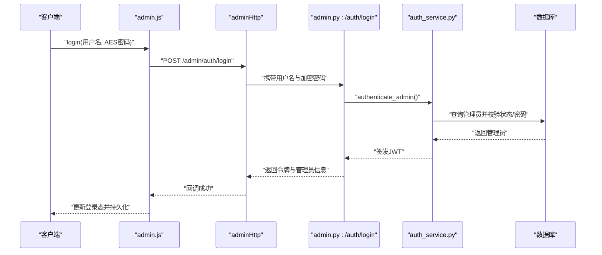
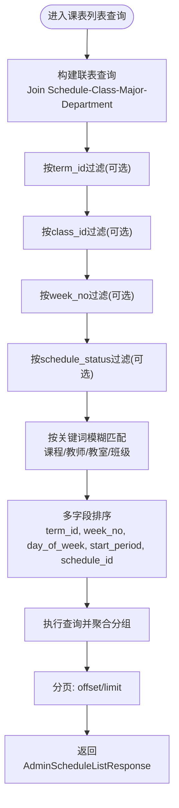
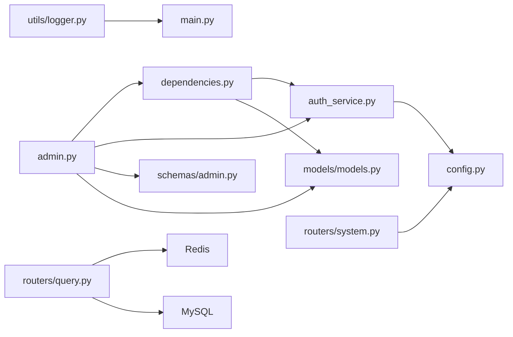

# 管理API

<cite>
**本文档引用的文件**
- [service/ai_assistant/app/routers/admin.py](file://service/ai_assistant/app/routers/admin.py)
- [service/ai_assistant/app/schemas/admin.py](file://service/ai_assistant/app/schemas/admin.py)
- [service/ai_assistant/app/services/auth_service.py](file://service/ai_assistant/app/services/auth_service.py)
- [service/ai_assistant/app/dependencies.py](file://service/ai_assistant/app/dependencies.py)
- [service/ai_assistant/app/models/models.py](file://service/ai_assistant/app/models/models.py)
- [service/ai_assistant/app/utils/logger.py](file://service/ai_assistant/app/utils/logger.py)
- [service/ai_assistant/app/config.py](file://service/ai_assistant/app/config.py)
- [service/ai_assistant/app/main.py](file://service/ai_assistant/app/main.py)
- [service/ai_assistant/app/routers/system.py](file://service/ai_assistant/app/routers/system.py)
- [service/ai_assistant/app/routers/query.py](file://service/ai_assistant/app/routers/query.py)
- [service/ai_assistant/app/schemas/query.py](file://service/ai_assistant/app/schemas/query.py)
- [frontend/ai_assistant/src/api/admin.js](file://frontend/ai_assistant/src/api/admin.js)
- [frontend/ai_assistant/src/api/adminHttp.js](file://frontend/ai_assistant/src/api/adminHttp.js)
- [frontend/ai_assistant/src/stores/adminAuth.js](file://frontend/ai_assistant/src/stores/adminAuth.js)
</cite>

## 目录
1. [简介](#简介)
2. [项目结构](#项目结构)
3. [核心组件](#核心组件)
4. [架构总览](#架构总览)
5. [详细组件分析](#详细组件分析)
6. [依赖分析](#依赖分析)
7. [性能考虑](#性能考虑)
8. [故障排查指南](#故障排查指南)
9. [结论](#结论)
10. [附录](#附录)

## 简介
本文件为“AI校园助手”管理API的权威文档，覆盖管理员认证与权限控制、课表管理、系统监控与统计、日志与审计等能力。文档面向后端开发者与前端集成人员，提供接口定义、参数说明、响应格式、调用示例与安全机制说明，帮助快速、安全地完成管理功能集成。

## 项目结构
后端采用FastAPI + SQLAlchemy + Redis + MySQL，管理API位于/admin路由前缀下；前端通过Axios封装的adminHttp实例与后端交互，并通过Pinia状态管理维护管理员登录态。

图表来源
- [service/ai_assistant/app/main.py:1-86](file://service/ai_assistant/app/main.py#L1-L86)
- [service/ai_assistant/app/routers/admin.py:1-388](file://service/ai_assistant/app/routers/admin.py#L1-L388)
- [service/ai_assistant/app/routers/system.py:1-38](file://service/ai_assistant/app/routers/system.py#L1-L38)
- [service/ai_assistant/app/routers/query.py:1-788](file://service/ai_assistant/app/routers/query.py#L1-L788)
- [service/ai_assistant/app/dependencies.py:1-109](file://service/ai_assistant/app/dependencies.py#L1-L109)
- [service/ai_assistant/app/services/auth_service.py:1-253](file://service/ai_assistant/app/services/auth_service.py#L1-L253)
- [service/ai_assistant/app/schemas/admin.py:1-105](file://service/ai_assistant/app/schemas/admin.py#L1-L105)
- [service/ai_assistant/app/models/models.py:1-200](file://service/ai_assistant/app/models/models.py#L1-L200)
- [service/ai_assistant/app/utils/logger.py:1-53](file://service/ai_assistant/app/utils/logger.py#L1-L53)
- [service/ai_assistant/app/config.py:1-113](file://service/ai_assistant/app/config.py#L1-L113)
- [frontend/ai_assistant/src/api/admin.js:1-41](file://frontend/ai_assistant/src/api/admin.js#L1-L41)
- [frontend/ai_assistant/src/api/adminHttp.js:1-44](file://frontend/ai_assistant/src/api/adminHttp.js#L1-L44)
- [frontend/ai_assistant/src/stores/adminAuth.js:1-77](file://frontend/ai_assistant/src/stores/adminAuth.js#L1-L77)

章节来源
- [service/ai_assistant/app/main.py:1-86](file://service/ai_assistant/app/main.py#L1-L86)
- [service/ai_assistant/app/routers/admin.py:1-388](file://service/ai_assistant/app/routers/admin.py#L1-L388)
- [frontend/ai_assistant/src/api/admin.js:1-41](file://frontend/ai_assistant/src/api/admin.js#L1-L41)
- [frontend/ai_assistant/src/api/adminHttp.js:1-44](file://frontend/ai_assistant/src/api/adminHttp.js#L1-L44)
- [frontend/ai_assistant/src/stores/adminAuth.js:1-77](file://frontend/ai_assistant/src/stores/adminAuth.js#L1-L77)

## 核心组件
- 管理员认证与权限
  - 登录：使用AES加密密码进行认证，签发JWT令牌，包含admin_id、username、display_name、role、expires_in等字段。
  - 当前管理员信息：携带Bearer Token访问，返回管理员基本信息。
  - 权限校验：依赖依赖注入获取当前管理员，校验状态为active，否则拒绝访问。
- 课表管理
  - 概览统计：待处理调整数、激活课表数、取消课表数、班级总数、学期总数。
  - 元数据：学期列表、班级列表（含专业与院系信息）。
  - 列表查询：支持按term_id、class_id、week_no、schedule_status、keyword等过滤，支持limit/offset分页与多字段排序。
  - 状态变更：更新课表状态（active/cancelled），记录审计日志，更新版本号与更新时间，必要时刷新缓存版本。
- 系统监控与统计
  - 健康检查：返回服务状态与名称。
  - 版本信息：返回应用名称与版本号。
- 日志与审计
  - 管理员操作审计：记录操作类型、目标表、主键、前后状态、原因等。
  - 运行日志：统一落盘至logs目录，支持控制台与文件双通道输出。

章节来源
- [service/ai_assistant/app/routers/admin.py:51-388](file://service/ai_assistant/app/routers/admin.py#L51-L388)
- [service/ai_assistant/app/schemas/admin.py:11-105](file://service/ai_assistant/app/schemas/admin.py#L11-L105)
- [service/ai_assistant/app/services/auth_service.py:63-123](file://service/ai_assistant/app/services/auth_service.py#L63-L123)
- [service/ai_assistant/app/dependencies.py:75-109](file://service/ai_assistant/app/dependencies.py#L75-L109)
- [service/ai_assistant/app/models/models.py:28-112](file://service/ai_assistant/app/models/models.py#L28-L112)
- [service/ai_assistant/app/routers/system.py:22-38](file://service/ai_assistant/app/routers/system.py#L22-L38)
- [service/ai_assistant/app/utils/logger.py:17-53](file://service/ai_assistant/app/utils/logger.py#L17-L53)

## 架构总览
管理API围绕“路由-依赖-服务-模型-日志”的分层组织，前端通过adminHttp统一注入Bearer Token，后端通过依赖注入解析JWT并校验管理员状态。

图表来源
- [service/ai_assistant/app/routers/admin.py:51-388](file://service/ai_assistant/app/routers/admin.py#L51-L388)
- [service/ai_assistant/app/dependencies.py:75-109](file://service/ai_assistant/app/dependencies.py#L75-L109)
- [service/ai_assistant/app/services/auth_service.py:212-253](file://service/ai_assistant/app/services/auth_service.py#L212-L253)
- [service/ai_assistant/app/utils/logger.py:17-53](file://service/ai_assistant/app/utils/logger.py#L17-L53)
- [frontend/ai_assistant/src/api/adminHttp.js:20-41](file://frontend/ai_assistant/src/api/adminHttp.js#L20-L41)

## 详细组件分析

### 管理员登录与访问控制
- 接口定义
  - POST /api/v1/admin/auth/login
    - 请求体：用户名、AES加密密码（兼容字段名：encrypted_password 或 password）
    - 成功响应：access_token、token_type、expires_in、admin_id、username、display_name、role
    - 失败响应：401/403（凭据无效或账号不可用）
  - GET /api/v1/admin/auth/me
    - 成功响应：admin_id、admin_code、username、display_name、role
- 认证流程
  - 服务端解密AES密码，校验管理员状态为active，验证密码哈希，更新最近登录时间。
  - 生成JWT，包含sub、role=admin、username、exp、iat等声明。
- 前端集成
  - adminHttp自动在请求头添加Authorization: Bearer token。
  - adminAuthStore负责本地存储与登录态刷新，401时自动清空并跳转登录页。

图表来源
- [service/ai_assistant/app/routers/admin.py:51-82](file://service/ai_assistant/app/routers/admin.py#L51-L82)
- [service/ai_assistant/app/services/auth_service.py:212-253](file://service/ai_assistant/app/services/auth_service.py#L212-L253)
- [frontend/ai_assistant/src/api/admin.js:7-12](file://frontend/ai_assistant/src/api/admin.js#L7-L12)
- [frontend/ai_assistant/src/api/adminHttp.js:20-29](file://frontend/ai_assistant/src/api/adminHttp.js#L20-L29)
- [frontend/ai_assistant/src/stores/adminAuth.js:28-47](file://frontend/ai_assistant/src/stores/adminAuth.js#L28-L47)

章节来源
- [service/ai_assistant/app/routers/admin.py:51-99](file://service/ai_assistant/app/routers/admin.py#L51-L99)
- [service/ai_assistant/app/services/auth_service.py:212-253](file://service/ai_assistant/app/services/auth_service.py#L212-L253)
- [service/ai_assistant/app/dependencies.py:75-109](file://service/ai_assistant/app/dependencies.py#L75-L109)
- [frontend/ai_assistant/src/api/admin.js:7-16](file://frontend/ai_assistant/src/api/admin.js#L7-L16)
- [frontend/ai_assistant/src/api/adminHttp.js:20-41](file://frontend/ai_assistant/src/api/adminHttp.js#L20-L41)
- [frontend/ai_assistant/src/stores/adminAuth.js:28-75](file://frontend/ai_assistant/src/stores/adminAuth.js#L28-L75)

### 课表管理与统计
- 概览统计
  - GET /api/v1/admin/dashboard/summary
  - 响应：pending_adjustments、active_schedules、cancelled_schedules、total_classes、total_terms
- 元数据
  - GET /api/v1/admin/meta/terms：返回学期列表（term_id、start_date、end_date）
  - GET /api/v1/admin/meta/classes：返回班级列表（class_id、class_name、grade、major_name、department_name）
- 课表列表
  - GET /api/v1/admin/schedules
  - 查询参数：term_id、class_id、week_no、schedule_status、keyword、limit、offset
  - 响应：total、items（每项包含课程、教师、教室、班级集合、状态、版本、更新时间等）
- 状态变更
  - PATCH /api/v1/admin/schedules/{schedule_id}/status
  - 请求体：schedule_status（active/cancelled）、reason（可选）
  - 响应：schedule_id、schedule_status、version、updated_at
  - 行为：若状态未变化则直接返回；否则更新状态、版本号、更新人与时间，记录审计日志，尝试刷新缓存版本。

图表来源
- [service/ai_assistant/app/routers/admin.py:199-301](file://service/ai_assistant/app/routers/admin.py#L199-L301)

章节来源
- [service/ai_assistant/app/routers/admin.py:102-144](file://service/ai_assistant/app/routers/admin.py#L102-L144)
- [service/ai_assistant/app/routers/admin.py:147-196](file://service/ai_assistant/app/routers/admin.py#L147-L196)
- [service/ai_assistant/app/routers/admin.py:199-301](file://service/ai_assistant/app/routers/admin.py#L199-L301)
- [service/ai_assistant/app/routers/admin.py:304-388](file://service/ai_assistant/app/routers/admin.py#L304-L388)
- [service/ai_assistant/app/schemas/admin.py:48-105](file://service/ai_assistant/app/schemas/admin.py#L48-L105)

### 系统监控与统计接口
- 健康检查
  - GET /api/v1/health
  - 响应：status、service
- 版本信息
  - GET /api/v1/version
  - 响应：name、version
- 学生查询接口（与管理端协同）
  - POST /api/v1/query
  - 支持文本、图像、音频输入，流式SSE输出或JSON输出；内部包含安全检查、意图分类、缓存与日志等流程。

章节来源
- [service/ai_assistant/app/routers/system.py:22-38](file://service/ai_assistant/app/routers/system.py#L22-L38)
- [service/ai_assistant/app/routers/query.py:198-746](file://service/ai_assistant/app/routers/query.py#L198-L746)
- [service/ai_assistant/app/schemas/query.py:15-33](file://service/ai_assistant/app/schemas/query.py#L15-L33)

### 日志管理与审计
- 管理员操作审计
  - 记录字段：admin_id、action_type、target_table、target_pk、reason、before_json、after_json、request_ip、created_at
  - 示例：课表状态变更记录，包含变更前后的状态与版本。
- 运行日志
  - 控制台与文件双通道输出，文件位于logs目录，支持滚动与保留策略。
- 安全与合规
  - 管理员状态为active才允许访问；登录成功后更新最近登录时间。

章节来源
- [service/ai_assistant/app/models/models.py:86-112](file://service/ai_assistant/app/models/models.py#L86-L112)
- [service/ai_assistant/app/routers/admin.py:352-364](file://service/ai_assistant/app/routers/admin.py#L352-L364)
- [service/ai_assistant/app/utils/logger.py:17-53](file://service/ai_assistant/app/utils/logger.py#L17-L53)
- [service/ai_assistant/app/dependencies.py:100-107](file://service/ai_assistant/app/dependencies.py#L100-L107)

## 依赖分析
- 组件耦合
  - 路由层依赖依赖注入与认证服务；认证服务依赖配置与数据库；模型层定义枚举与表关系；日志与配置贯穿各层。
- 外部依赖
  - JWT：用于管理员令牌签发与解析。
  - Redis：用于缓存与会话历史（学生侧查询接口），管理端亦在状态变更后尝试刷新缓存版本。
  - MySQL：ORM模型与事务管理。

图表来源
- [service/ai_assistant/app/routers/admin.py:1-388](file://service/ai_assistant/app/routers/admin.py#L1-L388)
- [service/ai_assistant/app/dependencies.py:1-109](file://service/ai_assistant/app/dependencies.py#L1-L109)
- [service/ai_assistant/app/services/auth_service.py:1-253](file://service/ai_assistant/app/services/auth_service.py#L1-L253)
- [service/ai_assistant/app/schemas/admin.py:1-105](file://service/ai_assistant/app/schemas/admin.py#L1-L105)
- [service/ai_assistant/app/models/models.py:1-200](file://service/ai_assistant/app/models/models.py#L1-L200)
- [service/ai_assistant/app/utils/logger.py:1-53](file://service/ai_assistant/app/utils/logger.py#L1-L53)
- [service/ai_assistant/app/config.py:1-113](file://service/ai_assistant/app/config.py#L1-L113)
- [service/ai_assistant/app/routers/system.py:1-38](file://service/ai_assistant/app/routers/system.py#L1-L38)
- [service/ai_assistant/app/routers/query.py:1-788](file://service/ai_assistant/app/routers/query.py#L1-L788)

章节来源
- [service/ai_assistant/app/routers/admin.py:1-388](file://service/ai_assistant/app/routers/admin.py#L1-L388)
- [service/ai_assistant/app/dependencies.py:1-109](file://service/ai_assistant/app/dependencies.py#L1-L109)
- [service/ai_assistant/app/services/auth_service.py:1-253](file://service/ai_assistant/app/services/auth_service.py#L1-L253)
- [service/ai_assistant/app/models/models.py:1-200](file://service/ai_assistant/app/models/models.py#L1-L200)
- [service/ai_assistant/app/utils/logger.py:1-53](file://service/ai_assistant/app/utils/logger.py#L1-L53)
- [service/ai_assistant/app/config.py:1-113](file://service/ai_assistant/app/config.py#L1-L113)
- [service/ai_assistant/app/routers/system.py:1-38](file://service/ai_assistant/app/routers/system.py#L1-L38)
- [service/ai_assistant/app/routers/query.py:1-788](file://service/ai_assistant/app/routers/query.py#L1-L788)

## 性能考虑
- 分页与排序
  - 列表接口支持limit/offset与多字段排序，建议前端按需分页，避免一次性加载过多数据。
- 缓存与版本
  - 状态变更后尝试刷新缓存版本，减少重复读取；注意Redis可用性异常时的降级路径。
- 并发与资源
  - 流式输出在请求会话结束后释放数据库连接，避免长时间占用；SSE响应设置防缓冲头部。
- 日志与监控
  - 统一日志落盘便于问题定位；生产环境建议开启更严格的CORS与安全配置。

[本节为通用指导，无需特定文件来源]

## 故障排查指南
- 401 未授权
  - 检查前端是否正确注入Authorization: Bearer token；确认令牌未过期；核对JWT密钥与算法配置。
- 403 禁止访问
  - 管理员状态非active；检查数据库中管理员状态字段。
- 登录失败
  - AES密码解密失败或密码哈希不匹配；确认前端加密密钥与后端一致。
- Redis异常
  - 缓存查询失败或无法刷新版本；检查Redis连接配置与可用性。
- 审计与日志
  - 审计日志缺失：确认状态变更流程是否正常提交事务；查看运行日志文件定位异常。

章节来源
- [service/ai_assistant/app/dependencies.py:80-107](file://service/ai_assistant/app/dependencies.py#L80-L107)
- [service/ai_assistant/app/services/auth_service.py:237-245](file://service/ai_assistant/app/services/auth_service.py#L237-L245)
- [service/ai_assistant/app/routers/admin.py:369-373](file://service/ai_assistant/app/routers/admin.py#L369-L373)
- [service/ai_assistant/app/utils/logger.py:17-53](file://service/ai_assistant/app/utils/logger.py#L17-L53)

## 结论
管理API提供了完善的管理员认证与权限控制、课表管理、系统监控与审计能力。通过清晰的分层设计与统一的日志体系，能够满足校园管理场景下的安全性与可运维性需求。建议在生产环境完善CORS白名单、密钥轮换与审计留痕策略，并结合前端状态管理实现稳定的登录体验。

[本节为总结性内容，无需特定文件来源]

## 附录

### 接口一览与调用示例

- 管理员登录
  - 方法与路径：POST /api/v1/admin/auth/login
  - 请求体字段
    - username：字符串，管理员用户名
    - encrypted_password 或 password：字符串，AES加密密码（格式见后端Schema）
  - 成功响应字段
    - access_token：字符串，JWT访问令牌
    - token_type：字符串，通常为bearer
    - expires_in：整数，令牌有效期（秒）
    - admin_id：整数，管理员ID
    - username：字符串，用户名
    - display_name：字符串，显示名称
    - role：枚举，管理员角色
  - 示例请求
    - POST /api/v1/admin/auth/login
    - Body: {"username": "admin", "encrypted_password": "iv_base64:cipher_base64"}
  - 示例响应
    - 200 OK
    - Body: {"access_token": "...", "token_type": "bearer", "expires_in": 86400, "admin_id": 1, "username": "admin", "display_name": "管理员", "role": "scheduler_admin"}

- 获取当前管理员信息
  - 方法与路径：GET /api/v1/admin/auth/me
  - 成功响应字段：admin_id、admin_code、username、display_name、role
  - 示例响应
    - 200 OK
    - Body: {"admin_id": 1, "admin_code": "A001", "username": "admin", "display_name": "管理员", "role": "scheduler_admin"}

- 管理员概览统计
  - 方法与路径：GET /api/v1/admin/dashboard/summary
  - 成功响应字段：pending_adjustments、active_schedules、cancelled_schedules、total_classes、total_terms
  - 示例响应
    - 200 OK
    - Body: {"pending_adjustments": 5, "active_schedules": 120, "cancelled_schedules": 10, "total_classes": 80, "total_terms": 4}

- 获取学期列表
  - 方法与路径：GET /api/v1/admin/meta/terms
  - 成功响应：数组，元素包含term_id、start_date、end_date
  - 示例响应
    - 200 OK
    - Body: [{"term_id": "202501", "start_date": "2025-02-24", "end_date": "2025-07-10"}, ...]

- 获取班级列表
  - 方法与路径：GET /api/v1/admin/meta/classes
  - 成功响应：数组，元素包含class_id、class_name、grade、major_name、department_name
  - 示例响应
    - 200 OK
    - Body: [{"class_id": "C001", "class_name": "计科1班", "grade": 2025, "major_name": "计算机科学与技术", "department_name": "计算机学院"}, ...]

- 课表列表（分页/筛选/排序）
  - 方法与路径：GET /api/v1/admin/schedules
  - 查询参数
    - term_id：字符串，学期ID（可选）
    - class_id：字符串，班级ID（可选）
    - week_no：整数，第几周（可选）
    - schedule_status：枚举，课表状态（可选）
    - keyword：字符串，关键词（可选）
    - limit：整数，分页大小，默认50，最大200
    - offset：整数，偏移量，默认0
  - 成功响应字段：total、items（每项包含课程、教师、教室、班级集合、状态、版本、更新时间等）
  - 示例响应
    - 200 OK
    - Body: {"total": 120, "items": [{...}]}

- 更新课表状态
  - 方法与路径：PATCH /api/v1/admin/schedules/{schedule_id}/status
  - 请求体字段
    - schedule_status：枚举，"active" 或 "cancelled"
    - reason：字符串，变更原因（可选，最大长度255）
  - 成功响应字段：schedule_id、schedule_status、version、updated_at
  - 示例请求
    - PATCH /api/v1/admin/schedules/S001/status
    - Body: {"schedule_status": "cancelled", "reason": "临时停课"}
  - 示例响应
    - 200 OK
    - Body: {"schedule_id": "S001", "schedule_status": "cancelled", "version": 3, "updated_at": "2025-04-05T12:34:56Z"}

- 健康检查
  - 方法与路径：GET /api/v1/health
  - 成功响应字段：status、service
  - 示例响应
    - 200 OK
    - Body: {"status": "ok", "service": "AI 校园助手"}

- 版本信息
  - 方法与路径：GET /api/v1/version
  - 成功响应字段：name、version
  - 示例响应
    - 200 OK
    - Body: {"name": "AI 校园助手", "version": "1.0.0"}

章节来源
- [service/ai_assistant/app/routers/admin.py:51-388](file://service/ai_assistant/app/routers/admin.py#L51-L388)
- [service/ai_assistant/app/schemas/admin.py:11-105](file://service/ai_assistant/app/schemas/admin.py#L11-L105)
- [service/ai_assistant/app/routers/system.py:22-38](file://service/ai_assistant/app/routers/system.py#L22-L38)

### 前端集成要点
- adminHttp
  - 自动注入Authorization: Bearer token
  - 401时自动清理登录态并跳转登录页
- adminApi
  - 提供login、me、getSummary、getTerms、getClasses、getSchedules、updateScheduleStatus等方法
- adminAuth
  - 使用localStorage持久化token与管理员信息，计算isAuthenticated并提供login/logout

章节来源
- [frontend/ai_assistant/src/api/adminHttp.js:12-41](file://frontend/ai_assistant/src/api/adminHttp.js#L12-L41)
- [frontend/ai_assistant/src/api/admin.js:6-40](file://frontend/ai_assistant/src/api/admin.js#L6-L40)
- [frontend/ai_assistant/src/stores/adminAuth.js:16-77](file://frontend/ai_assistant/src/stores/adminAuth.js#L16-L77)