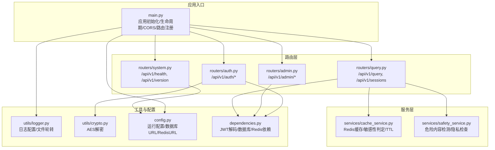
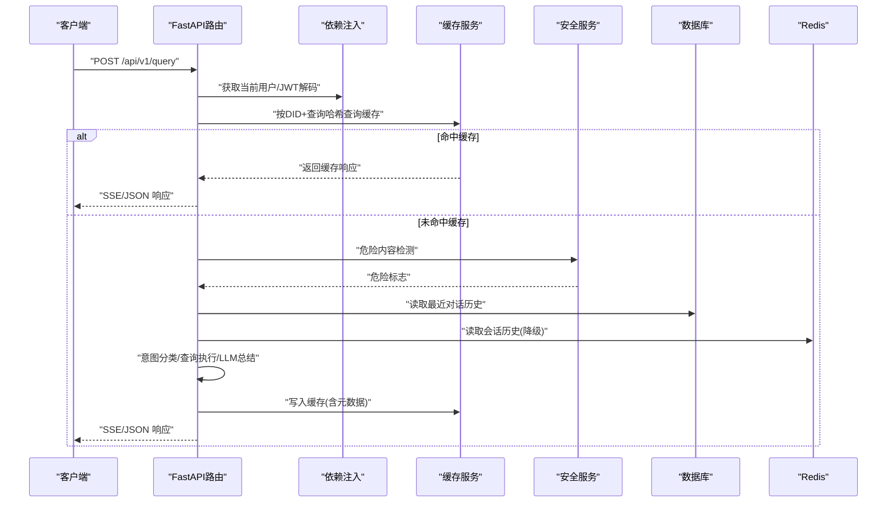
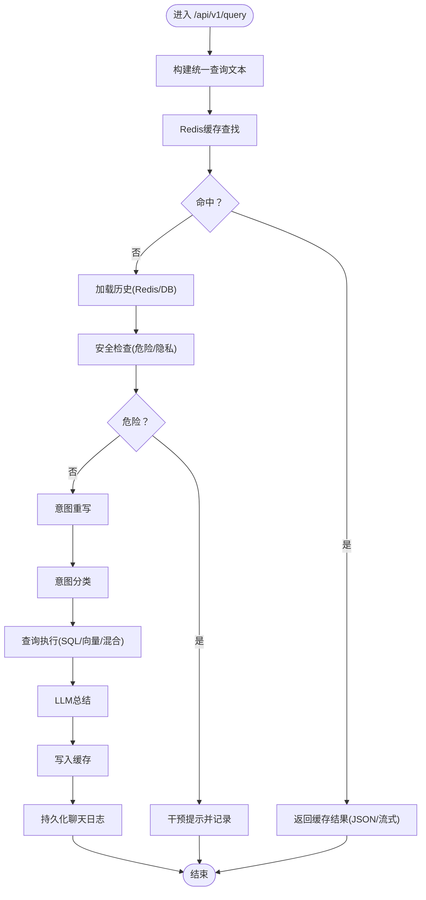
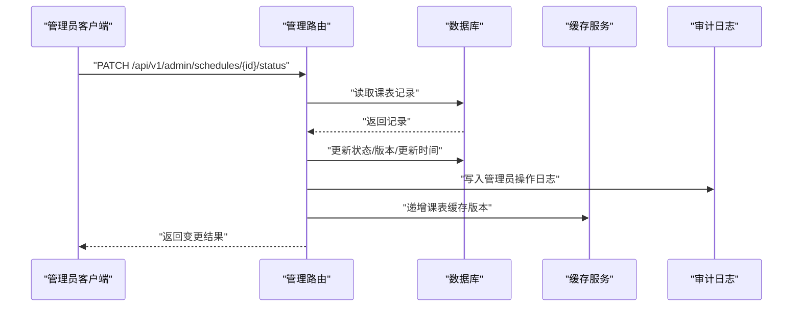
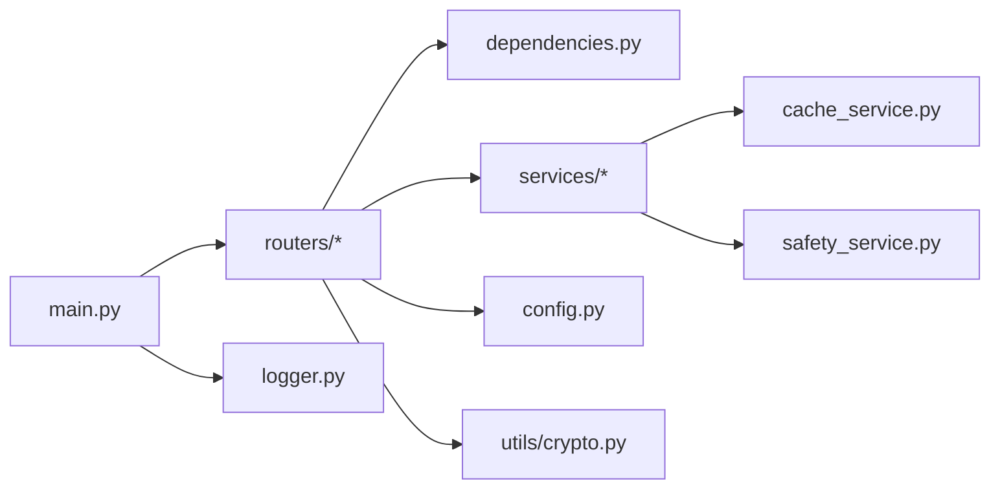

# 系统API

<cite>
**本文档引用的文件**
- [main.py](file://service/ai_assistant/app/main.py)
- [system.py](file://service/ai_assistant/app/routers/system.py)
- [admin.py](file://service/ai_assistant/app/routers/admin.py)
- [auth.py](file://service/ai_assistant/app/routers/auth.py)
- [query.py](file://service/ai_assistant/app/routers/query.py)
- [dependencies.py](file://service/ai_assistant/app/dependencies.py)
- [config.py](file://service/ai_assistant/app/config.py)
- [logger.py](file://service/ai_assistant/app/utils/logger.py)
- [cache_service.py](file://service/ai_assistant/app/services/cache_service.py)
- [safety_service.py](file://service/ai_assistant/app/services/safety_service.py)
- [crypto.py](file://service/ai_assistant/app/utils/crypto.py)
</cite>

## 目录
1. [简介](#简介)
2. [项目结构](#项目结构)
3. [核心组件](#核心组件)
4. [架构总览](#架构总览)
5. [详细组件分析](#详细组件分析)
6. [依赖分析](#依赖分析)
7. [性能考虑](#性能考虑)
8. [故障排查指南](#故障排查指南)
9. [结论](#结论)
10. [附录](#附录)

## 简介
本文件为“AI校园助手系统”的系统API完整文档，覆盖健康检查、系统配置管理、系统维护、通知与消息推送、系统升级与版本管理、系统安全等主题。文档基于后端FastAPI应用的实际实现，提供接口定义、调用示例、响应格式、错误处理与最佳实践，并辅以架构与数据流图示。

## 项目结构
后端采用FastAPI + SQLAlchemy + Redis + MySQL的分层架构：
- 应用入口负责生命周期管理、CORS配置与路由注册
- 路由模块按功能域划分（系统、认证、查询、管理）
- 服务层封装业务逻辑（缓存、安全、媒体、意图、查询等）
- 工具层提供日志、加解密、隐私等通用能力
- 配置层集中管理运行参数与外部服务凭据

图表来源
- [main.py:1-86](file://service/ai_assistant/app/main.py#L1-L86)
- [system.py:1-38](file://service/ai_assistant/app/routers/system.py#L1-L38)
- [auth.py:1-102](file://service/ai_assistant/app/routers/auth.py#L1-L102)
- [query.py:1-788](file://service/ai_assistant/app/routers/query.py#L1-L788)
- [admin.py:1-388](file://service/ai_assistant/app/routers/admin.py#L1-L388)
- [dependencies.py:1-109](file://service/ai_assistant/app/dependencies.py#L1-L109)
- [config.py:1-113](file://service/ai_assistant/app/config.py#L1-L113)
- [logger.py:1-53](file://service/ai_assistant/app/utils/logger.py#L1-L53)
- [cache_service.py:1-177](file://service/ai_assistant/app/services/cache_service.py#L1-L177)
- [safety_service.py:1-163](file://service/ai_assistant/app/services/safety_service.py#L1-L163)
- [crypto.py:1-73](file://service/ai_assistant/app/utils/crypto.py#L1-L73)

章节来源
- [main.py:1-86](file://service/ai_assistant/app/main.py#L1-L86)
- [config.py:1-113](file://service/ai_assistant/app/config.py#L1-L113)

## 核心组件
- 应用入口与生命周期：初始化日志、CORS、路由注册、启动/关闭钩子
- 路由模块：系统健康检查、版本信息；认证登录与密码修改；统一查询接口；管理员登录与课表状态变更
- 依赖注入：JWT解码、数据库会话、Redis客户端
- 服务组件：缓存服务（含敏感性判定与TTL）、安全服务（危险内容与隐私检查）
- 工具组件：日志（文件轮转）、加解密（AES-CBC）

章节来源
- [main.py:1-86](file://service/ai_assistant/app/main.py#L1-L86)
- [dependencies.py:1-109](file://service/ai_assistant/app/dependencies.py#L1-L109)
- [cache_service.py:1-177](file://service/ai_assistant/app/services/cache_service.py#L1-L177)
- [safety_service.py:1-163](file://service/ai_assistant/app/services/safety_service.py#L1-L163)
- [logger.py:1-53](file://service/ai_assistant/app/utils/logger.py#L1-L53)
- [crypto.py:1-73](file://service/ai_assistant/app/utils/crypto.py#L1-L73)

## 架构总览
系统API围绕“统一查询”主链路展开，涉及多模态输入、安全检查、缓存命中、意图分类、查询执行、LLM总结、缓存写入与日志持久化。管理员侧提供登录与课表状态变更，配合缓存版本控制实现课表变更后的缓存失效。

图表来源
- [query.py:198-745](file://service/ai_assistant/app/routers/query.py#L198-L745)
- [cache_service.py:92-177](file://service/ai_assistant/app/services/cache_service.py#L92-L177)
- [safety_service.py:84-144](file://service/ai_assistant/app/services/safety_service.py#L84-L144)
- [dependencies.py:56-73](file://service/ai_assistant/app/dependencies.py#L56-L73)

## 详细组件分析

### 健康检查接口（GET /api/v1/health）
- 路由：/api/v1/health
- 方法：GET
- 认证：无需
- 请求体：无
- 响应体字段
  - status：字符串，正常时为“ok”
  - service：字符串，服务名称（来自配置）
- 示例
  - 请求：curl -sS http://host:port/api/v1/health
  - 响应：{"status":"ok","service":"AI 校园助手"}

章节来源
- [system.py:22-28](file://service/ai_assistant/app/routers/system.py#L22-L28)

### 版本信息接口（GET /api/v1/version）
- 路由：/api/v1/version
- 方法：GET
- 认证：无需
- 请求体：无
- 响应体字段
  - name：字符串，应用名称
  - version：字符串，版本号
- 示例
  - 请求：curl -sS http://host:port/api/v1/version
  - 响应：{"name":"AI 校园助手","version":"1.0.0"}

章节来源
- [system.py:31-37](file://service/ai_assistant/app/routers/system.py#L31-L37)

### 系统配置管理接口
当前仓库未实现配置项查询、动态配置更新、配置备份恢复等接口。建议扩展点：
- 新增配置存储表与接口，支持读取/更新/备份/恢复
- 与运行时配置合并，提供热更新能力（谨慎处理敏感配置）
- 提供配置审计与版本对比

[本节为概念性说明，不直接分析具体文件]

### 系统维护接口
当前仓库未实现数据库维护、缓存清理、日志轮转、服务重启等接口。建议扩展点：
- 缓存清理：基于会话维度或按模式批量删除键
- 日志轮转：利用现有日志配置（文件大小/保留天数）
- 服务重启：通过容器编排或进程管理实现，不建议在应用内暴露

[本节为概念性说明，不直接分析具体文件]

### 系统通知与消息推送接口
当前仓库未实现系统公告发布、用户提醒发送、紧急通知处理等接口。建议扩展点：
- 公告发布：提供管理员端发布/撤销接口，客户端拉取
- 推送通道：WebSocket/SSE/短信/邮件（视需求选择）
- 紧急通知：结合安全服务触发的干预流程

[本节为概念性说明，不直接分析具体文件]

### 系统升级与版本管理接口
当前仓库未实现版本检查、自动更新、回滚机制等接口。建议扩展点：
- 版本检查：对外暴露当前版本与最新版本
- 自动更新：容器镜像更新或二进制替换（需运维配合）
- 回滚机制：灰度/蓝绿发布策略，配合配置回滚

[本节为概念性说明，不直接分析具体文件]

### 系统安全接口
- JWT认证：学生与管理员均使用Bearer Token
- AES密码传输：前端使用CryptoJS AES-CBC加密，后端解密
- 危险内容检测：基于大模型与正则的双重判定
- 隐私检查：阻止查询他人学号信息
- CORS限制：生产环境限定前端域名

章节来源
- [dependencies.py:56-109](file://service/ai_assistant/app/dependencies.py#L56-L109)
- [crypto.py:39-73](file://service/ai_assistant/app/utils/crypto.py#L39-L73)
- [safety_service.py:84-163](file://service/ai_assistant/app/services/safety_service.py#L84-L163)
- [main.py:70-76](file://service/ai_assistant/app/main.py#L70-L76)

### 认证与授权接口
- 学生登录
  - 路由：/api/v1/auth/login
  - 方法：POST
  - 请求体：学生ID + AES加密密码
  - 响应体：JWT Bearer令牌、有效期、学生ID
- 修改密码
  - 路由：/api/v1/auth/change-password
  - 方法：POST
  - 请求体：学生ID + 旧AES加密密码 + 新AES加密密码
  - 响应体：操作成功标识
- 管理员登录
  - 路由：/api/v1/admin/auth/login
  - 方法：POST
  - 请求体：管理员用户名 + AES加密密码
  - 响应体：JWT Bearer令牌、有效期、管理员信息

章节来源
- [auth.py:24-102](file://service/ai_assistant/app/routers/auth.py#L24-L102)
- [admin.py:51-82](file://service/ai_assistant/app/routers/admin.py#L51-L82)

### 统一查询接口（POST /api/v1/query）
- 路由：/api/v1/query
- 方法：POST
- 认证：需要有效Bearer Token
- 请求体字段
  - text：文本问题
  - image_base64：图片Base64
  - audio_base64：音频Base64
  - session_id：会话ID（可选）
  - output_type：输出类型（json/stream）
- 响应
  - JSON模式：一次性返回answer/intent/session_id/response_time_ms/cached
  - 流式模式：SSE，分块输出chunk，最后输出intent/response_time_ms/cached/done
- 处理流程要点
  - 多模态输入预处理（图像转文本、音频转文本）
  - 缓存命中优先返回
  - 安全检查（危险内容/隐私违规）
  - 历史加载（Redis优先，失败回退数据库）
  - 意图分类与查询执行
  - LLM总结与缓存写入
  - 聊天日志持久化

图表来源
- [query.py:198-745](file://service/ai_assistant/app/routers/query.py#L198-L745)
- [cache_service.py:92-177](file://service/ai_assistant/app/services/cache_service.py#L92-L177)
- [safety_service.py:84-163](file://service/ai_assistant/app/services/safety_service.py#L84-L163)

章节来源
- [query.py:198-745](file://service/ai_assistant/app/routers/query.py#L198-L745)

### 管理员课表状态变更接口
- 路由：/api/v1/admin/schedules/{schedule_id}/status
- 方法：PATCH
- 认证：需要管理员Bearer Token
- 请求体字段
  - schedule_status：目标状态（active/cancelled）
  - reason：变更原因（可选）
- 响应体字段
  - schedule_id：课表ID
  - schedule_status：变更后状态
  - version：版本号
  - updated_at：更新时间
- 变更流程
  - 校验记录存在性
  - 更新状态与版本号
  - 记录管理员操作日志
  - 主动提升课表缓存版本，使旧缓存失效

图表来源
- [admin.py:304-387](file://service/ai_assistant/app/routers/admin.py#L304-L387)
- [cache_service.py:78-82](file://service/ai_assistant/app/services/cache_service.py#L78-L82)

章节来源
- [admin.py:304-387](file://service/ai_assistant/app/routers/admin.py#L304-L387)

### 缓存与敏感性判定
- 缓存键规则：chat_cache:{version}:{did}:{query_md5}
- TTL规则：敏感查询30分钟，普通查询1天
- 敏感性判定：关键词匹配（成绩、分数、处分、隐私等）
- 日期敏感：跨天失效（今日/明日/本周等）
- 课表敏感：管理员改课后递增版本，旧缓存失效

章节来源
- [cache_service.py:1-177](file://service/ai_assistant/app/services/cache_service.py#L1-L177)

### 日志与监控
- 日志配置：控制台+文件，文件轮转10MB，保留14天
- 日志位置：service/ai_assistant/logs/ai_assistant_runtime.txt
- 监控建议：结合Nginx/Apache反向代理的健康检查与访问日志

章节来源
- [logger.py:17-46](file://service/ai_assistant/app/utils/logger.py#L17-L46)

## 依赖分析
- 应用入口依赖：FastAPI、CORS中间件、路由注册
- 路由依赖：数据库会话、Redis客户端、JWT解码
- 服务依赖：DashScope（安全检测）、Redis（缓存）、数据库（历史/日志）
- 配置依赖：环境变量（.env）提供数据库、Redis、JWT、AES、模型等参数

图表来源
- [main.py:1-86](file://service/ai_assistant/app/main.py#L1-L86)
- [dependencies.py:1-109](file://service/ai_assistant/app/dependencies.py#L1-L109)
- [config.py:1-113](file://service/ai_assistant/app/config.py#L1-L113)
- [logger.py:1-53](file://service/ai_assistant/app/utils/logger.py#L1-L53)
- [cache_service.py:1-177](file://service/ai_assistant/app/services/cache_service.py#L1-L177)
- [safety_service.py:1-163](file://service/ai_assistant/app/services/safety_service.py#L1-L163)
- [crypto.py:1-73](file://service/ai_assistant/app/utils/crypto.py#L1-L73)

章节来源
- [main.py:1-86](file://service/ai_assistant/app/main.py#L1-L86)
- [dependencies.py:1-109](file://service/ai_assistant/app/dependencies.py#L1-L109)

## 性能考虑
- 缓存命中优先：敏感查询与普通查询分别设置TTL，减少数据库与LLM调用
- 并发优化：安全检查与意图重写并行执行，缩短端到端延迟
- 流式输出：SSE分块返回，降低首字节延迟
- 历史隔离：按会话ID隔离Redis历史，避免并发串话
- 连接池：数据库与Redis连接池复用，减少连接开销

[本节为一般性指导，不直接分析具体文件]

## 故障排查指南
- 健康检查失败
  - 检查应用日志与CORS配置
  - 确认依赖服务（MySQL/Redis）可达
- 认证失败
  - 确认Bearer Token有效与格式正确
  - 检查JWT密钥与算法配置
- 查询异常
  - 查看安全服务与意图服务日志
  - 检查DashScope API Key与模型配置
  - 关注缓存异常与Redis连通性
- 管理员变更课表后缓存未刷新
  - 确认缓存版本递增逻辑执行
  - 检查Redis键空间与TTL设置

章节来源
- [logger.py:17-46](file://service/ai_assistant/app/utils/logger.py#L17-L46)
- [main.py:25-34](file://service/ai_assistant/app/main.py#L25-L34)
- [cache_service.py:78-82](file://service/ai_assistant/app/services/cache_service.py#L78-L82)

## 结论
本系统API以统一查询为核心，结合安全与缓存策略，提供稳定高效的校园问答体验。当前仓库实现了健康检查、版本信息、认证、统一查询与管理员课表状态变更等关键能力。建议后续补充系统配置管理、维护与升级接口，完善通知与消息推送能力，并持续优化缓存与安全策略。

[本节为总结性内容，不直接分析具体文件]

## 附录

### API调用示例与响应格式

- 健康检查
  - 请求：curl -sS http://host:port/api/v1/health
  - 响应：{"status":"ok","service":"AI 校园助手"}

- 版本信息
  - 请求：curl -sS http://host:port/api/v1/version
  - 响应：{"name":"AI 校园助手","version":"1.0.0"}

- 学生登录
  - 请求：curl -X POST http://host:port/api/v1/auth/login -H "Content-Type: application/json" -d '{"student_id":"...","encrypted_password":"..."}'
  - 响应：{"access_token":"...","expires_in":...,"student_id":"..."}

- 修改密码
  - 请求：curl -X POST http://host:port/api/v1/auth/change-password -H "Authorization: Bearer ..." -H "Content-Type: application/json" -d '{"student_id":"...","encrypted_old_password":"...","encrypted_new_password":"..."}'
  - 响应：{"student_id":"..."}

- 统一查询（JSON）
  - 请求：curl -X POST http://host:port/api/v1/query -H "Authorization: Bearer ..." -H "Content-Type: application/json" -d '{"text":"...","output_type":"json"}'
  - 响应：{"answer":"...","intent":"...","session_id":"...","response_time_ms":...,"cached":false}

- 统一查询（流式）
  - 请求：curl -N -X POST http://host:port/api/v1/query -H "Authorization: Bearer ..." -H "Content-Type: application/json" -d '{"text":"..."}'
  - 响应：SSE分块输出，最后包含intent/response_time_ms/cached/done

- 管理员登录
  - 请求：curl -X POST http://host:port/api/v1/admin/auth/login -H "Content-Type: application/json" -d '{"username":"...","encrypted_password":"..."}'
  - 响应：{"access_token":"...","expires_in":...,"admin_id":...,"username":"...","display_name":"...","role":"..."}

- 更新课表状态
  - 请求：curl -X PATCH http://host:port/api/v1/admin/schedules/{schedule_id}/status -H "Authorization: Bearer ..." -H "Content-Type: application/json" -d '{"schedule_status":"active","reason":"..."}'
  - 响应：{"schedule_id":"...","schedule_status":"active","version":...,"updated_at":"..."}

[本节为示例汇总，不直接分析具体文件]