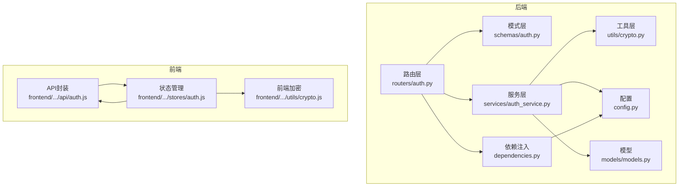
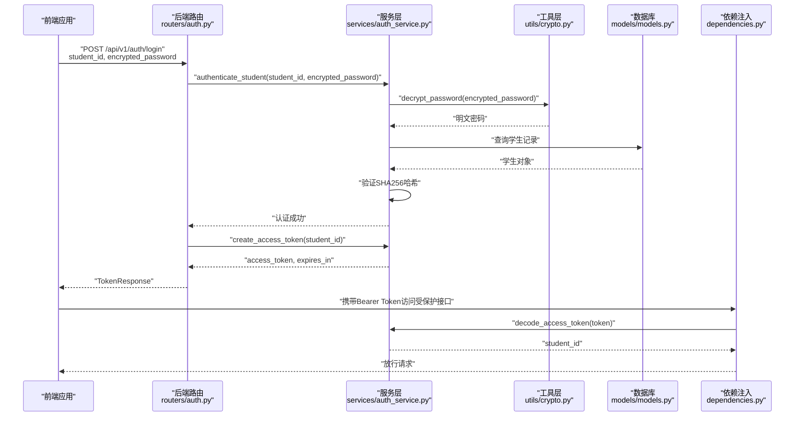
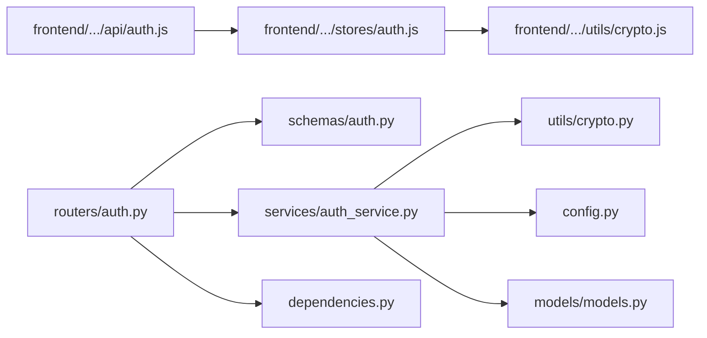

# 认证API

<cite>
**本文引用的文件列表**
- [auth.py](file://service/ai_assistant/app/routers/auth.py)
- [auth.py](file://service/ai_assistant/app/schemas/auth.py)
- [auth_service.py](file://service/ai_assistant/app/services/auth_service.py)
- [crypto.py](file://service/ai_assistant/app/utils/crypto.py)
- [dependencies.py](file://service/ai_assistant/app/dependencies.py)
- [config.py](file://service/ai_assistant/app/config.py)
- [auth.js](file://frontend/ai_assistant/src/api/auth.js)
- [crypto.js](file://frontend/ai_assistant/src/utils/crypto.js)
- [auth.js](file://frontend/ai_assistant/src/stores/auth.js)
- [models.py](file://service/ai_assistant/app/models/models.py)
- [main.py](file://service/ai_assistant/app/main.py)
</cite>

## 目录
1. [简介](#简介)
2. [项目结构](#项目结构)
3. [核心组件](#核心组件)
4. [架构总览](#架构总览)
5. [详细组件分析](#详细组件分析)
6. [依赖关系分析](#依赖关系分析)
7. [性能考量](#性能考量)
8. [故障排查指南](#故障排查指南)
9. [结论](#结论)
10. [附录](#附录)

## 简介
本文件为“AI校园助手”系统的认证API技术文档，重点覆盖以下内容：
- 学生登录接口（POST /api/v1/auth/login）：AES-CBC加密密码的使用方法、JWT令牌生成与有效期管理
- 修改密码接口（POST /api/v1/auth/change-password）：旧密码验证、新密码设置与安全检查
- 请求参数与响应数据结构说明：student_id、encrypted_password、access_token、expires_in 等字段含义
- 错误码与错误处理：401未授权、400错误请求、404未找到等
- 完整调用示例与响应示例，展示认证流程的实际使用方法
- 认证中间件与令牌验证机制说明

## 项目结构
后端采用 FastAPI 架构，认证相关代码集中在 app/routers、app/schemas、app/services、app/utils、app/dependencies、app/models 等目录；前端使用 Vue + Pinia，认证逻辑位于 frontend/ai_assistant/src 下。

图表来源
- [auth.py:1-102](file://service/ai_assistant/app/routers/auth.py#L1-L102)
- [auth.py:1-56](file://service/ai_assistant/app/schemas/auth.py#L1-L56)
- [auth_service.py:1-253](file://service/ai_assistant/app/services/auth_service.py#L1-L253)
- [crypto.py:1-73](file://service/ai_assistant/app/utils/crypto.py#L1-L73)
- [dependencies.py:1-109](file://service/ai_assistant/app/dependencies.py#L1-L109)
- [config.py:1-113](file://service/ai_assistant/app/config.py#L1-L113)
- [models.py:312-340](file://service/ai_assistant/app/models/models.py#L312-L340)
- [auth.js:1-36](file://frontend/ai_assistant/src/api/auth.js#L1-L36)
- [auth.js:1-77](file://frontend/ai_assistant/src/stores/auth.js#L1-L77)
- [crypto.js:1-40](file://frontend/ai_assistant/src/utils/crypto.js#L1-L40)

章节来源
- [auth.py:1-102](file://service/ai_assistant/app/routers/auth.py#L1-L102)
- [auth.py:1-56](file://service/ai_assistant/app/schemas/auth.py#L1-L56)
- [auth_service.py:1-253](file://service/ai_assistant/app/services/auth_service.py#L1-L253)
- [crypto.py:1-73](file://service/ai_assistant/app/utils/crypto.py#L1-L73)
- [dependencies.py:1-109](file://service/ai_assistant/app/dependencies.py#L1-L109)
- [config.py:1-113](file://service/ai_assistant/app/config.py#L1-L113)
- [models.py:312-340](file://service/ai_assistant/app/models/models.py#L312-L340)
- [auth.js:1-36](file://frontend/ai_assistant/src/api/auth.js#L1-L36)
- [auth.js:1-77](file://frontend/ai_assistant/src/stores/auth.js#L1-L77)
- [crypto.js:1-40](file://frontend/ai_assistant/src/utils/crypto.js#L1-L40)

## 核心组件
- 路由器：定义认证相关接口，负责接收请求、调用服务层并返回响应
- 模式层：定义请求/响应的数据结构与校验规则
- 服务层：实现登录认证、密码修改、JWT签发与解码等业务逻辑
- 工具层：提供AES-CBC解密能力，确保前后端加密格式一致
- 依赖注入：提供JWT Bearer认证中间件，解析并验证令牌
- 配置：集中管理JWT密钥、算法、过期时间以及AES密钥等
- 前端API封装与状态管理：负责加密密码、发起请求、存储令牌与过期时间

章节来源
- [auth.py:24-52](file://service/ai_assistant/app/routers/auth.py#L24-L52)
- [auth.py:55-101](file://service/ai_assistant/app/routers/auth.py#L55-L101)
- [auth.py:4-56](file://service/ai_assistant/app/schemas/auth.py#L4-L56)
- [auth_service.py:45-95](file://service/ai_assistant/app/services/auth_service.py#L45-L95)
- [auth_service.py:125-169](file://service/ai_assistant/app/services/auth_service.py#L125-L169)
- [auth_service.py:173-209](file://service/ai_assistant/app/services/auth_service.py#L173-L209)
- [crypto.py:39-72](file://service/ai_assistant/app/utils/crypto.py#L39-L72)
- [dependencies.py:56-72](file://service/ai_assistant/app/dependencies.py#L56-L72)
- [config.py:32-40](file://service/ai_assistant/app/config.py#L32-L40)

## 架构总览
认证流程涉及前后端协作与后端内部模块交互，整体如下：

图表来源
- [auth.py:33-52](file://service/ai_assistant/app/routers/auth.py#L33-L52)
- [auth_service.py:125-169](file://service/ai_assistant/app/services/auth_service.py#L125-L169)
- [auth_service.py:45-60](file://service/ai_assistant/app/services/auth_service.py#L45-L60)
- [crypto.py:39-72](file://service/ai_assistant/app/utils/crypto.py#L39-L72)
- [models.py:312-340](file://service/ai_assistant/app/models/models.py#L312-L340)
- [dependencies.py:56-72](file://service/ai_assistant/app/dependencies.py#L56-L72)

## 详细组件分析

### 学生登录接口（POST /api/v1/auth/login）
- 接口描述：使用学生ID与AES-CBC加密密码进行认证，返回JWT Bearer令牌
- 请求体字段
  - student_id：字符串，学生学号
  - encrypted_password：字符串，格式为 iv_base64:ciphertext_base64（URL安全Base64），前端使用CryptoJS AES-CBC加密
- 响应体字段
  - access_token：字符串，JWT访问令牌
  - token_type：字符串，默认bearer
  - expires_in：整数，令牌有效期（秒）
  - student_id：字符串，认证成功的学生学号
- 认证流程
  - 路由层接收请求，调用服务层的认证函数
  - 服务层先解密前端传来的加密密码，再与数据库中存储的密码哈希进行比对
  - 若认证通过，生成JWT令牌并返回
- 错误处理
  - 401未授权：学号或密码无效
- 前端调用要点
  - 前端使用CryptoJS对明文密码进行AES-CBC加密，格式与后端一致
  - 将加密后的密码作为 encrypted_password 发送
  - 登录成功后，前端将 access_token、student_id、expires_in 写入本地存储

章节来源
- [auth.py:24-52](file://service/ai_assistant/app/routers/auth.py#L24-L52)
- [auth.py:4-21](file://service/ai_assistant/app/schemas/auth.py#L4-L21)
- [auth_service.py:125-169](file://service/ai_assistant/app/services/auth_service.py#L125-L169)
- [auth_service.py:45-60](file://service/ai_assistant/app/services/auth_service.py#L45-L60)
- [crypto.py:39-72](file://service/ai_assistant/app/utils/crypto.py#L39-L72)
- [auth.js:15-20](file://frontend/ai_assistant/src/api/auth.js#L15-L20)
- [crypto.js:26-40](file://frontend/ai_assistant/src/utils/crypto.js#L26-L40)
- [auth.js:29-43](file://frontend/ai_assistant/src/stores/auth.js#L29-L43)

### 修改密码接口（POST /api/v1/auth/change-password）
- 接口描述：需要有效的Bearer Token，旧密码验证通过后才能更新新密码
- 请求体字段
  - student_id：字符串，当前登录学生学号（需与令牌中的学号一致）
  - encrypted_old_password：字符串，旧密码的AES-CBC加密
  - encrypted_new_password：字符串，新密码的AES-CBC加密
- 响应体字段
  - success：布尔，标记密码已更新
  - student_id：字符串，已修改密码的学号
  - detail：字符串，可读提示信息（默认“密码已更新”）
- 安全检查与流程
  - 路由层校验请求中的 student_id 与当前令牌中的学号一致，否则返回403
  - 服务层解密旧密码与新密码，验证旧密码是否匹配当前存储的哈希
  - 新密码与旧密码哈希不能相同
  - 通过后更新数据库中的密码哈希并提交事务
- 错误处理
  - 403禁止：禁止修改其他学生的密码
  - 404未找到：学生不存在
  - 400错误请求：旧密码不正确、新密码与旧密码相同、加密数据无效

章节来源
- [auth.py:55-101](file://service/ai_assistant/app/routers/auth.py#L55-L101)
- [auth.py:23-43](file://service/ai_assistant/app/schemas/auth.py#L23-L43)
- [auth_service.py:173-209](file://service/ai_assistant/app/services/auth_service.py#L173-L209)
- [dependencies.py:68-72](file://service/ai_assistant/app/dependencies.py#L68-L72)

### JWT令牌生成与有效期管理
- 令牌载荷
  - sub：学生学号
  - role：角色标识（student）
  - exp：过期时间（UTC）
  - iat：签发时间（UTC）
- 生成与返回
  - 服务层根据配置生成JWT并返回 expires_in（秒）
  - 路由层将 access_token、expires_in、student_id 组装为 TokenResponse
- 有效期
  - 默认1天（可通过配置调整）

章节来源
- [auth_service.py:45-60](file://service/ai_assistant/app/services/auth_service.py#L45-L60)
- [config.py:32-36](file://service/ai_assistant/app/config.py#L32-L36)
- [auth.py:47-52](file://service/ai_assistant/app/routers/auth.py#L47-L52)

### 认证中间件与令牌验证机制
- 中间件
  - 使用HTTP Bearer方案，自动从 Authorization 头提取令牌
  - 服务层解码并验证令牌，确保 role 为 student
- 令牌校验
  - 若令牌缺失、格式错误、角色不符或已过期，返回401未授权
- 前端使用
  - 登录成功后，前端将 access_token 存储于本地，并在后续请求头中携带 Authorization: Bearer {token}

章节来源
- [dependencies.py:56-72](file://service/ai_assistant/app/dependencies.py#L56-L72)
- [auth_service.py:78-95](file://service/ai_assistant/app/services/auth_service.py#L78-L95)
- [auth.js:34-40](file://frontend/ai_assistant/src/stores/auth.js#L34-L40)

## 依赖关系分析
- 路由层依赖模式层（请求/响应结构）、服务层（业务逻辑）、依赖注入（数据库会话、当前用户）
- 服务层依赖工具层（AES解密）、配置（JWT与AES密钥）、模型（数据库实体）
- 前端依赖后端API封装、状态管理与加密工具

图表来源
- [auth.js:1-36](file://frontend/ai_assistant/src/api/auth.js#L1-L36)
- [auth.js:1-77](file://frontend/ai_assistant/src/stores/auth.js#L1-L77)
- [crypto.js:1-40](file://frontend/ai_assistant/src/utils/crypto.js#L1-L40)
- [auth.py:1-21](file://service/ai_assistant/app/routers/auth.py#L1-L21)
- [auth.py:1-13](file://service/ai_assistant/app/schemas/auth.py#L1-L13)
- [auth_service.py:1-18](file://service/ai_assistant/app/services/auth_service.py#L1-L18)
- [dependencies.py:1-18](file://service/ai_assistant/app/dependencies.py#L1-L18)
- [crypto.py:1-14](file://service/ai_assistant/app/utils/crypto.py#L1-L14)
- [config.py:1-11](file://service/ai_assistant/app/config.py#L1-L11)
- [models.py:312-340](file://service/ai_assistant/app/models/models.py#L312-L340)

章节来源
- [auth.js:1-36](file://frontend/ai_assistant/src/api/auth.js#L1-L36)
- [auth.js:1-77](file://frontend/ai_assistant/src/stores/auth.js#L1-L77)
- [crypto.js:1-40](file://frontend/ai_assistant/src/utils/crypto.js#L1-L40)
- [auth.py:1-21](file://service/ai_assistant/app/routers/auth.py#L1-L21)
- [auth.py:1-13](file://service/ai_assistant/app/schemas/auth.py#L1-L13)
- [auth_service.py:1-18](file://service/ai_assistant/app/services/auth_service.py#L1-L18)
- [dependencies.py:1-18](file://service/ai_assistant/app/dependencies.py#L1-L18)
- [crypto.py:1-14](file://service/ai_assistant/app/utils/crypto.py#L1-L14)
- [config.py:1-11](file://service/ai_assistant/app/config.py#L1-L11)
- [models.py:312-340](file://service/ai_assistant/app/models/models.py#L312-L340)

## 性能考量
- JWT签发与解码开销极小，主要瓶颈在数据库查询与AES解密
- 建议
  - 合理设置JWT过期时间，避免频繁刷新
  - 前端仅在必要时发起认证请求，减少无效调用
  - 数据库索引优化（如按学号查询），确保认证与密码修改查询高效

## 故障排查指南
- 常见错误与定位
  - 401未授权：检查Authorization头是否正确、令牌是否过期、角色是否为student
  - 400错误请求：检查加密数据格式、旧密码验证失败、新旧密码相同
  - 404未找到：确认学生是否存在
  - 403禁止：请求中的 student_id 与当前令牌中的学号不一致
- 前端常见问题
  - 加密格式不匹配：确保前端使用URL安全Base64编码且格式为 iv_base64:ciphertext_base64
  - 本地存储未更新：登录成功后需正确写入token、student_id、expires_at

章节来源
- [auth.py:41-45](file://service/ai_assistant/app/routers/auth.py#L41-L45)
- [auth.py:86-99](file://service/ai_assistant/app/routers/auth.py#L86-L99)
- [dependencies.py:60-71](file://service/ai_assistant/app/dependencies.py#L60-L71)
- [crypto.py:52-63](file://service/ai_assistant/app/utils/crypto.py#L52-L63)
- [auth.js:108-120](file://frontend/ai_assistant/src/stores/auth.js#L108-L120)

## 结论
本认证API以JWT为核心，结合AES-CBC加密与严格的校验流程，提供了安全、清晰的认证与密码修改能力。前后端通过统一的加密格式与令牌机制协同工作，既保证了安全性，也便于扩展与维护。

## 附录

### 请求参数与响应数据结构
- 登录请求
  - student_id：字符串，学生学号
  - encrypted_password：字符串，格式为 iv_base64:ciphertext_base64（URL安全Base64）
- 登录响应
  - access_token：字符串，JWT访问令牌
  - token_type：字符串，默认bearer
  - expires_in：整数，令牌有效期（秒）
  - student_id：字符串，认证成功的学生学号
- 修改密码请求
  - student_id：字符串，当前登录学生学号
  - encrypted_old_password：字符串，旧密码的AES-CBC加密
  - encrypted_new_password：字符串，新密码的AES-CBC加密
- 修改密码响应
  - success：布尔，标记密码已更新
  - student_id：字符串，已修改密码的学号
  - detail：字符串，可读提示信息

章节来源
- [auth.py:4-56](file://service/ai_assistant/app/schemas/auth.py#L4-L56)
- [auth.py:24-52](file://service/ai_assistant/app/routers/auth.py#L24-L52)
- [auth.py:55-101](file://service/ai_assistant/app/routers/auth.py#L55-L101)

### 错误码说明
- 401未授权：认证失败，通常因令牌缺失、格式错误、角色不符或已过期
- 400错误请求：旧密码不正确、新密码与旧密码相同、加密数据无效
- 404未找到：学生不存在
- 403禁止：禁止修改其他学生的密码

章节来源
- [auth.py:42-45](file://service/ai_assistant/app/routers/auth.py#L42-L45)
- [auth.py:86-99](file://service/ai_assistant/app/routers/auth.py#L86-L99)
- [dependencies.py:60-71](file://service/ai_assistant/app/dependencies.py#L60-L71)

### API调用示例与响应示例
- 登录接口
  - 请求
    - 方法：POST
    - 路径：/api/v1/auth/login
    - 请求体字段：student_id、encrypted_password
  - 响应
    - 字段：access_token、token_type、expires_in、student_id
- 修改密码接口
  - 请求
    - 方法：POST
    - 路径：/api/v1/auth/change-password
    - 请求头：Authorization: Bearer {access_token}
    - 请求体字段：student_id、encrypted_old_password、encrypted_new_password
  - 响应
    - 字段：success、student_id、detail

章节来源
- [auth.py:24-52](file://service/ai_assistant/app/routers/auth.py#L24-L52)
- [auth.py:55-101](file://service/ai_assistant/app/routers/auth.py#L55-L101)
- [auth.js:15-35](file://frontend/ai_assistant/src/api/auth.js#L15-L35)

### AES-CBC加密与解密要点
- 前端加密
  - 使用CryptoJS AES-CBC，PKCS7填充
  - 输出格式：iv_base64:ciphertext_base64（URL安全Base64）
- 后端解密
  - 从配置读取AES密钥（16/24/32字节）
  - 还原URL安全Base64并解密，去除PKCS7填充
  - 若格式或解密失败，抛出无效加密数据异常

章节来源
- [crypto.py:17-72](file://service/ai_assistant/app/utils/crypto.py#L17-L72)
- [crypto.js:26-40](file://frontend/ai_assistant/src/utils/crypto.js#L26-L40)