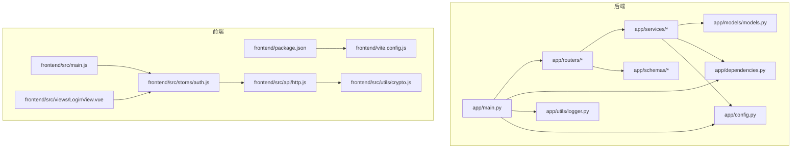
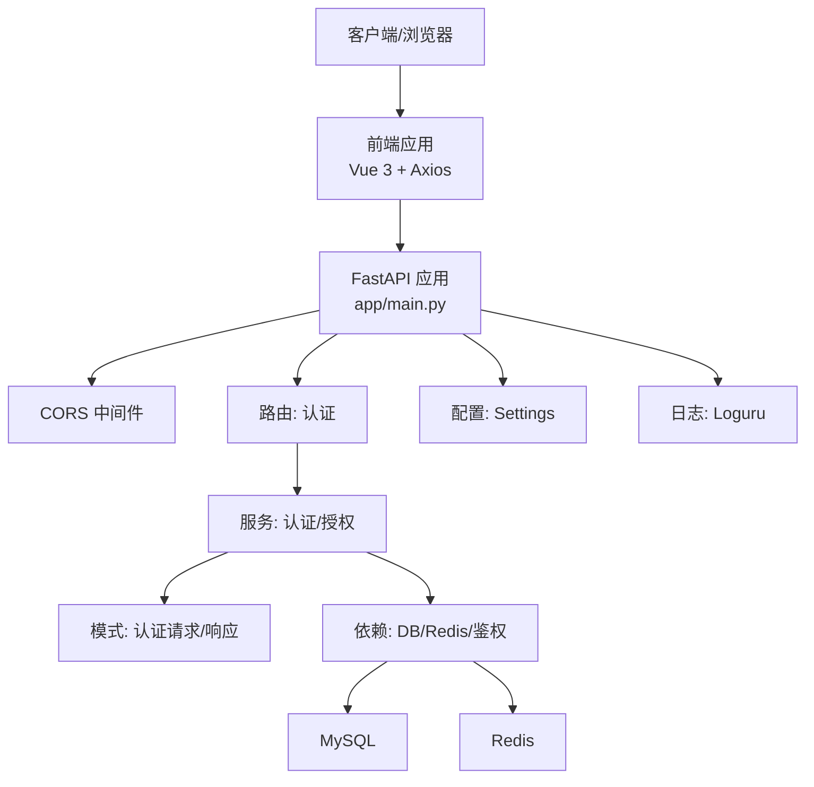
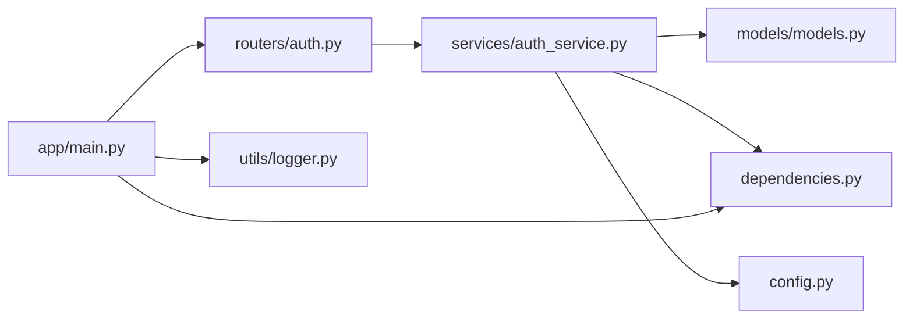

# 代码规范

<cite>
**本文引用的文件**
- [service/ai_assistant/app/main.py](file://service/ai_assistant/app/main.py)
- [service/ai_assistant/app/config.py](file://service/ai_assistant/app/config.py)
- [service/ai_assistant/app/models/models.py](file://service/ai_assistant/app/models/models.py)
- [service/ai_assistant/app/routers/auth.py](file://service/ai_assistant/app/routers/auth.py)
- [service/ai_assistant/app/schemas/auth.py](file://service/ai_assistant/app/schemas/auth.py)
- [service/ai_assistant/app/services/auth_service.py](file://service/ai_assistant/app/services/auth_service.py)
- [service/ai_assistant/app/utils/logger.py](file://service/ai_assistant/app/utils/logger.py)
- [service/ai_assistant/app/dependencies.py](file://service/ai_assistant/app/dependencies.py)
- [frontend/ai_assistant/package.json](file://frontend/ai_assistant/package.json)
- [frontend/ai_assistant/vite.config.js](file://frontend/ai_assistant/vite.config.js)
- [frontend/ai_assistant/src/main.js](file://frontend/ai_assistant/src/main.js)
- [frontend/ai_assistant/src/api/http.js](file://frontend/ai_assistant/src/api/http.js)
- [frontend/ai_assistant/src/stores/auth.js](file://frontend/ai_assistant/src/stores/auth.js)
- [frontend/ai_assistant/src/views/LoginView.vue](file://frontend/ai_assistant/src/views/LoginView.vue)
- [frontend/ai_assistant/src/utils/crypto.js](file://frontend/ai_assistant/src/utils/crypto.js)
</cite>

## 目录
1. [引言](#引言)
2. [项目结构](#项目结构)
3. [核心组件](#核心组件)
4. [架构总览](#架构总览)
5. [详细组件分析](#详细组件分析)
6. [依赖分析](#依赖分析)
7. [性能考虑](#性能考虑)
8. [故障排查指南](#故障排查指南)
9. [结论](#结论)
10. [附录](#附录)

## 引言
本文件为“AI校园助手”项目的代码规范文档，面向后端（Python/FastAPI）、前端（Vue 3/TypeScript）与数据库模型，系统性地给出风格指南、最佳实践、错误处理模式、API组织原则、Pydantic模型定义规范、注释与命名约定、文件组织结构以及格式化与自动化检查流程建议。文档中的具体实现细节均以仓库现有代码为依据，并通过“章节来源”标注出处。

## 项目结构
项目采用前后端分离架构：
- 后端：FastAPI 应用，按功能模块组织路由、服务、模型与工具；配置集中于 Settings；日志统一由 Loguru 管理；依赖注入集中在 dependencies 中。
- 前端：Vue 3 + Vite，使用 Pinia 管理状态，Axios 封装统一请求与拦截器，路由组织页面视图。

图表来源
- [service/ai_assistant/app/main.py:1-86](file://service/ai_assistant/app/main.py#L1-L86)
- [service/ai_assistant/app/config.py:1-113](file://service/ai_assistant/app/config.py#L1-L113)
- [service/ai_assistant/app/utils/logger.py:1-53](file://service/ai_assistant/app/utils/logger.py#L1-L53)
- [service/ai_assistant/app/dependencies.py:1-109](file://service/ai_assistant/app/dependencies.py#L1-L109)
- [service/ai_assistant/app/models/models.py:1-660](file://service/ai_assistant/app/models/models.py#L1-L660)
- [service/ai_assistant/app/routers/auth.py:1-102](file://service/ai_assistant/app/routers/auth.py#L1-L102)
- [service/ai_assistant/app/schemas/auth.py:1-56](file://service/ai_assistant/app/schemas/auth.py#L1-L56)
- [service/ai_assistant/app/services/auth_service.py:1-253](file://service/ai_assistant/app/services/auth_service.py#L1-L253)
- [frontend/ai_assistant/package.json:1-24](file://frontend/ai_assistant/package.json#L1-L24)
- [frontend/ai_assistant/vite.config.js:1-23](file://frontend/ai_assistant/vite.config.js#L1-L23)
- [frontend/ai_assistant/src/main.js:1-10](file://frontend/ai_assistant/src/main.js#L1-L10)
- [frontend/ai_assistant/src/api/http.js:1-49](file://frontend/ai_assistant/src/api/http.js#L1-L49)
- [frontend/ai_assistant/src/stores/auth.js:1-77](file://frontend/ai_assistant/src/stores/auth.js#L1-L77)
- [frontend/ai_assistant/src/views/LoginView.vue:1-343](file://frontend/ai_assistant/src/views/LoginView.vue#L1-L343)
- [frontend/ai_assistant/src/utils/crypto.js:1-40](file://frontend/ai_assistant/src/utils/crypto.js#L1-L40)

章节来源
- [service/ai_assistant/app/main.py:1-86](file://service/ai_assistant/app/main.py#L1-L86)
- [service/ai_assistant/app/config.py:1-113](file://service/ai_assistant/app/config.py#L1-L113)
- [frontend/ai_assistant/package.json:1-24](file://frontend/ai_assistant/package.json#L1-L24)
- [frontend/ai_assistant/vite.config.js:1-23](file://frontend/ai_assistant/vite.config.js#L1-L23)

## 核心组件
- 应用入口与生命周期：FastAPI 应用初始化、CORS 中间件、路由注册、生命周期钩子用于安全检查与资源清理。
- 配置中心：集中管理应用名称、版本、数据库、Redis、JWT、AES、隐私盐、LLM 模型、缓存 TTL 等。
- 日志系统：统一使用 Loguru，控制台与文件双通道输出，支持轮转与保留策略。
- 依赖注入：数据库会话、Redis 客户端、当前用户与管理员解析。
- 认证与授权：JWT 创建/解码、学生与管理员认证、密码变更服务。
- 数据模型：基于 SQLAlchemy ORM 的完整校务实体模型，含枚举、索引与约束。
- 前端工程：Vite + Vue 3 + Pinia + Axios，统一请求拦截与响应拦截，状态持久化。

章节来源
- [service/ai_assistant/app/main.py:36-86](file://service/ai_assistant/app/main.py#L36-L86)
- [service/ai_assistant/app/config.py:6-113](file://service/ai_assistant/app/config.py#L6-L113)
- [service/ai_assistant/app/utils/logger.py:17-53](file://service/ai_assistant/app/utils/logger.py#L17-L53)
- [service/ai_assistant/app/dependencies.py:27-109](file://service/ai_assistant/app/dependencies.py#L27-L109)
- [service/ai_assistant/app/services/auth_service.py:45-123](file://service/ai_assistant/app/services/auth_service.py#L45-L123)
- [service/ai_assistant/app/models/models.py:41-660](file://service/ai_assistant/app/models/models.py#L41-L660)
- [frontend/ai_assistant/src/api/http.js:10-49](file://frontend/ai_assistant/src/api/http.js#L10-L49)
- [frontend/ai_assistant/src/stores/auth.js:17-77](file://frontend/ai_assistant/src/stores/auth.js#L17-L77)

## 架构总览
后端采用分层架构：路由层（routers）负责 API 定义与参数绑定；服务层（services）封装业务逻辑；模型层（models）定义数据库结构；依赖层（dependencies）提供会话、Redis、鉴权解析；配置层（config）集中环境变量与默认值；日志层（utils/logger）统一输出。

图表来源
- [service/ai_assistant/app/main.py:52-86](file://service/ai_assistant/app/main.py#L52-L86)
- [service/ai_assistant/app/routers/auth.py:21-102](file://service/ai_assistant/app/routers/auth.py#L21-L102)
- [service/ai_assistant/app/services/auth_service.py:125-253](file://service/ai_assistant/app/services/auth_service.py#L125-L253)
- [service/ai_assistant/app/dependencies.py:27-109](file://service/ai_assistant/app/dependencies.py#L27-L109)
- [service/ai_assistant/app/config.py:6-113](file://service/ai_assistant/app/config.py#L6-L113)
- [service/ai_assistant/app/utils/logger.py:17-53](file://service/ai_assistant/app/utils/logger.py#L17-L53)

## 详细组件分析

### Python 后端代码风格与最佳实践
- PEP8 与类型注解
  - 使用 from __future__ import annotations 与 typing.AsyncGenerator 等现代语法。
  - 函数/方法参数与返回值使用明确类型注解，如 AsyncSession、dict[str, str|int]。
  - 变量命名遵循 snake_case，类名使用 PascalCase，常量大写。
- FastAPI 最佳实践
  - 使用 lifespan 生命周期进行启动/关闭资源管理，避免全局副作用。
  - 路由前缀与标签规范化，统一 API 版本路径。
  - 使用 Pydantic v2 模式进行输入校验与序列化。
- 异步编程规范
  - 所有数据库操作使用 SQLAlchemy AsyncSession，依赖注入通过 Depends 提供。
  - Redis 客户端使用 aioredis，单例懒加载，关闭时显式释放连接池。
- 错误处理模式
  - 服务层抛出领域异常（如 PasswordChangeError），路由层捕获并映射为 HTTPException。
  - JWT 解码失败与权限不足场景统一返回 401/403。
  - 日志记录关键事件与错误堆栈，便于追踪。

章节来源
- [service/ai_assistant/app/main.py:36-86](file://service/ai_assistant/app/main.py#L36-L86)
- [service/ai_assistant/app/dependencies.py:27-109](file://service/ai_assistant/app/dependencies.py#L27-L109)
- [service/ai_assistant/app/services/auth_service.py:21-253](file://service/ai_assistant/app/services/auth_service.py#L21-L253)
- [service/ai_assistant/app/routers/auth.py:24-102](file://service/ai_assistant/app/routers/auth.py#L24-L102)

### Pydantic 模型定义规范
- 字段校验与兼容
  - 使用 model_config(populate_by_name=True) 支持字段别名，兼容历史字段名。
  - 使用 model_validator(mode="before") 处理字段兼容与转换。
- 输出模型
  - 响应模型包含必要字段与描述，如 expires_in、student_id。
- 与 FastAPI 集成
  - 路由层 response_model 指定 Pydantic 模型，自动序列化与 OpenAPI 文档生成。

章节来源
- [service/ai_assistant/app/schemas/auth.py:4-56](file://service/ai_assistant/app/schemas/auth.py#L4-L56)
- [service/ai_assistant/app/routers/auth.py:24-52](file://service/ai_assistant/app/routers/auth.py#L24-L52)

### API 路由组织原则
- 路由前缀与标签
  - 认证路由使用 /api/v1/auth 前缀，标签统一为“认证”，便于文档分类。
- 请求/响应模型
  - 登录接口接收 LoginRequest，返回 TokenResponse；修改密码接口接收 ChangePasswordRequest，返回 ChangePasswordResponse。
- 权限与中间件
  - 通过 Depends(get_current_user) 获取当前用户，未携带或无效令牌时返回 401。

章节来源
- [service/ai_assistant/app/routers/auth.py:21-102](file://service/ai_assistant/app/routers/auth.py#L21-L102)
- [service/ai_assistant/app/schemas/auth.py:45-56](file://service/ai_assistant/app/schemas/auth.py#L45-L56)
- [service/ai_assistant/app/dependencies.py:56-73](file://service/ai_assistant/app/dependencies.py#L56-L73)

### 数据库模型设计标准
- 表与字段
  - 主键统一使用 BigInteger 或自增整型；字符串长度合理设置；日期/时间使用 DateTime/Date。
- 枚举与约束
  - 使用 Enum(str, enum.Enum) 定义枚举值；通过 CheckConstraint、UniqueConstraint、Index 约束保证数据一致性与查询效率。
- 关系与外键
  - 使用 ForeignKey 建立关系；relationship 定义双向关联；注意 CASCADE/SET NULL 等级联策略。
- 示例：AdminUser、Department、Course、Schedule 等核心实体模型。

章节来源
- [service/ai_assistant/app/models/models.py:41-660](file://service/ai_assistant/app/models/models.py#L41-L660)

### JavaScript/TypeScript 代码规范（Vue 3）
- 组件开发规范
  - 使用 <script setup> 语法，保持组件简洁；使用 ref/reactive 管理本地状态；计算属性 computed 用于派生状态。
  - 视图组件 LoginView 展示了表单校验、提交状态、错误提示与动画过渡。
- 状态管理（Pinia）
  - 认证状态 store 统一处理登录、修改密码、登出；本地存储键名固定，便于跨组件共享。
- API 与拦截器
  - Axios 实例统一 baseURL、超时与请求头；请求拦截自动附加 Bearer Token；响应拦截统一处理 401 并触发登出。
- 加密工具
  - AES-CBC 加密格式与后端一致，使用 URL-Safe Base64 编码；密钥从环境变量读取。

章节来源
- [frontend/ai_assistant/src/views/LoginView.vue:78-122](file://frontend/ai_assistant/src/views/LoginView.vue#L78-L122)
- [frontend/ai_assistant/src/stores/auth.js:17-77](file://frontend/ai_assistant/src/stores/auth.js#L17-L77)
- [frontend/ai_assistant/src/api/http.js:10-49](file://frontend/ai_assistant/src/api/http.js#L10-L49)
- [frontend/ai_assistant/src/utils/crypto.js:26-40](file://frontend/ai_assistant/src/utils/crypto.js#L26-L40)

### 注释编写规范与命名约定
- Python
  - 模块顶部使用三引号 docstring 描述用途；函数/类使用简要说明；复杂逻辑添加行内注释。
  - 常量使用全大写加下划线；变量与函数使用下划线命名；类名使用帕斯卡命名。
- JavaScript/TypeScript
  - 函数/导出模块使用 JSDoc 风格注释；组件内部逻辑注释清晰；变量命名语义化。
- 文件组织
  - 后端按 app/{routers,services,schemas,models,utils} 分层；前端按 src/{api,stores,views,utils} 分层。

章节来源
- [service/ai_assistant/app/main.py:1-2](file://service/ai_assistant/app/main.py#L1-L2)
- [service/ai_assistant/app/services/auth_service.py:1-10](file://service/ai_assistant/app/services/auth_service.py#L1-L10)
- [frontend/ai_assistant/src/api/http.js:1-5](file://frontend/ai_assistant/src/api/http.js#L1-L5)
- [frontend/ai_assistant/src/stores/auth.js:1-7](file://frontend/ai_assistant/src/stores/auth.js#L1-L7)

### 代码格式化与自动化检查流程（建议）
- Python
  - 格式化：使用 ruff 或 black；lint：使用 ruff linter 或 flake8；类型检查：mypy。
  - CI 流程：pre-commit 钩子 + GitHub Actions，分别执行格式化、lint 与测试。
- JavaScript/TypeScript
  - 格式化：Prettier；lint：ESLint（推荐 airbnb-base 或 standard 规则）；类型检查：tsc。
  - CI 流程：pre-commit 钩子 + GitHub Actions，分别执行格式化、lint 与构建检查。
- 前端工程化
  - Vite 已内置开发服务器与代理；生产构建通过 npm scripts 调用。

章节来源
- [frontend/ai_assistant/package.json:6-23](file://frontend/ai_assistant/package.json#L6-L23)
- [frontend/ai_assistant/vite.config.js:5-23](file://frontend/ai_assistant/vite.config.js#L5-L23)

## 依赖分析
后端依赖关系清晰，路由依赖服务，服务依赖模型与依赖注入，配置与日志贯穿各层。

图表来源
- [service/ai_assistant/app/routers/auth.py:1-102](file://service/ai_assistant/app/routers/auth.py#L1-L102)
- [service/ai_assistant/app/services/auth_service.py:1-253](file://service/ai_assistant/app/services/auth_service.py#L1-L253)
- [service/ai_assistant/app/models/models.py:1-660](file://service/ai_assistant/app/models/models.py#L1-L660)
- [service/ai_assistant/app/dependencies.py:1-109](file://service/ai_assistant/app/dependencies.py#L1-L109)
- [service/ai_assistant/app/config.py:1-113](file://service/ai_assistant/app/config.py#L1-L113)
- [service/ai_assistant/app/main.py:1-86](file://service/ai_assistant/app/main.py#L1-L86)
- [service/ai_assistant/app/utils/logger.py:1-53](file://service/ai_assistant/app/utils/logger.py#L1-L53)

章节来源
- [service/ai_assistant/app/main.py:81-86](file://service/ai_assistant/app/main.py#L81-L86)
- [service/ai_assistant/app/routers/auth.py:14-19](file://service/ai_assistant/app/routers/auth.py#L14-L19)
- [service/ai_assistant/app/services/auth_service.py:1-15](file://service/ai_assistant/app/services/auth_service.py#L1-L15)

## 性能考虑
- 数据库访问
  - 使用异步会话与连接池；为高频查询建立索引（如 idx_schedule_term_time、idx_did_timestamp）。
- 缓存策略
  - Redis 作为缓存层，敏感数据与常规数据分别设置 TTL。
- 日志与监控
  - 使用 Loguru 控制台与文件输出，避免阻塞主线程；生产环境建议接入结构化日志与告警。
- 前端交互
  - Axios 超时设置合理；组件状态最小化，避免不必要的响应式开销。

章节来源
- [service/ai_assistant/app/config.py:82-84](file://service/ai_assistant/app/config.py#L82-L84)
- [service/ai_assistant/app/utils/logger.py:28-46](file://service/ai_assistant/app/utils/logger.py#L28-L46)
- [frontend/ai_assistant/src/api/http.js:10-16](file://frontend/ai_assistant/src/api/http.js#L10-L16)

## 故障排查指南
- 认证失败
  - 检查前端是否正确加密密码并携带 Bearer Token；后端是否正确解密与哈希比对。
- 401/403
  - 确认令牌有效且未过期；角色匹配（student vs admin）；管理员状态为 active。
- CORS 问题
  - 生产环境仅允许受信域名；确认 CORS 中间件配置与前端代理一致。
- 日志定位
  - 查看 logs 目录下的运行日志，关注认证、密码变更、令牌签发等关键日志。

章节来源
- [service/ai_assistant/app/services/auth_service.py:125-169](file://service/ai_assistant/app/services/auth_service.py#L125-L169)
- [service/ai_assistant/app/dependencies.py:56-107](file://service/ai_assistant/app/dependencies.py#L56-L107)
- [service/ai_assistant/app/main.py:70-76](file://service/ai_assistant/app/main.py#L70-L76)
- [service/ai_assistant/app/utils/logger.py:17-53](file://service/ai_assistant/app/utils/logger.py#L17-L53)

## 结论
本规范以现有代码为依据，总结了后端 FastAPI、前端 Vue 3 的开发规范与最佳实践，明确了 Pydantic 模型、API 路由、数据库模型的设计标准，以及日志、依赖注入与错误处理的实现要点。建议在团队内推广统一的格式化与静态检查流程，持续提升代码质量与可维护性。

## 附录
- 前端工程脚本与依赖
  - 开发：npm run dev；构建：npm run build；预览：npm run preview。
  - 依赖：vue、vue-router、pinia、axios、crypto-js、uuid、marked；开发依赖：@vitejs/plugin-vue、vite。

章节来源
- [frontend/ai_assistant/package.json:6-23](file://frontend/ai_assistant/package.json#L6-L23)