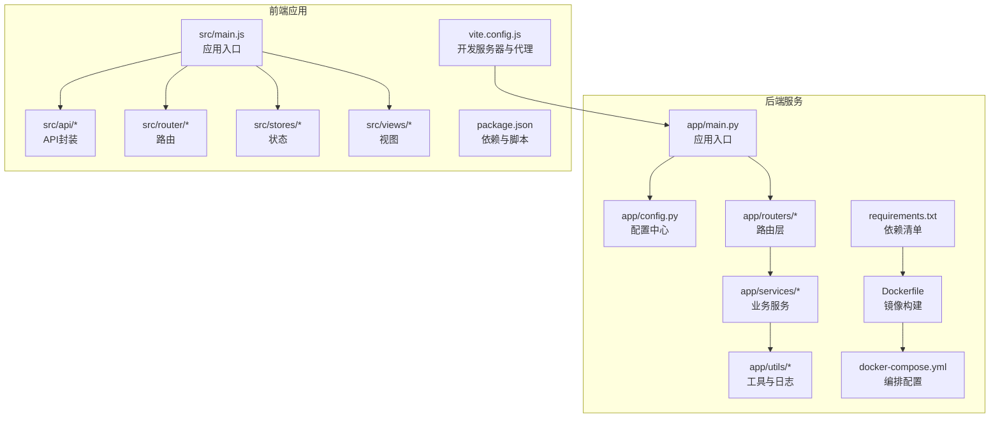
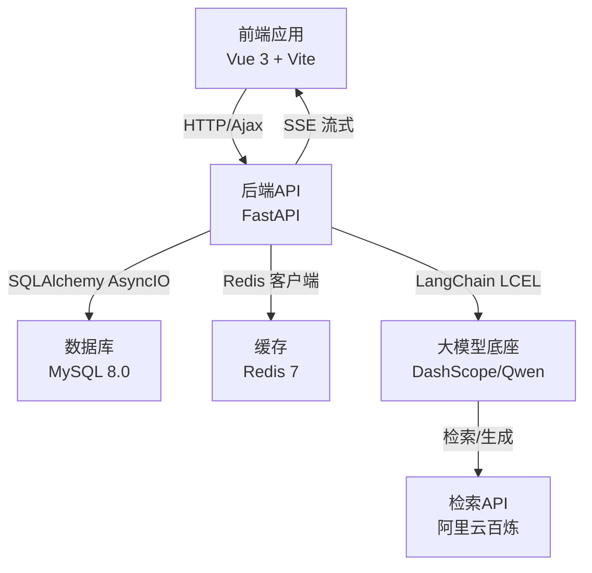
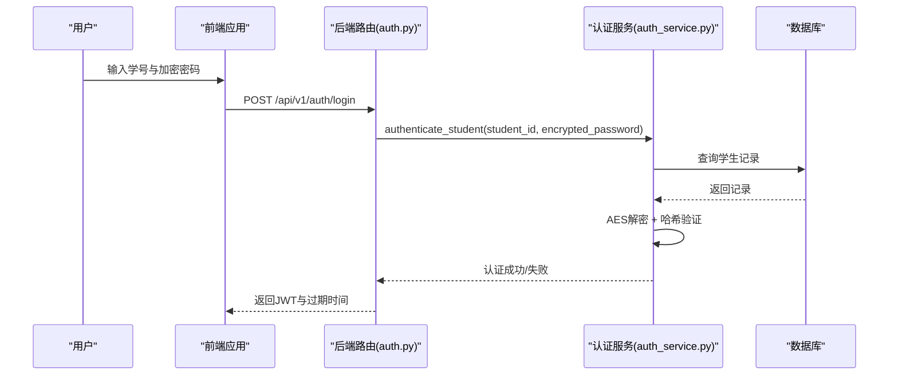
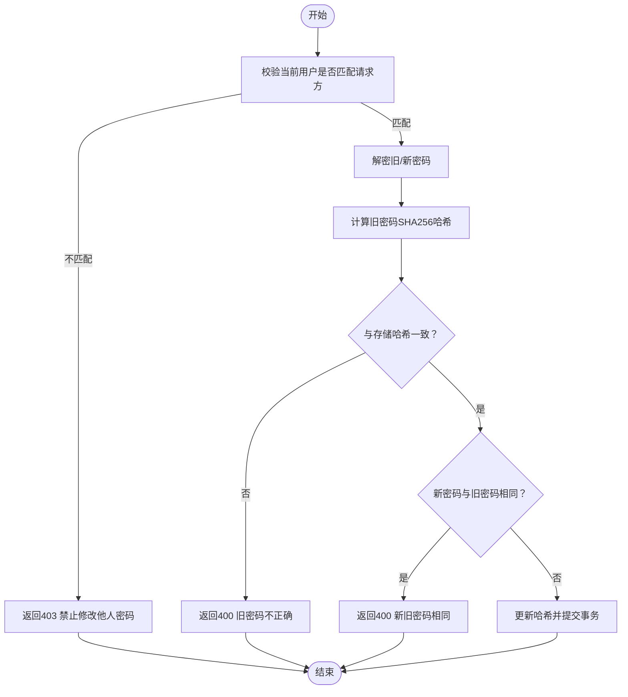
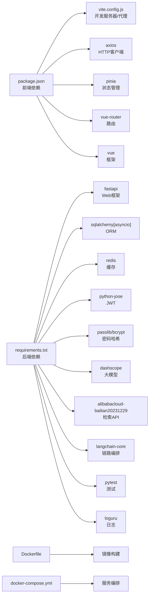

# 开发指南

<cite>
**本文引用的文件**
- [README.md](file://README.md)
- [requirements.txt](file://service/ai_assistant/requirements.txt)
- [Dockerfile](file://service/ai_assistant/Dockerfile)
- [docker-compose.yml](file://service/ai_assistant/docker-compose.yml)
- [package.json](file://frontend/ai_assistant/package.json)
- [vite.config.js](file://frontend/ai_assistant/vite.config.js)
- [main.py](file://service/ai_assistant/app/main.py)
- [config.py](file://service/ai_assistant/app/config.py)
- [auth.py](file://service/ai_assistant/app/routers/auth.py)
- [auth_service.py](file://service/ai_assistant/app/services/auth_service.py)
- [auth.js](file://frontend/ai_assistant/src/api/auth.js)
- [logger.py](file://service/ai_assistant/app/utils/logger.py)
- [main.js](file://frontend/ai_assistant/src/main.js)
</cite>

## 目录
1. [引言](#引言)
2. [项目结构](#项目结构)
3. [核心组件](#核心组件)
4. [架构总览](#架构总览)
5. [详细组件分析](#详细组件分析)
6. [依赖分析](#依赖分析)
7. [性能考虑](#性能考虑)
8. [故障排查指南](#故障排查指南)
9. [结论](#结论)
10. [附录](#附录)

## 引言
本开发指南面向AI校园助手项目的开发者与维护者，目标是帮助团队建立统一的开发规范、测试策略与协作流程，确保前后端一致性、安全性与可维护性。内容涵盖：
- 代码规范与最佳实践（Python、JavaScript）
- 开发流程与工作流管理（分支策略、代码评审、发布流程）
- 调试技巧与工具使用（IDE、调试器、性能分析）
- 测试策略与质量保证
- 新功能开发与扩展指导
- 开发环境配置与优化
- 团队协作与沟通最佳实践
- 新人快速上手指南

## 项目结构
项目采用前后端分离架构，后端基于FastAPI，前端基于Vue 3 + Vite，配合Docker Compose进行容器化部署。核心目录与职责如下：
- service/ai_assistant：后端服务，包含FastAPI应用、路由、服务层、工具与配置
- frontend/ai_assistant：前端应用，包含Vue组件、API封装、状态管理、路由与样式
- docs：项目文档（可扩展）
- .sixth/skills：技能/插件扩展（可选）

**图表来源**
- [main.py:1-86](file://service/ai_assistant/app/main.py#L1-L86)
- [config.py:1-113](file://service/ai_assistant/app/config.py#L1-L113)
- [requirements.txt:1-22](file://service/ai_assistant/requirements.txt#L1-L22)
- [Dockerfile:1-49](file://service/ai_assistant/Dockerfile#L1-L49)
- [docker-compose.yml:1-31](file://service/ai_assistant/docker-compose.yml#L1-L31)
- [main.js:1-10](file://frontend/ai_assistant/src/main.js#L1-L10)
- [auth.js:1-36](file://frontend/ai_assistant/src/api/auth.js#L1-L36)
- [package.json:1-24](file://frontend/ai_assistant/package.json#L1-L24)
- [vite.config.js:1-23](file://frontend/ai_assistant/vite.config.js#L1-L23)

**章节来源**
- [README.md:1-104](file://README.md#L1-L104)
- [main.py:1-86](file://service/ai_assistant/app/main.py#L1-L86)
- [config.py:1-113](file://service/ai_assistant/app/config.py#L1-L113)
- [requirements.txt:1-22](file://service/ai_assistant/requirements.txt#L1-L22)
- [Dockerfile:1-49](file://service/ai_assistant/Dockerfile#L1-L49)
- [docker-compose.yml:1-31](file://service/ai_assistant/docker-compose.yml#L1-L31)
- [main.js:1-10](file://frontend/ai_assistant/src/main.js#L1-L10)
- [auth.js:1-36](file://frontend/ai_assistant/src/api/auth.js#L1-L36)
- [package.json:1-24](file://frontend/ai_assistant/package.json#L1-L24)
- [vite.config.js:1-23](file://frontend/ai_assistant/vite.config.js#L1-L23)

## 核心组件
- 应用入口与生命周期：后端通过FastAPI应用入口注册路由、中间件与生命周期钩子，启动时检查不安全默认配置并初始化日志。
- 配置中心：集中管理数据库、Redis、JWT、AES、阿里云相关、缓存TTL等配置，并提供URL拼装与CORS来源解析。
- 路由与服务：认证路由对接认证服务，实现学生登录、密码修改等功能；服务层负责JWT签发/校验、密码哈希验证、数据库操作等。
- 前端入口与API封装：前端通过Pinia与路由挂载应用，API封装与后端接口一一对应，便于统一管理。
- 日志系统：使用Loguru统一输出到控制台与文件，支持滚动与保留策略。
- 容器化与编排：后端镜像分阶段构建，运行时非root用户；Compose定义Redis服务与健康检查。

**章节来源**
- [main.py:1-86](file://service/ai_assistant/app/main.py#L1-L86)
- [config.py:1-113](file://service/ai_assistant/app/config.py#L1-L113)
- [auth.py:1-102](file://service/ai_assistant/app/routers/auth.py#L1-L102)
- [auth_service.py:1-253](file://service/ai_assistant/app/services/auth_service.py#L1-L253)
- [auth.js:1-36](file://frontend/ai_assistant/src/api/auth.js#L1-L36)
- [logger.py:1-53](file://service/ai_assistant/app/utils/logger.py#L1-L53)
- [Dockerfile:1-49](file://service/ai_assistant/Dockerfile#L1-L49)
- [docker-compose.yml:1-31](file://service/ai_assistant/docker-compose.yml#L1-L31)

## 架构总览
系统采用前后端分离，后端提供REST接口与SSE流式输出，前端通过Axios调用API并渲染界面。认证采用JWT，密码在传输前经AES加密，后端解密后进行哈希比对。整体通过Docker Compose进行编排部署。

**图表来源**
- [README.md:9-46](file://README.md#L9-L46)
- [main.py:1-86](file://service/ai_assistant/app/main.py#L1-L86)
- [config.py:1-113](file://service/ai_assistant/app/config.py#L1-L113)
- [docker-compose.yml:1-31](file://service/ai_assistant/docker-compose.yml#L1-L31)

## 详细组件分析

### 认证流程（登录与改密）
该流程贯穿前端API封装、后端路由与服务层，涉及JWT签发、AES解密与密码哈希验证。

**图表来源**
- [auth.js:1-36](file://frontend/ai_assistant/src/api/auth.js#L1-L36)
- [auth.py:1-102](file://service/ai_assistant/app/routers/auth.py#L1-L102)
- [auth_service.py:125-170](file://service/ai_assistant/app/services/auth_service.py#L125-L170)

**章节来源**
- [auth.js:1-36](file://frontend/ai_assistant/src/api/auth.js#L1-L36)
- [auth.py:1-102](file://service/ai_assistant/app/routers/auth.py#L1-L102)
- [auth_service.py:1-253](file://service/ai_assistant/app/services/auth_service.py#L1-L253)

### 密码修改流程
密码修改要求当前登录用户身份有效，旧密码解密后与存储哈希比对，新密码不可与旧密码相同。

**图表来源**
- [auth.py:55-102](file://service/ai_assistant/app/routers/auth.py#L55-L102)
- [auth_service.py:173-210](file://service/ai_assistant/app/services/auth_service.py#L173-L210)

**章节来源**
- [auth.py:55-102](file://service/ai_assistant/app/routers/auth.py#L55-L102)
- [auth_service.py:173-210](file://service/ai_assistant/app/services/auth_service.py#L173-L210)

### JWT与AES配置要点
- JWT：算法、密钥、过期时间在配置中心集中管理，后端提供签发与解码函数。
- AES：前端使用CryptoJS进行CBC加密，后端解密后再做哈希验证，密钥需与前端一致。

**章节来源**
- [config.py:32-44](file://service/ai_assistant/app/config.py#L32-L44)
- [auth_service.py:45-96](file://service/ai_assistant/app/services/auth_service.py#L45-L96)
- [auth.js:10-19](file://frontend/ai_assistant/src/api/auth.js#L10-L19)

### 日志与运行时
- 日志：统一使用Loguru，控制台INFO级别，文件DEBUG级别，滚动大小与保留天数可配置。
- 运行时：应用启动时检查不安全默认配置并发出告警；生命周期结束时关闭Redis连接池。

**章节来源**
- [logger.py:1-53](file://service/ai_assistant/app/utils/logger.py#L1-L53)
- [main.py:25-49](file://service/ai_assistant/app/main.py#L25-L49)

## 依赖分析
后端依赖通过requirements.txt集中管理，前端依赖通过package.json管理。Dockerfile分阶段构建，加速包安装并使用非root用户运行。

**图表来源**
- [package.json:1-24](file://frontend/ai_assistant/package.json#L1-L24)
- [vite.config.js:1-23](file://frontend/ai_assistant/vite.config.js#L1-L23)
- [requirements.txt:1-22](file://service/ai_assistant/requirements.txt#L1-L22)
- [Dockerfile:1-49](file://service/ai_assistant/Dockerfile#L1-L49)
- [docker-compose.yml:1-31](file://service/ai_assistant/docker-compose.yml#L1-L31)

**章节来源**
- [package.json:1-24](file://frontend/ai_assistant/package.json#L1-L24)
- [vite.config.js:1-23](file://frontend/ai_assistant/vite.config.js#L1-L23)
- [requirements.txt:1-22](file://service/ai_assistant/requirements.txt#L1-L22)
- [Dockerfile:1-49](file://service/ai_assistant/Dockerfile#L1-L49)
- [docker-compose.yml:1-31](file://service/ai_assistant/docker-compose.yml#L1-L31)

## 性能考虑
- SSE流式输出：后端使用StreamingResponse，前端以SSE接收，避免一次性缓冲导致的延迟。
- 缓存策略：Redis用于会话上下文、限流与高频查询缓存，敏感与非敏感数据区分TTL。
- 数据库连接：AsyncIO ORM提升并发读写效率。
- 容器优化：分阶段构建减少镜像体积，非root运行降低安全风险。
- 前端代理：Vite开发服务器代理后端接口，避免跨域问题并提升开发体验。

**章节来源**
- [README.md:43-45](file://README.md#L43-L45)
- [config.py:81-84](file://service/ai_assistant/app/config.py#L81-L84)
- [Dockerfile:1-49](file://service/ai_assistant/Dockerfile#L1-L49)
- [vite.config.js:15-21](file://frontend/ai_assistant/vite.config.js#L15-L21)

## 故障排查指南
- 启动不安全默认配置告警：检查.env中JWT_SECRET_KEY、AES_SECRET_KEY、DID_SALT等是否被覆盖。
- CORS跨域问题：确认配置中心的CORS_ALLOW_ORIGINS是否包含前端开发地址。
- Redis连接异常：检查compose中密码与端口映射，确认健康检查通过。
- JWT解码失败：核对密钥、算法与过期时间，确保前端携带的Bearer Token正确。
- AES解密报错：确认前端加密使用的密钥与IV与后端一致。
- 日志定位：查看logs目录下运行日志，关注INFO/DEBUG级别输出。

**章节来源**
- [main.py:18-34](file://service/ai_assistant/app/main.py#L18-L34)
- [config.py:103-110](file://service/ai_assistant/app/config.py#L103-L110)
- [docker-compose.yml:13-22](file://service/ai_assistant/docker-compose.yml#L13-L22)
- [auth_service.py:78-96](file://service/ai_assistant/app/services/auth_service.py#L78-L96)
- [logger.py:17-46](file://service/ai_assistant/app/utils/logger.py#L17-L46)

## 结论
本指南提供了从架构理解、组件剖析到开发与运维全流程的实践建议。遵循统一的代码规范、测试策略与协作流程，将显著提升AI校园助手项目的稳定性与交付效率。

## 附录

### 代码规范与最佳实践

- Python（后端）
  - 风格：PEP 8，函数/类命名清晰，异常类型语义化（如PasswordChangeError）。
  - 异常处理：在路由层捕获业务异常并映射为HTTP状态码，避免泄露内部细节。
  - 配置管理：通过Pydantic Settings集中管理，提供URL拼装与CORS来源解析。
  - 日志：统一使用Loguru，区分控制台与文件输出，设置合理滚动与保留策略。
  - 安全：JWT密钥与AES密钥必须在部署时替换为强随机值；密码哈希兼容多种格式以兼容迁移。
  - 依赖：集中于requirements.txt，镜像构建使用阿里云pip源加速。

- JavaScript（前端）
  - 风格：ES Module，函数式API封装，参数与返回值明确注释。
  - 状态：Pinia集中管理，避免在组件内直接发起网络请求。
  - 路由：统一在router/index.js中注册，保持路径与后端一致。
  - 样式：全局样式集中管理，组件样式局部作用域化。
  - 代理：开发服务器通过vite.config.js代理后端，避免跨域问题。

- 文档编写
  - README：保持架构、部署与Prompt说明的同步更新。
  - API文档：后端OpenAPI自动生成，前端API封装与后端接口一一对应。

**章节来源**
- [auth_service.py:21-27](file://service/ai_assistant/app/services/auth_service.py#L21-L27)
- [config.py:1-113](file://service/ai_assistant/app/config.py#L1-L113)
- [logger.py:17-46](file://service/ai_assistant/app/utils/logger.py#L17-L46)
- [requirements.txt:1-22](file://service/ai_assistant/requirements.txt#L1-L22)
- [Dockerfile:17-19](file://service/ai_assistant/Dockerfile#L17-L19)
- [auth.js:1-36](file://frontend/ai_assistant/src/api/auth.js#L1-L36)
- [package.json:1-24](file://frontend/ai_assistant/package.json#L1-L24)
- [vite.config.js:15-21](file://frontend/ai_assistant/vite.config.js#L15-L21)
- [README.md:1-104](file://README.md#L1-L104)

### 开发流程与工作流管理

- 分支策略
  - 主分支：稳定版本，仅合并通过CI/CD的PR。
  - 开发分支：feature/* 用于新功能开发，release/* 用于发布准备。
  - 热修复：hotfix/* 用于紧急修复，完成后回并主分支与开发分支。

- 代码评审
  - PR模板：描述变更内容、影响范围、测试用例与部署注意事项。
  - 评审要点：安全性（密钥、加密、鉴权）、性能（缓存、数据库）、可维护性（日志、异常）。

- 版本发布
  - 语义化版本：小版本用于功能迭代，大版本用于破坏性变更。
  - 发布流程：构建Docker镜像，更新Compose配置，执行健康检查，回滚预案。

**章节来源**
- [README.md:47-104](file://README.md#L47-L104)

### 调试技巧与工具使用

- IDE配置
  - VS Code：启用Python虚拟环境，安装ESLint/Volar插件，配置Python解释器指向后端venv。
  - 前端：Vite Dev Server端口6001，代理到后端8000端口。

- 调试器
  - 后端：使用uvicorn调试模式或IDE断点，关注日志输出定位问题。
  - 前端：浏览器开发者工具Network面板观察SSE与API请求，Console查看错误。

- 性能分析
  - 后端：使用cProfile或py-spy分析热点函数，结合Redis与数据库慢查询日志。
  - 前端：Chrome Performance面板录制交互，关注主线程阻塞与重绘。

**章节来源**
- [vite.config.js:12-22](file://frontend/ai_assistant/vite.config.js#L12-L22)
- [logger.py:17-46](file://service/ai_assistant/app/utils/logger.py#L17-L46)

### 测试策略与质量保证

- 单元测试
  - 后端：pytest + pytest-asyncio，覆盖路由、服务与工具函数。
  - 前端：Jest/Vitest（建议引入），覆盖API封装与核心逻辑。

- 集成测试
  - 端到端：使用Playwright/Cypress，模拟登录、查询与SSE流式输出。
  - 接口测试：Postman/Insomnia，验证JWT、SSE与错误场景。

- 质量门禁
  - 代码覆盖率：后端不低于70%，前端不低于80%。
  - 安全扫描：依赖漏洞扫描（pip-audit/npm audit），密钥与敏感信息检查。

**章节来源**
- [requirements.txt:17-20](file://service/ai_assistant/requirements.txt#L17-L20)

### 新功能开发与扩展指导

- 新增路由
  - 在routers目录新增模块，定义路径、请求/响应模型与依赖。
  - 在main.py中注册路由，确保日志与异常处理一致。

- 扩展服务
  - 在services目录新增模块，封装业务逻辑，避免在路由中直接操作数据库。
  - 使用依赖注入获取数据库会话与配置，确保可测试性。

- 前端扩展
  - 在src/api新增API封装，与后端接口保持一致。
  - 在views与stores中新增视图与状态，避免在组件内直接发起网络请求。

**章节来源**
- [auth.py:21-21](file://service/ai_assistant/app/routers/auth.py#L21-L21)
- [main.py:81-85](file://service/ai_assistant/app/main.py#L81-L85)

### 开发环境配置与优化建议

- 后端
  - 创建Python虚拟环境，安装requirements.txt依赖。
  - 准备.env文件，填写数据库、Redis、JWT、AES与阿里云相关密钥。
  - 使用Docker Compose启动Redis，确保健康检查通过。

- 前端
  - 安装依赖，启动Vite开发服务器，配置代理指向后端。
  - 使用浏览器调试SSE与API请求，关注跨域与证书问题。

- 容器化
  - 使用Dockerfile分阶段构建，加速包安装与减小镜像体积。
  - 非root用户运行，暴露8000端口，使用健康检查。

**章节来源**
- [README.md:51-65](file://README.md#L51-L65)
- [docker-compose.yml:1-31](file://service/ai_assistant/docker-compose.yml#L1-L31)
- [Dockerfile:1-49](file://service/ai_assistant/Dockerfile#L1-L49)
- [vite.config.js:12-22](file://frontend/ai_assistant/vite.config.js#L12-L22)

### 团队协作与沟通最佳实践

- 规范
  - 统一代码风格与提交信息格式，使用PR模板与评审清单。
  - 文档与代码同步更新，README与API文档保持一致。

- 沟通
  - 每日站会同步进度与阻塞项，问题及时升级。
  - 使用Issue跟踪需求与缺陷，里程碑规划迭代节奏。

**章节来源**
- [README.md:1-104](file://README.md#L1-L104)

### 新人快速上手指南

- 第一步：克隆仓库，安装依赖（后端Python虚拟环境，前端Node.js）。
- 第二步：准备.env，启动Redis（Docker Compose），启动后端（uvicorn）与前端（Vite）。
- 第三步：访问前端页面，使用学号与加密密码登录，观察SSE流式输出。
- 第四步：阅读README与各模块文档，参与代码评审与测试用例编写。

**章节来源**
- [README.md:51-104](file://README.md#L51-L104)
- [main.js:1-10](file://frontend/ai_assistant/src/main.js#L1-L10)
- [auth.js:1-36](file://frontend/ai_assistant/src/api/auth.js#L1-L36)