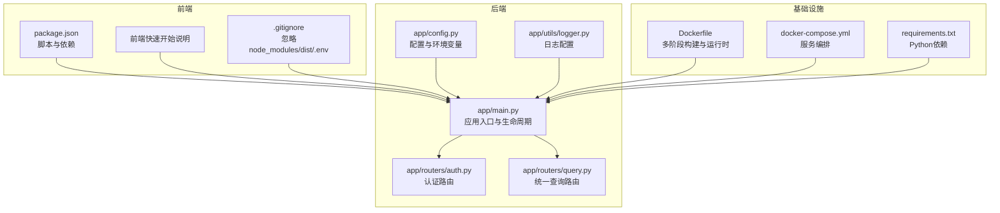
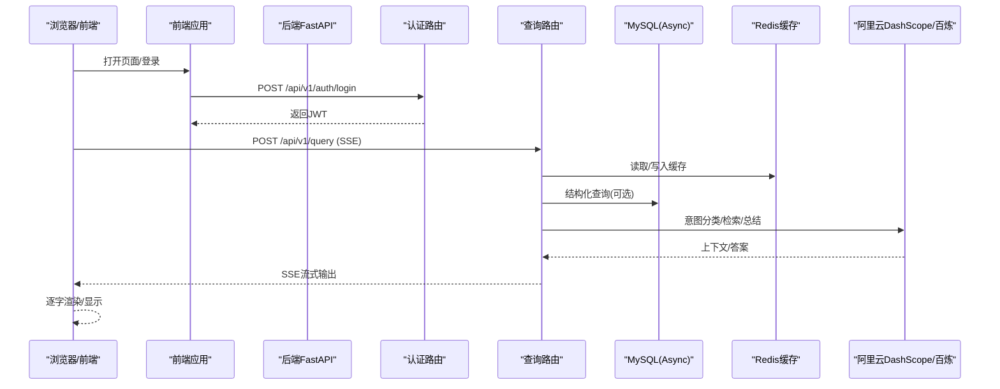
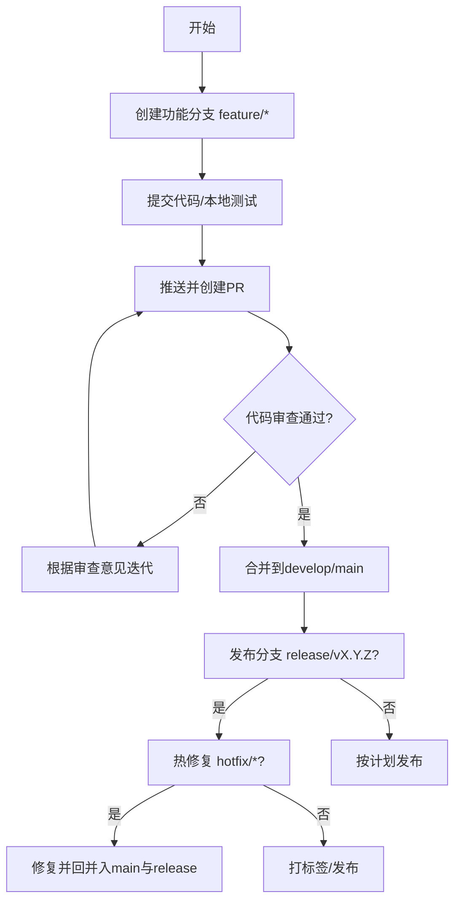
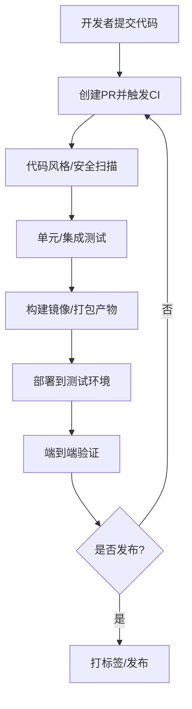
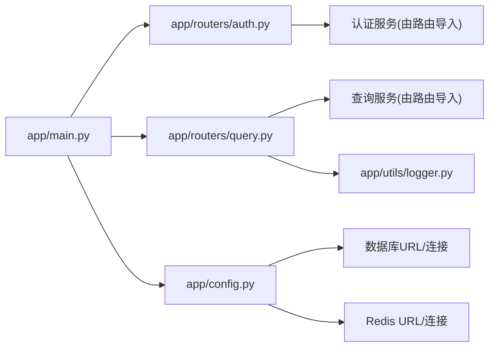

# 开发流程

<cite>
**本文引用的文件**
- [README.md](file://README.md)
- [frontend/ai_assistant/README.md](file://frontend/ai_assistant/README.md)
- [frontend/ai_assistant/package.json](file://frontend/ai_assistant/package.json)
- [frontend/ai_assistant/.gitignore](file://frontend/ai_assistant/.gitignore)
- [service/ai_assistant/Dockerfile](file://service/ai_assistant/Dockerfile)
- [service/ai_assistant/docker-compose.yml](file://service/ai_assistant/docker-compose.yml)
- [service/ai_assistant/requirements.txt](file://service/ai_assistant/requirements.txt)
- [service/ai_assistant/app/main.py](file://service/ai_assistant/app/main.py)
- [service/ai_assistant/app/config.py](file://service/ai_assistant/app/config.py)
- [service/ai_assistant/app/routers/auth.py](file://service/ai_assistant/app/routers/auth.py)
- [service/ai_assistant/app/routers/query.py](file://service/ai_assistant/app/routers/query.py)
- [service/ai_assistant/app/utils/logger.py](file://service/ai_assistant/app/utils/logger.py)
</cite>

## 目录
1. [引言](#引言)
2. [项目结构](#项目结构)
3. [核心组件](#核心组件)
4. [架构总览](#架构总览)
5. [详细组件分析](#详细组件分析)
6. [依赖关系分析](#依赖关系分析)
7. [性能考量](#性能考量)
8. [故障排查指南](#故障排查指南)
9. [结论](#结论)
10. [附录](#附录)

## 引言
本指南面向AI校园助手项目团队，提供一套可落地的开发流程规范，覆盖Git分支管理、代码审查、版本发布、CI/CD与自动化测试、开发环境配置、团队协作与沟通、新成员入职与工具推荐。文档以现有代码库为依据，结合前后端架构与部署实践，形成从需求到上线的全流程闭环。

## 项目结构
项目采用前后端分离架构：
- 前端：Vue 3 + Vite，使用Tailwind CSS进行响应式设计，支持SSE流式输出。
- 后端：FastAPI（Python），异步ORM访问MySQL，Redis缓存，接入阿里云DashScope与百炼检索API。
- 部署：Docker Compose统一编排，包含MySQL、Redis与后端服务，支持HTTPS反向代理。

图表来源
- [frontend/ai_assistant/package.json:1-24](file://frontend/ai_assistant/package.json#L1-L24)
- [frontend/ai_assistant/README.md:1-35](file://frontend/ai_assistant/README.md#L1-L35)
- [frontend/ai_assistant/.gitignore:1-6](file://frontend/ai_assistant/.gitignore#L1-L6)
- [service/ai_assistant/app/main.py:1-86](file://service/ai_assistant/app/main.py#L1-L86)
- [service/ai_assistant/app/config.py:1-113](file://service/ai_assistant/app/config.py#L1-L113)
- [service/ai_assistant/app/routers/auth.py:1-102](file://service/ai_assistant/app/routers/auth.py#L1-L102)
- [service/ai_assistant/app/routers/query.py:1-788](file://service/ai_assistant/app/routers/query.py#L1-L788)
- [service/ai_assistant/app/utils/logger.py:1-53](file://service/ai_assistant/app/utils/logger.py#L1-L53)
- [service/ai_assistant/Dockerfile:1-49](file://service/ai_assistant/Dockerfile#L1-L49)
- [service/ai_assistant/docker-compose.yml:1-31](file://service/ai_assistant/docker-compose.yml#L1-L31)
- [service/ai_assistant/requirements.txt:1-22](file://service/ai_assistant/requirements.txt#L1-L22)

章节来源
- [README.md:1-104](file://README.md#L1-L104)
- [frontend/ai_assistant/README.md:1-35](file://frontend/ai_assistant/README.md#L1-L35)
- [frontend/ai_assistant/package.json:1-24](file://frontend/ai_assistant/package.json#L1-L24)
- [frontend/ai_assistant/.gitignore:1-6](file://frontend/ai_assistant/.gitignore#L1-L6)
- [service/ai_assistant/Dockerfile:1-49](file://service/ai_assistant/Dockerfile#L1-L49)
- [service/ai_assistant/docker-compose.yml:1-31](file://service/ai_assistant/docker-compose.yml#L1-L31)
- [service/ai_assistant/requirements.txt:1-22](file://service/ai_assistant/requirements.txt#L1-L22)

## 核心组件
- 应用入口与生命周期：负责FastAPI实例初始化、CORS配置、路由注册与生命周期钩子（启动/关闭时的安全默认检查与Redis连接池清理）。
- 配置系统：集中管理应用名称、版本、数据库、Redis、JWT、AES、隐私盐、阿里云与百炼配置、缓存TTL等。
- 认证路由：提供登录与修改密码接口，使用JWT与加密密码。
- 统一查询路由：多模态输入（文本/图像/音频）统一处理，安全检查、意图分类、查询执行、流式SSE输出、缓存与日志记录。
- 日志系统：Loguru统一输出到控制台与文件，支持滚动与保留策略。

章节来源
- [service/ai_assistant/app/main.py:1-86](file://service/ai_assistant/app/main.py#L1-L86)
- [service/ai_assistant/app/config.py:1-113](file://service/ai_assistant/app/config.py#L1-L113)
- [service/ai_assistant/app/routers/auth.py:1-102](file://service/ai_assistant/app/routers/auth.py#L1-L102)
- [service/ai_assistant/app/routers/query.py:1-788](file://service/ai_assistant/app/routers/query.py#L1-L788)
- [service/ai_assistant/app/utils/logger.py:1-53](file://service/ai_assistant/app/utils/logger.py#L1-L53)

## 架构总览
下图展示了从浏览器到后端服务、数据库与外部大模型服务的典型调用路径，以及SSE流式输出的关键环节。

图表来源
- [service/ai_assistant/app/routers/auth.py:1-102](file://service/ai_assistant/app/routers/auth.py#L1-L102)
- [service/ai_assistant/app/routers/query.py:1-788](file://service/ai_assistant/app/routers/query.py#L1-L788)
- [service/ai_assistant/app/config.py:1-113](file://service/ai_assistant/app/config.py#L1-L113)

## 详细组件分析

### Git分支管理策略
- 功能分支（Feature Branch）
  - 命名：feature/模块-任务简述
  - 合并：通过Pull Request（PR）评审后合并，合并前需通过本地与CI测试。
- 发布分支（Release Branch）
  - 命名：release/vX.Y.Z
  - 用途：修复紧急小缺陷、准备发布版本、打标签与发布。
- 热修复分支（Hotfix Branch）
  - 命名：hotfix/修复主题
  - 触发：线上紧急问题，从主分支切出，修复后回并入主分支与发布分支。
- 主分支策略
  - main：仅允许通过PR合并，保持稳定可发布状态。
  - develop：日常开发，定期同步至main。

### 代码审查流程与标准
- Pull Request模板
  - 标题：简明描述变更目的
  - 摘要：变更背景、影响范围、风险评估
  - 测试：本地测试与覆盖情况
  - 依赖：新增/变更的依赖
  - 附件：截图/录屏/测试报告链接
- 审查清单
  - 代码风格与一致性
  - 安全性（密钥、CORS、输入校验）
  - 性能与资源（数据库连接、Redis使用、SSE）
  - 兼容性（跨平台、浏览器、依赖版本）
  - 可观测性（日志、错误处理、指标）
- 合并条件
  - 至少一名审查者批准
  - CI通过
  - 无未解决的审查意见
  - 版本号与变更日志更新（发布分支）

### 版本发布流程
- 语义化版本控制
  - 主版本：破坏性变更
  - 次版本：新增功能且向后兼容
  - 修订版本：修复与向后兼容
- 变更日志维护
  - 采用按版本分节的Markdown文档，记录新增、修复、变更与废弃。
- 发布标签管理
  - 仅在发布分支完成后创建 vX.Y.Z 标签，并同步更新CHANGELOG。

### 持续集成/持续部署（CI/CD）与自动化测试
- 前端
  - 依赖安装、构建与预览脚本在package.json中定义，可作为CI步骤。
- 后端
  - Dockerfile采用多阶段构建，requirements.txt集中管理依赖，便于CI镜像构建。
  - docker-compose.yml定义服务编排，可用于CI环境快速拉起依赖。
- 测试
  - requirements.txt包含pytest系列依赖，可在CI中执行单元/集成测试。
- 部署
  - README提供Docker Compose一键启动与HTTPS反向代理配置，可作为CI/CD流水线的部署步骤。

图表来源
- [frontend/ai_assistant/package.json:1-24](file://frontend/ai_assistant/package.json#L1-L24)
- [service/ai_assistant/Dockerfile:1-49](file://service/ai_assistant/Dockerfile#L1-L49)
- [service/ai_assistant/docker-compose.yml:1-31](file://service/ai_assistant/docker-compose.yml#L1-L31)
- [service/ai_assistant/requirements.txt:1-22](file://service/ai_assistant/requirements.txt#L1-L22)
- [README.md:47-104](file://README.md#L47-L104)

### 开发环境配置指南
- 本地开发设置
  - 前端：安装依赖、复制并配置.env、启动开发服务器。
  - 后端：安装依赖、配置.env、启动数据库与缓存容器、运行后端服务。
- 依赖管理
  - 前端：package.json定义依赖与脚本。
  - 后端：requirements.txt集中管理Python依赖。
- 环境变量配置
  - 应用名称、版本、数据库、Redis、JWT、AES、隐私盐、阿里云与百炼配置、缓存TTL等均通过配置类集中管理。
- Docker与Compose
  - 使用Dockerfile与docker-compose.yml快速搭建一致的开发环境。

章节来源
- [frontend/ai_assistant/README.md:1-35](file://frontend/ai_assistant/README.md#L1-L35)
- [frontend/ai_assistant/package.json:1-24](file://frontend/ai_assistant/package.json#L1-L24)
- [service/ai_assistant/app/config.py:1-113](file://service/ai_assistant/app/config.py#L1-L113)
- [service/ai_assistant/Dockerfile:1-49](file://service/ai_assistant/Dockerfile#L1-L49)
- [service/ai_assistant/docker-compose.yml:1-31](file://service/ai_assistant/docker-compose.yml#L1-L31)
- [README.md:47-104](file://README.md#L47-L104)

### 团队协作规范与沟通流程
- 角色与职责
  - 项目经理：需求与进度管理
  - 后端工程师：API设计、数据库与缓存、安全与合规
  - 前端工程师：UI/UX、SSE流式交互、跨端兼容
  - 运维工程师：CI/CD、部署与监控
- 沟通渠道
  - 即时沟通：Slack/钉钉群组
  - 讨论与决策：Issue/PR评论
  - 文档与规范：本指南与各模块README
- 会议与回顾
  - 每日站会、迭代计划、评审与回顾

### 新成员入职指南与开发工具推荐
- 入职步骤
  - 环境准备：安装Node.js、Python、Docker、IDE
  - 代码检出与依赖安装：前后端分别安装依赖
  - 配置.env：复制示例并填写必要密钥
  - 启动服务：前端与后端分别启动，验证健康检查
- 推荐工具
  - IDE：VS Code（Vue/Python插件）
  - 浏览器：Chrome（SSE调试）
  - 数据库：Adminer或DBeaver
  - API测试：Postman或Insomnia
  - 日志：终端与日志文件查看

## 依赖关系分析
后端模块间依赖清晰，遵循路由-服务-工具分层：
- 应用入口依赖配置、中间件与路由
- 路由依赖服务层与依赖注入（数据库、Redis）
- 服务层依赖工具（日志、隐私、缓存等）

图表来源
- [service/ai_assistant/app/main.py:1-86](file://service/ai_assistant/app/main.py#L1-L86)
- [service/ai_assistant/app/routers/auth.py:1-102](file://service/ai_assistant/app/routers/auth.py#L1-L102)
- [service/ai_assistant/app/routers/query.py:1-788](file://service/ai_assistant/app/routers/query.py#L1-L788)
- [service/ai_assistant/app/config.py:1-113](file://service/ai_assistant/app/config.py#L1-L113)
- [service/ai_assistant/app/utils/logger.py:1-53](file://service/ai_assistant/app/utils/logger.py#L1-L53)

## 性能考量
- SSE流式输出
  - 后端通过StreamingResponse与SSE头部配置，减少反向代理缓冲，提升前端逐字渲染体验。
- 缓存策略
  - Redis缓存敏感与非敏感两类TTL，命中则直接返回，显著降低延迟。
- 并发与资源
  - 异步ORM与异步Redis，避免阻塞；数据库连接在流式阶段及时回滚，释放连接池。
- 日志与可观测性
  - Loguru统一输出，文件滚动与保留策略，便于问题定位。

章节来源
- [service/ai_assistant/app/routers/query.py:115-126](file://service/ai_assistant/app/routers/query.py#L115-L126)
- [service/ai_assistant/app/routers/query.py:280-313](file://service/ai_assistant/app/routers/query.py#L280-L313)
- [service/ai_assistant/app/routers/query.py:652-658](file://service/ai_assistant/app/routers/query.py#L652-L658)
- [service/ai_assistant/app/utils/logger.py:17-46](file://service/ai_assistant/app/utils/logger.py#L17-L46)

## 故障排查指南
- 启动与环境
  - 确认.env配置完整，特别是密钥与数据库/Redis连接。
  - Docker Compose服务健康检查失败时，检查容器日志与端口映射。
- 认证与权限
  - 登录失败通常与加密密码或JWT密钥有关，检查前后端AES密钥一致性。
- 查询与SSE
  - SSE无输出：检查反向代理配置（禁用缓冲、开启分块传输）。
  - 查询超时或报错：检查意图分类与检索服务可用性，查看日志定位。
- 缓存与历史
  - 缓存异常：确认Redis可用性与TTL设置；必要时清理会话缓存。
- 日志
  - 查看后端日志文件，定位异常堆栈与耗时统计。

章节来源
- [service/ai_assistant/app/main.py:25-49](file://service/ai_assistant/app/main.py#L25-L49)
- [service/ai_assistant/app/config.py:85-110](file://service/ai_assistant/app/config.py#L85-L110)
- [service/ai_assistant/app/routers/query.py:748-788](file://service/ai_assistant/app/routers/query.py#L748-L788)
- [README.md:67-104](file://README.md#L67-L104)

## 结论
本指南基于现有代码库与部署实践，建立了从分支管理、代码审查、版本发布到CI/CD与运维的完整流程。建议团队在实践中持续优化审查清单与自动化测试覆盖率，确保交付质量与效率。

## 附录
- 快速对照
  - 前端启动：安装依赖、复制.env、运行开发服务器
  - 后端启动：安装依赖、配置.env、启动数据库与缓存容器、运行后端
  - HTTPS反向代理：禁用缓冲、开启分块传输、配置证书
- 变更日志维护建议
  - 按版本分节记录变更，标注类型（新增/修复/变更/废弃）
  - 与PR与发布标签关联，便于追溯