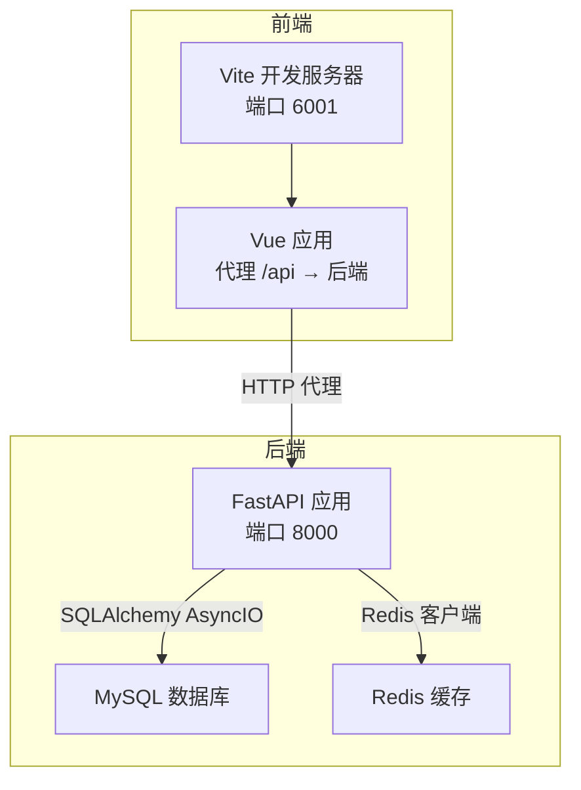
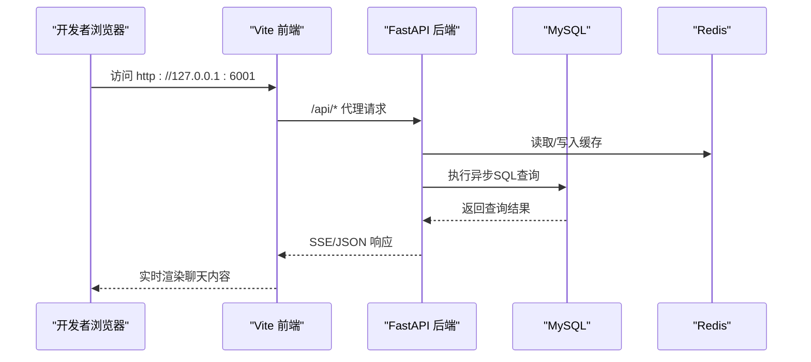
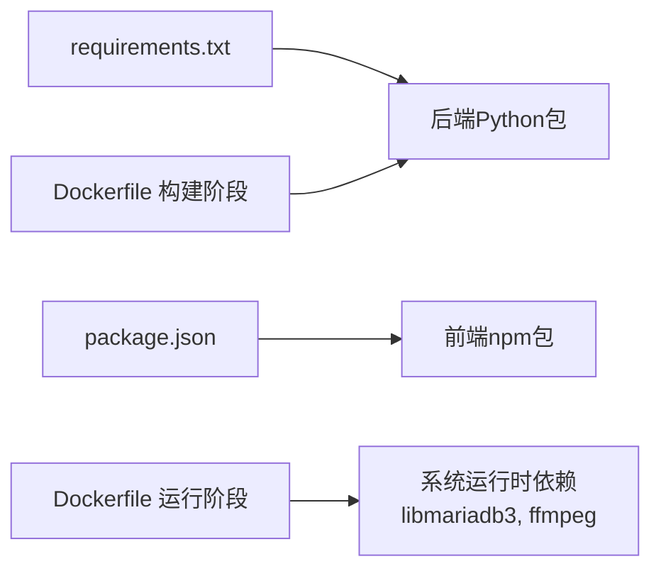

# 开发环境配置

<cite>
**本文引用的文件**
- [service/ai_assistant/Dockerfile](file://service/ai_assistant/Dockerfile)
- [service/ai_assistant/docker-compose.yml](file://service/ai_assistant/docker-compose.yml)
- [service/ai_assistant/requirements.txt](file://service/ai_assistant/requirements.txt)
- [service/ai_assistant/app/config.py](file://service/ai_assistant/app/config.py)
- [service/ai_assistant/app/database.py](file://service/ai_assistant/app/database.py)
- [service/ai_assistant/app/main.py](file://service/ai_assistant/app/main.py)
- [service/ai_assistant/README.md](file://service/ai_assistant/README.md)
- [frontend/ai_assistant/package.json](file://frontend/ai_assistant/package.json)
- [frontend/ai_assistant/vite.config.js](file://frontend/ai_assistant/vite.config.js)
- [frontend/ai_assistant/src/main.js](file://frontend/ai_assistant/src/main.js)
- [README.md](file://README.md)
</cite>

## 目录
1. [简介](#简介)
2. [项目结构](#项目结构)
3. [核心组件](#核心组件)
4. [架构总览](#架构总览)
5. [详细组件分析](#详细组件分析)
6. [依赖关系分析](#依赖关系分析)
7. [性能考虑](#性能考虑)
8. [故障排查指南](#故障排查指南)
9. [结论](#结论)
10. [附录](#附录)

## 简介
本指南面向“AI校园助手”项目的开发者，提供从零开始的完整开发环境搭建流程，涵盖：
- Python虚拟环境创建与依赖安装
- Node.js与前端npm包安装
- Docker与Docker Compose准备（仅Redis）
- 数据库连接配置与本地MySQL使用
- IDE配置建议（VS Code）与调试配置
- 开发服务器启动（前后端分离与热重载）
- 环境变量与配置文件管理
- 常见问题排查与解决方案
- 生产与开发环境差异说明
- 版本兼容性要求

## 项目结构
项目采用前后端分离架构：
- 后端：Python + FastAPI + SQLAlchemy AsyncIO + Redis + MySQL
- 前端：Vue 3 + Vite + Pinia + Axios
- 容器：Docker Compose（当前仅启动Redis，MySQL由本地实例提供）

图表来源
- [frontend/ai_assistant/vite.config.js:12-22](file://frontend/ai_assistant/vite.config.js#L12-L22)
- [service/ai_assistant/app/database.py:7-12](file://service/ai_assistant/app/database.py#L7-L12)
- [service/ai_assistant/app/main.py:70-76](file://service/ai_assistant/app/main.py#L70-L76)

章节来源
- [README.md:1-104](file://README.md#L1-L104)
- [service/ai_assistant/README.md:1-230](file://service/ai_assistant/README.md#L1-L230)

## 核心组件
- 后端框架与运行时：FastAPI + Uvicorn
- 数据库：MySQL（本地实例）+ SQLAlchemy AsyncIO
- 缓存：Redis（Docker Compose 启动）
- 大模型与检索：阿里云 DashScope + 百炼检索 API（LangChain）
- 前端：Vue 3 + Vite + Pinia + Axios

章节来源
- [service/ai_assistant/app/main.py:52-86](file://service/ai_assistant/app/main.py#L52-L86)
- [service/ai_assistant/app/config.py:6-113](file://service/ai_assistant/app/config.py#L6-L113)
- [service/ai_assistant/app/database.py:1-35](file://service/ai_assistant/app/database.py#L1-L35)
- [frontend/ai_assistant/package.json:1-24](file://frontend/ai_assistant/package.json#L1-L24)

## 架构总览
下图展示了开发环境下的典型交互：前端通过Vite代理访问后端FastAPI，后端通过SQLAlchemy连接本地MySQL，通过Redis进行缓存与会话上下文存储。

图表来源
- [frontend/ai_assistant/vite.config.js:15-21](file://frontend/ai_assistant/vite.config.js#L15-L21)
- [service/ai_assistant/app/main.py:70-76](file://service/ai_assistant/app/main.py#L70-L76)
- [service/ai_assistant/app/database.py:27-35](file://service/ai_assistant/app/database.py#L27-L35)

## 详细组件分析

### Python后端环境搭建
- 创建虚拟环境
  - Windows PowerShell/CMD/macOS/Linux均可使用标准venv创建与激活方式
- 安装依赖
  - 使用requirements.txt安装后端所需Python包
- 环境变量
  - 复制示例配置文件并按需填写MySQL、Redis、DashScope、百炼检索等密钥
- 启动后端
  - 使用Uvicorn在0.0.0.0:8000启动，开启热重载便于开发

章节来源
- [service/ai_assistant/README.md:106-204](file://service/ai_assistant/README.md#L106-L204)
- [service/ai_assistant/requirements.txt:1-22](file://service/ai_assistant/requirements.txt#L1-L22)
- [service/ai_assistant/app/config.py:6-113](file://service/ai_assistant/app/config.py#L6-L113)
- [service/ai_assistant/app/main.py:16-49](file://service/ai_assistant/app/main.py#L16-L49)

### Node.js与前端环境搭建
- 安装依赖
  - 使用package.json中的脚本与依赖安装前端包
- 开发服务器
  - Vite默认监听127.0.0.1:6001，配置了对后端的反向代理
- 热重载
  - Vite提供开箱即用的热重载能力

章节来源
- [frontend/ai_assistant/package.json:1-24](file://frontend/ai_assistant/package.json#L1-L24)
- [frontend/ai_assistant/vite.config.js:1-23](file://frontend/ai_assistant/vite.config.js#L1-L23)
- [frontend/ai_assistant/src/main.js:1-10](file://frontend/ai_assistant/src/main.js#L1-L10)

### Docker与Docker Compose准备
- Redis服务
  - 使用docker-compose启动Redis 7容器，默认端口6379，带密码与内存策略配置
- MySQL
  - 当前开发模式使用本地MySQL实例，无需Docker启动
- 容器镜像构建
  - 后端Dockerfile包含构建与运行两个阶段，使用阿里云镜像源加速

章节来源
- [service/ai_assistant/docker-compose.yml:1-31](file://service/ai_assistant/docker-compose.yml#L1-L31)
- [service/ai_assistant/Dockerfile:1-49](file://service/ai_assistant/Dockerfile#L1-L49)

### 数据库连接配置
- 连接字符串
  - 后端通过配置类生成MySQL连接URL，使用aiomysql驱动
- 异步引擎
  - 使用SQLAlchemy AsyncIO创建异步引擎，启用pool_pre_ping与pool_recycle
- 会话管理
  - 提供异步上下文管理器用于获取与释放数据库会话

章节来源
- [service/ai_assistant/app/config.py:85-101](file://service/ai_assistant/app/config.py#L85-L101)
- [service/ai_assistant/app/database.py:1-35](file://service/ai_assistant/app/database.py#L1-L35)

### 环境变量与配置文件管理
- 配置加载
  - 使用Pydantic Settings从.env文件加载配置，支持UTF-8编码与CORS来源列表
- 关键配置项
  - MySQL/Redis连接参数、JWT密钥、AES密钥、DashScope与百炼检索参数、缓存TTL等
- CORS与调试
  - CORS允许来源可通过环境变量配置，DEBUG影响SQL日志输出

章节来源
- [service/ai_assistant/app/config.py:6-113](file://service/ai_assistant/app/config.py#L6-L113)

### 开发服务器启动指南
- 启动顺序
  - 先启动Redis（可选），再启动后端Uvicorn，最后启动前端Vite
- 端口约定
  - 后端：8000；前端：6001；Redis：6379
- 代理配置
  - 前端Vite将/api前缀代理到后端，便于统一接口访问

章节来源
- [service/ai_assistant/README.md:106-204](file://service/ai_assistant/README.md#L106-L204)
- [frontend/ai_assistant/vite.config.js:12-22](file://frontend/ai_assistant/vite.config.js#L12-L22)

### IDE配置建议（VS Code）
- 插件推荐
  - Python（Microsoft）：语法、调试、格式化
  - Pylance：类型检查与智能提示
  - Vue Language Features (Volar)：Vue 3支持
  - ESLint：JavaScript/Vue代码规范
  - EditorConfig：统一缩进与换行
  - Docker：容器化辅助
- 调试配置
  - Python：配置launch.json，指向后端入口模块
  - Vue：Vite开发服务器作为前端调试目标
- 设置建议
  - Python解释器指向虚拟环境
  - 前端使用127.0.0.1绑定，避免跨域问题

（本节为通用实践建议，不直接分析具体文件，故不附“章节来源”）

## 依赖关系分析
后端依赖通过requirements.txt集中声明，前端依赖通过package.json声明。Dockerfile定义了构建与运行阶段的系统依赖与Python包安装策略。

图表来源
- [service/ai_assistant/requirements.txt:1-22](file://service/ai_assistant/requirements.txt#L1-L22)
- [frontend/ai_assistant/package.json:11-23](file://frontend/ai_assistant/package.json#L11-L23)
- [service/ai_assistant/Dockerfile:10-14](file://service/ai_assistant/Dockerfile#L10-L14)
- [service/ai_assistant/Dockerfile:28-32](file://service/ai_assistant/Dockerfile#L28-L32)

章节来源
- [service/ai_assistant/requirements.txt:1-22](file://service/ai_assistant/requirements.txt#L1-L22)
- [frontend/ai_assistant/package.json:1-24](file://frontend/ai_assistant/package.json#L1-L24)
- [service/ai_assistant/Dockerfile:1-49](file://service/ai_assistant/Dockerfile#L1-L49)

## 性能考虑
- 数据库连接池
  - 启用pool_pre_ping与pool_recycle，减少连接失效带来的异常
- 缓存策略
  - Redis用于会话上下文与高频查询缓存，区分敏感与普通缓存TTL
- SSE流式输出
  - 后端使用StreamingResponse推送事件，前端Vite代理保持低延迟
- 镜像源加速
  - Docker构建阶段使用阿里云镜像源，提升依赖下载速度

章节来源
- [service/ai_assistant/app/database.py:7-20](file://service/ai_assistant/app/database.py#L7-L20)
- [service/ai_assistant/app/config.py:81-84](file://service/ai_assistant/app/config.py#L81-L84)
- [service/ai_assistant/Dockerfile:6-14](file://service/ai_assistant/Dockerfile#L6-L14)
- [service/ai_assistant/Dockerfile:17-19](file://service/ai_assistant/Dockerfile#L17-L19)

## 故障排查指南
- 端口冲突
  - 后端8000、前端6001、Redis6379被占用时，调整对应配置或释放端口
- CORS错误
  - 检查CORS_ALLOW_ORIGINS是否包含前端地址（默认包含127.0.0.1:5173与localhost:5173）
- 数据库连接失败
  - 确认MYSQL_HOST/MYSQL_PORT/MYSQL_USER/MYSQL_PASSWORD正确，且本地MySQL服务可用
- Redis连接失败
  - 确认REDIS_HOST/REDIS_PORT/REDIS_PASSWORD与docker-compose一致
- 环境变量缺失
  - 启动前复制.env.example为.env并补齐密钥与参数
- SSE流式输出异常
  - 若使用Nginx/Caddy反向代理，需禁用缓冲并启用chunked_transfer_encoding

章节来源
- [service/ai_assistant/app/config.py:17-109](file://service/ai_assistant/app/config.py#L17-L109)
- [service/ai_assistant/app/main.py:70-76](file://service/ai_assistant/app/main.py#L70-L76)
- [service/ai_assistant/docker-compose.yml:5-24](file://service/ai_assistant/docker-compose.yml#L5-L24)
- [README.md:67-104](file://README.md#L67-L104)

## 结论
本指南提供了从Python虚拟环境、Node.js与前端、Docker与数据库到IDE配置与开发服务器启动的全流程说明。遵循上述步骤，可在本地快速搭建稳定、可调试的开发环境，并为后续生产部署打下基础。

## 附录

### 开发与生产环境差异
- 数据库
  - 开发：本地MySQL实例
  - 生产：建议使用云数据库或容器化MySQL
- 缓存
  - 开发：Docker Compose启动Redis
  - 生产：可使用云Redis或更高规格部署
- 反向代理
  - 开发：Vite代理到后端
  - 生产：建议Nginx/Caddy，启用HTTPS与SSE缓冲禁用
- 安全
  - 开发：允许默认CORS来源
  - 生产：严格限制CORS来源，启用HTTPS与强密钥

章节来源
- [service/ai_assistant/README.md:47-104](file://service/ai_assistant/README.md#L47-L104)
- [README.md:67-104](file://README.md#L67-L104)

### 版本兼容性要求
- Python
  - Dockerfile使用python:3.11-slim，建议本地也使用Python 3.11.x
- Node.js
  - Vite与Vue生态通常兼容较新的Node LTS版本
- MySQL
  - 项目说明使用MySQL 8.0，建议本地安装相同或兼容版本
- Redis
  - docker-compose使用redis:7-alpine
- 前端依赖
  - Vue 3、Vite、Pinia、Axios版本详见package.json
- 后端依赖
  - FastAPI、SQLAlchemy AsyncIO、Uvicorn、DashScope、LangChain等详见requirements.txt

章节来源
- [service/ai_assistant/Dockerfile:2-2](file://service/ai_assistant/Dockerfile#L2-L2)
- [frontend/ai_assistant/package.json:1-24](file://frontend/ai_assistant/package.json#L1-L24)
- [service/ai_assistant/requirements.txt:1-22](file://service/ai_assistant/requirements.txt#L1-L22)