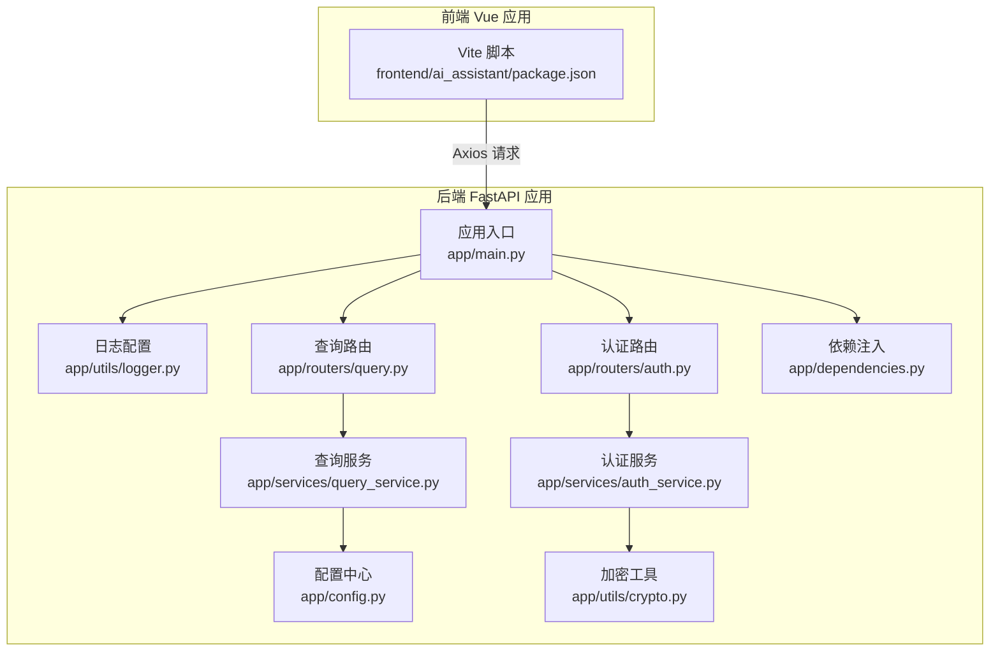
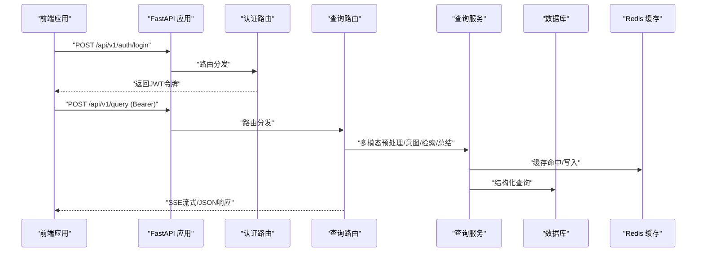
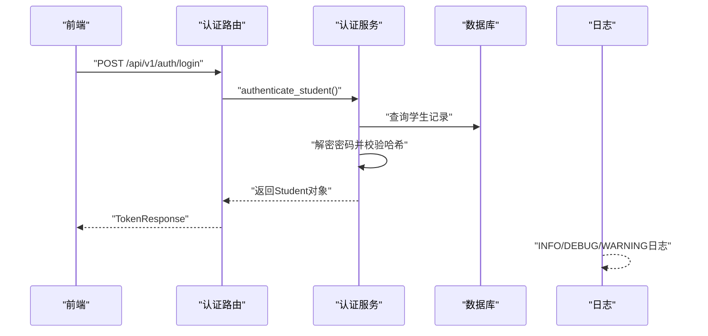
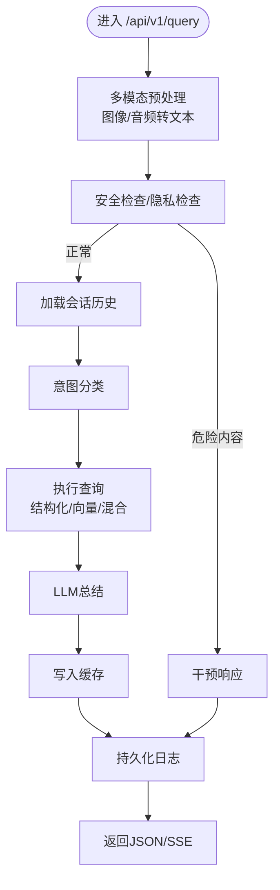
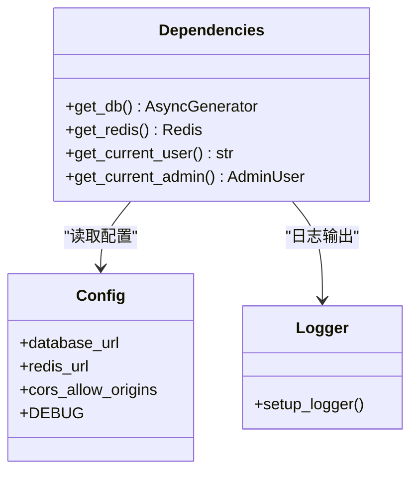

# 调试与测试

<cite>
**本文档引用的文件**
- [service/ai_assistant/app/main.py](file://service/ai_assistant/app/main.py)
- [service/ai_assistant/app/config.py](file://service/ai_assistant/app/config.py)
- [service/ai_assistant/app/utils/logger.py](file://service/ai_assistant/app/utils/logger.py)
- [service/ai_assistant/app/routers/auth.py](file://service/ai_assistant/app/routers/auth.py)
- [service/ai_assistant/app/services/auth_service.py](file://service/ai_assistant/app/services/auth_service.py)
- [service/ai_assistant/app/routers/query.py](file://service/ai_assistant/app/routers/query.py)
- [service/ai_assistant/app/services/query_service.py](file://service/ai_assistant/app/services/query_service.py)
- [service/ai_assistant/app/dependencies.py](file://service/ai_assistant/app/dependencies.py)
- [service/ai_assistant/app/utils/crypto.py](file://service/ai_assistant/app/utils/crypto.py)
- [service/ai_assistant/app/schemas/auth.py](file://service/ai_assistant/app/schemas/auth.py)
- [service/ai_assistant/app/schemas/query.py](file://service/ai_assistant/app/schemas/query.py)
- [service/ai_assistant/requirements.txt](file://service/ai_assistant/requirements.txt)
- [frontend/ai_assistant/package.json](file://frontend/ai_assistant/package.json)
</cite>

## 目录
1. [简介](#简介)
2. [项目结构](#项目结构)
3. [核心组件](#核心组件)
4. [架构总览](#架构总览)
5. [详细组件分析](#详细组件分析)
6. [依赖分析](#依赖分析)
7. [性能考虑](#性能考虑)
8. [故障排查指南](#故障排查指南)
9. [结论](#结论)
10. [附录](#附录)

## 简介
本指南面向AI校园助手项目的开发与运维团队，提供系统化的调试与测试方法，覆盖以下方面：
- 调试技巧与工具：Python调试器（PDB）、FastAPI调试模式、浏览器开发者工具与网络请求调试
- 单元测试：pytest配置、异步测试模式、Mock对象使用
- 集成测试：API测试、端到端测试、性能测试
- 日志系统：日志级别配置、结构化日志记录、错误追踪
- 常见问题诊断与解决方案
- 测试覆盖率与质量门禁标准
- 性能分析与内存泄漏检测

## 项目结构
后端采用FastAPI应用，统一入口负责生命周期管理、CORS中间件与路由注册；前端基于Vue 3 + Vite，使用Axios进行HTTP通信。整体采用异步架构，结合Redis缓存、MySQL数据库与第三方大模型服务。

图表来源
- [service/ai_assistant/app/main.py:52-86](file://service/ai_assistant/app/main.py#L52-L86)
- [service/ai_assistant/app/config.py:6-113](file://service/ai_assistant/app/config.py#L6-L113)
- [service/ai_assistant/app/utils/logger.py:17-53](file://service/ai_assistant/app/utils/logger.py#L17-L53)
- [service/ai_assistant/app/routers/auth.py:21-102](file://service/ai_assistant/app/routers/auth.py#L21-L102)
- [service/ai_assistant/app/routers/query.py:46-788](file://service/ai_assistant/app/routers/query.py#L46-L788)
- [service/ai_assistant/app/services/auth_service.py:125-253](file://service/ai_assistant/app/services/auth_service.py#L125-L253)
- [service/ai_assistant/app/services/query_service.py:1-800](file://service/ai_assistant/app/services/query_service.py#L1-L800)
- [service/ai_assistant/app/dependencies.py:27-109](file://service/ai_assistant/app/dependencies.py#L27-L109)
- [service/ai_assistant/app/utils/crypto.py:39-73](file://service/ai_assistant/app/utils/crypto.py#L39-L73)
- [frontend/ai_assistant/package.json:6-10](file://frontend/ai_assistant/package.json#L6-L10)

章节来源
- [service/ai_assistant/app/main.py:52-86](file://service/ai_assistant/app/main.py#L52-L86)
- [service/ai_assistant/app/config.py:6-113](file://service/ai_assistant/app/config.py#L6-L113)
- [frontend/ai_assistant/package.json:6-10](file://frontend/ai_assistant/package.json#L6-L10)

## 核心组件
- 应用入口与生命周期：负责应用初始化、CORS配置、路由注册与Redis连接池关闭
- 配置中心：集中管理数据库、Redis、JWT、LLM模型、缓存TTL等配置
- 日志系统：统一控制台与文件输出，支持INFO/DEBUG级别与结构化格式
- 认证与授权：JWT签发/校验、管理员与学生双角色、密码变更与校验
- 查询与意图：多模态输入预处理、安全检查、意图分类、结构化/向量/混合检索、流式SSE响应
- 依赖注入：数据库会话、Redis客户端、当前用户/管理员解析
- 加密工具：AES-CBC解密，兼容URL安全编码

章节来源
- [service/ai_assistant/app/main.py:36-86](file://service/ai_assistant/app/main.py#L36-L86)
- [service/ai_assistant/app/config.py:6-113](file://service/ai_assistant/app/config.py#L6-L113)
- [service/ai_assistant/app/utils/logger.py:17-53](file://service/ai_assistant/app/utils/logger.py#L17-L53)
- [service/ai_assistant/app/routers/auth.py:21-102](file://service/ai_assistant/app/routers/auth.py#L21-L102)
- [service/ai_assistant/app/routers/query.py:198-745](file://service/ai_assistant/app/routers/query.py#L198-L745)
- [service/ai_assistant/app/dependencies.py:27-109](file://service/ai_assistant/app/dependencies.py#L27-L109)
- [service/ai_assistant/app/utils/crypto.py:39-73](file://service/ai_assistant/app/utils/crypto.py#L39-L73)

## 架构总览
后端采用模块化路由与服务层分离，查询主流程包含多模态输入处理、安全与隐私检查、意图分类、检索执行、LLM总结、缓存与日志持久化。前端通过Axios调用后端API，支持SSE流式响应与JSON响应两种输出方式。

图表来源
- [service/ai_assistant/app/routers/auth.py:24-52](file://service/ai_assistant/app/routers/auth.py#L24-L52)
- [service/ai_assistant/app/routers/query.py:198-745](file://service/ai_assistant/app/routers/query.py#L198-L745)
- [service/ai_assistant/app/services/query_service.py:575-706](file://service/ai_assistant/app/services/query_service.py#L575-L706)

## 详细组件分析

### 认证与授权组件
- 登录流程：接收加密密码，解密后与数据库存储的哈希比对，签发JWT
- 密码变更：校验旧密码哈希，拒绝与旧密码相同的重复变更
- 管理员鉴权：区分学生与管理员角色，校验账户状态

图表来源
- [service/ai_assistant/app/routers/auth.py:24-52](file://service/ai_assistant/app/routers/auth.py#L24-L52)
- [service/ai_assistant/app/services/auth_service.py:125-169](file://service/ai_assistant/app/services/auth_service.py#L125-L169)
- [service/ai_assistant/app/utils/logger.py:17-53](file://service/ai_assistant/app/utils/logger.py#L17-L53)

章节来源
- [service/ai_assistant/app/routers/auth.py:21-102](file://service/ai_assistant/app/routers/auth.py#L21-L102)
- [service/ai_assistant/app/services/auth_service.py:125-253](file://service/ai_assistant/app/services/auth_service.py#L125-L253)
- [service/ai_assistant/app/schemas/auth.py:4-56](file://service/ai_assistant/app/schemas/auth.py#L4-L56)

### 查询与意图组件
- 输入预处理：图像转文本、音频转文本、组合统一查询
- 安全与隐私：危险内容拦截、隐私违规（查询他人学号）阻断
- 意图分类与执行：结构化/向量/混合检索，必要时回退
- 流式输出：SSE分块推送，最终汇总并持久化日志
- 缓存：基于DID与查询哈希的Redis缓存

图表来源
- [service/ai_assistant/app/routers/query.py:198-745](file://service/ai_assistant/app/routers/query.py#L198-L745)
- [service/ai_assistant/app/services/query_service.py:575-706](file://service/ai_assistant/app/services/query_service.py#L575-L706)

章节来源
- [service/ai_assistant/app/routers/query.py:198-745](file://service/ai_assistant/app/routers/query.py#L198-L745)
- [service/ai_assistant/app/schemas/query.py:8-33](file://service/ai_assistant/app/schemas/query.py#L8-L33)

### 依赖注入与中间件
- 数据库会话：异步上下文管理，确保连接正确释放
- Redis客户端：单例懒加载，避免重复连接
- 当前用户/管理员解析：Bearer Token校验，角色与状态检查

图表来源
- [service/ai_assistant/app/dependencies.py:27-109](file://service/ai_assistant/app/dependencies.py#L27-L109)
- [service/ai_assistant/app/config.py:85-110](file://service/ai_assistant/app/config.py#L85-L110)
- [service/ai_assistant/app/utils/logger.py:17-53](file://service/ai_assistant/app/utils/logger.py#L17-L53)

章节来源
- [service/ai_assistant/app/dependencies.py:27-109](file://service/ai_assistant/app/dependencies.py#L27-L109)
- [service/ai_assistant/app/config.py:85-110](file://service/ai_assistant/app/config.py#L85-L110)

## 依赖分析
- 后端运行时依赖：FastAPI、Uvicorn、SQLAlchemy异步、aiomysql、Redis、JWT、加密库、Pydantic Settings、LangChain、DashScope、Alibaba Bailian
- 测试依赖：pytest、pytest-asyncio、pytest-mock
- 前端依赖：Vue 3、Vue Router、Pinia、Axios、CryptoJS、UUID、Marked

章节来源
- [service/ai_assistant/requirements.txt:1-22](file://service/ai_assistant/requirements.txt#L1-L22)
- [frontend/ai_assistant/package.json:11-22](file://frontend/ai_assistant/package.json#L11-L22)

## 性能考虑
- 异步并发：查询主流程中对安全检查与意图重写采用并发任务，减少端到端延迟
- 连接池与会话：数据库与Redis连接池复用，请求结束后及时归还
- 缓存策略：敏感与普通缓存TTL区分，避免泄露与性能瓶颈
- SSE流式：分块输出，降低首字节延迟与代理缓冲影响
- 日志级别：生产默认INFO，调试可临时提升至DEBUG定位问题

章节来源
- [service/ai_assistant/app/routers/query.py:347-352](file://service/ai_assistant/app/routers/query.py#L347-L352)
- [service/ai_assistant/app/config.py:81-84](file://service/ai_assistant/app/config.py#L81-L84)
- [service/ai_assistant/app/utils/logger.py:28-46](file://service/ai_assistant/app/utils/logger.py#L28-L46)

## 故障排查指南

### 调试技巧与工具
- Python调试器（PDB）
  - 在关键服务方法中设置断点，逐步检查参数与中间结果
  - 示例路径：[service/ai_assistant/app/services/auth_service.py:125-169](file://service/ai_assistant/app/services/auth_service.py#L125-L169)
- FastAPI调试模式
  - 通过配置中心开启DEBUG模式，启用自动重载与更详细的错误栈
  - 示例路径：[service/ai_assistant/app/config.py:16](file://service/ai_assistant/app/config.py#L16)
- 浏览器开发者工具与网络请求调试
  - 打开Network面板，观察请求头（Authorization: Bearer）、SSE事件流、响应体与状态码
  - 示例路径：[frontend/ai_assistant/package.json:6-10](file://frontend/ai_assistant/package.json#L6-L10)

### 日志系统与错误追踪
- 日志配置
  - 控制台输出级别INFO，文件输出DEBUG，滚动大小10MB，保留14天
  - 示例路径：[service/ai_assistant/app/utils/logger.py:28-46](file://service/ai_assistant/app/utils/logger.py#L28-L46)
- 错误追踪
  - 使用logger.exception捕获异常堆栈，结合日志文件定位问题
  - 示例路径：[service/ai_assistant/app/routers/query.py:237-260](file://service/ai_assistant/app/routers/query.py#L237-L260)

### 常见问题与解决方案
- 登录失败
  - 检查加密密码格式与AES密钥长度，确认前端加密与后端解密一致
  - 示例路径：[service/ai_assistant/app/utils/crypto.py:39-73](file://service/ai_assistant/app/utils/crypto.py#L39-L73)
- JWT校验失败
  - 确认JWT_SECRET_KEY与前端生成一致，检查角色与过期时间
  - 示例路径：[service/ai_assistant/app/services/auth_service.py:78-95](file://service/ai_assistant/app/services/auth_service.py#L78-L95)
- 查询无响应或超时
  - 检查Redis连通性与缓存键空间，查看SSE流是否中断
  - 示例路径：[service/ai_assistant/app/routers/query.py:282-312](file://service/ai_assistant/app/routers/query.py#L282-L312)
- 安全拦截
  - 危险内容触发干预响应，检查输入文本与安全策略
  - 示例路径：[service/ai_assistant/app/routers/query.py:415-470](file://service/ai_assistant/app/routers/query.py#L415-L470)

章节来源
- [service/ai_assistant/app/utils/crypto.py:39-73](file://service/ai_assistant/app/utils/crypto.py#L39-L73)
- [service/ai_assistant/app/services/auth_service.py:78-95](file://service/ai_assistant/app/services/auth_service.py#L78-L95)
- [service/ai_assistant/app/routers/query.py:282-312](file://service/ai_assistant/app/routers/query.py#L282-L312)
- [service/ai_assistant/app/routers/query.py:415-470](file://service/ai_assistant/app/routers/query.py#L415-L470)

## 结论
本指南提供了从调试工具、日志配置到单元/集成测试与性能优化的完整实践路径。建议在开发与测试阶段充分利用异步并发与缓存机制，在生产环境保持严格的日志级别与安全策略，并建立持续集成的质量门禁。

## 附录

### 单元测试编写指南
- pytest配置
  - 使用pytest、pytest-asyncio、pytest-mock，支持异步测试与Mock
  - 示例路径：[service/ai_assistant/requirements.txt:17-19](file://service/ai_assistant/requirements.txt#L17-L19)
- 异步测试模式
  - 在测试文件中使用标记与事件循环，确保异步服务可被调用
  - 示例路径：[service/ai_assistant/app/services/auth_service.py:125-169](file://service/ai_assistant/app/services/auth_service.py#L125-L169)
- Mock对象使用
  - Mock数据库会话与外部服务（如DashScope、Redis），隔离测试边界
  - 示例路径：[service/ai_assistant/app/dependencies.py:27-50](file://service/ai_assistant/app/dependencies.py#L27-L50)

### 集成测试策略
- API测试
  - 使用HTTP客户端模拟登录与查询，断言响应结构与状态码
  - 示例路径：[service/ai_assistant/app/routers/auth.py:24-52](file://service/ai_assistant/app/routers/auth.py#L24-L52)
- 端到端测试
  - 前后端联调，覆盖SSE流式与JSON两种输出
  - 示例路径：[service/ai_assistant/app/routers/query.py:659-745](file://service/ai_assistant/app/routers/query.py#L659-L745)
- 性能测试
  - 使用压力测试工具模拟并发请求，监控Redis与数据库负载
  - 示例路径：[service/ai_assistant/app/routers/query.py:347-352](file://service/ai_assistant/app/routers/query.py#L347-L352)

### 测试覆盖率与质量门禁
- 覆盖率要求
  - 建议核心服务（认证、查询）行覆盖率≥80%，分支覆盖率≥60%
- 质量门禁
  - CI中强制执行pytest与覆盖率检查，失败则阻止合并

### 性能分析与内存泄漏检测
- 性能分析
  - 使用异步上下文与计时器测量关键路径耗时（如查询执行、LLM总结）
  - 示例路径：[service/ai_assistant/app/routers/query.py:213-225](file://service/ai_assistant/app/routers/query.py#L213-L225)
- 内存泄漏检测
  - 使用内存分析工具监控长生命周期对象，确保SSE生成器与数据库会话及时释放
  - 示例路径：[service/ai_assistant/app/routers/query.py:654-658](file://service/ai_assistant/app/routers/query.py#L654-L658)