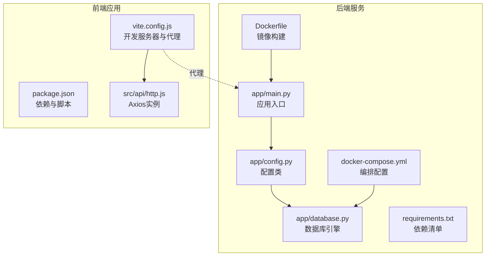
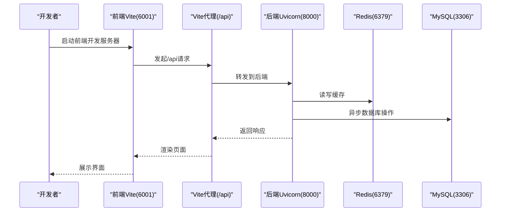

# 快速开始

<cite>
**本文引用的文件**
- [根目录说明](file://README.md)
- [后端需求清单](file://service/ai_assistant/requirements.txt)
- [后端配置类](file://service/ai_assistant/app/config.py)
- [后端应用入口](file://service/ai_assistant/app/main.py)
- [后端数据库引擎](file://service/ai_assistant/app/database.py)
- [后端启动说明](file://service/ai_assistant/README.md)
- [后端Dockerfile](file://service/ai_assistant/Dockerfile)
- [后端Compose编排](file://service/ai_assistant/docker-compose.yml)
- [前端包管理配置](file://frontend/ai_assistant/package.json)
- [前端Vite代理配置](file://frontend/ai_assistant/vite.config.js)
- [前端HTTP客户端](file://frontend/ai_assistant/src/api/http.js)
</cite>

## 目录
1. [简介](#简介)
2. [项目结构](#项目结构)
3. [环境要求](#环境要求)
4. [本地开发环境搭建](#本地开发环境搭建)
5. [配置说明](#配置说明)
6. [一键启动与验证](#一键启动与验证)
7. [操作系统特定步骤](#操作系统特定步骤)
8. [常见问题与故障排除](#常见问题与故障排除)
9. [架构概览](#架构概览)
10. [结论](#结论)

## 简介
本指南面向新手开发者，帮助你在30分钟内完成AI校园助手项目的本地运行。项目采用前后端分离架构：前端基于Vue 3 + Vite，后端基于FastAPI + SQLAlchemy AsyncIO + Redis + MySQL，通过Docker Compose统一编排。你将学会环境准备、依赖安装、数据库与缓存配置、服务启动与验证等关键步骤。

## 项目结构
项目分为两大部分：
- 后端服务：位于 service/ai_assistant，包含Python后端、Dockerfile与docker-compose.yml
- 前端应用：位于 frontend/ai_assistant，包含Vue 3 + Vite前端工程

**图表来源**
- [后端应用入口:1-86](file://service/ai_assistant/app/main.py#L1-L86)
- [后端配置类:1-113](file://service/ai_assistant/app/config.py#L1-L113)
- [后端数据库引擎:1-35](file://service/ai_assistant/app/database.py#L1-L35)
- [后端需求清单:1-22](file://service/ai_assistant/requirements.txt#L1-L22)
- [后端Dockerfile:1-49](file://service/ai_assistant/Dockerfile#L1-L49)
- [后端Compose编排:1-31](file://service/ai_assistant/docker-compose.yml#L1-L31)
- [前端包管理配置:1-24](file://frontend/ai_assistant/package.json#L1-L24)
- [前端Vite代理配置:1-23](file://frontend/ai_assistant/vite.config.js#L1-L23)
- [前端HTTP客户端:1-49](file://frontend/ai_assistant/src/api/http.js#L1-L49)

**章节来源**
- [根目录说明:1-104](file://README.md#L1-L104)
- [后端启动说明:1-230](file://service/ai_assistant/README.md#L1-L230)

## 环境要求
为确保顺利运行，请准备以下组件并满足版本要求：

- Python 3.8及以上
  - 后端使用Python 3.11作为Docker基础镜像，建议本地也使用Python 3.8+以保证兼容性
  - 参考：[后端Dockerfile:2-2](file://service/ai_assistant/Dockerfile#L2-L2)

- Node.js 16+（推荐18+）
  - 前端使用Vite 5.x，需要较新的Node版本
  - 参考：[前端包管理配置:1-24](file://frontend/ai_assistant/package.json#L1-L24)

- Docker 与 Docker Compose
  - 用于启动Redis缓存容器
  - 参考：[后端Compose编排:1-31](file://service/ai_assistant/docker-compose.yml#L1-L31)

- MySQL 8.0
  - 后端通过SQLAlchemy AsyncIO连接MySQL 8.0
  - 参考：[后端数据库引擎:1-35](file://service/ai_assistant/app/database.py#L1-L35)

- Redis 7
  - 用于会话上下文、限流与缓存
  - 参考：[后端Compose编排:5-24](file://service/ai_assistant/docker-compose.yml#L5-L24)

- Git（可选）
  - 用于克隆仓库
  - 参考：[后端启动说明:54-57](file://service/ai_assistant/README.md#L54-L57)

**章节来源**
- [后端Dockerfile:1-49](file://service/ai_assistant/Dockerfile#L1-L49)
- [后端Compose编排:1-31](file://service/ai_assistant/docker-compose.yml#L1-L31)
- [后端数据库引擎:1-35](file://service/ai_assistant/app/database.py#L1-L35)
- [前端包管理配置:1-24](file://frontend/ai_assistant/package.json#L1-L24)
- [后端启动说明:51-65](file://service/ai_assistant/README.md#L51-L65)

## 本地开发环境搭建
以下步骤适用于本地开发场景（推荐）。你也可以选择Docker方式仅启动Redis。

### 步骤1：克隆代码
- 使用Git克隆仓库到本地
- 进入后端目录
- 参考：[后端启动说明:54-57](file://service/ai_assistant/README.md#L54-L57)

### 步骤2：创建并激活Python虚拟环境
- Windows（PowerShell/CMD）与macOS/Linux（bash/zsh）均支持
- 参考：[后端启动说明:118-144](file://service/ai_assistant/README.md#L118-L144)

### 步骤3：安装后端依赖
- 在后端目录执行依赖安装
- 参考：[后端需求清单:1-22](file://service/ai_assistant/requirements.txt#L1-L22)
- 参考：[后端启动说明:148-150](file://service/ai_assistant/README.md#L148-L150)

### 步骤4：启动Redis缓存容器
- 使用Docker Compose启动Redis
- 参考：[后端Compose编排:63-65](file://service/ai_assistant/docker-compose.yml#L63-L65)
- 参考：[后端启动说明:189-193](file://service/ai_assistant/README.md#L189-L193)

### 步骤5：安装前端依赖
- 在前端目录执行依赖安装
- 参考：[前端包管理配置:1-24](file://frontend/ai_assistant/package.json#L1-L24)

### 步骤6：启动后端服务
- 在后端目录启动Uvicorn服务
- 参考：[后端启动说明:169-171](file://service/ai_assistant/README.md#L169-L171)

### 步骤7：启动前端开发服务器
- 在前端目录启动Vite开发服务器
- 参考：[前端包管理配置:6-10](file://frontend/ai_assistant/package.json#L6-L10)
- 参考：[前端Vite代理配置:12-22](file://frontend/ai_assistant/vite.config.js#L12-L22)

**章节来源**
- [后端启动说明:106-204](file://service/ai_assistant/README.md#L106-L204)
- [后端Compose编排:63-65](file://service/ai_assistant/docker-compose.yml#L63-L65)
- [前端包管理配置:1-24](file://frontend/ai_assistant/package.json#L1-L24)
- [前端Vite代理配置:1-23](file://frontend/ai_assistant/vite.config.js#L1-L23)

## 配置说明
你需要配置后端的环境变量文件与前端的代理设置。

### 后端环境变量配置
- 复制示例配置文件并编辑
- 参考：[后端启动说明:154-160](file://service/ai_assistant/README.md#L154-L160)
- 关键配置项（来自配置类）：
  - 数据库连接：MYSQL_HOST、MYSQL_PORT、MYSQL_USER、MYSQL_PASSWORD、MYSQL_DATABASE
  - Redis连接：REDIS_HOST、REDIS_PORT、REDIS_PASSWORD、REDIS_DB
  - 安全与认证：JWT_SECRET_KEY、JWT_EXPIRE_MINUTES、AES_SECRET_KEY
  - 隐私与DID：DID_SALT
  - 阿里云DashScope：ALI_API_KEY、DASHSCOPE_TRUST_ENV_PROXY、DASHSCOPE_MAX_INPUT_CHARS
  - 百炼检索：ALIBABA_CLOUD_ACCESS_KEY_ID、ALIBABA_CLOUD_ACCESS_KEY_SECRET、BAILIAN_WORKSPACE_ID、BAILIAN_INDEX_ID、BAILIAN_ENDPOINT
  - 缓存TTL：CACHE_TTL_SENSITIVE、CACHE_TTL_NORMAL
- 参考：[后端配置类:13-110](file://service/ai_assistant/app/config.py#L13-L110)

### 前端代理配置
- 开发环境下，前端通过Vite代理将/api请求转发到后端
- 默认代理目标为http://localhost:8000
- 参考：[前端Vite代理配置:15-21](file://frontend/ai_assistant/vite.config.js#L15-L21)
- 参考：[前端HTTP客户端:10-16](file://frontend/ai_assistant/src/api/http.js#L10-L16)

**章节来源**
- [后端启动说明:152-160](file://service/ai_assistant/README.md#L152-L160)
- [后端配置类:1-113](file://service/ai_assistant/app/config.py#L1-L113)
- [前端Vite代理配置:1-23](file://frontend/ai_assistant/vite.config.js#L1-L23)
- [前端HTTP客户端:1-49](file://frontend/ai_assistant/src/api/http.js#L1-L49)

## 一键启动与验证
以下为一键启动命令与验证步骤，确保前后端协同工作。

### 后端启动
- 启动Redis容器（仅Redis）
  - 参考：[后端Compose编排:63-65](file://service/ai_assistant/docker-compose.yml#L63-L65)
- 启动后端Uvicorn服务
  - 参考：[后端启动说明:169-171](file://service/ai_assistant/README.md#L169-L171)

### 前端启动
- 启动Vite开发服务器
  - 参考：[前端包管理配置:7-9](file://frontend/ai_assistant/package.json#L7-L9)

### 验证步骤
- 访问后端健康检查接口
  - 参考：[后端启动说明:175-176](file://service/ai_assistant/README.md#L175-L176)
- 访问后端API文档
  - 参考：[后端启动说明:174-175](file://service/ai_assistant/README.md#L174-L175)
- 在浏览器打开前端页面（默认端口见前端Vite配置）
  - 参考：[前端Vite代理配置:12-22](file://frontend/ai_assistant/vite.config.js#L12-L22)

**章节来源**
- [后端启动说明:167-176](file://service/ai_assistant/README.md#L167-L176)
- [前端Vite代理配置:1-23](file://frontend/ai_assistant/vite.config.js#L1-L23)

## 操作系统特定步骤
以下为不同操作系统的具体操作要点。

### Windows
- 激活虚拟环境
  - PowerShell：参考：[后端启动说明:126-130](file://service/ai_assistant/README.md#L126-L130)
  - CMD：参考：[后端启动说明:132-136](file://service/ai_assistant/README.md#L132-L136)
- 启动后端服务
  - 参考：[后端启动说明:169-171](file://service/ai_assistant/README.md#L169-L171)

### macOS
- 激活虚拟环境
  - 参考：[后端启动说明:138-142](file://service/ai_assistant/README.md#L138-L142)
- 启动后端服务
  - 参考：[后端启动说明:169-171](file://service/ai_assistant/README.md#L169-L171)

### Linux
- 激活虚拟环境
  - 参考：[后端启动说明:138-142](file://service/ai_assistant/README.md#L138-L142)
- 启动后端服务
  - 参考：[后端启动说明:169-171](file://service/ai_assistant/README.md#L169-L171)

**章节来源**
- [后端启动说明:126-142](file://service/ai_assistant/README.md#L126-L142)
- [后端启动说明:169-171](file://service/ai_assistant/README.md#L169-L171)

## 常见问题与故障排除
以下为常见安装与运行问题的排查建议。

- 后端启动报错（端口占用）
  - 确认端口8000未被占用，或修改后端监听端口
  - 参考：[后端启动说明:169-171](file://service/ai_assistant/README.md#L169-L171)

- 前端无法访问后端接口
  - 检查Vite代理配置是否指向正确的目标地址
  - 参考：[前端Vite代理配置:15-21](file://frontend/ai_assistant/vite.config.js#L15-L21)
  - 确认后端已启动且可访问
  - 参考：[后端启动说明:175-176](file://service/ai_assistant/README.md#L175-L176)

- Redis连接失败
  - 确认Redis容器已启动且密码正确
  - 参考：[后端Compose编排:13-19](file://service/ai_assistant/docker-compose.yml#L13-L19)

- 数据库连接失败
  - 检查MySQL服务状态与账号密码
  - 参考：[后端配置类:19-31](file://service/ai_assistant/app/config.py#L19-L31)
  - 参考：[后端数据库引擎:7-12](file://service/ai_assistant/app/database.py#L7-L12)

- 前端401错误
  - 检查JWT Token是否正确传递
  - 参考：[前端HTTP客户端:20-26](file://frontend/ai_assistant/src/api/http.js#L20-L26)

- Python依赖安装缓慢
  - 使用国内镜像源或离线安装
  - 参考：[后端需求清单:1-22](file://service/ai_assistant/requirements.txt#L1-L22)

**章节来源**
- [前端Vite代理配置:1-23](file://frontend/ai_assistant/vite.config.js#L1-L23)
- [前端HTTP客户端:1-49](file://frontend/ai_assistant/src/api/http.js#L1-L49)
- [后端Compose编排:1-31](file://service/ai_assistant/docker-compose.yml#L1-L31)
- [后端配置类:1-113](file://service/ai_assistant/app/config.py#L1-L113)
- [后端数据库引擎:1-35](file://service/ai_assistant/app/database.py#L1-L35)
- [后端启动说明:169-176](file://service/ai_assistant/README.md#L169-L176)

## 架构概览
下图展示了前后端与中间件的交互关系，以及启动流程的关键节点。

**图表来源**
- [前端Vite代理配置:12-22](file://frontend/ai_assistant/vite.config.js#L12-L22)
- [前端HTTP客户端:10-16](file://frontend/ai_assistant/src/api/http.js#L10-L16)
- [后端应用入口:52-86](file://service/ai_assistant/app/main.py#L52-L86)
- [后端数据库引擎:1-35](file://service/ai_assistant/app/database.py#L1-L35)
- [后端Compose编排:5-24](file://service/ai_assistant/docker-compose.yml#L5-L24)

## 结论
按照本指南，你可以在30分钟内完成AI校园助手的本地运行。建议优先使用Docker启动Redis，再启动后端Uvicorn服务，并在前端Vite中进行开发调试。遇到问题时，优先检查代理配置、端口占用与中间件连接状态。完成后可进一步完善.env配置与生产环境部署。