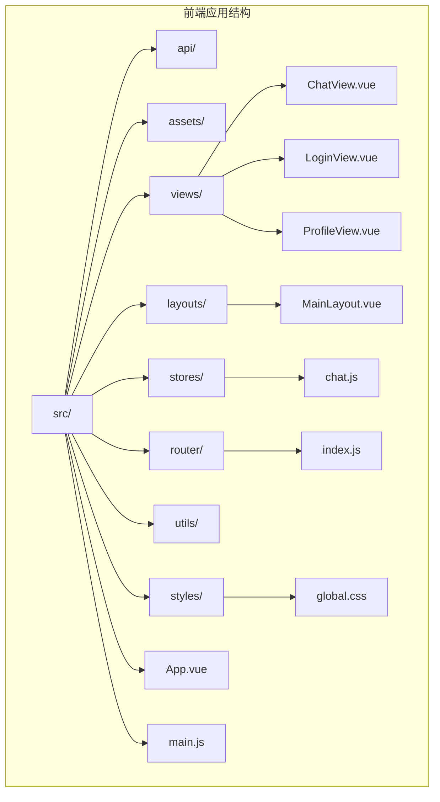
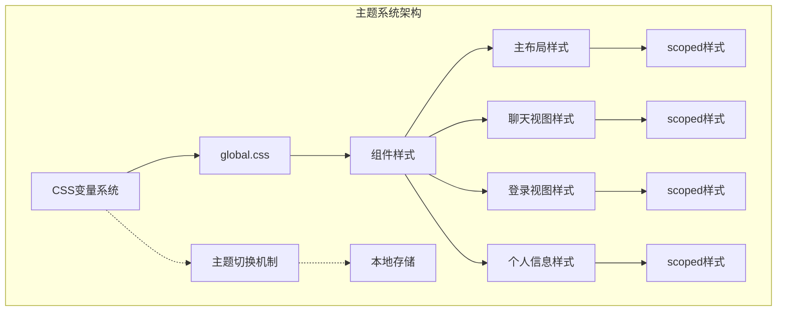
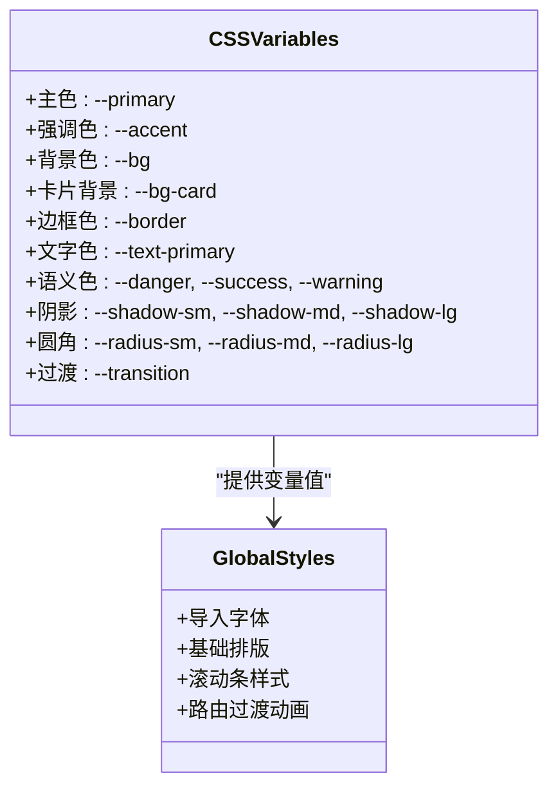
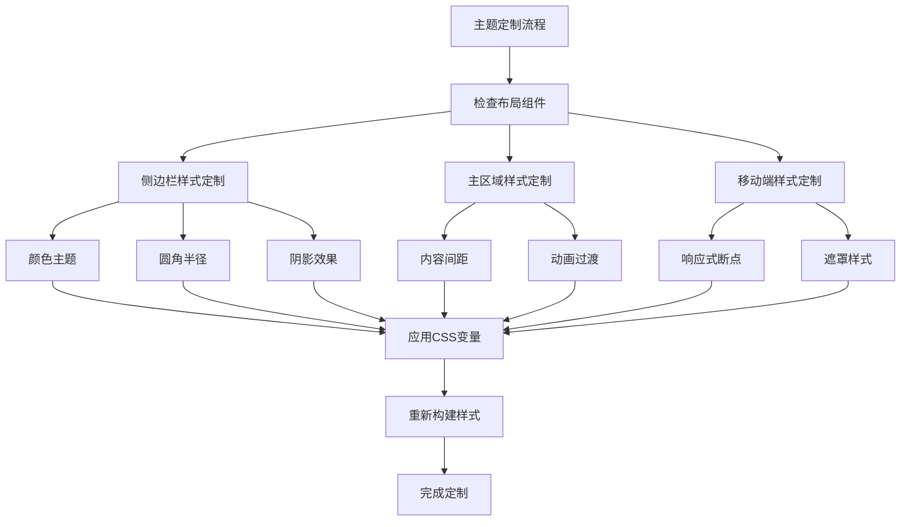
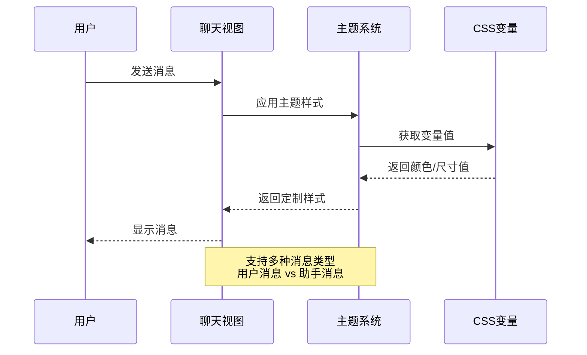
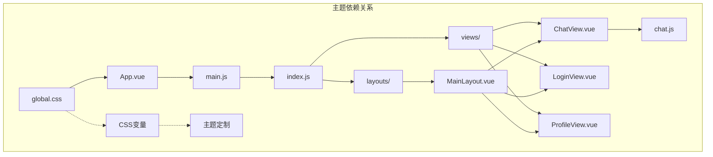

# UI主题定制

<cite>
**本文档引用的文件**
- [global.css](file://frontend/ai_assistant/src/styles/global.css)
- [main.js](file://frontend/ai_assistant/src/main.js)
- [App.vue](file://frontend/ai_assistant/src/App.vue)
- [MainLayout.vue](file://frontend/ai_assistant/src/layouts/MainLayout.vue)
- [ChatView.vue](file://frontend/ai_assistant/src/views/ChatView.vue)
- [LoginView.vue](file://frontend/ai_assistant/src/views/LoginView.vue)
- [ProfileView.vue](file://frontend/ai_assistant/src/views/ProfileView.vue)
- [chat.js](file://frontend/ai_assistant/src/stores/chat.js)
- [index.js](file://frontend/ai_assistant/src/router/index.js)
- [vite.config.js](file://frontend/ai_assistant/vite.config.js)
- [package.json](file://frontend/ai_assistant/package.json)
</cite>

## 目录
1. [简介](#简介)
2. [项目结构](#项目结构)
3. [核心组件](#核心组件)
4. [架构概览](#架构概览)
5. [详细组件分析](#详细组件分析)
6. [依赖关系分析](#依赖关系分析)
7. [性能考虑](#性能考虑)
8. [故障排除指南](#故障排除指南)
9. [结论](#结论)
10. [附录](#附录)

## 简介
本文件为AI校园助手项目的UI主题定制指南，旨在帮助开发者和设计师理解并实现前端界面的主题样式定制。文档涵盖颜色方案、字体设置、布局调整、CSS变量使用与覆盖、主题切换实现、组件样式定制、图标资源、动画效果以及响应式设计和移动端适配策略。同时提供主题打包和发布的最佳实践，确保定制内容的可维护性和一致性。

## 项目结构
前端项目采用Vue 3 + Vite的现代前端架构，主要目录结构如下：
- src：源代码目录
  - api：API接口封装
  - assets：静态资源
  - layouts：布局组件
  - router：路由配置
  - stores：状态管理（Pinia）
  - styles：全局样式和CSS变量
  - utils：工具函数
  - views：页面视图组件
  - App.vue：根组件
  - main.js：应用入口
- dist：构建输出目录
- vite.config.js：Vite构建配置
- package.json：项目依赖和脚本



**图表来源**
- [main.js:1-10](file://frontend/ai_assistant/src/main.js#L1-L10)
- [App.vue:1-7](file://frontend/ai_assistant/src/App.vue#L1-L7)
- [global.css:1-113](file://frontend/ai_assistant/src/styles/global.css#L1-L113)

**章节来源**
- [main.js:1-10](file://frontend/ai_assistant/src/main.js#L1-L10)
- [App.vue:1-7](file://frontend/ai_assistant/src/App.vue#L1-L7)
- [global.css:1-113](file://frontend/ai_assistant/src/styles/global.css#L1-L113)

## 核心组件
本项目的核心UI组件包括：
- 全局样式系统：通过CSS变量实现主题统一管理
- 主布局组件：负责整体页面布局和响应式行为
- 聊天视图：核心交互界面，包含消息展示和输入功能
- 登录视图：用户认证界面
- 个人信息视图：用户资料和系统信息展示

**章节来源**
- [MainLayout.vue:1-487](file://frontend/ai_assistant/src/layouts/MainLayout.vue#L1-L487)
- [ChatView.vue:1-800](file://frontend/ai_assistant/src/views/ChatView.vue#L1-L800)
- [LoginView.vue:1-200](file://frontend/ai_assistant/src/views/LoginView.vue#L1-L200)
- [ProfileView.vue:1-200](file://frontend/ai_assistant/src/views/ProfileView.vue#L1-L200)

## 架构概览
项目采用模块化的前端架构，通过CSS变量实现主题系统的集中管理。应用启动时加载全局样式，各组件通过scoped样式和CSS变量实现主题定制。



**图表来源**
- [global.css:12-48](file://frontend/ai_assistant/src/styles/global.css#L12-L48)
- [MainLayout.vue:177-486](file://frontend/ai_assistant/src/layouts/MainLayout.vue#L177-L486)
- [ChatView.vue:536-800](file://frontend/ai_assistant/src/views/ChatView.vue#L536-L800)

## 详细组件分析

### CSS变量系统
项目通过`:root`选择器定义了完整的CSS变量体系，包括颜色、阴影、圆角、过渡等主题要素。



**图表来源**
- [global.css:12-48](file://frontend/ai_assistant/src/styles/global.css#L12-L48)

**章节来源**
- [global.css:1-113](file://frontend/ai_assistant/src/styles/global.css#L1-L113)

### 主布局主题定制
主布局组件实现了完整的侧边栏和主内容区的样式定制，支持响应式布局和移动端适配。



**图表来源**
- [MainLayout.vue:177-486](file://frontend/ai_assistant/src/layouts/MainLayout.vue#L177-L486)

**章节来源**
- [MainLayout.vue:1-487](file://frontend/ai_assistant/src/layouts/MainLayout.vue#L1-L487)

### 聊天视图主题定制
聊天视图实现了复杂的消息展示和交互功能，包含多种消息类型和状态的样式定制。



**图表来源**
- [ChatView.vue:536-800](file://frontend/ai_assistant/src/views/ChatView.vue#L536-L800)
- [chat.js:133-230](file://frontend/ai_assistant/src/stores/chat.js#L133-L230)

**章节来源**
- [ChatView.vue:1-800](file://frontend/ai_assistant/src/views/ChatView.vue#L1-L800)
- [chat.js:1-278](file://frontend/ai_assistant/src/stores/chat.js#L1-L278)

### 登录视图主题定制
登录视图采用了渐变背景和卡片式设计，通过CSS变量实现统一的主题风格。

**章节来源**
- [LoginView.vue:1-200](file://frontend/ai_assistant/src/views/LoginView.vue#L1-L200)

### 个人信息视图主题定制
个人信息视图展示了用户数据的网格布局，支持状态徽章和系统信息展示。

**章节来源**
- [ProfileView.vue:1-200](file://frontend/ai_assistant/src/views/ProfileView.vue#L1-L200)

## 依赖关系分析



**图表来源**
- [main.js:1-10](file://frontend/ai_assistant/src/main.js#L1-L10)
- [App.vue:1-7](file://frontend/ai_assistant/src/App.vue#L1-L7)
- [index.js:1-75](file://frontend/ai_assistant/src/router/index.js#L1-L75)

**章节来源**
- [main.js:1-10](file://frontend/ai_assistant/src/main.js#L1-L10)
- [App.vue:1-7](file://frontend/ai_assistant/src/App.vue#L1-L7)
- [index.js:1-75](file://frontend/ai_assistant/src/router/index.js#L1-L75)

## 性能考虑
- CSS变量的使用减少了重复样式的定义，提高维护效率
- scoped样式避免样式冲突，但可能影响样式优先级
- 响应式设计通过媒体查询实现，注意性能优化
- 动画效果使用CSS transition和transform，性能较好

## 故障排除指南
- 样式不生效：检查CSS变量是否正确引用
- 响应式问题：确认媒体查询断点设置
- 组件样式冲突：检查scoped样式的作用域
- 主题切换失效：验证本地存储和变量覆盖逻辑

**章节来源**
- [global.css:1-113](file://frontend/ai_assistant/src/styles/global.css#L1-L113)
- [MainLayout.vue:471-486](file://frontend/ai_assistant/src/layouts/MainLayout.vue#L471-L486)

## 结论
AI校园助手项目的主题定制系统基于CSS变量实现了高度可配置的样式管理。通过合理的组件化设计和响应式布局，项目提供了灵活的主题定制能力。建议在实际开发中遵循本文档的最佳实践，确保主题定制的一致性和可维护性。

## 附录

### 主题定制最佳实践
1. **CSS变量使用规范**
   - 所有颜色、尺寸、字体等样式要素通过CSS变量统一管理
   - 变量命名采用语义化命名，如`--primary`、`--bg-card`
   - 在组件样式中优先使用CSS变量而非硬编码值

2. **主题切换实现方案**
   ```javascript
   // 示例：主题切换逻辑
   function switchTheme(themeName) {
       const root = document.documentElement;
       const themeVars = getThemeVariables(themeName);
       
       Object.keys(themeVars).forEach(varName => {
           root.style.setProperty(varName, themeVars[varName]);
       });
       
       localStorage.setItem('theme', themeName);
   }
   ```

3. **响应式设计定制**
   - 使用媒体查询实现断点控制
   - 移动端优先的设计原则
   - 触摸友好的交互元素尺寸

4. **组件样式定制**
   - 在组件的scoped样式中使用CSS变量
   - 避免使用深度选择器影响其他组件
   - 保持组件样式的独立性和可复用性

5. **主题打包和发布**
   - 构建时保留CSS变量的动态特性
   - 测试不同主题下的兼容性
   - 提供主题定制的文档和示例

**章节来源**
- [global.css:12-48](file://frontend/ai_assistant/src/styles/global.css#L12-L48)
- [MainLayout.vue:471-486](file://frontend/ai_assistant/src/layouts/MainLayout.vue#L471-L486)
- [ChatView.vue:536-800](file://frontend/ai_assistant/src/views/ChatView.vue#L536-L800)