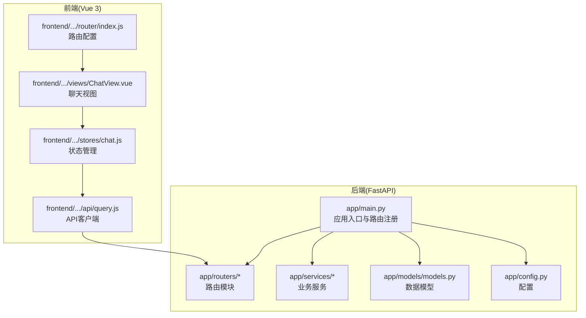
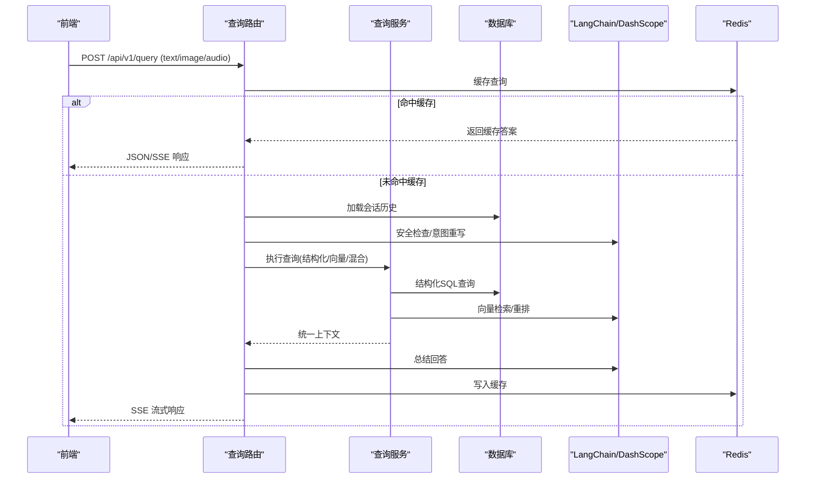
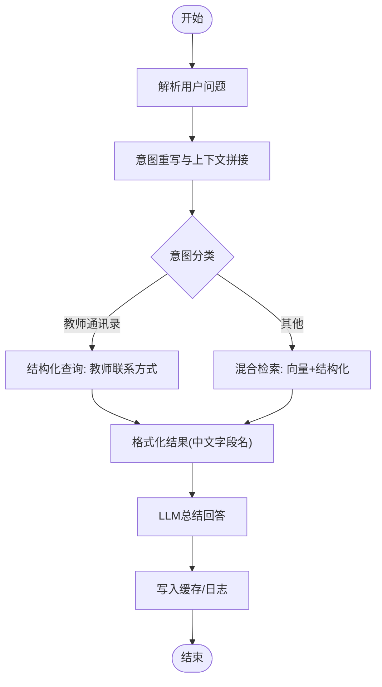
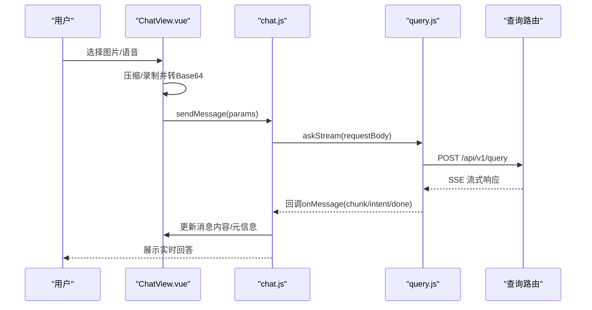
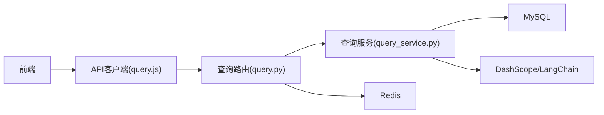

# 功能扩展

<cite>
**本文引用的文件**
- [main.py](file://service/ai_assistant/app/main.py)
- [query.py](file://service/ai_assistant/app/routers/query.py)
- [query_service.py](file://service/ai_assistant/app/services/query_service.py)
- [models.py](file://service/ai_assistant/app/models/models.py)
- [config.py](file://service/ai_assistant/app/config.py)
- [langchain_service.py](file://service/ai_assistant/app/services/langchain_service.py)
- [index.js](file://frontend/ai_assistant/src/router/index.js)
- [query.js](file://frontend/ai_assistant/src/api/query.js)
- [ChatView.vue](file://frontend/ai_assistant/src/views/ChatView.vue)
- [chat.js](file://frontend/ai_assistant/src/stores/chat.js)
- [admin.py](file://service/ai_assistant/app/routers/admin.py)
</cite>

## 目录
1. [简介](#简介)
2. [项目结构](#项目结构)
3. [核心组件](#核心组件)
4. [架构总览](#架构总览)
5. [详细组件分析](#详细组件分析)
6. [依赖分析](#依赖分析)
7. [性能考虑](#性能考虑)
8. [故障排查指南](#故障排查指南)
9. [结论](#结论)
10. [附录](#附录)

## 简介
本项目为“AI校园助手”，提供统一的多模态查询接口，支持文本、图像、语音输入，结合意图识别、结构化查询、向量检索与混合检索，最终由大模型生成自然语言回答，并提供会话缓存与历史记录管理。本文档面向扩展需求，系统讲解如何：
- 新增后端API接口（路由器、服务层、数据模型）
- 扩展查询功能（新增查询类型、多模态输入、自定义响应格式）
- 扩展前端组件（新页面、现有组件增强、API客户端扩展）
- 最佳实践与完整实现步骤

## 项目结构
后端采用FastAPI，路由集中注册；前端采用Vue 3 + Pinia，通过API客户端与后端交互。整体采用前后端分离架构，后端负责业务逻辑与数据访问，前端负责UI与交互。

图表来源
- [main.py:1-86](file://service/ai_assistant/app/main.py#L1-L86)
- [index.js:1-75](file://frontend/ai_assistant/src/router/index.js#L1-L75)
- [query.js:1-141](file://frontend/ai_assistant/src/api/query.js#L1-L141)
- [chat.js:1-278](file://frontend/ai_assistant/src/stores/chat.js#L1-L278)
- [ChatView.vue:1-1168](file://frontend/ai_assistant/src/views/ChatView.vue#L1-L1168)

章节来源
- [main.py:1-86](file://service/ai_assistant/app/main.py#L1-L86)
- [index.js:1-75](file://frontend/ai_assistant/src/router/index.js#L1-L75)

## 核心组件
- 后端应用入口与路由注册：集中注册认证、管理员、查询、系统等路由，统一CORS与生命周期管理。
- 查询路由：统一的多模态查询端点，负责输入解码、缓存、安全检查、意图分类、查询执行、总结与缓存回填。
- 查询服务：封装结构化SQL查询、向量检索、混合检索、工具规划与结果格式化。
- 数据模型：涵盖管理员、院系、专业、班级、教师、课程、教室、学生、选课、成绩、课表、调整单、对话日志等。
- 配置：集中管理数据库、Redis、JWT、阿里云DashScope、百炼检索、缓存TTL等。
- 前端路由与API：前端路由控制页面导航，API客户端封装查询请求与SSE流式接收，状态管理负责会话与消息持久化。

章节来源
- [main.py:1-86](file://service/ai_assistant/app/main.py#L1-L86)
- [query.py:1-788](file://service/ai_assistant/app/routers/query.py#L1-L788)
- [query_service.py:1-800](file://service/ai_assistant/app/services/query_service.py#L1-L800)
- [models.py:1-660](file://service/ai_assistant/app/models/models.py#L1-L660)
- [config.py:1-113](file://service/ai_assistant/app/config.py#L1-L113)
- [query.js:1-141](file://frontend/ai_assistant/src/api/query.js#L1-L141)
- [chat.js:1-278](file://frontend/ai_assistant/src/stores/chat.js#L1-L278)

## 架构总览
后端查询链路包含：多模态输入解码、统一文本构建、缓存命中、历史加载、并发安全检查与意图重写、意图分类、查询执行（结构化/向量/混合）、LLM总结、缓存与日志落盘。前端通过SSE流式接收回答，支持图片、语音等多模态输入。

图表来源
- [query.py:198-745](file://service/ai_assistant/app/routers/query.py#L198-L745)
- [query_service.py:574-800](file://service/ai_assistant/app/services/query_service.py#L574-L800)
- [langchain_service.py:139-278](file://service/ai_assistant/app/services/langchain_service.py#L139-L278)

## 详细组件分析

### 后端：新增API接口（路由器、服务层、数据模型）
- 新增路由器
  - 在后端routers目录新增模块，定义APIRouter与路由函数，遵循已有命名风格与路径前缀。
  - 在应用入口注册新路由，确保CORS与生命周期配置生效。
  - 参考路径：[main.py:81-84](file://service/ai_assistant/app/main.py#L81-L84)、[admin.py:48](file://service/ai_assistant/app/routers/admin.py#L48)
- 新增服务层
  - 在services目录新增服务模块，封装业务逻辑与外部调用（如LLM、检索、缓存）。
  - 保持与LangChain/DashScope适配器的一致性，提供同步/异步调用与流式支持。
  - 参考路径：[langchain_service.py:139-278](file://service/ai_assistant/app/services/langchain_service.py#L139-L278)
- 新增数据模型
  - 在models目录新增ORM模型，定义字段、索引、约束与关系。
  - 在routers与schemas中补充对应的Pydantic模型与响应结构。
  - 参考路径：[models.py:404-660](file://service/ai_assistant/app/models/models.py#L404-L660)

实现步骤（示例：新增“校园公告”查询）
1. 在routers目录新增公告路由模块，定义GET/POST端点，返回公告列表或详情。
2. 在services目录新增公告服务，封装SQL查询与结果格式化。
3. 在models目录新增公告模型，定义字段与索引。
4. 在schemas中新增请求/响应模型。
5. 在应用入口注册新路由。
6. 前端在API客户端与状态管理中对接新接口。

章节来源
- [main.py:81-84](file://service/ai_assistant/app/main.py#L81-L84)
- [admin.py:48](file://service/ai_assistant/app/routers/admin.py#L48)
- [langchain_service.py:139-278](file://service/ai_assistant/app/services/langchain_service.py#L139-L278)
- [models.py:404-660](file://service/ai_assistant/app/models/models.py#L404-L660)

### 后端：扩展查询功能（新增查询类型、多模态输入、自定义响应格式）
- 新增查询类型
  - 在意图枚举中增加新类型，扩展查询服务的工具规划与执行分支。
  - 在查询路由中根据意图修正与上下文判断，决定是否跳过检索或走结构化查询。
  - 参考路径：[query.py:8-13](file://service/ai_assistant/app/routers/query.py#L8-L13)、[query_service.py:178-209](file://service/ai_assistant/app/services/query_service.py#L178-L209)
- 多模态输入支持
  - 在查询路由中扩展媒体服务调用（图像/语音），在请求模型中新增字段并在前端传参。
  - 参考路径：[query.py:232-264](file://service/ai_assistant/app/routers/query.py#L232-L264)、[query.py:15-23](file://service/ai_assistant/app/routers/query.py#L15-L23)
- 自定义响应格式
  - 在查询服务中新增格式化函数，将数据库结果翻译为中文字段名与可读格式。
  - 在查询路由中根据output_type返回JSON或SSE流式响应。
  - 参考路径：[query_service.py:133-147](file://service/ai_assistant/app/services/query_service.py#L133-L147)、[query.py:582-647](file://service/ai_assistant/app/routers/query.py#L582-L647)

实现步骤（示例：新增“教师通讯录”查询）
1. 在查询服务中新增工具规划与SQL查询函数，返回教师联系方式。
2. 在查询路由中根据意图与上下文决定是否走结构化查询。
3. 在前端API客户端与状态管理中处理新意图与响应格式。
4. 在前端视图中展示教师通讯录卡片或表格。

章节来源
- [query.py:8-13](file://service/ai_assistant/app/routers/query.py#L8-L13)
- [query_service.py:178-209](file://service/ai_assistant/app/services/query_service.py#L178-L209)
- [query_service.py:133-147](file://service/ai_assistant/app/services/query_service.py#L133-L147)
- [query.py:582-647](file://service/ai_assistant/app/routers/query.py#L582-L647)

### 前端：新增页面组件与API客户端扩展
- 新页面组件开发
  - 在views目录新增页面组件，使用MainLayout作为父布局，注册到路由配置。
  - 参考路径：[index.js:5-49](file://frontend/ai_assistant/src/router/index.js#L5-L49)
- 现有组件功能增强
  - 在ChatView中扩展多模态输入（图片/语音）与SSE流式渲染，支持意图标签与缓存/耗时显示。
  - 参考路径：[ChatView.vue:151-218](file://frontend/ai_assistant/src/views/ChatView.vue#L151-L218)、[ChatView.vue:400-525](file://frontend/ai_assistant/src/views/ChatView.vue#L400-L525)
- API客户端扩展
  - 在api目录新增或修改API模块，封装POST/DELETE等请求，支持SSE流式接收与错误处理。
  - 参考路径：[query.js:28-141](file://frontend/ai_assistant/src/api/query.js#L28-L141)
- 状态管理扩展
  - 在stores目录扩展状态管理，新增会话/消息持久化、搜索过滤、错误解析等。
  - 参考路径：[chat.js:133-230](file://frontend/ai_assistant/src/stores/chat.js#L133-L230)

实现步骤（示例：新增“公告详情”页面）
1. 在views目录新增公告详情组件，使用MainLayout。
2. 在router中注册新路由，设置meta标识与导航守卫。
3. 在api目录新增公告API模块，封装GET/POST请求。
4. 在stores中新增公告状态管理，处理列表与详情数据。
5. 在ChatView中新增“查看公告”快捷操作，调用新API并渲染结果。

章节来源
- [index.js:5-49](file://frontend/ai_assistant/src/router/index.js#L5-L49)
- [ChatView.vue:151-218](file://frontend/ai_assistant/src/views/ChatView.vue#L151-L218)
- [ChatView.vue:400-525](file://frontend/ai_assistant/src/views/ChatView.vue#L400-L525)
- [query.js:28-141](file://frontend/ai_assistant/src/api/query.js#L28-L141)
- [chat.js:133-230](file://frontend/ai_assistant/src/stores/chat.js#L133-L230)

### 后端：新增查询类型（以“教师通讯录”为例）
- 在查询服务中新增工具规划与SQL查询函数，返回教师联系方式。
- 在查询路由中根据意图与上下文决定是否走结构化查询。
- 在前端API客户端与状态管理中处理新意图与响应格式。

图表来源
- [query_service.py:178-209](file://service/ai_assistant/app/services/query_service.py#L178-L209)
- [query_service.py:133-147](file://service/ai_assistant/app/services/query_service.py#L133-L147)
- [query.py:495-500](file://service/ai_assistant/app/routers/query.py#L495-L500)

章节来源
- [query_service.py:178-209](file://service/ai_assistant/app/services/query_service.py#L178-L209)
- [query_service.py:133-147](file://service/ai_assistant/app/services/query_service.py#L133-L147)
- [query.py:495-500](file://service/ai_assistant/app/routers/query.py#L495-L500)

### 前端：多模态输入与SSE流式渲染（以图片/语音为例）
- 图片上传与压缩：限制大小、压缩至合适尺寸，转换为Base64。
- 语音录制：使用MediaRecorder录制webm，前端校验时长与音量，转换为Base64。
- SSE流式渲染：解析data: {...}片段，合并增量块，结束时标记done。

图表来源
- [ChatView.vue:335-395](file://frontend/ai_assistant/src/views/ChatView.vue#L335-L395)
- [ChatView.vue:400-525](file://frontend/ai_assistant/src/views/ChatView.vue#L400-L525)
- [chat.js:189-230](file://frontend/ai_assistant/src/stores/chat.js#L189-L230)
- [query.js:28-141](file://frontend/ai_assistant/src/api/query.js#L28-L141)

章节来源
- [ChatView.vue:335-395](file://frontend/ai_assistant/src/views/ChatView.vue#L335-L395)
- [ChatView.vue:400-525](file://frontend/ai_assistant/src/views/ChatView.vue#L400-L525)
- [chat.js:189-230](file://frontend/ai_assistant/src/stores/chat.js#L189-L230)
- [query.js:28-141](file://frontend/ai_assistant/src/api/query.js#L28-L141)

## 依赖分析
- 后端依赖
  - FastAPI：路由与生命周期管理
  - SQLAlchemy：异步ORM与数据库访问
  - Redis：缓存与会话历史
  - DashScope/LangChain：大模型调用与流式处理
  - Pydantic：请求/响应模型验证
- 前端依赖
  - Vue Router：页面导航与守卫
  - Pinia：状态管理
  - Fetch/SSE：与后端通信

图表来源
- [query.js:1-141](file://frontend/ai_assistant/src/api/query.js#L1-L141)
- [query.py:198-745](file://service/ai_assistant/app/routers/query.py#L198-L745)
- [query_service.py:574-800](file://service/ai_assistant/app/services/query_service.py#L574-L800)
- [langchain_service.py:139-278](file://service/ai_assistant/app/services/langchain_service.py#L139-L278)

章节来源
- [query.js:1-141](file://frontend/ai_assistant/src/api/query.js#L1-L141)
- [query.py:198-745](file://service/ai_assistant/app/routers/query.py#L198-L745)
- [query_service.py:574-800](file://service/ai_assistant/app/services/query_service.py#L574-L800)
- [langchain_service.py:139-278](file://service/ai_assistant/app/services/langchain_service.py#L139-L278)

## 性能考虑
- 缓存策略：合理设置敏感与普通缓存TTL，避免重复计算；在SSE结束后再写入缓存，减少阻塞。
- 并发优化：安全检查、隐私检查与意图重写并行执行，缩短总延迟。
- 输入裁剪：对LLM输入进行消息裁剪与字符截断，避免超限。
- 数据库连接：在SSE生成器中提前回滚请求会话，避免长时间占用连接。
- 前端渲染：SSE增量更新，避免一次性渲染大量DOM。

章节来源
- [config.py:81-84](file://service/ai_assistant/app/config.py#L81-L84)
- [query.py:347-352](file://service/ai_assistant/app/routers/query.py#L347-L352)
- [langchain_service.py:20-96](file://service/ai_assistant/app/services/langchain_service.py#L20-L96)
- [query.py:654-657](file://service/ai_assistant/app/routers/query.py#L654-L657)

## 故障排查指南
- 后端常见错误
  - 502 Bad Gateway：图像/语音处理失败或LLM调用异常，检查媒体服务与DashScope配置。
  - 400 Bad Request：缺少必要输入（文本/图片/语音），检查请求体。
  - 401 Unauthorized：JWT过期或无效，前端重新登录。
- 前端常见错误
  - SSE解析失败：网关改写流格式，前端具备容错解析；确认后端SSE头部与格式。
  - 静音/无声音：前端录制时长过短或音量过低，提示用户重新录制。
- 日志与监控
  - 后端使用结构化日志记录关键指标（路由、片段数量、延迟），便于定位瓶颈。
  - 前端在store中统一解析错误消息，提升用户体验。

章节来源
- [query.py:238-260](file://service/ai_assistant/app/routers/query.py#L238-L260)
- [query.js:101-109](file://frontend/ai_assistant/src/api/query.js#L101-L109)
- [chat.js:235-257](file://frontend/ai_assistant/src/stores/chat.js#L235-L257)

## 结论
通过本文档的扩展指南，开发者可以快速在AI校园助手中新增API接口、扩展查询功能与多模态输入、增强前端组件与API客户端。建议遵循以下最佳实践：
- 后端：保持路由与服务职责单一，统一错误处理与日志记录；前端：SSE增量渲染与错误统一解析。
- 数据模型与Schema：保持一致性，避免跨模块耦合。
- 配置集中管理，敏感信息通过环境变量注入，避免硬编码。

## 附录
- 新增查询类型的实现步骤（以“教师通讯录”为例）
  1) 在routers中新增路由模块，定义端点与依赖。
  2) 在services中新增工具规划与SQL查询函数。
  3) 在models中新增对应实体与关系。
  4) 在schemas中新增请求/响应模型。
  5) 在应用入口注册路由。
  6) 在前端API客户端与状态管理中对接新接口。
  7) 在ChatView中新增快捷操作，调用新API并渲染结果。

章节来源
- [admin.py:48](file://service/ai_assistant/app/routers/admin.py#L48)
- [models.py:404-660](file://service/ai_assistant/app/models/models.py#L404-L660)
- [index.js:5-49](file://frontend/ai_assistant/src/router/index.js#L5-L49)
- [query.js:28-141](file://frontend/ai_assistant/src/api/query.js#L28-L141)
- [chat.js:133-230](file://frontend/ai_assistant/src/stores/chat.js#L133-L230)
- [ChatView.vue:257-270](file://frontend/ai_assistant/src/views/ChatView.vue#L257-L270)