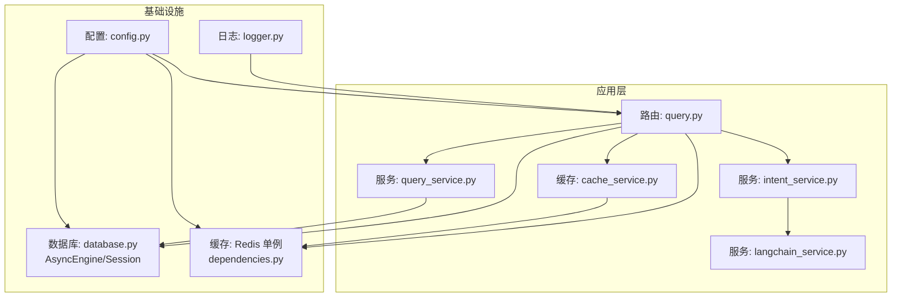
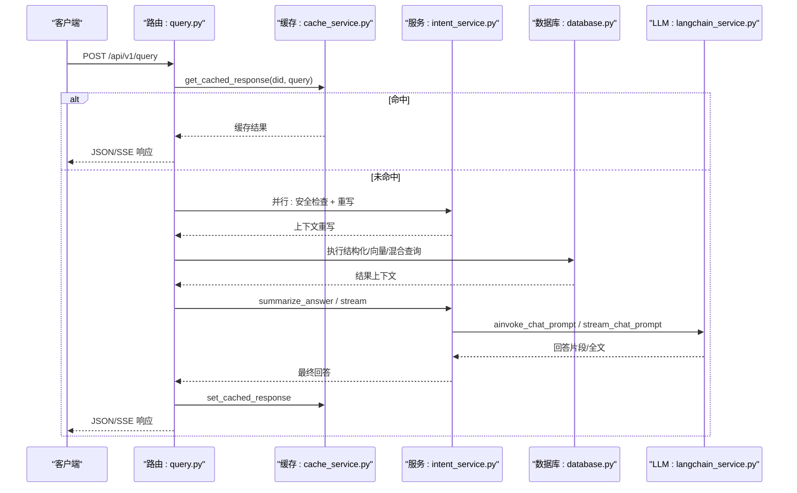
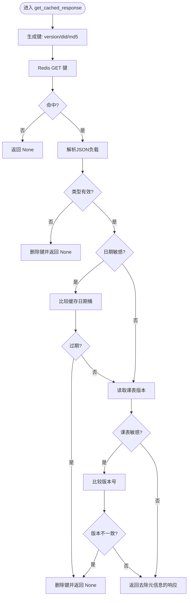
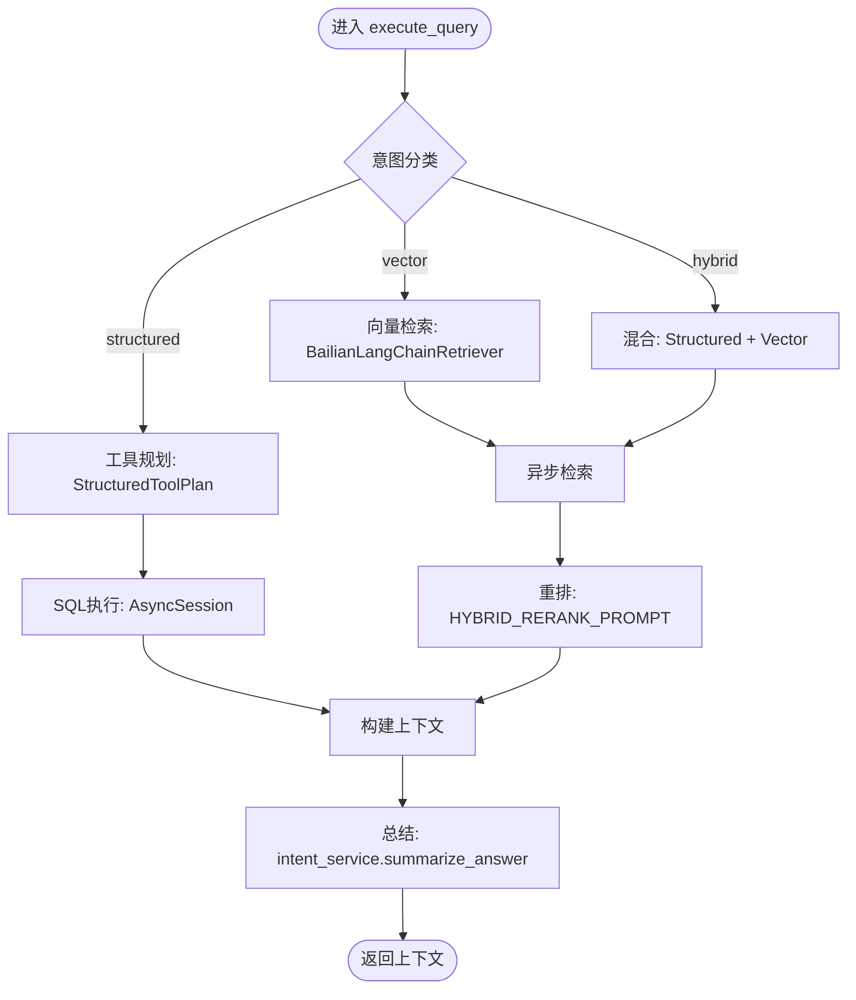
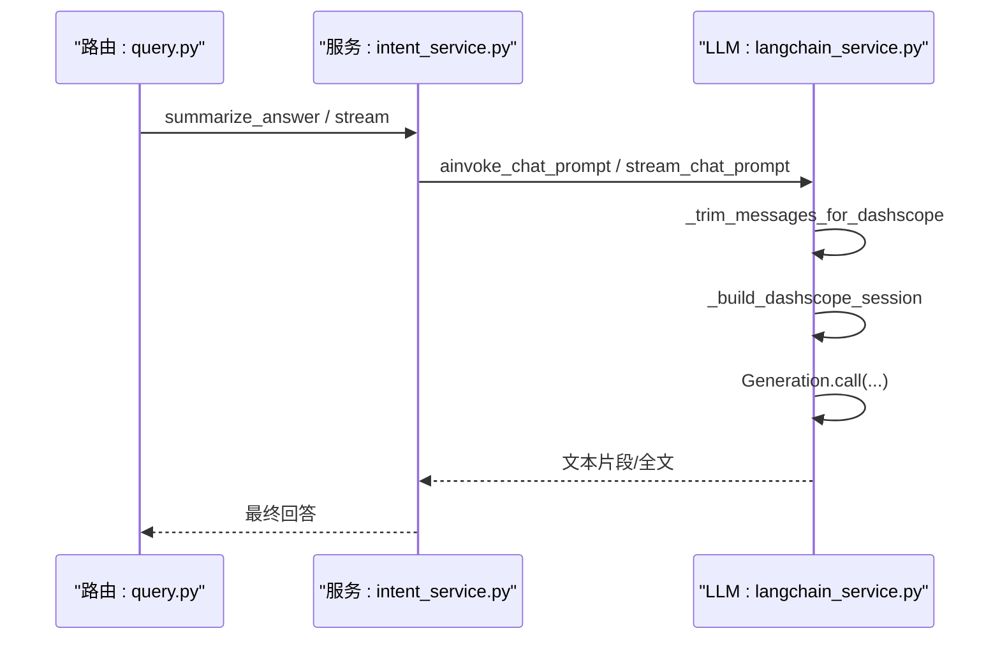
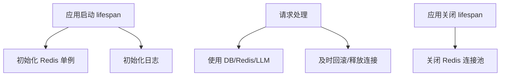
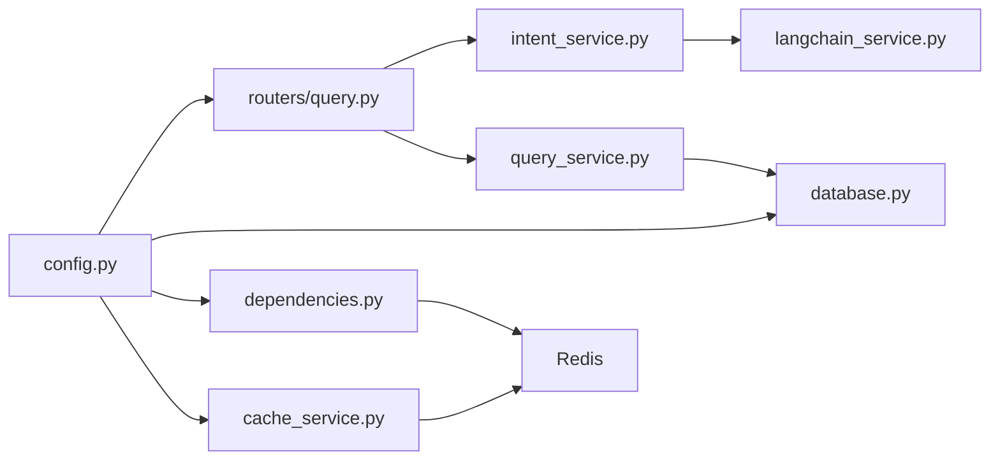

# 性能优化定制

<cite>
**本文档引用的文件**
- [config.py](file://service/ai_assistant/app/config.py)
- [cache_service.py](file://service/ai_assistant/app/services/cache_service.py)
- [database.py](file://service/ai_assistant/app/database.py)
- [dependencies.py](file://service/ai_assistant/app/dependencies.py)
- [main.py](file://service/ai_assistant/app/main.py)
- [langchain_service.py](file://service/ai_assistant/app/services/langchain_service.py)
- [query.py](file://service/ai_assistant/app/routers/query.py)
- [intent_service.py](file://service/ai_assistant/app/services/intent_service.py)
- [query_service.py](file://service/ai_assistant/app/services/query_service.py)
- [logger.py](file://service/ai_assistant/app/utils/logger.py)
- [docker-compose.yml](file://service/ai_assistant/docker-compose.yml)
- [Dockerfile](file://service/ai_assistant/Dockerfile)
- [requirements.txt](file://service/ai_assistant/requirements.txt)
</cite>

## 目录
1. [简介](#简介)
2. [项目结构](#项目结构)
3. [核心组件](#核心组件)
4. [架构总览](#架构总览)
5. [详细组件分析](#详细组件分析)
6. [依赖分析](#依赖分析)
7. [性能考量](#性能考量)
8. [故障排查指南](#故障排查指南)
9. [结论](#结论)
10. [附录](#附录)

## 简介
本文件面向“AI校园助手”项目的性能优化，聚焦以下方面：
- 缓存策略定制：Redis配置优化、缓存键设计、过期时间与失效策略
- 查询性能优化：数据库连接池与索引、SQL执行路径、连接复用
- AI服务调用优化：并发控制、超时与重试、流式输出与线程池隔离
- 内存与资源管理：连接池生命周期、日志落盘与滚动、容器资源限制
- 监控与瓶颈定位：日志指标、关键路径耗时、Redis与LLM调用链路

## 项目结构
后端采用FastAPI + SQLAlchemy异步ORM + Redis异步客户端，AI推理通过LangChain适配DashScope，整体为高并发I/O密集型服务。

图表来源
- [query.py:198-745](file://service/ai_assistant/app/routers/query.py#L198-L745)
- [intent_service.py:218-346](file://service/ai_assistant/app/services/intent_service.py#L218-L346)
- [query_service.py:1-800](file://service/ai_assistant/app/services/query_service.py#L1-L800)
- [langchain_service.py:139-278](file://service/ai_assistant/app/services/langchain_service.py#L139-L278)
- [cache_service.py:92-177](file://service/ai_assistant/app/services/cache_service.py#L92-L177)
- [database.py:7-20](file://service/ai_assistant/app/database.py#L7-L20)
- [dependencies.py:36-51](file://service/ai_assistant/app/dependencies.py#L36-L51)
- [config.py:6-112](file://service/ai_assistant/app/config.py#L6-L112)
- [logger.py:17-46](file://service/ai_assistant/app/utils/logger.py#L17-L46)

章节来源
- [main.py:52-86](file://service/ai_assistant/app/main.py#L52-L86)
- [config.py:6-112](file://service/ai_assistant/app/config.py#L6-L112)

## 核心组件
- 配置中心：集中管理数据库、Redis、LLM模型、缓存TTL、CORS等
- 缓存服务：基于Redis的异步键空间，带敏感度与日期/课表版本失效策略
- 数据库层：异步引擎与会话工厂，连接池预热与回收策略
- 依赖注入：Redis单例、数据库会话、鉴权
- AI服务：LangChain适配DashScope，支持非流式与流式调用
- 查询路由：统一入口，多阶段并发与流式输出，SSE封装

章节来源
- [config.py:6-112](file://service/ai_assistant/app/config.py#L6-L112)
- [cache_service.py:1-177](file://service/ai_assistant/app/services/cache_service.py#L1-L177)
- [database.py:7-20](file://service/ai_assistant/app/database.py#L7-L20)
- [dependencies.py:36-51](file://service/ai_assistant/app/dependencies.py#L36-L51)
- [langchain_service.py:139-278](file://service/ai_assistant/app/services/langchain_service.py#L139-L278)
- [query.py:198-745](file://service/ai_assistant/app/routers/query.py#L198-L745)

## 架构总览
整体为“路由-服务-缓存/数据库-外部LLM”的分层架构，关键性能点包括：
- 路由层并发：安全检查、意图重写并行，避免串行阻塞
- 缓存层：热点查询命中、敏感/日期/课表失效策略
- 数据库层：连接池复用、事务及时回滚释放
- LLM层：线程池隔离外部调用，流式输出降低首字延迟

图表来源
- [query.py:347-745](file://service/ai_assistant/app/routers/query.py#L347-L745)
- [cache_service.py:92-177](file://service/ai_assistant/app/services/cache_service.py#L92-L177)
- [intent_service.py:218-346](file://service/ai_assistant/app/services/intent_service.py#L218-L346)
- [langchain_service.py:139-278](file://service/ai_assistant/app/services/langchain_service.py#L139-L278)
- [database.py:7-20](file://service/ai_assistant/app/database.py#L7-L20)

## 详细组件分析

### 缓存策略定制
- 键设计
  - 格式：chat_cache:{version}:{did}:{query_md5}
  - 版本：通过版本号隔离不同查询/总结逻辑升级导致的脏缓存
  - 敏感度：区分敏感/普通查询，分别使用不同TTL
  - 日期敏感：对包含“今天/本周/学期”等相对时间语义的查询，按“当日日期桶”失效
  - 课表敏感：管理员变更课表后递增版本号，命中旧缓存即失效
- TTL与失效
  - 敏感/隐私查询：30分钟
  - 普通查询：1天
  - 日期敏感：跨日自动失效
  - 课表敏感：版本号不一致自动失效
- Redis配置优化（容器）
  - 内存上限：256MB
  - 淘汰策略：LRU
  - 密码：通过环境变量注入
- 清理接口
  - 支持按学生DID批量删除缓存与会话历史，便于维护

图表来源
- [cache_service.py:92-177](file://service/ai_assistant/app/services/cache_service.py#L92-L177)

章节来源
- [cache_service.py:1-177](file://service/ai_assistant/app/services/cache_service.py#L1-L177)
- [docker-compose.yml:13-15](file://service/ai_assistant/docker-compose.yml#L13-L15)
- [query.py:748-787](file://service/ai_assistant/app/routers/query.py#L748-L787)

### 查询性能优化
- 数据库连接池
  - 连接池预热与回收：pool_pre_ping + pool_recycle
  - 会话工厂：expire_on_commit=False，减少事务开销
  - 事务及时回滚：在流式生成前回滚，释放连接
- SQL执行路径
  - 结构化查询：按意图路由至对应工具，避免全表扫描
  - 向量检索：LangChain包装百炼检索器，异步拉取
  - 混合检索：对结构化与向量结果进行去重与重排
- 索引与查询建议
  - 学生维度隐私约束：所有查询均以student_id过滤
  - 课表/成绩/选课等高频字段建议建立复合索引（如term_id+student_id）
  - 会话历史：按did+session_id分区存储，限制长度并设置TTL

图表来源
- [query_service.py:178-238](file://service/ai_assistant/app/services/query_service.py#L178-L238)
- [intent_service.py:298-346](file://service/ai_assistant/app/services/intent_service.py#L298-L346)
- [query.py:529-573](file://service/ai_assistant/app/routers/query.py#L529-L573)

章节来源
- [database.py:7-20](file://service/ai_assistant/app/database.py#L7-L20)
- [query_service.py:1-800](file://service/ai_assistant/app/services/query_service.py#L1-L800)
- [query.py:652-658](file://service/ai_assistant/app/routers/query.py#L652-L658)

### AI服务调用优化
- 并发控制
  - 路由层并发：安全检查与查询重写并行，缩短首字延迟
  - 流式输出：StreamingResponse + SSE，边生成边返回
- 超时与重试
  - LLM调用通过requests.Session封装，必要时忽略代理环境变量
  - 外部调用置于线程池，避免阻塞事件循环
- 重试机制
  - 当前未实现自动重试；建议在LangChain层或DashScope SDK层面增加指数退避重试
- 日志与可观测性
  - 关键步骤记录耗时、输入长度、截断统计、错误码

图表来源
- [intent_service.py:298-346](file://service/ai_assistant/app/services/intent_service.py#L298-L346)
- [langchain_service.py:139-278](file://service/ai_assistant/app/services/langchain_service.py#L139-L278)
- [query.py:659-744](file://service/ai_assistant/app/routers/query.py#L659-L744)

章节来源
- [query.py:347-500](file://service/ai_assistant/app/routers/query.py#L347-L500)
- [langchain_service.py:99-109](file://service/ai_assistant/app/services/langchain_service.py#L99-L109)
- [intent_service.py:218-249](file://service/ai_assistant/app/services/intent_service.py#L218-L249)

### 内存管理与资源清理
- 连接池生命周期
  - FastAPI生命周期：应用启动时创建Redis单例，关闭时统一aclose
  - 数据库会话：异步上下文管理器，finally中关闭
- 日志落盘与滚动
  - 控制台+文件双通道，文件滚动10MB，保留14天
- 容器资源限制
  - Redis最大内存256MB，淘汰策略LRU，适合中小规模部署

图表来源
- [main.py:36-49](file://service/ai_assistant/app/main.py#L36-L49)
- [dependencies.py:36-51](file://service/ai_assistant/app/dependencies.py#L36-L51)
- [logger.py:17-46](file://service/ai_assistant/app/utils/logger.py#L17-L46)

章节来源
- [main.py:36-49](file://service/ai_assistant/app/main.py#L36-L49)
- [database.py:27-35](file://service/ai_assistant/app/database.py#L27-L35)
- [logger.py:17-46](file://service/ai_assistant/app/utils/logger.py#L17-L46)
- [docker-compose.yml:13-15](file://service/ai_assistant/docker-compose.yml#L13-L15)

## 依赖分析
- 外部依赖
  - FastAPI/uvicorn：Web框架与ASGI服务器
  - SQLAlchemy asyncio：异步ORM
  - aioredis：异步Redis客户端
  - DashScope/百炼：LLM与检索
- 内部耦合
  - 路由依赖服务层，服务层依赖配置与工具层
  - 缓存与会话历史依赖Redis
  - 数据库查询依赖SQLAlchemy异步引擎

图表来源
- [requirements.txt:1-22](file://service/ai_assistant/requirements.txt#L1-L22)
- [config.py:6-112](file://service/ai_assistant/app/config.py#L6-L112)
- [query.py:35-42](file://service/ai_assistant/app/routers/query.py#L35-L42)

章节来源
- [requirements.txt:1-22](file://service/ai_assistant/requirements.txt#L1-L22)

## 性能考量
- 缓存命中率
  - 通过敏感度与日期/课表版本策略提升命中质量，减少重复LLM调用
  - 建议：对高频查询（如“今日课表”）在路由层增加预热与批量失效
- 数据库吞吐
  - 连接池参数：pool_pre_ping + pool_recycle，避免僵尸连接
  - 建议：根据QPS与慢查询日志调整pool_size与max_overflow
- LLM调用成本
  - 输入裁剪与截断：避免超出模型输入上限
  - 流式输出：降低首字延迟，改善用户体验
- 并发与线程池
  - 外部HTTP调用放入线程池，避免阻塞事件循环
  - 建议：为LLM调用设置超时与熔断阈值

[本节为通用指导，不直接分析具体文件]

## 故障排查指南
- Redis连接失败
  - 现象：缓存查询异常，路由降级为DB
  - 排查：检查容器健康检查、密码、网络连通性
- LLM调用失败
  - 现象：Generation API错误码与消息
  - 排查：查看日志中的status_code/message，确认API Key与会话配置
- 数据库连接异常
  - 现象：事务回滚失败或连接泄漏
  - 排查：确认pool_recycle与pre_ping生效，检查慢查询
- 日志与监控
  - 关注关键指标：请求耗时、缓存命中/未命中、LLM输入长度、截断次数、错误码分布

章节来源
- [query.py:282-287](file://service/ai_assistant/app/routers/query.py#L282-L287)
- [langchain_service.py:189-200](file://service/ai_assistant/app/services/langchain_service.py#L189-L200)
- [logger.py:17-46](file://service/ai_assistant/app/utils/logger.py#L17-L46)

## 结论
本项目在缓存、数据库、LLM调用与资源管理方面已具备良好的基础。建议在生产环境进一步完善：
- 缓存：引入更细粒度的键命名与失效策略，配合监控命中率
- 数据库：基于慢查询与QPS调优连接池与索引
- LLM：增加超时与重试、熔断与限流
- 监控：埋点关键路径耗时与错误率，形成闭环

[本节为总结，不直接分析具体文件]

## 附录
- 部署建议
  - 使用Docker Compose运行Redis，设置合理maxmemory与淘汰策略
  - 生产环境开启DEBUG=false，避免SQL日志泄露
- 开发建议
  - 通过clear_cache_endpoint清理测试数据
  - 在.env中配置强密码与敏感参数

章节来源
- [docker-compose.yml:1-31](file://service/ai_assistant/docker-compose.yml#L1-L31)
- [main.py:18-34](file://service/ai_assistant/app/main.py#L18-L34)
- [query.py:752-787](file://service/ai_assistant/app/routers/query.py#L752-L787)