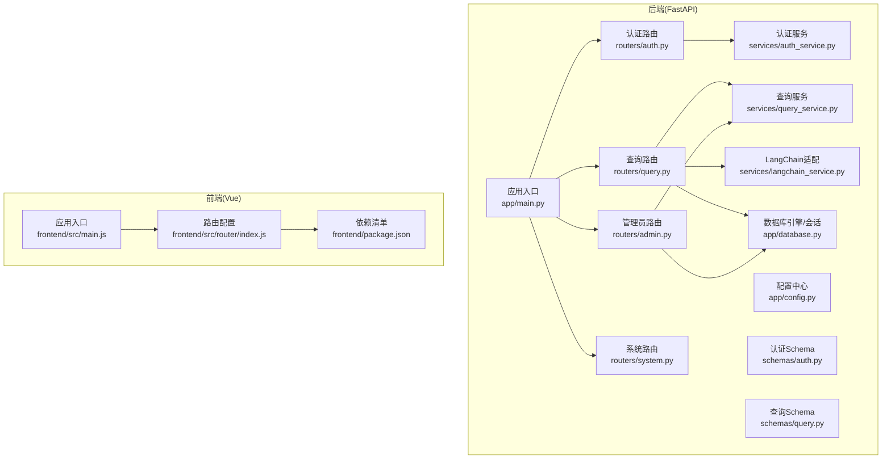
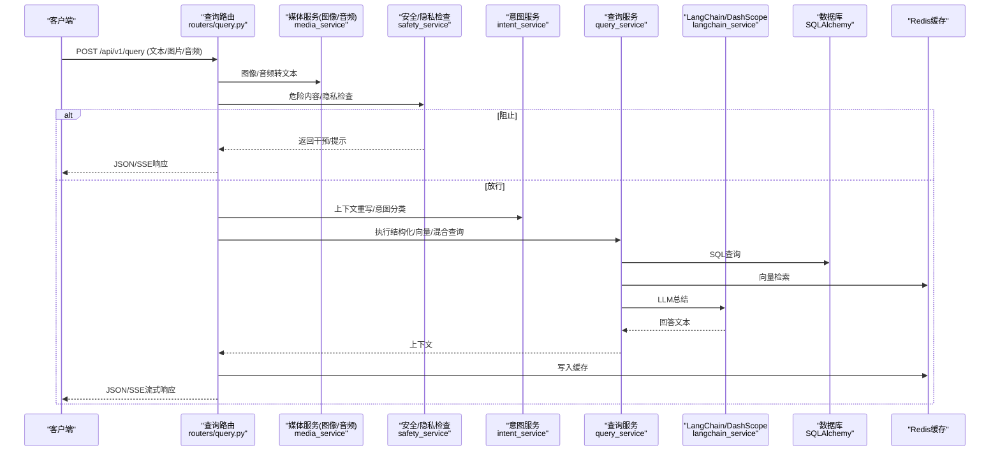
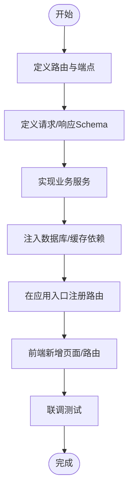
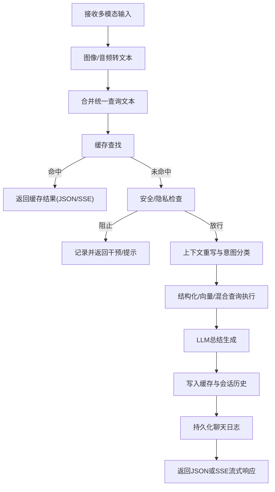
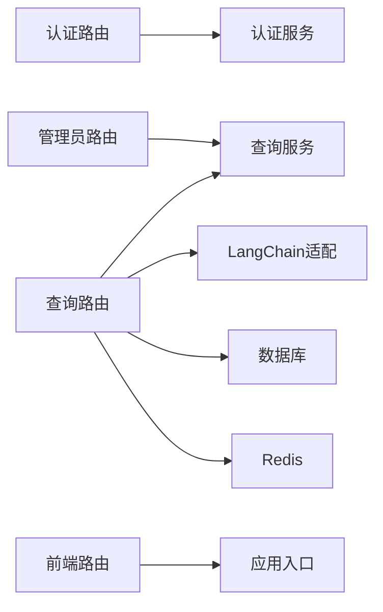

# 扩展定制

<cite>
**本文档引用的文件**
- [service/ai_assistant/app/main.py](file://service/ai_assistant/app/main.py)
- [service/ai_assistant/app/config.py](file://service/ai_assistant/app/config.py)
- [service/ai_assistant/app/database.py](file://service/ai_assistant/app/database.py)
- [service/ai_assistant/app/routers/auth.py](file://service/ai_assistant/app/routers/auth.py)
- [service/ai_assistant/app/routers/query.py](file://service/ai_assistant/app/routers/query.py)
- [service/ai_assistant/app/routers/admin.py](file://service/ai_assistant/app/routers/admin.py)
- [service/ai_assistant/app/routers/system.py](file://service/ai_assistant/app/routers/system.py)
- [service/ai_assistant/app/services/auth_service.py](file://service/ai_assistant/app/services/auth_service.py)
- [service/ai_assistant/app/services/query_service.py](file://service/ai_assistant/app/services/query_service.py)
- [service/ai_assistant/app/services/langchain_service.py](file://service/ai_assistant/app/services/langchain_service.py)
- [service/ai_assistant/app/schemas/auth.py](file://service/ai_assistant/app/schemas/auth.py)
- [service/ai_assistant/app/schemas/query.py](file://service/ai_assistant/app/schemas/query.py)
- [frontend/ai_assistant/src/main.js](file://frontend/ai_assistant/src/main.js)
- [frontend/ai_assistant/src/router/index.js](file://frontend/ai_assistant/src/router/index.js)
- [frontend/ai_assistant/package.json](file://frontend/ai_assistant/package.json)
</cite>

## 目录
1. [简介](#简介)
2. [项目结构](#项目结构)
3. [核心组件](#核心组件)
4. [架构总览](#架构总览)
5. [详细组件分析](#详细组件分析)
6. [依赖分析](#依赖分析)
7. [性能考虑](#性能考虑)
8. [故障排查指南](#故障排查指南)
9. [结论](#结论)
10. [附录](#附录)

## 简介
本文件面向AI校园助手项目的扩展与定制需求，系统性说明后端FastAPI应用的扩展点与定制化方法，涵盖新增API接口、业务逻辑扩展、配置定制、第三方服务集成（新AI模型、新数据库、新认证方式）、插件化思路、性能优化与资源管理、安全策略与访问控制、升级与版本兼容指导，以及最佳实践与注意事项。文档同时提供可视化图示帮助理解系统架构与数据流。

## 项目结构
后端采用FastAPI + SQLAlchemy异步ORM + Redis缓存 + LangChain/DashScope集成的分层架构；前端采用Vue 3 + Pinia + Vue Router构建单页应用。整体结构清晰，便于按功能模块扩展与维护。

**图表来源**
- [service/ai_assistant/app/main.py:52-86](file://service/ai_assistant/app/main.py#L52-L86)
- [service/ai_assistant/app/routers/auth.py:21-102](file://service/ai_assistant/app/routers/auth.py#L21-L102)
- [service/ai_assistant/app/routers/query.py:46-788](file://service/ai_assistant/app/routers/query.py#L46-L788)
- [service/ai_assistant/app/routers/admin.py:48-388](file://service/ai_assistant/app/routers/admin.py#L48-L388)
- [service/ai_assistant/app/routers/system.py:9-38](file://service/ai_assistant/app/routers/system.py#L9-L38)
- [service/ai_assistant/app/services/auth_service.py:1-253](file://service/ai_assistant/app/services/auth_service.py#L1-L253)
- [service/ai_assistant/app/services/query_service.py:1-800](file://service/ai_assistant/app/services/query_service.py#L1-L800)
- [service/ai_assistant/app/services/langchain_service.py:1-278](file://service/ai_assistant/app/services/langchain_service.py#L1-L278)
- [frontend/ai_assistant/src/main.js:1-10](file://frontend/ai_assistant/src/main.js#L1-L10)
- [frontend/ai_assistant/src/router/index.js:1-75](file://frontend/ai_assistant/src/router/index.js#L1-L75)

**章节来源**
- [service/ai_assistant/app/main.py:52-86](file://service/ai_assistant/app/main.py#L52-L86)
- [frontend/ai_assistant/src/main.js:1-10](file://frontend/ai_assistant/src/main.js#L1-L10)
- [frontend/ai_assistant/src/router/index.js:1-75](file://frontend/ai_assistant/src/router/index.js#L1-L75)

## 核心组件
- 应用入口与生命周期：初始化FastAPI、CORS、日志、路由注册与生命周期钩子。
- 配置中心：集中管理应用、数据库、Redis、JWT、AES、LLM模型、DashScope、缓存TTL等配置。
- 数据库层：异步SQLAlchemy引擎与会话工厂，提供统一的数据库依赖注入。
- 路由层：认证、查询、管理员、系统健康/版本等API路由。
- 服务层：认证服务、查询服务（结构化/向量/混合）、LangChain适配、缓存、日志、安全等。
- Schema层：Pydantic模型定义请求/响应结构。
- 前端：Vue应用入口、路由守卫、Pinia状态管理、Axios请求封装等。

**章节来源**
- [service/ai_assistant/app/main.py:1-86](file://service/ai_assistant/app/main.py#L1-L86)
- [service/ai_assistant/app/config.py:1-113](file://service/ai_assistant/app/config.py#L1-L113)
- [service/ai_assistant/app/database.py:1-35](file://service/ai_assistant/app/database.py#L1-L35)
- [service/ai_assistant/app/routers/auth.py:1-102](file://service/ai_assistant/app/routers/auth.py#L1-L102)
- [service/ai_assistant/app/routers/query.py:1-788](file://service/ai_assistant/app/routers/query.py#L1-L788)
- [service/ai_assistant/app/routers/admin.py:1-388](file://service/ai_assistant/app/routers/admin.py#L1-L388)
- [service/ai_assistant/app/routers/system.py:1-38](file://service/ai_assistant/app/routers/system.py#L1-L38)
- [service/ai_assistant/app/services/auth_service.py:1-253](file://service/ai_assistant/app/services/auth_service.py#L1-L253)
- [service/ai_assistant/app/services/query_service.py:1-800](file://service/ai_assistant/app/services/query_service.py#L1-L800)
- [service/ai_assistant/app/services/langchain_service.py:1-278](file://service/ai_assistant/app/services/langchain_service.py#L1-L278)
- [service/ai_assistant/app/schemas/auth.py:1-56](file://service/ai_assistant/app/schemas/auth.py#L1-L56)
- [service/ai_assistant/app/schemas/query.py:1-33](file://service/ai_assistant/app/schemas/query.py#L1-L33)

## 架构总览
系统采用前后端分离，后端提供REST API，前端通过路由守卫实现鉴权跳转。查询主流程包含多模态输入预处理、安全与隐私检查、意图分类、查询执行、LLM总结、缓存与会话历史管理、SSE流式输出等环节。

**图表来源**
- [service/ai_assistant/app/routers/query.py:207-745](file://service/ai_assistant/app/routers/query.py#L207-L745)
- [service/ai_assistant/app/services/query_service.py:1-800](file://service/ai_assistant/app/services/query_service.py#L1-L800)
- [service/ai_assistant/app/services/langchain_service.py:139-278](file://service/ai_assistant/app/services/langchain_service.py#L139-L278)

## 详细组件分析

### 新增API接口扩展方法
- 后端扩展步骤
  - 在路由层新增APIRouter并定义路径、请求体与响应模型。
  - 在服务层编写业务逻辑，必要时引入数据库/缓存依赖。
  - 在Schema层补充请求/响应模型，确保类型安全与文档生成。
  - 在应用入口注册新路由。
- 前端扩展步骤
  - 在路由配置中添加新页面与导航守卫规则。
  - 在store中新增状态管理，或在组件内直接调用HTTP模块。
  - 在API模块中封装请求方法，统一处理鉴权头与错误处理。

**章节来源**
- [service/ai_assistant/app/routers/auth.py:21-102](file://service/ai_assistant/app/routers/auth.py#L21-L102)
- [service/ai_assistant/app/routers/admin.py:48-388](file://service/ai_assistant/app/routers/admin.py#L48-L388)
- [service/ai_assistant/app/routers/system.py:9-38](file://service/ai_assistant/app/routers/system.py#L9-L38)
- [frontend/ai_assistant/src/router/index.js:1-75](file://frontend/ai_assistant/src/router/index.js#L1-L75)

### 前端组件扩展
- 页面组件：在views目录新增Vue组件，按需引入布局与样式。
- 路由守卫：在router/index.js中配置meta与导航逻辑，实现登录拦截与访客重定向。
- 状态管理：在stores目录新增Pinia Store，管理用户会话、聊天状态等。
- 请求封装：在api目录新增HTTP模块，统一封装Axios请求与错误处理。

**章节来源**
- [frontend/ai_assistant/src/router/index.js:1-75](file://frontend/ai_assistant/src/router/index.js#L1-L75)
- [frontend/ai_assistant/src/main.js:1-10](file://frontend/ai_assistant/src/main.js#L1-L10)
- [frontend/ai_assistant/package.json:1-24](file://frontend/ai_assistant/package.json#L1-L24)

### 业务逻辑扩展（查询主流程）
- 多模态输入：图像/音频转文本后合并为统一查询文本。
- 缓存优先：基于DID与查询哈希优先命中Redis缓存。
- 安全与隐私：危险内容拦截与隐私违规（查询他人学号）阻断。
- 意图分类：基于上下文重写后的查询进行意图分类（结构化/向量/混合/闲聊）。
- 查询执行：结构化SQL、向量检索或混合检索，必要时触发工具规划。
- LLM总结：使用不同模型生成最终回答。
- 会话历史：按会话隔离存储与加载，避免并发污染。
- 流式输出：SSE流式返回，支持进度与最终元数据。

**图表来源**
- [service/ai_assistant/app/routers/query.py:207-745](file://service/ai_assistant/app/routers/query.py#L207-L745)

**章节来源**
- [service/ai_assistant/app/routers/query.py:1-788](file://service/ai_assistant/app/routers/query.py#L1-L788)

### 配置定制指南
- 环境变量与配置项
  - 应用基础：APP_NAME、APP_VERSION、DEBUG、CORS_ALLOW_ORIGINS
  - 数据库：MYSQL_HOST、MYSQL_PORT、MYSQL_USER、MYSQL_PASSWORD、MYSQL_DATABASE
  - 缓存：REDIS_HOST、REDIS_PORT、REDIS_PASSWORD、REDIS_DB
  - 认证：JWT_SECRET_KEY、JWT_ALGORITHM、JWT_EXPIRE_MINUTES、AES_SECRET_KEY
  - 隐私：DID_SALT
  - 对话上下文：MAX_HISTORY_COUNT
  - DashScope：ALI_API_KEY、DASHSCOPE_TRUST_ENV_PROXY、DASHSCOPE_MAX_INPUT_CHARS、BAILIAN_APP_ID
  - LLM模型：各意图与能力对应的模型名称（qwen系列）
  - 百炼检索：ALIBABA_CLOUD_ACCESS_KEY_ID、ALIBABA_CLOUD_ACCESS_KEY_SECRET、BAILIAN_WORKSPACE_ID、BAILIAN_INDEX_ID、BAILIAN_ENDPOINT
  - 缓存TTL：CACHE_TTL_SENSITIVE、CACHE_TTL_NORMAL
- 配置加载与校验
  - 通过Pydantic Settings集中加载.env文件，提供属性化访问与URL拼装。
  - CORS允许来源支持逗号分隔与通配符，运行时动态解析。
- 安全建议
  - 生产环境务必替换默认JWT/AES/DID盐值，避免使用示例默认值。
  - CORS白名单限定为前端域名，避免跨域风险。

**章节来源**
- [service/ai_assistant/app/config.py:1-113](file://service/ai_assistant/app/config.py#L1-L113)
- [service/ai_assistant/app/main.py:18-34](file://service/ai_assistant/app/main.py#L18-L34)

### 第三方服务集成策略
- 新AI模型集成
  - 在LangChain适配层扩展模型调用，保持统一的提示模板与流式接口。
  - 在配置中心新增模型参数键值，按意图类型映射到具体模型。
  - 在查询服务中增加模型选择逻辑，支持按场景切换。
- 新数据库支持
  - 在数据库层扩展SQLAlchemy模型与查询服务，遵循现有依赖注入模式。
  - 在Schema层补充请求/响应模型，确保API契约稳定。
- 新认证方式
  - 在认证服务中扩展令牌签发与校验逻辑，保持与现有路由依赖一致。
  - 在前端路由守卫中新增鉴权状态管理，区分学生/管理员角色。

**章节来源**
- [service/ai_assistant/app/services/langchain_service.py:1-278](file://service/ai_assistant/app/services/langchain_service.py#L1-L278)
- [service/ai_assistant/app/services/query_service.py:1-800](file://service/ai_assistant/app/services/query_service.py#L1-L800)
- [service/ai_assistant/app/services/auth_service.py:1-253](file://service/ai_assistant/app/services/auth_service.py#L1-L253)

### 插件系统使用与开发方法
- 插件化思路
  - 将可变性强的功能（如新的检索后端、新的LLM提供商、新的安全规则）抽象为插件接口。
  - 通过配置中心动态选择插件实现，避免硬编码耦合。
  - 在服务层以依赖注入的方式装配插件，保持路由与业务逻辑稳定。
- 开发步骤
  - 定义插件接口与默认实现。
  - 在配置中心新增开关与参数键。
  - 在服务层按需注入插件实例，替换或组合现有实现。
  - 在路由层保持对外API不变，内部逻辑按插件扩展。

[本节为概念性指导，不直接分析具体文件，故无“章节来源”]

### 系统性能优化与资源管理定制
- 连接池与会话
  - 数据库连接池pre_ping与recycle，减少连接失效导致的异常。
  - 长事务尽量缩短，StreamingResponse前主动回滚数据库会话，释放连接。
- 缓存策略
  - Redis作为热点缓存，敏感查询与普通查询分别设置TTL。
  - 会话历史按会话隔离存储，避免并发污染，同时设置过期时间。
- 并发与异步
  - 查询主流程中对安全检查、意图重写等任务并发执行，缩短端到端延迟。
  - 流式生成使用线程池包装阻塞调用，避免阻塞事件循环。
- LLM调优
  - 控制消息长度与截断策略，避免超出模型输入上限。
  - 按意图选择合适模型，平衡质量与成本。

**章节来源**
- [service/ai_assistant/app/database.py:7-20](file://service/ai_assistant/app/database.py#L7-L20)
- [service/ai_assistant/app/routers/query.py:347-500](file://service/ai_assistant/app/routers/query.py#L347-L500)
- [service/ai_assistant/app/services/langchain_service.py:139-278](file://service/ai_assistant/app/services/langchain_service.py#L139-L278)

### 安全策略与访问控制扩展
- 认证与授权
  - JWT令牌签发与校验，区分学生与管理员角色。
  - 路由依赖注入当前用户/管理员，未登录或角色不符直接拒绝。
- 隐私与数据最小化
  - 严格限制查询范围为当前用户自身数据。
  - 隐私违规（查询他人学号）直接拦截并提示。
- 输入与输出
  - LLM输入进行字符数裁剪与消息优先丢弃策略，防止越界。
  - 输出流式返回，避免一次性大对象造成内存压力。

**章节来源**
- [service/ai_assistant/app/services/auth_service.py:45-123](file://service/ai_assistant/app/services/auth_service.py#L45-L123)
- [service/ai_assistant/app/routers/query.py:354-414](file://service/ai_assistant/app/routers/query.py#L354-L414)
- [service/ai_assistant/app/services/langchain_service.py:46-96](file://service/ai_assistant/app/services/langchain_service.py#L46-L96)

### 系统升级与版本兼容指导
- 版本管理
  - 通过配置中心统一管理APP_NAME与APP_VERSION，便于前端展示与健康检查。
- 依赖升级
  - 后端依赖通过requirements.txt管理，建议使用虚拟环境隔离。
  - 前端依赖通过package.json管理，定期更新以修复安全漏洞。
- 接口兼容
  - 保持现有Schema不变，新增字段使用可选字段并提供默认值。
  - 路由命名空间与版本前缀保持稳定，避免破坏前端调用。

**章节来源**
- [service/ai_assistant/app/routers/system.py:17-38](file://service/ai_assistant/app/routers/system.py#L17-L38)
- [frontend/ai_assistant/package.json:1-24](file://frontend/ai_assistant/package.json#L1-L24)

## 依赖分析
后端模块间依赖清晰，路由层依赖服务层，服务层依赖配置与数据库/缓存依赖；前端通过路由守卫与状态管理与后端API交互。

**图表来源**
- [service/ai_assistant/app/routers/auth.py:14-19](file://service/ai_assistant/app/routers/auth.py#L14-L19)
- [service/ai_assistant/app/routers/query.py:35-42](file://service/ai_assistant/app/routers/query.py#L35-L42)
- [service/ai_assistant/app/routers/admin.py:45-45](file://service/ai_assistant/app/routers/admin.py#L45-L45)
- [frontend/ai_assistant/src/router/index.js:1-75](file://frontend/ai_assistant/src/router/index.js#L1-L75)

**章节来源**
- [service/ai_assistant/app/routers/auth.py:1-102](file://service/ai_assistant/app/routers/auth.py#L1-L102)
- [service/ai_assistant/app/routers/query.py:1-788](file://service/ai_assistant/app/routers/query.py#L1-L788)
- [service/ai_assistant/app/routers/admin.py:1-388](file://service/ai_assistant/app/routers/admin.py#L1-L388)
- [frontend/ai_assistant/src/router/index.js:1-75](file://frontend/ai_assistant/src/router/index.js#L1-L75)

## 性能考虑
- I/O密集与并发
  - 使用异步数据库与Redis，配合并发任务提升吞吐。
- 缓存命中率
  - 合理设置缓存TTL与敏感度判定，减少重复计算。
- 流式输出
  - SSE流式返回降低前端等待时间，改善用户体验。
- 日志与监控
  - 在关键路径埋点，结合日志分析瓶颈。

[本节为通用指导，不直接分析具体文件，故无“章节来源”]

## 故障排查指南
- 常见问题定位
  - CORS跨域：检查CORS_ALLOW_ORIGINS配置与前端地址一致性。
  - JWT校验失败：确认JWT_SECRET_KEY与前端加密密钥一致，令牌未过期。
  - 数据库连接：查看连接池参数与错误日志，确认主机/端口/凭据。
  - Redis不可用：检查连接URL与密码，关注连接池关闭时机。
  - LLM调用失败：检查API Key与模型名称，关注输入长度裁剪日志。
- 错误处理
  - 路由层统一捕获HTTP异常并返回标准错误码。
  - 流式生成异常转换为公共错误提示，避免泄露内部细节。

**章节来源**
- [service/ai_assistant/app/main.py:70-76](file://service/ai_assistant/app/main.py#L70-L76)
- [service/ai_assistant/app/routers/query.py:142-151](file://service/ai_assistant/app/routers/query.py#L142-L151)
- [service/ai_assistant/app/routers/query.py:544-549](file://service/ai_assistant/app/routers/query.py#L544-L549)

## 结论
本项目提供了清晰的扩展点与定制化路径：通过路由/服务/Schema三层扩展机制、配置中心集中管理、LangChain适配与缓存体系、以及前后端分离的架构，能够快速集成新功能、新模型与新认证方式。建议在生产环境中严格配置安全参数、合理设置缓存与并发策略，并持续完善监控与日志体系以保障稳定性与可维护性。

## 附录
- 最佳实践
  - 保持API契约稳定，逐步演进。
  - 严格区分敏感与非敏感查询，合理设置缓存TTL。
  - 在路由层统一处理鉴权与错误，服务层专注业务。
  - 前端路由守卫与状态管理解耦，便于扩展新页面。
- 注意事项
  - 生产环境务必更换默认密钥与盐值。
  - CORS白名单仅允许受信域名。
  - LLM输入长度控制与消息优先丢弃策略需结合业务场景调优。