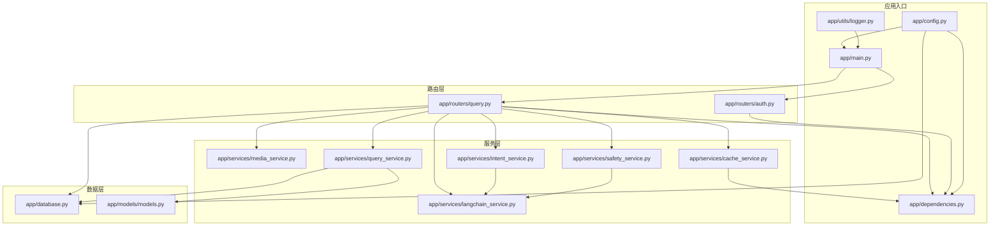
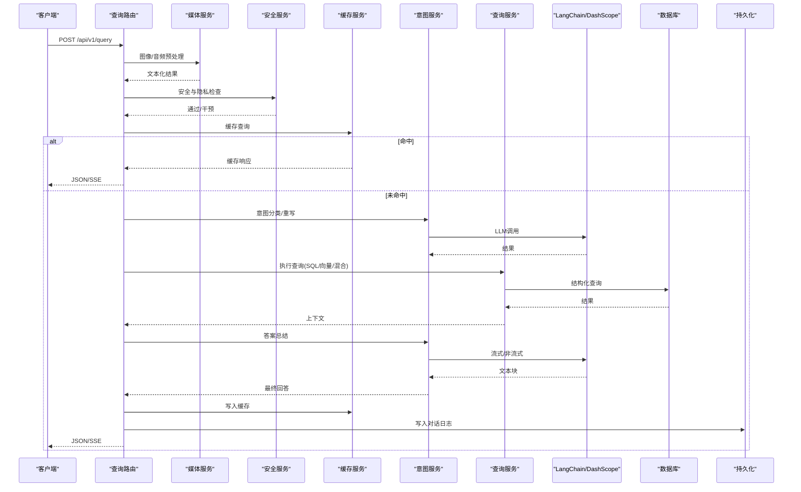
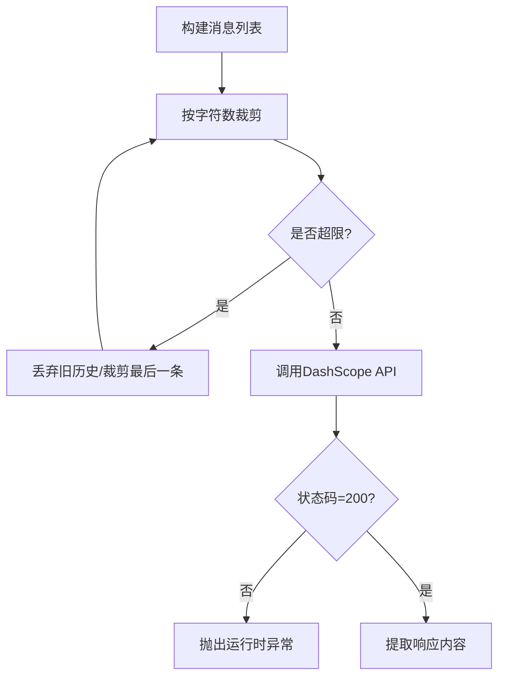
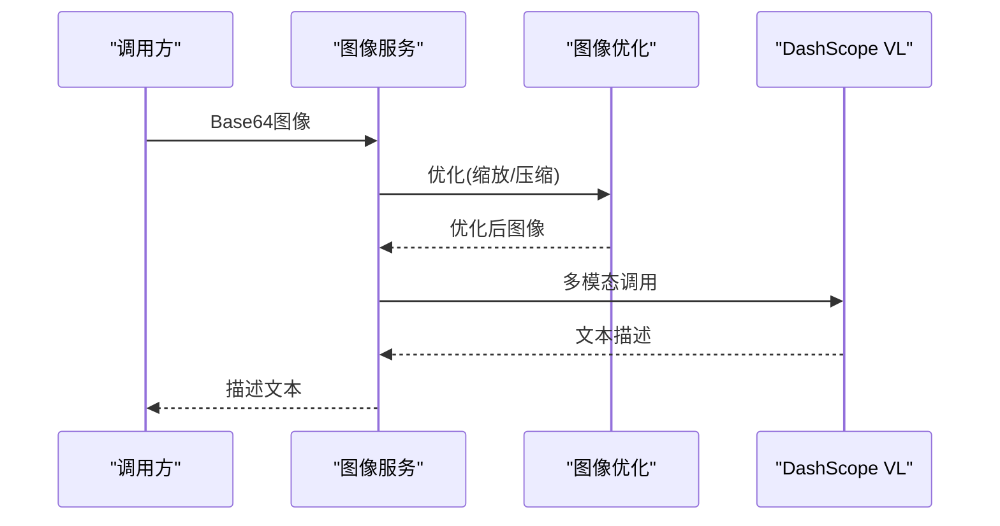
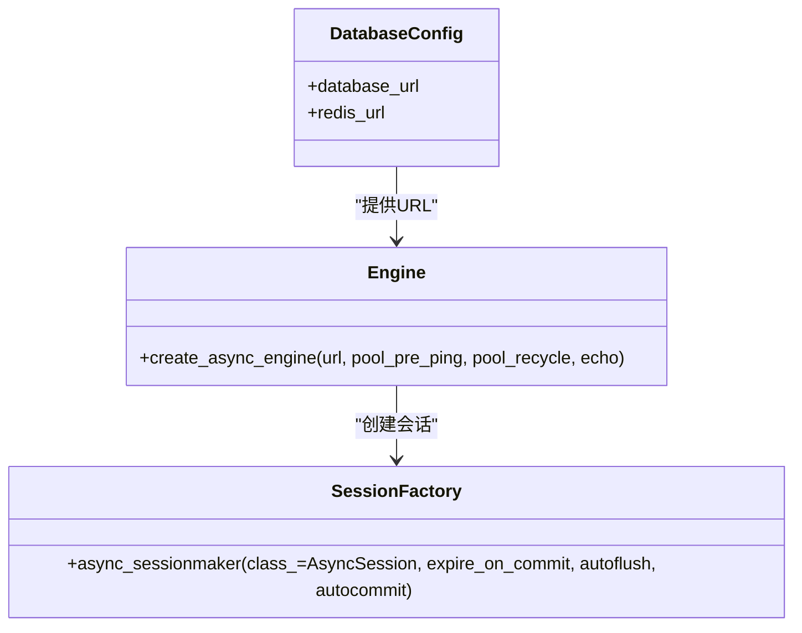
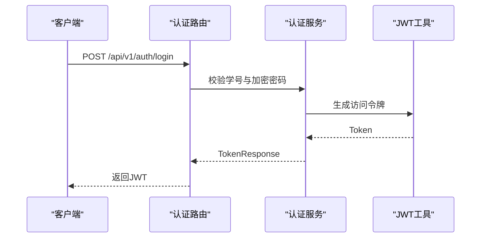
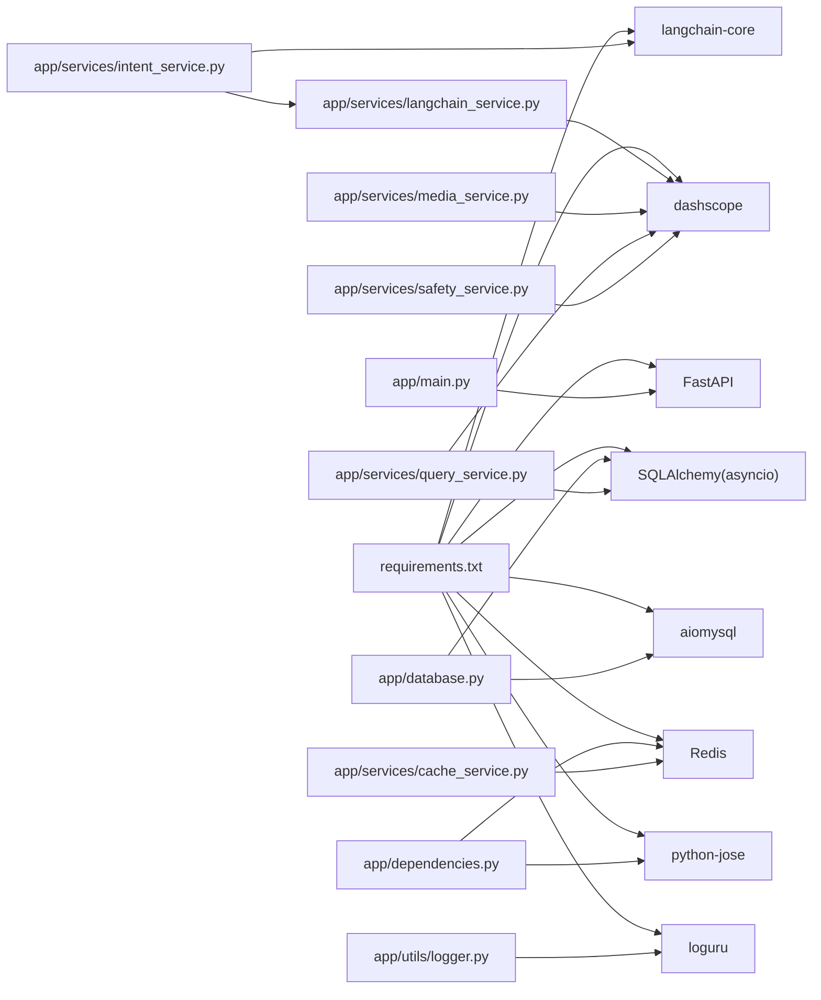

# 第三方服务集成

<cite>
**本文档引用的文件**
- [main.py](file://service/ai_assistant/app/main.py)
- [config.py](file://service/ai_assistant/app/config.py)
- [database.py](file://service/ai_assistant/app/database.py)
- [dependencies.py](file://service/ai_assistant/app/dependencies.py)
- [logger.py](file://service/ai_assistant/app/utils/logger.py)
- [requirements.txt](file://service/ai_assistant/requirements.txt)
- [langchain_service.py](file://service/ai_assistant/app/services/langchain_service.py)
- [media_service.py](file://service/ai_assistant/app/services/media_service.py)
- [query_service.py](file://service/ai_assistant/app/services/query_service.py)
- [intent_service.py](file://service/ai_assistant/app/services/intent_service.py)
- [safety_service.py](file://service/ai_assistant/app/services/safety_service.py)
- [cache_service.py](file://service/ai_assistant/app/services/cache_service.py)
- [models.py](file://service/ai_assistant/app/models/models.py)
- [query.py](file://service/ai_assistant/app/routers/query.py)
- [auth.py](file://service/ai_assistant/app/routers/auth.py)
</cite>

## 目录
1. [简介](#简介)
2. [项目结构](#项目结构)
3. [核心组件](#核心组件)
4. [架构总览](#架构总览)
5. [详细组件分析](#详细组件分析)
6. [依赖分析](#依赖分析)
7. [性能考虑](#性能考虑)
8. [故障排查指南](#故障排查指南)
9. [结论](#结论)
10. [附录](#附录)

## 简介
本文件面向AI校园助手项目的第三方服务集成，提供从AI模型服务适配、媒体处理服务扩展、数据库与ORM适配、认证体系接入到服务可用性检查与错误处理的完整指南。读者可据此快速对接新的AI模型、媒体服务、数据库与认证后端，同时掌握性能监控与稳定性保障要点。

## 项目结构
后端采用FastAPI应用，通过路由层聚合业务服务层，服务层封装第三方SDK与内部逻辑，数据层使用SQLAlchemy异步ORM，缓存层使用Redis，日志统一由Loguru落地。

图表来源
- [main.py:1-86](file://service/ai_assistant/app/main.py#L1-L86)
- [config.py:1-113](file://service/ai_assistant/app/config.py#L1-L113)
- [database.py:1-35](file://service/ai_assistant/app/database.py#L1-L35)
- [dependencies.py:1-109](file://service/ai_assistant/app/dependencies.py#L1-L109)
- [logger.py:1-53](file://service/ai_assistant/app/utils/logger.py#L1-L53)
- [query.py:1-788](file://service/ai_assistant/app/routers/query.py#L1-L788)
- [auth.py:1-102](file://service/ai_assistant/app/routers/auth.py#L1-L102)
- [langchain_service.py:1-278](file://service/ai_assistant/app/services/langchain_service.py#L1-L278)
- [media_service.py:1-246](file://service/ai_assistant/app/services/media_service.py#L1-L246)
- [intent_service.py:1-346](file://service/ai_assistant/app/services/intent_service.py#L1-L346)
- [query_service.py:1-800](file://service/ai_assistant/app/services/query_service.py#L1-L800)
- [safety_service.py:1-163](file://service/ai_assistant/app/services/safety_service.py#L1-L163)
- [cache_service.py:1-177](file://service/ai_assistant/app/services/cache_service.py#L1-L177)
- [models.py:1-660](file://service/ai_assistant/app/models/models.py#L1-L660)

章节来源
- [main.py:1-86](file://service/ai_assistant/app/main.py#L1-L86)
- [config.py:1-113](file://service/ai_assistant/app/config.py#L1-L113)

## 核心组件
- 配置中心：集中管理数据库、Redis、JWT、AES、DashScope、百炼检索、缓存TTL等配置项。
- 依赖注入：统一提供数据库会话、Redis客户端、JWT校验、管理员鉴权。
- 日志系统：控制台+文件双通道，统一落盘到logs目录。
- 路由层：查询与认证接口，串联各服务组件。
- 服务层：
  - LangChain适配：DashScope适配器，消息格式转换、调用与流式输出。
  - 媒体服务：图像理解、语音识别（ASR）封装，含图像压缩与音频转码。
  - 意图服务：基于LangChain的意图分类、查询重写、答案总结。
  - 查询服务：结构化SQL查询、知识库检索、混合检索与重排。
  - 安全服务：危险内容检测、隐私校验。
  - 缓存服务：基于Redis的查询缓存，含敏感度与跨天失效策略。
- 数据层：SQLAlchemy异步ORM，定义完整的校园实体关系模型。

章节来源
- [config.py:1-113](file://service/ai_assistant/app/config.py#L1-L113)
- [dependencies.py:1-109](file://service/ai_assistant/app/dependencies.py#L1-L109)
- [logger.py:1-53](file://service/ai_assistant/app/utils/logger.py#L1-L53)
- [query.py:1-788](file://service/ai_assistant/app/routers/query.py#L1-L788)
- [auth.py:1-102](file://service/ai_assistant/app/routers/auth.py#L1-L102)
- [langchain_service.py:1-278](file://service/ai_assistant/app/services/langchain_service.py#L1-L278)
- [media_service.py:1-246](file://service/ai_assistant/app/services/media_service.py#L1-L246)
- [intent_service.py:1-346](file://service/ai_assistant/app/services/intent_service.py#L1-L346)
- [query_service.py:1-800](file://service/ai_assistant/app/services/query_service.py#L1-L800)
- [safety_service.py:1-163](file://service/ai_assistant/app/services/safety_service.py#L1-L163)
- [cache_service.py:1-177](file://service/ai_assistant/app/services/cache_service.py#L1-L177)
- [models.py:1-660](file://service/ai_assistant/app/models/models.py#L1-L660)

## 架构总览
系统采用“路由-服务-数据”三层结构，查询主链路为：路由接收请求→媒体预处理→安全与隐私检查→缓存命中→意图分类→查询执行→答案总结→缓存写入→持久化日志。LangChain贯穿意图与总结，DashScope提供多模态与LLM能力，Redis提供会话历史与查询缓存，MySQL存储结构化数据。

图表来源
- [query.py:198-745](file://service/ai_assistant/app/routers/query.py#L198-L745)
- [media_service.py:115-246](file://service/ai_assistant/app/services/media_service.py#L115-L246)
- [safety_service.py:84-163](file://service/ai_assistant/app/services/safety_service.py#L84-L163)
- [cache_service.py:92-177](file://service/ai_assistant/app/services/cache_service.py#L92-L177)
- [intent_service.py:218-346](file://service/ai_assistant/app/services/intent_service.py#L218-L346)
- [query_service.py:1-800](file://service/ai_assistant/app/services/query_service.py#L1-L800)
- [langchain_service.py:139-278](file://service/ai_assistant/app/services/langchain_service.py#L139-L278)

## 详细组件分析

### LangChain适配器开发（DashScope）
- 作用：将LangChain消息格式转换为DashScope所需格式，封装非流式与流式调用，处理输入裁剪与代理配置。
- 关键点：
  - 消息格式转换：系统/人类/助手角色映射。
  - 输入裁剪：优先丢弃旧历史，最后裁剪最新消息，避免越界。
  - 代理控制：可禁用环境代理，防止意外转发。
  - 错误处理：非200状态抛出运行时异常，记录详细日志。
- 扩展建议：新增模型时在配置中增加模型名，确保温度、最大token等参数合理。

图表来源
- [langchain_service.py:46-203](file://service/ai_assistant/app/services/langchain_service.py#L46-L203)

章节来源
- [langchain_service.py:1-278](file://service/ai_assistant/app/services/langchain_service.py#L1-L278)
- [config.py:48-80](file://service/ai_assistant/app/config.py#L48-L80)

### 媒体处理服务集成（图像理解、语音识别）
- 图像理解：
  - 图像优化：按最大边缩放、转JPEG、压缩体积，避免超载。
  - DashScope多模态：data URL形式传参，调用图像理解模型。
  - 错误处理：API失败抛异常，记录错误日志。
- 语音识别（ASR）：
  - 音频转码：使用ffmpeg将Base64音频转为16kHz单声道WAV。
  - 临时文件：SDK需要文件路径，写入临时文件后调用识别。
  - 输出提取：兼容不同SDK输出结构，拼接句子文本。
  - 边界处理：无有效语音内容时主动报错，避免幻觉。
- 扩展建议：新增模型时在配置中更新模型名，确保输入参数与SDK版本匹配。

图表来源
- [media_service.py:115-156](file://service/ai_assistant/app/services/media_service.py#L115-L156)

章节来源
- [media_service.py:1-246](file://service/ai_assistant/app/services/media_service.py#L1-L246)
- [config.py:68-72](file://service/ai_assistant/app/config.py#L68-L72)

### 数据库服务集成（新数据库支持、ORM适配、连接池）
- 连接配置：通过配置中心提供数据库URL，支持主机、端口、用户、密码、库名、字符集。
- ORM适配：SQLAlchemy异步引擎与会话工厂，开启pre_ping与回收策略，支持调试输出。
- 连接池：异步会话工厂，避免自动提交/刷新，expire_on_commit=false。
- 新数据库支持步骤：
  - 在配置中新增数据库连接参数。
  - 在依赖注入中提供数据库会话生成器。
  - 在模型层定义实体关系，遵循现有约束与索引设计。
  - 在查询服务中使用异步会话执行SQL，注意隐私约束与权限控制。

图表来源
- [config.py:85-100](file://service/ai_assistant/app/config.py#L85-L100)
- [database.py:7-20](file://service/ai_assistant/app/database.py#L7-L20)

章节来源
- [config.py:19-100](file://service/ai_assistant/app/config.py#L19-L100)
- [database.py:1-35](file://service/ai_assistant/app/database.py#L1-L35)
- [models.py:1-660](file://service/ai_assistant/app/models/models.py#L1-L660)

### 认证服务集成（JWT、管理员认证）
- JWT认证：
  - 登录接口：接收学生ID与AES加密密码，签发JWT。
  - 依赖校验：Bearer Token解析与学生ID提取。
  - 安全配置：密钥、算法、过期时间在配置中集中管理。
- 管理员认证：
  - 管理员登录与权限校验，角色与状态枚举控制访问。
  - 依赖注入提供管理员用户对象，配合路由保护。
- OAuth/LDAP接入建议：
  - 新增认证方式时，扩展依赖注入中的令牌解析逻辑，保持与现有路由签名一致。
  - 在配置中新增必要参数（如客户端ID/密钥、端点、域等），并在依赖中按需读取。
  - 为新认证源提供统一的用户标识映射，确保与DID/会话隔离机制兼容。

图表来源
- [auth.py:24-52](file://service/ai_assistant/app/routers/auth.py#L24-L52)
- [dependencies.py:56-72](file://service/ai_assistant/app/dependencies.py#L56-L72)

章节来源
- [auth.py:1-102](file://service/ai_assistant/app/routers/auth.py#L1-L102)
- [dependencies.py:1-109](file://service/ai_assistant/app/dependencies.py#L1-L109)
- [config.py:32-43](file://service/ai_assistant/app/config.py#L32-L43)

### 服务可用性检查、错误处理与性能监控
- 可用性检查：
  - 启动时检查不安全默认配置，发出告警。
  - Redis连接池在生命周期结束时关闭，避免资源泄露。
  - 媒体服务与LLM调用均进行状态码校验与异常捕获。
- 错误处理：
  - LLM调用失败抛运行时异常，路由层转换为HTTP 502。
  - 媒体服务转换失败抛运行时异常，路由层转换为HTTP 502。
  - 安全服务降级：LLM失败时回退正则匹配。
- 性能监控：
  - 日志统一落盘，包含时间戳、级别、模块与行号。
  - 查询路由对SSE流进行节流日志输出，避免过度刷屏。
  - 缓存服务按敏感度设置TTL，跨天与课表版本失效策略降低陈旧缓存影响。

章节来源
- [main.py:25-49](file://service/ai_assistant/app/main.py#L25-L49)
- [logger.py:17-46](file://service/ai_assistant/app/utils/logger.py#L17-L46)
- [query.py:115-125](file://service/ai_assistant/app/routers/query.py#L115-L125)
- [cache_service.py:85-177](file://service/ai_assistant/app/services/cache_service.py#L85-L177)
- [safety_service.py:134-144](file://service/ai_assistant/app/services/safety_service.py#L134-L144)

## 依赖分析
- 外部依赖：FastAPI、SQLAlchemy异步、aiomysql、Redis、JWT、DashScope、LangChain Core、Loguru等。
- 内部耦合：路由层依赖服务层；服务层依赖配置与依赖注入；查询服务依赖模型与数据库；缓存服务依赖Redis；日志服务全局初始化。

图表来源
- [requirements.txt:1-22](file://service/ai_assistant/requirements.txt#L1-L22)
- [main.py:9-14](file://service/ai_assistant/app/main.py#L9-L14)
- [database.py:1-6](file://service/ai_assistant/app/database.py#L1-L6)
- [dependencies.py:1-18](file://service/ai_assistant/app/dependencies.py#L1-L18)
- [langchain_service.py:12-17](file://service/ai_assistant/app/services/langchain_service.py#L12-L17)
- [media_service.py:13-18](file://service/ai_assistant/app/services/media_service.py#L13-L18)
- [intent_service.py:13-21](file://service/ai_assistant/app/services/intent_service.py#L13-L21)
- [query_service.py:18-47](file://service/ai_assistant/app/services/query_service.py#L18-L47)
- [safety_service.py:6-10](file://service/ai_assistant/app/services/safety_service.py#L6-L10)
- [cache_service.py:16-18](file://service/ai_assistant/app/services/cache_service.py#L16-L18)
- [logger.py:11-11](file://service/ai_assistant/app/utils/logger.py#L11-L11)

章节来源
- [requirements.txt:1-22](file://service/ai_assistant/requirements.txt#L1-L22)

## 性能考虑
- 异步化：数据库与外部API调用均采用异步，避免阻塞事件循环。
- 连接池：数据库与Redis连接池复用，减少握手开销。
- 缓存策略：敏感/普通查询分别设置TTL，跨天与课表版本失效降低陈旧数据影响。
- 流式输出：SSE流式生成，尽早释放数据库连接，降低延迟。
- 输入裁剪：LangChain适配器对消息进行字符数裁剪，避免超限导致失败。

## 故障排查指南
- 启动告警：检查不安全默认配置，及时替换为强密钥。
- Redis异常：确认连接URL与凭据，查看生命周期关闭逻辑是否执行。
- LLM调用失败：检查API Key与模型名，查看状态码与消息，必要时启用代理忽略策略。
- 媒体处理失败：检查图像/音频编码与ffmpeg可用性，关注SDK版本差异。
- 安全检测异常：当LLM输出格式不符时，回退正则匹配，确保安全基线。
- 缓存命中异常：核对缓存键版本与meta字段，确认跨天与课表版本策略生效。

章节来源
- [main.py:25-49](file://service/ai_assistant/app/main.py#L25-L49)
- [dependencies.py:36-50](file://service/ai_assistant/app/dependencies.py#L36-L50)
- [langchain_service.py:183-200](file://service/ai_assistant/app/services/langchain_service.py#L183-L200)
- [media_service.py:100-113](file://service/ai_assistant/app/services/media_service.py#L100-L113)
- [safety_service.py:134-144](file://service/ai_assistant/app/services/safety_service.py#L134-L144)
- [cache_service.py:114-143](file://service/ai_assistant/app/services/cache_service.py#L114-L143)

## 结论
本项目提供了完善的第三方服务集成范式：LangChain适配器、媒体服务封装、数据库与ORM、认证体系、缓存与日志。按照本文档的扩展步骤与最佳实践，可稳定地接入新的AI模型、媒体服务、数据库与认证后端，并在生产环境中保持高可用与高性能。

## 附录
- 配置项速览：数据库、Redis、JWT、AES、DashScope、百炼检索、缓存TTL、模型名等。
- 依赖版本：FastAPI、SQLAlchemy异步、aiomysql、Redis、JWT、DashScope、LangChain Core、Loguru等。

章节来源
- [config.py:13-110](file://service/ai_assistant/app/config.py#L13-L110)
- [requirements.txt:1-22](file://service/ai_assistant/requirements.txt#L1-L22)