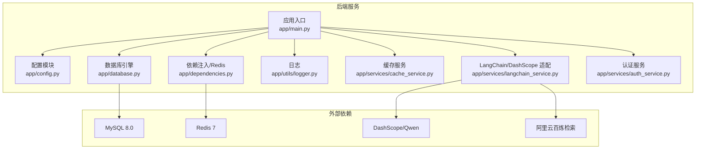
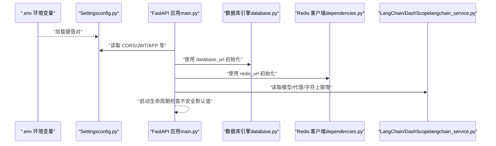
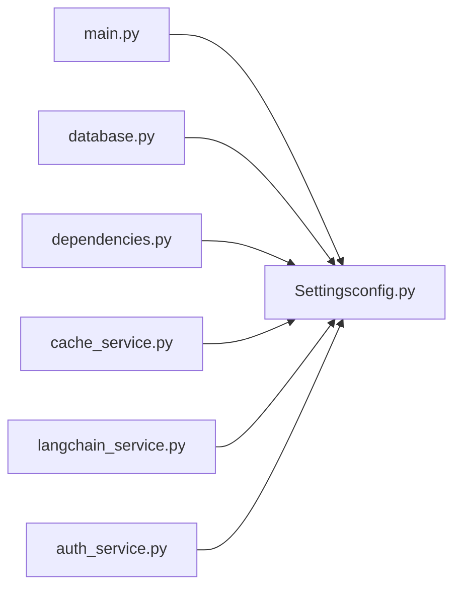

# 配置定制

<cite>
**本文引用的文件**
- [service/ai_assistant/app/config.py](file://service/ai_assistant/app/config.py)
- [service/ai_assistant/app/main.py](file://service/ai_assistant/app/main.py)
- [service/ai_assistant/app/database.py](file://service/ai_assistant/app/database.py)
- [service/ai_assistant/app/dependencies.py](file://service/ai_assistant/app/dependencies.py)
- [service/ai_assistant/app/utils/logger.py](file://service/ai_assistant/app/utils/logger.py)
- [service/ai_assistant/app/services/cache_service.py](file://service/ai_assistant/app/services/cache_service.py)
- [service/ai_assistant/app/services/langchain_service.py](file://service/ai_assistant/app/services/langchain_service.py)
- [service/ai_assistant/app/services/auth_service.py](file://service/ai_assistant/app/services/auth_service.py)
- [service/ai_assistant/docker-compose.yml](file://service/ai_assistant/docker-compose.yml)
- [service/ai_assistant/Dockerfile](file://service/ai_assistant/Dockerfile)
- [service/ai_assistant/requirements.txt](file://service/ai_assistant/requirements.txt)
- [service/ai_assistant/README.md](file://service/ai_assistant/README.md)
</cite>

## 目录
1. [简介](#简介)
2. [项目结构](#项目结构)
3. [核心组件](#核心组件)
4. [架构总览](#架构总览)
5. [详细组件分析](#详细组件分析)
6. [依赖分析](#依赖分析)
7. [性能考虑](#性能考虑)
8. [故障排查指南](#故障排查指南)
9. [结论](#结论)
10. [附录](#附录)

## 简介
本文件面向运维与开发人员，提供“AI校园助手”项目的配置定制指南。内容覆盖环境变量配置方法、配置文件结构与参数说明、生产与开发环境差异、运行时参数调整（模型参数、缓存策略、安全设置）、配置验证与常见错误排查，以及 Docker 环境下的最佳实践。目标是帮助你在不同环境下快速、安全地部署与优化系统。

## 项目结构
后端服务采用 FastAPI + SQLAlchemy AsyncIO + Redis + DashScope（阿里云百炼）的组合。配置集中于 Pydantic Settings，通过 .env 文件加载，应用在启动时校验不安全默认值并在运行时被各模块读取。

图表来源
- [service/ai_assistant/app/config.py:1-113](file://service/ai_assistant/app/config.py#L1-L113)
- [service/ai_assistant/app/main.py:1-86](file://service/ai_assistant/app/main.py#L1-L86)
- [service/ai_assistant/app/database.py:1-35](file://service/ai_assistant/app/database.py#L1-L35)
- [service/ai_assistant/app/dependencies.py:1-109](file://service/ai_assistant/app/dependencies.py#L1-L109)
- [service/ai_assistant/app/utils/logger.py:1-53](file://service/ai_assistant/app/utils/logger.py#L1-L53)
- [service/ai_assistant/app/services/cache_service.py:1-177](file://service/ai_assistant/app/services/cache_service.py#L1-L177)
- [service/ai_assistant/app/services/langchain_service.py:1-200](file://service/ai_assistant/app/services/langchain_service.py#L1-L200)
- [service/ai_assistant/app/services/auth_service.py:1-200](file://service/ai_assistant/app/services/auth_service.py#L1-L200)

章节来源
- [service/ai_assistant/app/config.py:1-113](file://service/ai_assistant/app/config.py#L1-L113)
- [service/ai_assistant/app/main.py:1-86](file://service/ai_assistant/app/main.py#L1-L86)
- [service/ai_assistant/README.md:1-230](file://service/ai_assistant/README.md#L1-L230)

## 核心组件
- 配置类 Settings：集中定义所有运行所需参数，支持从 .env 文件加载、UTF-8 编码、忽略未知字段。
- 应用入口 main：启动时检查不安全默认值，初始化日志，注册 CORS 与路由。
- 数据库引擎 database：基于 SQLAlchemy AsyncIO，使用 settings.database_url。
- 依赖注入 dependencies：提供 Redis 单例客户端，数据库会话依赖。
- 缓存服务 cache：基于 Redis，实现敏感/非敏感 TTL、日期敏感失效、课表版本失效。
- LLM 适配 langchain：对接 DashScope，受 settings 控制输入裁剪、代理信任、模型选择。
- 认证服务 auth：使用 JWT 算法、密钥与过期分钟数，生成/校验令牌。
- 日志 logger：统一输出到控制台与文件，支持旋转与保留期。
- Docker 与 Compose：提供 Redis 容器编排与运行时镜像构建。

章节来源
- [service/ai_assistant/app/config.py:1-113](file://service/ai_assistant/app/config.py#L1-L113)
- [service/ai_assistant/app/main.py:18-34](file://service/ai_assistant/app/main.py#L18-L34)
- [service/ai_assistant/app/database.py:7-20](file://service/ai_assistant/app/database.py#L7-L20)
- [service/ai_assistant/app/dependencies.py:36-50](file://service/ai_assistant/app/dependencies.py#L36-L50)
- [service/ai_assistant/app/services/cache_service.py:85-177](file://service/ai_assistant/app/services/cache_service.py#L85-L177)
- [service/ai_assistant/app/services/langchain_service.py:99-109](file://service/ai_assistant/app/services/langchain_service.py#L99-L109)
- [service/ai_assistant/app/services/auth_service.py:16-18](file://service/ai_assistant/app/services/auth_service.py#L16-L18)
- [service/ai_assistant/app/utils/logger.py:17-46](file://service/ai_assistant/app/utils/logger.py#L17-L46)

## 架构总览
下图展示配置在系统中的作用与流向：应用启动时读取 .env，Settings 提供统一配置；各模块按需使用配置进行连接与行为控制。

图表来源
- [service/ai_assistant/app/config.py:7-112](file://service/ai_assistant/app/config.py#L7-L112)
- [service/ai_assistant/app/main.py:18-62](file://service/ai_assistant/app/main.py#L18-L62)
- [service/ai_assistant/app/database.py:7-12](file://service/ai_assistant/app/database.py#L7-L12)
- [service/ai_assistant/app/dependencies.py:36-44](file://service/ai_assistant/app/dependencies.py#L36-L44)
- [service/ai_assistant/app/services/langchain_service.py:99-109](file://service/ai_assistant/app/services/langchain_service.py#L99-L109)

## 详细组件分析

### 配置文件结构与参数说明
- 应用程序
  - APP_NAME、APP_VERSION：应用名称与版本。
  - DEBUG：调试开关，影响数据库 echo。
  - CORS_ALLOW_ORIGINS：CORS 允许的来源列表，支持 "*"。
- 数据库（MySQL）
  - MYSQL_HOST、MYSQL_PORT、MYSQL_USER、MYSQL_PASSWORD、MYSQL_DATABASE：数据库连接参数。
  - database_url：由上述拼接而成，使用 aiomysql 与 utf8mb4。
- 缓存（Redis）
  - REDIS_HOST、REDIS_PORT、REDIS_PASSWORD、REDIS_DB：Redis 连接参数。
  - redis_url：根据是否提供密码拼接 URL。
- 安全与认证
  - JWT_SECRET_KEY、JWT_ALGORITHM、JWT_EXPIRE_MINUTES：JWT 密钥、算法与过期时间（分钟）。
  - AES_SECRET_KEY：传输加密密钥，需与前端 CryptoJS 保持一致。
  - DID_SALT：去标识化盐值。
- 对话上下文
  - MAX_HISTORY_COUNT：最大历史轮数。
- AI 服务（DashScope）
  - ALI_API_KEY：DashScope API Key。
  - DASHSCOPE_TRUST_ENV_PROXY：是否信任环境代理变量。
  - DASHSCOPE_MAX_INPUT_CHARS：消息总字符上限，超过将裁剪。
  - BAILIAN_APP_ID：百炼应用 ID。
- LLM 模型配置
  - LLM_MODEL_*：多类任务使用的模型名称（意图分类、查询改写、最终回答、工具规划、向量拆解、混合重排、安全检测、图像理解、语音识别）。
- 百炼检索
  - ALIBABA_CLOUD_ACCESS_KEY_ID、ALIBABA_CLOUD_ACCESS_KEY_SECRET、BAILIAN_WORKSPACE_ID、BAILIAN_INDEX_ID、BAILIAN_ENDPOINT：百炼检索所需凭据与端点。
- 缓存 TTL（秒）
  - CACHE_TTL_SENSITIVE、CACHE_TTL_NORMAL：敏感/普通查询的缓存过期时间。

章节来源
- [service/ai_assistant/app/config.py:13-112](file://service/ai_assistant/app/config.py#L13-L112)

### 开发环境与生产环境配置示例
- 开发环境要点
  - CORS_ALLOW_ORIGINS：允许前端开发地址（如本地 Vite 默认端口）。
  - DEBUG：开启便于观察 SQL 与日志。
  - 数据库与 Redis：指向本地或容器（Compose 启动 Redis）。
  - JWT/AES/DID：可使用默认值进行本地联调，但务必在生产替换。
- 生产环境要点
  - CORS_ALLOW_ORIGINS：限制为正式域名。
  - HTTPS 与反向代理：建议使用 Nginx/Caddy 并开启 SSE 透传。
  - 安全：替换所有不安全默认值；严格最小权限访问数据库与 Redis。
  - 缓存与日志：合理设置 TTL 与日志保留周期。

章节来源
- [service/ai_assistant/app/main.py:66-76](file://service/ai_assistant/app/main.py#L66-L76)
- [service/ai_assistant/README.md:47-105](file://service/ai_assistant/README.md#L47-L105)

### 运行时配置调整指南
- 模型参数
  - 通过 LLM_MODEL_* 系列键切换不同任务的模型，建议在生产中统一评估成本与效果后再调整。
- 缓存策略
  - 通过 CACHE_TTL_SENSITIVE 与 CACHE_TTL_NORMAL 控制敏感与普通查询的缓存时长。
  - 日期敏感与课表敏感查询会在特定条件下强制失效，避免陈旧语义。
- 安全设置
  - JWT_SECRET_KEY 必须强随机且保密；过期时间按业务需求调整。
  - AES_SECRET_KEY 需与前端一致，且妥善保管。
  - DID_SALT 用于去标识化，建议定期轮换。
- LLM 输入裁剪
  - DASHSCOPE_MAX_INPUT_CHARS 控制消息总长度，超限将按策略裁剪。

章节来源
- [service/ai_assistant/app/services/cache_service.py:85-177](file://service/ai_assistant/app/services/cache_service.py#L85-L177)
- [service/ai_assistant/app/services/langchain_service.py:139-200](file://service/ai_assistant/app/services/langchain_service.py#L139-L200)
- [service/ai_assistant/app/services/auth_service.py:16-18](file://service/ai_assistant/app/services/auth_service.py#L16-L18)

### 配置验证方法
- 启动时安全检查
  - 应用启动会检测若干关键配置是否仍为不安全默认值，触发告警并输出警告信息。
- 日志验证
  - 使用统一日志模块，确认 INFO/DEBUG 输出正常，文件落盘路径正确。
- 数据库与缓存连通性
  - 通过数据库引擎初始化与 Redis 客户端单例初始化进行连通性验证。
- LLM 调用验证
  - 发送一次最小化查询，观察是否返回状态码 200 且包含预期字段。

章节来源
- [service/ai_assistant/app/main.py:25-34](file://service/ai_assistant/app/main.py#L25-L34)
- [service/ai_assistant/app/utils/logger.py:17-46](file://service/ai_assistant/app/utils/logger.py#L17-L46)
- [service/ai_assistant/app/database.py:7-12](file://service/ai_assistant/app/database.py#L7-L12)
- [service/ai_assistant/app/dependencies.py:36-44](file://service/ai_assistant/app/dependencies.py#L36-L44)
- [service/ai_assistant/app/services/langchain_service.py:183-200](file://service/ai_assistant/app/services/langchain_service.py#L183-L200)

### 常见配置错误与解决方案
- CORS 问题
  - 现象：浏览器跨域报错。
  - 排查：确认 CORS_ALLOW_ORIGINS 是否包含前端地址，生产环境不应使用 "*"。
- 数据库连接失败
  - 现象：启动时报数据库连接异常。
  - 排查：核对 MYSQL_HOST/PORT/USER/PASSWORD/DATABASE；确认网络可达与字符集设置。
- Redis 连接失败
  - 现象：缓存读写异常。
  - 排查：核对 REDIS_HOST/PORT/PASSWORD/DB；确认容器/网络连通。
- JWT 不生效或过期异常
  - 现象：登录后接口 401。
  - 排查：确认 JWT_SECRET_KEY 一致且未使用默认值；检查 JWT_EXPIRE_MINUTES 设置。
- AES 不一致导致登录失败
  - 现象：前端加密与后端解密不匹配。
  - 排查：前后端 AES_SECRET_KEY 必须完全一致。
- LLM 输入超限
  - 现象：调用失败或被裁剪。
  - 排查：降低上下文长度或提高 DASHSCOPE_MAX_INPUT_CHARS（注意平台限制）。
- 代理干扰
  - 现象：网络请求走代理导致异常。
  - 排查：根据 DASHSCOPE_TRUST_ENV_PROXY 的含义决定是否信任环境代理。

章节来源
- [service/ai_assistant/app/main.py:66-76](file://service/ai_assistant/app/main.py#L66-L76)
- [service/ai_assistant/app/database.py:7-12](file://service/ai_assistant/app/database.py#L7-L12)
- [service/ai_assistant/app/dependencies.py:36-44](file://service/ai_assistant/app/dependencies.py#L36-L44)
- [service/ai_assistant/app/services/auth_service.py:16-18](file://service/ai_assistant/app/services/auth_service.py#L16-L18)
- [service/ai_assistant/app/services/langchain_service.py:99-109](file://service/ai_assistant/app/services/langchain_service.py#L99-L109)

### Docker 环境下的配置管理最佳实践
- 使用 docker-compose 启动 Redis
  - 通过环境变量传递 REDIS_PASSWORD，设置 maxmemory 与淘汰策略，启用健康检查。
- 构建与运行
  - 使用分阶段 Dockerfile，加速包安装与运行时依赖；暴露 8000 端口。
- 环境变量注入
  - 将 .env 中的关键配置映射到容器环境变量，避免硬编码在镜像中。
- 健康检查与日志
  - 为 Redis 添加健康检查；后端服务日志落盘到卷，便于排查。

章节来源
- [service/ai_assistant/docker-compose.yml:1-31](file://service/ai_assistant/docker-compose.yml#L1-L31)
- [service/ai_assistant/Dockerfile:1-49](file://service/ai_assistant/Dockerfile#L1-L49)
- [service/ai_assistant/requirements.txt:1-22](file://service/ai_assistant/requirements.txt#L1-L22)

## 依赖分析
- 配置依赖
  - main 依赖 settings 的 CORS、JWT、APP 名称与版本。
  - database 依赖 settings.database_url。
  - dependencies 依赖 settings.redis_url。
  - cache 依赖 settings.CACHE_TTL_*。
  - langchain 依赖 settings.ALI_API_KEY、DASHSCOPE_MAX_INPUT_CHARS、DASHSCOPE_TRUST_ENV_PROXY。
  - auth 依赖 settings.JWT_SECRET_KEY、JWT_ALGORITHM、JWT_EXPIRE_MINUTES。
- 外部依赖
  - MySQL 通过 aiomysql 驱动连接。
  - Redis 通过 aioredis 连接。
  - DashScope 与百炼检索通过对应 SDK/HTTP 客户端调用。

图表来源
- [service/ai_assistant/app/config.py:1-113](file://service/ai_assistant/app/config.py#L1-L113)
- [service/ai_assistant/app/main.py:12-14](file://service/ai_assistant/app/main.py#L12-L14)
- [service/ai_assistant/app/database.py:5-6](file://service/ai_assistant/app/database.py#L5-L6)
- [service/ai_assistant/app/dependencies.py:13-14](file://service/ai_assistant/app/dependencies.py#L13-L14)
- [service/ai_assistant/app/services/cache_service.py:18](file://service/ai_assistant/app/services/cache_service.py#L18)
- [service/ai_assistant/app/services/langchain_service.py:16](file://service/ai_assistant/app/services/langchain_service.py#L16)
- [service/ai_assistant/app/services/auth_service.py:11](file://service/ai_assistant/app/services/auth_service.py#L11)

章节来源
- [service/ai_assistant/app/config.py:1-113](file://service/ai_assistant/app/config.py#L1-L113)
- [service/ai_assistant/app/main.py:12-14](file://service/ai_assistant/app/main.py#L12-L14)
- [service/ai_assistant/app/database.py:5-6](file://service/ai_assistant/app/database.py#L5-L6)
- [service/ai_assistant/app/dependencies.py:13-14](file://service/ai_assistant/app/dependencies.py#L13-L14)
- [service/ai_assistant/app/services/cache_service.py:18](file://service/ai_assistant/app/services/cache_service.py#L18)
- [service/ai_assistant/app/services/langchain_service.py:16](file://service/ai_assistant/app/services/langchain_service.py#L16)
- [service/ai_assistant/app/services/auth_service.py:11](file://service/ai_assistant/app/services/auth_service.py#L11)

## 性能考虑
- 缓存策略
  - 敏感查询短 TTL，普通查询长 TTL，减少重复 LLM 调用与数据库压力。
  - 日期敏感与课表敏感查询按版本或日期强制失效，避免缓存污染。
- 数据库连接池
  - 使用 pre_ping 与 recycle 降低连接失效带来的重试开销。
- LLM 输入裁剪
  - 合理设置 DASHSCOPE_MAX_INPUT_CHARS，避免超限导致的多次往返与失败重试。
- 日志与监控
  - DEBUG 开启仅限开发；生产使用 INFO 并落盘，避免频繁 IO。

章节来源
- [service/ai_assistant/app/services/cache_service.py:85-177](file://service/ai_assistant/app/services/cache_service.py#L85-L177)
- [service/ai_assistant/app/database.py:7-12](file://service/ai_assistant/app/database.py#L7-L12)
- [service/ai_assistant/app/services/langchain_service.py:139-200](file://service/ai_assistant/app/services/langchain_service.py#L139-L200)
- [service/ai_assistant/app/utils/logger.py:28-43](file://service/ai_assistant/app/utils/logger.py#L28-L43)

## 故障排查指南
- 启动阶段
  - 若出现不安全默认值告警，立即在 .env 中替换对应密钥与盐值。
- 连接阶段
  - 数据库：确认主机、端口、用户、密码、数据库存在且字符集匹配。
  - Redis：确认密码、端口、DB 正确，容器健康检查通过。
- 认证阶段
  - JWT：确认密钥一致、算法与过期时间设置合理。
  - AES：前后端密钥一致，避免因加密不匹配导致登录失败。
- LLM 阶段
  - API Key 有效且有额度；代理设置与字符上限符合预期。
- 日志定位
  - 检查 logs 目录下的运行日志，关注 ERROR/WARNING 级别信息。

章节来源
- [service/ai_assistant/app/main.py:25-34](file://service/ai_assistant/app/main.py#L25-L34)
- [service/ai_assistant/app/database.py:7-12](file://service/ai_assistant/app/database.py#L7-L12)
- [service/ai_assistant/app/dependencies.py:36-44](file://service/ai_assistant/app/dependencies.py#L36-L44)
- [service/ai_assistant/app/services/auth_service.py:16-18](file://service/ai_assistant/app/services/auth_service.py#L16-L18)
- [service/ai_assistant/app/services/langchain_service.py:183-200](file://service/ai_assistant/app/services/langchain_service.py#L183-L200)
- [service/ai_assistant/app/utils/logger.py:17-46](file://service/ai_assistant/app/utils/logger.py#L17-L46)

## 结论
通过集中化的 Settings 与 .env 管理，系统实现了清晰的配置边界与可移植性。建议在生产中严格替换不安全默认值、限制 CORS、启用 HTTPS、合理设置缓存与日志，并结合 Docker 容器化与健康检查保障稳定性。按本文档的验证与排障流程，可快速定位并解决大多数配置相关问题。

## 附录
- 环境变量清单与用途概览
  - 应用与安全：APP_NAME、APP_VERSION、DEBUG、CORS_ALLOW_ORIGINS、JWT_SECRET_KEY、JWT_ALGORITHM、JWT_EXPIRE_MINUTES、AES_SECRET_KEY、DID_SALT。
  - 数据库：MYSQL_HOST、MYSQL_PORT、MYSQL_USER、MYSQL_PASSWORD、MYSQL_DATABASE。
  - 缓存：REDIS_HOST、REDIS_PORT、REDIS_PASSWORD、REDIS_DB。
  - AI 与模型：ALI_API_KEY、DASHSCOPE_TRUST_ENV_PROXY、DASHSCOPE_MAX_INPUT_CHARS、BAILIAN_APP_ID、LLM_MODEL_*。
  - 百炼检索：ALIBABA_CLOUD_ACCESS_KEY_ID、ALIBABA_CLOUD_ACCESS_KEY_SECRET、BAILIAN_WORKSPACE_ID、BAILIAN_INDEX_ID、BAILIAN_ENDPOINT。
  - 缓存 TTL：CACHE_TTL_SENSITIVE、CACHE_TTL_NORMAL。
- 参考部署与 API
  - 部署与 HTTPS 反向代理参考：[README.md:47-105](file://service/ai_assistant/README.md#L47-L105)。
  - 主要 API：认证、查询、健康检查、版本信息参考：[README.md:206-230](file://service/ai_assistant/README.md#L206-L230)。