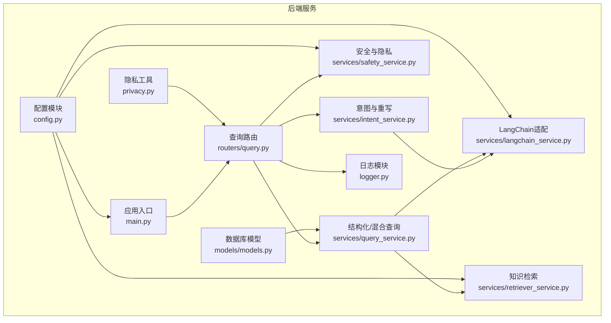
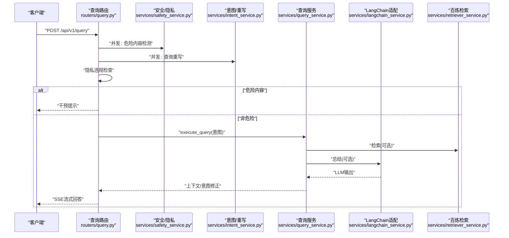
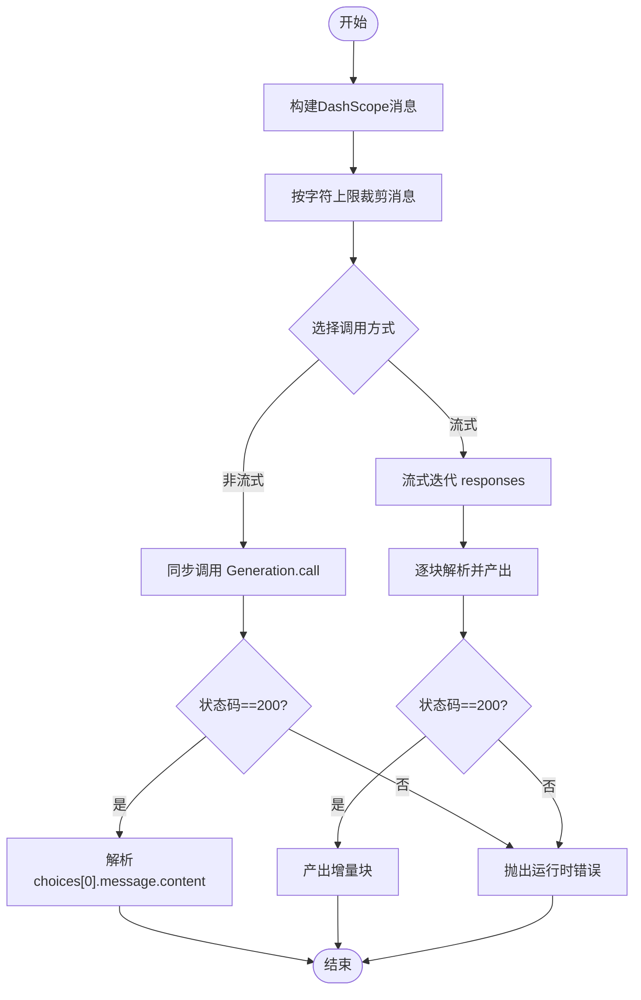
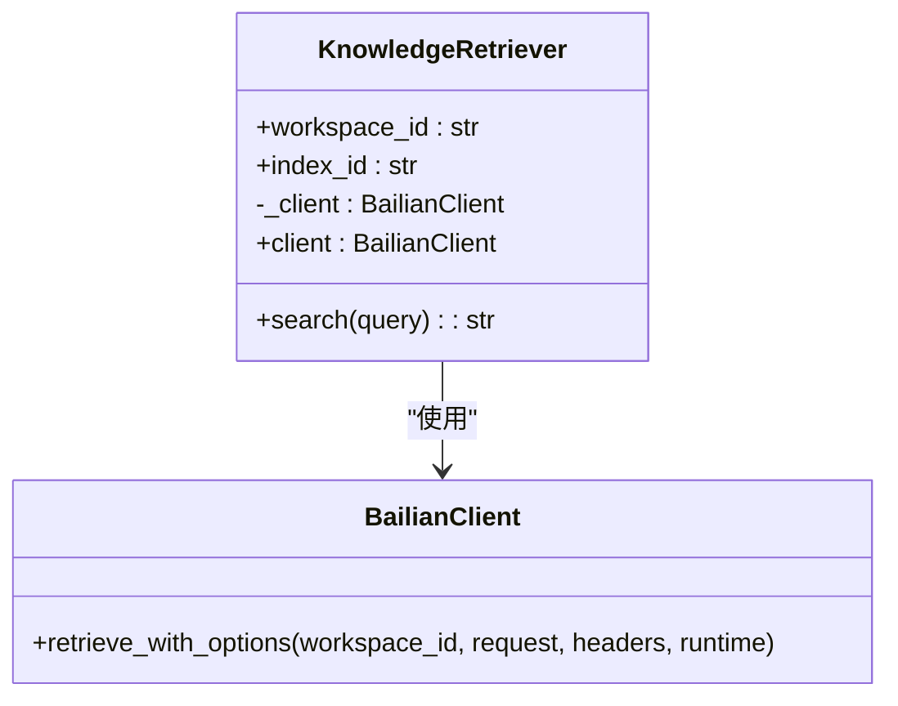
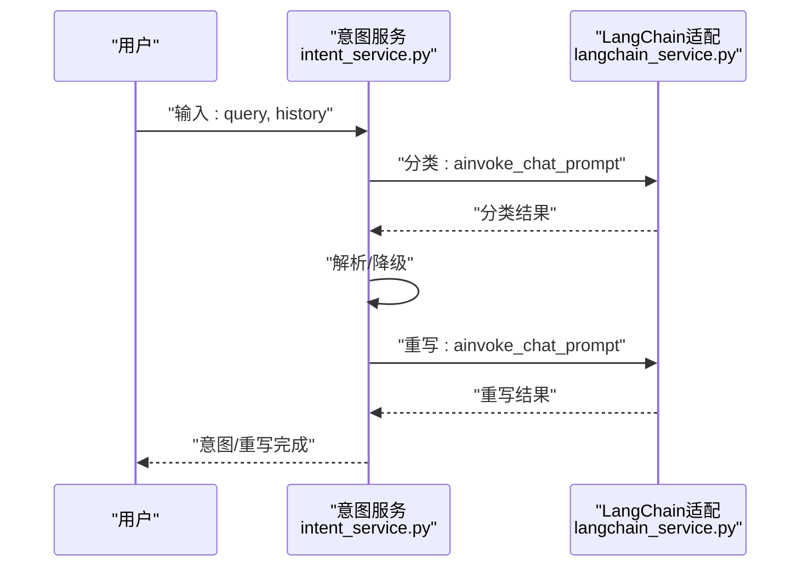
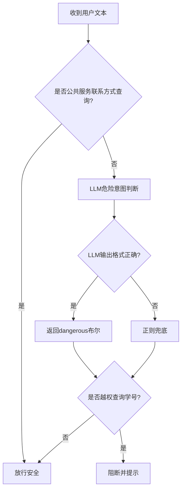
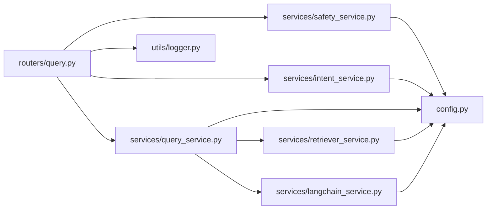

# AI服务问题

<cite>
**本文引用的文件**
- [config.py](file://service/ai_assistant/app/config.py)
- [langchain_service.py](file://service/ai_assistant/app/services/langchain_service.py)
- [intent_service.py](file://service/ai_assistant/app/services/intent_service.py)
- [safety_service.py](file://service/ai_assistant/app/services/safety_service.py)
- [retriever_service.py](file://service/ai_assistant/app/services/retriever_service.py)
- [query_service.py](file://service/ai_assistant/app/services/query_service.py)
- [query.py](file://service/ai_assistant/app/routers/query.py)
- [models.py](file://service/ai_assistant/app/models/models.py)
- [logger.py](file://service/ai_assistant/app/utils/logger.py)
- [privacy.py](file://service/ai_assistant/app/utils/privacy.py)
- [main.py](file://service/ai_assistant/app/main.py)
- [requirements.txt](file://service/ai_assistant/requirements.txt)
- [README.md](file://README.md)
</cite>

## 目录
1. [简介](#简介)
2. [项目结构](#项目结构)
3. [核心组件](#核心组件)
4. [架构总览](#架构总览)
5. [详细组件分析](#详细组件分析)
6. [依赖分析](#依赖分析)
7. [性能考虑](#性能考虑)
8. [故障排除指南](#故障排除指南)
9. [结论](#结论)
10. [附录](#附录)

## 简介
本指南聚焦于AI校园助手项目中AI服务集成的常见问题与排查方法，覆盖DashScope（阿里云百炼）与百炼检索（Bailian）两大外部服务，涵盖API密钥配置、请求格式、响应解析、LangChain链式调用与事件流处理、意图分类与查询重写异常、内容安全与隐私保护、服务降级与容错、以及监控与性能评估。文档面向开发者与运维人员，提供可操作的诊断步骤与优化建议。

## 项目结构
后端采用FastAPI + SQLAlchemy异步ORM + Redis缓存 + LangChain + DashScope/Qwen + 百炼检索的组合。核心服务模块包括：
- 配置与环境：集中于配置类，统一读取.env并暴露数据库、Redis、DashScope、百炼检索等参数
- 服务层：LangChain适配、意图分类与重写、安全与隐私、知识检索、结构化查询与混合检索
- 路由层：统一查询端点，负责多模态输入、并发安全检查、缓存、意图路由、链式调用与SSE流式输出
- 工具与模型：日志、隐私DID生成、数据库模型定义

图表来源
- [main.py:1-86](file://service/ai_assistant/app/main.py#L1-L86)
- [query.py:1-788](file://service/ai_assistant/app/routers/query.py#L1-L788)
- [config.py:1-113](file://service/ai_assistant/app/config.py#L1-L113)
- [langchain_service.py:1-278](file://service/ai_assistant/app/services/langchain_service.py#L1-L278)
- [intent_service.py:1-346](file://service/ai_assistant/app/services/intent_service.py#L1-L346)
- [safety_service.py:1-163](file://service/ai_assistant/app/services/safety_service.py#L1-L163)
- [retriever_service.py:1-168](file://service/ai_assistant/app/services/retriever_service.py#L1-L168)
- [query_service.py:1-800](file://service/ai_assistant/app/services/query_service.py#L1-L800)
- [models.py:1-660](file://service/ai_assistant/app/models/models.py#L1-L660)
- [logger.py:1-53](file://service/ai_assistant/app/utils/logger.py#L1-L53)
- [privacy.py:1-23](file://service/ai_assistant/app/utils/privacy.py#L1-L23)

章节来源
- [README.md:1-104](file://README.md#L1-L104)
- [requirements.txt:1-22](file://service/ai_assistant/requirements.txt#L1-L22)

## 核心组件
- 配置与密钥
  - DashScope与百炼检索密钥、工作空间与索引ID、模型名称、输入长度限制、CORS与缓存TTL等均在配置类中集中管理
- LangChain适配
  - 将DashScope调用封装为LangChain兼容的消息构建、调用与流式输出，内置输入裁剪与代理控制
- 意图分类与查询重写
  - 基于系统提示词的分类器与重写器，支持链式调用与降级回退
- 安全与隐私
  - LLM安全检测与正则兜底、隐私违规检测（学号越权）、DID脱敏
- 知识检索
  - 百炼检索客户端封装，统一响应结构与异常处理
- 结构化/混合查询
  - 基于SQL与检索结果的混合上下文，提供重排与总结
- 路由与SSE
  - 统一查询端点，支持并发任务、缓存、历史会话、SSE流式输出与错误映射

章节来源
- [config.py:48-113](file://service/ai_assistant/app/config.py#L48-L113)
- [langchain_service.py:128-278](file://service/ai_assistant/app/services/langchain_service.py#L128-L278)
- [intent_service.py:218-346](file://service/ai_assistant/app/services/intent_service.py#L218-L346)
- [safety_service.py:84-163](file://service/ai_assistant/app/services/safety_service.py#L84-L163)
- [retriever_service.py:23-168](file://service/ai_assistant/app/services/retriever_service.py#L23-L168)
- [query_service.py:212-238](file://service/ai_assistant/app/services/query_service.py#L212-L238)
- [query.py:198-788](file://service/ai_assistant/app/routers/query.py#L198-L788)

## 架构总览
系统通过FastAPI路由接收请求，执行安全与隐私检查，随后并发进行意图重写与危险内容检测，再根据意图路由到结构化查询、向量检索或混合路径，最终由LangChain总结器生成回答并通过SSE流式返回。

图表来源
- [query.py:347-745](file://service/ai_assistant/app/routers/query.py#L347-L745)
- [safety_service.py:84-163](file://service/ai_assistant/app/services/safety_service.py#L84-L163)
- [intent_service.py:218-296](file://service/ai_assistant/app/services/intent_service.py#L218-L296)
- [query_service.py:212-238](file://service/ai_assistant/app/services/query_service.py#L212-L238)
- [langchain_service.py:139-278](file://service/ai_assistant/app/services/langchain_service.py#L139-L278)
- [retriever_service.py:46-135](file://service/ai_assistant/app/services/retriever_service.py#L46-L135)

## 详细组件分析

### DashScope与LangChain集成（适配器）
- 输入裁剪与代理控制
  - 依据最大输入字符限制对消息进行优先丢弃旧历史与尾部截断，避免超出模型限制
  - 可选择忽略环境代理变量，避免意外代理转发
- 非流式与流式调用
  - 非流式：同步调用后解析响应，状态码非200时抛出运行时错误
  - 流式：增量输出块，逐块解析并记录进度，遇到非200状态同样抛出运行时错误
- 日志与可观测性
  - 记录调用前后的字符统计、块数量、状态码与错误详情

图表来源
- [langchain_service.py:139-278](file://service/ai_assistant/app/services/langchain_service.py#L139-L278)

章节来源
- [langchain_service.py:46-278](file://service/ai_assistant/app/services/langchain_service.py#L46-L278)
- [config.py:48-52](file://service/ai_assistant/app/config.py#L48-L52)

### 百炼检索（向量检索）服务
- 客户端初始化
  - 通过配置类读取AccessKey与Endpoint，懒加载客户端实例
- 检索与响应归一化
  - 统一处理SDK返回体，兼容不同版本字段命名
  - 成功标志以“Success”或“Code==Success”为准
  - 过滤过短文本块，拼接为上下文
- 异常处理
  - 任一异常或空结果均返回“未在知识库中找到相关信息”，避免上游崩溃

图表来源
- [retriever_service.py:23-168](file://service/ai_assistant/app/services/retriever_service.py#L23-L168)

章节来源
- [retriever_service.py:46-135](file://service/ai_assistant/app/services/retriever_service.py#L46-L135)
- [config.py:74-80](file://service/ai_assistant/app/config.py#L74-L80)

### 意图分类与查询重写
- 意图分类
  - 使用系统提示词限定输出集合，链式调用后解析结果，异常时降级为向量意图
- 查询重写
  - 结合最近N轮历史，补齐缺失信息，异常时回退原查询并截断过长输出
- 总结与流式
  - 构建总结提示词与裁剪上下文，支持非流式与流式两种输出

图表来源
- [intent_service.py:218-296](file://service/ai_assistant/app/services/intent_service.py#L218-L296)
- [langchain_service.py:139-204](file://service/ai_assistant/app/services/langchain_service.py#L139-L204)

章节来源
- [intent_service.py:218-346](file://service/ai_assistant/app/services/intent_service.py#L218-L346)
- [config.py:54-73](file://service/ai_assistant/app/config.py#L54-L73)

### 安全与隐私保护
- 危险内容检测
  - LLM判断 + 正则兜底，格式异常回退正则；调用失败回退正则
- 隐私违规检测
  - 学号越权查询检测，发现后阻断并返回提示
- 隐私标识
  - 使用DID对真实学号进行脱敏存储与关联

图表来源
- [safety_service.py:84-163](file://service/ai_assistant/app/services/safety_service.py#L84-L163)
- [privacy.py:9-23](file://service/ai_assistant/app/utils/privacy.py#L9-L23)

章节来源
- [safety_service.py:84-163](file://service/ai_assistant/app/services/safety_service.py#L84-L163)
- [privacy.py:9-23](file://service/ai_assistant/app/utils/privacy.py#L9-L23)

### 结构化/混合查询与重排
- 工具规划与执行
  - 基于意图与显式学期ID规划工具调用，执行SQL查询并翻译字段名
- 向量检索与重排
  - 使用百炼检索获取候选，结合系统提示词进行去重与重排
- 上下文组装与总结
  - 将结构化与向量结果合并，裁剪后交由总结器生成最终回答

章节来源
- [query_service.py:150-238](file://service/ai_assistant/app/services/query_service.py#L150-L238)
- [query_service.py:575-800](file://service/ai_assistant/app/services/query_service.py#L575-L800)

### 路由与SSE流式输出
- 并发任务
  - 安全检查与查询重写并发执行，提升整体吞吐
- 缓存与历史
  - Redis缓存命中直接返回；历史按会话隔离存储
- 错误映射
  - 将内部错误映射为友好提示，避免泄露细节
- 流式输出
  - SSE分块推送，最后一条携带意图、耗时与缓存状态

章节来源
- [query.py:347-745](file://service/ai_assistant/app/routers/query.py#L347-L745)

## 依赖分析
- 外部依赖
  - DashScope SDK、百炼检索SDK、LangChain Core、Redis、FastAPI、SQLAlchemy异步等
- 内部耦合
  - 路由层依赖安全、意图、查询、缓存与日志；服务层依赖配置与日志；检索服务依赖百炼SDK；LangChain适配依赖DashScope

图表来源
- [query.py:35-44](file://service/ai_assistant/app/routers/query.py#L35-L44)
- [requirements.txt:13-22](file://service/ai_assistant/requirements.txt#L13-L22)

章节来源
- [requirements.txt:1-22](file://service/ai_assistant/requirements.txt#L1-L22)

## 性能考虑
- 输入裁剪与上下文压缩
  - 通过消息裁剪与上下文截断减少LLM输入，提高稳定性与速度
- 并发与异步
  - 安全检查与重写并发执行；数据库连接在流式阶段及时释放
- 缓存策略
  - 高敏感与普通查询分别设置TTL，命中后直接返回
- SSE优化
  - 禁用缓冲、保持连接，避免反向代理对流式输出的干扰

章节来源
- [langchain_service.py:46-96](file://service/ai_assistant/app/services/langchain_service.py#L46-L96)
- [query.py:654-745](file://service/ai_assistant/app/routers/query.py#L654-L745)

## 故障排除指南

### 一、DashScope（阿里云百炼）集成问题
- API密钥配置错误
  - 症状：调用返回非200状态码或抛出运行时错误
  - 排查：确认配置类中的密钥字段是否正确加载；检查环境变量文件路径与编码
  - 解决：在环境文件中设置正确的密钥，重启服务
  - 参考
    - [config.py:48-52](file://service/ai_assistant/app/config.py#L48-L52)
    - [langchain_service.py:169-200](file://service/ai_assistant/app/services/langchain_service.py#L169-L200)
- 请求格式错误
  - 症状：模型输入超限或消息结构异常
  - 排查：查看消息裁剪统计与日志；确认提示词模板与变量渲染
  - 解决：调整提示词长度或减少历史消息；确保消息角色与内容类型正确
  - 参考
    - [langchain_service.py:149-167](file://service/ai_assistant/app/services/langchain_service.py#L149-L167)
    - [langchain_service.py:206-278](file://service/ai_assistant/app/services/langchain_service.py#L206-L278)
- 响应解析失败
  - 症状：流式输出中断或空结果
  - 排查：检查状态码与输出结构；关注日志中的错误信息
  - 解决：修复上游提示词或参数；必要时降级为非流式调用
  - 参考
    - [langchain_service.py:252-277](file://service/ai_assistant/app/services/langchain_service.py#L252-L277)

### 二、百炼检索（向量检索）问题
- 认证失败或参数缺失
  - 症状：检索返回“未知错误”或空结果
  - 排查：核对工作空间ID、索引ID、AccessKey与Endpoint；检查SDK版本差异
  - 解决：在配置中补齐缺失项；升级或切换SDK版本
  - 参考
    - [retriever_service.py:36-44](file://service/ai_assistant/app/services/retriever_service.py#L36-L44)
    - [retriever_service.py:84-96](file://service/ai_assistant/app/services/retriever_service.py#L84-L96)
- 响应结构差异
  - 症状：字段名不一致导致解析失败
  - 排查：查看归一化逻辑与备用路径
  - 解决：更新解析逻辑以兼容新旧字段；确保最小文本长度阈值合理
  - 参考
    - [retriever_service.py:76-124](file://service/ai_assistant/app/services/retriever_service.py#L76-L124)

### 三、LangChain框架使用问题
- 模型参数配置错误
  - 症状：温度、最大令牌数或模型名称不生效
  - 排查：确认传参顺序与类型；检查配置类中的默认值
  - 解决：在调用处显式传参；避免覆盖默认值
  - 参考
    - [langchain_service.py:169-182](file://service/ai_assistant/app/services/langchain_service.py#L169-L182)
    - [config.py:54-73](file://service/ai_assistant/app/config.py#L54-L73)
- 链式调用错误
  - 症状：链式解析失败或输出为空
  - 排查：检查RunnableLambda与StrOutputParser的组合；捕获异常并降级
  - 解决：为每个链增加异常捕获与回退策略
  - 参考
    - [intent_service.py:231-248](file://service/ai_assistant/app/services/intent_service.py#L231-L248)
- 事件流处理异常
  - 症状：SSE输出被缓冲或中断
  - 排查：检查反向代理配置与响应头；确认流式生成器未提前退出
  - 解决：禁用缓冲、设置合适头部；在生成器中统一异常映射
  - 参考
    - [query.py:115-126](file://service/ai_assistant/app/routers/query.py#L115-L126)
    - [query.py:659-745](file://service/ai_assistant/app/routers/query.py#L659-L745)

### 四、意图分类与查询重写异常
- 分类结果不确定
  - 症状：解析不到预期意图，回退为向量
  - 排查：检查提示词输出集合与链式解析；观察日志中的原始输出
  - 解决：收紧提示词；增加异常捕获与回退
  - 参考
    - [intent_service.py:233-248](file://service/ai_assistant/app/services/intent_service.py#L233-L248)
- 重写后查询过长
  - 症状：重写结果超过长度限制被截断
  - 排查：确认截断阈值与日志中的统计
  - 解决：优化提示词以减少冗余；必要时缩短历史
  - 参考
    - [intent_service.py:275-282](file://service/ai_assistant/app/services/intent_service.py#L275-L282)

### 五、内容安全检查与隐私保护
- LLM安全检测失败
  - 症状：格式异常或调用失败导致回退正则
  - 排查：查看日志中的格式与异常；确认模型名称与温度
  - 解决：修正提示词格式；在调用失败时确保正则兜底开启
  - 参考
    - [safety_service.py:117-144](file://service/ai_assistant/app/services/safety_service.py#L117-L144)
- 隐私违规未拦截
  - 症状：越权查询学号未被阻断
  - 排查：确认正则匹配逻辑与日志中的告警
  - 解决：加强正则规则；在路由层提前阻断并记录
  - 参考
    - [query.py:354-414](file://service/ai_assistant/app/routers/query.py#L354-L414)
    - [safety_service.py:147-163](file://service/ai_assistant/app/services/safety_service.py#L147-L163)

### 六、服务降级与容错
- Redis不可用
  - 症状：缓存查询异常，回退到数据库历史
  - 排查：检查Redis连接与异常日志
  - 解决：在路由层捕获异常并降级；确保历史加载逻辑健壮
  - 参考
    - [query.py:320-342](file://service/ai_assistant/app/routers/query.py#L320-L342)
- 百炼检索失败
  - 症状：返回“未在知识库中找到相关信息”
  - 排查：查看错误消息与异常栈
  - 解决：记录错误并继续执行结构化查询或混合查询
  - 参考
    - [retriever_service.py:132-135](file://service/ai_assistant/app/services/retriever_service.py#L132-L135)

### 七、监控与性能评估
- 日志与指标
  - 使用统一日志模块记录关键事件与耗时；SSE最后一条携带响应时间与意图
  - 参考
    - [logger.py:17-53](file://service/ai_assistant/app/utils/logger.py#L17-L53)
    - [query.py:690-707](file://service/ai_assistant/app/routers/query.py#L690-L707)
- 反向代理与SSE
  - 生产环境需禁用缓冲与缓存，保持长连接
  - 参考
    - [README.md:75-102](file://README.md#L75-L102)

## 结论
本指南围绕DashScope与百炼检索的集成问题，结合LangChain链式调用、意图分类与重写、安全与隐私保护、降级与容错、以及监控与性能优化，提供了系统化的排查与改进方案。建议在生产环境中严格配置密钥与环境变量，启用日志与SSE优化，并建立完善的异常捕获与回退机制，以确保系统的稳定性与用户体验。

## 附录
- 配置项速览
  - DashScope：API密钥、代理信任、最大输入字符、模型名称
  - 百炼检索：AccessKey、Secret、工作空间ID、索引ID、Endpoint
  - 缓存与CORS：TTL、允许源
  - 参考
    - [config.py:48-113](file://service/ai_assistant/app/config.py#L48-L113)