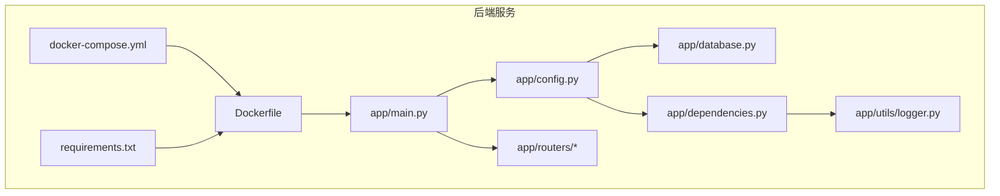
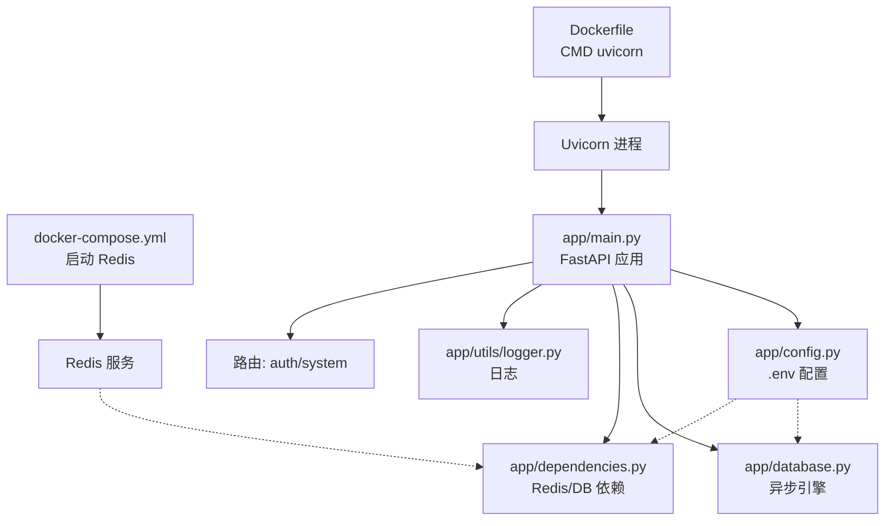
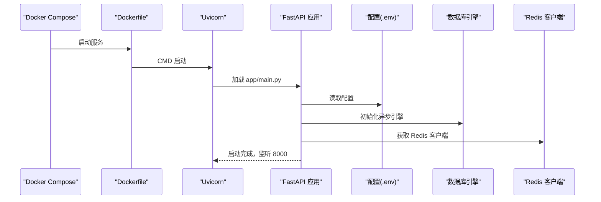
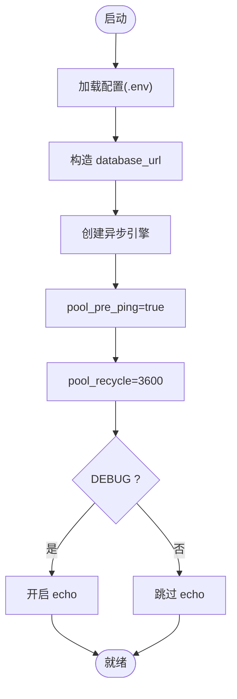
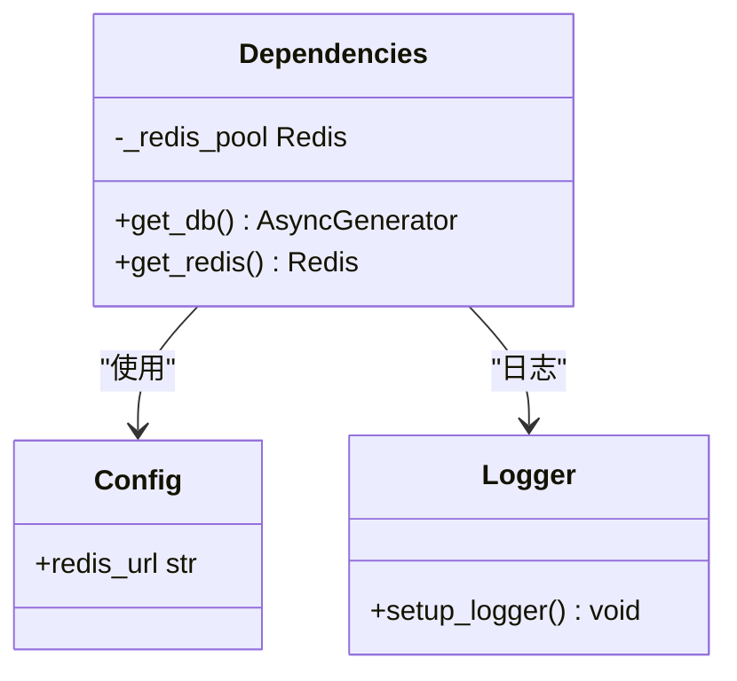
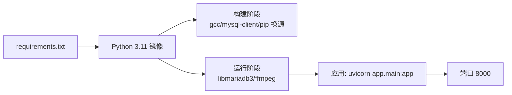

# 启动问题

<cite>
**本文引用的文件**
- [Dockerfile](file://service/ai_assistant/Dockerfile)
- [docker-compose.yml](file://service/ai_assistant/docker-compose.yml)
- [requirements.txt](file://service/ai_assistant/requirements.txt)
- [app/main.py](file://service/ai_assistant/app/main.py)
- [app/config.py](file://service/ai_assistant/app/config.py)
- [app/database.py](file://service/ai_assistant/app/database.py)
- [app/dependencies.py](file://service/ai_assistant/app/dependencies.py)
- [app/utils/logger.py](file://service/ai_assistant/app/utils/logger.py)
- [app/routers/auth.py](file://service/ai_assistant/app/routers/auth.py)
- [app/routers/system.py](file://service/ai_assistant/app/routers/system.py)
- [README.md](file://README.md)
</cite>

## 目录
1. [简介](#简介)
2. [项目结构](#项目结构)
3. [核心组件](#核心组件)
4. [架构总览](#架构总览)
5. [详细组件分析](#详细组件分析)
6. [依赖分析](#依赖分析)
7. [性能考虑](#性能考虑)
8. [故障排除指南](#故障排除指南)
9. [结论](#结论)
10. [附录](#附录)

## 简介
本指南面向开发者与运维人员，聚焦“AI校园助手”后端服务在本地开发与容器化部署中的启动问题排查。内容覆盖依赖安装、环境变量配置、端口占用、Docker容器启动失败、Python虚拟环境问题、FastAPI应用生命周期与错误解读、启动脚本与日志分析、数据库连接初始化失败等常见场景，并提供系统化的诊断流程与实用命令行工具。

## 项目结构
后端服务位于 service/ai_assistant 目录，采用 FastAPI + SQLAlchemy AsyncIO + Redis + MySQL 的技术栈。Dockerfile 与 docker-compose.yml 提供容器化一键启动；requirements.txt 管理依赖；应用入口在 app/main.py，配置在 app/config.py，数据库引擎与会话在 app/database.py，依赖注入与Redis在 app/dependencies.py，日志在 app/utils/logger.py。

图表来源
- [Dockerfile:1-49](file://service/ai_assistant/Dockerfile#L1-L49)
- [docker-compose.yml:1-31](file://service/ai_assistant/docker-compose.yml#L1-L31)
- [requirements.txt:1-22](file://service/ai_assistant/requirements.txt#L1-L22)
- [app/main.py:1-86](file://service/ai_assistant/app/main.py#L1-L86)
- [app/config.py:1-113](file://service/ai_assistant/app/config.py#L1-L113)
- [app/database.py:1-35](file://service/ai_assistant/app/database.py#L1-L35)
- [app/dependencies.py:1-109](file://service/ai_assistant/app/dependencies.py#L1-L109)
- [app/utils/logger.py:1-53](file://service/ai_assistant/app/utils/logger.py#L1-L53)
- [app/routers/auth.py:1-102](file://service/ai_assistant/app/routers/auth.py#L1-L102)
- [app/routers/system.py:1-38](file://service/ai_assistant/app/routers/system.py#L1-L38)

章节来源
- [README.md:1-104](file://README.md#L1-L104)
- [Dockerfile:1-49](file://service/ai_assistant/Dockerfile#L1-L49)
- [docker-compose.yml:1-31](file://service/ai_assistant/docker-compose.yml#L1-L31)
- [requirements.txt:1-22](file://service/ai_assistant/requirements.txt#L1-L22)
- [app/main.py:1-86](file://service/ai_assistant/app/main.py#L1-L86)
- [app/config.py:1-113](file://service/ai_assistant/app/config.py#L1-L113)
- [app/database.py:1-35](file://service/ai_assistant/app/database.py#L1-L35)
- [app/dependencies.py:1-109](file://service/ai_assistant/app/dependencies.py#L1-L109)
- [app/utils/logger.py:1-53](file://service/ai_assistant/app/utils/logger.py#L1-L53)
- [app/routers/auth.py:1-102](file://service/ai_assistant/app/routers/auth.py#L1-L102)
- [app/routers/system.py:1-38](file://service/ai_assistant/app/routers/system.py#L1-L38)

## 核心组件
- 应用入口与生命周期：app/main.py 初始化 FastAPI、CORS、路由注册与 lifespan（启动/关闭钩子），并在启动时检查不安全默认配置并发出告警。
- 配置中心：app/config.py 使用 pydantic-settings 从 .env 加载配置，提供数据库URL、Redis URL、JWT、AES、CORS、模型参数等。
- 数据库引擎：app/database.py 基于 SQLAlchemy AsyncIO 创建异步引擎与会话工厂，启用 pool_pre_ping 与 recycle，DEBUG时开启echo。
- 依赖注入与Redis：app/dependencies.py 提供 get_db、get_redis 单例客户端，lifespan关闭时释放Redis连接池。
- 日志系统：app/utils/logger.py 使用 Loguru 输出到控制台与文件，文件位于 logs/ 目录，便于启动与运行期问题定位。
- 路由示例：app/routers/auth.py 与 app/routers/system.py 展示认证与健康检查接口，便于快速验证服务可用性。

章节来源
- [app/main.py:1-86](file://service/ai_assistant/app/main.py#L1-L86)
- [app/config.py:1-113](file://service/ai_assistant/app/config.py#L1-L113)
- [app/database.py:1-35](file://service/ai_assistant/app/database.py#L1-L35)
- [app/dependencies.py:1-109](file://service/ai_assistant/app/dependencies.py#L1-L109)
- [app/utils/logger.py:1-53](file://service/ai_assistant/app/utils/logger.py#L1-L53)
- [app/routers/auth.py:1-102](file://service/ai_assistant/app/routers/auth.py#L1-L102)
- [app/routers/system.py:1-38](file://service/ai_assistant/app/routers/system.py#L1-L38)

## 架构总览
下图展示了启动阶段的关键组件与交互：Docker Compose 启动 Redis，Uvicorn 启动 FastAPI 应用，应用读取 .env 配置，建立数据库与Redis连接，注册路由并进入运行期。

图表来源
- [docker-compose.yml:1-31](file://service/ai_assistant/docker-compose.yml#L1-L31)
- [Dockerfile:42-49](file://service/ai_assistant/Dockerfile#L42-L49)
- [app/main.py:1-86](file://service/ai_assistant/app/main.py#L1-L86)
- [app/config.py:1-113](file://service/ai_assistant/app/config.py#L1-L113)
- [app/database.py:1-35](file://service/ai_assistant/app/database.py#L1-L35)
- [app/dependencies.py:1-109](file://service/ai_assistant/app/dependencies.py#L1-L109)
- [app/utils/logger.py:1-53](file://service/ai_assistant/app/utils/logger.py#L1-L53)
- [app/routers/auth.py:1-102](file://service/ai_assistant/app/routers/auth.py#L1-L102)
- [app/routers/system.py:1-38](file://service/ai_assistant/app/routers/system.py#L1-L38)

## 详细组件分析

### FastAPI 应用启动流程与错误解读
- 生命周期钩子：lifespan 在启动前打印日志并检查不安全默认配置；在关闭时关闭Redis连接池。
- CORS与路由：启动时添加CORS中间件并注册认证/管理/查询/系统路由。
- 常见启动错误与解读
  - “未设置必需的环境变量”：检查 .env 是否存在且包含 JWT_SECRET_KEY、AES_SECRET_KEY、DID_SALT、MYSQL_*、REDIS_*、阿里云相关密钥等。
  - “数据库连接失败”：检查 host/port/password/database、网络可达性、MySQL服务状态、字符集与SSL配置。
  - “Redis连接失败”：检查 host/port/password/db、Redis是否启动、密码是否正确、网络策略。
  - “端口被占用”：8000 端口被占用会导致 Uvicorn 启动失败，需释放端口或修改映射。
  - “依赖安装失败”：requirements.txt 中版本冲突或网络超时，可换源重试或离线安装。
  - “容器内权限问题”：Dockerfile 使用非root用户运行，若挂载目录权限不足会导致写日志失败。

图表来源
- [Dockerfile:42-49](file://service/ai_assistant/Dockerfile#L42-L49)
- [app/main.py:36-62](file://service/ai_assistant/app/main.py#L36-L62)
- [app/config.py:85-110](file://service/ai_assistant/app/config.py#L85-L110)
- [app/database.py:7-20](file://service/ai_assistant/app/database.py#L7-L20)
- [app/dependencies.py:36-50](file://service/ai_assistant/app/dependencies.py#L36-L50)

章节来源
- [app/main.py:36-62](file://service/ai_assistant/app/main.py#L36-L62)
- [app/config.py:85-110](file://service/ai_assistant/app/config.py#L85-L110)
- [app/database.py:7-20](file://service/ai_assistant/app/database.py#L7-L20)
- [app/dependencies.py:36-50](file://service/ai_assistant/app/dependencies.py#L36-L50)

### 数据库连接初始化流程
- 异步引擎创建：基于 settings.database_url，启用 pool_pre_ping 与 recycle，DEBUG时开启echo。
- 会话工厂：AsyncSessionLocal 提供异步会话，expire_on_commit=false，autoflush/false，autocommit=false。
- get_db 上下文：异步生成器提供会话作用域，finally中关闭会话。

图表来源
- [app/config.py:85-91](file://service/ai_assistant/app/config.py#L85-L91)
- [app/database.py:7-20](file://service/ai_assistant/app/database.py#L7-L20)

章节来源
- [app/config.py:85-91](file://service/ai_assistant/app/config.py#L85-L91)
- [app/database.py:7-20](file://service/ai_assistant/app/database.py#L7-L20)

### Redis 依赖注入与连接池
- 单例客户端：get_redis_client 首次调用时创建 aioredis.Redis 实例，复用 _redis_pool。
- URL 构造：settings.redis_url 支持带/不带密码的Redis URL。
- 关闭释放：lifespan 关闭时调用 aclose 释放连接池。

图表来源
- [app/dependencies.py:36-50](file://service/ai_assistant/app/dependencies.py#L36-L50)
- [app/config.py:93-100](file://service/ai_assistant/app/config.py#L93-L100)
- [app/utils/logger.py:17-46](file://service/ai_assistant/app/utils/logger.py#L17-L46)

章节来源
- [app/dependencies.py:36-50](file://service/ai_assistant/app/dependencies.py#L36-L50)
- [app/config.py:93-100](file://service/ai_assistant/app/config.py#L93-L100)
- [app/utils/logger.py:17-46](file://service/ai_assistant/app/utils/logger.py#L17-L46)

## 依赖分析
- 容器镜像与运行时
  - 基于 python:3.11-slim，分 build/runtime 两阶段，build 阶段安装 gcc、MySQL 客户端与 pip 换源，runtime 阶段安装 libmariadb3 与 ffmpeg。
  - EXPOSE 8000，CMD uvicorn 指向 app.main:app。
- Compose 服务
  - redis:7-alpine，端口 6379 映射，设置密码、内存策略，健康检查使用 redis-cli ping。
- 依赖清单
  - FastAPI、Uvicorn、SQLAlchemy AsyncIO、aiomysql、Redis、JWT、加密、密码散列、DashScope、LangChain、日志等。

图表来源
- [requirements.txt:1-22](file://service/ai_assistant/requirements.txt#L1-L22)
- [Dockerfile:10-32](file://service/ai_assistant/Dockerfile#L10-L32)
- [Dockerfile:46-49](file://service/ai_assistant/Dockerfile#L46-L49)

章节来源
- [requirements.txt:1-22](file://service/ai_assistant/requirements.txt#L1-L22)
- [Dockerfile:10-32](file://service/ai_assistant/Dockerfile#L10-L32)
- [Dockerfile:46-49](file://service/ai_assistant/Dockerfile#L46-L49)
- [docker-compose.yml:5-24](file://service/ai_assistant/docker-compose.yml#L5-L24)

## 性能考虑
- 数据库连接池：pool_pre_ping 与 recycle 有助于保持连接活性与回收，避免长时间空闲导致的连接失效。
- Redis：单例客户端减少连接开销；在高并发场景建议评估连接池大小与超时配置。
- 日志：DEBUG 级别写文件会带来磁盘IO压力，生产环境建议 INFO 或以上级别。
- SSE/反向代理：README 提示 Nginx/Caddy 需禁用缓冲以保证流式输出稳定。

章节来源
- [app/database.py:9-12](file://service/ai_assistant/app/database.py#L9-L12)
- [app/utils/logger.py:35-43](file://service/ai_assistant/app/utils/logger.py#L35-L43)
- [README.md:75-102](file://README.md#L75-L102)

## 故障排除指南

### 一、依赖包安装问题
- 症状
  - pip 安装超时、失败、版本冲突。
- 诊断
  - 检查 requirements.txt 版本范围与兼容性。
  - 检查网络与镜像源配置（Dockerfile 中已配置 pip 源与 APT 源）。
- 解决
  - 使用 Dockerfile 内置的换源与重试参数构建镜像。
  - 若本地开发，先清理缓存并重试安装。
  - 如需离线安装，将依赖打包后复制到容器内安装。

章节来源
- [requirements.txt:1-22](file://service/ai_assistant/requirements.txt#L1-L22)
- [Dockerfile:17-19](file://service/ai_assistant/Dockerfile#L17-L19)

### 二、环境变量配置错误
- 症状
  - 启动时报错缺少必要配置（如密钥、数据库/Redis凭据）。
- 诊断
  - 确认 .env 文件存在且路径正确（pydantic-settings 默认从 .env 加载）。
  - 使用 app/config.py 的 Settings 类逐项核对必填项。
- 解决
  - 复制 .env.example 并填写所有必填项（JWT、AES、DID、MySQL、Redis、阿里云密钥等）。
  - 生产环境务必替换不安全默认值（启动时会告警）。

章节来源
- [app/config.py:7-11](file://service/ai_assistant/app/config.py#L7-L11)
- [app/main.py:25-33](file://service/ai_assistant/app/main.py#L25-L33)

### 三、端口占用冲突
- 症状
  - Uvicorn 启动失败，提示端口 8000 已被占用。
- 诊断
  - 检查宿主机进程是否占用 8000 端口。
- 解决
  - 终止占用进程或修改 docker-compose.yml 的端口映射。
  - 确保容器重启策略不会重复绑定同一端口。

章节来源
- [Dockerfile:46-49](file://service/ai_assistant/Dockerfile#L46-L49)
- [docker-compose.yml:9-10](file://service/ai_assistant/docker-compose.yml#L9-L10)

### 四、Docker 容器启动失败
- 症状
  - 容器启动即退出或健康检查失败。
- 诊断
  - 查看容器日志：docker compose logs redis。
  - 检查 .env 是否正确挂载到容器。
  - 检查网络与卷配置（backend 网络、redis_data 卷）。
- 解决
  - 修正 .env 内容并重新构建镜像。
  - 确保 Redis 密码、最大内存、策略配置合理。
  - 使用 docker compose up -d --build 重建服务。

章节来源
- [docker-compose.yml:1-31](file://service/ai_assistant/docker-compose.yml#L1-L31)
- [Dockerfile:42-49](file://service/ai_assistant/Dockerfile#L42-L49)

### 五、Python 虚拟环境配置问题
- 症状
  - 本地运行时模块找不到、路径异常。
- 诊断
  - 确认 venv/ 已创建并激活。
  - 确认 PYTHONPATH 正确指向 app/ 目录。
- 解决
  - 使用 requirements.txt 在 venv 中安装依赖。
  - 使用 uvicorn 直接指向 app.main:app 启动（与 Dockerfile CMD 一致）。

章节来源
- [Dockerfile:42-49](file://service/ai_assistant/Dockerfile#L42-L49)
- [requirements.txt:1-22](file://service/ai_assistant/requirements.txt#L1-L22)

### 六、FastAPI 应用启动错误解读与处理
- 不安全默认值告警
  - 现象：启动时出现关于 JWT/AES/SALT 使用默认值的警告。
  - 处理：在 .env 中设置强密码与随机密钥。
- CORS 配置不当
  - 现象：跨域请求被拒绝。
  - 处理：在 .env 中设置 CORS_ALLOW_ORIGINS 为允许的前端地址列表。
- 路由未注册或导入失败
  - 现象：访问 /docs 或 /redoc 报 404。
  - 处理：确认 app/main.py 中 include_router 已注册 auth/admin/query/system。
- 生命周期钩子异常
  - 现象：启动/关闭阶段报错。
  - 处理：检查 lifespan 内部日志与依赖释放逻辑。

章节来源
- [app/main.py:25-33](file://service/ai_assistant/app/main.py#L25-L33)
- [app/main.py:64-86](file://service/ai_assistant/app/main.py#L64-L86)
- [app/config.py:103-109](file://service/ai_assistant/app/config.py#L103-L109)

### 七、启动脚本调试与日志分析
- 容器日志
  - docker compose logs -f redis 查看 Redis 日志。
  - docker compose logs -f 服务名 查看应用日志。
- 本地日志
  - 日志文件位于 logs/ai_assistant_runtime.txt，INFO 级别输出到控制台，DEBUG 级别落盘。
- 启动验证
  - 访问 /api/v1/health 与 /api/v1/version 验证服务可用性。
  - 访问 /docs 或 /redoc 查看接口文档。

章节来源
- [app/utils/logger.py:23-46](file://service/ai_assistant/app/utils/logger.py#L23-L46)
- [app/routers/system.py:22-37](file://service/ai_assistant/app/routers/system.py#L22-L37)
- [README.md:61-65](file://README.md#L61-L65)

### 八、数据库连接初始化失败
- 症状
  - 启动时报数据库连接错误、超时或认证失败。
- 诊断
  - 检查 settings.database_url 构造（host/port/user/password/dbname/charset）。
  - 检查 MySQL 服务状态、防火墙与网络策略。
  - 检查 DEBUG 是否开启以观察 SQL echo。
- 解决
  - 在 .env 中修正 MYSQL_* 配置。
  - 确保 MySQL 服务可达且字符集为 utf8mb4。
  - 如使用容器网络，确保与 Redis 服务在同一网络。

章节来源
- [app/config.py:85-91](file://service/ai_assistant/app/config.py#L85-L91)
- [app/database.py:7-20](file://service/ai_assistant/app/database.py#L7-L20)

### 九、系统化启动诊断流程
- 第一步：环境与依赖
  - 确认 Python 3.11、pip、Docker/Compose 已安装。
  - 在 venv 中安装 requirements.txt。
- 第二步：配置文件
  - 复制 .env.example 为 .env，填写全部必填项。
- 第三步：容器编排
  - docker compose up -d --build 启动 Redis 与应用。
  - docker compose ps 查看服务状态。
- 第四步：日志与健康检查
  - docker compose logs redis/app 查看日志。
  - curl http://127.0.0.1:8000/api/v1/health 验证健康。
- 第五步：端口与网络
  - netstat/lsof 检查 8000 端口占用。
  - 检查容器网络与卷挂载。

章节来源
- [README.md:51-65](file://README.md#L51-L65)
- [docker-compose.yml:1-31](file://service/ai_assistant/docker-compose.yml#L1-L31)
- [Dockerfile:42-49](file://service/ai_assistant/Dockerfile#L42-L49)
- [app/routers/system.py:22-28](file://service/ai_assistant/app/routers/system.py#L22-L28)

## 结论
本指南提供了从环境准备、依赖安装、配置校验、容器启动、日志分析到数据库连接的全流程故障排除方法。建议在生产环境严格替换不安全默认值、启用 HTTPS 反向代理并优化日志级别与连接池参数，以获得更稳定的服务运行体验。

## 附录
- 常用命令
  - docker compose up -d --build
  - docker compose logs -f 服务名
  - docker compose ps
  - netstat -tulpn | grep :8000
  - uvicorn app.main:app --host 0.0.0.0 --port 8000
- 健康检查
  - GET /api/v1/health
  - GET /api/v1/version
- 关键配置项
  - .env 中的 JWT_SECRET_KEY、AES_SECRET_KEY、DID_SALT、MYSQL_*、REDIS_*、阿里云密钥等。