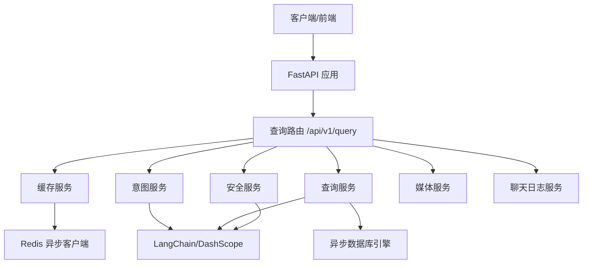
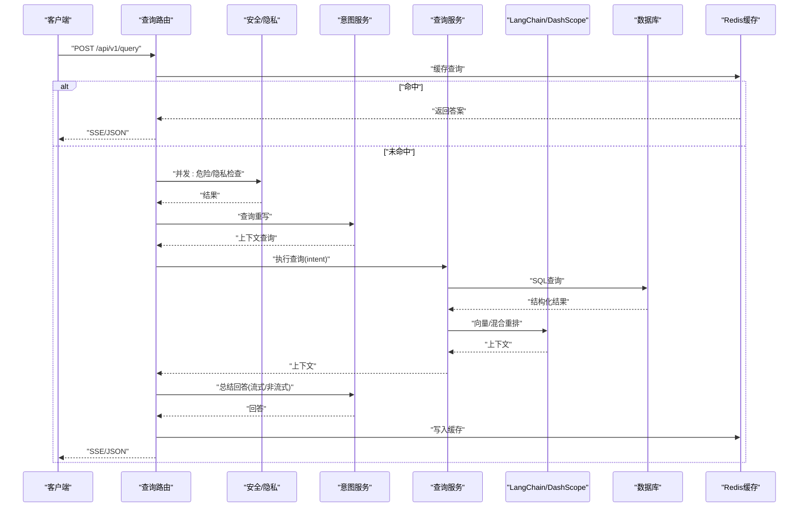
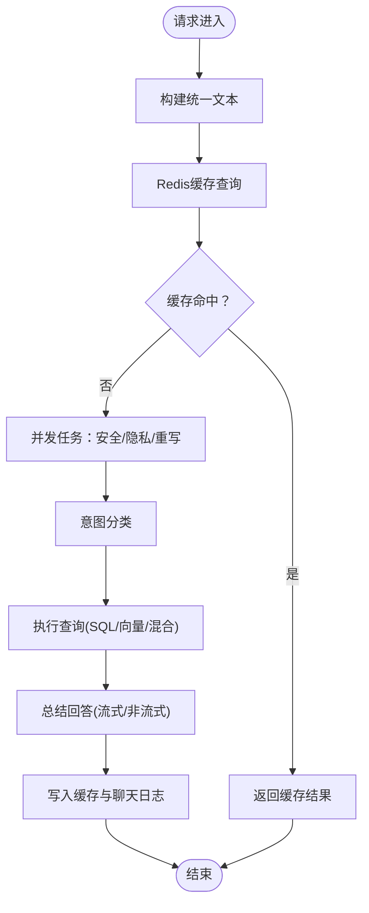
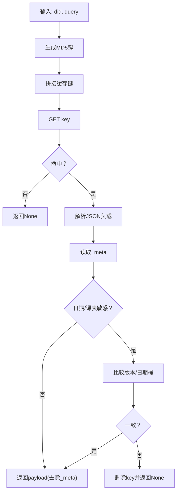
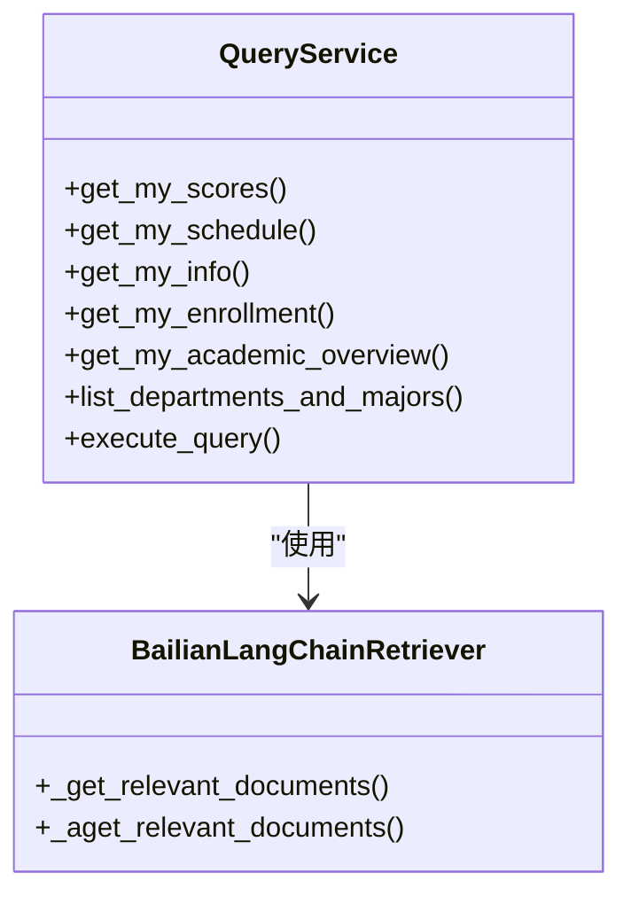
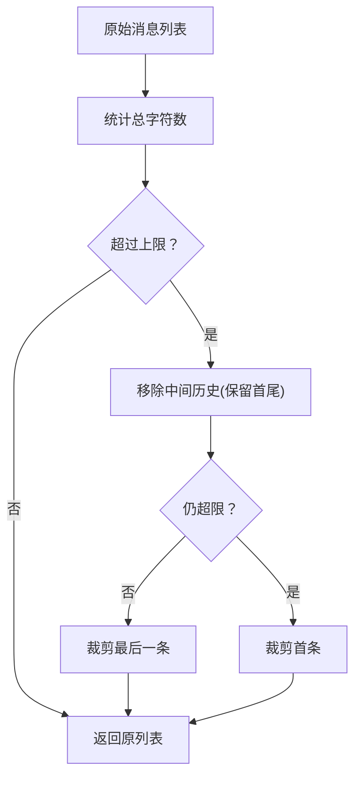
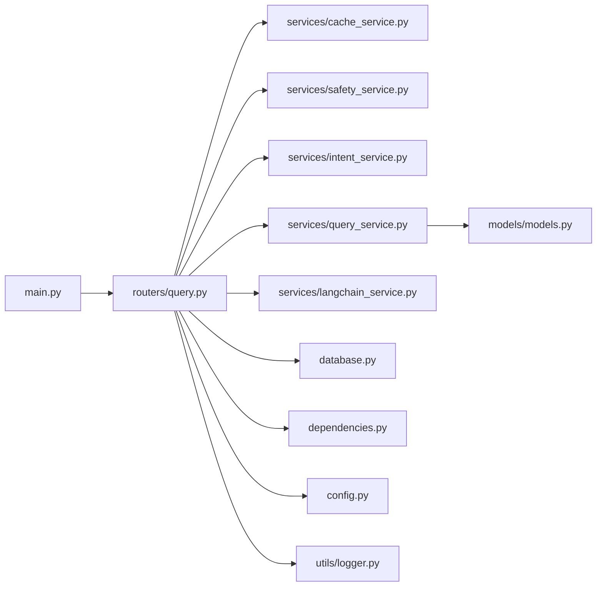

# 性能问题

<cite>
**本文引用的文件**
- [service/ai_assistant/app/main.py](file://service/ai_assistant/app/main.py)
- [service/ai_assistant/app/database.py](file://service/ai_assistant/app/database.py)
- [service/ai_assistant/app/routers/query.py](file://service/ai_assistant/app/routers/query.py)
- [service/ai_assistant/app/services/cache_service.py](file://service/ai_assistant/app/services/cache_service.py)
- [service/ai_assistant/app/services/query_service.py](file://service/ai_assistant/app/services/query_service.py)
- [service/ai_assistant/app/services/langchain_service.py](file://service/ai_assistant/app/services/langchain_service.py)
- [service/ai_assistant/app/services/intent_service.py](file://service/ai_assistant/app/services/intent_service.py)
- [service/ai_assistant/app/services/safety_service.py](file://service/ai_assistant/app/services/safety_service.py)
- [service/ai_assistant/app/dependencies.py](file://service/ai_assistant/app/dependencies.py)
- [service/ai_assistant/app/models/models.py](file://service/ai_assistant/app/models/models.py)
- [service/ai_assistant/app/utils/logger.py](file://service/ai_assistant/app/utils/logger.py)
- [service/ai_assistant/app/config.py](file://service/ai_assistant/app/config.py)
</cite>

## 目录
1. [简介](#简介)
2. [项目结构](#项目结构)
3. [核心组件](#核心组件)
4. [架构总览](#架构总览)
5. [详细组件分析](#详细组件分析)
6. [依赖分析](#依赖分析)
7. [性能考量](#性能考量)
8. [故障排除指南](#故障排除指南)
9. [结论](#结论)
10. [附录](#附录)

## 简介
本指南面向AI校园助手项目的性能问题排查与优化，聚焦以下方面：
- 查询响应慢：SQL查询优化、索引使用、查询计划分析
- 缓存命中率低：缓存键设计、TTL策略、敏感性失效机制
- AI模型调用延迟高：模型参数调整、并发控制、资源限制
- 内存使用过高：日志与中间对象管理、流式处理与截断策略
- CPU使用率异常：LLM调用与消息截断、并发任务调度
- 并发请求处理能力瓶颈：连接池与Redis连接池、流式输出与数据库连接释放
- 性能监控指标解读与最佳实践：日志结构化、关键路径计时、错误分类

## 项目结构
后端采用FastAPI + SQLAlchemy异步ORM + Redis异步客户端 + LangChain/DashScope集成，整体分为三层：
- 路由层：统一查询入口，负责多模态输入、并发任务、流式输出与缓存
- 服务层：意图分类、查询执行、缓存、安全检查、媒体处理、日志持久化
- 数据层：异步数据库引擎与模型定义，包含大量索引与约束

图表来源
- [service/ai_assistant/app/main.py:52-86](file://service/ai_assistant/app/main.py#L52-L86)
- [service/ai_assistant/app/routers/query.py:198-746](file://service/ai_assistant/app/routers/query.py#L198-L746)
- [service/ai_assistant/app/services/cache_service.py:92-177](file://service/ai_assistant/app/services/cache_service.py#L92-L177)
- [service/ai_assistant/app/services/query_service.py:1-800](file://service/ai_assistant/app/services/query_service.py#L1-L800)
- [service/ai_assistant/app/services/langchain_service.py:139-278](file://service/ai_assistant/app/services/langchain_service.py#L139-L278)
- [service/ai_assistant/app/database.py:7-35](file://service/ai_assistant/app/database.py#L7-L35)

章节来源
- [service/ai_assistant/app/main.py:1-86](file://service/ai_assistant/app/main.py#L1-L86)
- [service/ai_assistant/app/routers/query.py:1-788](file://service/ai_assistant/app/routers/query.py#L1-L788)

## 核心组件
- FastAPI应用与生命周期：CORS、路由注册、Redis连接池关闭
- 数据库：异步引擎、连接池参数、会话管理
- 查询路由：统一入口、并发任务、缓存、安全检查、意图分类、查询执行、流式输出、日志持久化
- 缓存服务：缓存键格式、TTL策略、敏感性与日期/课表失效
- 查询服务：SQL结构化查询、学期/周次推断、向量检索包装、字段翻译与格式化
- LangChain/DashScope适配：消息截断、LLM调用、流式输出
- 意图服务：意图分类、查询重写、回答总结与流式输出
- 安全服务：危险内容检测、隐私检查
- 依赖注入：数据库会话、Redis客户端、当前用户
- 日志：统一日志配置与落盘
- 配置：数据库/Redis/LLM/缓存/TTL/CORS等

章节来源
- [service/ai_assistant/app/main.py:36-86](file://service/ai_assistant/app/main.py#L36-L86)
- [service/ai_assistant/app/database.py:7-35](file://service/ai_assistant/app/database.py#L7-L35)
- [service/ai_assistant/app/routers/query.py:198-746](file://service/ai_assistant/app/routers/query.py#L198-L746)
- [service/ai_assistant/app/services/cache_service.py:1-177](file://service/ai_assistant/app/services/cache_service.py#L1-L177)
- [service/ai_assistant/app/services/query_service.py:1-800](file://service/ai_assistant/app/services/query_service.py#L1-L800)
- [service/ai_assistant/app/services/langchain_service.py:1-278](file://service/ai_assistant/app/services/langchain_service.py#L1-L278)
- [service/ai_assistant/app/services/intent_service.py:1-346](file://service/ai_assistant/app/services/intent_service.py#L1-L346)
- [service/ai_assistant/app/services/safety_service.py:1-163](file://service/ai_assistant/app/services/safety_service.py#L1-L163)
- [service/ai_assistant/app/dependencies.py:1-109](file://service/ai_assistant/app/dependencies.py#L1-L109)
- [service/ai_assistant/app/utils/logger.py:1-53](file://service/ai_assistant/app/utils/logger.py#L1-L53)
- [service/ai_assistant/app/config.py:1-113](file://service/ai_assistant/app/config.py#L1-L113)

## 架构总览
查询端到端流程（POST /api/v1/query）：
- 输入多模态（文本/图片/音频）→ 统一文本构建
- 缓存命中优先返回
- 并发执行：安全检查、隐私检查、查询重写
- 意图分类（structured/vector/hybrid/smalltalk）
- 查询执行（SQL/向量/混合）
- 回答总结（非流式或流式）
- 缓存写入与聊天日志持久化

图表来源
- [service/ai_assistant/app/routers/query.py:207-746](file://service/ai_assistant/app/routers/query.py#L207-L746)
- [service/ai_assistant/app/services/cache_service.py:92-177](file://service/ai_assistant/app/services/cache_service.py#L92-L177)
- [service/ai_assistant/app/services/query_service.py:1-800](file://service/ai_assistant/app/services/query_service.py#L1-L800)
- [service/ai_assistant/app/services/intent_service.py:218-346](file://service/ai_assistant/app/services/intent_service.py#L218-L346)
- [service/ai_assistant/app/services/langchain_service.py:139-278](file://service/ai_assistant/app/services/langchain_service.py#L139-L278)

## 详细组件分析

### 查询路由（性能关键路径）
- 并发任务：安全检查与查询重写并行，缩短关键路径
- 缓存：先查缓存，命中直接返回；未命中再进入完整流程
- 流式输出：StreamingResponse + SSE，尽早回滚数据库会话，避免长连接占用
- 会话历史：Redis按会话隔离存储，防止并发串话
- 错误降级：Redis异常时回退到数据库历史；LLM异常时降级提示

图表来源
- [service/ai_assistant/app/routers/query.py:207-746](file://service/ai_assistant/app/routers/query.py#L207-L746)

章节来源
- [service/ai_assistant/app/routers/query.py:198-746](file://service/ai_assistant/app/routers/query.py#L198-L746)

### 缓存服务（命中率与失效策略）
- 键格式：chat_cache:{version}:{did}:{query_md5}
- TTL策略：敏感/普通查询不同TTL
- 敏感性判定：隐私关键词、日期敏感（跨天失效）、课表敏感（版本号失效）
- 元信息：date_bucket、schedule_cache_version，用于运行时失效
- 写入：携带_meta，包含敏感性与版本信息

图表来源
- [service/ai_assistant/app/services/cache_service.py:92-177](file://service/ai_assistant/app/services/cache_service.py#L92-L177)

章节来源
- [service/ai_assistant/app/services/cache_service.py:1-177](file://service/ai_assistant/app/services/cache_service.py#L1-L177)

### 查询服务（SQL与向量检索）
- 结构化查询：基于学生ID的隐私约束，多表联结，按学期过滤
- 学期推断：当前/未来/过去/猜测，支持周次计算与目标周统计
- 向量检索包装：LangChain retriever封装，异步执行
- 字段翻译：英文字段名转中文，学期ID格式化，布尔值人性化
- 关键路径：SQL查询、向量检索、混合重排、字段翻译

图表来源
- [service/ai_assistant/app/services/query_service.py:575-800](file://service/ai_assistant/app/services/query_service.py#L575-L800)
- [service/ai_assistant/app/services/query_service.py:212-238](file://service/ai_assistant/app/services/query_service.py#L212-L238)

章节来源
- [service/ai_assistant/app/services/query_service.py:1-800](file://service/ai_assistant/app/services/query_service.py#L1-L800)

### LangChain/DashScope适配（LLM调用）
- 消息截断：优先丢弃旧历史，再裁剪最后一条，极端情况裁剪首条
- LLM调用：非流式与流式两种模式，错误处理与日志记录
- 参数控制：模型、温度、最大tokens、输入字符上限

图表来源
- [service/ai_assistant/app/services/langchain_service.py:46-96](file://service/ai_assistant/app/services/langchain_service.py#L46-L96)
- [service/ai_assistant/app/services/langchain_service.py:139-278](file://service/ai_assistant/app/services/langchain_service.py#L139-L278)

章节来源
- [service/ai_assistant/app/services/langchain_service.py:1-278](file://service/ai_assistant/app/services/langchain_service.py#L1-L278)

### 意图服务（分类与总结）
- 意图分类：structured/vector/hybrid/smalltalk
- 查询重写：结合历史上下文，补齐缺失信息
- 回答总结：非流式与流式两种输出，带payload截断与警告

章节来源
- [service/ai_assistant/app/services/intent_service.py:1-346](file://service/ai_assistant/app/services/intent_service.py#L1-L346)

### 安全服务（隐私与危险内容）
- 危险内容检测：LLM + 正则回退
- 隐私检查：禁止查询他人学号
- 公共服务查询放行：避免误判

章节来源
- [service/ai_assistant/app/services/safety_service.py:1-163](file://service/ai_assistant/app/services/safety_service.py#L1-L163)

### 数据库与模型（索引与约束）
- 异步引擎：pool_pre_ping、pool_recycle、echo
- 模型索引：大量复合索引与唯一约束，覆盖常用查询路径
- 约束：数据完整性约束，避免脏数据导致的额外开销

章节来源
- [service/ai_assistant/app/database.py:7-35](file://service/ai_assistant/app/database.py#L7-L35)
- [service/ai_assistant/app/models/models.py:1-660](file://service/ai_assistant/app/models/models.py#L1-L660)

## 依赖分析
- FastAPI应用依赖：路由、中间件、生命周期钩子
- 路由依赖：数据库会话、Redis客户端、当前用户、各服务
- 服务间耦合：查询路由依赖缓存、安全、意图、查询、媒体、日志
- 外部依赖：DashScope、LangChain、Redis、MySQL

图表来源
- [service/ai_assistant/app/main.py:1-86](file://service/ai_assistant/app/main.py#L1-L86)
- [service/ai_assistant/app/routers/query.py:1-788](file://service/ai_assistant/app/routers/query.py#L1-L788)
- [service/ai_assistant/app/dependencies.py:1-109](file://service/ai_assistant/app/dependencies.py#L1-L109)
- [service/ai_assistant/app/database.py:1-35](file://service/ai_assistant/app/database.py#L1-L35)
- [service/ai_assistant/app/models/models.py:1-660](file://service/ai_assistant/app/models/models.py#L1-L660)
- [service/ai_assistant/app/config.py:1-113](file://service/ai_assistant/app/config.py#L1-L113)
- [service/ai_assistant/app/utils/logger.py:1-53](file://service/ai_assistant/app/utils/logger.py#L1-L53)

## 性能考量
- 异步与并发
  - 异步数据库会话与Redis客户端，避免阻塞
  - 路由层并发执行安全/隐私/重写，缩短关键路径
  - 流式输出与数据库会话分离，降低连接占用
- 缓存策略
  - 缓存键版本化与敏感性TTL，减少脏读
  - 日期/课表敏感失效，保证时效性
- LLM调用
  - 输入消息截断，避免超长输入导致延迟
  - 温度与max_tokens合理设置，平衡质量与速度
- 数据库
  - 大量索引覆盖常用查询，减少全表扫描
  - 连接池参数优化，pre_ping与recycle保障连接健康

[本节为通用性能讨论，无需列出章节来源]

## 故障排除指南

### 查询响应慢的诊断与优化
- SQL查询优化
  - 使用数据库日志与连接池参数观察慢查询
  - 检查模型索引是否覆盖查询条件（如term_id、student_id、class_id等）
  - 避免N+1查询，确认联结顺序与过滤条件
- 索引使用
  - 关注模型定义中的复合索引与唯一约束
  - 对高频过滤字段建立合适索引，避免隐式转换
- 查询计划分析
  - 开启SQL echo（开发环境）查看执行计划
  - 分析WHERE/HAVING/ORDER BY/JOIN顺序与成本
- 实践要点
  - 在路由层尽早过滤与裁剪输入，减少下游工作量
  - 对结构化查询使用明确的学期/班级/课程过滤

章节来源
- [service/ai_assistant/app/database.py:7-35](file://service/ai_assistant/app/database.py#L7-L35)
- [service/ai_assistant/app/models/models.py:1-660](file://service/ai_assistant/app/models/models.py#L1-L660)

### 缓存命中率低的排查与改进
- 缓存键设计
  - 确认did与query_hash组合是否稳定（大小写、空白、标准化）
  - 版本号变更时是否预期失效
- TTL策略
  - 敏感查询TTL较短，普通查询较长，评估是否合理
- 敏感性与失效
  - 日期敏感：跨天是否正确失效
  - 课表敏感：管理员改课后版本号是否递增
- 改进建议
  - 增加缓存命中/未命中日志统计
  - 对重复查询进行去重与合并

章节来源
- [service/ai_assistant/app/services/cache_service.py:1-177](file://service/ai_assistant/app/services/cache_service.py#L1-L177)
- [service/ai_assistant/app/routers/query.py:278-313](file://service/ai_assistant/app/routers/query.py#L278-L313)

### AI模型调用延迟高的处理
- 模型参数调整
  - 降低temperature与max_tokens，减少生成长度
  - 选择更轻量模型（如turbo）用于意图与重写
- 并发控制
  - 避免在同一请求内过度并发LLM调用
  - 使用线程池或进程池隔离阻塞调用
- 资源限制
  - 控制输入消息长度，启用消息截断
  - 设置合理的超时与重试策略

章节来源
- [service/ai_assistant/app/services/langchain_service.py:139-278](file://service/ai_assistant/app/services/langchain_service.py#L139-L278)
- [service/ai_assistant/app/services/intent_service.py:218-346](file://service/ai_assistant/app/services/intent_service.py#L218-L346)
- [service/ai_assistant/app/config.py:54-84](file://service/ai_assistant/app/config.py#L54-L84)

### 内存使用过高的诊断与内存泄漏排查
- 日志与中间对象
  - 检查日志级别与落盘频率，避免过多DEBUG日志
  - 关注中间字符串拼接与大对象序列化
- 流式处理
  - 使用流式生成器与StreamingResponse，及时释放中间结果
  - 对长上下文进行截断，避免一次性加载过多数据
- 内存泄漏排查
  - 确认数据库会话在流式结束后正确关闭
  - 检查Redis连接池是否正确释放

章节来源
- [service/ai_assistant/app/utils/logger.py:1-53](file://service/ai_assistant/app/utils/logger.py#L1-L53)
- [service/ai_assistant/app/services/langchain_service.py:46-96](file://service/ai_assistant/app/services/langchain_service.py#L46-L96)
- [service/ai_assistant/app/routers/query.py:654-746](file://service/ai_assistant/app/routers/query.py#L654-L746)

### CPU使用率异常的分析与优化
- LLM调用与消息截断
  - 检查是否频繁触发消息截断与警告日志
  - 优化prompt长度与上下文截断策略
- 并发任务调度
  - 路由层并发任务数量与任务粒度
  - 避免在主线程中执行阻塞操作

章节来源
- [service/ai_assistant/app/services/intent_service.py:163-210](file://service/ai_assistant/app/services/intent_service.py#L163-L210)
- [service/ai_assistant/app/routers/query.py:347-353](file://service/ai_assistant/app/routers/query.py#L347-L353)

### 并发请求处理能力的瓶颈识别与扩容
- 连接池
  - 数据库连接池：检查pool_pre_ping与pool_recycle
  - Redis连接池：依赖注入中单例客户端，注意连接数上限
- 流式输出
  - 会话回滚与连接释放，避免长时间占用
- 扩容方案
  - 增加Gunicorn/uvicorn workers数量
  - 垂直扩展数据库与Redis实例
  - 使用CDN与静态资源分离

章节来源
- [service/ai_assistant/app/database.py:7-35](file://service/ai_assistant/app/database.py#L7-L35)
- [service/ai_assistant/app/dependencies.py:36-51](file://service/ai_assistant/app/dependencies.py#L36-L51)
- [service/ai_assistant/app/routers/query.py:654-746](file://service/ai_assistant/app/routers/query.py#L654-L746)

### 性能监控指标解读与最佳实践
- 结构化日志
  - 关注关键路径耗时（向量检索、LLM调用、数据库查询）
  - 记录缓存命中/未命中、敏感性判定、日期/课表失效
- 指标建议
  - P95/P99延迟、吞吐量、错误率、缓存命中率
  - LLM调用成功率与平均耗时、消息截断次数
- 最佳实践
  - 将耗时操作异步化与并发化
  - 通过版本化缓存键与敏感性策略避免脏读
  - 在开发环境开启SQL echo，生产环境关闭

章节来源
- [service/ai_assistant/app/utils/logger.py:1-53](file://service/ai_assistant/app/utils/logger.py#L1-L53)
- [service/ai_assistant/app/services/cache_service.py:240-249](file://service/ai_assistant/app/services/cache_service.py#L240-L249)
- [service/ai_assistant/app/services/langchain_service.py:161-203](file://service/ai_assistant/app/services/langchain_service.py#L161-L203)

## 结论
本指南从查询路径、缓存策略、LLM调用、数据库与并发等方面提供了系统性的性能问题排查与优化建议。建议以结构化日志与关键指标为抓手，结合模型与索引优化，持续迭代以获得稳定、低延迟与高可用的服务体验。

[本节为总结性内容，无需列出章节来源]

## 附录
- 关键路径计时：向量检索路由计时、LLM调用计时、数据库查询计时
- 错误分类：缓存异常、数据库异常、LLM调用异常、Redis异常
- 配置项：数据库URL、Redis URL、LLM模型、缓存TTL、输入字符上限

章节来源
- [service/ai_assistant/app/services/query_service.py:240-249](file://service/ai_assistant/app/services/query_service.py#L240-L249)
- [service/ai_assistant/app/services/langchain_service.py:161-203](file://service/ai_assistant/app/services/langchain_service.py#L161-L203)
- [service/ai_assistant/app/config.py:86-113](file://service/ai_assistant/app/config.py#L86-L113)