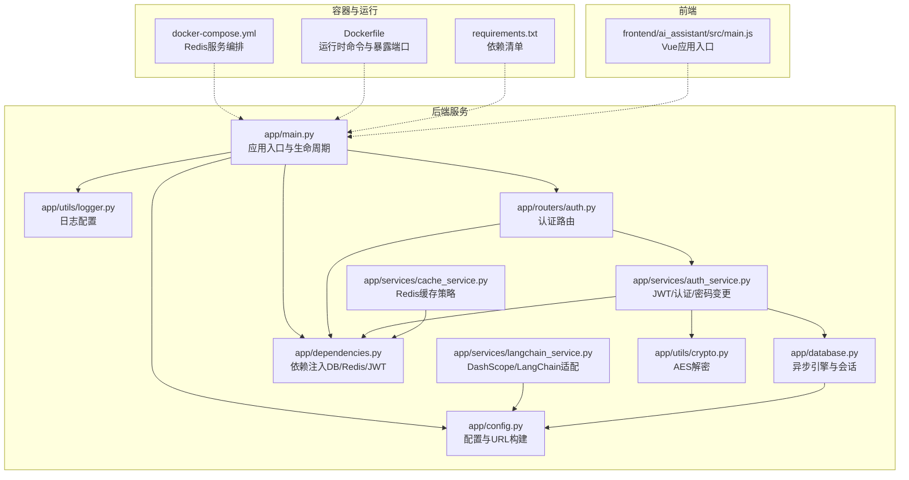
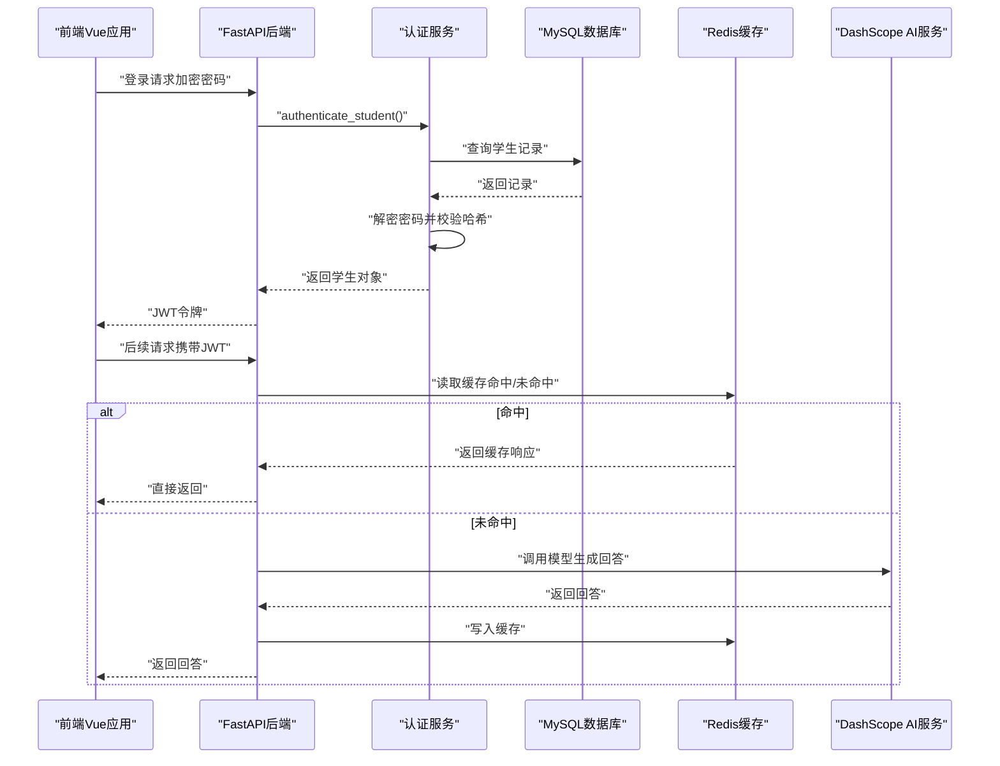
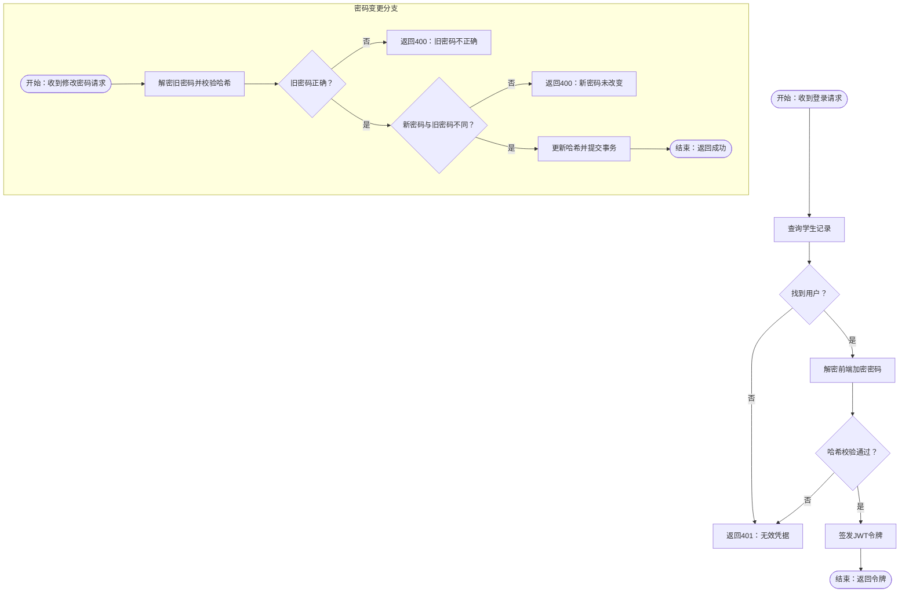
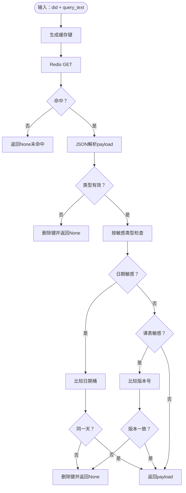
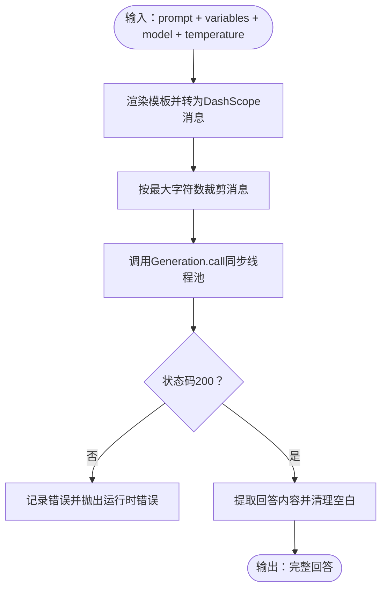
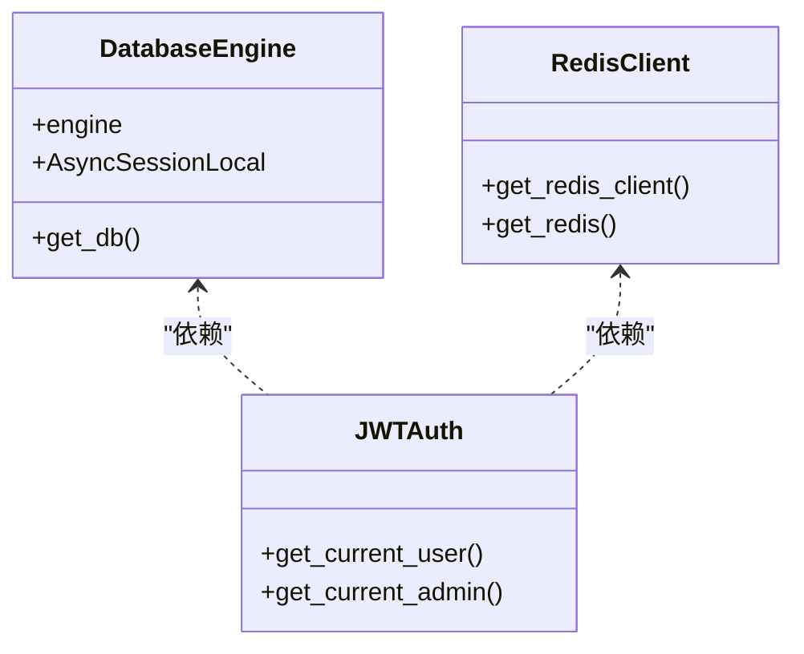
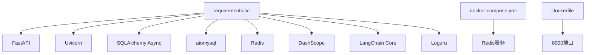

# 故障排除

<cite>
**本文引用的文件**
- [service/ai_assistant/app/main.py](file://service/ai_assistant/app/main.py)
- [service/ai_assistant/app/config.py](file://service/ai_assistant/app/config.py)
- [service/ai_assistant/app/database.py](file://service/ai_assistant/app/database.py)
- [service/ai_assistant/app/utils/logger.py](file://service/ai_assistant/app/utils/logger.py)
- [service/ai_assistant/app/routers/auth.py](file://service/ai_assistant/app/routers/auth.py)
- [service/ai_assistant/app/services/auth_service.py](file://service/ai_assistant/app/services/auth_service.py)
- [service/ai_assistant/app/services/langchain_service.py](file://service/ai_assistant/app/services/langchain_service.py)
- [service/ai_assistant/app/services/cache_service.py](file://service/ai_assistant/app/services/cache_service.py)
- [service/ai_assistant/app/dependencies.py](file://service/ai_assistant/app/dependencies.py)
- [service/ai_assistant/app/utils/crypto.py](file://service/ai_assistant/app/utils/crypto.py)
- [service/ai_assistant/docker-compose.yml](file://service/ai_assistant/docker-compose.yml)
- [service/ai_assistant/Dockerfile](file://service/ai_assistant/Dockerfile)
- [service/ai_assistant/requirements.txt](file://service/ai_assistant/requirements.txt)
- [frontend/ai_assistant/src/main.js](file://frontend/ai_assistant/src/main.js)
</cite>

## 目录
1. [简介](#简介)
2. [项目结构](#项目结构)
3. [核心组件](#核心组件)
4. [架构总览](#架构总览)
5. [详细组件分析](#详细组件分析)
6. [依赖分析](#依赖分析)
7. [性能考虑](#性能考虑)
8. [故障排除指南](#故障排除指南)
9. [结论](#结论)
10. [附录](#附录)

## 简介
本指南面向运维与开发者，围绕“AI校园助手”项目的后端服务与前端应用，提供系统化的故障排除方法。内容覆盖启动失败、连接异常（数据库、Redis、AI服务）、性能问题、日志分析、错误码与原因、网络与代理问题、数据库与缓存优化、以及AI服务集成的诊断流程。文档以实际代码为依据，结合可视化图表帮助快速定位问题。

## 项目结构
后端采用 FastAPI + SQLAlchemy Async + Redis + DashScope（阿里云百炼）的架构；前端基于 Vue 3 + Pinia + Router。容器编排使用 Docker Compose，包含 Redis 服务。

**图表来源**
- [service/ai_assistant/app/main.py:1-86](file://service/ai_assistant/app/main.py#L1-L86)
- [service/ai_assistant/app/config.py:1-113](file://service/ai_assistant/app/config.py#L1-L113)
- [service/ai_assistant/app/database.py:1-35](file://service/ai_assistant/app/database.py#L1-L35)
- [service/ai_assistant/app/dependencies.py:1-109](file://service/ai_assistant/app/dependencies.py#L1-L109)
- [service/ai_assistant/app/utils/logger.py:1-53](file://service/ai_assistant/app/utils/logger.py#L1-L53)
- [service/ai_assistant/app/routers/auth.py:1-102](file://service/ai_assistant/app/routers/auth.py#L1-L102)
- [service/ai_assistant/app/services/auth_service.py:1-253](file://service/ai_assistant/app/services/auth_service.py#L1-L253)
- [service/ai_assistant/app/services/langchain_service.py:1-278](file://service/ai_assistant/app/services/langchain_service.py#L1-L278)
- [service/ai_assistant/app/services/cache_service.py:1-177](file://service/ai_assistant/app/services/cache_service.py#L1-L177)
- [service/ai_assistant/app/utils/crypto.py:1-73](file://service/ai_assistant/app/utils/crypto.py#L1-L73)
- [service/ai_assistant/docker-compose.yml:1-31](file://service/ai_assistant/docker-compose.yml#L1-L31)
- [service/ai_assistant/Dockerfile:1-49](file://service/ai_assistant/Dockerfile#L1-L49)
- [service/ai_assistant/requirements.txt:1-22](file://service/ai_assistant/requirements.txt#L1-L22)
- [frontend/ai_assistant/src/main.js:1-10](file://frontend/ai_assistant/src/main.js#L1-L10)

**章节来源**
- [service/ai_assistant/app/main.py:1-86](file://service/ai_assistant/app/main.py#L1-L86)
- [service/ai_assistant/app/config.py:1-113](file://service/ai_assistant/app/config.py#L1-L113)
- [service/ai_assistant/app/database.py:1-35](file://service/ai_assistant/app/database.py#L1-L35)
- [service/ai_assistant/app/dependencies.py:1-109](file://service/ai_assistant/app/dependencies.py#L1-L109)
- [service/ai_assistant/app/utils/logger.py:1-53](file://service/ai_assistant/app/utils/logger.py#L1-L53)
- [service/ai_assistant/docker-compose.yml:1-31](file://service/ai_assistant/docker-compose.yml#L1-L31)
- [service/ai_assistant/Dockerfile:1-49](file://service/ai_assistant/Dockerfile#L1-L49)
- [service/ai_assistant/requirements.txt:1-22](file://service/ai_assistant/requirements.txt#L1-L22)
- [frontend/ai_assistant/src/main.js:1-10](file://frontend/ai_assistant/src/main.js#L1-L10)

## 核心组件
- 应用入口与生命周期：负责启动日志、CORS配置、路由注册、Redis连接池关闭。
- 配置中心：集中管理数据库、Redis、JWT、DashScope、缓存TTL等配置，并提供URL构造。
- 数据库层：异步SQLAlchemy引擎与会话工厂，支持pre_ping与recycle。
- 依赖注入：数据库会话、Redis客户端、JWT校验、当前用户解析。
- 认证与密码：JWT签发/解码、学生/管理员认证、密码变更与哈希校验。
- 缓存服务：基于Redis的键空间设计、敏感性判定、跨天与课表版本失效策略。
- AI服务适配：DashScope调用封装、消息裁剪、流式/非流式响应。
- 日志：控制台+文件双通道，统一格式与轮转。
- 前端入口：Vue应用挂载与路由/状态管理初始化。

**章节来源**
- [service/ai_assistant/app/main.py:1-86](file://service/ai_assistant/app/main.py#L1-L86)
- [service/ai_assistant/app/config.py:1-113](file://service/ai_assistant/app/config.py#L1-L113)
- [service/ai_assistant/app/database.py:1-35](file://service/ai_assistant/app/database.py#L1-L35)
- [service/ai_assistant/app/dependencies.py:1-109](file://service/ai_assistant/app/dependencies.py#L1-L109)
- [service/ai_assistant/app/services/auth_service.py:1-253](file://service/ai_assistant/app/services/auth_service.py#L1-L253)
- [service/ai_assistant/app/services/cache_service.py:1-177](file://service/ai_assistant/app/services/cache_service.py#L1-L177)
- [service/ai_assistant/app/services/langchain_service.py:1-278](file://service/ai_assistant/app/services/langchain_service.py#L1-L278)
- [service/ai_assistant/app/utils/logger.py:1-53](file://service/ai_assistant/app/utils/logger.py#L1-L53)
- [frontend/ai_assistant/src/main.js:1-10](file://frontend/ai_assistant/src/main.js#L1-L10)

## 架构总览
后端服务通过Uvicorn在8000端口监听，前端通过Vite开发服务器在5173端口访问。认证路由依赖数据库与加密工具，AI服务调用DashScope，缓存服务依赖Redis。

**图表来源**
- [service/ai_assistant/app/routers/auth.py:1-102](file://service/ai_assistant/app/routers/auth.py#L1-L102)
- [service/ai_assistant/app/services/auth_service.py:1-253](file://service/ai_assistant/app/services/auth_service.py#L1-L253)
- [service/ai_assistant/app/services/cache_service.py:1-177](file://service/ai_assistant/app/services/cache_service.py#L1-L177)
- [service/ai_assistant/app/services/langchain_service.py:1-278](file://service/ai_assistant/app/services/langchain_service.py#L1-L278)
- [service/ai_assistant/app/database.py:1-35](file://service/ai_assistant/app/database.py#L1-L35)
- [service/ai_assistant/app/dependencies.py:1-109](file://service/ai_assistant/app/dependencies.py#L1-L109)

## 详细组件分析

### 认证与密码变更组件
- 登录流程：接收加密密码，解密后与数据库存储的哈希比对，签发JWT。
- 密码变更：校验旧密码哈希，不允许与旧密码相同，成功后更新哈希并提交事务。
- 错误分类：凭据无效、旧密码不正确、新旧相同、加密数据无效等。

**图表来源**
- [service/ai_assistant/app/routers/auth.py:1-102](file://service/ai_assistant/app/routers/auth.py#L1-L102)
- [service/ai_assistant/app/services/auth_service.py:1-253](file://service/ai_assistant/app/services/auth_service.py#L1-L253)
- [service/ai_assistant/app/utils/crypto.py:1-73](file://service/ai_assistant/app/utils/crypto.py#L1-L73)

**章节来源**
- [service/ai_assistant/app/routers/auth.py:1-102](file://service/ai_assistant/app/routers/auth.py#L1-L102)
- [service/ai_assistant/app/services/auth_service.py:1-253](file://service/ai_assistant/app/services/auth_service.py#L1-L253)
- [service/ai_assistant/app/utils/crypto.py:1-73](file://service/ai_assistant/app/utils/crypto.py#L1-L73)

### 缓存服务组件
- 键命名：统一前缀+版本+设备ID+查询MD5，避免跨版本脏读。
- TTL策略：敏感查询短TTL，普通查询长TTL。
- 失效策略：
  - 跨天查询：按日期桶失效，防止“今天/本周”等语义陈旧。
  - 课表相关：维护版本号，管理员调整课表后递增版本，强制失效。
- 命中/未命中：命中返回去除元信息的payload，未命中返回None。

**图表来源**
- [service/ai_assistant/app/services/cache_service.py:1-177](file://service/ai_assistant/app/services/cache_service.py#L1-L177)

**章节来源**
- [service/ai_assistant/app/services/cache_service.py:1-177](file://service/ai_assistant/app/services/cache_service.py#L1-L177)

### AI服务适配组件
- 消息裁剪：优先丢弃旧历史，最后一条消息按最大字符数截断，避免超出模型输入上限。
- 会话控制：可选择忽略环境代理变量，避免意外走代理。
- 调用方式：非流式与流式两种，均记录详细日志并在失败时抛出运行时错误。

**图表来源**
- [service/ai_assistant/app/services/langchain_service.py:1-278](file://service/ai_assistant/app/services/langchain_service.py#L1-L278)

**章节来源**
- [service/ai_assistant/app/services/langchain_service.py:1-278](file://service/ai_assistant/app/services/langchain_service.py#L1-L278)

### 数据库与依赖注入
- 数据库引擎：开启pre_ping与recycle，DEBUG时开启SQL回显。
- 依赖注入：数据库会话按请求作用域提供；Redis客户端单例，应用关闭时关闭连接池。
- JWT：Bearer方案，学生/管理员分别解码，管理员额外校验状态。

**图表来源**
- [service/ai_assistant/app/database.py:1-35](file://service/ai_assistant/app/database.py#L1-L35)
- [service/ai_assistant/app/dependencies.py:1-109](file://service/ai_assistant/app/dependencies.py#L1-L109)

**章节来源**
- [service/ai_assistant/app/database.py:1-35](file://service/ai_assistant/app/database.py#L1-L35)
- [service/ai_assistant/app/dependencies.py:1-109](file://service/ai_assistant/app/dependencies.py#L1-L109)

## 依赖分析
- 运行时依赖：FastAPI、Uvicorn、SQLAlchemy Async、aiomysql、Redis、DashScope、LangChain Core、Loguru等。
- 容器编排：Redis服务，健康检查与内存策略配置。
- Dockerfile：暴露8000端口，CMD启动Uvicorn。

**图表来源**
- [service/ai_assistant/requirements.txt:1-22](file://service/ai_assistant/requirements.txt#L1-L22)
- [service/ai_assistant/docker-compose.yml:1-31](file://service/ai_assistant/docker-compose.yml#L1-L31)
- [service/ai_assistant/Dockerfile:1-49](file://service/ai_assistant/Dockerfile#L1-L49)

**章节来源**
- [service/ai_assistant/requirements.txt:1-22](file://service/ai_assistant/requirements.txt#L1-L22)
- [service/ai_assistant/docker-compose.yml:1-31](file://service/ai_assistant/docker-compose.yml#L1-L31)
- [service/ai_assistant/Dockerfile:1-49](file://service/ai_assistant/Dockerfile#L1-L49)

## 性能考虑
- 数据库连接池：启用pre_ping与recycle，降低连接失效导致的重试成本；DEBUG开启时便于观察SQL。
- 缓存策略：敏感查询短TTL，普通查询长TTL；日期敏感与课表敏感查询按策略失效，避免陈旧结果。
- AI调用：消息裁剪减少输入长度，提高吞吐；流式输出可改善交互体验。
- 日志级别：生产环境建议INFO以上，避免过多DEBUG日志影响性能。

[本节为通用指导，无需具体文件引用]

## 故障排除指南

### 一、启动失败
- 症状
  - 服务无法启动或立即退出。
  - 控制台出现配置或依赖错误。
- 排查步骤
  1) 检查环境变量与.env文件是否正确加载（配置类从“.env”读取）。
  2) 确认端口占用：容器内暴露8000端口，主机映射是否冲突。
  3) 检查依赖安装：requirements.txt中版本是否满足。
  4) 查看日志：应用启动阶段会打印初始化信息，关注是否有异常。
- 常见原因
  - 环境变量缺失（如数据库、Redis、DashScope密钥）。
  - Docker网络/端口映射错误。
  - Python版本或第三方库不兼容。
- 处理建议
  - 使用Docker Compose启动Redis，确认健康检查通过。
  - 在容器内进入Python环境，手动导入模块验证依赖。
  - 将DEBUG设为True临时定位问题，随后恢复生产默认。

**章节来源**
- [service/ai_assistant/app/config.py:1-113](file://service/ai_assistant/app/config.py#L1-L113)
- [service/ai_assistant/Dockerfile:1-49](file://service/ai_assistant/Dockerfile#L1-L49)
- [service/ai_assistant/docker-compose.yml:1-31](file://service/ai_assistant/docker-compose.yml#L1-L31)
- [service/ai_assistant/app/utils/logger.py:1-53](file://service/ai_assistant/app/utils/logger.py#L1-L53)

### 二、连接异常

#### 1) 数据库连接失败
- 症状
  - 启动时报数据库连接错误或查询超时。
- 排查步骤
  1) 检查数据库URL构造与凭据（用户名、密码、主机、端口、数据库名）。
  2) 确认MySQL服务可达，防火墙放行端口。
  3) 查看pre_ping与recycle配置是否生效。
- 常见原因
  - 主机或端口错误、密码为空或不正确。
  - 连接池耗尽或连接失效。
- 处理建议
  - 在容器内使用aiomysql直连测试。
  - 调整连接池大小与回收策略，必要时开启DEBUG观察SQL。

**章节来源**
- [service/ai_assistant/app/config.py:85-91](file://service/ai_assistant/app/config.py#L85-L91)
- [service/ai_assistant/app/database.py:7-12](file://service/ai_assistant/app/database.py#L7-L12)

#### 2) Redis连接失败
- 症状
  - 缓存读写报错，应用关闭时Redis连接池未释放。
- 排查步骤
  1) 检查Redis URL与密码配置。
  2) 确认Redis容器健康检查通过，内存策略与最大内存设置合理。
  3) 查看应用生命周期中Redis连接池的创建与关闭。
- 常见原因
  - 密码错误或未设置。
  - Redis被限流或OOM淘汰策略导致键丢失。
- 处理建议
  - 使用docker-compose提供的健康检查命令验证连接。
  - 调整maxmemory与策略，确保热点键不被淘汰。

**章节来源**
- [service/ai_assistant/app/config.py:93-100](file://service/ai_assistant/app/config.py#L93-L100)
- [service/ai_assistant/app/dependencies.py:36-50](file://service/ai_assistant/app/dependencies.py#L36-L50)
- [service/ai_assistant/docker-compose.yml:1-31](file://service/ai_assistant/docker-compose.yml#L1-L31)

#### 3) AI服务（DashScope）调用失败
- 症状
  - Generation调用返回非200状态码，抛出运行时错误。
- 排查步骤
  1) 检查API Key与Endpoint配置。
  2) 若存在代理，确认是否信任环境代理变量。
  3) 查看消息裁剪统计，确认输入是否被过度截断。
- 常见原因
  - API Key无效或过期。
  - 输入超长被截断，导致语义不完整。
  - 网络代理干扰。
- 处理建议
  - 在调用前打印模型参数与消息数量，便于定位问题。
  - 适当降低温度或max_tokens，减少输出长度。

**章节来源**
- [service/ai_assistant/app/services/langchain_service.py:139-204](file://service/ai_assistant/app/services/langchain_service.py#L139-L204)
- [service/ai_assistant/app/config.py:48-52](file://service/ai_assistant/app/config.py#L48-L52)

### 三、认证与权限问题

#### 1) 登录失败
- 症状
  - 返回401未授权或“无效凭据”。
- 排查步骤
  1) 检查前端加密格式（IV与密文分隔符），确认URL安全编码还原。
  2) 核对AES密钥长度与配置一致性。
  3) 确认数据库中是否存在该学生记录，密码哈希是否匹配。
- 常见原因
  - 加密格式错误或密钥不一致。
  - 学生不存在或密码错误。
- 处理建议
  - 在认证服务中增加解密与哈希校验的日志，便于定位。

**章节来源**
- [service/ai_assistant/app/services/auth_service.py:125-169](file://service/ai_assistant/app/services/auth_service.py#L125-L169)
- [service/ai_assistant/app/utils/crypto.py:39-73](file://service/ai_assistant/app/utils/crypto.py#L39-L73)

#### 2) 修改密码失败
- 症状
  - 返回400错误，提示旧密码不正确或新密码未改变。
- 排查步骤
  1) 确认旧密码解密与哈希校验通过。
  2) 新旧密码哈希是否相同。
- 常见原因
  - 旧密码错误或加密数据无效。
  - 新旧密码相同。
- 处理建议
  - 在路由层捕获PasswordChangeError并映射到HTTP状态码。

**章节来源**
- [service/ai_assistant/app/routers/auth.py:72-101](file://service/ai_assistant/app/routers/auth.py#L72-L101)
- [service/ai_assistant/app/services/auth_service.py:173-210](file://service/ai_assistant/app/services/auth_service.py#L173-L210)

### 四、缓存问题

#### 1) 缓存未命中
- 症状
  - 查询每次都走AI服务，响应慢且成本高。
- 排查步骤
  1) 检查缓存键生成规则与MD5一致性。
  2) 确认敏感性判断是否正确，TTL是否过短。
- 常见原因
  - did或query_text变化导致键不同。
  - 日期敏感或课表敏感导致提前失效。
- 处理建议
  - 在缓存读写处增加日志，记录命中/未命中与TTL。

**章节来源**
- [service/ai_assistant/app/services/cache_service.py:49-177](file://service/ai_assistant/app/services/cache_service.py#L49-L177)

#### 2) 缓存陈旧
- 症状
  - “今天/本周”等查询结果与实际不符。
- 排查步骤
  1) 检查日期桶比较逻辑。
  2) 管理员调整课表后是否递增版本号。
- 常见原因
  未按日期桶失效或未更新课表版本。
- 处理建议
  - 在管理员操作后调用版本递增接口。

**章节来源**
- [service/ai_assistant/app/services/cache_service.py:114-142](file://service/ai_assistant/app/services/cache_service.py#L114-L142)

### 五、网络与代理问题
- 症状
  - DashScope调用超时或返回异常。
- 排查步骤
  1) 检查DASHSCOPE_TRUST_ENV_PROXY配置。
  2) 若禁用环境代理，确认requests.Session未被代理污染。
- 处理建议
  - 生产环境建议禁用环境代理，显式设置代理或关闭。

**章节来源**
- [service/ai_assistant/app/services/langchain_service.py:99-108](file://service/ai_assistant/app/services/langchain_service.py#L99-L108)

### 六、日志分析与关键信息解读
- 日志位置：服务根目录下的logs目录，文件名为运行时日志。
- 关键字段：时间戳、级别、模块名:函数:行号、消息体。
- 建议
  - 生产环境使用INFO级别，异常时临时提升至DEBUG。
  - 关注认证、缓存、AI调用、数据库事务等关键路径日志。

**章节来源**
- [service/ai_assistant/app/utils/logger.py:17-46](file://service/ai_assistant/app/utils/logger.py#L17-L46)

### 七、错误码与原因对照
- HTTP 401 未授权
  - 原因：缺少或无效的Bearer令牌、令牌角色不匹配、解码失败。
  - 处理：检查前端是否正确携带令牌，后端JWT配置与密钥。
- HTTP 400 错误
  - 原因：旧密码不正确、新旧密码相同、加密数据无效。
  - 处理：确认前端加密流程与后端解密一致。
- HTTP 403 禁止
  - 原因：管理员账号不可用或权限不足。
  - 处理：检查管理员状态与角色。
- 运行时错误
  - 原因：DashScope调用非200状态码。
  - 处理：检查API Key、模型参数与网络代理。

**章节来源**
- [service/ai_assistant/app/routers/auth.py:42-99](file://service/ai_assistant/app/routers/auth.py#L42-L99)
- [service/ai_assistant/app/services/auth_service.py:78-122](file://service/ai_assistant/app/services/auth_service.py#L78-L122)
- [service/ai_assistant/app/services/langchain_service.py:183-203](file://service/ai_assistant/app/services/langchain_service.py#L183-L203)

### 八、性能瓶颈识别与优化建议
- 瓶颈识别
  - 认证路径：解密与哈希校验开销；建议缓存热点用户信息。
  - 缓存路径：键生成与JSON序列化；建议批量写入与压缩。
  - AI路径：消息裁剪与流式输出；建议预估输入长度与分片。
- 优化建议
  - 合理设置Redis maxmemory与策略，避免淘汰热点键。
  - 调整DashScope模型与参数，平衡质量与延迟。
  - 使用连接池与异步I/O，避免阻塞。

**章节来源**
- [service/ai_assistant/app/services/cache_service.py:149-177](file://service/ai_assistant/app/services/cache_service.py#L149-L177)
- [service/ai_assistant/app/services/langchain_service.py:139-204](file://service/ai_assistant/app/services/langchain_service.py#L139-L204)

### 九、运维工具与技巧
- 健康检查
  - Redis健康检查：使用redis-cli ping。
  - 应用日志：查看运行时日志文件，定位异常。
- 调试技巧
  - 临时开启DEBUG，观察SQL与请求细节。
  - 使用容器内shell进入后端服务，手动调用API验证。
- 容器化部署
  - 使用Docker Compose一键拉起Redis与后端服务。
  - 暴露端口与卷挂载，确保日志持久化。

**章节来源**
- [service/ai_assistant/docker-compose.yml:18-22](file://service/ai_assistant/docker-compose.yml#L18-L22)
- [service/ai_assistant/app/utils/logger.py:23-46](file://service/ai_assistant/app/utils/logger.py#L23-L46)
- [service/ai_assistant/Dockerfile:46-48](file://service/ai_assistant/Dockerfile#L46-L48)

## 结论
本指南提供了从启动、连接、认证、缓存、AI服务到日志与性能的全链路故障排除方法。建议在生产环境中严格配置密钥与代理，启用健康检查与日志归档，并通过缓存与异步I/O优化整体性能。遇到复杂问题时，结合日志与依赖注入图进行分层排查，可显著缩短定位时间。

## 附录

### A. 关键配置项速查
- 数据库：主机、端口、用户名、密码、数据库名、DEBUG。
- Redis：主机、端口、密码、DB索引。
- JWT：密钥、算法、过期分钟数。
- DashScope：API Key、是否信任环境代理、最大输入字符数。
- 缓存：敏感与普通TTL、版本号键。

**章节来源**
- [service/ai_assistant/app/config.py:13-110](file://service/ai_assistant/app/config.py#L13-L110)

### B. 前端入口与路由
- 前端应用通过main.js挂载，使用Pinia与Router，确保与后端API端点一致。

**章节来源**
- [frontend/ai_assistant/src/main.js:1-10](file://frontend/ai_assistant/src/main.js#L1-L10)