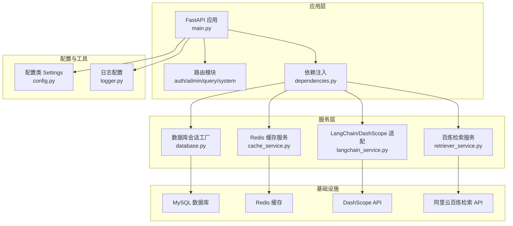
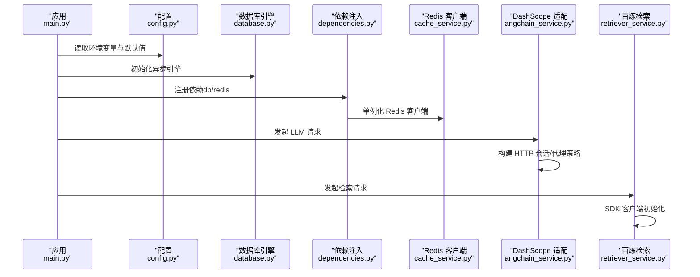
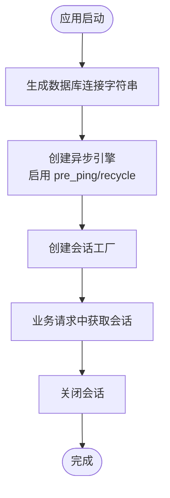
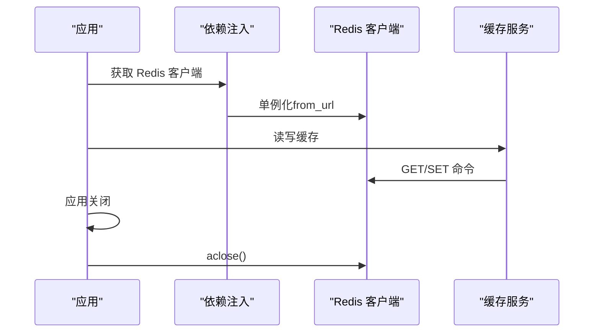
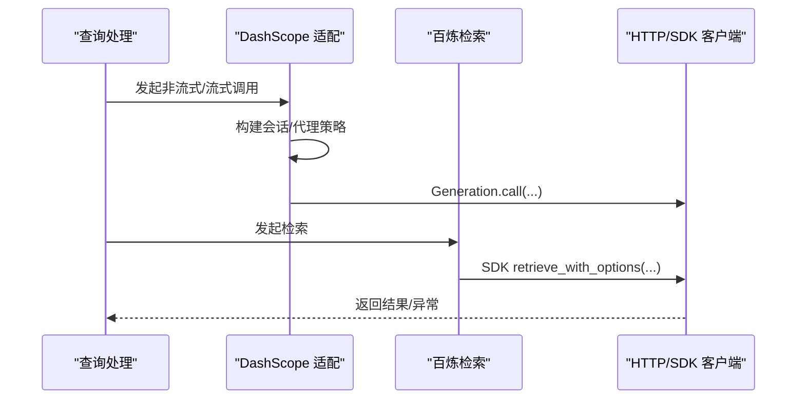
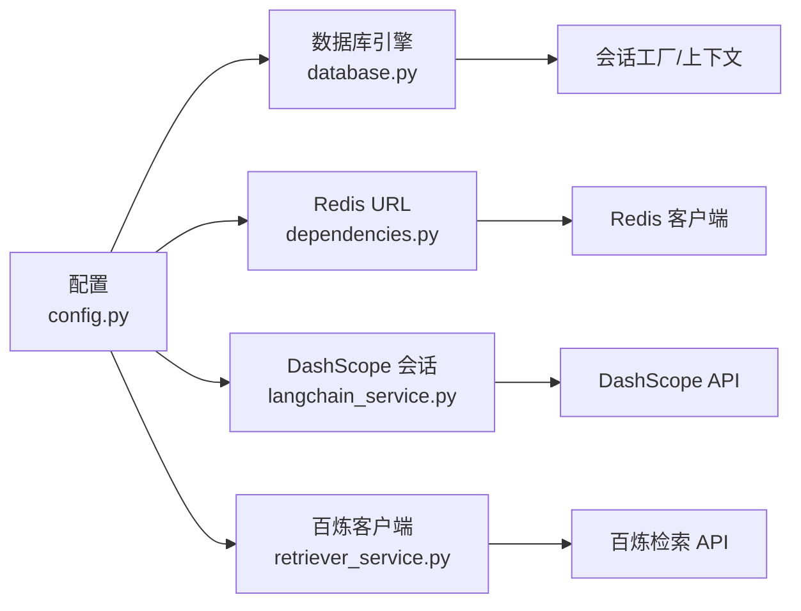

# 连接问题

<cite>
**本文引用的文件**
- [config.py](file://service/ai_assistant/app/config.py)
- [database.py](file://service/ai_assistant/app/database.py)
- [dependencies.py](file://service/ai_assistant/app/dependencies.py)
- [cache_service.py](file://service/ai_assistant/app/services/cache_service.py)
- [langchain_service.py](file://service/ai_assistant/app/services/langchain_service.py)
- [retriever_service.py](file://service/ai_assistant/app/services/retriever_service.py)
- [main.py](file://service/ai_assistant/app/main.py)
- [logger.py](file://service/ai_assistant/app/utils/logger.py)
- [docker-compose.yml](file://service/ai_assistant/docker-compose.yml)
- [Dockerfile](file://service/ai_assistant/Dockerfile)
</cite>

## 目录
1. [简介](#简介)
2. [项目结构](#项目结构)
3. [核心组件](#核心组件)
4. [架构总览](#架构总览)
5. [详细组件分析](#详细组件分析)
6. [依赖关系分析](#依赖关系分析)
7. [性能考量](#性能考量)
8. [故障排除指南](#故障排除指南)
9. [结论](#结论)
10. [附录](#附录)

## 简介
本指南聚焦于“AI校园助手”项目在运行过程中常见的连接问题，覆盖以下方面：
- 数据库连接（MySQL）：超时、认证失败、连接池耗尽等
- 缓存连接（Redis）：连接拒绝、认证错误、内存不足等
- 外部AI服务API：DashScope、阿里云百炼检索API的连接失败处理
- 网络与防火墙：连通性与代理策略
- 连接字符串配置：检查清单与修正方法
- 运维监控与健康检查：日志、容器健康检查与实用脚本思路

本指南以代码为依据，结合实际实现细节，帮助运维与开发快速定位与解决问题。

## 项目结构
后端采用 FastAPI + SQLAlchemy Async + Redis 异步生态，配置集中于 Settings 类，数据库引擎与会话工厂在独立模块中初始化，Redis 客户端通过依赖注入共享，外部AI服务通过 SDK 或 HTTP 客户端访问。

图表来源
- [main.py:1-86](file://service/ai_assistant/app/main.py#L1-L86)
- [dependencies.py:1-109](file://service/ai_assistant/app/dependencies.py#L1-L109)
- [database.py:1-35](file://service/ai_assistant/app/database.py#L1-L35)
- [cache_service.py:1-177](file://service/ai_assistant/app/services/cache_service.py#L1-L177)
- [langchain_service.py:1-278](file://service/ai_assistant/app/services/langchain_service.py#L1-L278)
- [retriever_service.py:1-168](file://service/ai_assistant/app/services/retriever_service.py#L1-L168)
- [config.py:1-113](file://service/ai_assistant/app/config.py#L1-L113)
- [logger.py:1-53](file://service/ai_assistant/app/utils/logger.py#L1-L53)

章节来源
- [main.py:1-86](file://service/ai_assistant/app/main.py#L1-L86)
- [config.py:1-113](file://service/ai_assistant/app/config.py#L1-L113)

## 核心组件
- 配置中心：集中管理数据库、Redis、DashScope、百炼检索等连接参数，并生成连接字符串
- 数据库引擎：基于 SQLAlchemy Async，启用 pre_ping 与 recycle，支持连接池生命周期控制
- Redis 客户端：通过依赖注入单例化，支持密码认证与 DB 选择
- 外部服务适配：DashScope 使用 requests 会话，百炼检索使用官方 SDK
- 日志与健康检查：统一日志落盘，容器健康检查对 Redis 生效

章节来源
- [config.py:85-110](file://service/ai_assistant/app/config.py#L85-L110)
- [database.py:7-20](file://service/ai_assistant/app/database.py#L7-L20)
- [dependencies.py:36-50](file://service/ai_assistant/app/dependencies.py#L36-L50)
- [docker-compose.yml:18-22](file://service/ai_assistant/docker-compose.yml#L18-L22)
- [logger.py:17-46](file://service/ai_assistant/app/utils/logger.py#L17-L46)

## 架构总览
下图展示连接相关的关键交互路径：应用启动时读取配置，建立数据库与Redis连接；请求处理时通过依赖注入获取资源；对外部服务调用时使用带超时与代理策略的会话或客户端。

图表来源
- [main.py:36-49](file://service/ai_assistant/app/main.py#L36-L49)
- [config.py:85-110](file://service/ai_assistant/app/config.py#L85-L110)
- [database.py:7-20](file://service/ai_assistant/app/database.py#L7-L20)
- [dependencies.py:36-50](file://service/ai_assistant/app/dependencies.py#L36-L50)
- [cache_service.py:149-175](file://service/ai_assistant/app/services/cache_service.py#L149-L175)
- [langchain_service.py:99-108](file://service/ai_assistant/app/services/langchain_service.py#L99-L108)
- [retriever_service.py:36-44](file://service/ai_assistant/app/services/retriever_service.py#L36-L44)

## 详细组件分析

### 数据库连接（MySQL）
- 连接字符串生成：由配置类的属性方法拼装，包含主机、端口、用户名、密码、数据库名与字符集
- 连接池策略：启用 pre_ping 与 recycle，便于在连接空闲或被中间件回收后自动重建
- 会话管理：通过异步上下文管理器提供会话生命周期，确保关闭

图表来源
- [config.py:85-91](file://service/ai_assistant/app/config.py#L85-L91)
- [database.py:7-20](file://service/ai_assistant/app/database.py#L7-L20)
- [database.py:27-35](file://service/ai_assistant/app/database.py#L27-L35)

章节来源
- [config.py:85-91](file://service/ai_assistant/app/config.py#L85-L91)
- [database.py:7-20](file://service/ai_assistant/app/database.py#L7-L20)
- [database.py:27-35](file://service/ai_assistant/app/database.py#L27-L35)

### Redis 连接（缓存）
- 连接字符串生成：支持带密码与 DB 选择
- 客户端单例：依赖注入模块维护全局 Redis 实例，应用关闭时统一释放
- 缓存键与 TTL：服务层负责键命名、TTL 与敏感度判定，保障缓存一致性与时效性

图表来源
- [config.py:94-100](file://service/ai_assistant/app/config.py#L94-L100)
- [dependencies.py:36-50](file://service/ai_assistant/app/dependencies.py#L36-L50)
- [main.py:43-48](file://service/ai_assistant/app/main.py#L43-L48)
- [cache_service.py:92-175](file://service/ai_assistant/app/services/cache_service.py#L92-L175)

章节来源
- [config.py:94-100](file://service/ai_assistant/app/config.py#L94-L100)
- [dependencies.py:36-50](file://service/ai_assistant/app/dependencies.py#L36-L50)
- [main.py:43-48](file://service/ai_assistant/app/main.py#L43-L48)
- [cache_service.py:92-175](file://service/ai_assistant/app/services/cache_service.py#L92-L175)

### 外部AI服务连接
- DashScope：使用 requests 会话，支持忽略环境代理变量，避免误走代理导致超时或失败
- 百炼检索：使用官方 SDK 客户端，按配置初始化，异常时记录错误并回退提示

图表来源
- [langchain_service.py:139-203](file://service/ai_assistant/app/services/langchain_service.py#L139-L203)
- [langchain_service.py:206-277](file://service/ai_assistant/app/services/langchain_service.py#L206-L277)
- [retriever_service.py:46-134](file://service/ai_assistant/app/services/retriever_service.py#L46-L134)

章节来源
- [langchain_service.py:99-108](file://service/ai_assistant/app/services/langchain_service.py#L99-L108)
- [langchain_service.py:139-203](file://service/ai_assistant/app/services/langchain_service.py#L139-L203)
- [langchain_service.py:206-277](file://service/ai_assistant/app/services/langchain_service.py#L206-L277)
- [retriever_service.py:36-44](file://service/ai_assistant/app/services/retriever_service.py#L36-L44)
- [retriever_service.py:66-74](file://service/ai_assistant/app/services/retriever_service.py#L66-L74)

## 依赖关系分析
- 配置类为所有连接提供统一来源，避免硬编码
- 数据库与 Redis 通过依赖注入共享，减少重复连接与资源浪费
- 外部服务各自封装，降低耦合度

图表来源
- [config.py:85-110](file://service/ai_assistant/app/config.py#L85-L110)
- [database.py:7-20](file://service/ai_assistant/app/database.py#L7-L20)
- [dependencies.py:36-50](file://service/ai_assistant/app/dependencies.py#L36-L50)
- [langchain_service.py:99-108](file://service/ai_assistant/app/services/langchain_service.py#L99-L108)
- [retriever_service.py:36-44](file://service/ai_assistant/app/services/retriever_service.py#L36-L44)

章节来源
- [config.py:85-110](file://service/ai_assistant/app/config.py#L85-L110)
- [database.py:7-20](file://service/ai_assistant/app/database.py#L7-L20)
- [dependencies.py:36-50](file://service/ai_assistant/app/dependencies.py#L36-L50)
- [langchain_service.py:99-108](file://service/ai_assistant/app/services/langchain_service.py#L99-L108)
- [retriever_service.py:36-44](file://service/ai_assistant/app/services/retriever_service.py#L36-L44)

## 性能考量
- 数据库连接池：pre_ping 与 recycle 可提升稳定性；如需更高并发，可考虑调整池大小与超时参数
- Redis 内存策略：容器中设置了最大内存与淘汰策略，需结合业务峰值评估
- 外部服务：合理设置超时与重试策略，避免阻塞主线程

[本节为通用指导，无需列出章节来源]

## 故障排除指南

### 数据库连接（MySQL）
常见症状
- 启动时报连接失败、认证错误或超时
- 高并发场景出现连接池耗尽

排查步骤
- 检查连接字符串：确认主机、端口、用户名、密码、数据库名与字符集
- 校验网络连通性：从应用容器/主机 ping 数据库主机，telnet/nc 测试端口
- 校验认证凭据：确认用户存在且密码正确，授权范围满足需求
- 查看连接池参数：pre_ping 与 recycle 已启用，如仍频繁中断，适当增大池容量或缩短回收周期
- 查看日志：定位具体错误码与堆栈

修复建议
- 修正 .env 中的数据库相关变量
- 如使用容器编排，确保网络桥接与端口映射正确
- 针对高并发场景优化连接池大小与超时

章节来源
- [config.py:85-91](file://service/ai_assistant/app/config.py#L85-L91)
- [database.py:7-20](file://service/ai_assistant/app/database.py#L7-L20)
- [logger.py:17-46](file://service/ai_assistant/app/utils/logger.py#L17-L46)

### Redis 连接
常见症状
- 连接被拒绝、认证失败、内存不足触发淘汰

排查步骤
- 检查连接字符串：确认主机、端口、密码、DB
- 校验网络连通性：确认应用与 Redis 主机可达
- 校验认证：容器命令健康检查使用了密码，需确保配置一致
- 观察内存：容器设置了最大内存与 LRU 策略，关注键空间与命中率
- 查看日志：定位连接失败与异常

修复建议
- 统一 .env 中的 Redis 密码与 DB
- 调整容器内存上限与淘汰策略，或优化键 TTL 与键空间设计
- 如需密码认证，确保连接字符串包含密码片段

章节来源
- [config.py:94-100](file://service/ai_assistant/app/config.py#L94-L100)
- [dependencies.py:36-50](file://service/ai_assistant/app/dependencies.py#L36-L50)
- [docker-compose.yml:13-15](file://service/ai_assistant/docker-compose.yml#L13-L15)
- [docker-compose.yml:18-22](file://service/ai_assistant/docker-compose.yml#L18-L22)
- [cache_service.py:149-175](file://service/ai_assistant/app/services/cache_service.py#L149-L175)

### 外部AI服务API
DashScope
- 症状：超时、代理干扰、鉴权失败
- 排查：检查 API Key、网络连通性；确认是否误用了环境代理
- 修复：禁用信任环境代理或显式配置代理；校验 API Key

百炼检索API
- 症状：鉴权失败、请求异常、返回空结果
- 排查：核对 Access Key ID/Secret、工作区与索引 ID、Endpoint
- 修复：更新 .env 中对应配置；检查索引状态与权限

章节来源
- [langchain_service.py:99-108](file://service/ai_assistant/app/services/langchain_service.py#L99-L108)
- [langchain_service.py:176-187](file://service/ai_assistant/app/services/langchain_service.py#L176-L187)
- [retriever_service.py:36-44](file://service/ai_assistant/app/services/retriever_service.py#L36-L44)
- [retriever_service.py:66-74](file://service/ai_assistant/app/services/retriever_service.py#L66-L74)

### 网络配置与防火墙
- 端口开放：确保应用主机/容器的 8000 端口对外可达
- Redis：容器映射 6379，确认宿主防火墙放行
- 数据库：确认数据库主机允许来自应用主机的连接
- 代理：DashScope 适配支持忽略环境代理，避免代理链路导致的超时

章节来源
- [Dockerfile:46-48](file://service/ai_assistant/Dockerfile#L46-L48)
- [docker-compose.yml:9-10](file://service/ai_assistant/docker-compose.yml#L9-L10)
- [langchain_service.py:99-108](file://service/ai_assistant/app/services/langchain_service.py#L99-L108)

### 连接字符串配置检查清单
- 数据库
  - 主机/端口/用户名/密码/数据库名/字符集
  - 是否包含特殊字符与转义
- Redis
  - 主机/端口/密码/DB
  - 密码是否包含特殊字符
- DashScope
  - API Key 是否正确
  - 代理策略是否符合网络环境
- 百炼检索
  - Access Key ID/Secret
  - 工作区 ID/索引 ID/Endpoint

章节来源
- [config.py:85-110](file://service/ai_assistant/app/config.py#L85-L110)
- [langchain_service.py:176-187](file://service/ai_assistant/app/services/langchain_service.py#L176-L187)
- [retriever_service.py:36-44](file://service/ai_assistant/app/services/retriever_service.py#L36-L44)

### 运维监控与健康检查
- 日志
  - 统一日志落盘，便于定位连接异常
  - 关注数据库、Redis、外部服务调用的日志
- 容器健康检查
  - Redis 健康检查使用密码认证，确保配置一致
- 健康端点
  - 可在系统路由中扩展 /health 端点，返回数据库、Redis、外部服务可用性

章节来源
- [logger.py:17-46](file://service/ai_assistant/app/utils/logger.py#L17-L46)
- [docker-compose.yml:18-22](file://service/ai_assistant/docker-compose.yml#L18-L22)
- [main.py:25-33](file://service/ai_assistant/app/main.py#L25-L33)

## 结论
本指南基于代码实现，梳理了数据库、Redis 与外部AI服务的连接要点与故障排除流程。建议在生产环境：
- 使用强口令与最小权限
- 明确代理策略与网络边界
- 合理配置连接池与缓存 TTL
- 建立统一日志与健康检查机制

[本节为总结，无需列出章节来源]

## 附录

### 常见错误与定位要点
- 数据库
  - 错误码与 SQLSTATE：查看日志中的具体错误
  - 连接超时：检查网络与防火墙，必要时增加超时
- Redis
  - AUTH 错误：核对密码
  - OOM：调整 maxmemory 与策略
- DashScope
  - 401/403：核对 API Key
  - 5xx：检查服务可用性与限流
- 百炼检索
  - 鉴权失败：核对 AK/SK 与 Endpoint
  - 索引不可用：检查索引状态与权限

章节来源
- [logger.py:17-46](file://service/ai_assistant/app/utils/logger.py#L17-L46)
- [langchain_service.py:190-199](file://service/ai_assistant/app/services/langchain_service.py#L190-L199)
- [retriever_service.py:84-96](file://service/ai_assistant/app/services/retriever_service.py#L84-L96)