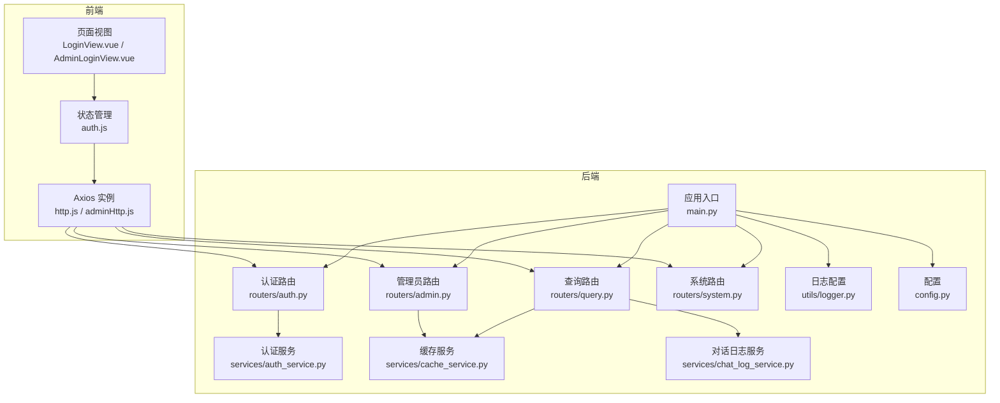
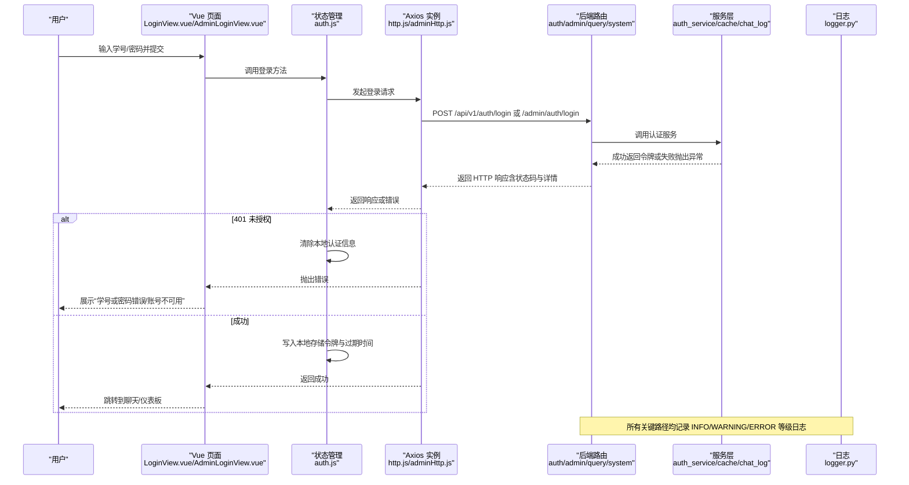
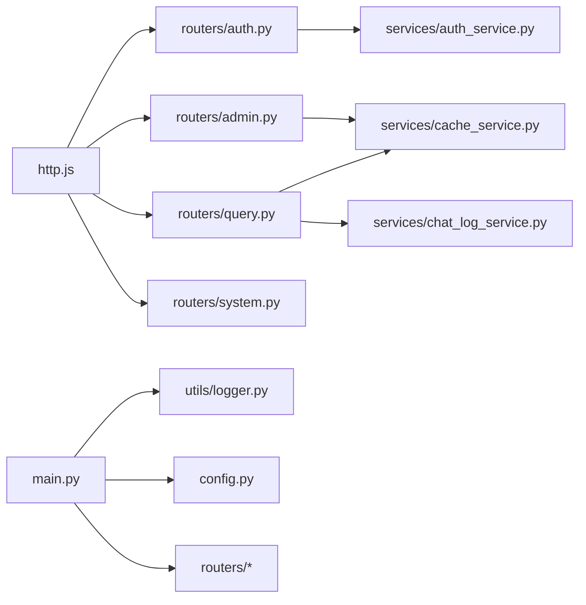

# 错误处理

<cite>
**本文引用的文件**
- [service/ai_assistant/app/utils/logger.py](file://service/ai_assistant/app/utils/logger.py)
- [service/ai_assistant/app/main.py](file://service/ai_assistant/app/main.py)
- [service/ai_assistant/app/config.py](file://service/ai_assistant/app/config.py)
- [service/ai_assistant/app/routers/auth.py](file://service/ai_assistant/app/routers/auth.py)
- [service/ai_assistant/app/routers/admin.py](file://service/ai_assistant/app/routers/admin.py)
- [service/ai_assistant/app/routers/query.py](file://service/ai_assistant/app/routers/query.py)
- [service/ai_assistant/app/routers/system.py](file://service/ai_assistant/app/routers/system.py)
- [service/ai_assistant/app/services/auth_service.py](file://service/ai_assistant/app/services/auth_service.py)
- [service/ai_assistant/app/services/cache_service.py](file://service/ai_assistant/app/services/cache_service.py)
- [service/ai_assistant/app/services/chat_log_service.py](file://service/ai_assistant/app/services/chat_log_service.py)
- [frontend/ai_assistant/src/api/http.js](file://frontend/ai_assistant/src/api/http.js)
- [frontend/ai_assistant/src/api/adminHttp.js](file://frontend/ai_assistant/src/api/adminHttp.js)
- [frontend/ai_assistant/src/stores/auth.js](file://frontend/ai_assistant/src/stores/auth.js)
- [frontend/ai_assistant/src/views/LoginView.vue](file://frontend/ai_assistant/src/views/LoginView.vue)
- [frontend/ai_assistant/src/views/AdminLoginView.vue](file://frontend/ai_assistant/src/views/AdminLoginView.vue)
</cite>

## 目录
1. [简介](#简介)
2. [项目结构](#项目结构)
3. [核心组件](#核心组件)
4. [架构总览](#架构总览)
5. [详细组件分析](#详细组件分析)
6. [依赖分析](#依赖分析)
7. [性能考虑](#性能考虑)
8. [故障排查指南](#故障排查指南)
9. [结论](#结论)
10. [附录](#附录)

## 简介
本指南面向“AI校园助手”项目的开发者与运维人员，系统化梳理后端错误处理与日志记录、前端错误处理与用户提示、异常捕获与恢复机制、常见错误场景的快速修复与预防策略，并提供日志分析方法与实用调试工具建议。文档结合仓库现有实现，给出可操作的配置与优化建议。

## 项目结构
- 后端采用 FastAPI 应用，统一通过生命周期钩子初始化日志与安全检查；路由按功能拆分（认证、管理员、查询、系统）；服务层封装业务能力（认证、缓存、日志、意图与查询执行等）；工具层提供日志与隐私工具。
- 前端使用 Vue 3 + Pinia + Axios，统一拦截器处理 401 自动登出与错误提示，视图层对典型错误状态进行用户可见的反馈。

图表来源
- [service/ai_assistant/app/main.py:1-86](file://service/ai_assistant/app/main.py#L1-L86)
- [service/ai_assistant/app/routers/auth.py:1-102](file://service/ai_assistant/app/routers/auth.py#L1-L102)
- [service/ai_assistant/app/routers/admin.py:1-388](file://service/ai_assistant/app/routers/admin.py#L1-L388)
- [service/ai_assistant/app/routers/query.py:1-788](file://service/ai_assistant/app/routers/query.py#L1-L788)
- [service/ai_assistant/app/routers/system.py:1-38](file://service/ai_assistant/app/routers/system.py#L1-L38)
- [service/ai_assistant/app/services/auth_service.py:1-253](file://service/ai_assistant/app/services/auth_service.py#L1-L253)
- [service/ai_assistant/app/services/cache_service.py:1-177](file://service/ai_assistant/app/services/cache_service.py#L1-L177)
- [service/ai_assistant/app/services/chat_log_service.py:1-76](file://service/ai_assistant/app/services/chat_log_service.py#L1-L76)
- [service/ai_assistant/app/utils/logger.py:1-53](file://service/ai_assistant/app/utils/logger.py#L1-L53)
- [service/ai_assistant/app/config.py:1-113](file://service/ai_assistant/app/config.py#L1-L113)
- [frontend/ai_assistant/src/api/http.js:1-49](file://frontend/ai_assistant/src/api/http.js#L1-L49)
- [frontend/ai_assistant/src/api/adminHttp.js:1-44](file://frontend/ai_assistant/src/api/adminHttp.js#L1-L44)
- [frontend/ai_assistant/src/stores/auth.js:1-77](file://frontend/ai_assistant/src/stores/auth.js#L1-L77)
- [frontend/ai_assistant/src/views/LoginView.vue:1-343](file://frontend/ai_assistant/src/views/LoginView.vue#L1-L343)
- [frontend/ai_assistant/src/views/AdminLoginView.vue:1-261](file://frontend/ai_assistant/src/views/AdminLoginView.vue#L1-L261)

章节来源
- [service/ai_assistant/app/main.py:1-86](file://service/ai_assistant/app/main.py#L1-L86)
- [frontend/ai_assistant/src/api/http.js:1-49](file://frontend/ai_assistant/src/api/http.js#L1-L49)

## 核心组件
- 日志系统：统一使用 Loguru，控制台与文件双通道输出，文件按大小滚动与时间保留，格式包含时间、级别、位置与消息。
- 错误与异常：后端通过 HTTPException 抛出标准 HTTP 状态码与详情；部分业务异常自定义为业务错误类型，便于路由层映射到合适的 HTTP 状态码。
- 前端错误处理：Axios 拦截器统一处理 401 自动登出；页面视图根据响应状态展示用户可理解的错误提示。
- 安全与配置：应用启动时检查不安全默认配置并发出警告；CORS 通过配置项灵活控制。

章节来源
- [service/ai_assistant/app/utils/logger.py:1-53](file://service/ai_assistant/app/utils/logger.py#L1-L53)
- [service/ai_assistant/app/routers/auth.py:1-102](file://service/ai_assistant/app/routers/auth.py#L1-L102)
- [service/ai_assistant/app/routers/admin.py:1-388](file://service/ai_assistant/app/routers/admin.py#L1-L388)
- [service/ai_assistant/app/routers/query.py:1-788](file://service/ai_assistant/app/routers/query.py#L1-L788)
- [frontend/ai_assistant/src/api/http.js:1-49](file://frontend/ai_assistant/src/api/http.js#L1-L49)
- [frontend/ai_assistant/src/views/LoginView.vue:1-343](file://frontend/ai_assistant/src/views/LoginView.vue#L1-L343)

## 架构总览
后端错误处理与日志的关键流转如下：
- 应用启动：初始化日志与安全检查，注册路由与中间件。
- 路由层：接收请求，进行参数校验与鉴权，调用服务层执行业务逻辑。
- 服务层：执行具体业务（认证、缓存、日志、意图与查询），出现异常向上抛出或转换为 HTTP 状态码。
- 前端：Axios 统一拦截响应错误，401 自动登出并跳转登录页；页面视图根据状态码展示用户提示。

图表来源
- [frontend/ai_assistant/src/views/LoginView.vue:94-121](file://frontend/ai_assistant/src/views/LoginView.vue#L94-L121)
- [frontend/ai_assistant/src/stores/auth.js:28-43](file://frontend/ai_assistant/src/stores/auth.js#L28-L43)
- [frontend/ai_assistant/src/api/http.js:36-47](file://frontend/ai_assistant/src/api/http.js#L36-L47)
- [service/ai_assistant/app/routers/auth.py:24-52](file://service/ai_assistant/app/routers/auth.py#L24-L52)
- [service/ai_assistant/app/services/auth_service.py:125-169](file://service/ai_assistant/app/services/auth_service.py#L125-L169)
- [service/ai_assistant/app/utils/logger.py:17-46](file://service/ai_assistant/app/utils/logger.py#L17-L46)

## 详细组件分析

### 后端错误与异常处理
- HTTP 状态码映射
  - 400：参数无效、密码修改失败（旧密码不正确、新旧密码相同、加密数据无效）、查询请求缺少有效载荷。
  - 401：认证失败（学号/密码无效、管理员账号不可用）。
  - 403：管理员账号不可用。
  - 404：资源不存在（如课表记录不存在）。
  - 502：上游服务/媒体处理/查询执行失败。
- 业务异常
  - 密码修改异常：通过自定义异常携带原因码，路由层映射为不同 400 场景。
  - 安全与隐私：检测危险内容与隐私违规，按策略返回干预提示或阻断。
- 日志记录
  - 统一 INFO/WARNING/ERROR 等级，包含时间、级别、模块与行号、消息，便于定位问题。

章节来源
- [service/ai_assistant/app/routers/auth.py:41-99](file://service/ai_assistant/app/routers/auth.py#L41-L99)
- [service/ai_assistant/app/routers/admin.py:63-72](file://service/ai_assistant/app/routers/admin.py#L63-L72)
- [service/ai_assistant/app/routers/admin.py:322-326](file://service/ai_assistant/app/routers/admin.py#L322-L326)
- [service/ai_assistant/app/routers/query.py:237-260](file://service/ai_assistant/app/routers/query.py#L237-L260)
- [service/ai_assistant/app/routers/query.py:544-549](file://service/ai_assistant/app/routers/query.py#L544-L549)
- [service/ai_assistant/app/services/auth_service.py:21-27](file://service/ai_assistant/app/services/auth_service.py#L21-L27)
- [service/ai_assistant/app/utils/logger.py:17-46](file://service/ai_assistant/app/utils/logger.py#L17-L46)

### 前端错误处理与用户提示
- Axios 统一拦截器
  - 请求：自动附加 Bearer Token。
  - 响应：401 自动清理本地认证状态并跳转登录页。
- 页面视图
  - 登录页：根据后端返回状态码展示“学号或密码错误”、“账号不可用”等用户可理解提示。
  - 管理员登录页：区分 401/403 提示不同错误原因。
- 状态管理
  - 登录成功写入本地存储；登出时清除令牌与过期时间。

章节来源
- [frontend/ai_assistant/src/api/http.js:18-47](file://frontend/ai_assistant/src/api/http.js#L18-L47)
- [frontend/ai_assistant/src/api/adminHttp.js:20-41](file://frontend/ai_assistant/src/api/adminHttp.js#L20-L41)
- [frontend/ai_assistant/src/views/LoginView.vue:110-121](file://frontend/ai_assistant/src/views/LoginView.vue#L110-L121)
- [frontend/ai_assistant/src/views/AdminLoginView.vue:91-105](file://frontend/ai_assistant/src/views/AdminLoginView.vue#L91-L105)
- [frontend/ai_assistant/src/stores/auth.js:58-76](file://frontend/ai_assistant/src/stores/auth.js#L58-L76)

### 日志分析与关键信息解读
- 日志格式
  - 时间：精确到毫秒，便于时间线分析。
  - 级别：INFO/WARNING/ERROR，用于快速识别严重程度。
  - 位置：模块名与函数名、行号，便于定位代码路径。
  - 消息：包含关键上下文（如 did、session_id、状态码、耗时等）。
- 关键日志信息
  - 认证与会话：令牌签发、解码、角色校验、登录成功/失败。
  - 查询链路：收到请求、多模态解析、缓存命中/未命中、意图分类、执行阶段、流式生成进度、最终缓存与日志持久化。
  - 管理员操作：状态变更、版本号递增、缓存失效策略。
- 分析方法
  - 时间戳分析：定位请求开始/结束与各阶段耗时，识别慢点。
  - 错误频率统计：按状态码与消息关键字聚合，发现重复错误与热点问题。
  - 堆栈跟踪：结合异常捕获与日志上下文，还原调用链。

章节来源
- [service/ai_assistant/app/utils/logger.py:28-43](file://service/ai_assistant/app/utils/logger.py#L28-L43)
- [service/ai_assistant/app/routers/query.py:217-225](file://service/ai_assistant/app/routers/query.py#L217-L225)
- [service/ai_assistant/app/routers/query.py:288-312](file://service/ai_assistant/app/routers/query.py#L288-L312)
- [service/ai_assistant/app/routers/query.py:688-706](file://service/ai_assistant/app/routers/query.py#L688-L706)
- [service/ai_assistant/app/routers/admin.py:369-380](file://service/ai_assistant/app/routers/admin.py#L369-L380)

### 常见错误场景与快速修复
- 401 未授权
  - 学生登录：学号或密码错误；检查前端加密流程与后端解密逻辑一致性。
  - 管理员登录：账号不可用；检查账户状态与权限。
- 400 参数无效
  - 密码修改：旧密码不正确、新旧相同、加密数据无效；检查前端加密与后端解密是否一致。
  - 查询请求：缺少文本/图片/音频任一有效载荷；补充必填字段。
- 502 上游失败
  - 图片/音频处理失败；检查媒体服务可用性与超时设置。
  - 查询执行失败；检查数据库连接、LLM 服务与缓存可用性。
- 缓存与历史
  - Redis 不可用导致回退与降级；检查 Redis 连接与容量。
  - 会话历史写入失败不影响主流程，但需关注异常日志。

章节来源
- [service/ai_assistant/app/routers/auth.py:41-99](file://service/ai_assistant/app/routers/auth.py#L41-L99)
- [service/ai_assistant/app/routers/query.py:237-260](file://service/ai_assistant/app/routers/query.py#L237-L260)
- [service/ai_assistant/app/routers/query.py:544-549](file://service/ai_assistant/app/routers/query.py#L544-L549)
- [service/ai_assistant/app/routers/admin.py:369-380](file://service/ai_assistant/app/routers/admin.py#L369-L380)

### 异常捕获与错误恢复机制
- 后端
  - 路由层捕获业务异常并映射为 HTTP 状态码与明确详情。
  - 服务层在关键路径记录异常日志，必要时进行降级（如 Redis 失败回退数据库）。
  - 应用生命周期：启动时检查不安全默认配置并告警；关闭时释放 Redis 连接池。
- 前端
  - Axios 拦截器统一处理 401 自动登出，避免用户停留在受保护页面。
  - 页面视图根据状态码展示用户可理解的提示，减少恐慌与重复尝试。

章节来源
- [service/ai_assistant/app/main.py:25-49](file://service/ai_assistant/app/main.py#L25-L49)
- [service/ai_assistant/app/routers/query.py:328-342](file://service/ai_assistant/app/routers/query.py#L328-L342)
- [frontend/ai_assistant/src/api/http.js:36-47](file://frontend/ai_assistant/src/api/http.js#L36-L47)

### 错误监控与告警配置建议
- 日志采集
  - 使用集中式日志系统收集后端日志文件与控制台输出。
  - 前端可通过埋点上报关键错误事件（如 401、502）与用户行为。
- 告警规则
  - 401/403/400 异常率突增；502/超时占比上升；Redis/数据库连接失败次数。
  - 关键接口 P95/P99 延迟异常；缓存命中率骤降。
- 可视化
  - 仪表板展示错误趋势、Top 错误、错误分布与响应时间分布。

（本节为通用实践建议，无需特定文件引用）

## 依赖分析
- 组件耦合
  - 路由层依赖服务层；服务层依赖配置与日志工具；前端 Axios 依赖路由层接口。
- 外部依赖
  - Redis：缓存与版本控制；数据库：会话历史与用户数据；LLM/媒体服务：查询与多模态处理。
- 循环依赖
  - 未发现明显循环导入；日志工具在应用入口初始化，供各模块使用。

图表来源
- [frontend/ai_assistant/src/api/http.js:1-49](file://frontend/ai_assistant/src/api/http.js#L1-L49)
- [service/ai_assistant/app/routers/auth.py:1-102](file://service/ai_assistant/app/routers/auth.py#L1-L102)
- [service/ai_assistant/app/routers/query.py:1-788](file://service/ai_assistant/app/routers/query.py#L1-L788)
- [service/ai_assistant/app/routers/admin.py:1-388](file://service/ai_assistant/app/routers/admin.py#L1-L388)
- [service/ai_assistant/app/routers/system.py:1-38](file://service/ai_assistant/app/routers/system.py#L1-L38)
- [service/ai_assistant/app/services/auth_service.py:1-253](file://service/ai_assistant/app/services/auth_service.py#L1-L253)
- [service/ai_assistant/app/services/cache_service.py:1-177](file://service/ai_assistant/app/services/cache_service.py#L1-L177)
- [service/ai_assistant/app/services/chat_log_service.py:1-76](file://service/ai_assistant/app/services/chat_log_service.py#L1-L76)
- [service/ai_assistant/app/main.py:1-86](file://service/ai_assistant/app/main.py#L1-L86)
- [service/ai_assistant/app/utils/logger.py:1-53](file://service/ai_assistant/app/utils/logger.py#L1-L53)
- [service/ai_assistant/app/config.py:1-113](file://service/ai_assistant/app/config.py#L1-L113)

章节来源
- [service/ai_assistant/app/main.py:1-86](file://service/ai_assistant/app/main.py#L1-L86)
- [service/ai_assistant/app/routers/query.py:1-788](file://service/ai_assistant/app/routers/query.py#L1-L788)

## 性能考虑
- 流式响应与连接池
  - 流式生成阶段提前回滚数据库会话，避免长时间占用连接。
  - SSE 响应头设置防止反向代理缓冲与改写，提升实时性。
- 缓存策略
  - 敏感/普通查询分别设置不同 TTL；日期敏感与课表敏感查询按版本与日期桶失效，避免脏数据。
- 并发与降级
  - 安全检查与意图重写并行执行，缩短总耗时。
  - Redis 失败时回退数据库历史，保障可用性。

章节来源
- [service/ai_assistant/app/routers/query.py:654-658](file://service/ai_assistant/app/routers/query.py#L654-L658)
- [service/ai_assistant/app/routers/query.py:115-125](file://service/ai_assistant/app/routers/query.py#L115-L125)
- [service/ai_assistant/app/services/cache_service.py:85-89](file://service/ai_assistant/app/services/cache_service.py#L85-L89)
- [service/ai_assistant/app/routers/query.py:347-352](file://service/ai_assistant/app/routers/query.py#L347-L352)
- [service/ai_assistant/app/routers/query.py:328-342](file://service/ai_assistant/app/routers/query.py#L328-L342)

## 故障排查指南
- 快速定位
  - 按时间线查看日志，确认请求进入时间、各阶段耗时与最终状态。
  - 关注 WARNING/ERROR 级别日志，优先处理高频错误。
- 常见问题与步骤
  - 401：检查前端加密与后端解密一致性、令牌过期与角色校验。
  - 502：检查媒体服务、数据库与 LLM 服务可用性；查看 Redis 连接与容量。
  - 缓存异常：核对键格式、版本号与日期桶策略；观察缓存命中率变化。
- 前端排查
  - 401 自动登出：确认拦截器生效与路由跳转逻辑。
  - 用户提示：检查页面对状态码的分支处理与文案一致性。

章节来源
- [service/ai_assistant/app/utils/logger.py:17-46](file://service/ai_assistant/app/utils/logger.py#L17-L46)
- [frontend/ai_assistant/src/api/http.js:36-47](file://frontend/ai_assistant/src/api/http.js#L36-L47)
- [frontend/ai_assistant/src/views/LoginView.vue:110-121](file://frontend/ai_assistant/src/views/LoginView.vue#L110-L121)

## 结论
本项目在后端实现了统一的日志与错误处理机制，前端具备基础的 401 自动登出与用户提示能力。通过合理的缓存策略、并发优化与降级设计，系统在多数异常场景下仍能保持稳定运行。建议进一步完善集中式日志与告警体系，持续优化用户体验与可观测性。

## 附录

### HTTP 状态码与业务错误对照
- 400
  - 密码修改：旧密码不正确、新旧相同、加密数据无效。
  - 查询：缺少有效载荷。
- 401
  - 认证失败：学号/密码无效；管理员账号不可用。
- 403
  - 管理员账号不可用。
- 404
  - 课表记录不存在。
- 502
  - 图片/音频处理失败；查询执行失败。

章节来源
- [service/ai_assistant/app/routers/auth.py:41-99](file://service/ai_assistant/app/routers/auth.py#L41-L99)
- [service/ai_assistant/app/routers/admin.py:63-72](file://service/ai_assistant/app/routers/admin.py#L63-L72)
- [service/ai_assistant/app/routers/admin.py:322-326](file://service/ai_assistant/app/routers/admin.py#L322-L326)
- [service/ai_assistant/app/routers/query.py:237-260](file://service/ai_assistant/app/routers/query.py#L237-L260)
- [service/ai_assistant/app/routers/query.py:544-549](file://service/ai_assistant/app/routers/query.py#L544-L549)

### 日志字段与解读要点
- 关键字段
  - 时间：用于时间线分析与延迟定位。
  - 级别：快速识别严重程度。
  - 模块/函数/行号：定位代码路径。
  - 消息：包含 did、session_id、状态码、耗时、意图等上下文。
- 解读技巧
  - 聚合统计：按状态码与消息关键字统计频率，识别热点。
  - 堆栈跟踪：结合异常捕获与上下文，还原调用链。

章节来源
- [service/ai_assistant/app/utils/logger.py:28-43](file://service/ai_assistant/app/utils/logger.py#L28-L43)
- [service/ai_assistant/app/routers/query.py:217-225](file://service/ai_assistant/app/routers/query.py#L217-L225)