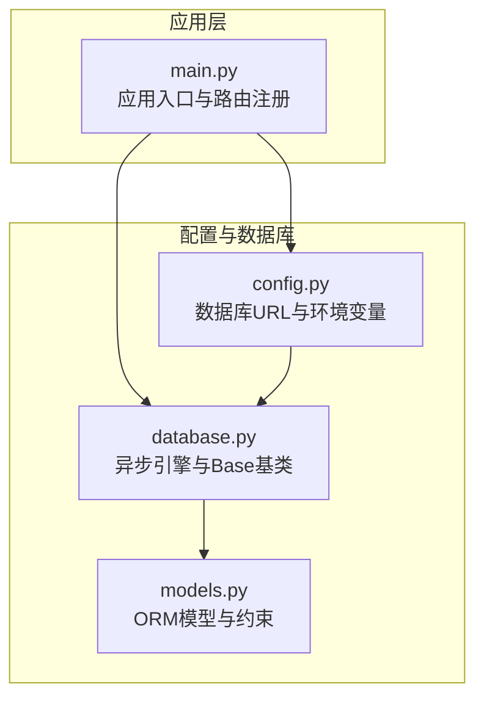
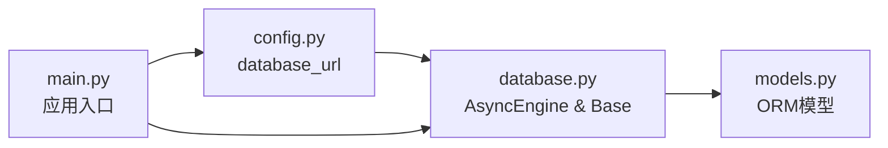

# 关系映射与约束

<cite>
**本文引用的文件**
- [models.py](file://service/ai_assistant/app/models/models.py)
- [database.py](file://service/ai_assistant/app/database.py)
- [config.py](file://service/ai_assistant/app/config.py)
- [main.py](file://service/ai_assistant/app/main.py)
</cite>

## 目录
1. [简介](#简介)
2. [项目结构](#项目结构)
3. [核心组件](#核心组件)
4. [架构总览](#架构总览)
5. [详细组件分析](#详细组件分析)
6. [依赖分析](#依赖分析)
7. [性能考量](#性能考量)
8. [故障排查指南](#故障排查指南)
9. [结论](#结论)
10. [附录](#附录)

## 简介
本文件面向数据库管理员与开发人员，系统化梳理“AI校园助手”项目的数据库关系映射与约束设计，覆盖：
- 表间的主外键关系与引用完整性约束
- 级联更新与删除策略
- 复杂关系（多对多中间表、自引用）的设计与实现
- 约束类型（唯一、检查、非空）与索引策略
- 数据一致性与完整性保障机制
- 关系维护与性能优化建议

## 项目结构
后端采用 FastAPI + SQLAlchemy ORM（异步），数据库模型集中定义于 models.py，通过 database.py 中的 Base 类进行声明式建模；数据库连接与会话管理由 config.py 提供的 settings.database_url 统一注入。



图表来源
- [main.py:1-86](file://service/ai_assistant/app/main.py#L1-L86)
- [config.py:85-91](file://service/ai_assistant/app/config.py#L85-L91)
- [database.py:1-35](file://service/ai_assistant/app/database.py#L1-L35)
- [models.py:1-22](file://service/ai_assistant/app/models/models.py#L1-L22)

章节来源
- [main.py:1-86](file://service/ai_assistant/app/main.py#L1-L86)
- [config.py:85-91](file://service/ai_assistant/app/config.py#L85-L91)
- [database.py:1-35](file://service/ai_assistant/app/database.py#L1-L35)
- [models.py:1-22](file://service/ai_assistant/app/models/models.py#L1-L22)

## 核心组件
本项目使用 SQLAlchemy ORM 的 DeclarativeBase 基类，所有业务实体均继承该基类并以 mapped_column 定义字段与约束。关键约束包括：
- 主键：primary_key=True 或复合主键（如排课-班级映射）
- 外键：ForeignKey("父表.父列", onupdate=..., ondelete=...)
- 唯一约束：UniqueConstraint(...)
- 检查约束：CheckConstraint("条件", name="ck_...")
- 索引：Index("idx_...", "列1", "列2", ...)

章节来源
- [models.py:6-22](file://service/ai_assistant/app/models/models.py#L6-L22)
- [database.py:23-24](file://service/ai_assistant/app/database.py#L23-L24)

## 架构总览
下图展示数据库层的ER关系与约束概览，涵盖实体、主外键、唯一与检查约束、以及典型索引位点。

```mermaid
erDiagram
ADMIN_USER ||--o{ ADMIN_ACTION_LOG : "审计记录"
ADMIN_USER ||--o{ SCHEDULE : "更新者"
ADMIN_USER ||--o{ SCHEDULE_ADJUSTMENT : "申请人"
ADMIN_USER ||--o{ SCHEDULE_ADJUSTMENT : "审批人"
ADMIN_USER ||--o{ SCHEDULE_CLASS_MAP : "创建者"
DEPARTMENT ||--o{ MAJOR : "拥有"
MAJOR ||--o{ CLASS : "拥有"
DEPARTMENT ||--o{ TEACHER : "所属"
CLASS ||--o{ STUDENT : "包含"
CLASS ||--o{ SCHEDULE_CLASS_MAP : "被映射"
TEACHER ||--o{ SCHEDULE : "授课"
COURSE ||--o{ SCHEDULE : "安排"
TERM ||--o{ SCHEDULE : "学期"
CLASSROOM ||--o{ SCHEDULE : "使用"
STUDENT ||--o{ ENROLLMENT : "选课"
COURSE ||--o{ ENROLLMENT : "被选"
TERM ||--o{ ENROLLMENT : "适用"
STUDENT ||--o{ SCORE : "获得成绩"
COURSE ||--o{ SCORE : "被评分"
TERM ||--o{ SCORE : "对应学期"
SCHEDULE ||--o{ SCHEDULE_ADJUSTMENT : "触发调整"
SCHEDULE ||--o{ SCHEDULE_CLASS_MAP : "映射班级"
```

图表来源
- [models.py:41-84](file://service/ai_assistant/app/models/models.py#L41-L84)
- [models.py:117-149](file://service/ai_assistant/app/models/models.py#L117-L149)
- [models.py:155-174](file://service/ai_assistant/app/models/models.py#L155-L174)
- [models.py:180-201](file://service/ai_assistant/app/models/models.py#L180-L201)
- [models.py:207-226](file://service/ai_assistant/app/models/models.py#L207-L226)
- [models.py:237-264](file://service/ai_assistant/app/models/models.py#L237-L264)
- [models.py:277-299](file://service/ai_assistant/app/models/models.py#L277-L299)
- [models.py:312-340](file://service/ai_assistant/app/models/models.py#L312-L340)
- [models.py:345-367](file://service/ai_assistant/app/models/models.py#L345-L367)
- [models.py:372-402](file://service/ai_assistant/app/models/models.py#L372-L402)
- [models.py:412-480](file://service/ai_assistant/app/models/models.py#L412-L480)
- [models.py:485-514](file://service/ai_assistant/app/models/models.py#L485-L514)
- [models.py:534-623](file://service/ai_assistant/app/models/models.py#L534-L623)

## 详细组件分析

### 管理员与审计（AdminUser 与 AdminActionLog）
- AdminUser：主键 admin_id；唯一约束 admin_code、username；角色与状态枚举；索引 idx_admin_role_status。
- AdminActionLog：主键 action_log_id；外键 admin_id 引用 admin_user.admin_id，onupdate=CASCADE；索引 idx_action_admin_time、idx_action_target。
- 级联策略：管理员记录更新时，审计日志按外键约束保持引用完整；删除策略未在该表显式声明，默认行为取决于数据库方言。

章节来源
- [models.py:41-84](file://service/ai_assistant/app/models/models.py#L41-L84)
- [models.py:86-112](file://service/ai_assistant/app/models/models.py#L86-L112)

### 院系-专业-班级（Department-Major-Class）
- Department：主键 dept_id；唯一约束 name。
- Major：主键 major_id；外键 dept_id 引用 department.dept_id，onupdate=CASCADE；唯一约束 (dept_id, name)；索引 idx_major_dept_id。
- Class：主键 class_id；外键 major_id 引用 major.major_id，onupdate=CASCADE；唯一约束 (major_id, grade, name)；索引 idx_class_major_id。
- 设计要点：自上而下的层级外键链路，确保删除/更新遵循级联策略；唯一约束避免重复组合。

章节来源
- [models.py:117-149](file://service/ai_assistant/app/models/models.py#L117-L149)
- [models.py:155-174](file://service/ai_assistant/app/models/models.py#L155-L174)

### 教师（Teacher）
- 主键 teacher_id；外键 dept_id 引用 department.dept_id，onupdate=CASCADE；索引 idx_teacher_dept_id。
- 设计要点：教师归属院系，更新院系主键时自动级联更新教师记录。

章节来源
- [models.py:180-201](file://service/ai_assistant/app/models/models.py#L180-L201)

### 学期（Term）
- 主键 term_id；检查约束 start_date < end_date。
- 关联：Enrollment、Score、Schedule、ScheduleAdjustment。

章节来源
- [models.py:207-226](file://service/ai_assistant/app/models/models.py#L207-L226)

### 课程（Course）
- 主键 course_id；检查约束 credit > 0；索引 idx_course_course_name。
- 关联：Enrollment、Score、Schedule。

章节来源
- [models.py:237-264](file://service/ai_assistant/app/models/models.py#L237-L264)

### 教室（Classroom）
- 主键 room_id；检查约束 capacity > 0；索引 idx_classroom_location。
- 关联：Schedule。

章节来源
- [models.py:277-299](file://service/ai_assistant/app/models/models.py#L277-L299)

### 学生（Student）
- 主键 student_id；外键 class_id 引用 class.class_id，onupdate=CASCADE；索引 idx_student_class_id、idx_student_enroll_year。
- 关联：Enrollment、Score。

章节来源
- [models.py:312-340](file://service/ai_assistant/app/models/models.py#L312-L340)

### 选课（Enrollment）
- 主键 enrollment_id；外键 student_id、course_id、term_id；唯一约束 (student_id, course_id, term_id)；索引 idx_enrollment_course_term。
- 设计要点：三元唯一性防止重复选课；与 Term 协同限定学期范围。

章节来源
- [models.py:345-367](file://service/ai_assistant/app/models/models.py#L345-L367)

### 成绩（Score）
- 主键 score_id；外键 student_id、course_id、term_id；唯一约束 (student_id, course_id, term_id)；检查约束 0 ≤ score ≤ 100。
- 设计要点：唯一约束与分数范围检查共同保证成绩数据的唯一性与合理性。

章节来源
- [models.py:372-402](file://service/ai_assistant/app/models/models.py#L372-L402)

### 课程安排（Schedule）
- 主键 schedule_id；外键 course_id、teacher_id、room_id、term_id；版本号 version；可空更新者 updated_by_admin_id；索引覆盖 term+course、term+teacher+时间、term+room+时间、term+status+时间。
- 检查约束：星期取值范围、节次顺序、周次范围。
- 设计要点：多维索引支持高频查询；版本号用于并发控制与回滚；更新者可为空以保留历史轨迹。

章节来源
- [models.py:412-480](file://service/ai_assistant/app/models/models.py#L412-L480)

### 排课-班级映射（ScheduleClassMap）
- 复合主键 (schedule_id, class_id)；外键 schedule_id 引用 schedule.schedule_id，onupdate=CASCADE, ondelete=CASCADE；外键 class_id 引用 class.class_id，onupdate=CASCADE；索引 idx_scm_class、idx_scm_class_schedule。
- 设计要点：多对多关系通过中间表实现；删除排课时级联删除映射，确保数据一致性。

章节来源
- [models.py:485-514](file://service/ai_assistant/app/models/models.py#L485-L514)

### 调课申请（ScheduleAdjustment）
- 主键 adjustment_id；外键 schedule_id、term_id；操作类型与状态枚举；请求/审批/执行时间戳；可空 rollback_of_adjustment_id 自引用，onupdate=CASCADE, ondelete=SET NULL。
- 检查约束：旧/新时间参数范围与逻辑一致性。
- 设计要点：自引用处理回滚；状态机驱动流程；多维索引支撑查询。

章节来源
- [models.py:534-623](file://service/ai_assistant/app/models/models.py#L534-L623)

### 对话日志（ChatLog）
- 主键 log_id；索引 idx_did_timestamp、idx_system_action、idx_student_id。
- 设计要点：按对话ID与时间序列索引便于检索与统计。

章节来源
- [models.py:641-660](file://service/ai_assistant/app/models/models.py#L641-L660)

## 依赖分析
- 运行时依赖：FastAPI 应用通过 main.py 注册路由；数据库引擎与会话工厂在 database.py 中创建；config.py 提供数据库URL。
- 模型依赖：所有 ORM 模型继承自 database.Base，统一由 SQLAlchemy 管理元数据与约束。



图表来源
- [config.py:85-91](file://service/ai_assistant/app/config.py#L85-L91)
- [database.py:7-24](file://service/ai_assistant/app/database.py#L7-L24)
- [models.py:22](file://service/ai_assistant/app/models/models.py#L22)
- [main.py:12-14](file://service/ai_assistant/app/main.py#L12-L14)

章节来源
- [config.py:85-91](file://service/ai_assistant/app/config.py#L85-L91)
- [database.py:7-24](file://service/ai_assistant/app/database.py#L7-L24)
- [models.py:22](file://service/ai_assistant/app/models/models.py#L22)
- [main.py:12-14](file://service/ai_assistant/app/main.py#L12-L14)

## 性能考量
- 索引策略
  - 管理员：按角色与状态过滤，idx_admin_role_status 支持高效筛选。
  - 院系/专业/班级：按 dept_id、major_id 过滤，索引加速层级查询。
  - 教师：按 dept_id 过滤，索引加速教师列表。
  - 课程/教室：按名称/location 过滤，索引提升检索效率。
  - 学生：按 class_id、enroll_year 过滤，索引支持分班与学年统计。
  - 选课/成绩：按 course_id+term_id 过滤，索引支撑课程维度统计。
  - 排课：多维时间维度索引覆盖 term+course、term+teacher+time、term+room+time、term+status+time，满足排课冲突与报表场景。
  - 审计：按 admin_id+created_at、target_table+target_pk+created_at 索引，支持审计追踪。
  - 调课：按 term+status+requested_at、schedule_id+requested_at、requested_by_admin_id+requested_at 索引，支撑工作流查询。
  - 对话：按 did+timestamp、system_action、student_id 索引，支持对话检索与风控。
- 约束与检查
  - 日期范围、学分、容量、分数区间、周次与节次范围等检查约束，减少异常数据进入。
  - 唯一约束（用户、部门名、专业(院系, 名称)、班级(专业, 年级, 名称)、选课三元、成绩三元）保证业务语义唯一性。
- 级联策略
  - 多数外键 onupdate=CASCADE，确保主键变更时自动同步子表。
  - 排课-班级映射 ondelete=CASCADE，删除排课即删除映射，避免悬挂数据。
  - 调课自引用 ondelete=SET NULL，允许回滚记录独立存在。
  - 更新者字段 ondelete=SET NULL，保留历史轨迹。
- 连接与会话
  - 异步引擎与会话池配置，echo 可用于调试；生产环境建议关闭 echo。

章节来源
- [models.py:59-63](file://service/ai_assistant/app/models/models.py#L59-L63)
- [models.py:143-146](file://service/ai_assistant/app/models/models.py#L143-L146)
- [models.py:165-168](file://service/ai_assistant/app/models/models.py#L165-L168)
- [models.py:194](file://service/ai_assistant/app/models/models.py#L194)
- [models.py:252-255](file://service/ai_assistant/app/models/models.py#L252-L255)
- [models.py:292-295](file://service/ai_assistant/app/models/models.py#L292-L295)
- [models.py:330-333](file://service/ai_assistant/app/models/models.py#L330-L333)
- [models.py:359-362](file://service/ai_assistant/app/models/models.py#L359-L362)
- [models.py:391-397](file://service/ai_assistant/app/models/models.py#L391-L397)
- [models.py:443-465](file://service/ai_assistant/app/models/models.py#L443-L465)
- [models.py:45-96](file://service/ai_assistant/app/models/models.py#L45-L96)
- [models.py:490-502](file://service/ai_assistant/app/models/models.py#L490-L502)
- [models.py:591-609](file://service/ai_assistant/app/models/models.py#L591-L609)
- [models.py:655-659](file://service/ai_assistant/app/models/models.py#L655-L659)
- [database.py:7-20](file://service/ai_assistant/app/database.py#L7-L20)

## 故障排查指南
- 外键约束错误
  - 现象：插入/更新失败，提示违反外键约束。
  - 排查：确认父表记录是否存在；若启用 onupdate=CASCADE，请先更新父表主键再更新子表。
  - 参考：各表外键定义与 onupdate/ondelete 策略。
- 唯一约束冲突
  - 现象：重复提交导致唯一约束冲突。
  - 排查：核对唯一约束组合（如管理员 code/username、部门名、专业(院系, 名称)、班级(专业, 年级, 名称)、选课三元、成绩三元）。
  - 参考：各表 __table_args__ 中的 UniqueConstraint(...)。
- 检查约束失败
  - 现象：插入/更新因检查约束失败。
  - 排查：核对日期范围、学分、容量、分数区间、周次与节次范围等。
  - 参考：Term、Course、Classroom、Score、Schedule、ScheduleAdjustment 的 CheckConstraint(...)。
- 级联删除影响
  - 现象：删除排课导致班级映射被删除。
  - 说明：排课-班级映射 ondelete=CASCADE，属预期行为。
  - 参考：ScheduleClassMap 的外键定义。
- 审计与回溯
  - 现象：需要定位管理员操作与变更记录。
  - 措施：利用 AdminActionLog 的索引位点与 AdminUser 的审计关系进行查询。
  - 参考：AdminUser.action_logs 与 AdminActionLog 的索引。

章节来源
- [models.py:59-63](file://service/ai_assistant/app/models/models.py#L59-L63)
- [models.py:143-146](file://service/ai_assistant/app/models/models.py#L143-L146)
- [models.py:165-168](file://service/ai_assistant/app/models/models.py#L165-L168)
- [models.py:214-216](file://service/ai_assistant/app/models/models.py#L214-L216)
- [models.py:252-255](file://service/ai_assistant/app/models/models.py#L252-L255)
- [models.py:292-295](file://service/ai_assistant/app/models/models.py#L292-L295)
- [models.py:391-397](file://service/ai_assistant/app/models/models.py#L391-L397)
- [models.py:490-502](file://service/ai_assistant/app/models/models.py#L490-L502)
- [models.py:443-465](file://service/ai_assistant/app/models/models.py#L443-L465)
- [models.py:591-609](file://service/ai_assistant/app/models/models.py#L591-L609)
- [models.py:86-112](file://service/ai_assistant/app/models/models.py#L86-L112)

## 结论
本项目通过清晰的实体划分、严谨的主外键与约束设计、完善的索引策略与合理的级联规则，构建了高一致性与高性能的校园教务数据模型。管理员可依据本文档的关系图与约束清单进行日常维护与优化，确保系统稳定运行。

## 附录
- 数据库连接配置
  - 数据库URL由 config.py 的 database_url 属性拼装，使用 aiomysql 驱动。
- 异步会话
  - database.py 提供 AsyncSessionLocal 与 get_db 上下文管理器，确保会话生命周期可控。

章节来源
- [config.py:85-91](file://service/ai_assistant/app/config.py#L85-L91)
- [database.py:7-20](file://service/ai_assistant/app/database.py#L7-L20)
- [database.py:27-35](file://service/ai_assistant/app/database.py#L27-L35)