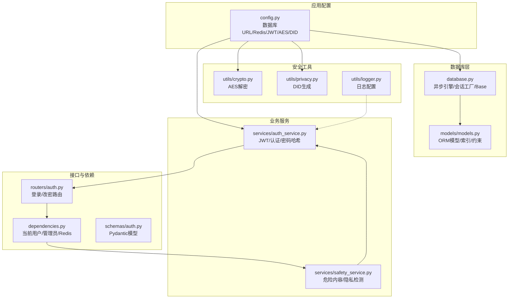
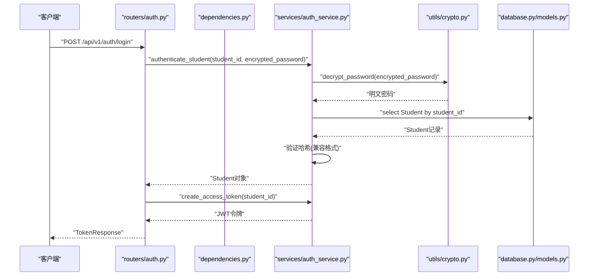
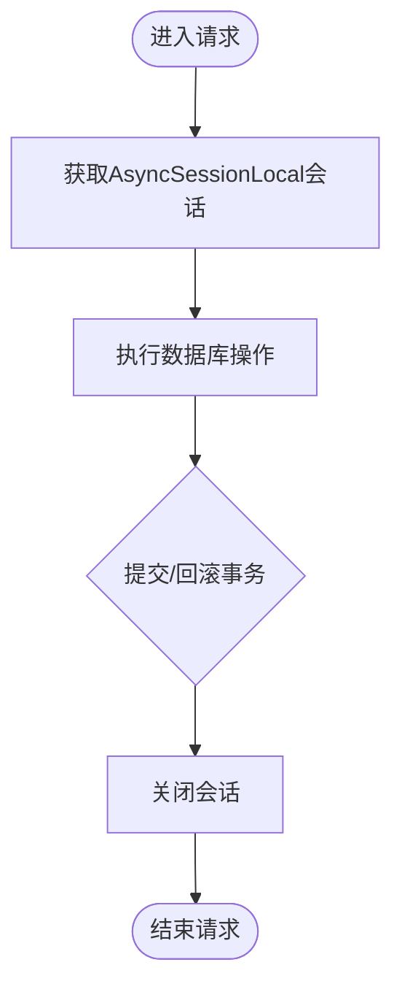
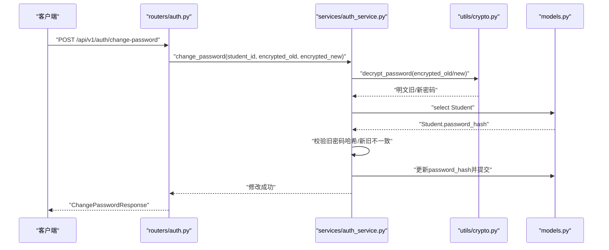
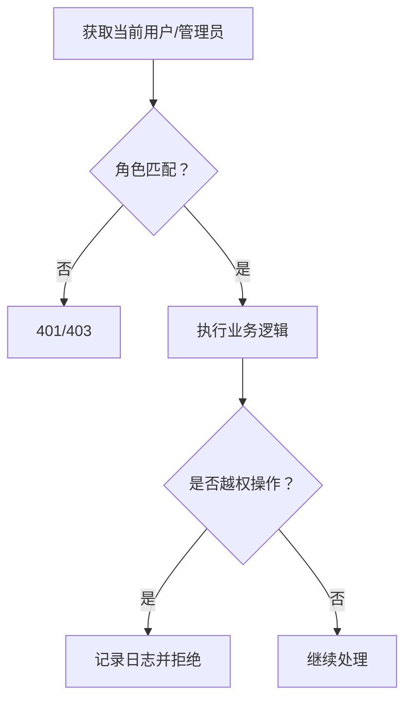
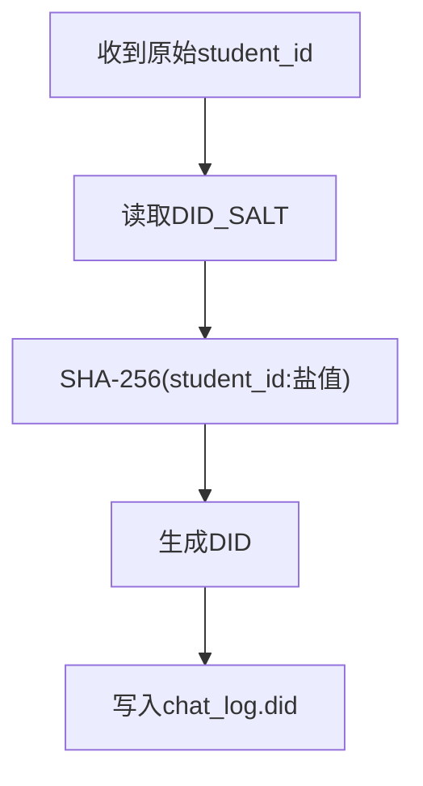
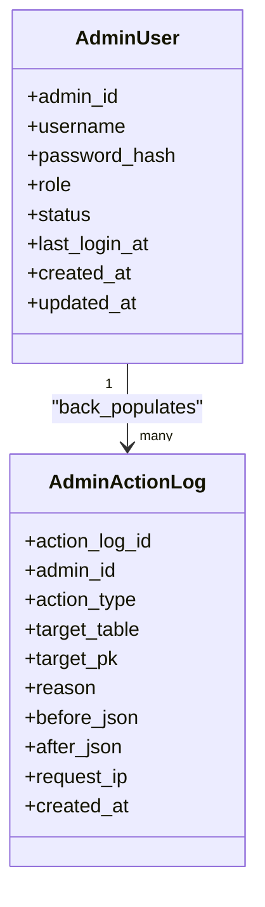
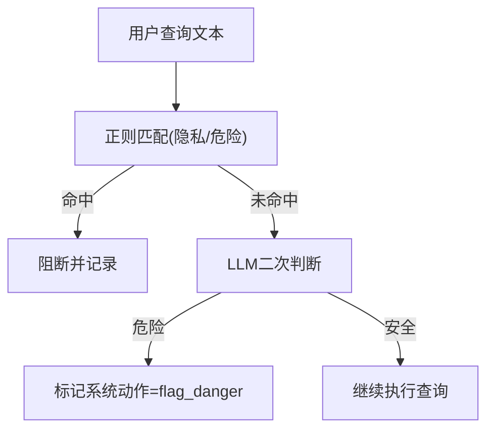
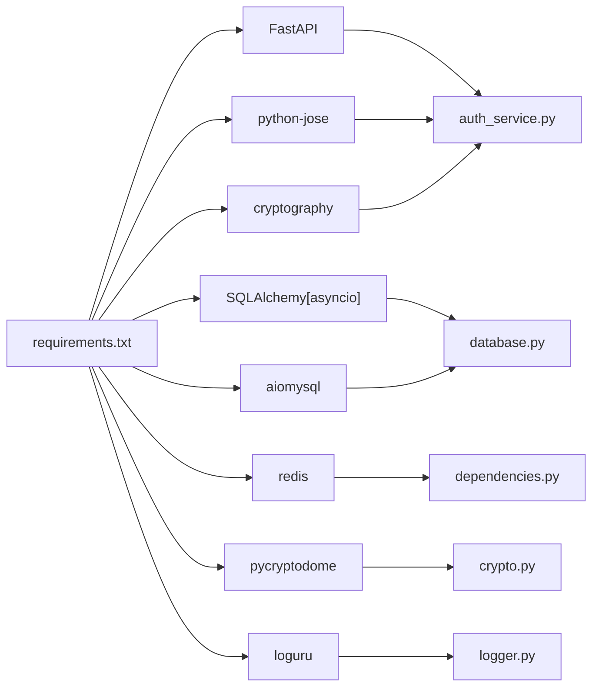

# 数据库安全策略

<cite>
**本文引用的文件**
- [service/ai_assistant/app/config.py](file://service/ai_assistant/app/config.py)
- [service/ai_assistant/app/database.py](file://service/ai_assistant/app/database.py)
- [service/ai_assistant/app/utils/crypto.py](file://service/ai_assistant/app/utils/crypto.py)
- [service/ai_assistant/app/utils/privacy.py](file://service/ai_assistant/app/utils/privacy.py)
- [service/ai_assistant/app/utils/logger.py](file://service/ai_assistant/app/utils/logger.py)
- [service/ai_assistant/app/models/models.py](file://service/ai_assistant/app/models/models.py)
- [service/ai_assistant/app/services/auth_service.py](file://service/ai_assistant/app/services/auth_service.py)
- [service/ai_assistant/app/routers/auth.py](file://service/ai_assistant/app/routers/auth.py)
- [service/ai_assistant/app/dependencies.py](file://service/ai_assistant/app/dependencies.py)
- [service/ai_assistant/app/schemas/auth.py](file://service/ai_assistant/app/schemas/auth.py)
- [service/ai_assistant/app/services/safety_service.py](file://service/ai_assistant/app/services/safety_service.py)
- [service/ai_assistant/app/routers/query.py](file://service/ai_assistant/app/routers/query.py)
- [service/ai_assistant/requirements.txt](file://service/ai_assistant/requirements.txt)
</cite>

## 目录
1. [引言](#引言)
2. [项目结构](#项目结构)
3. [核心组件](#核心组件)
4. [架构总览](#架构总览)
5. [详细组件分析](#详细组件分析)
6. [依赖分析](#依赖分析)
7. [性能考虑](#性能考虑)
8. [故障排查指南](#故障排查指南)
9. [结论](#结论)
10. [附录](#附录)

## 引言
本文件面向数据库管理员与安全工程师，系统化阐述AI校园助手项目的数据库安全策略与实现。重点覆盖以下方面：
- 敏感数据保护：密码哈希、传输加密、隐私数据脱敏
- 行级数据安全：用户权限控制与访问限制
- SQL注入防护：参数化查询与ORM使用
- 数据脱敏与隐私保护最佳实践
- 数据库审计日志与监控
- 数据备份与恢复安全策略
- 安全漏洞防护与合规要求
- 安全配置指南

## 项目结构
后端采用FastAPI + SQLAlchemy 2.x异步ORM + aiomysql驱动，数据库连接池与会话管理集中于配置与工厂模块；安全相关逻辑分布在认证、依赖注入、服务层与工具模块。

图表来源
- [service/ai_assistant/app/config.py:85-112](file://service/ai_assistant/app/config.py#L85-L112)
- [service/ai_assistant/app/database.py:7-35](file://service/ai_assistant/app/database.py#L7-L35)
- [service/ai_assistant/app/models/models.py:1-660](file://service/ai_assistant/app/models/models.py#L1-L660)
- [service/ai_assistant/app/utils/crypto.py:17-72](file://service/ai_assistant/app/utils/crypto.py#L17-L72)
- [service/ai_assistant/app/utils/privacy.py:9-22](file://service/ai_assistant/app/utils/privacy.py#L9-L22)
- [service/ai_assistant/app/utils/logger.py:17-53](file://service/ai_assistant/app/utils/logger.py#L17-L53)
- [service/ai_assistant/app/services/auth_service.py:29-253](file://service/ai_assistant/app/services/auth_service.py#L29-L253)
- [service/ai_assistant/app/services/safety_service.py:84-162](file://service/ai_assistant/app/services/safety_service.py#L84-L162)
- [service/ai_assistant/app/routers/auth.py:24-102](file://service/ai_assistant/app/routers/auth.py#L24-L102)
- [service/ai_assistant/app/dependencies.py:27-109](file://service/ai_assistant/app/dependencies.py#L27-L109)
- [service/ai_assistant/app/schemas/auth.py:4-56](file://service/ai_assistant/app/schemas/auth.py#L4-L56)

章节来源
- [service/ai_assistant/app/config.py:1-113](file://service/ai_assistant/app/config.py#L1-L113)
- [service/ai_assistant/app/database.py:1-35](file://service/ai_assistant/app/database.py#L1-L35)

## 核心组件
- 配置与连接
  - 数据库URL由配置拼装，启用连接预 ping 与回收，调试模式下开启SQL回显。
  - Redis连接通过配置统一管理，便于缓存与限流等安全功能扩展。
- 安全工具
  - AES-CBC解密：前端以CryptoJS加密密码传输，后端使用共享密钥解密，确保传输链路安全。
  - DID脱敏：基于学生ID与盐值生成固定哈希，用于对话日志等场景替代真实ID。
  - 日志：统一使用Loguru，落盘到项目logs目录，便于审计与取证。
- 认证与授权
  - JWT签发与校验：支持学生与管理员两种角色令牌，路由层通过依赖注入校验并解析。
  - 密码哈希：兼容多种格式，避免明文存储，支持迁移与兼容策略。
- 隐私与安全检测
  - 查询前隐私检查：阻断越权查询他人学号的行为。
  - 危险内容检测：结合正则与大模型，识别潜在风险并采取相应系统动作。

章节来源
- [service/ai_assistant/app/config.py:85-112](file://service/ai_assistant/app/config.py#L85-L112)
- [service/ai_assistant/app/utils/crypto.py:17-72](file://service/ai_assistant/app/utils/crypto.py#L17-L72)
- [service/ai_assistant/app/utils/privacy.py:9-22](file://service/ai_assistant/app/utils/privacy.py#L9-L22)
- [service/ai_assistant/app/utils/logger.py:17-53](file://service/ai_assistant/app/utils/logger.py#L17-L53)
- [service/ai_assistant/app/services/auth_service.py:29-253](file://service/ai_assistant/app/services/auth_service.py#L29-L253)
- [service/ai_assistant/app/services/safety_service.py:84-162](file://service/ai_assistant/app/services/safety_service.py#L84-L162)

## 架构总览
下图展示从路由到服务、模型与数据库的调用链路，以及安全控制点。

图表来源
- [service/ai_assistant/app/routers/auth.py:24-52](file://service/ai_assistant/app/routers/auth.py#L24-L52)
- [service/ai_assistant/app/services/auth_service.py:125-170](file://service/ai_assistant/app/services/auth_service.py#L125-L170)
- [service/ai_assistant/app/utils/crypto.py:39-72](file://service/ai_assistant/app/utils/crypto.py#L39-L72)
- [service/ai_assistant/app/database.py:27-35](file://service/ai_assistant/app/database.py#L27-L35)
- [service/ai_assistant/app/models/models.py:312-340](file://service/ai_assistant/app/models/models.py#L312-L340)

## 详细组件分析

### 组件A：数据库连接与会话管理
- 异步引擎与会话工厂：使用SQLAlchemy异步引擎与工厂，开启pool_pre_ping与pool_recycle，降低连接失效风险；DEBUG模式下echo输出SQL，便于开发调试。
- Base模型：统一ORM基类，确保所有表继承一致的元数据与行为。
- 会话生命周期：通过上下文管理器确保会话正确关闭，避免资源泄漏。

图表来源
- [service/ai_assistant/app/database.py:27-35](file://service/ai_assistant/app/database.py#L27-L35)

章节来源
- [service/ai_assistant/app/database.py:7-35](file://service/ai_assistant/app/database.py#L7-L35)

### 组件B：密码传输加密与存储哈希
- 传输加密：前端使用CryptoJS AES-CBC加密密码，后端使用共享密钥解密，避免明文在网络中传输。
- 存储哈希：数据库保存密码哈希，兼容多种格式，支持迁移与向前兼容；变更密码时重新计算哈希并持久化。
- 改密流程：旧密码解密与哈希校验，新旧密码一致性检查，防止重复使用相同密码。

图表来源
- [service/ai_assistant/app/routers/auth.py:55-102](file://service/ai_assistant/app/routers/auth.py#L55-L102)
- [service/ai_assistant/app/services/auth_service.py:173-210](file://service/ai_assistant/app/services/auth_service.py#L173-L210)
- [service/ai_assistant/app/utils/crypto.py:39-72](file://service/ai_assistant/app/utils/crypto.py#L39-L72)
- [service/ai_assistant/app/models/models.py:312-340](file://service/ai_assistant/app/models/models.py#L312-L340)

章节来源
- [service/ai_assistant/app/utils/crypto.py:17-72](file://service/ai_assistant/app/utils/crypto.py#L17-L72)
- [service/ai_assistant/app/services/auth_service.py:29-210](file://service/ai_assistant/app/services/auth_service.py#L29-L210)
- [service/ai_assistant/app/schemas/auth.py:23-43](file://service/ai_assistant/app/schemas/auth.py#L23-L43)

### 组件C：行级数据安全与权限控制
- 角色与令牌：JWT区分student/admin两类角色，路由层通过依赖注入解析并校验令牌。
- 管理员状态：管理员登录时检查状态，非active状态拒绝访问。
- 路由级权限：改密路由强制当前用户与目标用户一致，防止越权修改他人密码。
- 查询隐私控制：在查询流水线中检测越权查询他人学号的行为，阻断并记录。

图表来源
- [service/ai_assistant/app/dependencies.py:56-109](file://service/ai_assistant/app/dependencies.py#L56-L109)
- [service/ai_assistant/app/routers/auth.py:66-70](file://service/ai_assistant/app/routers/auth.py#L66-L70)
- [service/ai_assistant/app/services/safety_service.py:147-162](file://service/ai_assistant/app/services/safety_service.py#L147-L162)

章节来源
- [service/ai_assistant/app/dependencies.py:56-109](file://service/ai_assistant/app/dependencies.py#L56-L109)
- [service/ai_assistant/app/routers/auth.py:66-70](file://service/ai_assistant/app/routers/auth.py#L66-L70)
- [service/ai_assistant/app/services/safety_service.py:147-162](file://service/ai_assistant/app/services/safety_service.py#L147-L162)

### 组件D：SQL注入防护与参数化查询
- ORM与参数化：所有数据库查询通过SQLAlchemy ORM与select构建，自动参数化绑定，避免手写SQL拼接。
- 约束与索引：模型层定义唯一约束、检查约束与复合索引，减少歧义与绕过可能。
- 输入校验：Pydantic模型对请求体进行字段校验与兼容处理，降低异常输入风险。

章节来源
- [service/ai_assistant/app/models/models.py:1-660](file://service/ai_assistant/app/models/models.py#L1-L660)
- [service/ai_assistant/app/schemas/auth.py:4-56](file://service/ai_assistant/app/schemas/auth.py#L4-L56)
- [service/ai_assistant/app/routers/auth.py:24-102](file://service/ai_assistant/app/routers/auth.py#L24-L102)

### 组件E：数据脱敏与隐私保护
- DID脱敏：对话日志表使用DID替代真实student_id，保证历史关联能力的同时保护隐私。
- 前端脱敏：格式化工具对学号进行中间部分掩码显示，降低信息泄露风险。
- 提示词约束：安全与自然语言转换提示词明确禁止暴露数据库字段名与越权查询。

图表来源
- [service/ai_assistant/app/utils/privacy.py:9-22](file://service/ai_assistant/app/utils/privacy.py#L9-L22)
- [service/ai_assistant/app/models/models.py:641-660](file://service/ai_assistant/app/models/models.py#L641-L660)

章节来源
- [service/ai_assistant/app/utils/privacy.py:9-22](file://service/ai_assistant/app/utils/privacy.py#L9-L22)
- [service/ai_assistant/app/models/models.py:641-660](file://service/ai_assistant/app/models/models.py#L641-L660)

### 组件F：数据库审计日志与监控
- 日志配置：统一使用Loguru，控制台与文件双通道输出，文件按大小滚动与保留天数策略。
- 审计事件：管理员操作日志表记录操作类型、目标表/主键、前后快照、IP等，便于追踪与复盘。
- 关键路径日志：认证、改密、查询、安全检测等关键流程均记录详细上下文。

图表来源
- [service/ai_assistant/app/models/models.py:86-112](file://service/ai_assistant/app/models/models.py#L86-L112)
- [service/ai_assistant/app/utils/logger.py:17-53](file://service/ai_assistant/app/utils/logger.py#L17-L53)

章节来源
- [service/ai_assistant/app/models/models.py:86-112](file://service/ai_assistant/app/models/models.py#L86-L112)
- [service/ai_assistant/app/utils/logger.py:17-53](file://service/ai_assistant/app/utils/logger.py#L17-L53)

### 组件G：危险内容与隐私检测
- 危险内容检测：正则与大模型双重策略，优先放行公共服务联系方式查询，其余交由LLM综合判断。
- 隐私检测：识别越权查询他人学号的行为，阻断并记录，同时向用户友好提示。

图表来源
- [service/ai_assistant/app/services/safety_service.py:84-162](file://service/ai_assistant/app/services/safety_service.py#L84-L162)
- [service/ai_assistant/app/routers/query.py:344-369](file://service/ai_assistant/app/routers/query.py#L344-L369)

章节来源
- [service/ai_assistant/app/services/safety_service.py:84-162](file://service/ai_assistant/app/services/safety_service.py#L84-L162)
- [service/ai_assistant/app/routers/query.py:344-369](file://service/ai_assistant/app/routers/query.py#L344-L369)

## 依赖分析
- 外部依赖与版本
  - FastAPI、SQLAlchemy异步、aiomysql、Redis、JWTS、Cryptography、PyCryptodome、Loguru等。
  - 依赖版本集中在requirements.txt，确保安全与兼容性。
- 组件耦合
  - 认证服务依赖配置、加密工具与模型；路由依赖认证服务与依赖注入；安全服务独立于数据库，通过提示词与正则实现。

图表来源
- [service/ai_assistant/requirements.txt:1-22](file://service/ai_assistant/requirements.txt#L1-L22)
- [service/ai_assistant/app/services/auth_service.py:11-18](file://service/ai_assistant/app/services/auth_service.py#L11-L18)
- [service/ai_assistant/app/utils/crypto.py:11-14](file://service/ai_assistant/app/utils/crypto.py#L11-L14)
- [service/ai_assistant/app/utils/logger.py:11-11](file://service/ai_assistant/app/utils/logger.py#L11-L11)

章节来源
- [service/ai_assistant/requirements.txt:1-22](file://service/ai_assistant/requirements.txt#L1-L22)

## 性能考虑
- 连接池与回收：启用pool_pre_ping与pool_recycle，降低连接失效导致的重试成本。
- 异步IO：使用SQLAlchemy异步引擎与FastAPI异步路由，提升并发吞吐。
- 索引与约束：模型层合理建立索引与检查约束，减少查询扫描与异常数据。
- 缓存与TTL：配置敏感数据缓存TTL，平衡性能与安全。

## 故障排查指南
- 认证失败
  - 检查AES密钥长度与URL安全编码；确认前端加密格式与后端解密一致。
  - 核对JWT密钥、算法与过期时间；确认令牌角色与路由期望一致。
- 密码修改失败
  - 核对旧密码哈希校验与新旧不一致检查；确认数据库提交成功。
- 越权访问
  - 确认当前用户与目标用户一致；检查管理员状态是否active。
- 日志定位
  - 查看logs目录下的运行日志文件，定位异常堆栈与关键上下文。

章节来源
- [service/ai_assistant/app/utils/crypto.py:17-72](file://service/ai_assistant/app/utils/crypto.py#L17-L72)
- [service/ai_assistant/app/services/auth_service.py:29-253](file://service/ai_assistant/app/services/auth_service.py#L29-L253)
- [service/ai_assistant/app/utils/logger.py:17-53](file://service/ai_assistant/app/utils/logger.py#L17-L53)

## 结论
本项目通过“传输加密+存储哈希+行级权限+参数化查询+隐私检测+审计日志”的组合拳，构建了较为完善的数据库安全体系。建议在生产环境中进一步完善数据库凭据管理、网络隔离、定期渗透测试与合规评估，持续加固安全防线。

## 附录
- 安全配置清单
  - 数据库凭据：使用只读/受限账号执行应用连接；定期轮换密码。
  - Redis凭据：启用密码认证与网络隔离；限制命令集。
  - JWT密钥：高强度随机密钥，妥善保管；定期轮换。
  - AES密钥：与前端保持一致，严格保密；定期轮换。
  - 日志保留：按法规要求设定保留周期，定期归档。
- 合规建议
  - 数据最小化：仅收集必要信息；对非必要字段脱敏。
  - 用户同意：明确隐私政策与数据处理范围。
  - 数据主体权利：提供访问、更正、删除与可携带权支持。
  - 安全审计：定期审查访问日志与异常行为。