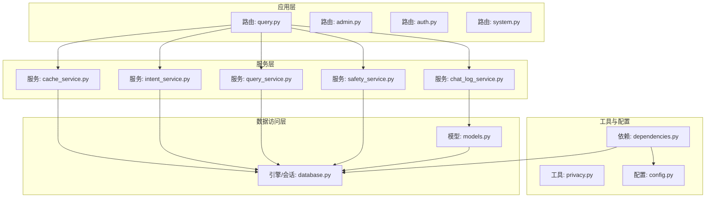
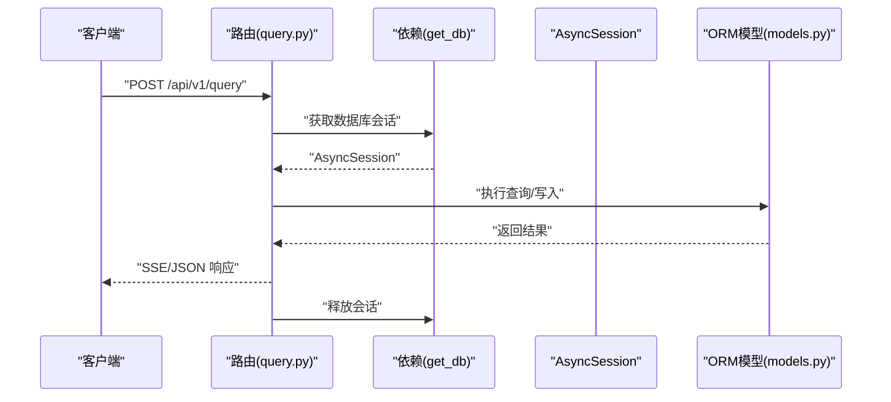
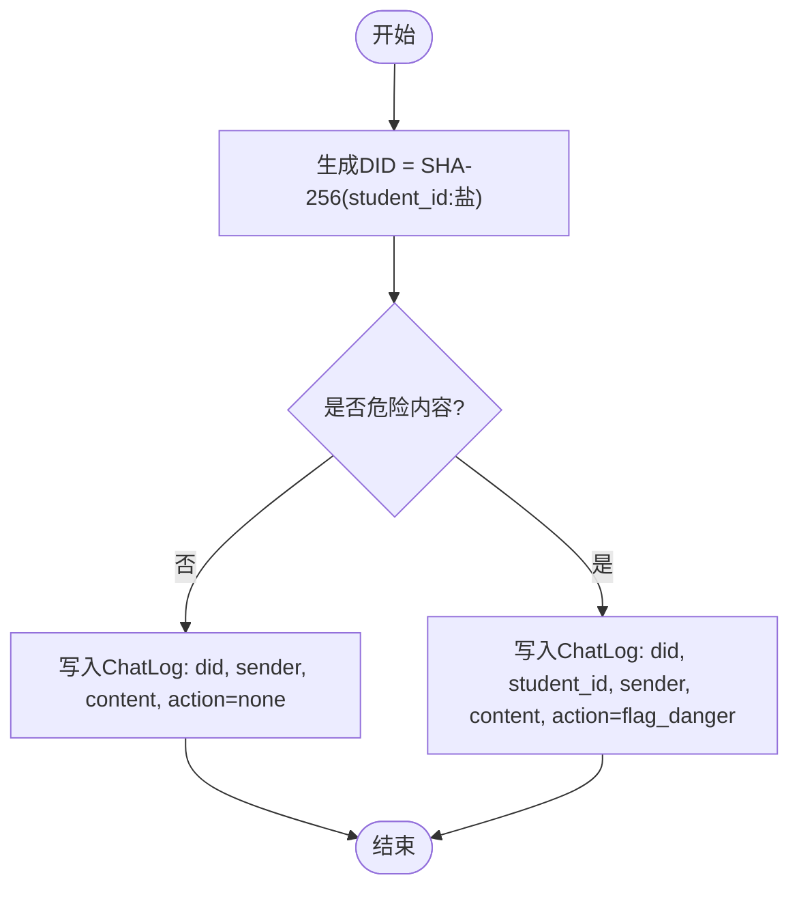
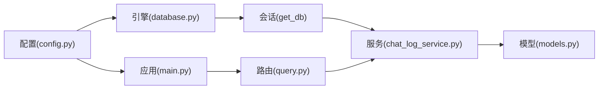

# 数据库设计

<cite>
**本文引用的文件**
- [models.py](file://service/ai_assistant/app/models/models.py)
- [database.py](file://service/ai_assistant/app/database.py)
- [config.py](file://service/ai_assistant/app/config.py)
- [privacy.py](file://service/ai_assistant/app/utils/privacy.py)
- [chat_log_service.py](file://service/ai_assistant/app/services/chat_log_service.py)
- [query.py](file://service/ai_assistant/app/routers/query.py)
- [dependencies.py](file://service/ai_assistant/app/dependencies.py)
- [main.py](file://service/ai_assistant/app/main.py)
</cite>

## 目录
1. [简介](#简介)
2. [项目结构](#项目结构)
3. [核心组件](#核心组件)
4. [架构总览](#架构总览)
5. [详细组件分析](#详细组件分析)
6. [依赖分析](#依赖分析)
7. [性能考虑](#性能考虑)
8. [故障排查指南](#故障排查指南)
9. [结论](#结论)
10. [附录](#附录)

## 简介
本文件面向数据库管理员与开发者，系统化梳理“AI校园助手”项目的数据库设计与实现要点，覆盖以下方面：
- 数据库整体架构与表结构设计
- 实体关系映射、外键约束与索引策略
- 每个核心数据表的字段定义、数据类型与约束
- 数据访问层（ORM模型、查询方法、连接管理）
- 数据安全与隐私保护机制
- 数据库迁移与版本管理建议
- 备份、恢复与性能优化最佳实践
- 面向DBA与开发者的完整操作指南

## 项目结构
后端采用 FastAPI + SQLAlchemy Async ORM + MySQL（aiomysql）+ Redis 的技术栈。数据库模型集中于 models 层，连接与会话管理位于 database 层，配置项由 config 提供，隐私与日志服务分别在 utils 与 services 层实现。



图表来源
- [query.py](file://service/ai_assistant/app/routers/query.py)
- [chat_log_service.py](file://service/ai_assistant/app/services/chat_log_service.py)
- [models.py](file://service/ai_assistant/app/models/models.py)
- [database.py](file://service/ai_assistant/app/database.py)
- [config.py](file://service/ai_assistant/app/config.py)
- [dependencies.py](file://service/ai_assistant/app/dependencies.py)

章节来源
- [main.py:1-86](file://service/ai_assistant/app/main.py#L1-L86)
- [config.py:1-113](file://service/ai_assistant/app/config.py#L1-L113)
- [database.py:1-35](file://service/ai_assistant/app/database.py#L1-L35)
- [models.py:1-660](file://service/ai_assistant/app/models/models.py#L1-L660)
- [dependencies.py:1-109](file://service/ai_assistant/app/dependencies.py#L1-L109)
- [privacy.py:1-23](file://service/ai_assistant/app/utils/privacy.py#L1-L23)
- [chat_log_service.py:1-76](file://service/ai_assistant/app/services/chat_log_service.py#L1-L76)
- [query.py:1-788](file://service/ai_assistant/app/routers/query.py#L1-L788)

## 核心组件
- 数据库引擎与会话管理：使用 SQLAlchemy Async Engine + async_sessionmaker，开启 pre_ping 与连接回收，提供异步上下文管理的 get_db 依赖。
- ORM 模型：集中定义在 models.py，涵盖管理员、院系、专业、班级、教师、学期、课程、教室、学生、选课、成绩、课程安排、排课-班级映射、调课单、对话日志等。
- 隐私与安全：通过 DID（去标识化标识）替代真实学号存储；危险内容拦截与记录；管理员审计日志。
- 数据访问与查询：服务层封装常用读写操作；路由层协调多模态输入、意图分类、缓存与日志持久化。

章节来源
- [database.py:1-35](file://service/ai_assistant/app/database.py#L1-L35)
- [models.py:1-660](file://service/ai_assistant/app/models/models.py#L1-L660)
- [privacy.py:1-23](file://service/ai_assistant/app/utils/privacy.py#L1-L23)
- [chat_log_service.py:1-76](file://service/ai_assistant/app/services/chat_log_service.py#L1-L76)
- [query.py:1-788](file://service/ai_assistant/app/routers/query.py#L1-L788)

## 架构总览
下图展示数据库层与业务层的交互关系，重点体现对话日志、管理员审计与核心业务实体之间的关联。

```mermaid
erDiagram
ADMIN_USER ||--o{ ADMIN_ACTION_LOG : "记录"
ADMIN_USER ||--o{ SCHEDULE : "更新"
ADMIN_USER ||--o{ SCHEDULE_CLASS_MAP : "创建"
ADMIN_USER ||--o{ SCHEDULE_ADJUSTMENT : "申请/审批"
DEPARTMENT ||--o{ MAJOR : "拥有"
DEPARTMENT ||--o{ TEACHER : "归属"
MAJOR ||--o{ CLASS : "拥有"
CLASS ||--o{ STUDENT : "容纳"
CLASS ||--o{ SCHEDULE_CLASS_MAP : "映射"
TEACHER ||--o{ SCHEDULE : "授课"
COURSE ||--o{ SCHEDULE : "对应"
TERM ||--o{ SCHEDULE : "所属"
CLASSROOM ||--o{ SCHEDULE : "使用"
STUDENT ||--o{ ENROLLMENT : "选课"
COURSE ||--o{ ENROLLMENT : "开课"
TERM ||--o{ ENROLLMENT : "学期"
STUDENT ||--o{ SCORE : "获得"
COURSE ||--o{ SCORE : "计分"
TERM ||--o{ SCORE : "记录"
SCHEDULE ||--o{ SCHEDULE_ADJUSTMENT : "变更"
SCHEDULE ||--o{ SCHEDULE_CLASS_MAP : "关联"
CHAT_LOG }o--|| STUDENT : "匿名关联(DID)"
```

图表来源
- [models.py:41-660](file://service/ai_assistant/app/models/models.py#L41-L660)

## 详细组件分析

### 数据库连接与会话管理
- 引擎配置：使用 settings.database_url 构造 MySQL(aiomysql) 异步连接，启用 pool_pre_ping 与 pool_recycle，DEBUG=true时开启SQL回显。
- 会话工厂：AsyncSessionLocal 默认不自动提交/刷新，expire_on_commit=False，减少ORM状态管理开销。
- 依赖注入：get_db 提供异步上下文管理，确保请求生命周期内正确释放会话。



图表来源
- [query.py:207-745](file://service/ai_assistant/app/routers/query.py#L207-L745)
- [dependencies.py:27-31](file://service/ai_assistant/app/dependencies.py#L27-L31)
- [database.py:27-34](file://service/ai_assistant/app/database.py#L27-L34)

章节来源
- [config.py:85-91](file://service/ai_assistant/app/config.py#L85-L91)
- [database.py:1-35](file://service/ai_assistant/app/database.py#L1-L35)
- [dependencies.py:27-31](file://service/ai_assistant/app/dependencies.py#L27-L31)

### 隐私与安全策略
- DID 生成：对 student_id + settings.DID_SALT 做 SHA-256，得到固定长度的去标识化标识，存储于 chat_log.did。
- 日志策略：
  - 普通消息仅存储 DID，不存储真实 student_id。
  - 危险内容（如自残/暴力）记录时保留原始 student_id，并标记 system_action。
- 管理员审计：AdminActionLog 记录管理员操作类型、目标表/主键、前后快照、IP与时间，便于追踪。



图表来源
- [privacy.py:9-22](file://service/ai_assistant/app/utils/privacy.py#L9-L22)
- [chat_log_service.py:14-55](file://service/ai_assistant/app/services/chat_log_service.py#L14-L55)
- [models.py:641-660](file://service/ai_assistant/app/models/models.py#L641-L660)

章节来源
- [privacy.py:1-23](file://service/ai_assistant/app/utils/privacy.py#L1-L23)
- [chat_log_service.py:1-76](file://service/ai_assistant/app/services/chat_log_service.py#L1-L76)
- [models.py:626-660](file://service/ai_assistant/app/models/models.py#L626-L660)

### 核心数据模型与约束

#### 管理员与审计
- 表名: admin_user
- 主键: admin_id (BigInteger, 自增)
- 唯一约束: admin_code, username
- 索引: role+status
- 关系: 一对多（动作日志、更新的排课、创建的排课-班级映射、申请/审批的调课单）

- 表名: admin_action_log
- 主键: action_log_id (BigInteger, 自增)
- 外键: admin_id -> admin_user.admin_id (级联更新)
- 索引: admin_id+created_at, target_table+target_pk+created_at

章节来源
- [models.py:41-84](file://service/ai_assistant/app/models/models.py#L41-L84)
- [models.py:86-112](file://service/ai_assistant/app/models/models.py#L86-L112)

#### 院系、专业、班级
- department: dept_id (PK), name (唯一)
- major: major_id (PK), name, dept_id(FK) + 唯一约束(dept_id,name)
- class: class_id (PK), name, major_id(FK), grade + 唯一约束(major_id,grade,name)

章节来源
- [models.py:117-129](file://service/ai_assistant/app/models/models.py#L117-L129)
- [models.py:134-150](file://service/ai_assistant/app/models/models.py#L134-L150)
- [models.py:155-175](file://service/ai_assistant/app/models/models.py#L155-L175)

#### 教师
- teacher: teacher_id (PK), name, title, dept_id(FK), phone, email, office_hours, office_room
- 索引: dept_id

章节来源
- [models.py:180-202](file://service/ai_assistant/app/models/models.py#L180-L202)

#### 学期、课程、教室
- term: term_id (PK), start_date, end_date (Check: start_date < end_date)
- course: course_id (PK), course_name, credit (Check: credit > 0), course_type
- classroom: room_id (PK), room_type, location, capacity (Check: capacity > 0)

章节来源
- [models.py:207-226](file://service/ai_assistant/app/models/models.py#L207-L226)
- [models.py:237-264](file://service/ai_assistant/app/models/models.py#L237-L264)
- [models.py:277-300](file://service/ai_assistant/app/models/models.py#L277-L300)

#### 学生、选课、成绩
- student: student_id (PK), name, gender, date_of_birth, enroll_year, class_id(FK), phone, email, status, password_hash
- enrollment: enrollment_id (PK), student_id(FK), course_id(FK), term_id(FK) + 唯一约束
- score: score_id (PK), student_id(FK), course_id(FK), term_id(FK), score (Check: 0~100), credit_earned, cheating

章节来源
- [models.py:312-341](file://service/ai_assistant/app/models/models.py#L312-L341)
- [models.py:345-367](file://service/ai_assistant/app/models/models.py#L345-L367)
- [models.py:372-402](file://service/ai_assistant/app/models/models.py#L372-L402)

#### 课程安排、排课-班级映射、调课单
- schedule: schedule_id (PK), course_id(FK), teacher_id(FK), room_id(FK), term_id(FK), week_no, day_of_week, start/end_period, week_pattern, schedule_status, version, updated_by_admin_id(FK), updated_at
- schedule_class_map: 复合主键(schedule_id,class_id), created_at, created_by_admin_id(FK)
- schedule_adjustment: adjustment_id (PK), schedule_id(FK), term_id(FK), operation_type, reason, status, expected_version, old/new_* 字段, requested_by_admin_id(FK), approved_by_admin_id(FK), timestamps, conflict_snapshot

章节来源
- [models.py:412-480](file://service/ai_assistant/app/models/models.py#L412-L480)
- [models.py:485-514](file://service/ai_assistant/app/models/models.py#L485-L514)
- [models.py:534-623](file://service/ai_assistant/app/models/models.py#L534-L623)

#### 对话日志
- chat_log: log_id (PK), did, student_id(可空), timestamp, sender, message_content, system_action, response_time_ms
- 索引: did+timestamp, system_action, student_id

章节来源
- [models.py:641-660](file://service/ai_assistant/app/models/models.py#L641-L660)

### 数据访问层实现细节
- ORM模型：统一继承 Base，使用 mapped_column/relationship 定义字段与关系。
- 会话获取：通过 get_db 依赖注入，确保每个请求有独立会话并正确关闭。
- 日志服务：log_message 写入 ChatLog；get_recent_messages 按 DID 查询最近N条。
- 路由集成：query 路由在多处调用 chat_log_service，结合 Redis 会话历史与缓存。

章节来源
- [models.py:23-24](file://service/ai_assistant/app/models/models.py#L23-L24)
- [dependencies.py:27-31](file://service/ai_assistant/app/dependencies.py#L27-L31)
- [chat_log_service.py:1-76](file://service/ai_assistant/app/services/chat_log_service.py#L1-L76)
- [query.py:1-788](file://service/ai_assistant/app/routers/query.py#L1-L788)

## 依赖分析
- 配置驱动：settings.database_url 由 config 提供，决定连接参数与字符集。
- 运行时依赖：FastAPI 应用在 lifespan 中初始化日志与安全检查，注册路由与中间件。
- 会话生命周期：get_db 作为 FastAPI 依赖，贯穿请求处理链路。
- Redis 与数据库协同：查询路由在不同阶段使用 Redis 缓存与数据库历史，提升可用性与性能。



图表来源
- [config.py:85-91](file://service/ai_assistant/app/config.py#L85-L91)
- [database.py:7-20](file://service/ai_assistant/app/database.py#L7-L20)
- [dependencies.py:27-31](file://service/ai_assistant/app/dependencies.py#L27-L31)
- [chat_log_service.py:1-76](file://service/ai_assistant/app/services/chat_log_service.py#L1-L76)
- [models.py:1-660](file://service/ai_assistant/app/models/models.py#L1-L660)
- [main.py:36-49](file://service/ai_assistant/app/main.py#L36-L49)
- [query.py:1-788](file://service/ai_assistant/app/routers/query.py#L1-L788)

章节来源
- [config.py:1-113](file://service/ai_assistant/app/config.py#L1-L113)
- [main.py:1-86](file://service/ai_assistant/app/main.py#L1-L86)
- [dependencies.py:1-109](file://service/ai_assistant/app/dependencies.py#L1-L109)

## 性能考虑
- 连接池与预检：pool_pre_ping 与 pool_recycle 降低连接失效导致的错误；DEBUG 开启时便于调试但会增加日志开销。
- 索引策略：针对高频查询建立复合索引（如 schedule 的 term+course、term+teacher+时间维度），有助于排课冲突检测与查询加速。
- 缓存与降级：Redis 缓存热点查询，失败时降级至数据库历史；SSE 流式输出在事务结束后再写入日志，避免长时间占用连接。
- 会话管理：expire_on_commit=False、autoflush=False 减少ORM状态跟踪成本；按需手动提交/回滚。

章节来源
- [database.py:7-20](file://service/ai_assistant/app/database.py#L7-L20)
- [models.py:443-465](file://service/ai_assistant/app/models/models.py#L443-L465)
- [query.py:652-745](file://service/ai_assistant/app/routers/query.py#L652-L745)

## 故障排查指南
- 认证失败：确认 JWT 解析与 get_current_user 依赖是否正常；检查管理员状态与角色。
- 数据库连接异常：检查 settings.database_url、MySQL服务连通性与凭据；观察 pool_pre_ping 是否生效。
- Redis 不可用：查询路由在异常时会降级到数据库历史；清理会话缓存接口可用于定位问题。
- 危险内容拦截：若出现意外拦截，检查 safety_service 判定逻辑与 chat_log 中 system_action 标记。
- 日志缺失：确认 chat_log_service 的写入路径与 DID 生成一致性；检查索引 did+timestamp 是否合理。

章节来源
- [dependencies.py:56-107](file://service/ai_assistant/app/dependencies.py#L56-L107)
- [query.py:350-471](file://service/ai_assistant/app/routers/query.py#L350-L471)
- [chat_log_service.py:14-76](file://service/ai_assistant/app/services/chat_log_service.py#L14-L76)

## 结论
本数据库设计围绕“隐私优先、关系清晰、索引合理”的原则，结合异步ORM与缓存策略，满足校园助手的高并发与安全性需求。通过明确的实体关系、外键与约束，以及完善的日志与审计机制，既保障了数据完整性，也为后续扩展与维护提供了坚实基础。

## 附录

### 数据库迁移与版本管理建议
- 建议采用 Alembic 或类似的迁移工具，配合版本控制管理数据库结构演进。
- 迁移脚本应包含：
  - 新增/删除表与列
  - 添加/删除索引与约束
  - 修改默认值与字段类型
- 执行迁移前进行备份；在测试环境验证后再上线。

### 数据备份、恢复与性能优化最佳实践
- 备份策略：定期全量备份 + 增量备份；对 chat_log 等大表可按月分区或归档。
- 恢复演练：制定恢复流程与回滚预案，确保在故障时快速恢复。
- 性能优化：
  - 基于慢查询日志识别瓶颈，针对性添加索引或重构查询。
  - 控制单次查询返回量，必要时分页或流式输出。
  - 合理设置连接池大小与超时，避免资源争用。

### 数据库管理员与开发者操作指南
- 开发者
  - 使用 get_db 依赖获取会话；避免在长生命周期中持有连接。
  - 在服务层封装复杂查询，保持路由简洁。
- DBA
  - 监控连接池使用率与慢查询；定期分析索引使用情况。
  - 为敏感表（如 chat_log）设置访问控制与审计策略。
  - 制定备份计划与灾难恢复方案，定期演练。