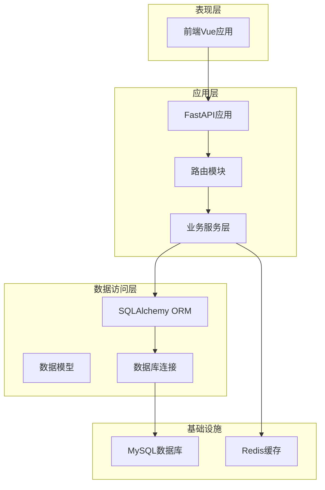
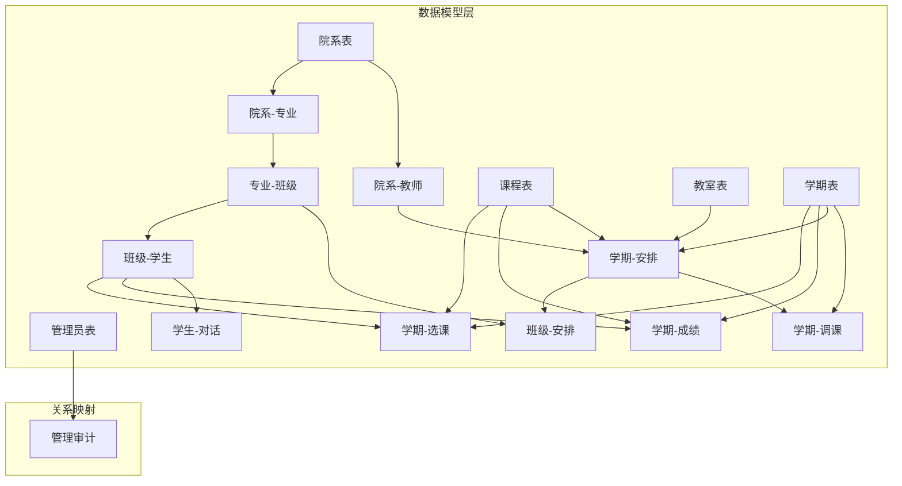
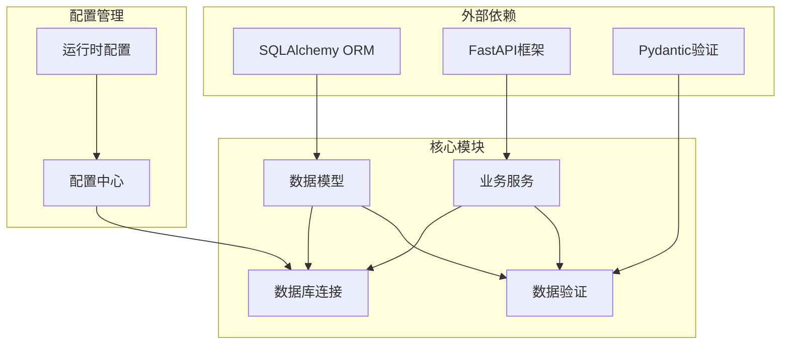
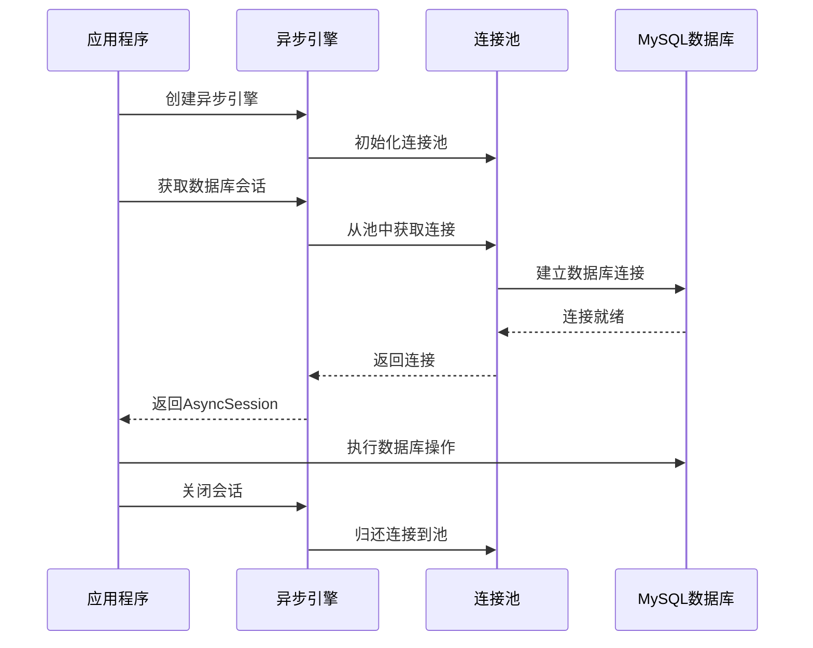
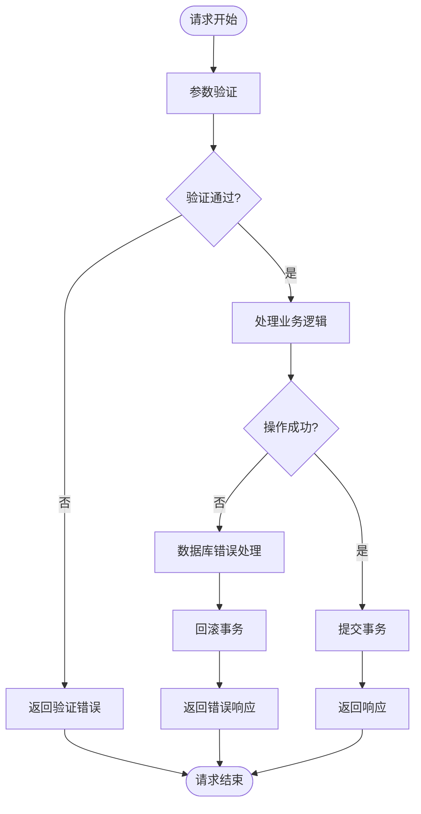

# 数据模型设计

<cite>
**本文档引用的文件**
- [models.py](file://service/ai_assistant/app/models/models.py)
- [database.py](file://service/ai_assistant/app/database.py)
- [config.py](file://service/ai_assistant/app/config.py)
- [chat_log_service.py](file://service/ai_assistant/app/services/chat_log_service.py)
- [admin.py](file://service/ai_assistant/app/schemas/admin.py)
</cite>

## 目录
1. [简介](#简介)
2. [项目结构](#项目结构)
3. [核心组件](#核心组件)
4. [架构概览](#架构概览)
5. [详细组件分析](#详细组件分析)
6. [依赖关系分析](#依赖关系分析)
7. [性能考虑](#性能考虑)
8. [故障排除指南](#故障排除指南)
9. [结论](#结论)

## 简介

AI校园助手是一个基于FastAPI和SQLAlchemy的现代化校园管理系统，专注于为学生和教师提供智能化的校园信息服务。该系统采用异步数据库连接和ORM映射，支持复杂的课程调度管理、成绩管理和对话日志追踪功能。

本数据模型设计涵盖了完整的校园生态系统，包括人员管理、课程体系、教学资源和智能交互等核心业务领域。

## 项目结构

系统采用分层架构设计，主要包含以下层次：

**图表来源**
- [main.py:1-86](file://service/ai_assistant/app/main.py#L1-L86)
- [database.py:1-35](file://service/ai_assistant/app/database.py#L1-L35)

**章节来源**
- [main.py:1-86](file://service/ai_assistant/app/main.py#L1-L86)
- [database.py:1-35](file://service/ai_assistant/app/database.py#L1-L35)

## 核心组件

系统的核心数据模型围绕五个主要实体构建：

### 1. 用户管理实体
- **管理员实体**：负责系统的整体管理
- **教师实体**：承担教学任务的人员
- **学生实体**：系统的主要服务对象

### 2. 组织架构实体  
- **院系实体**：学校组织的基本单位
- **专业实体**：学科分类和培养方向
- **班级实体**：教学的基本组织单元

### 3. 教学资源实体
- **课程实体**：教学内容和学分载体
- **教室实体**：教学活动的物理空间
- **学期实体**：教学时间周期

### 4. 业务流程实体
- **选课实体**：学生选课记录
- **成绩实体**：学习成果量化
- **课程安排实体**：教学计划执行

### 5. 系统支撑实体
- **调课单实体**：课程调整的审批流程
- **对话日志实体**：智能交互的追踪记录

**章节来源**
- [models.py:41-660](file://service/ai_assistant/app/models/models.py#L41-L660)

## 架构概览

系统采用三层架构模式，通过清晰的职责分离实现高内聚低耦合：

**图表来源**
- [models.py:41-660](file://service/ai_assistant/app/models/models.py#L41-L660)

## 详细组件分析

### 管理员表 (AdminUser)

管理员表是系统权限管理的核心，负责维护管理员账户信息和操作审计。

#### 表结构设计

| 字段名 | 数据类型 | 约束条件 | 描述 |
|--------|----------|----------|------|
| admin_id | BigInteger | 主键, 自增 | 管理员唯一标识 |
| admin_code | String(32) | 唯一, 非空 | 管理员工号 |
| username | String(64) | 唯一, 非空 | 登录用户名 |
| password_hash | String(255) | 非空 | 密码哈希值 |
| display_name | String(100) | 非空 | 显示姓名 |
| role | Enum | 非空, 默认scheduler_admin | 角色类型 |
| status | Enum | 非空, 默认active | 账户状态 |
| last_login_at | DateTime | 可空 | 最后登录时间 |
| created_at | DateTime | 非空 | 创建时间 |
| updated_at | DateTime | 非空 | 更新时间 |

#### 枚举类型定义

**管理员角色枚举 (AdminRoleEnum)**
- super_admin：超级管理员
- scheduler_admin：排课管理员  
- security_admin：安全管理员
- readonly_admin：只读管理员

**管理员状态枚举 (AdminStatusEnum)**
- active：正常
- disabled：禁用
- locked：锁定

#### 索引策略
- 唯一索引：admin_code, username
- 复合索引：role, status

#### 业务逻辑约束
- 角色权限分级管理
- 账户状态控制访问
- 操作审计追踪

**章节来源**
- [models.py:41-84](file://service/ai_assistant/app/models/models.py#L41-L84)

### 院系表 (Department)

院系表定义了学校的组织架构基础单元。

#### 表结构设计

| 字段名 | 数据类型 | 约束条件 | 描述 |
|--------|----------|----------|------|
| dept_id | String(32) | 主键 | 院系编号 |
| name | String(100) | 非空 | 院系名称 |

#### 索引策略
- 唯一索引：name

#### 关系映射
- 一对多：department → major
- 一对多：department → teacher

**章节来源**
- [models.py:117-129](file://service/ai_assistant/app/models/models.py#L117-L129)

### 专业表 (Major)

专业表描述学科分类和培养方向。

#### 表结构设计

| 字段名 | 数据类型 | 约束条件 | 描述 |
|--------|----------|----------|------|
| major_id | String(32) | 主键 | 专业编号 |
| name | String(100) | 非空 | 专业名称 |
| dept_id | String(32) | 外键, 非空 | 所属院系 |

#### 索引策略
- 唯一索引：dept_id, name
- 普通索引：dept_id

#### 关系映射
- 多对一：major → department
- 一对多：major → class

**章节来源**
- [models.py:134-150](file://service/ai_assistant/app/models/models.py#L134-L150)

### 班级表 (Class)

班级表代表教学的基本组织单元。

#### 表结构设计

| 字段名 | 数据类型 | 约束条件 | 描述 |
|--------|----------|----------|------|
| class_id | String(32) | 主键 | 班级编号 |
| name | String(100) | 非空 | 班级名称 |
| major_id | String(32) | 外键, 非空 | 所属专业 |
| grade | Integer | 非空 | 入学年级 |

#### 索引策略
- 唯一索引：major_id, grade, name
- 普通索引：major_id

#### 关系映射
- 多对一：class → major
- 一对多：class → student
- 一对多：class → schedule_mapping

**章节来源**
- [models.py:155-175](file://service/ai_assistant/app/models/models.py#L155-L175)

### 教师表 (Teacher)

教师表管理教学人员信息。

#### 表结构设计

| 字段名 | 数据类型 | 约束条件 | 描述 |
|--------|----------|----------|------|
| teacher_id | String(32) | 主键 | 教师编号 |
| name | String(100) | 非空 | 姓名 |
| title | String(50) | 可空 | 职称 |
| dept_id | String(32) | 外键, 非空 | 所属院系 |
| phone | String(20) | 可空 | 电话 |
| email | String(255) | 可空 | 邮箱 |
| office_hours | String(255) | 可空 | 办公时间 |
| office_room | String(100) | 可空 | 办公室房间号 |

#### 索引策略
- 普通索引：dept_id

#### 关系映射
- 多对一：teacher → department
- 一对多：teacher → schedule

**章节来源**
- [models.py:180-202](file://service/ai_assistant/app/models/models.py#L180-L202)

### 学生表 (Student)

学生表存储学生基本信息和状态。

#### 表结构设计

| 字段名 | 数据类型 | 约束条件 | 描述 |
|--------|----------|----------|------|
| student_id | String(32) | 主键 | 学号 |
| name | String(100) | 非空 | 姓名 |
| gender | String(10) | 非空 | 性别 |
| date_of_birth | Date | 可空 | 出生日期 |
| enroll_year | SmallInteger | 非空 | 入学年份 |
| class_id | String(32) | 外键, 非空 | 所属班级 |
| phone | String(20) | 可空 | 电话 |
| email | String(255) | 可空 | 邮箱 |
| status | Enum | 非空, 默认active | 学生状态 |
| password_hash | String(255) | 非空 | 密码哈希值 |

#### 枚举类型定义

**学生状态枚举 (StudentStatusEnum)**
- active：在读
- suspended：休学
- withdrawn：退学
- graduated：毕业

#### 索引策略
- 普通索引：class_id
- 普通索引：enroll_year

#### 关系映射
- 多对一：student → class
- 一对多：student → enrollment
- 一对多：student → score

**章节来源**
- [models.py:312-340](file://service/ai_assistant/app/models/models.py#L312-L340)

### 课程表 (Course)

课程表定义教学内容和学分信息。

#### 表结构设计

| 字段名 | 数据类型 | 约束条件 | 描述 |
|--------|----------|----------|------|
| course_id | String(32) | 主键 | 课程编号 |
| course_name | String(255) | 非空 | 课程名称 |
| credit | Integer | 非空, >0 | 学分 |
| course_type | Enum | 非空, 默认专业必修课 | 课程类型 |

#### 枚举类型定义

**课程类型枚举 (CourseTypeEnum)**
- public_required：公共必修课
- major_required：专业必修课
- major_elective：专业选修课

#### 索引策略
- 普通索引：course_name

#### 关系映射
- 一对多：course → enrollment
- 一对多：course → score
- 一对多：course → schedule

**章节来源**
- [models.py:237-264](file://service/ai_assistant/app/models/models.py#L237-L264)

### 教室表 (Classroom)

教室表管理教学活动的物理空间。

#### 表结构设计

| 字段名 | 数据类型 | 约束条件 | 描述 |
|--------|----------|----------|------|
| room_id | String(32) | 主键 | 教室编号 |
| room_type | Enum | 非空, 默认普通教室 | 教室类型 |
| location | String(255) | 非空 | 位置信息 |
| capacity | Integer | 非空, >0 | 容纳人数 |

#### 枚举类型定义

**教室类型枚举 (RoomTypeEnum)**
- normal：普通教室
- computer：计算机机房
- lab：实验室
- auditorium：阶梯教室
- other：其他

#### 索引策略
- 普通索引：location

#### 关系映射
- 一对多：classroom → schedule

**章节来源**
- [models.py:277-300](file://service/ai_assistant/app/models/models.py#L277-L300)

### 学期表 (Term)

学期表定义教学时间周期。

#### 表结构设计

| 字段名 | 数据类型 | 约束条件 | 描述 |
|--------|----------|----------|------|
| term_id | String(32) | 主键 | 学期编号 |
| start_date | Date | 非空 | 开始日期 |
| end_date | Date | 非空 | 结束日期 |

#### 约束条件
- CheckConstraint：start_date < end_date

#### 关系映射
- 一对多：term → enrollment
- 一对多：term → score
- 一对多：term → schedule
- 一对多：term → schedule_adjustment

**章节来源**
- [models.py:207-226](file://service/ai_assistant/app/models/models.py#L207-L226)

### 选课表 (Enrollment)

选课表记录学生选课信息。

#### 表结构设计

| 字段名 | 数据类型 | 约束条件 | 描述 |
|--------|----------|----------|------|
| enrollment_id | Integer | 主键, 自增 | 选课记录ID |
| student_id | String(32) | 外键, 非空 | 学生编号 |
| course_id | String(32) | 外键, 非空 | 课程编号 |
| term_id | String(32) | 外键, 非空 | 学期编号 |

#### 索引策略
- 唯一索引：student_id, course_id, term_id
- 普通索引：course_id, term_id

#### 关系映射
- 多对一：enrollment → student
- 多对一：enrollment → course
- 多对一：enrollment → term

**章节来源**
- [models.py:345-367](file://service/ai_assistant/app/models/models.py#L345-L367)

### 成绩表 (Score)

成绩表存储学习成果量化信息。

#### 表结构设计

| 字段名 | 数据类型 | 约束条件 | 描述 |
|--------|----------|----------|------|
| score_id | Integer | 主键, 自增 | 成绩记录ID |
| student_id | String(32) | 外键, 非空 | 学生编号 |
| course_id | String(32) | 外键, 非空 | 课程编号 |
| term_id | String(32) | 外键, 非空 | 学期编号 |
| score | Integer | 非空, 默认0 | 分数 (0-100) |
| credit_earned | SmallInteger | 非空, 默认false | 是否获得学分 |
| cheating | SmallInteger | 非空, 默认false | 是否作弊标记 |

#### 约束条件
- CheckConstraint：score >= 0 AND score <= 100

#### 索引策略
- 唯一索引：student_id, course_id, term_id
- 普通索举：course_id, term_id

#### 关系映射
- 多对一：score → student
- 多对一：score → course
- 多对一：score → term

**章节来源**
- [models.py:372-402](file://service/ai_assistant/app/models/models.py#L372-L402)

### 课程安排表 (Schedule)

课程安排表管理具体的教学执行计划。

#### 表结构设计

| 字段名 | 数据类型 | 约束条件 | 描述 |
|--------|----------|----------|------|
| schedule_id | String(32) | 主键 | 课程安排ID |
| course_id | String(32) | 外键, 非空 | 课程编号 |
| teacher_id | String(32) | 外键, 非空 | 教师编号 |
| room_id | String(32) | 外键, 非空 | 教室编号 |
| term_id | String(32) | 外键, 非空 | 学期编号 |
| week_no | Integer | 非空 | 第几周 (1-30) |
| day_of_week | SmallInteger | 非空 | 星期几 (1-7) |
| start_period | Integer | 非空 | 开始节次 |
| end_period | Integer | 非空 | 结束节次 |
| week_pattern | String(255) | 可空 | 周次模式 |
| schedule_status | Enum | 非空, 默认active | 课程状态 |
| version | Integer | 非空, 默认0 | 版本号 |
| updated_by_admin_id | BigInteger | 可空, 外键 | 更新管理员ID |
| updated_at | DateTime | 非空 | 更新时间 |

#### 枚举类型定义

**课程状态枚举 (ScheduleStatusEnum)**
- active：正常
- cancelled：取消

#### 约束条件
- CheckConstraint：day_of_week BETWEEN 1 AND 7
- CheckConstraint：start_period >= 1 AND end_period >= 1 AND start_period <= end_period
- CheckConstraint：week_no >= 1 AND week_no <= 30

#### 索引策略
- 普通索引：term_id, course_id
- 复合索引：term_id, teacher_id, week_no, day_of_week, start_period
- 复合索引：term_id, room_id, week_no, day_of_week, start_period
- 复合索引：term_id, schedule_status, week_no, day_of_week, start_period

#### 关系映射
- 多对一：schedule → course
- 多对一：schedule → teacher
- 多对一：schedule → classroom
- 多对一：schedule → term
- 一对多：schedule → class_mapping
- 一对多：schedule → adjustment

**章节来源**
- [models.py:412-480](file://service/ai_assistant/app/models/models.py#L412-L480)

### 排课-班级映射表 (ScheduleClassMap)

多对多关系表，建立课程安排与班级的关联。

#### 表结构设计

| 字段名 | 数据类型 | 约束条件 | 描述 |
|--------|----------|----------|------|
| schedule_id | String(32) | 主键, 外键 | 课程安排ID |
| class_id | String(32) | 主键, 外键 | 班级ID |
| created_at | DateTime | 非空 | 创建时间 |
| created_by_admin_id | BigInteger | 可空, 外键 | 创建管理员ID |

#### 索引策略
- 普通索引：class_id
- 复合索引：class_id, schedule_id

#### 关系映射
- 多对一：schedule_class_map → schedule
- 多对一：schedule_class_map → class
- 多对一：schedule_class_map → admin_user

**章节来源**
- [models.py:485-514](file://service/ai_assistant/app/models/models.py#L485-L514)

### 调课单表 (ScheduleAdjustment)

调课申请和审批流程的完整记录。

#### 表结构设计

| 字段名 | 数据类型 | 约束条件 | 描述 |
|--------|----------|----------|------|
| adjustment_id | BigInteger | 主键, 自增 | 调课单ID |
| schedule_id | String(32) | 外键, 非空 | 课程安排ID |
| term_id | String(32) | 外键, 非空 | 学期编号 |
| operation_type | Enum | 非空 | 操作类型 |
| reason | String(255) | 非空 | 申请原因 |
| status | Enum | 非空, 默认pending | 状态 |
| expected_schedule_version | Integer | 非空, 默认0 | 期望版本号 |
| old_week_no | Integer | 非空 | 原始周次 |
| old_day_of_week | SmallInteger | 非空 | 原始星期 |
| old_start_period | Integer | 非空 | 原始开始节次 |
| old_end_period | Integer | 非空 | 原始结束节次 |
| old_room_id | String(32) | 非空 | 原始教室ID |
| old_teacher_id | String(32) | 非空 | 原始教师ID |
| new_week_no | Integer | 可空 | 新周次 |
| new_day_of_week | SmallInteger | 可空 | 新星期 |
| new_start_period | Integer | 可空 | 新开始节次 |
| new_end_period | Integer | 可空 | 新结束节次 |
| new_room_id | String(32) | 可空 | 新教室ID |
| new_teacher_id | String(32) | 可空 | 新教师ID |
| requested_by_admin_id | BigInteger | 外键, 非空 | 申请人ID |
| approved_by_admin_id | BigInteger | 可空, 外键 | 审批人ID |
| requested_at | DateTime | 非空 | 申请时间 |
| approved_at | DateTime | 可空 | 审批时间 |
| applied_at | DateTime | 可空 | 执行时间 |
| rollback_of_adjustment_id | Integer | 可空, 外键 | 回滚来源ID |
| conflict_snapshot | Text | 可空 | 冲突快照 |

#### 枚举类型定义

**操作类型枚举 (ScheduleAdjustmentOperationEnum)**
- move：调课
- change_room：换教室
- change_teacher：换教师
- cancel：取消
- recover：恢复

**状态枚举 (ScheduleAdjustmentStatusEnum)**
- pending：待处理
- applied：已执行
- rejected：已拒绝
- rolled_back：已回滚

#### 约束条件
- CheckConstraint：old_day_of_week BETWEEN 1 AND 7
- CheckConstraint：old_start_period >= 1 AND old_end_period >= 1 AND old_start_period <= old_end_period
- CheckConstraint：new_day_of_week IS NULL OR (new_day_of_week BETWEEN 1 AND 7)
- CheckConstraint：(new_start_period IS NULL AND new_end_period IS NULL) OR (new_start_period >= 1 AND new_end_period >= 1 AND new_start_period <= new_end_period)

#### 索引策略
- 普通索引：term_id, status, requested_at
- 普通索引：schedule_id, requested_at
- 普通索引：requested_by_admin_id, requested_at

#### 关系映射
- 多对一：schedule_adjustment → schedule
- 多对一：schedule_adjustment → term
- 多对一：schedule_adjustment → admin_user (申请人)
- 多对一：schedule_adjustment → admin_user (审批人)

**章节来源**
- [models.py:534-623](file://service/ai_assistant/app/models/models.py#L534-L623)

### 对话日志表 (ChatLog)

智能对话系统的完整交互记录。

#### 表结构设计

| 字段名 | 数据类型 | 约束条件 | 描述 |
|--------|----------|----------|------|
| log_id | BigInteger | 主键, 自增 | 日志ID |
| did | String(64) | 非空 | 脱敏学号 |
| student_id | String(32) | 可空 | 原始学号 (危险情况) |
| timestamp | DateTime | 非空 | 时间戳 |
| sender | Enum | 非空 | 发送方类型 |
| message_content | Text | 非空 | 消息内容 |
| system_action | Enum | 非空, 默认none | 系统动作 |
| response_time_ms | BigInteger | 可空 | 响应时间(ms) |

#### 枚举类型定义

**发送方枚举 (SenderEnum)**
- student：学生
- agent：AI助手
- system：系统

**系统动作枚举 (SystemActionEnum)**
- none：无
- flag_danger：标记危险
- report：举报
- block：封禁

#### 索引策略
- 普通索引：did, timestamp
- 普通索引：system_action
- 普通索引：student_id

#### 关系映射
- 一对多：student → chat_log (通过did关联)

**章节来源**
- [models.py:641-660](file://service/ai_assistant/app/models/models.py#L641-L660)

## 依赖关系分析

系统采用清晰的依赖层次结构，确保模块间的松耦合：

**图表来源**
- [models.py:1-25](file://service/ai_assistant/app/models/models.py#L1-L25)
- [database.py:1-35](file://service/ai_assistant/app/database.py#L1-L35)
- [config.py:6-113](file://service/ai_assistant/app/config.py#L6-L113)

### 数据库连接配置

系统使用异步MySQL连接池，支持高并发场景：

**图表来源**
- [database.py:7-20](file://service/ai_assistant/app/database.py#L7-L20)
- [config.py:85-91](file://service/ai_assistant/app/config.py#L85-L91)

**章节来源**
- [database.py:1-35](file://service/ai_assistant/app/database.py#L1-L35)
- [config.py:6-113](file://service/ai_assistant/app/config.py#L6-L113)

## 性能考虑

### 索引优化策略

1. **复合索引设计**
   - 课程安排表的多维索引支持复杂查询
   - 选课和成绩表的唯一索引保证数据完整性
   - 对高频查询字段建立专门索引

2. **查询优化**
   - 使用批量操作减少数据库往返
   - 合理使用JOIN避免N+1查询问题
   - 通过预加载关系数据提升性能

3. **缓存策略**
   - 配置Redis作为缓存层
   - 敏感数据设置较短TTL
   - 非敏感数据设置较长TTL

### 并发控制

1. **事务管理**
   - 使用异步事务确保数据一致性
   - 合理设置事务隔离级别
   - 避免长时间持有锁

2. **连接池配置**
   - 预热连接池减少首次延迟
   - 设置合理的连接超时时间
   - 监控连接池使用情况

## 故障排除指南

### 常见问题诊断

1. **数据库连接问题**
   - 检查数据库URL配置
   - 验证网络连通性
   - 确认用户权限设置

2. **数据完整性错误**
   - 检查外键约束冲突
   - 验证枚举值范围
   - 确认唯一约束冲突

3. **性能问题**
   - 分析慢查询日志
   - 检查索引使用情况
   - 监控数据库负载

### 错误处理机制

系统实现了完善的错误处理和日志记录：

**图表来源**
- [chat_log_service.py:14-55](file://service/ai_assistant/app/services/chat_log_service.py#L14-L55)

**章节来源**
- [chat_log_service.py:1-76](file://service/ai_assistant/app/services/chat_log_service.py#L1-L76)

## 结论

AI校园助手的数据模型设计体现了现代企业级应用的最佳实践：

### 设计优势

1. **完整的业务覆盖**：涵盖从人员管理到教学执行的全流程
2. **清晰的层次结构**：模块化设计便于维护和扩展
3. **严格的约束机制**：通过多种约束保证数据质量
4. **高性能设计**：合理的索引和缓存策略支持高并发场景

### 技术特色

1. **异步架构**：基于FastAPI和SQLAlchemy异步特性
2. **类型安全**：完整的Python类型注解和Pydantic验证
3. **可扩展性**：模块化设计支持功能扩展
4. **安全性**：完善的权限控制和数据脱敏

### 未来改进方向

1. **监控告警**：增加数据库性能监控和告警机制
2. **备份策略**：完善数据备份和恢复方案
3. **迁移工具**：开发数据库版本迁移工具
4. **测试覆盖**：增加单元测试和集成测试覆盖率

该数据模型为AI校园助手提供了坚实的数据基础，能够有效支撑智能化校园服务的各项功能需求。