# 数据访问层

<cite>
**本文档引用的文件**
- [database.py](file://service/ai_assistant/app/database.py)
- [models.py](file://service/ai_assistant/app/models/models.py)
- [config.py](file://service/ai_assistant/app/config.py)
- [dependencies.py](file://service/ai_assistant/app/dependencies.py)
- [auth.py](file://service/ai_assistant/app/routers/auth.py)
- [admin.py](file://service/ai_assistant/app/routers/admin.py)
- [auth_service.py](file://service/ai_assistant/app/services/auth_service.py)
- [chat_log_service.py](file://service/ai_assistant/app/services/chat_log_service.py)
- [cache_service.py](file://service/ai_assistant/app/services/cache_service.py)
- [logger.py](file://service/ai_assistant/app/utils/logger.py)
- [requirements.txt](file://service/ai_assistant/requirements.txt)
</cite>

## 目录
1. [简介](#简介)
2. [项目结构](#项目结构)
3. [核心组件](#核心组件)
4. [架构总览](#架构总览)
5. [详细组件分析](#详细组件分析)
6. [依赖关系分析](#依赖关系分析)
7. [性能考虑](#性能考虑)
8. [故障排除指南](#故障排除指南)
9. [结论](#结论)
10. [附录](#附录)

## 简介

AI校园助手的数据访问层基于SQLAlchemy ORM构建，采用异步编程模型，为整个系统提供了高效、可靠的数据库访问能力。该数据访问层设计遵循现代Python异步编程最佳实践，集成了完整的连接池管理、事务控制、错误处理和性能优化策略。

本数据访问层支持MySQL数据库，通过SQLAlchemy 2.0的异步特性实现了非阻塞的数据库操作。系统包含完整的模型定义、依赖注入机制、会话管理和连接生命周期控制，为上层业务逻辑提供了稳定可靠的数据基础设施。

## 项目结构

数据访问层主要分布在以下目录结构中：

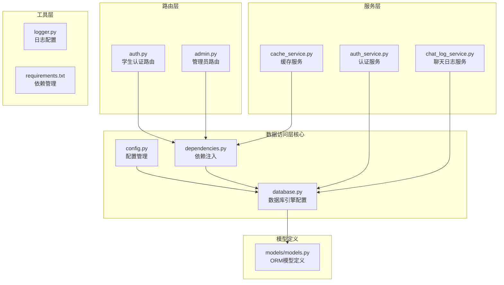

**图表来源**
- [database.py:1-35](file://service/ai_assistant/app/database.py#L1-L35)
- [models.py:1-660](file://service/ai_assistant/app/models/models.py#L1-L660)
- [config.py:1-113](file://service/ai_assistant/app/config.py#L1-L113)

**章节来源**
- [database.py:1-35](file://service/ai_assistant/app/database.py#L1-L35)
- [models.py:1-660](file://service/ai_assistant/app/models/models.py#L1-L660)
- [config.py:1-113](file://service/ai_assistant/app/config.py#L1-L113)

## 核心组件

### 数据库引擎配置

数据访问层的核心是基于SQLAlchemy的异步数据库引擎配置。系统使用`create_async_engine`创建异步MySQL引擎，配置了连接池预检查和回收机制。

关键配置参数：
- **连接池预检查**: `pool_pre_ping=True` - 自动检测连接有效性
- **连接回收**: `pool_recycle=3600` - 1小时后回收连接
- **调试输出**: `echo=settings.DEBUG` - 根据调试模式输出SQL语句
- **驱动**: `mysql+aiomysql` - 使用异步MySQL驱动

### 会话管理机制

系统实现了完整的异步会话管理，通过`async_sessionmaker`创建会话工厂，并提供异步上下文管理器：

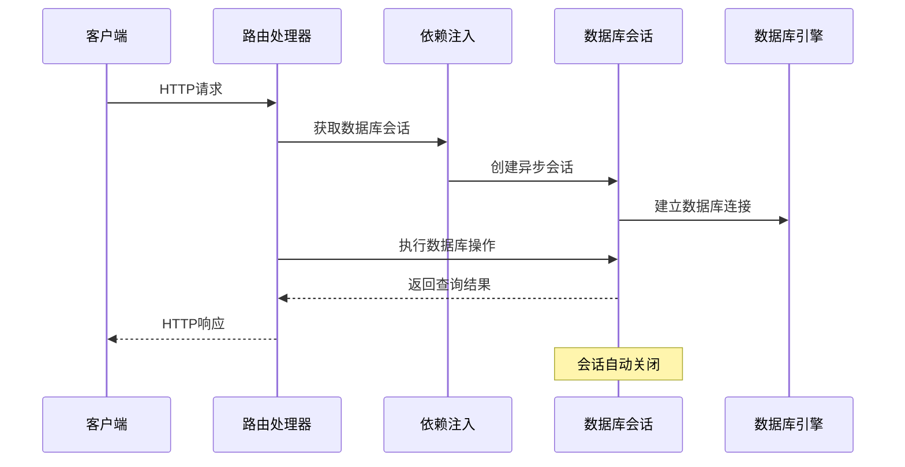

**图表来源**
- [dependencies.py:27-31](file://service/ai_assistant/app/dependencies.py#L27-L31)
- [database.py:27-35](file://service/ai_assistant/app/database.py#L27-L35)

### 模型基类设计

系统定义了简洁的Base类作为所有ORM模型的基类，继承自`DeclarativeBase`。这种设计确保了所有模型共享相同的元数据和配置。

模型设计特点：
- **类型注解**: 使用Python 3.9+的类型注解语法
- **枚举支持**: 内置多种枚举类型定义
- **索引优化**: 为常用查询字段建立复合索引
- **约束定义**: 实现数据完整性约束

**章节来源**
- [database.py:23-25](file://service/ai_assistant/app/database.py#L23-L25)
- [models.py:1-660](file://service/ai_assistant/app/models/models.py#L1-L660)

## 架构总览

数据访问层的整体架构体现了清晰的关注点分离和依赖注入原则：

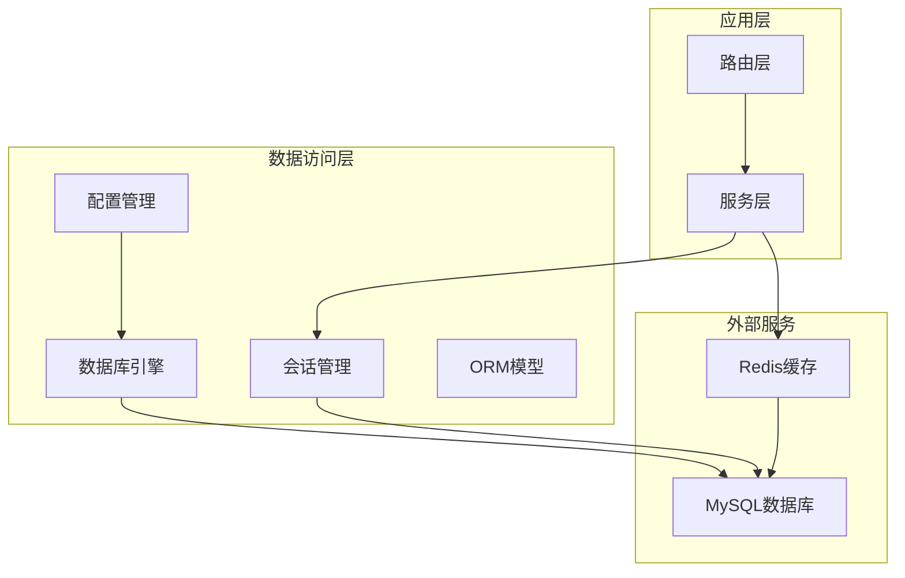

**图表来源**
- [config.py:85-91](file://service/ai_assistant/app/config.py#L85-L91)
- [database.py:7-20](file://service/ai_assistant/app/database.py#L7-L20)

### 数据流处理

系统采用异步数据流处理模式，确保高并发场景下的性能表现：

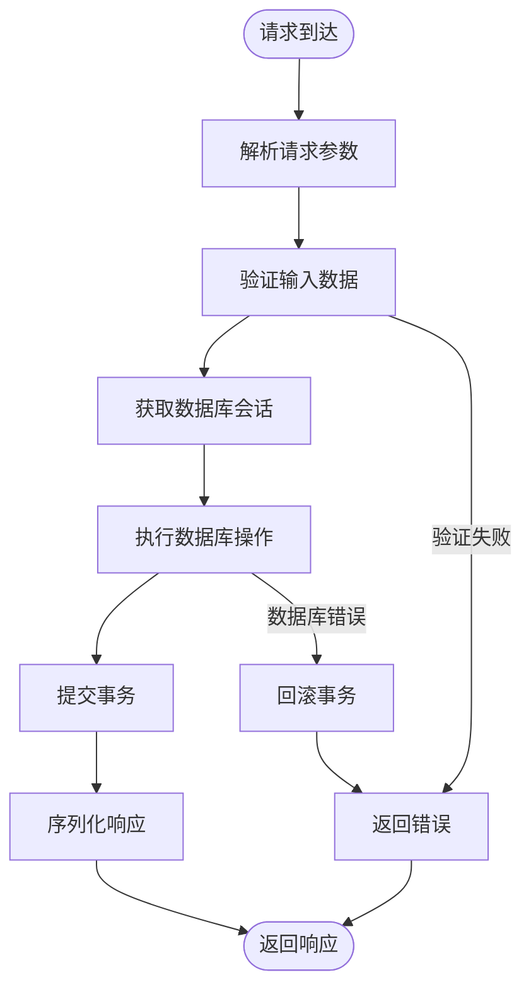

**图表来源**
- [auth.py:33-52](file://service/ai_assistant/app/routers/auth.py#L33-L52)
- [admin.py:57-82](file://service/ai_assistant/app/routers/admin.py#L57-L82)

## 详细组件分析

### 数据库连接管理

#### 引擎配置详解

数据库引擎通过`create_async_engine`函数创建，配置了多项关键参数以确保连接的稳定性和性能：

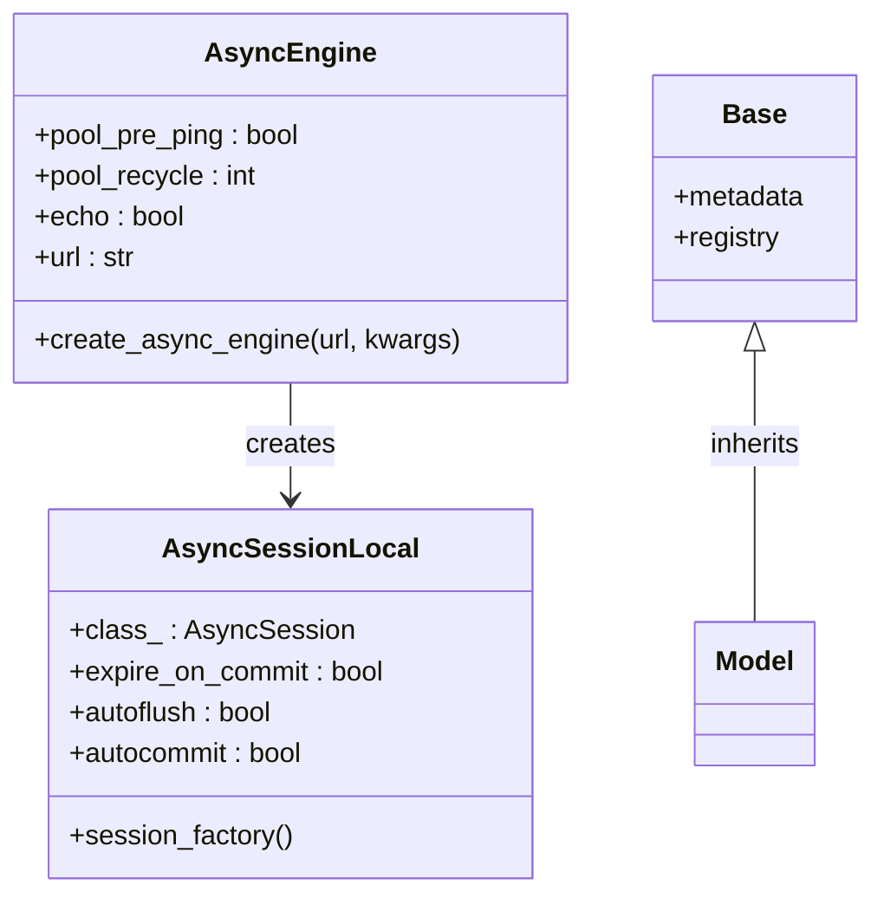

**图表来源**
- [database.py:7-25](file://service/ai_assistant/app/database.py#L7-L25)

#### 连接池配置策略

系统采用了经过优化的连接池配置策略：

| 配置项 | 值 | 作用 |
|--------|-----|------|
| `pool_pre_ping` | True | 连接前自动检测，确保连接有效性 |
| `pool_recycle` | 3600秒 | 1小时后回收连接，防止连接泄漏 |
| `echo` | settings.DEBUG | 调试模式下输出SQL语句 |
| `pool_size` | 默认 | 受限于MySQL服务器配置 |
| `max_overflow` | 默认 | 超出池大小后的最大连接数 |

### 模型设计与继承关系

#### 核心模型层次结构

系统建立了清晰的模型继承层次，体现了实体间的关系：

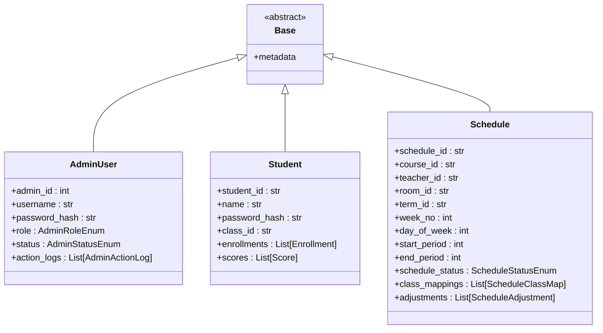

**图表来源**
- [models.py:41-84](file://service/ai_assistant/app/models/models.py#L41-L84)
- [models.py:312-340](file://service/ai_assistant/app/models/models.py#L312-L340)
- [models.py:412-480](file://service/ai_assistant/app/models/models.py#L412-L480)

#### 关系映射设计

系统实现了复杂的一对多和多对多关系映射：

- **一对多关系**: 管理员与操作日志、学生与选课记录
- **多对多关系**: 课程安排与班级的关联表
- **自引用关系**: 调课申请的回滚关系

### 查询方法实现模式

#### 标准查询模式

系统采用统一的查询模式，确保代码的一致性和可维护性：

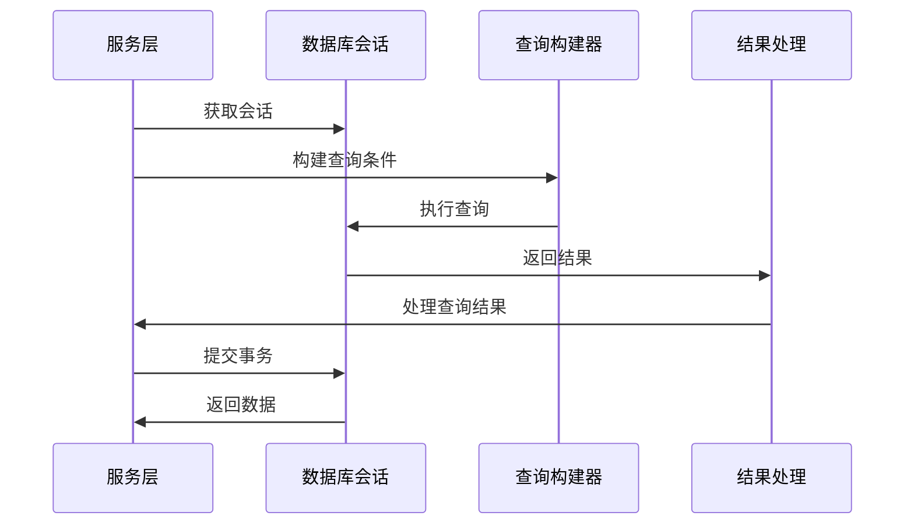

**图表来源**
- [auth_service.py:146-169](file://service/ai_assistant/app/services/auth_service.py#L146-L169)
- [chat_log_service.py:58-73](file://service/ai_assistant/app/services/chat_log_service.py#L58-L73)

#### 高级查询模式

对于复杂的多表联接查询，系统提供了灵活的查询构建方式：

- **条件过滤**: 支持多个过滤条件的组合
- **排序控制**: 多字段排序和优先级控制
- **分页处理**: 限制查询结果数量和偏移量
- **全文搜索**: 支持关键词模糊匹配

### 事务管理与错误处理

#### 事务管理模式

系统实现了严格的事务管理策略：

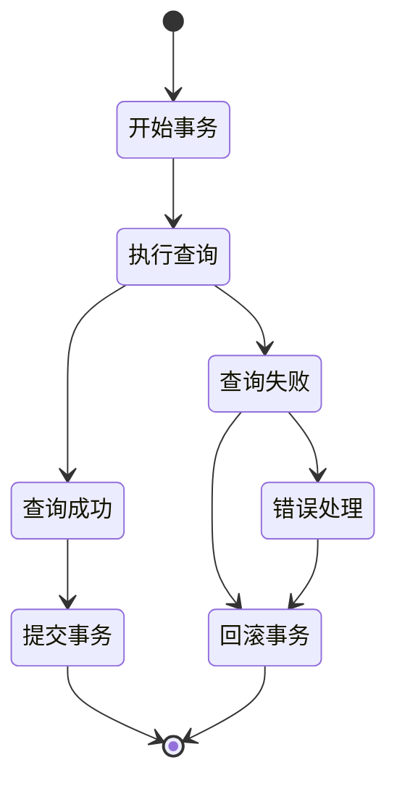

**图表来源**
- [admin.py:366-367](file://service/ai_assistant/app/routers/admin.py#L366-L367)
- [auth_service.py:207-208](file://service/ai_assistant/app/services/auth_service.py#L207-L208)

#### 错误处理机制

系统建立了多层次的错误处理机制：

- **数据库异常**: 捕获SQLAlchemy特定异常
- **业务异常**: 区分业务逻辑错误和系统错误
- **网络异常**: 处理Redis连接异常
- **权限异常**: 管理员权限验证失败

### 连接生命周期管理

#### 生命周期控制

系统实现了完整的连接生命周期管理：

```mermaid
flowchart TD
Request[请求到达] --> CreateSession[创建会话]
CreateSession --> UseConnection[使用连接]
UseConnection --> CloseSession[关闭会话]
CloseSession --> RecycleConnection[回收连接]
RecycleConnection --> [*]
CreateSession --> Error[创建失败]
Error --> Cleanup[清理资源]
Cleanup --> [*]
```

**图表来源**
- [dependencies.py:27-31](file://service/ai_assistant/app/dependencies.py#L27-L31)
- [database.py:27-35](file://service/ai_assistant/app/database.py#L27-L35)

#### 连接池优化

系统通过以下策略优化连接池性能：

- **预连接检测**: `pool_pre_ping`确保连接有效性
- **定时回收**: `pool_recycle`防止连接老化
- **异步处理**: 避免阻塞操作影响性能
- **资源清理**: 确保会话结束时正确释放资源

## 依赖关系分析

### 组件依赖图

数据访问层的组件间依赖关系体现了清晰的分层架构：

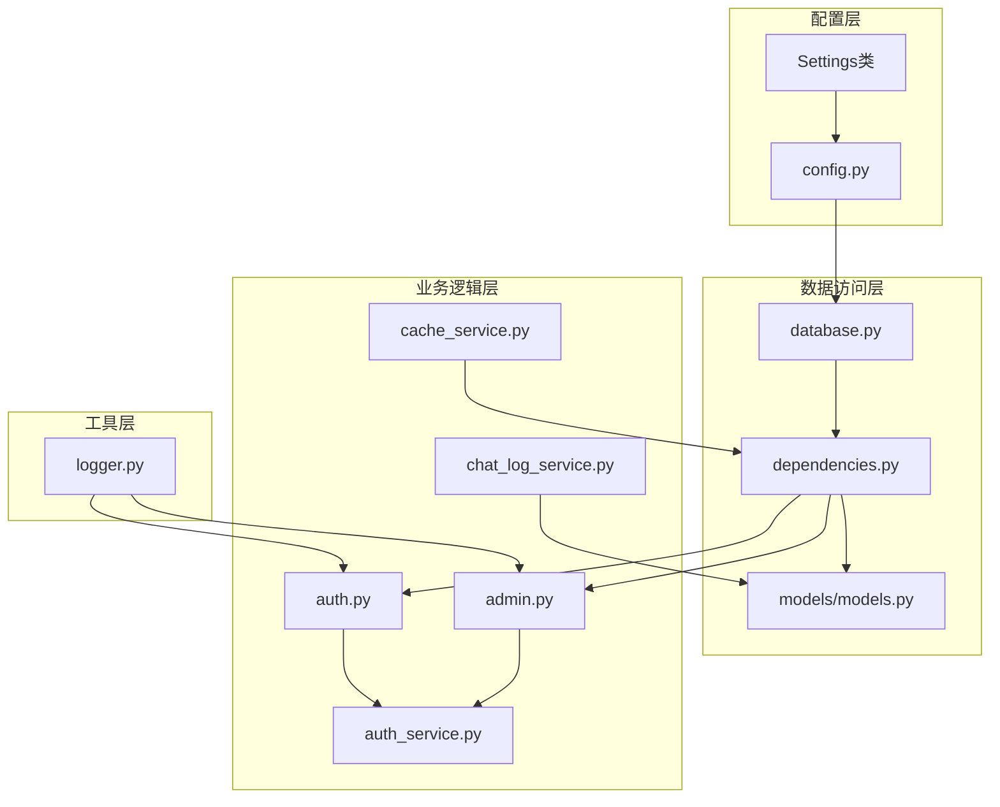

**图表来源**
- [config.py:85-91](file://service/ai_assistant/app/config.py#L85-L91)
- [database.py:14-20](file://service/ai_assistant/app/database.py#L14-L20)
- [dependencies.py:13-16](file://service/ai_assistant/app/dependencies.py#L13-L16)

### 外部依赖管理

系统对外部依赖进行了精心管理，确保版本兼容性和安全性：

| 依赖包 | 版本 | 用途 |
|--------|------|------|
| SQLAlchemy | 2.0.36 | ORM框架 |
| aiomysql | 0.3.0 | 异步MySQL驱动 |
| FastAPI | 0.115.5 | Web框架 |
| Redis | 5.2.1 | 缓存服务 |
| Pydantic Settings | 2.6.1 | 配置管理 |

**章节来源**
- [requirements.txt:1-22](file://service/ai_assistant/requirements.txt#L1-L22)

## 性能考虑

### 查询优化策略

#### 索引优化

系统为高频查询字段建立了完善的索引策略：

- **唯一约束**: 确保数据唯一性的同时提供快速查找
- **复合索引**: 针对常见查询组合建立复合索引
- **范围查询**: 为时间范围查询建立专门索引
- **全文搜索**: 支持关键词模糊匹配的索引

#### 连接池优化

系统通过以下策略优化数据库连接性能：

- **连接复用**: 避免频繁创建和销毁连接
- **预连接检测**: 减少无效连接的开销
- **超时控制**: 防止连接长时间占用
- **资源监控**: 实时监控连接池使用情况

### 缓存策略

#### 多层缓存架构

系统实现了多层缓存策略以提高查询性能：

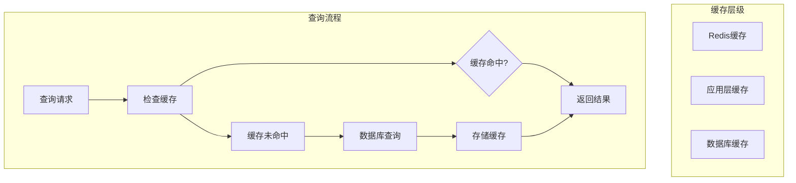

**图表来源**
- [cache_service.py:92-147](file://service/ai_assistant/app/services/cache_service.py#L92-L147)

#### 缓存失效策略

系统实现了智能的缓存失效机制：

- **时间敏感**: 相对时间查询按天失效
- **业务敏感**: 课表相关查询跟踪版本号
- **手动失效**: 管理员操作触发缓存更新
- **自动清理**: 设置合理的TTL过期时间

### 并发处理优化

#### 异步并发模型

系统采用异步并发模型处理高并发请求：

- **非阻塞I/O**: 避免阻塞操作影响整体性能
- **连接池管理**: 合理控制并发连接数量
- **超时控制**: 防止请求长时间占用资源
- **错误隔离**: 单个请求失败不影响其他请求

## 故障排除指南

### 常见问题诊断

#### 连接问题排查

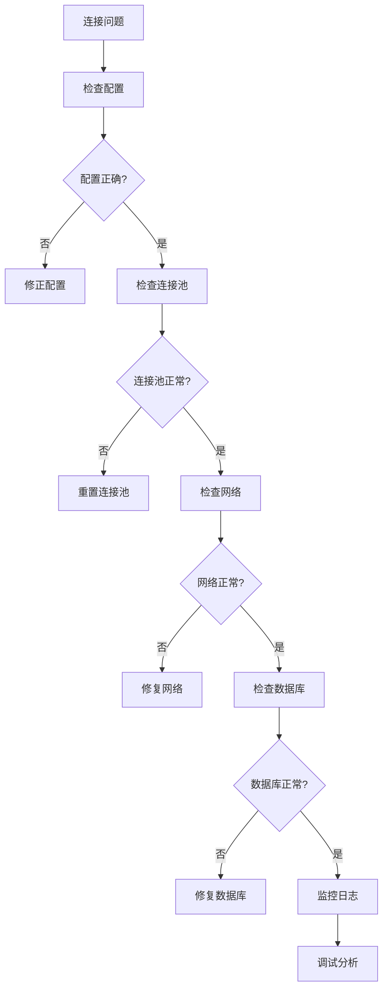

#### 性能问题诊断

系统提供了完善的日志记录机制用于问题诊断：

- **SQL语句日志**: 调试模式下输出详细SQL语句
- **性能指标**: 记录查询耗时和连接使用情况
- **错误追踪**: 详细记录异常发生的位置和原因
- **缓存状态**: 监控缓存命中率和失效情况

### 错误处理最佳实践

#### 异常分类处理

系统实现了细粒度的异常分类处理：

- **业务异常**: 如用户不存在、密码错误等
- **系统异常**: 如数据库连接失败、权限不足等
- **网络异常**: 如Redis连接超时、网络中断等
- **参数异常**: 如输入参数格式错误、范围超出等

#### 恢复机制

系统提供了多种异常恢复机制：

- **自动重试**: 对临时性错误进行有限次数重试
- **降级处理**: 在部分功能不可用时提供降级方案
- **优雅降级**: 保持核心功能可用性
- **资源清理**: 确保异常情况下资源正确释放

**章节来源**
- [logger.py:17-47](file://service/ai_assistant/app/utils/logger.py#L17-L47)
- [auth_service.py:21-27](file://service/ai_assistant/app/services/auth_service.py#L21-L27)

## 结论

AI校园助手的数据访问层展现了现代Python异步Web应用的最佳实践。通过精心设计的架构和完善的组件实现，系统在保证功能完整性的同时，实现了高性能、高可靠性的数据访问能力。

主要优势包括：

1. **异步架构**: 采用SQLAlchemy 2.0异步特性，提供优秀的并发性能
2. **完整生命周期管理**: 从连接创建到资源清理的全流程控制
3. **灵活的查询模式**: 支持简单查询到复杂联接查询的各种需求
4. **完善的错误处理**: 多层次的异常处理和恢复机制
5. **性能优化策略**: 连接池优化、缓存策略、索引设计等综合优化

该数据访问层为上层业务逻辑提供了坚实的基础，支持系统的长期发展和扩展需求。

## 附录

### 使用指南

#### 基本使用模式

```python
# 获取数据库会话
db = await get_db()

# 执行查询
result = await db.execute(select(User).where(User.id == user_id))
user = result.scalar_one_or_none()

# 提交事务
await db.commit()
```

#### 扩展方法

1. **添加新模型**: 继承Base类，定义字段和关系
2. **创建查询方法**: 在服务层实现业务相关的查询逻辑
3. **配置索引**: 为新字段添加适当的索引以优化查询性能
4. **实现缓存**: 对热点数据实现缓存策略

### 最佳实践

1. **始终使用异步会话**: 避免阻塞操作影响整体性能
2. **合理使用事务**: 将相关操作放在同一事务中确保一致性
3. **及时释放资源**: 确保会话和连接正确关闭
4. **监控性能指标**: 定期检查查询性能和连接池使用情况
5. **编写单元测试**: 为数据访问逻辑编写充分的测试用例