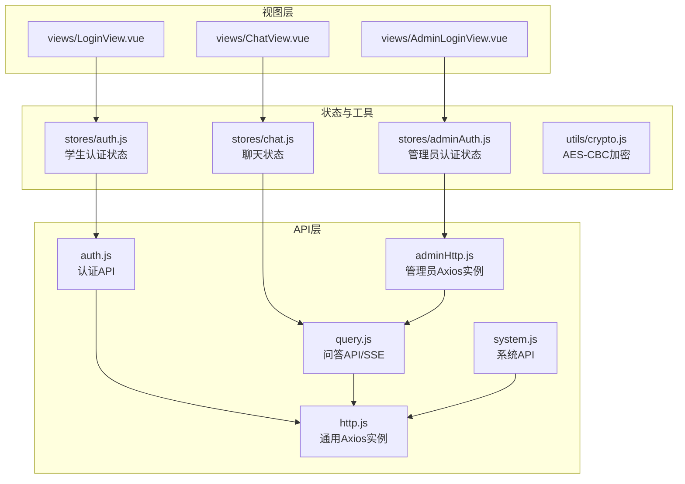
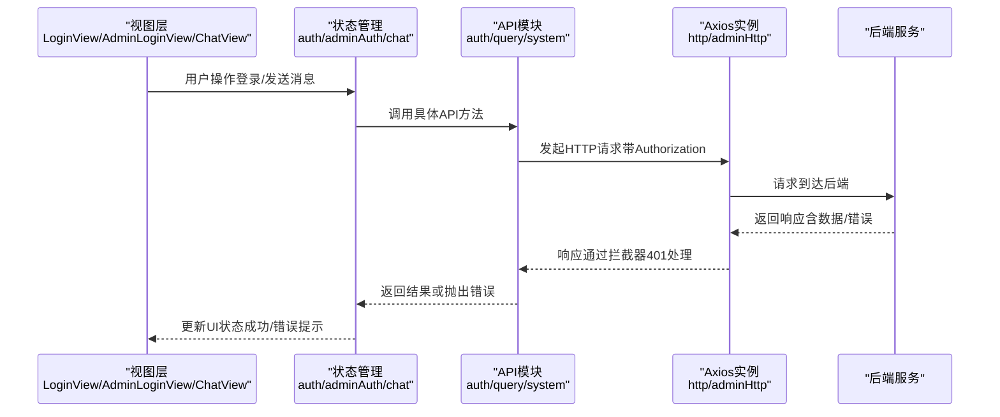
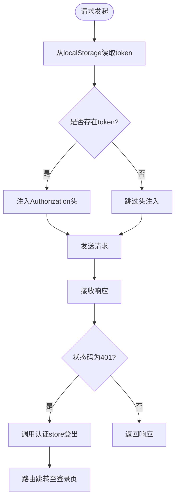
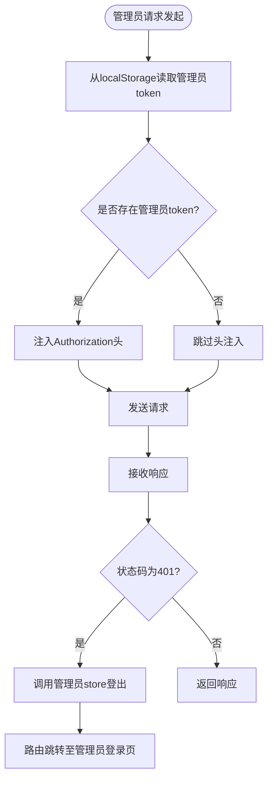
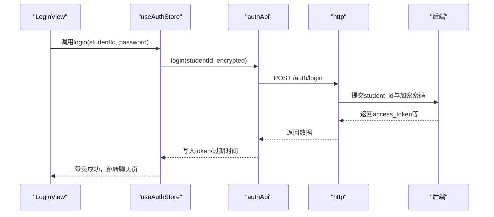
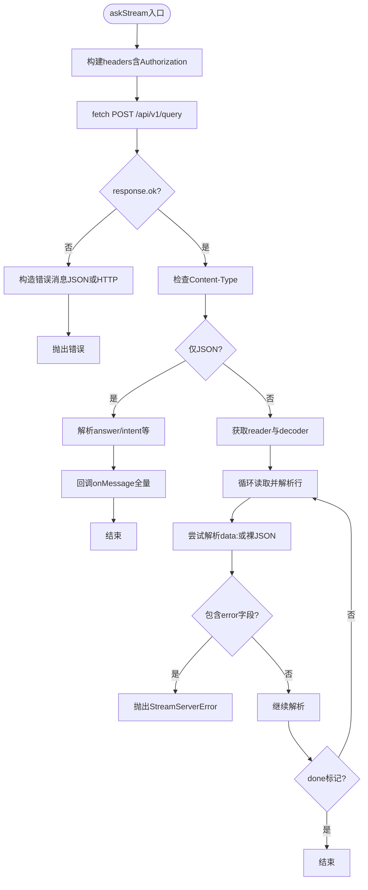
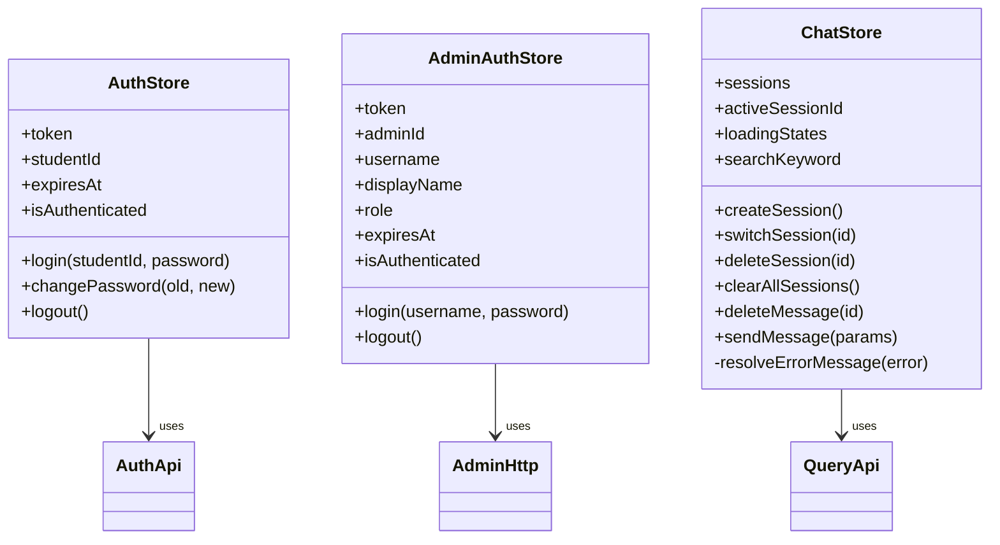
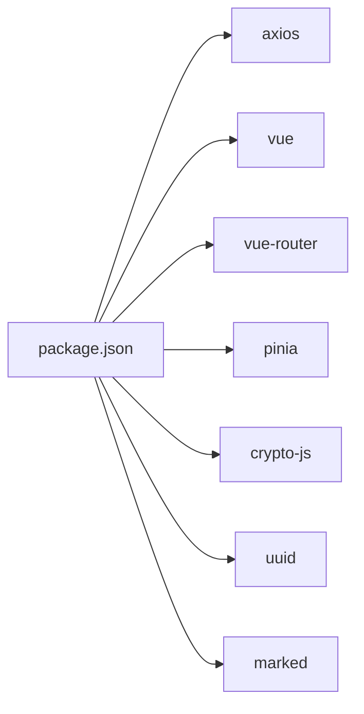

# API客户端集成

<cite>
**本文引用的文件**
- [frontend/ai_assistant/src/api/http.js](file://frontend/ai_assistant/src/api/http.js)
- [frontend/ai_assistant/src/api/adminHttp.js](file://frontend/ai_assistant/src/api/adminHttp.js)
- [frontend/ai_assistant/src/api/auth.js](file://frontend/ai_assistant/src/api/auth.js)
- [frontend/ai_assistant/src/api/query.js](file://frontend/ai_assistant/src/api/query.js)
- [frontend/ai_assistant/src/api/system.js](file://frontend/ai_assistant/src/api/system.js)
- [frontend/ai_assistant/src/stores/auth.js](file://frontend/ai_assistant/src/stores/auth.js)
- [frontend/ai_assistant/src/stores/adminAuth.js](file://frontend/ai_assistant/src/stores/adminAuth.js)
- [frontend/ai_assistant/src/stores/chat.js](file://frontend/ai_assistant/src/stores/chat.js)
- [frontend/ai_assistant/src/utils/crypto.js](file://frontend/ai_assistant/src/utils/crypto.js)
- [frontend/ai_assistant/src/views/LoginView.vue](file://frontend/ai_assistant/src/views/LoginView.vue)
- [frontend/ai_assistant/src/views/AdminLoginView.vue](file://frontend/ai_assistant/src/views/AdminLoginView.vue)
- [frontend/ai_assistant/src/views/ChatView.vue](file://frontend/ai_assistant/src/views/ChatView.vue)
- [frontend/ai_assistant/package.json](file://frontend/ai_assistant/package.json)
</cite>

## 目录
1. [简介](#简介)
2. [项目结构](#项目结构)
3. [核心组件](#核心组件)
4. [架构总览](#架构总览)
5. [详细组件分析](#详细组件分析)
6. [依赖关系分析](#依赖关系分析)
7. [性能考虑](#性能考虑)
8. [故障排查指南](#故障排查指南)
9. [结论](#结论)
10. [附录](#附录)

## 简介
本文件面向AI校园助手项目的前端API客户端集成，系统性阐述HTTP客户端封装、拦截器机制、认证流程、API模块组织、错误处理策略、请求与响应处理细节，并给出最佳实践与常见问题解决方案。读者无需深入技术背景亦可理解整体设计与使用方式。

## 项目结构
前端API层位于src/api目录，采用“按功能域划分”的模块化组织：
- http.js：通用Axios实例与请求/响应拦截器
- adminHttp.js：管理员端Axios实例与拦截器
- auth.js：认证相关API（登录、修改密码）
- query.js：智能问答API（含SSE流式输出）
- system.js：系统健康检查与版本查询
- stores目录：Pinia状态管理（认证、管理员认证、聊天）
- utils目录：加密工具（AES-CBC）

图表来源
- [frontend/ai_assistant/src/api/http.js:1-49](file://frontend/ai_assistant/src/api/http.js#L1-L49)
- [frontend/ai_assistant/src/api/adminHttp.js:1-44](file://frontend/ai_assistant/src/api/adminHttp.js#L1-L44)
- [frontend/ai_assistant/src/api/auth.js:1-36](file://frontend/ai_assistant/src/api/auth.js#L1-L36)
- [frontend/ai_assistant/src/api/query.js:1-141](file://frontend/ai_assistant/src/api/query.js#L1-L141)
- [frontend/ai_assistant/src/api/system.js:1-18](file://frontend/ai_assistant/src/api/system.js#L1-L18)
- [frontend/ai_assistant/src/stores/auth.js:1-77](file://frontend/ai_assistant/src/stores/auth.js#L1-L77)
- [frontend/ai_assistant/src/stores/adminAuth.js:1-77](file://frontend/ai_assistant/src/stores/adminAuth.js#L1-L77)
- [frontend/ai_assistant/src/stores/chat.js:1-278](file://frontend/ai_assistant/src/stores/chat.js#L1-L278)
- [frontend/ai_assistant/src/utils/crypto.js:1-40](file://frontend/ai_assistant/src/utils/crypto.js#L1-L40)

章节来源
- [frontend/ai_assistant/src/api/http.js:1-49](file://frontend/ai_assistant/src/api/http.js#L1-L49)
- [frontend/ai_assistant/src/api/adminHttp.js:1-44](file://frontend/ai_assistant/src/api/adminHttp.js#L1-L44)
- [frontend/ai_assistant/src/api/auth.js:1-36](file://frontend/ai_assistant/src/api/auth.js#L1-L36)
- [frontend/ai_assistant/src/api/query.js:1-141](file://frontend/ai_assistant/src/api/query.js#L1-L141)
- [frontend/ai_assistant/src/api/system.js:1-18](file://frontend/ai_assistant/src/api/system.js#L1-L18)
- [frontend/ai_assistant/src/stores/auth.js:1-77](file://frontend/ai_assistant/src/stores/auth.js#L1-L77)
- [frontend/ai_assistant/src/stores/adminAuth.js:1-77](file://frontend/ai_assistant/src/stores/adminAuth.js#L1-L77)
- [frontend/ai_assistant/src/stores/chat.js:1-278](file://frontend/ai_assistant/src/stores/chat.js#L1-L278)
- [frontend/ai_assistant/src/utils/crypto.js:1-40](file://frontend/ai_assistant/src/utils/crypto.js#L1-L40)

## 核心组件
- 通用HTTP客户端（http.js）
  - 统一基础URL、超时、Content-Type
  - 请求拦截：从localStorage读取token并注入Authorization头
  - 响应拦截：401自动登出并跳转登录页
- 管理员HTTP客户端（adminHttp.js）
  - 与通用客户端类似，但针对管理员端点与状态
- 认证API（auth.js）
  - 学生登录：提交加密后的密码
  - 修改密码：提交加密后的旧/新密码
- 查询API（query.js）
  - 文本/图片/语音多模态问答
  - SSE流式输出解析与兼容处理
  - 支持清除会话缓存
- 系统API（system.js）
  - 健康检查与版本查询
- 状态管理（stores）
  - auth.js：学生认证状态、登录/登出、密码变更
  - adminAuth.js：管理员认证状态、登录/登出
  - chat.js：会话管理、消息发送、SSE消费、错误解析
- 加密工具（utils/crypto.js）
  - AES-CBC加密，输出格式为“iv_base64:ciphertext_base64”

章节来源
- [frontend/ai_assistant/src/api/http.js:1-49](file://frontend/ai_assistant/src/api/http.js#L1-L49)
- [frontend/ai_assistant/src/api/adminHttp.js:1-44](file://frontend/ai_assistant/src/api/adminHttp.js#L1-L44)
- [frontend/ai_assistant/src/api/auth.js:1-36](file://frontend/ai_assistant/src/api/auth.js#L1-L36)
- [frontend/ai_assistant/src/api/query.js:1-141](file://frontend/ai_assistant/src/api/query.js#L1-L141)
- [frontend/ai_assistant/src/api/system.js:1-18](file://frontend/ai_assistant/src/api/system.js#L1-L18)
- [frontend/ai_assistant/src/stores/auth.js:1-77](file://frontend/ai_assistant/src/stores/auth.js#L1-L77)
- [frontend/ai_assistant/src/stores/adminAuth.js:1-77](file://frontend/ai_assistant/src/stores/adminAuth.js#L1-L77)
- [frontend/ai_assistant/src/stores/chat.js:1-278](file://frontend/ai_assistant/src/stores/chat.js#L1-L278)
- [frontend/ai_assistant/src/utils/crypto.js:1-40](file://frontend/ai_assistant/src/utils/crypto.js#L1-L40)

## 架构总览
下图展示了从前端视图到API层、状态管理与后端服务的整体交互路径。

图表来源
- [frontend/ai_assistant/src/views/LoginView.vue:94-121](file://frontend/ai_assistant/src/views/LoginView.vue#L94-L121)
- [frontend/ai_assistant/src/views/AdminLoginView.vue:75-105](file://frontend/ai_assistant/src/views/AdminLoginView.vue#L75-L105)
- [frontend/ai_assistant/src/views/ChatView.vue:312-333](file://frontend/ai_assistant/src/views/ChatView.vue#L312-L333)
- [frontend/ai_assistant/src/stores/auth.js:29-43](file://frontend/ai_assistant/src/stores/auth.js#L29-L43)
- [frontend/ai_assistant/src/stores/adminAuth.js:28-46](file://frontend/ai_assistant/src/stores/adminAuth.js#L28-L46)
- [frontend/ai_assistant/src/stores/chat.js:133-230](file://frontend/ai_assistant/src/stores/chat.js#L133-L230)
- [frontend/ai_assistant/src/api/auth.js:15-35](file://frontend/ai_assistant/src/api/auth.js#L15-L35)
- [frontend/ai_assistant/src/api/query.js:11-140](file://frontend/ai_assistant/src/api/query.js#L11-L140)
- [frontend/ai_assistant/src/api/http.js:10-47](file://frontend/ai_assistant/src/api/http.js#L10-L47)
- [frontend/ai_assistant/src/api/adminHttp.js:12-41](file://frontend/ai_assistant/src/api/adminHttp.js#L12-L41)

## 详细组件分析

### HTTP客户端与拦截器（http.js）
- 设计要点
  - 统一基础地址、超时与Content-Type
  - 请求拦截：从localStorage读取token并注入Authorization头
  - 响应拦截：捕获401错误，调用认证store登出并跳转登录页
- 关键行为
  - token来源优先使用localStorage，确保非响应式场景的安全性
  - 可选地在需要响应式状态时按需导入store（注释中提供示例）
- 适用范围
  - 学生端API调用统一走此实例

图表来源
- [frontend/ai_assistant/src/api/http.js:10-47](file://frontend/ai_assistant/src/api/http.js#L10-L47)

章节来源
- [frontend/ai_assistant/src/api/http.js:1-49](file://frontend/ai_assistant/src/api/http.js#L1-L49)

### 管理员HTTP客户端（adminHttp.js）
- 设计要点
  - 与通用客户端一致的配置与拦截器逻辑
  - 针对管理员端点与管理员认证状态
- 关键行为
  - 从localStorage读取管理员token并注入Authorization头
  - 401时清理管理员状态并跳转管理员登录页

图表来源
- [frontend/ai_assistant/src/api/adminHttp.js:12-41](file://frontend/ai_assistant/src/api/adminHttp.js#L12-L41)

章节来源
- [frontend/ai_assistant/src/api/adminHttp.js:1-44](file://frontend/ai_assistant/src/api/adminHttp.js#L1-L44)

### 认证API（auth.js）
- 功能
  - 学生登录：提交student_id与加密后的密码
  - 修改密码：提交student_id与两份加密后的密码
- 数据流转
  - 调用http实例，自动携带Authorization头（若存在）
  - 成功后由store写入token、过期时间等信息

图表来源
- [frontend/ai_assistant/src/views/LoginView.vue:94-121](file://frontend/ai_assistant/src/views/LoginView.vue#L94-L121)
- [frontend/ai_assistant/src/stores/auth.js:29-43](file://frontend/ai_assistant/src/stores/auth.js#L29-L43)
- [frontend/ai_assistant/src/api/auth.js:15-20](file://frontend/ai_assistant/src/api/auth.js#L15-L20)
- [frontend/ai_assistant/src/api/http.js:19-34](file://frontend/ai_assistant/src/api/http.js#L19-L34)

章节来源
- [frontend/ai_assistant/src/api/auth.js:1-36](file://frontend/ai_assistant/src/api/auth.js#L1-L36)
- [frontend/ai_assistant/src/stores/auth.js:1-77](file://frontend/ai_assistant/src/stores/auth.js#L1-L77)
- [frontend/ai_assistant/src/views/LoginView.vue:94-121](file://frontend/ai_assistant/src/views/LoginView.vue#L94-L121)

### 查询API与SSE流式输出（query.js）
- 功能
  - ask：发送问题（文本/图片/语音），返回JSON响应
  - askStream：SSE流式输出，兼容后端全量返回场景
  - clearSessions：清空Redis会话缓存与历史
- SSE解析要点
  - 识别content-type，兼容JSON全量返回
  - 解析data行或裸JSON块，容错网关改写格式
  - 处理服务端错误字段与done标记
  - 若未收到done包，兜底结束前端状态
- 错误处理
  - fetch请求失败时构造友好错误消息
  - 流解析异常时抛出可识别的错误类型

图表来源
- [frontend/ai_assistant/src/api/query.js:28-140](file://frontend/ai_assistant/src/api/query.js#L28-L140)

章节来源
- [frontend/ai_assistant/src/api/query.js:1-141](file://frontend/ai_assistant/src/api/query.js#L1-L141)

### 系统API（system.js）
- 功能
  - healthCheck：健康检查
  - getVersion：版本信息
- 使用场景
  - 初始化阶段检查后端可用性
  - 展示版本信息用于排障

章节来源
- [frontend/ai_assistant/src/api/system.js:1-18](file://frontend/ai_assistant/src/api/system.js#L1-L18)

### 状态管理与认证流程
- 学生认证（auth.js）
  - 登录：加密密码 → 调用authApi → 写入token/过期时间到localStorage与store
  - 修改密码：加密旧/新密码 → 调用authApi
  - 登出：清空store与localStorage
- 管理员认证（adminAuth.js）
  - 登录：加密密码 → 调用adminApi → 写入管理员token/角色等
  - 登出：清空store与localStorage
- 聊天状态（chat.js）
  - 创建/切换/删除会话
  - 发送消息：预置占位消息 → 调用queryApi.askStream → 流式更新消息内容
  - 错误解析：根据状态码与后端错误信息生成用户友好提示

图表来源
- [frontend/ai_assistant/src/stores/auth.js:17-77](file://frontend/ai_assistant/src/stores/auth.js#L17-L77)
- [frontend/ai_assistant/src/stores/adminAuth.js:16-77](file://frontend/ai_assistant/src/stores/adminAuth.js#L16-L77)
- [frontend/ai_assistant/src/stores/chat.js:22-278](file://frontend/ai_assistant/src/stores/chat.js#L22-L278)

章节来源
- [frontend/ai_assistant/src/stores/auth.js:1-77](file://frontend/ai_assistant/src/stores/auth.js#L1-L77)
- [frontend/ai_assistant/src/stores/adminAuth.js:1-77](file://frontend/ai_assistant/src/stores/adminAuth.js#L1-L77)
- [frontend/ai_assistant/src/stores/chat.js:1-278](file://frontend/ai_assistant/src/stores/chat.js#L1-L278)

### 加密工具（utils/crypto.js）
- 设计要点
  - AES-CBC模式，Pkcs7填充
  - IV与密文均使用URL安全Base64编码
  - 输出格式：iv_base64:ciphertext_base64
- 使用场景
  - 登录与修改密码前对密码进行加密

章节来源
- [frontend/ai_assistant/src/utils/crypto.js:1-40](file://frontend/ai_assistant/src/utils/crypto.js#L1-L40)

## 依赖关系分析
- Axios版本：^1.6.8
- Vue相关：vue ^3.4.21、vue-router ^4.3.0、pinia ^2.1.7
- 工具库：crypto-js ^4.2.0、uuid ^9.0.1、marked ^12.0.1

图表来源
- [frontend/ai_assistant/package.json:11-18](file://frontend/ai_assistant/package.json#L11-L18)

章节来源
- [frontend/ai_assistant/package.json:1-24](file://frontend/ai_assistant/package.json#L1-L24)

## 性能考虑
- 超时设置
  - 通用实例与管理员实例均设置60秒超时，适合长轮询与大文件传输场景
- 流式输出
  - SSE解析采用增量解码与缓冲区拼接，避免丢包；在未收到done包时进行兜底结束
- 前端压缩
  - 图片上传前进行压缩，控制在5MB以内，避免网关/Nginx默认限制
- 并发与节流
  - 建议在应用层对高频请求进行防抖/去抖，避免重复发送
- 缓存策略
  - 会话级缓存通过后端Redis管理，前端提供clearSessions接口清理
- 重试机制
  - 当前未内置自动重试；可在业务层基于错误类型与状态码实现有限重试

## 故障排查指南
- 登录失败（401）
  - 视图层根据状态码与后端detail提示用户
  - 建议检查加密算法一致性与token存储键名
- SSE流异常
  - 确认后端content-type与数据格式
  - 检查网关是否改写SSE格式，代码已具备容错解析
- 401自动登出
  - 通用与管理员实例均在401时清理状态并跳转登录页
  - 检查localStorage中的token是否过期或被篡改
- 网络错误
  - 检查超时设置与网络连通性
  - 建议在业务层增加重试与降级策略

章节来源
- [frontend/ai_assistant/src/views/LoginView.vue:110-121](file://frontend/ai_assistant/src/views/LoginView.vue#L110-L121)
- [frontend/ai_assistant/src/views/AdminLoginView.vue:91-105](file://frontend/ai_assistant/src/views/AdminLoginView.vue#L91-L105)
- [frontend/ai_assistant/src/api/http.js:37-47](file://frontend/ai_assistant/src/api/http.js#L37-L47)
- [frontend/ai_assistant/src/api/adminHttp.js:31-41](file://frontend/ai_assistant/src/api/adminHttp.js#L31-L41)
- [frontend/ai_assistant/src/api/query.js:78-109](file://frontend/ai_assistant/src/api/query.js#L78-L109)

## 结论
本API客户端集成以Axios为核心，通过统一拦截器实现认证与错误处理，结合Pinia状态管理与SSE流式输出，形成完整的前后端交互闭环。模块化设计便于扩展与维护，同时提供了良好的错误提示与用户体验。建议在生产环境中补充自动重试、缓存与监控埋点，进一步提升稳定性与可观测性。

## 附录

### API调用最佳实践
- 并发请求处理
  - 使用Promise.all或队列限流，避免过度并发导致资源争用
- 缓存策略
  - 利用后端Redis缓存与前端clearSessions清理
- 性能优化
  - 图片压缩、SSE增量解析、超时合理设置
- 错误处理
  - 区分网络错误、业务错误与用户友好提示，统一在store中解析

### 常见问题与解决方案
- 问：为什么登录后立即401？
  - 答：检查localStorage中的token键名与过期时间，确认拦截器正确注入Authorization头
- 问：SSE一直显示“正在思考”？
  - 答：确认后端返回content-type与数据格式，代码已兼容JSON全量返回
- 问：图片上传失败？
  - 答：确认前端压缩逻辑与后端网关限制，避免超过5MB