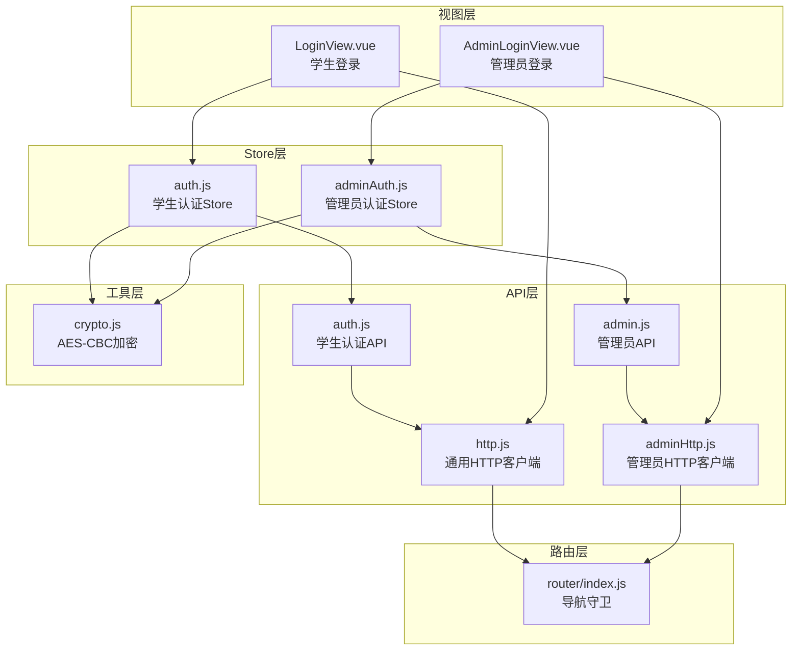
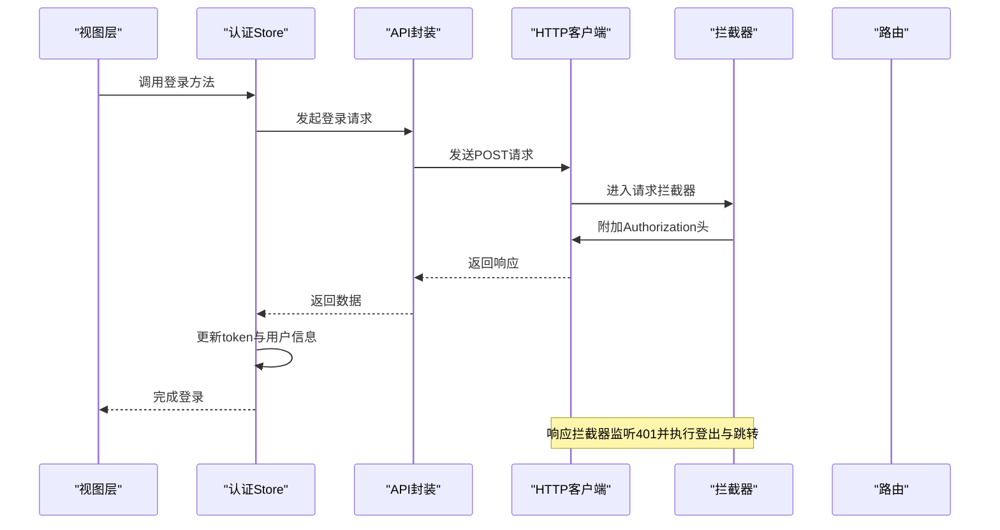
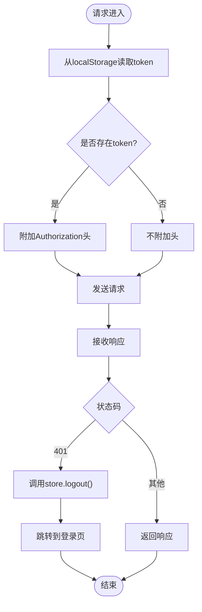
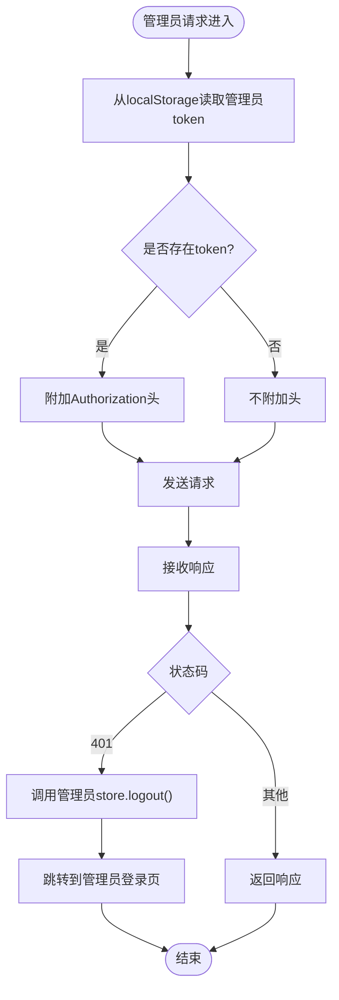
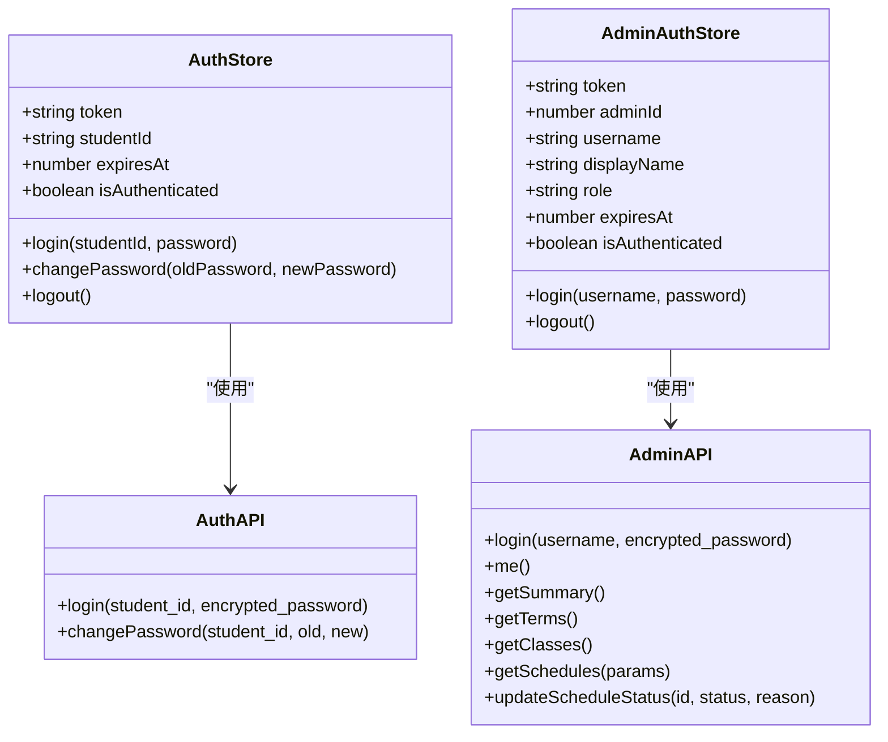
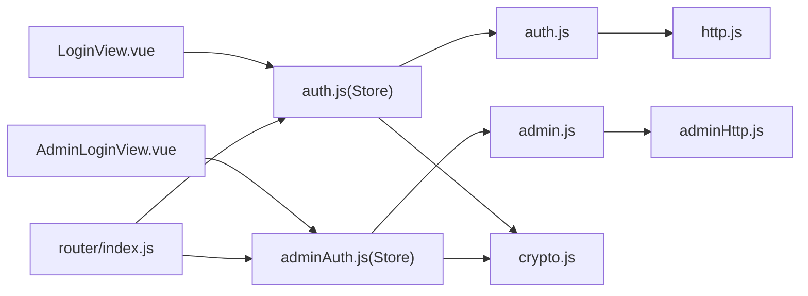

# HTTP客户端配置

<cite>
**本文引用的文件**
- [http.js](file://frontend/ai_assistant/src/api/http.js)
- [adminHttp.js](file://frontend/ai_assistant/src/api/adminHttp.js)
- [auth.js](file://frontend/ai_assistant/src/stores/auth.js)
- [adminAuth.js](file://frontend/ai_assistant/src/stores/adminAuth.js)
- [auth.js](file://frontend/ai_assistant/src/api/auth.js)
- [admin.js](file://frontend/ai_assistant/src/api/admin.js)
- [index.js](file://frontend/ai_assistant/src/router/index.js)
- [LoginView.vue](file://frontend/ai_assistant/src/views/LoginView.vue)
- [AdminLoginView.vue](file://frontend/ai_assistant/src/views/AdminLoginView.vue)
- [crypto.js](file://frontend/ai_assistant/src/utils/crypto.js)
</cite>

## 目录
1. [简介](#简介)
2. [项目结构](#项目结构)
3. [核心组件](#核心组件)
4. [架构总览](#架构总览)
5. [详细组件分析](#详细组件分析)
6. [依赖关系分析](#依赖关系分析)
7. [性能考量](#性能考量)
8. [故障排查指南](#故障排查指南)
9. [结论](#结论)
10. [附录](#附录)

## 简介
本文件面向AI校园助手项目的前端HTTP客户端配置，系统性说明axios实例的创建与配置、请求/响应拦截器的实现机制、两种token获取方式的差异、错误处理策略与最佳实践，并提供可操作的配置示例与常见问题解决方案。读者无需深入代码即可理解整体设计与使用方法。

## 项目结构
前端HTTP相关代码主要位于以下位置：
- API层：统一HTTP客户端与业务API封装
- Store层：基于Pinia的状态管理，负责token与用户信息的持久化与响应式状态
- 路由层：导航守卫控制访问权限
- 视图层：登录等页面调用store完成登录流程
- 工具层：密码加密等辅助功能

图表来源
- [http.js:1-49](file://frontend/ai_assistant/src/api/http.js#L1-L49)
- [adminHttp.js:1-44](file://frontend/ai_assistant/src/api/adminHttp.js#L1-L44)
- [auth.js:1-77](file://frontend/ai_assistant/src/stores/auth.js#L1-L77)
- [adminAuth.js:1-77](file://frontend/ai_assistant/src/stores/adminAuth.js#L1-L77)
- [auth.js:1-36](file://frontend/ai_assistant/src/api/auth.js#L1-L36)
- [admin.js:1-41](file://frontend/ai_assistant/src/api/admin.js#L1-L41)
- [index.js:1-75](file://frontend/ai_assistant/src/router/index.js#L1-L75)
- [LoginView.vue:75-122](file://frontend/ai_assistant/src/views/LoginView.vue#L75-L122)
- [AdminLoginView.vue:55-106](file://frontend/ai_assistant/src/views/AdminLoginView.vue#L55-L106)
- [crypto.js:1-40](file://frontend/ai_assistant/src/utils/crypto.js#L1-L40)

章节来源
- [http.js:1-49](file://frontend/ai_assistant/src/api/http.js#L1-L49)
- [adminHttp.js:1-44](file://frontend/ai_assistant/src/api/adminHttp.js#L1-L44)
- [auth.js:1-77](file://frontend/ai_assistant/src/stores/auth.js#L1-L77)
- [adminAuth.js:1-77](file://frontend/ai_assistant/src/stores/adminAuth.js#L1-L77)
- [auth.js:1-36](file://frontend/ai_assistant/src/api/auth.js#L1-L36)
- [admin.js:1-41](file://frontend/ai_assistant/src/api/admin.js#L1-L41)
- [index.js:1-75](file://frontend/ai_assistant/src/router/index.js#L1-L75)
- [LoginView.vue:75-122](file://frontend/ai_assistant/src/views/LoginView.vue#L75-L122)
- [AdminLoginView.vue:55-106](file://frontend/ai_assistant/src/views/AdminLoginView.vue#L55-L106)
- [crypto.js:1-40](file://frontend/ai_assistant/src/utils/crypto.js#L1-L40)

## 核心组件
- 通用HTTP客户端：统一的axios实例，设置基础路径、超时与默认头，内置请求/响应拦截器。
- 管理员HTTP客户端：独立的axios实例，用于管理员接口，同样具备请求/响应拦截器。
- 认证Store（学生）：负责登录、修改密码、登出，以及token与用户信息的持久化与响应式状态。
- 管理员认证Store：负责管理员登录、登出，以及token与用户信息的持久化与响应式状态。
- 路由导航守卫：根据认证状态控制页面访问。
- 加密工具：对密码进行AES-CBC加密，确保传输安全。

章节来源
- [http.js:10-47](file://frontend/ai_assistant/src/api/http.js#L10-L47)
- [adminHttp.js:12-41](file://frontend/ai_assistant/src/api/adminHttp.js#L12-L41)
- [auth.js:17-76](file://frontend/ai_assistant/src/stores/auth.js#L17-L76)
- [adminAuth.js:16-75](file://frontend/ai_assistant/src/stores/adminAuth.js#L16-L75)
- [index.js:57-73](file://frontend/ai_assistant/src/router/index.js#L57-L73)
- [crypto.js:26-40](file://frontend/ai_assistant/src/utils/crypto.js#L26-L40)

## 架构总览
HTTP客户端采用“axios实例 + 拦截器 + Pinia Store”的分层设计：
- axios实例：集中配置baseURL、timeout、默认头。
- 请求拦截器：自动从localStorage读取token并附加到Authorization头；支持store方式作为备选方案。
- 响应拦截器：统一处理401未授权错误，触发store登出与路由跳转。
- Store：负责token与用户信息的持久化与响应式状态，供视图层调用。
- API封装：将具体业务接口封装为模块，统一使用对应HTTP客户端。

图表来源
- [http.js:19-47](file://frontend/ai_assistant/src/api/http.js#L19-L47)
- [auth.js:29-43](file://frontend/ai_assistant/src/stores/auth.js#L29-L43)
- [auth.js:15-20](file://frontend/ai_assistant/src/api/auth.js#L15-L20)
- [index.js:58-73](file://frontend/ai_assistant/src/router/index.js#L58-L73)

## 详细组件分析

### 通用HTTP客户端（http.js）
- axios实例配置
  - baseURL：统一前缀为/api/v1，便于后端路由组织。
  - timeout：60秒，避免长时间阻塞。
  - 默认头：Content-Type为application/json。
- 请求拦截器
  - 从localStorage读取token并附加到Authorization头（Bearer模式）。
  - 提供store方式作为备选方案注释，强调直接读取localStorage更安全、无依赖。
- 响应拦截器
  - 监听401未授权错误，调用store.logout()并跳转至登录页。

图表来源
- [http.js:19-47](file://frontend/ai_assistant/src/api/http.js#L19-L47)

章节来源
- [http.js:10-47](file://frontend/ai_assistant/src/api/http.js#L10-L47)

### 管理员HTTP客户端（adminHttp.js）
- axios实例配置
  - baseURL：统一前缀为/api/v1。
  - timeout：60秒。
  - 默认头：Content-Type为application/json。
- 请求拦截器
  - 从localStorage读取管理员token并附加到Authorization头。
- 响应拦截器
  - 监听401未授权错误，调用管理员store.logout()并跳转至管理员登录页。

图表来源
- [adminHttp.js:20-41](file://frontend/ai_assistant/src/api/adminHttp.js#L20-L41)

章节来源
- [adminHttp.js:12-41](file://frontend/ai_assistant/src/api/adminHttp.js#L12-L41)

### 认证Store（学生）与管理员Store
- 共同点
  - 使用localStorage持久化token与用户信息。
  - 提供isAuthenticated计算属性，结合过期时间判断是否有效。
  - 提供login、changePassword、logout方法。
- 学生Store特有
  - 使用authApi发起登录与改密请求。
  - 登录成功后写入token、student_id、expires_at。
- 管理员Store特有
  - 使用adminApi发起登录请求。
  - 登录成功后写入token、admin_id、username、display_name、role、expires_at。

图表来源
- [auth.js:17-76](file://frontend/ai_assistant/src/stores/auth.js#L17-L76)
- [adminAuth.js:16-75](file://frontend/ai_assistant/src/stores/adminAuth.js#L16-L75)
- [auth.js:8-36](file://frontend/ai_assistant/src/api/auth.js#L8-L36)
- [admin.js:6-40](file://frontend/ai_assistant/src/api/admin.js#L6-L40)

章节来源
- [auth.js:17-76](file://frontend/ai_assistant/src/stores/auth.js#L17-L76)
- [adminAuth.js:16-75](file://frontend/ai_assistant/src/stores/adminAuth.js#L16-L75)
- [auth.js:8-36](file://frontend/ai_assistant/src/api/auth.js#L8-L36)
- [admin.js:6-40](file://frontend/ai_assistant/src/api/admin.js#L6-L40)

### 路由导航守卫
- 控制访问权限
  - 需要管理员认证的路由：未认证则跳转管理员登录页。
  - 需要学生认证的路由：未认证则跳转登录页。
  - 已认证用户访问登录页：重定向至聊天页。
- 与HTTP拦截器配合
  - 401时自动登出并跳转登录页，保证前后端一致性。

章节来源
- [index.js:57-73](file://frontend/ai_assistant/src/router/index.js#L57-L73)

### 视图层使用示例
- 学生登录
  - 视图层调用authStore.login，内部通过authApi发起请求，成功后更新store并跳转。
  - 错误处理：针对401与其它错误分别提示。
- 管理员登录
  - 视图层调用adminAuth.login，内部通过adminApi发起请求，成功后更新store并跳转。
  - 错误处理：针对401与403等错误分别提示。

章节来源
- [LoginView.vue:94-121](file://frontend/ai_assistant/src/views/LoginView.vue#L94-L121)
- [AdminLoginView.vue:75-105](file://frontend/ai_assistant/src/views/AdminLoginView.vue#L75-L105)

### 两种token获取方式的区别
- 直接从localStorage读取
  - 优点：无依赖，无需导入store，安全性高。
  - 适用：请求拦截器中自动附加Authorization头。
- 通过Pinia store获取
  - 优点：可获得响应式状态与计算属性，便于UI联动。
  - 适用：视图层交互或需要实时状态的场景。
  - 注意：在拦截器中使用store需谨慎，避免循环依赖与异步导入问题。

章节来源
- [http.js:21-32](file://frontend/ai_assistant/src/api/http.js#L21-L32)
- [adminHttp.js:22-26](file://frontend/ai_assistant/src/api/adminHttp.js#L22-L26)

## 依赖关系分析
- API封装依赖HTTP客户端
  - 学生认证API依赖通用HTTP客户端。
  - 管理员API依赖管理员HTTP客户端。
- Store依赖API封装
  - 学生Store依赖authApi。
  - 管理员Store依赖adminApi。
- 视图层依赖Store
  - 登录视图调用对应Store完成登录流程。
- 路由依赖Store
  - 导航守卫根据Store的认证状态控制跳转。
- 加密工具依赖
  - Store在登录时使用加密工具对密码进行加密。

图表来源
- [auth.js](file://frontend/ai_assistant/src/api/auth.js#L6)
- [admin.js](file://frontend/ai_assistant/src/api/admin.js#L4)
- [http.js](file://frontend/ai_assistant/src/api/http.js#L6)
- [adminHttp.js](file://frontend/ai_assistant/src/api/adminHttp.js#L6)
- [auth.js](file://frontend/ai_assistant/src/stores/auth.js#L10)
- [adminAuth.js](file://frontend/ai_assistant/src/stores/adminAuth.js#L6)
- [LoginView.vue](file://frontend/ai_assistant/src/views/LoginView.vue#L81)
- [AdminLoginView.vue](file://frontend/ai_assistant/src/views/AdminLoginView.vue#L62)
- [index.js:2-3](file://frontend/ai_assistant/src/router/index.js#L2-L3)
- [crypto.js](file://frontend/ai_assistant/src/utils/crypto.js#L7)

章节来源
- [auth.js](file://frontend/ai_assistant/src/api/auth.js#L6)
- [admin.js](file://frontend/ai_assistant/src/api/admin.js#L4)
- [http.js](file://frontend/ai_assistant/src/api/http.js#L6)
- [adminHttp.js](file://frontend/ai_assistant/src/api/adminHttp.js#L6)
- [auth.js](file://frontend/ai_assistant/src/stores/auth.js#L10)
- [adminAuth.js](file://frontend/ai_assistant/src/stores/adminAuth.js#L6)
- [LoginView.vue](file://frontend/ai_assistant/src/views/LoginView.vue#L81)
- [AdminLoginView.vue](file://frontend/ai_assistant/src/views/AdminLoginView.vue#L62)
- [index.js:2-3](file://frontend/ai_assistant/src/router/index.js#L2-L3)
- [crypto.js](file://frontend/ai_assistant/src/utils/crypto.js#L7)

## 性能考量
- 超时设置
  - 60秒超时适用于大多数场景，避免长时间等待影响用户体验。
- 请求头复用
  - 在axios实例中设置默认头，减少重复配置。
- 拦截器轻量
  - 请求拦截器仅做token附加，逻辑简单，开销极低。
- 存储策略
  - 使用localStorage持久化token，避免每次请求都重新登录。
- 并发与缓存
  - 当前实现未引入请求去重或响应缓存，如需进一步优化可在store或API层增加相应策略。

[本节为通用指导，无需特定文件引用]

## 故障排查指南
- 401未授权错误
  - 现象：请求被拦截器识别为401，自动执行登出并跳转登录页。
  - 排查：确认token是否过期或被后端撤销；检查store中的token与过期时间。
- 登录失败
  - 学生登录：检查学号与密码输入；查看视图层错误提示。
  - 管理员登录：区分401与403，前者为凭据错误，后者可能为账号不可用。
- 密码加密问题
  - 确认加密工具使用的密钥与后端一致；检查加密格式是否符合约定。
- 路由跳转异常
  - 检查导航守卫逻辑与meta字段配置；确认store的isAuthenticated计算属性正确。

章节来源
- [http.js:40-46](file://frontend/ai_assistant/src/api/http.js#L40-L46)
- [adminHttp.js:34-40](file://frontend/ai_assistant/src/api/adminHttp.js#L34-L40)
- [LoginView.vue:111-118](file://frontend/ai_assistant/src/views/LoginView.vue#L111-L118)
- [AdminLoginView.vue:92-101](file://frontend/ai_assistant/src/views/AdminLoginView.vue#L92-L101)
- [crypto.js:9-19](file://frontend/ai_assistant/src/utils/crypto.js#L9-L19)

## 结论
本项目通过“axios实例 + 拦截器 + Pinia Store”的组合，实现了统一、安全且易维护的HTTP客户端配置。请求拦截器自动附加token，响应拦截器统一处理401错误，Store负责状态与持久化，路由守卫保障访问控制。该设计兼顾了安全性、可维护性与用户体验，适合在类似场景中复用。

[本节为总结，无需特定文件引用]

## 附录

### 配置示例（路径指引）
- 通用HTTP客户端配置
  - baseURL、timeout、默认头设置：[http.js:10-16](file://frontend/ai_assistant/src/api/http.js#L10-L16)
  - 请求拦截器（自动附加token）：[http.js:19-34](file://frontend/ai_assistant/src/api/http.js#L19-L34)
  - 响应拦截器（401自动登出）：[http.js:37-47](file://frontend/ai_assistant/src/api/http.js#L37-L47)
- 管理员HTTP客户端配置
  - baseURL、timeout、默认头设置：[adminHttp.js:12-18](file://frontend/ai_assistant/src/api/adminHttp.js#L12-L18)
  - 请求拦截器（自动附加管理员token）：[adminHttp.js:20-29](file://frontend/ai_assistant/src/api/adminHttp.js#L20-L29)
  - 响应拦截器（401自动登出）：[adminHttp.js:31-41](file://frontend/ai_assistant/src/api/adminHttp.js#L31-L41)
- 认证Store（学生）
  - 登录流程与token持久化：[auth.js:29-43](file://frontend/ai_assistant/src/stores/auth.js#L29-L43)
  - 登出流程与清除信息：[auth.js:59-66](file://frontend/ai_assistant/src/stores/auth.js#L59-L66)
- 管理员认证Store
  - 登录流程与token持久化：[adminAuth.js:28-47](file://frontend/ai_assistant/src/stores/adminAuth.js#L28-L47)
  - 登出流程与清除信息：[adminAuth.js:49-63](file://frontend/ai_assistant/src/stores/adminAuth.js#L49-L63)
- API封装
  - 学生认证API：[auth.js:8-36](file://frontend/ai_assistant/src/api/auth.js#L8-L36)
  - 管理员API：[admin.js:6-40](file://frontend/ai_assistant/src/api/admin.js#L6-L40)
- 路由导航守卫
  - 权限控制与跳转：[index.js:57-73](file://frontend/ai_assistant/src/router/index.js#L57-L73)
- 密码加密
  - AES-CBC加密与格式：[crypto.js:26-40](file://frontend/ai_assistant/src/utils/crypto.js#L26-L40)

### 最佳实践
- 优先使用localStorage读取token的方式附加Authorization头，避免不必要的store依赖。
- 在store中统一处理登录成功后的token与用户信息写入，保持一致性。
- 对于401错误，统一通过响应拦截器处理，避免在各处重复逻辑。
- 在视图层对常见错误进行分类提示，提升用户体验。
- 如需进一步优化，可在store或API层引入请求去重与响应缓存策略。

[本节为通用指导，无需特定文件引用]