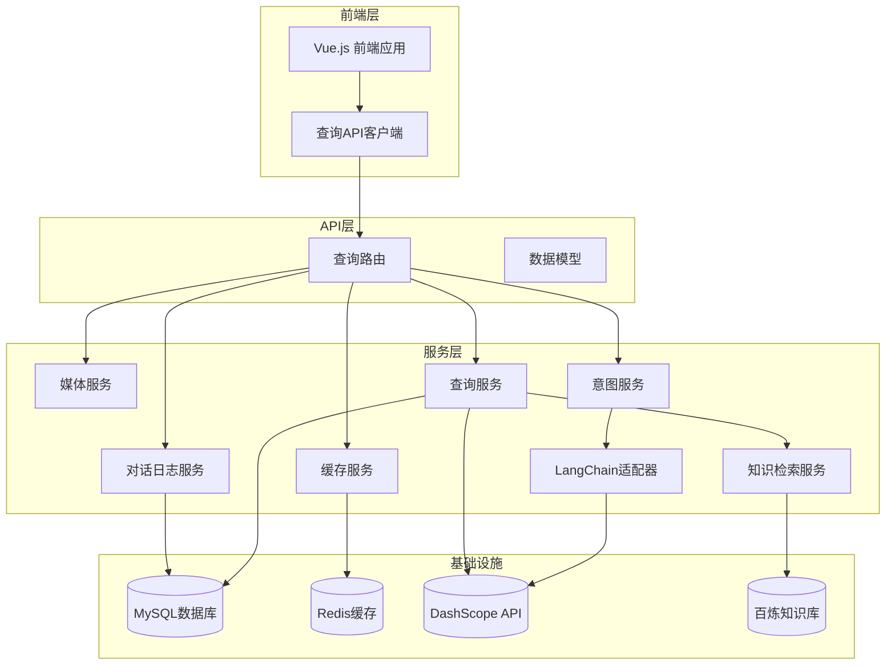
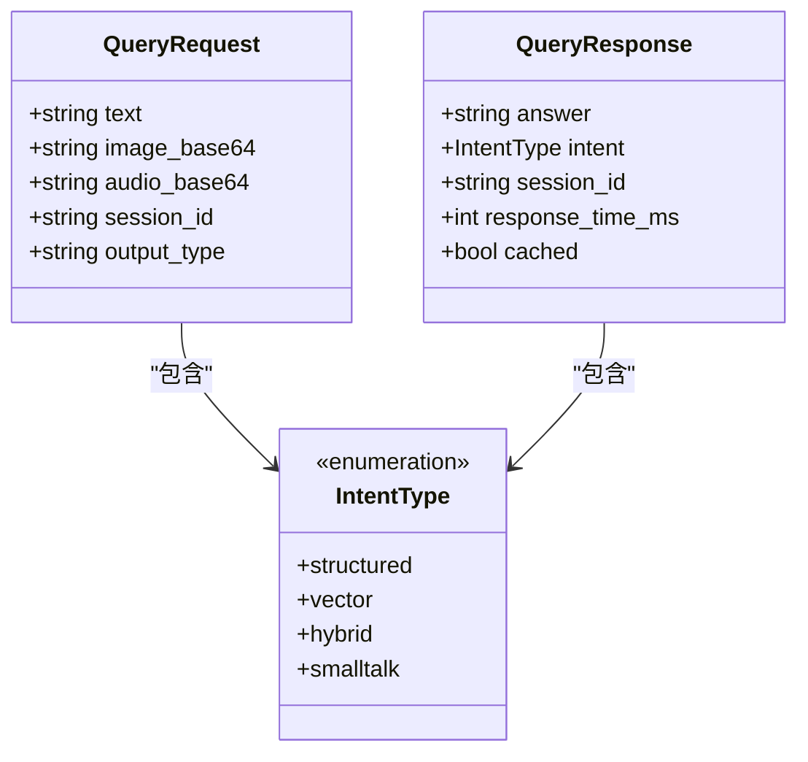
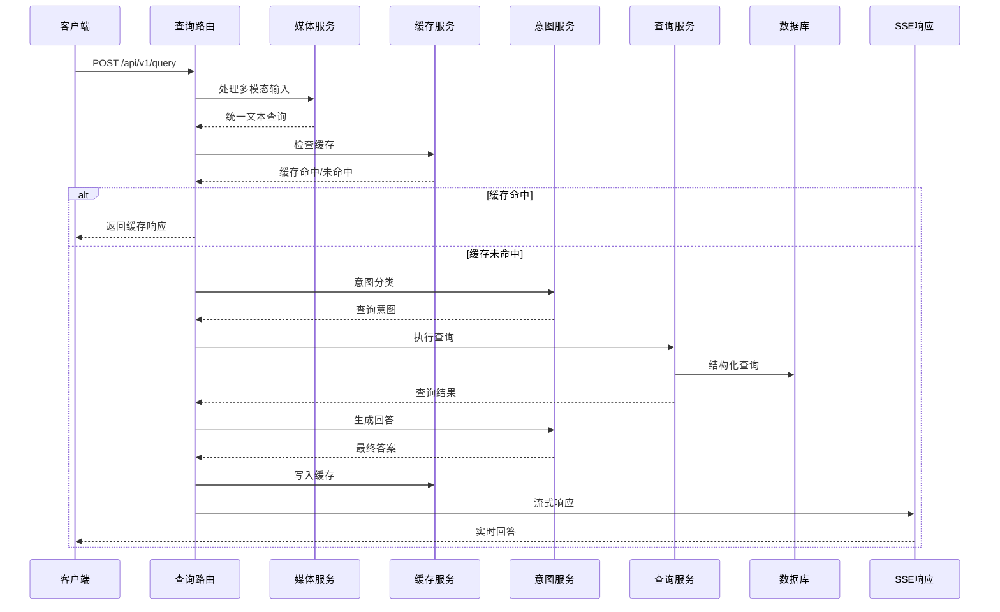
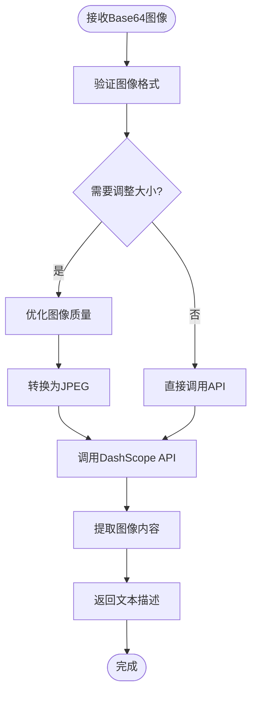
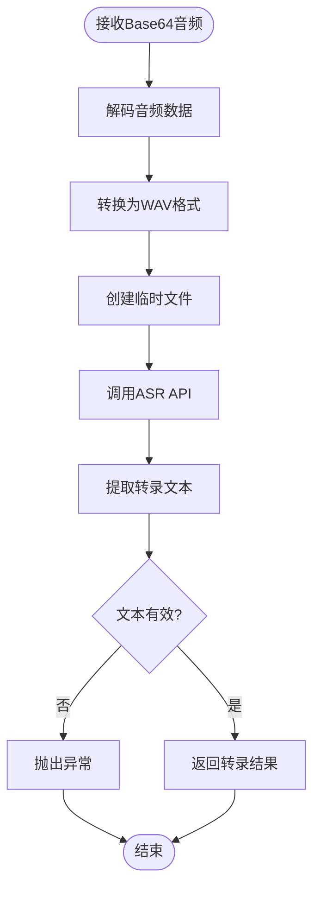
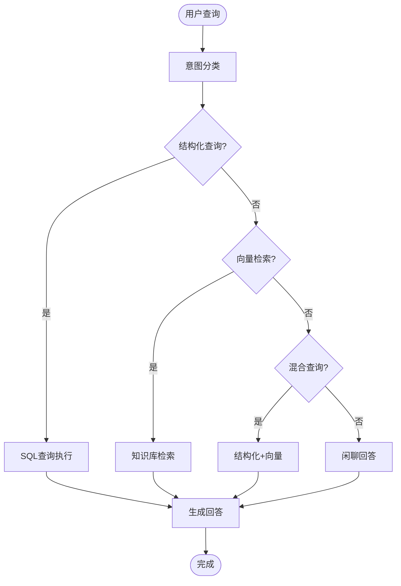
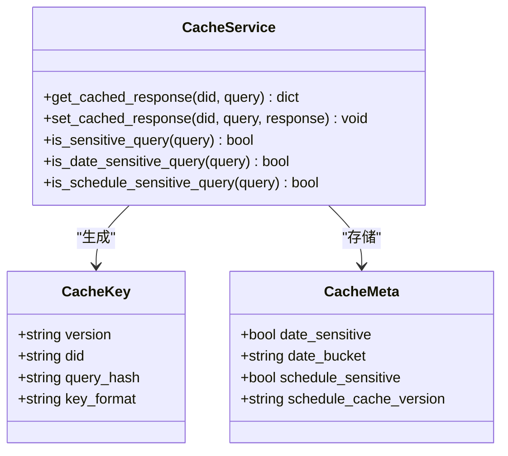
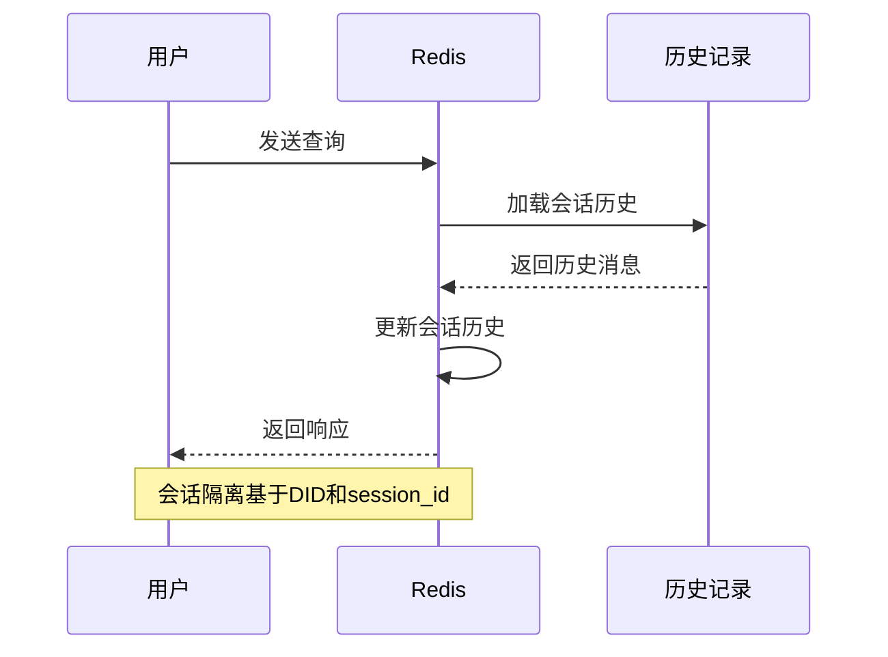
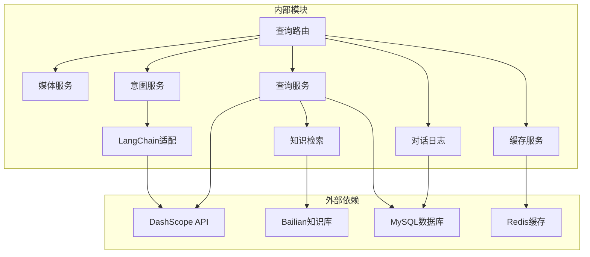

# 查询API模块

<cite>
**本文档引用的文件**
- [service/ai_assistant/app/routers/query.py](file://service/ai_assistant/app/routers/query.py)
- [service/ai_assistant/app/schemas/query.py](file://service/ai_assistant/app/schemas/query.py)
- [service/ai_assistant/app/services/query_service.py](file://service/ai_assistant/app/services/query_service.py)
- [service/ai_assistant/app/services/media_service.py](file://service/ai_assistant/app/services/media_service.py)
- [service/ai_assistant/app/services/intent_service.py](file://service/ai_assistant/app/services/intent_service.py)
- [service/ai_assistant/app/services/cache_service.py](file://service/ai_assistant/app/services/cache_service.py)
- [service/ai_assistant/app/services/chat_log_service.py](file://service/ai_assistant/app/services/chat_log_service.py)
- [service/ai_assistant/app/services/retriever_service.py](file://service/ai_assistant/app/services/retriever_service.py)
- [service/ai_assistant/app/services/langchain_service.py](file://service/ai_assistant/app/services/langchain_service.py)
- [service/ai_assistant/app/utils/logger.py](file://service/ai_assistant/app/utils/logger.py)
- [service/ai_assistant/app/config.py](file://service/ai_assistant/app/config.py)
- [frontend/ai_assistant/src/api/query.js](file://frontend/ai_assistant/src/api/query.js)
</cite>

## 目录
1. [简介](#简介)
2. [项目结构](#项目结构)
3. [核心组件](#核心组件)
4. [架构概览](#架构概览)
5. [详细组件分析](#详细组件分析)
6. [依赖关系分析](#依赖关系分析)
7. [性能考虑](#性能考虑)
8. [故障排除指南](#故障排除指南)
9. [结论](#结论)
10. [附录](#附录)

## 简介

AI校园助手查询API模块是整个系统的核心接口，负责处理来自认证学生的多模态查询请求。该模块实现了统一的查询入口，支持文本、图像和语音三种输入方式，提供实时流式响应和JSON结构化响应两种输出模式。

该模块的主要功能包括：
- 多模态输入处理（文本、图像、语音）
- 查询意图分类和重写
- 缓存机制和会话管理
- 结构化查询执行和知识库检索
- 实时流式响应生成
- 对话历史记录和隐私保护

## 项目结构

查询API模块采用分层架构设计，主要包含以下层次：



**图表来源**
- [service/ai_assistant/app/routers/query.py:1-788](file://service/ai_assistant/app/routers/query.py#L1-L788)
- [service/ai_assistant/app/schemas/query.py:1-33](file://service/ai_assistant/app/schemas/query.py#L1-L33)

**章节来源**
- [service/ai_assistant/app/routers/query.py:1-788](file://service/ai_assistant/app/routers/query.py#L1-L788)
- [service/ai_assistant/app/schemas/query.py:1-33](file://service/ai_assistant/app/schemas/query.py#L1-L33)

## 核心组件

### 查询路由层

查询路由层是API的入口点，负责处理HTTP请求和响应。主要特性包括：

- **统一查询端点**：`POST /api/v1/query` 处理所有类型的查询请求
- **多模态输入支持**：支持文本、Base64编码图像和音频
- **会话管理**：基于session_id的会话隔离机制
- **输出类型控制**：支持JSON结构化响应和SSE流式响应

### 数据模型层

数据模型层定义了查询请求和响应的标准格式：



**图表来源**
- [service/ai_assistant/app/schemas/query.py:8-33](file://service/ai_assistant/app/schemas/query.py#L8-L33)

### 服务层架构

服务层包含多个专门的服务模块，每个模块负责特定的功能领域：

- **媒体服务**：处理图像和音频的多模态转换
- **意图服务**：查询意图分类和回答生成
- **查询服务**：结构化查询执行和知识库检索
- **缓存服务**：Redis缓存管理和过期策略
- **对话日志服务**：隐私保护的对话记录管理

**章节来源**
- [service/ai_assistant/app/schemas/query.py:1-33](file://service/ai_assistant/app/schemas/query.py#L1-L33)
- [service/ai_assistant/app/services/media_service.py:1-246](file://service/ai_assistant/app/services/media_service.py#L1-L246)
- [service/ai_assistant/app/services/intent_service.py:1-346](file://service/ai_assistant/app/services/intent_service.py#L1-L346)

## 架构概览

查询API模块采用事件驱动的异步架构，支持高并发处理和实时响应：



**图表来源**
- [service/ai_assistant/app/routers/query.py:198-745](file://service/ai_assistant/app/routers/query.py#L198-L745)
- [service/ai_assistant/app/services/cache_service.py:92-177](file://service/ai_assistant/app/services/cache_service.py#L92-L177)

## 详细组件分析

### 多模态输入处理

多模态输入处理是查询API的核心功能之一，支持文本、图像和语音三种输入方式：

#### 图像处理流程



**图表来源**
- [service/ai_assistant/app/services/media_service.py:115-156](file://service/ai_assistant/app/services/media_service.py#L115-L156)

#### 语音处理流程

语音处理通过DashScope ASR API实现，支持多种音频格式：



**图表来源**
- [service/ai_assistant/app/services/media_service.py:159-245](file://service/ai_assistant/app/services/media_service.py#L159-L245)

### 查询意图分类

查询意图分类是决定查询处理路径的关键步骤，支持四种意图类型：



**图表来源**
- [service/ai_assistant/app/services/intent_service.py:218-248](file://service/ai_assistant/app/services/intent_service.py#L218-L248)

### 缓存机制

缓存机制采用Redis实现，支持不同级别的缓存策略：



**图表来源**
- [service/ai_assistant/app/services/cache_service.py:49-177](file://service/ai_assistant/app/services/cache_service.py#L49-L177)

### 会话管理

会话管理通过Redis实现，支持多会话隔离和历史记录：



**图表来源**
- [service/ai_assistant/app/routers/query.py:153-196](file://service/ai_assistant/app/routers/query.py#L153-L196)

**章节来源**
- [service/ai_assistant/app/services/media_service.py:1-246](file://service/ai_assistant/app/services/media_service.py#L1-L246)
- [service/ai_assistant/app/services/intent_service.py:1-346](file://service/ai_assistant/app/services/intent_service.py#L1-L346)
- [service/ai_assistant/app/services/cache_service.py:1-177](file://service/ai_assistant/app/services/cache_service.py#L1-L177)
- [service/ai_assistant/app/routers/query.py:153-196](file://service/ai_assistant/app/routers/query.py#L153-L196)

## 依赖关系分析

查询API模块的依赖关系复杂但清晰，主要依赖包括：



**图表来源**
- [service/ai_assistant/app/routers/query.py:35-42](file://service/ai_assistant/app/routers/query.py#L35-L42)
- [service/ai_assistant/app/services/retriever_service.py:1-168](file://service/ai_assistant/app/services/retriever_service.py#L1-L168)

**章节来源**
- [service/ai_assistant/app/routers/query.py:35-42](file://service/ai_assistant/app/routers/query.py#L35-L42)
- [service/ai_assistant/app/services/retriever_service.py:1-168](file://service/ai_assistant/app/services/retriever_service.py#L1-L168)

## 性能考虑

查询API模块在设计时充分考虑了性能优化：

### 并发处理

- **异步I/O操作**：所有外部API调用都使用异步方式，避免阻塞
- **并发任务调度**：安全检查、隐私检查和查询重写并行执行
- **连接池管理**：数据库连接采用异步连接池，提高资源利用率

### 缓存策略

- **多级缓存**：Redis缓存 + 应用层缓存
- **智能过期**：基于查询敏感性和时间敏感性的差异化过期策略
- **版本控制**：课表缓存版本控制，确保数据一致性

### 流式响应

- **SSE实现**：使用Server-Sent Events实现实时流式响应
- **增量输出**：LLM生成采用增量输出，提高用户体验
- **背压处理**：合理控制流式输出的频率和大小

## 故障排除指南

### 常见问题及解决方案

#### 多模态输入处理问题

**问题**：图像处理失败
**原因**：图像格式不支持或尺寸过大
**解决方案**：检查图像格式是否为JPEG/PNG，确保图像尺寸不超过限制

**问题**：语音识别失败
**原因**：音频质量差或格式不支持
**解决方案**：确保音频为WAV/MP3格式，采样率为16kHz，单声道

#### 缓存相关问题

**问题**：缓存未生效
**原因**：Redis连接失败或缓存键生成错误
**解决方案**：检查Redis配置，验证缓存键格式

**问题**：缓存过期异常
**原因**：敏感查询缓存策略不当
**解决方案**：检查敏感关键词匹配规则

#### 意图分类问题

**问题**：查询意图识别错误
**原因**：LLM模型配置不当或提示词不够清晰
**解决方案**：调整LLM模型参数，优化提示词模板

**章节来源**
- [service/ai_assistant/app/routers/query.py:142-151](file://service/ai_assistant/app/routers/query.py#L142-L151)
- [service/ai_assistant/app/services/media_service.py:63-113](file://service/ai_assistant/app/services/media_service.py#L63-L113)

## 结论

AI校园助手查询API模块是一个设计精良的多模态查询系统，具有以下特点：

1. **全面的多模态支持**：统一处理文本、图像和语音输入
2. **智能化的查询处理**：基于意图分类的智能查询路由
3. **高性能的架构设计**：异步处理、并发优化和智能缓存
4. **完善的隐私保护**：基于DID的隐私保护机制
5. **丰富的用户体验**：支持流式响应和JSON结构化响应

该模块为AI校园助手提供了强大的查询能力，能够满足现代高校的多样化需求。

## 附录

### API调用示例

#### 基础查询调用

```javascript
// JSON响应示例
const response = await queryApi.ask({
  text: "我的课表是什么？",
  session_id: "unique-session-id",
  output_type: "json"
});

// 流式响应示例
await queryApi.askStream({
  text: "我的成绩怎么样？",
  session_id: "unique-session-id"
}, (data) => {
  console.log("收到数据:", data.chunk);
  if (data.done) {
    console.log("查询完成");
  }
});
```

#### 多模态查询示例

```javascript
// 图像查询
const imageQuery = {
  image_base64: "base64-encoded-image-data",
  text: "解释这个图片中的内容"
};

// 语音查询
const audioQuery = {
  audio_base64: "base64-encoded-audio-data",
  text: "请告诉我这段录音说了什么"
};
```

### 最佳实践

1. **并发查询处理**：合理设置并发数量，避免过度并发导致资源竞争
2. **缓存策略**：根据查询类型选择合适的缓存策略，敏感查询使用短缓存
3. **错误处理**：实现完善的错误处理机制，提供友好的错误提示
4. **性能监控**：建立性能监控体系，及时发现和解决性能问题
5. **安全考虑**：实施严格的输入验证和输出过滤，防止恶意攻击