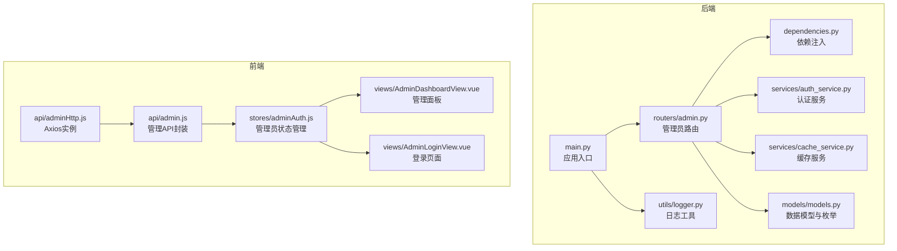
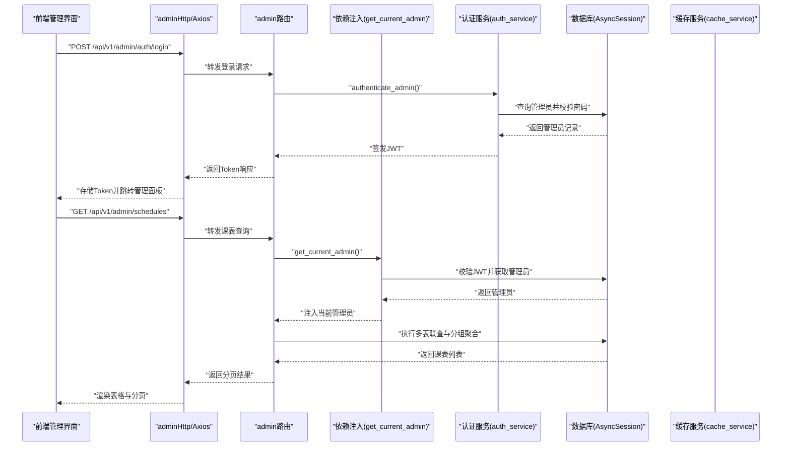
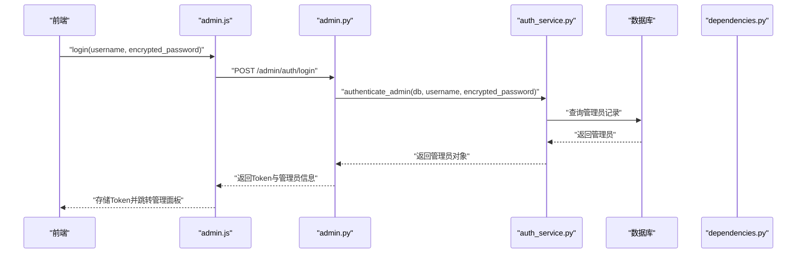
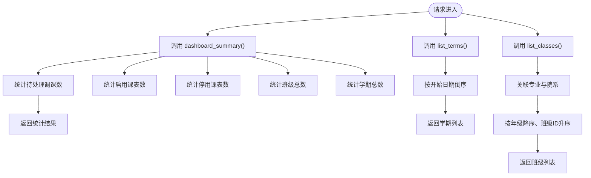
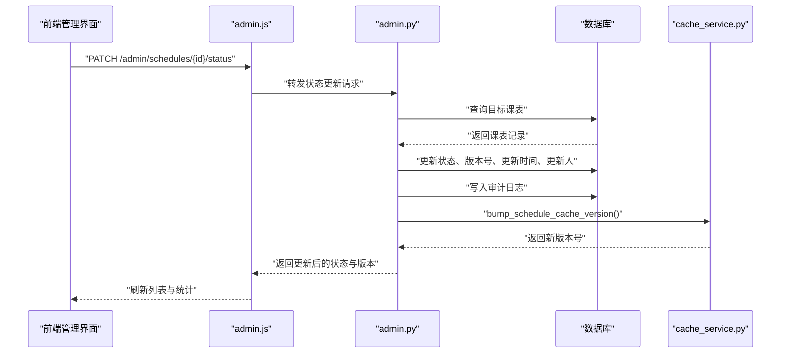
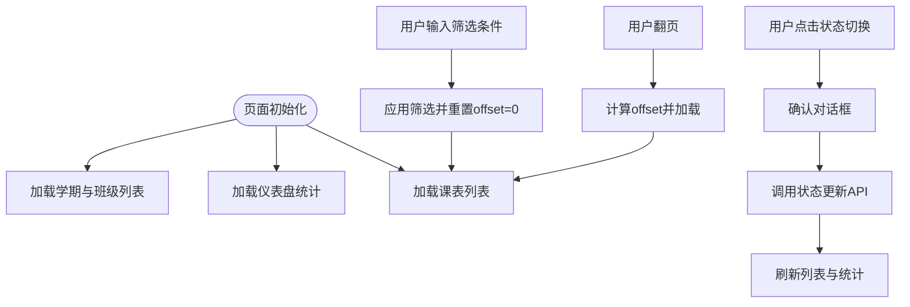
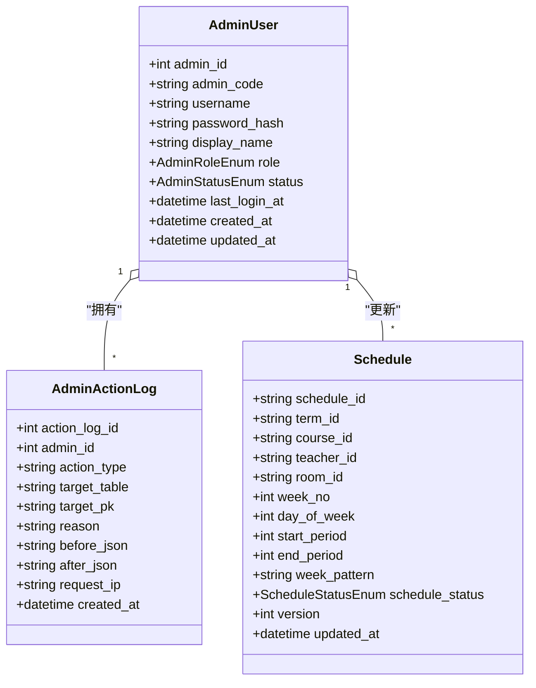
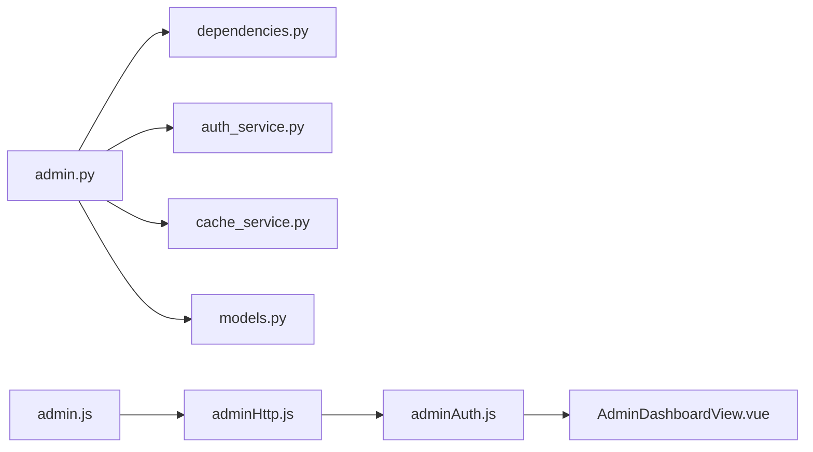

# 管理API模块

<cite>
**本文档引用的文件**
- [admin.py](file://service/ai_assistant/app/routers/admin.py)
- [admin.py](file://service/ai_assistant/app/schemas/admin.py)
- [admin.js](file://frontend/ai_assistant/src/api/admin.js)
- [adminAuth.js](file://frontend/ai_assistant/src/stores/adminAuth.js)
- [dependencies.py](file://service/ai_assistant/app/dependencies.py)
- [auth_service.py](file://service/ai_assistant/app/services/auth_service.py)
- [models.py](file://service/ai_assistant/app/models/models.py)
- [adminHttp.js](file://frontend/ai_assistant/src/api/adminHttp.js)
- [AdminDashboardView.vue](file://frontend/ai_assistant/src/views/AdminDashboardView.vue)
- [AdminLoginView.vue](file://frontend/ai_assistant/src/views/AdminLoginView.vue)
- [cache_service.py](file://service/ai_assistant/app/services/cache_service.py)
- [logger.py](file://service/ai_assistant/app/utils/logger.py)
- [main.py](file://service/ai_assistant/app/main.py)
</cite>

## 目录
1. [简介](#简介)
2. [项目结构](#项目结构)
3. [核心组件](#核心组件)
4. [架构总览](#架构总览)
5. [详细组件分析](#详细组件分析)
6. [依赖关系分析](#依赖关系分析)
7. [性能考虑](#性能考虑)
8. [故障排除指南](#故障排除指南)
9. [结论](#结论)
10. [附录](#附录)

## 简介
本文件面向AI校园助手项目的管理API模块，系统化梳理管理员相关的接口实现，涵盖用户管理、系统监控与数据统计功能；深入解析数据结构、权限控制机制、管理操作的数据流与更新流程、安全策略以及最佳实践。文档同时提供管理界面的数据获取与更新流程说明，并通过可视化图表帮助读者快速理解前后端协作关系与关键业务流程。

## 项目结构
管理API模块主要分布在后端FastAPI应用与前端Vue应用中：
- 后端：路由层负责暴露REST接口，依赖注入层提供认证与数据库连接，服务层封装认证与缓存逻辑，模型层定义数据结构与枚举类型。
- 前端：API适配层负责与后端交互，状态管理负责管理员登录态与持久化，视图层负责管理界面的数据展示与交互。

**图表来源**
- [main.py:52-86](file://service/ai_assistant/app/main.py#L52-L86)
- [admin.py:48-388](file://service/ai_assistant/app/routers/admin.py#L48-L388)
- [dependencies.py:1-109](file://service/ai_assistant/app/dependencies.py#L1-L109)
- [auth_service.py:1-253](file://service/ai_assistant/app/services/auth_service.py#L1-L253)
- [cache_service.py:1-177](file://service/ai_assistant/app/services/cache_service.py#L1-L177)
- [models.py:25-112](file://service/ai_assistant/app/models/models.py#L25-L112)
- [adminHttp.js:1-44](file://frontend/ai_assistant/src/api/adminHttp.js#L1-L44)
- [admin.js:1-41](file://frontend/ai_assistant/src/api/admin.js#L1-L41)
- [adminAuth.js:1-77](file://frontend/ai_assistant/src/stores/adminAuth.js#L1-L77)
- [AdminDashboardView.vue:1-688](file://frontend/ai_assistant/src/views/AdminDashboardView.vue#L1-L688)
- [AdminLoginView.vue:1-261](file://frontend/ai_assistant/src/views/AdminLoginView.vue#L1-L261)

**章节来源**
- [main.py:52-86](file://service/ai_assistant/app/main.py#L52-L86)
- [admin.py:48-388](file://service/ai_assistant/app/routers/admin.py#L48-L388)

## 核心组件
- 管理员认证与权限控制：基于JWT的管理员登录、当前管理员信息获取、基于依赖注入的认证中间件与状态校验。
- 系统监控与统计：仪表盘概览统计接口，聚合待处理调课、启用/停用课表数量、班级与学期总数。
- 元数据管理：学期列表与班级列表查询，支持排序与关联字段映射。
- 课表管理：课表列表查询（支持多条件过滤、分页、排序），课表状态更新（启用/停用），并记录操作审计。
- 前端交互：Axios拦截器自动附加管理员JWT，401自动登出；Pinia状态管理持久化管理员信息；Vue组件负责数据获取、筛选、分页与状态切换。

**章节来源**
- [admin.py:51-82](file://service/ai_assistant/app/routers/admin.py#L51-L82)
- [admin.py:85-99](file://service/ai_assistant/app/routers/admin.py#L85-L99)
- [admin.py:102-144](file://service/ai_assistant/app/routers/admin.py#L102-L144)
- [admin.py:147-196](file://service/ai_assistant/app/routers/admin.py#L147-L196)
- [admin.py:199-301](file://service/ai_assistant/app/routers/admin.py#L199-L301)
- [admin.py:304-387](file://service/ai_assistant/app/routers/admin.py#L304-L387)
- [adminHttp.js:20-41](file://frontend/ai_assistant/src/api/adminHttp.js#L20-L41)
- [adminAuth.js:16-77](file://frontend/ai_assistant/src/stores/adminAuth.js#L16-L77)
- [AdminDashboardView.vue:178-361](file://frontend/ai_assistant/src/views/AdminDashboardView.vue#L178-L361)

## 架构总览
管理API采用“路由-依赖-服务-模型”的分层设计，前端通过Axios实例与后端交互，后端通过依赖注入获取数据库与Redis连接，服务层完成认证与缓存操作，模型层定义数据结构与枚举类型。

**图表来源**
- [adminHttp.js:12-18](file://frontend/ai_assistant/src/api/adminHttp.js#L12-L18)
- [admin.py:51-82](file://service/ai_assistant/app/routers/admin.py#L51-L82)
- [auth_service.py:212-252](file://service/ai_assistant/app/services/auth_service.py#L212-L252)
- [dependencies.py:75-107](file://service/ai_assistant/app/dependencies.py#L75-L107)
- [admin.py:199-301](file://service/ai_assistant/app/routers/admin.py#L199-L301)

## 详细组件分析

### 管理员认证与权限控制
- 登录接口：接收用户名与AES加密密码，调用认证服务验证管理员账户与密码，签发JWT并返回管理员信息。
- 当前管理员信息：通过依赖注入获取当前管理员，返回管理员基本信息。
- 权限校验：依赖注入中间件解码JWT，校验管理员存在且状态为激活，否则抛出401/403。

**图表来源**
- [admin.js:7-12](file://frontend/ai_assistant/src/api/admin.js#L7-L12)
- [admin.py:51-82](file://service/ai_assistant/app/routers/admin.py#L51-L82)
- [auth_service.py:212-252](file://service/ai_assistant/app/services/auth_service.py#L212-L252)
- [dependencies.py:75-107](file://service/ai_assistant/app/dependencies.py#L75-L107)

**章节来源**
- [admin.py:51-82](file://service/ai_assistant/app/routers/admin.py#L51-L82)
- [admin.py:85-99](file://service/ai_assistant/app/routers/admin.py#L85-L99)
- [dependencies.py:75-107](file://service/ai_assistant/app/dependencies.py#L75-L107)
- [auth_service.py:212-252](file://service/ai_assistant/app/services/auth_service.py#L212-L252)

### 系统监控与数据统计
- 仪表盘统计：聚合待处理调课、启用/停用课表数量、班级与学期总数，用于管理面板概览。
- 元数据查询：学期列表按开始日期倒序排列；班级列表按年级降序、班级ID升序排列，并关联专业与院系信息。

**图表来源**
- [admin.py:102-144](file://service/ai_assistant/app/routers/admin.py#L102-L144)
- [admin.py:147-196](file://service/ai_assistant/app/routers/admin.py#L147-L196)

**章节来源**
- [admin.py:102-144](file://service/ai_assistant/app/routers/admin.py#L102-L144)
- [admin.py:147-196](file://service/ai_assistant/app/routers/admin.py#L147-L196)

### 课表管理与状态更新
- 列表查询：支持按学期、班级、周次、状态、关键词过滤，支持分页与排序；内部执行多表联查并按课表ID分组聚合班级信息。
- 状态更新：支持将课表状态从启用切换为停用，或从停用切换为启用；更新版本号与更新时间，并记录管理员操作审计日志；更新后递增课表缓存版本以失效相关缓存。

**图表来源**
- [admin.js:34-39](file://frontend/ai_assistant/src/api/admin.js#L34-L39)
- [admin.py:304-387](file://service/ai_assistant/app/routers/admin.py#L304-L387)
- [cache_service.py:78-82](file://service/ai_assistant/app/services/cache_service.py#L78-L82)

**章节来源**
- [admin.py:199-301](file://service/ai_assistant/app/routers/admin.py#L199-L301)
- [admin.py:304-387](file://service/ai_assistant/app/routers/admin.py#L304-L387)
- [cache_service.py:70-82](file://service/ai_assistant/app/services/cache_service.py#L70-L82)

### 前端交互与状态管理
- Axios拦截器：自动在请求头附加管理员JWT；响应拦截器处理401错误，自动清理管理员状态并跳转登录页。
- 管理员认证状态：Pinia Store持久化管理员Token、ID、用户名、显示名、角色与过期时间，提供登录与登出方法。
- 管理面板：异步加载元数据与统计，支持筛选条件与分页，点击按钮切换课表状态并刷新数据。

**图表来源**
- [AdminDashboardView.vue:233-361](file://frontend/ai_assistant/src/views/AdminDashboardView.vue#L233-L361)
- [adminHttp.js:20-41](file://frontend/ai_assistant/src/api/adminHttp.js#L20-L41)
- [adminAuth.js:16-77](file://frontend/ai_assistant/src/stores/adminAuth.js#L16-L77)

**章节来源**
- [adminHttp.js:20-41](file://frontend/ai_assistant/src/api/adminHttp.js#L20-L41)
- [adminAuth.js:16-77](file://frontend/ai_assistant/src/stores/adminAuth.js#L16-L77)
- [AdminDashboardView.vue:178-361](file://frontend/ai_assistant/src/views/AdminDashboardView.vue#L178-L361)

### 数据模型与枚举
- 管理员角色与状态：支持超级管理员、调度管理员、安全管理员、只读管理员；支持激活、禁用、锁定状态。
- 管理员审计日志：记录管理员操作类型、目标表、主键、变更前后JSON、请求IP与创建时间。
- 课表状态：支持启用与停用两种状态，配合版本号与更新时间字段。

**图表来源**
- [models.py:28-84](file://service/ai_assistant/app/models/models.py#L28-L84)
- [models.py:86-112](file://service/ai_assistant/app/models/models.py#L86-L112)
- [models.py:177-220](file://service/ai_assistant/app/models/models.py#L177-L220)

**章节来源**
- [models.py:28-84](file://service/ai_assistant/app/models/models.py#L28-L84)
- [models.py:86-112](file://service/ai_assistant/app/models/models.py#L86-L112)
- [models.py:177-220](file://service/ai_assistant/app/models/models.py#L177-L220)

## 依赖关系分析
- 路由依赖：管理员路由依赖依赖注入函数获取当前管理员、数据库会话与Redis客户端。
- 认证依赖：认证服务依赖数据库查询管理员、密码解密与哈希验证。
- 缓存依赖：状态更新后依赖缓存服务递增课表缓存版本，确保相关查询失效。
- 日志依赖：统一日志配置，便于审计与问题排查。

**图表来源**
- [admin.py:12-46](file://service/ai_assistant/app/routers/admin.py#L12-L46)
- [dependencies.py:1-109](file://service/ai_assistant/app/dependencies.py#L1-109)
- [auth_service.py:1-253](file://service/ai_assistant/app/services/auth_service.py#L1-L253)
- [cache_service.py:1-177](file://service/ai_assistant/app/services/cache_service.py#L1-L177)
- [models.py:25-112](file://service/ai_assistant/app/models/models.py#L25-L112)
- [admin.js:1-41](file://frontend/ai_assistant/src/api/admin.js#L1-L41)
- [adminHttp.js:1-44](file://frontend/ai_assistant/src/api/adminHttp.js#L1-L44)
- [adminAuth.js:1-77](file://frontend/ai_assistant/src/stores/adminAuth.js#L1-L77)
- [AdminDashboardView.vue:1-688](file://frontend/ai_assistant/src/views/AdminDashboardView.vue#L1-L688)

**章节来源**
- [admin.py:12-46](file://service/ai_assistant/app/routers/admin.py#L12-L46)
- [dependencies.py:1-109](file://service/ai_assistant/app/dependencies.py#L1-109)
- [auth_service.py:1-253](file://service/ai_assistant/app/services/auth_service.py#L1-L253)
- [cache_service.py:1-177](file://service/ai_assistant/app/services/cache_service.py#L1-L177)
- [models.py:25-112](file://service/ai_assistant/app/models/models.py#L25-L112)
- [admin.js:1-41](file://frontend/ai_assistant/src/api/admin.js#L1-L41)
- [adminHttp.js:1-44](file://frontend/ai_assistant/src/api/adminHttp.js#L1-L44)
- [adminAuth.js:1-77](file://frontend/ai_assistant/src/stores/adminAuth.js#L1-L77)
- [AdminDashboardView.vue:1-688](file://frontend/ai_assistant/src/views/AdminDashboardView.vue#L1-L688)

## 性能考虑
- 查询优化：课表列表查询通过多表联查与分组聚合减少N+1查询；支持关键词模糊匹配与多条件组合过滤。
- 分页与排序：固定最大分页大小与偏移量，避免超大结果集导致内存压力。
- 缓存策略：课表相关查询在管理员改课后通过版本号递增主动失效，避免脏缓存；普通查询与敏感查询分别设置不同TTL。
- 并发与异步：数据库与Redis均采用异步客户端，提高并发处理能力。

[本节为通用性能建议，无需特定文件来源]

## 故障排除指南
- 登录失败（401）：检查用户名与AES加密密码是否正确，确认后端日志中的认证异常信息。
- 账号不可用（403）：管理员状态非激活，需联系系统管理员恢复。
- 课表状态更新失败：确认课表是否存在、状态是否相同、是否有权限；查看审计日志定位问题。
- 前端401自动登出：Axios拦截器检测到401后自动清理本地存储并跳转登录页，需重新登录。

**章节来源**
- [admin.py:61-72](file://service/ai_assistant/app/routers/admin.py#L61-L72)
- [dependencies.py:100-107](file://service/ai_assistant/app/dependencies.py#L100-L107)
- [adminHttp.js:31-41](file://frontend/ai_assistant/src/api/adminHttp.js#L31-L41)
- [logger.py:17-47](file://service/ai_assistant/app/utils/logger.py#L17-L47)

## 结论
管理API模块通过清晰的分层设计与完善的权限控制，实现了管理员登录、系统监控、元数据管理与课表状态更新等核心功能。前端通过Axios拦截器与Pinia状态管理提供了良好的用户体验，后端通过依赖注入、认证服务与缓存服务保障了安全性与性能。建议在生产环境中强化CORS配置、密钥管理与审计日志，持续优化查询与缓存策略。

[本节为总结性内容，无需特定文件来源]

## 附录

### 管理API调用最佳实践
- 数据表格处理：使用分页参数limit与offset，避免一次性加载过多数据；在筛选条件变化时重置offset为0。
- 表单验证：前端对必填字段进行基础校验，后端对请求体进行Pydantic模型验证与范围约束。
- 批量操作优化：对于频繁的状态更新，建议合并请求或使用后台任务队列，避免阻塞主线程。

[本节为通用最佳实践，无需特定文件来源]

### 管理操作示例
- 管理员登录：前端调用登录API，后端验证后返回JWT；前端存储Token并在后续请求中自动附加。
- 获取仪表盘统计：前端调用统计接口，后端聚合数据并返回。
- 查询课表列表：前端构建筛选参数，后端执行多表联查与分组聚合，返回分页结果。
- 更新课表状态：前端触发状态切换，后端更新状态并记录审计日志，同时递增缓存版本。

**章节来源**
- [admin.js:7-12](file://frontend/ai_assistant/src/api/admin.js#L7-L12)
- [admin.js:18-20](file://frontend/ai_assistant/src/api/admin.js#L18-L20)
- [admin.js:30-32](file://frontend/ai_assistant/src/api/admin.js#L30-L32)
- [admin.js:34-39](file://frontend/ai_assistant/src/api/admin.js#L34-L39)
- [admin.py:51-82](file://service/ai_assistant/app/routers/admin.py#L51-L82)
- [admin.py:102-144](file://service/ai_assistant/app/routers/admin.py#L102-L144)
- [admin.py:199-301](file://service/ai_assistant/app/routers/admin.py#L199-L301)
- [admin.py:304-387](file://service/ai_assistant/app/routers/admin.py#L304-L387)