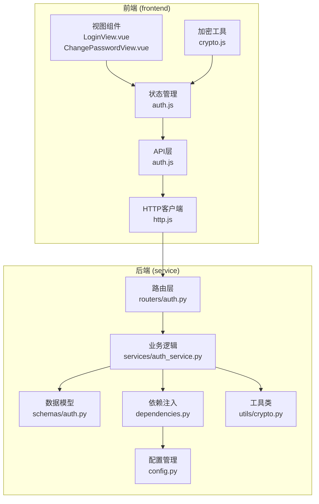
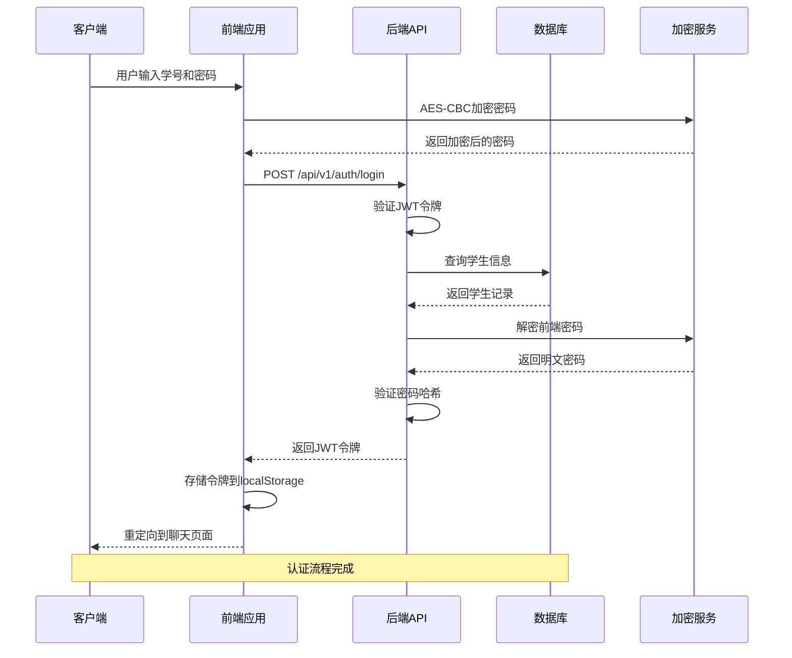
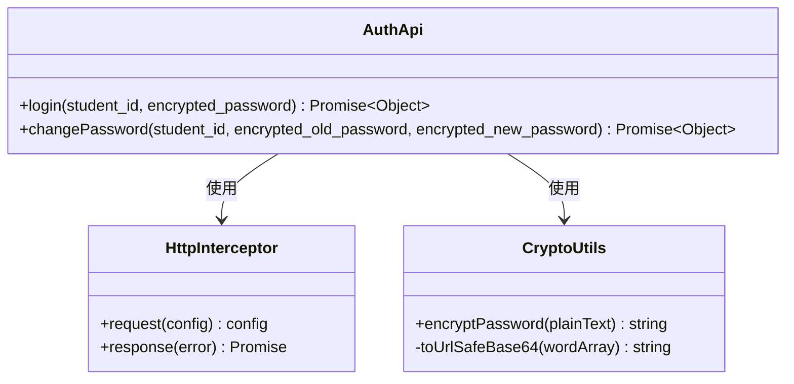
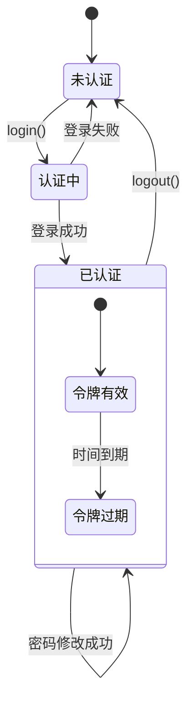
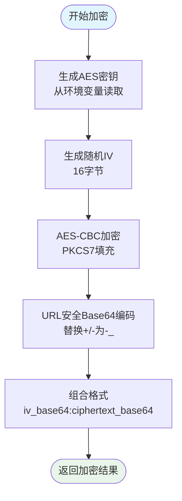
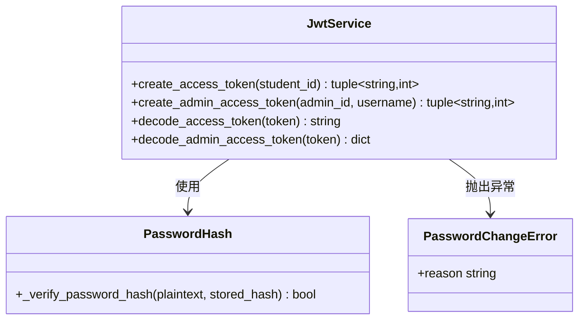
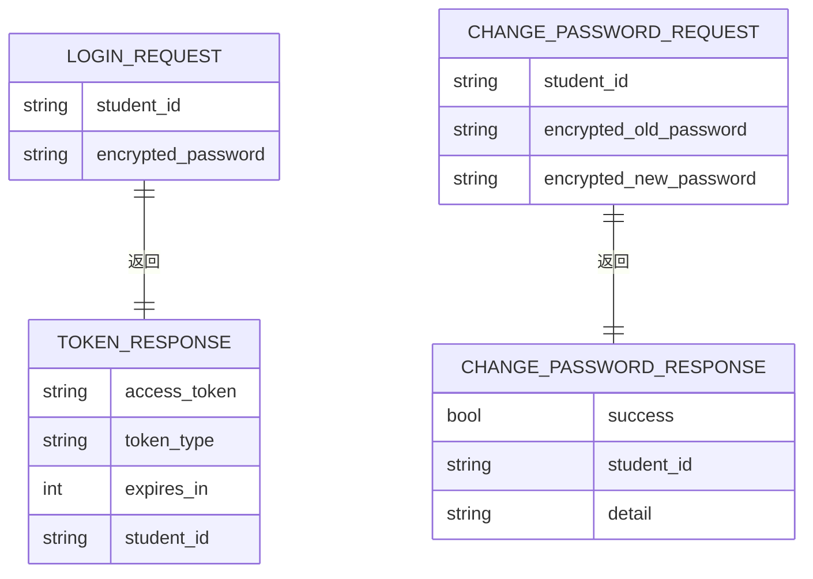
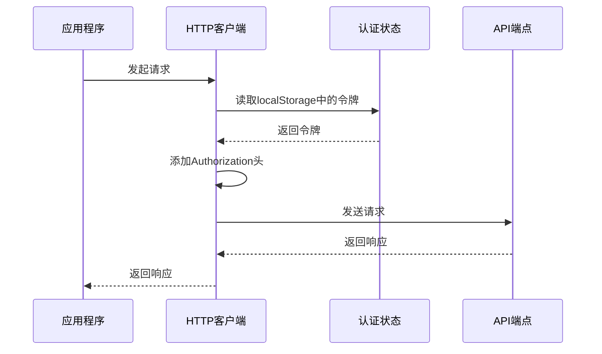
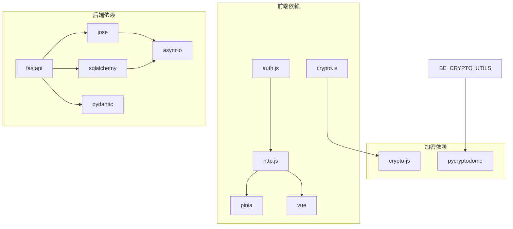

# 认证API模块

<cite>
**本文档引用的文件**
- [auth.js](file://frontend/ai_assistant/src/api/auth.js)
- [http.js](file://frontend/ai_assistant/src/api/http.js)
- [auth.js](file://frontend/ai_assistant/src/stores/auth.js)
- [crypto.js](file://frontend/ai_assistant/src/utils/crypto.js)
- [LoginView.vue](file://frontend/ai_assistant/src/views/LoginView.vue)
- [ChangePasswordView.vue](file://frontend/ai_assistant/src/views/ChangePasswordView.vue)
- [auth.py](file://service/ai_assistant/app/routers/auth.py)
- [auth.py](file://service/ai_assistant/app/schemas/auth.py)
- [auth_service.py](file://service/ai_assistant/app/services/auth_service.py)
- [dependencies.py](file://service/ai_assistant/app/dependencies.py)
- [config.py](file://service/ai_assistant/app/config.py)
- [crypto.py](file://service/ai_assistant/app/utils/crypto.py)
</cite>

## 目录
1. [简介](#简介)
2. [项目结构](#项目结构)
3. [核心组件](#核心组件)
4. [架构概览](#架构概览)
5. [详细组件分析](#详细组件分析)
6. [依赖关系分析](#依赖关系分析)
7. [性能考虑](#性能考虑)
8. [故障排除指南](#故障排除指南)
9. [结论](#结论)

## 简介

AI校园助手项目的认证API模块是一个完整的身份验证系统，支持学生登录、密码修改和基于JWT的令牌管理。该模块采用前后端分离的设计模式，前端使用Vue.js和Pinia进行状态管理，后端使用FastAPI构建RESTful API。

本模块的核心特性包括：
- AES-CBC加密的密码传输
- JWT令牌认证机制
- 前后端一致的加密标准
- 完整的错误处理和用户引导
- 响应式状态管理和用户体验优化

## 项目结构

认证模块在项目中的组织结构如下：

**图表来源**
- [auth.js:1-36](file://frontend/ai_assistant/src/api/auth.js#L1-L36)
- [auth.js:1-77](file://frontend/ai_assistant/src/stores/auth.js#L1-L77)
- [auth.py:1-102](file://service/ai_assistant/app/routers/auth.py#L1-L102)

**章节来源**
- [auth.js:1-36](file://frontend/ai_assistant/src/api/auth.js#L1-L36)
- [auth.js:1-77](file://frontend/ai_assistant/src/stores/auth.js#L1-L77)
- [auth.py:1-102](file://service/ai_assistant/app/routers/auth.py#L1-L102)

## 核心组件

### 前端认证组件

前端认证系统由以下核心组件构成：

#### API层
- **auth.js**: 提供认证相关的API接口封装
- **http.js**: Axios实例配置，包含请求/响应拦截器
- **crypto.js**: AES-CBC加密工具，确保密码传输安全

#### 状态管理层
- **auth.js**: Pinia状态管理，处理认证状态和本地存储

#### 视图组件
- **LoginView.vue**: 学生登录界面，包含表单验证和错误处理
- **ChangePasswordView.vue**: 密码修改界面，提供密码强度检测

### 后端认证组件

#### 路由层
- **routers/auth.py**: 定义认证相关的API端点
- **schemas/auth.py**: Pydantic数据模型，定义请求和响应格式

#### 业务逻辑层
- **services/auth_service.py**: 核心认证逻辑，包括JWT令牌创建和验证
- **dependencies.py**: 依赖注入和认证中间件

#### 工具和配置
- **utils/crypto.py**: 后端密码解密工具
- **config.py**: 应用程序配置，包括JWT和AES密钥设置

**章节来源**
- [auth.js:1-36](file://frontend/ai_assistant/src/api/auth.js#L1-L36)
- [auth.js:1-77](file://frontend/ai_assistant/src/stores/auth.js#L1-L77)
- [auth.py:1-102](file://service/ai_assistant/app/routers/auth.py#L1-L102)
- [auth.py:1-56](file://service/ai_assistant/app/schemas/auth.py#L1-L56)

## 架构概览

认证系统的整体架构采用分层设计，确保了清晰的关注点分离和良好的可维护性。

**图表来源**
- [LoginView.vue:94-121](file://frontend/ai_assistant/src/views/LoginView.vue#L94-L121)
- [auth.js:29-43](file://frontend/ai_assistant/src/stores/auth.js#L29-L43)
- [auth.py:33-52](file://service/ai_assistant/app/routers/auth.py#L33-L52)
- [auth_service.py:125-169](file://service/ai_assistant/app/services/auth_service.py#L125-L169)

## 详细组件分析

### 前端认证API层

#### 认证API接口定义

前端认证API层提供了两个核心接口：

**图表来源**
- [auth.js:8-35](file://frontend/ai_assistant/src/api/auth.js#L8-L35)
- [http.js:18-47](file://frontend/ai_assistant/src/api/http.js#L18-L47)
- [crypto.js:26-39](file://frontend/ai_assistant/src/utils/crypto.js#L26-L39)

#### 登录接口实现

登录接口负责处理学生身份验证和JWT令牌获取：

**章节来源**
- [auth.js:15-20](file://frontend/ai_assistant/src/api/auth.js#L15-L20)
- [auth.js:29-43](file://frontend/ai_assistant/src/stores/auth.js#L29-L43)

#### 密码修改接口实现

密码修改接口提供安全的密码更新功能：

**章节来源**
- [auth.js:29-35](file://frontend/ai_assistant/src/api/auth.js#L29-L35)
- [auth.js:46-56](file://frontend/ai_assistant/src/stores/auth.js#L46-L56)

### 前端状态管理

#### 认证状态管理

前端使用Pinia进行状态管理，实现了完整的认证状态跟踪：

**图表来源**
- [auth.js:17-77](file://frontend/ai_assistant/src/stores/auth.js#L17-L77)

#### 本地存储策略

认证信息存储在localStorage中，包含以下键值：

| 键名 | 类型 | 描述 |
|------|------|------|
| campus_ai_token | string | JWT访问令牌 |
| campus_ai_student_id | string | 学生ID |
| campus_ai_expires_at | number | 令牌过期时间戳 |

**章节来源**
- [auth.js:13-15](file://frontend/ai_assistant/src/stores/auth.js#L13-L15)
- [auth.js:19-26](file://frontend/ai_assistant/src/stores/auth.js#L19-L26)

### 前端加密工具

#### AES-CBC加密实现

前端使用CryptoJS库实现AES-CBC加密，确保密码在传输过程中的安全性：

**图表来源**
- [crypto.js:26-39](file://frontend/ai_assistant/src/utils/crypto.js#L26-L39)

**章节来源**
- [crypto.js:1-40](file://frontend/ai_assistant/src/utils/crypto.js#L1-L40)

### 后端认证服务

#### JWT令牌管理

后端使用PyJWT库实现JWT令牌的创建和验证：

**图表来源**
- [auth_service.py:45-122](file://service/ai_assistant/app/services/auth_service.py#L45-L122)
- [auth_service.py:21-26](file://service/ai_assistant/app/services/auth_service.py#L21-L26)

#### 密码验证流程

后端密码验证采用多步骤验证机制：

**章节来源**
- [auth_service.py:125-169](file://service/ai_assistant/app/services/auth_service.py#L125-L169)

### 后端数据模型

#### 认证数据模型

后端使用Pydantic定义了完整的认证数据模型：

**图表来源**
- [auth.py:4-56](file://service/ai_assistant/app/schemas/auth.py#L4-L56)

**章节来源**
- [auth.py:1-56](file://service/ai_assistant/app/schemas/auth.py#L1-L56)

### HTTP客户端配置

#### 请求拦截器

前端HTTP客户端配置了统一的请求拦截器，自动处理认证令牌：

**图表来源**
- [http.js:19-34](file://frontend/ai_assistant/src/api/http.js#L19-L34)

**章节来源**
- [http.js:1-49](file://frontend/ai_assistant/src/api/http.js#L1-L49)

## 依赖关系分析

认证模块的依赖关系体现了清晰的分层架构：

**图表来源**
- [auth.js:6-6](file://frontend/ai_assistant/src/api/auth.js#L6-L6)
- [http.js:6-6](file://frontend/ai_assistant/src/api/http.js#L6-L6)
- [auth_service.py:7-13](file://service/ai_assistant/app/services/auth_service.py#L7-L13)

**章节来源**
- [auth.js:1-36](file://frontend/ai_assistant/src/api/auth.js#L1-L36)
- [auth_service.py:1-253](file://service/ai_assistant/app/services/auth_service.py#L1-L253)

## 性能考虑

### 加密性能优化

认证系统在性能方面采用了多项优化措施：

1. **前端加密优化**: 使用浏览器原生的CryptoJS库，避免重复计算
2. **令牌缓存**: 将JWT令牌存储在localStorage中，减少重复认证开销
3. **连接复用**: Axios实例复用，避免频繁创建HTTP连接
4. **异步处理**: 所有认证操作都采用异步模式，避免阻塞UI线程

### 安全性能平衡

系统在保证安全性的同时优化了性能表现：

- **令牌过期时间**: 默认1天，平衡安全性和用户体验
- **加密算法**: AES-CBC提供良好的安全性和性能平衡
- **哈希验证**: 支持多种哈希格式，提高兼容性

## 故障排除指南

### 常见认证问题及解决方案

#### 登录失败问题

| 问题类型 | 可能原因 | 解决方案 |
|----------|----------|----------|
| 401未授权 | 学号或密码错误 | 检查输入是否正确，确认账户状态 |
| 400错误 | 加密数据格式无效 | 确认前端加密密钥与后端一致 |
| 404错误 | 学生不存在 | 联系管理员确认账户信息 |
| 500服务器错误 | 后端服务异常 | 检查后端日志，重启服务 |

#### 密码修改失败问题

| 问题类型 | 可能原因 | 解决方案 |
|----------|----------|----------|
| 400旧密码错误 | 旧密码验证失败 | 确认输入的旧密码正确 |
| 400新旧密码相同 | 新密码与旧密码相同 | 设置不同的新密码 |
| 403权限不足 | 试图修改其他用户密码 | 确保使用正确的用户身份 |
| 404用户不存在 | 学生记录不存在 | 检查数据库连接和配置 |

#### 前端问题诊断

**章节来源**
- [LoginView.vue:110-121](file://frontend/ai_assistant/src/views/LoginView.vue#L110-L121)
- [ChangePasswordView.vue:212-232](file://frontend/ai_assistant/src/views/ChangePasswordView.vue#L212-L232)

### 错误处理最佳实践

#### 前端错误处理

前端实现了多层次的错误处理机制：

1. **表单级验证**: 在提交前进行基本的表单验证
2. **API级错误处理**: 根据HTTP状态码进行分类处理
3. **用户友好提示**: 提供清晰的错误信息和操作指导

#### 后端错误处理

后端采用结构化的错误处理策略：

1. **异常分类**: 不同类型的错误抛出不同异常类型
2. **详细错误信息**: 提供具体的错误原因和解决建议
3. **日志记录**: 完整记录错误信息用于调试和审计

**章节来源**
- [auth.py:42-45](file://service/ai_assistant/app/routers/auth.py#L42-L45)
- [auth_service.py:21-26](file://service/ai_assistant/app/services/auth_service.py#L21-L26)

## 结论

AI校园助手项目的认证API模块展现了现代Web应用认证系统的最佳实践。该模块通过前后端协作，实现了安全、可靠且用户友好的身份验证体验。

### 主要优势

1. **安全性**: 采用AES-CBC加密和JWT令牌机制，确保数据传输和身份验证的安全性
2. **用户体验**: 提供直观的界面和及时的反馈，优化用户操作流程
3. **可维护性**: 清晰的分层架构和标准化的数据模型，便于代码维护和扩展
4. **可靠性**: 完善的错误处理和状态管理，确保系统的稳定运行

### 技术亮点

- **前后端一致性**: 前后端使用相同的加密标准，确保数据兼容性
- **响应式设计**: 前端采用Vue.js和Pinia，提供流畅的用户体验
- **异步架构**: 后端使用FastAPI和异步编程，提升系统性能
- **配置管理**: 通过环境变量管理敏感配置，支持多环境部署

该认证模块为整个AI校园助手项目奠定了坚实的基础，为后续功能扩展提供了可靠的支撑。