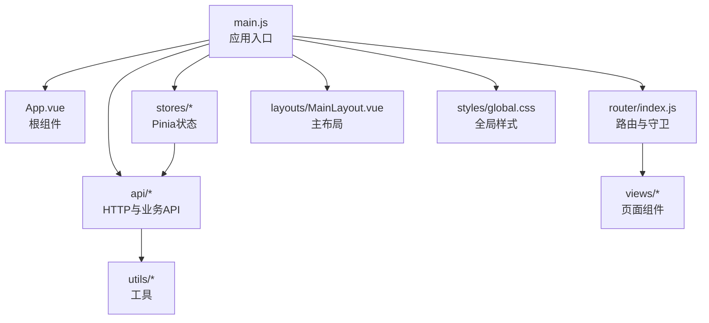
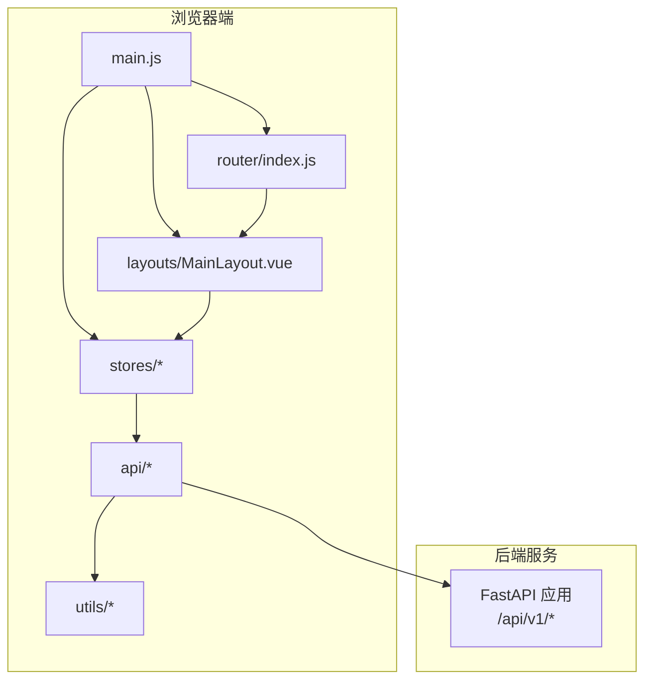
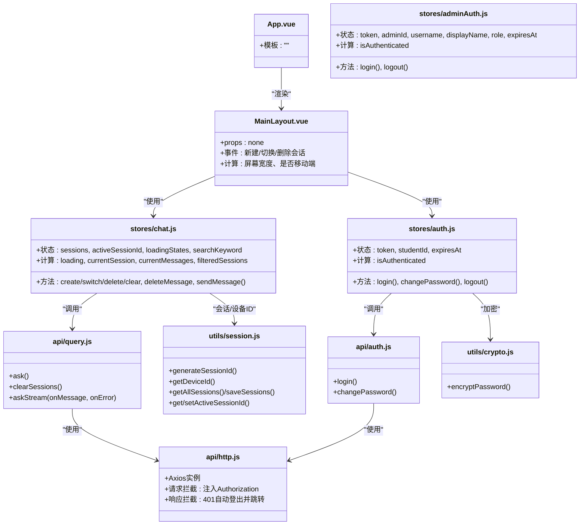
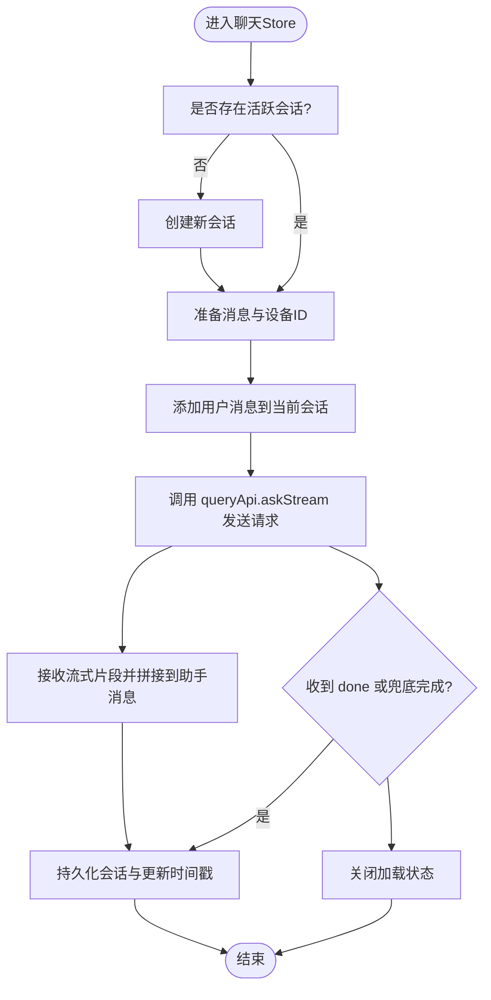
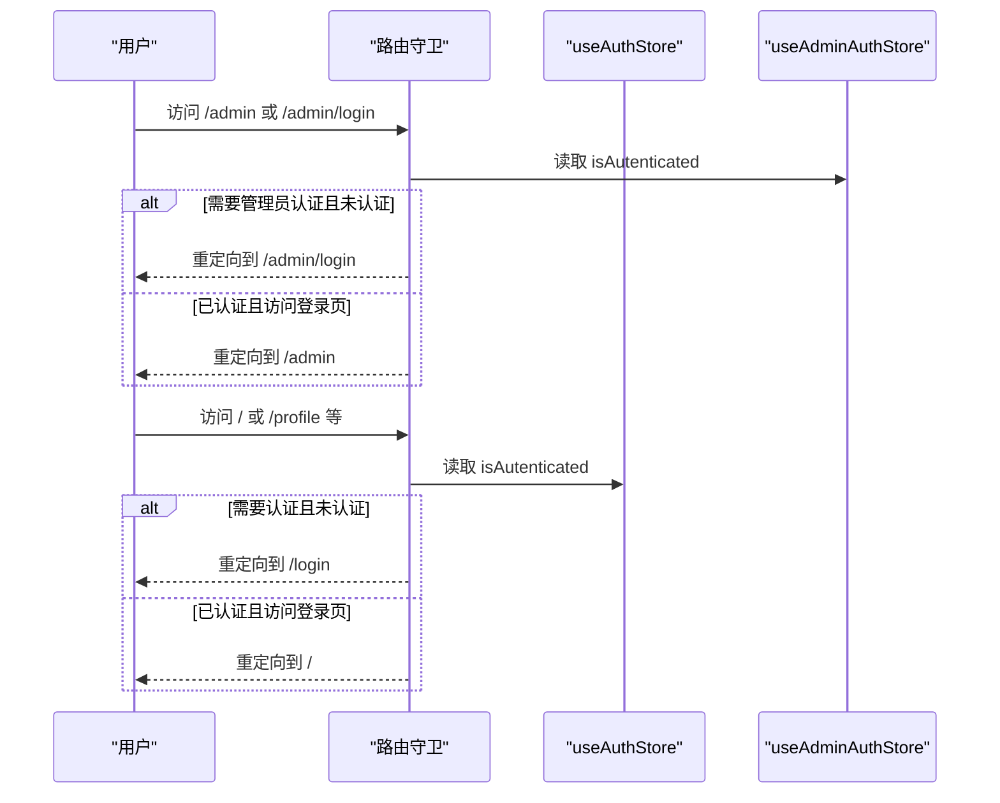
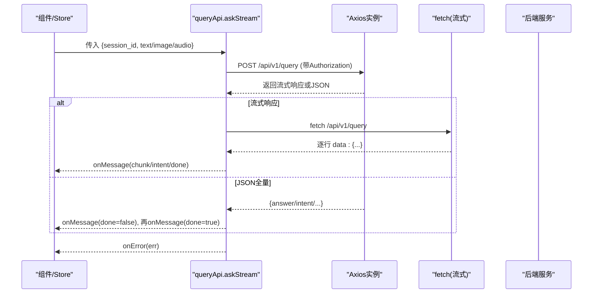
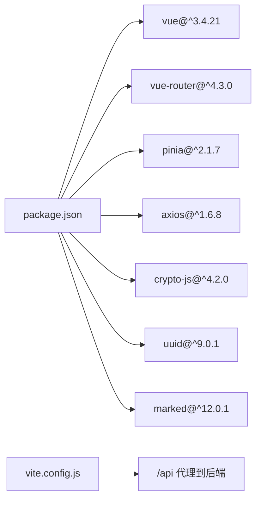

# 前端架构

<cite>
**本文引用的文件**
- [main.js](file://frontend/ai_assistant/src/main.js)
- [App.vue](file://frontend/ai_assistant/src/App.vue)
- [router/index.js](file://frontend/ai_assistant/src/router/index.js)
- [stores/auth.js](file://frontend/ai_assistant/src/stores/auth.js)
- [stores/adminAuth.js](file://frontend/ai_assistant/src/stores/adminAuth.js)
- [stores/chat.js](file://frontend/ai_assistant/src/stores/chat.js)
- [api/http.js](file://frontend/ai_assistant/src/api/http.js)
- [api/auth.js](file://frontend/ai_assistant/src/api/auth.js)
- [api/admin.js](file://frontend/ai_assistant/src/api/admin.js)
- [api/query.js](file://frontend/ai_assistant/src/api/query.js)
- [utils/crypto.js](file://frontend/ai_assistant/src/utils/crypto.js)
- [utils/session.js](file://frontend/ai_assistant/src/utils/session.js)
- [layouts/MainLayout.vue](file://frontend/ai_assistant/src/layouts/MainLayout.vue)
- [package.json](file://frontend/ai_assistant/package.json)
- [vite.config.js](file://frontend/ai_assistant/vite.config.js)
</cite>

## 目录
1. [引言](#引言)
2. [项目结构](#项目结构)
3. [核心组件](#核心组件)
4. [架构总览](#架构总览)
5. [详细组件分析](#详细组件分析)
6. [依赖关系分析](#依赖关系分析)
7. [性能考虑](#性能考虑)
8. [故障排查指南](#故障排查指南)
9. [结论](#结论)
10. [附录](#附录)

## 引言
本文件面向AI校园助手项目的前端团队与协作方，系统性梳理基于Vue 3的单页应用（SPA）整体架构与实现要点。重点覆盖应用入口初始化、插件注册、全局样式、路由系统与导航守卫、MVVM架构下的组件层次与数据绑定、Pinia状态管理（用户认证、管理员认证、聊天会话）、前后端交互模式（HTTP客户端封装、认证拦截器、错误处理）、组件通信与事件处理、以及响应式布局与可维护性设计。文档同时提供架构与流程图示，帮助快速理解与落地开发。

## 项目结构
前端采用Vite构建，核心目录组织如下：
- src/api：统一HTTP客户端与各业务API模块（认证、查询、管理员）
- src/stores：Pinia状态管理（用户认证、管理员认证、聊天会话）
- src/utils：加密、会话与设备ID等工具
- src/views：页面级组件（登录、聊天、个人资料、修改密码、管理员登录与仪表盘）
- src/layouts：布局组件（主布局）
- src/router：路由定义与导航守卫
- src/styles：全局样式
- src/assets：静态资源
- main.js：应用入口，注册插件与挂载根组件
- App.vue：根组件，承载路由视图

**图表来源**
- [main.js:1-10](file://frontend/ai_assistant/src/main.js#L1-L10)
- [App.vue:1-7](file://frontend/ai_assistant/src/App.vue#L1-L7)
- [router/index.js:1-75](file://frontend/ai_assistant/src/router/index.js#L1-L75)
- [layouts/MainLayout.vue:1-487](file://frontend/ai_assistant/src/layouts/MainLayout.vue#L1-L487)

**章节来源**
- [main.js:1-10](file://frontend/ai_assistant/src/main.js#L1-L10)
- [package.json:1-24](file://frontend/ai_assistant/package.json#L1-L24)
- [vite.config.js:1-23](file://frontend/ai_assistant/vite.config.js#L1-L23)

## 核心组件
- 应用入口与初始化：创建Vue实例、注册Pinia与路由、引入全局样式并挂载根组件。
- 根组件：承载路由视图，作为页面切换的容器。
- 路由系统：定义路径、子路由、懒加载组件与导航守卫，实现访客/登录态/管理员态的权限控制与自动重定向。
- Pinia状态管理：用户认证、管理员认证、聊天会话三大store，分别管理令牌、用户信息、会话列表与消息流。
- API层：统一Axios实例与拦截器，封装认证、查询、管理员等接口；查询接口支持SSE流式输出。
- 工具库：AES-CBC加密、会话与设备ID管理、学生学号脱敏展示。
- 主布局：左侧边栏（会话列表、搜索、新建/切换/删除会话）、移动端遮罩、底部导航、退出登录与用户信息展示。

**章节来源**
- [main.js:1-10](file://frontend/ai_assistant/src/main.js#L1-L10)
- [App.vue:1-7](file://frontend/ai_assistant/src/App.vue#L1-L7)
- [router/index.js:1-75](file://frontend/ai_assistant/src/router/index.js#L1-L75)
- [stores/auth.js:1-77](file://frontend/ai_assistant/src/stores/auth.js#L1-L77)
- [stores/adminAuth.js:1-77](file://frontend/ai_assistant/src/stores/adminAuth.js#L1-L77)
- [stores/chat.js:1-278](file://frontend/ai_assistant/src/stores/chat.js#L1-L278)
- [api/http.js:1-49](file://frontend/ai_assistant/src/api/http.js#L1-L49)
- [api/auth.js:1-36](file://frontend/ai_assistant/src/api/auth.js#L1-L36)
- [api/admin.js:1-41](file://frontend/ai_assistant/src/api/admin.js#L1-L41)
- [api/query.js:1-141](file://frontend/ai_assistant/src/api/query.js#L1-L141)
- [utils/crypto.js:1-40](file://frontend/ai_assistant/src/utils/crypto.js#L1-L40)
- [utils/session.js:1-70](file://frontend/ai_assistant/src/utils/session.js#L1-L70)
- [layouts/MainLayout.vue:1-487](file://frontend/ai_assistant/src/layouts/MainLayout.vue#L1-L487)

## 架构总览
下图展示了从浏览器到后端服务的端到端调用链路，以及认证拦截器与SSE流式响应的处理位置。

**图表来源**
- [main.js:1-10](file://frontend/ai_assistant/src/main.js#L1-L10)
- [router/index.js:1-75](file://frontend/ai_assistant/src/router/index.js#L1-L75)
- [layouts/MainLayout.vue:1-487](file://frontend/ai_assistant/src/layouts/MainLayout.vue#L1-L487)
- [api/http.js:1-49](file://frontend/ai_assistant/src/api/http.js#L1-L49)
- [api/query.js:1-141](file://frontend/ai_assistant/src/api/query.js#L1-L141)

## 详细组件分析

### MVVM与组件层次
- 视图层（Views）：LoginView、ChatView、ProfileView、ChangePasswordView、AdminLoginView、AdminDashboardView等，按路由懒加载方式引入。
- 布局层（Layouts）：MainLayout.vue承载侧边栏与主内容区，负责会话列表、搜索、导航与移动端适配。
- 状态层（Stores）：Pinia Store提供响应式状态与派生计算，组件通过组合式API访问。
- 交互层（API）：封装HTTP请求与SSE流式输出，统一处理认证与错误。

**图表来源**
- [App.vue:1-7](file://frontend/ai_assistant/src/App.vue#L1-L7)
- [layouts/MainLayout.vue:1-487](file://frontend/ai_assistant/src/layouts/MainLayout.vue#L1-L487)
- [stores/auth.js:1-77](file://frontend/ai_assistant/src/stores/auth.js#L1-L77)
- [stores/adminAuth.js:1-77](file://frontend/ai_assistant/src/stores/adminAuth.js#L1-L77)
- [stores/chat.js:1-278](file://frontend/ai_assistant/src/stores/chat.js#L1-L278)
- [api/http.js:1-49](file://frontend/ai_assistant/src/api/http.js#L1-L49)
- [api/auth.js:1-36](file://frontend/ai_assistant/src/api/auth.js#L1-L36)
- [api/query.js:1-141](file://frontend/ai_assistant/src/api/query.js#L1-L141)
- [utils/crypto.js:1-40](file://frontend/ai_assistant/src/utils/crypto.js#L1-L40)
- [utils/session.js:1-70](file://frontend/ai_assistant/src/utils/session.js#L1-L70)

**章节来源**
- [App.vue:1-7](file://frontend/ai_assistant/src/App.vue#L1-L7)
- [layouts/MainLayout.vue:118-175](file://frontend/ai_assistant/src/layouts/MainLayout.vue#L118-L175)
- [stores/chat.js:22-278](file://frontend/ai_assistant/src/stores/chat.js#L22-L278)

### Pinia状态管理设计
- 用户认证状态（auth.js）
  - 状态：token、studentId、expiresAt
  - 计算：isAuthenticated（基于token存在性与过期时间）
  - 方法：login（加密密码、调用后端、写入localStorage并更新状态）、changePassword（加密旧/新密码并提交）、logout（清空状态与localStorage）
- 管理员认证状态（adminAuth.js）
  - 状态：token、adminId、username、displayName、role、expiresAt
  - 计算：isAuthenticated
  - 方法：login（加密密码、写入多字段localStorage）、logout（清空多字段）
- 聊天会话状态（chat.js）
  - 状态：sessions、activeSessionId、loadingStates、searchKeyword
  - 计算：loading（当前会话加载中）、currentSession、currentMessages、filteredSessions
  - 方法：createSession、switchSession、deleteSession、clearAllSessions、deleteMessage、sendMessage（含SSE流式处理与错误解析）

**图表来源**
- [stores/chat.js:133-230](file://frontend/ai_assistant/src/stores/chat.js#L133-L230)
- [api/query.js:28-141](file://frontend/ai_assistant/src/api/query.js#L28-L141)

**章节来源**
- [stores/auth.js:17-77](file://frontend/ai_assistant/src/stores/auth.js#L17-L77)
- [stores/adminAuth.js:16-77](file://frontend/ai_assistant/src/stores/adminAuth.js#L16-L77)
- [stores/chat.js:22-278](file://frontend/ai_assistant/src/stores/chat.js#L22-L278)

### 路由系统与导航守卫
- 路由定义
  - /admin/login：管理员登录页（guest=true）
  - /admin：管理员仪表盘（requiresAdminAuth=true）
  - /login：学生登录页（guest=true）
  - /：主布局（requiresAuth=true），子路由包含聊天、个人资料、修改密码
  - 通配符重定向：根据路径前缀重定向至对应主页面
- 导航守卫逻辑
  - 管理员：未认证跳转登录，已认证且访问登录页则重定向到仪表盘
  - 学生：未认证跳转登录，已认证且访问登录页则重定向到聊天
  - 默认放行

**图表来源**
- [router/index.js:57-73](file://frontend/ai_assistant/src/router/index.js#L57-L73)
- [stores/auth.js:24-26](file://frontend/ai_assistant/src/stores/auth.js#L24-L26)
- [stores/adminAuth.js:24-26](file://frontend/ai_assistant/src/stores/adminAuth.js#L24-L26)

**章节来源**
- [router/index.js:5-75](file://frontend/ai_assistant/src/router/index.js#L5-L75)

### 前后端交互模式与错误处理
- HTTP客户端封装
  - Axios实例：baseURL=/api/v1，超时60秒，JSON头
  - 请求拦截：自动附加Authorization: Bearer token（优先从localStorage读取）
  - 响应拦截：401自动调用用户store logout并跳转登录页
- 查询接口（SSE）
  - askStream：支持SSE流式输出，兼容后端返回JSON全量响应；解析data行或JSON块，触发回调；兜底确保done标记
  - 错误解析：根据后端detail、网络错误、状态码映射为友好提示
- 认证与查询API
  - authApi：登录、修改密码
  - adminApi：登录、获取当前管理员信息、仪表盘摘要、元数据、日程管理等
  - queryApi：提问、清理会话、SSE流式回答

**图表来源**
- [api/http.js:10-49](file://frontend/ai_assistant/src/api/http.js#L10-L49)
- [api/query.js:28-141](file://frontend/ai_assistant/src/api/query.js#L28-L141)

**章节来源**
- [api/http.js:1-49](file://frontend/ai_assistant/src/api/http.js#L1-L49)
- [api/query.js:1-141](file://frontend/ai_assistant/src/api/query.js#L1-L141)
- [stores/chat.js:235-257](file://frontend/ai_assistant/src/stores/chat.js#L235-L257)

### 组件通信与事件处理
- 布局组件MainLayout.vue
  - 通过v-model双向绑定chatStore.searchKeyword实现会话列表搜索
  - 通过router-link与router.push实现导航
  - 通过useAuthStore与useChatStore进行状态读取与操作
  - 响应式窗口尺寸与移动端遮罩交互
- 事件处理
  - 新建/切换/删除会话、退出登录、确认对话框等均通过事件回调触发store方法与路由跳转

**章节来源**
- [layouts/MainLayout.vue:19-175](file://frontend/ai_assistant/src/layouts/MainLayout.vue#L19-L175)

### 响应式设计与可维护性
- 响应式布局：媒体查询控制侧边栏折叠、移动端顶栏与遮罩层
- 可维护性：模块化API、工具函数分离、store职责单一、路由meta标记权限语义明确

**章节来源**
- [layouts/MainLayout.vue:471-487](file://frontend/ai_assistant/src/layouts/MainLayout.vue#L471-L487)

## 依赖关系分析
- 构建与运行时依赖
  - Vue 3、Vue Router 4、Pinia 2、Axios、CryptoJS、UUID、Marked
  - Vite开发服务器与代理：将/api前缀转发至后端服务
- 运行时依赖链
  - main.js -> App.vue -> router/index.js -> layouts/MainLayout.vue -> stores/* -> api/* -> utils/*
  - api/* -> axios -> 后端服务

**图表来源**
- [package.json:11-23](file://frontend/ai_assistant/package.json#L11-L23)
- [vite.config.js:15-21](file://frontend/ai_assistant/vite.config.js#L15-L21)

**章节来源**
- [package.json:1-24](file://frontend/ai_assistant/package.json#L1-L24)
- [vite.config.js:1-23](file://frontend/ai_assistant/vite.config.js#L1-L23)

## 性能考虑
- 路由懒加载：路由组件通过动态导入减少首屏体积
- 状态持久化：聊天会话与活跃会话ID持久化至localStorage，提升体验
- SSE流式渲染：增量更新助手消息，避免全量重绘
- 本地加密：密码加密在前端完成，降低传输风险
- 代理与超时：开发环境代理简化跨域，Axios超时设置避免长时间阻塞

[本节为通用建议，不直接分析具体文件]

## 故障排查指南
- 登录后401被重定向
  - 检查请求拦截器是否注入Authorization头
  - 检查store中token是否正确写入localStorage
  - 检查后端返回的expires_in是否合理
- SSE流式输出卡住
  - 检查后端是否正确发送SSE数据行
  - 检查fetch流式解析逻辑与done标记
- 错误信息不友好
  - 检查后端detail字段与状态码映射
  - 检查store中错误解析逻辑

**章节来源**
- [api/http.js:36-47](file://frontend/ai_assistant/src/api/http.js#L36-L47)
- [api/query.js:78-139](file://frontend/ai_assistant/src/api/query.js#L78-L139)
- [stores/chat.js:235-257](file://frontend/ai_assistant/src/stores/chat.js#L235-L257)

## 结论
本项目采用Vue 3 + Pinia + Vue Router + Axios的现代前端技术栈，围绕MVVM模式构建了清晰的组件层次与状态管理。通过统一的HTTP客户端与SSE流式交互，实现了流畅的智能问答体验；通过路由守卫与store职责划分，保障了权限控制与可维护性。建议后续持续优化错误提示与国际化、完善测试覆盖，并在生产环境启用HTTPS与更严格的CSP策略。

[本节为总结性内容，不直接分析具体文件]

## 附录
- 开发与构建
  - 开发：npm run dev（Vite默认端口6001）
  - 构建：npm run build
  - 预览：npm run preview
- 代理配置
  - 将/api前缀代理至后端服务地址，便于前后端联调

**章节来源**
- [package.json:6-10](file://frontend/ai_assistant/package.json#L6-L10)
- [vite.config.js:12-22](file://frontend/ai_assistant/vite.config.js#L12-L22)