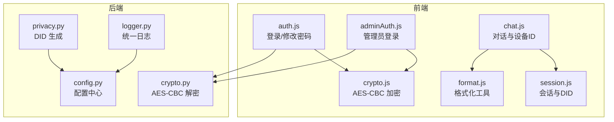
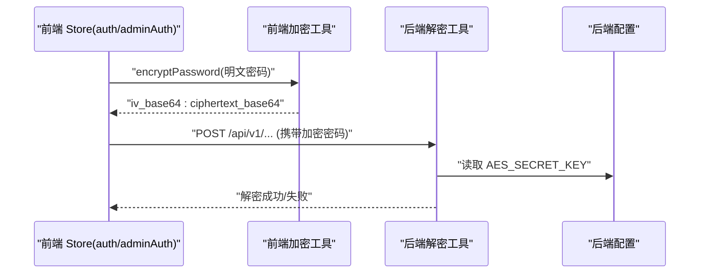
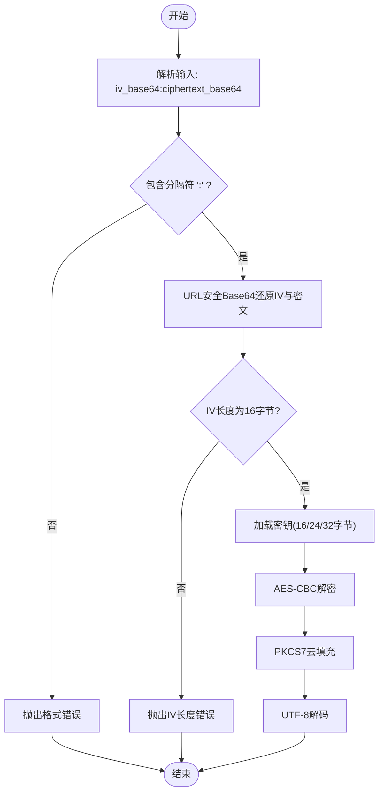
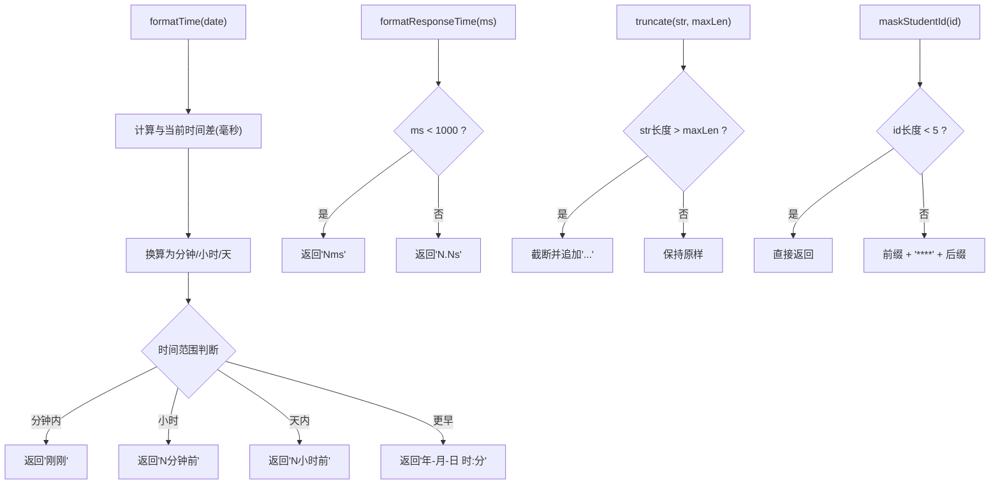
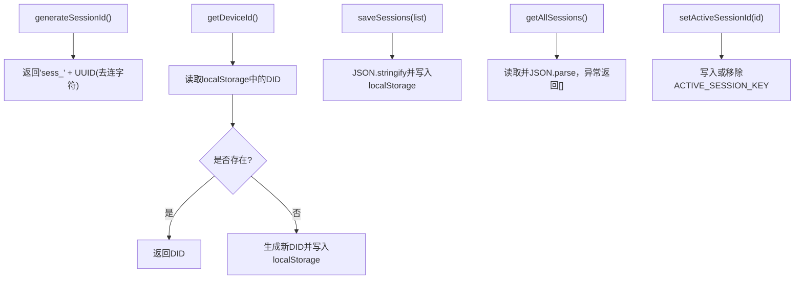
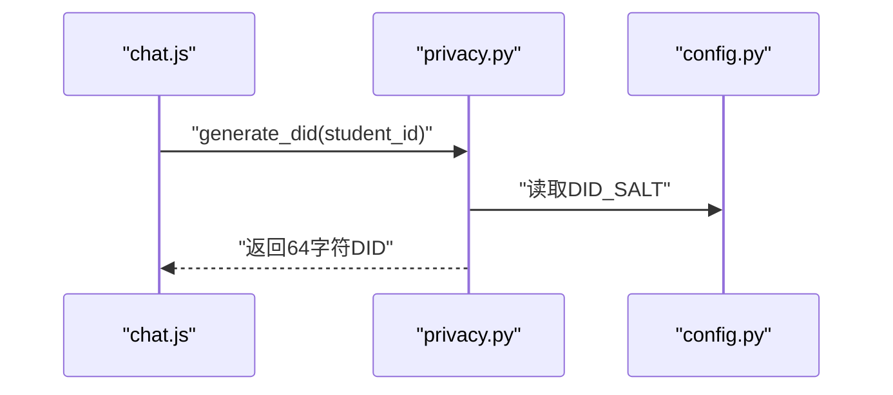
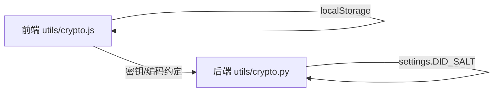

# 工具与实用程序

<cite>
**本文引用的文件**
- [frontend/ai_assistant/src/utils/crypto.js](file://frontend/ai_assistant/src/utils/crypto.js)
- [frontend/ai_assistant/src/utils/format.js](file://frontend/ai_assistant/src/utils/format.js)
- [frontend/ai_assistant/src/utils/session.js](file://frontend/ai_assistant/src/utils/session.js)
- [service/ai_assistant/app/utils/crypto.py](file://service/ai_assistant/app/utils/crypto.py)
- [service/ai_assistant/app/utils/logger.py](file://service/ai_assistant/app/utils/logger.py)
- [service/ai_assistant/app/utils/privacy.py](file://service/ai_assistant/app/utils/privacy.py)
- [service/ai_assistant/app/config.py](file://service/ai_assistant/app/config.py)
- [frontend/ai_assistant/src/stores/auth.js](file://frontend/ai_assistant/src/stores/auth.js)
- [frontend/ai_assistant/src/stores/adminAuth.js](file://frontend/ai_assistant/src/stores/adminAuth.js)
- [frontend/ai_assistant/src/stores/chat.js](file://frontend/ai_assistant/src/stores/chat.js)
</cite>

## 目录
1. [简介](#简介)
2. [项目结构](#项目结构)
3. [核心组件](#核心组件)
4. [架构总览](#架构总览)
5. [详细组件分析](#详细组件分析)
6. [依赖分析](#依赖分析)
7. [性能考量](#性能考量)
8. [故障排查指南](#故障排查指南)
9. [结论](#结论)
10. [附录](#附录)

## 简介
本章节概述 AI 校园助手项目的工具与实用程序模块，重点覆盖以下方面：
- 加密工具：前端密码加密与后端解密的协同实现，确保传输安全与一致性。
- 格式化工具：日期/时间、响应时间、字符串截断与学号隐私化展示。
- 会话管理工具：会话 ID 生成、设备 ID（DID）持久化与会话列表的本地存储管理。
- 工具函数组织：命名规范、模块化设计与跨层使用模式。
- 实现细节：算法选择、性能与安全考量。
- 最佳实践：错误处理、边界条件、兼容性与部署注意事项。

## 项目结构
工具与实用程序主要分布在前端与后端两个层面：
- 前端 utils：crypto.js（密码加密）、format.js（格式化）、session.js（会话与设备标识）。
- 后端 utils：crypto.py（解密）、logger.py（日志）、privacy.py（DID 生成）。
- 配置：后端 config.py 提供密钥与盐值等敏感参数的集中配置。
- 使用方：前端 stores 层（auth、adminAuth、chat）调用工具函数完成业务流程。

图表来源
- [frontend/ai_assistant/src/stores/auth.js](file://frontend/ai_assistant/src/stores/auth.js)
- [frontend/ai_assistant/src/stores/adminAuth.js](file://frontend/ai_assistant/src/stores/adminAuth.js)
- [frontend/ai_assistant/src/stores/chat.js](file://frontend/ai_assistant/src/stores/chat.js)
- [frontend/ai_assistant/src/utils/crypto.js](file://frontend/ai_assistant/src/utils/crypto.js)
- [frontend/ai_assistant/src/utils/format.js](file://frontend/ai_assistant/src/utils/format.js)
- [frontend/ai_assistant/src/utils/session.js](file://frontend/ai_assistant/src/utils/session.js)
- [service/ai_assistant/app/utils/crypto.py](file://service/ai_assistant/app/utils/crypto.py)
- [service/ai_assistant/app/utils/privacy.py](file://service/ai_assistant/app/utils/privacy.py)
- [service/ai_assistant/app/utils/logger.py](file://service/ai_assistant/app/utils/logger.py)
- [service/ai_assistant/app/config.py](file://service/ai_assistant/app/config.py)

章节来源
- [frontend/ai_assistant/src/utils/crypto.js:1-40](file://frontend/ai_assistant/src/utils/crypto.js#L1-L40)
- [frontend/ai_assistant/src/utils/format.js:1-67](file://frontend/ai_assistant/src/utils/format.js#L1-L67)
- [frontend/ai_assistant/src/utils/session.js:1-70](file://frontend/ai_assistant/src/utils/session.js#L1-L70)
- [service/ai_assistant/app/utils/crypto.py:1-73](file://service/ai_assistant/app/utils/crypto.py#L1-L73)
- [service/ai_assistant/app/utils/privacy.py:1-23](file://service/ai_assistant/app/utils/privacy.py#L1-L23)
- [service/ai_assistant/app/utils/logger.py:1-53](file://service/ai_assistant/app/utils/logger.py#L1-L53)
- [service/ai_assistant/app/config.py:1-113](file://service/ai_assistant/app/config.py#L1-L113)

## 核心组件
- 加密工具（前端/后端协同）
  - 前端：AES-CBC 加密，使用 URL 安全 Base64 编码，输出格式为 iv_base64:ciphertext_base64。
  - 后端：解密逻辑严格匹配前端编码规则，校验 IV 长度与密钥长度，解密后返回明文。
- 格式化工具
  - 时间：相对时间与绝对时间混合格式化；响应时间：自动单位切换；字符串：截断与学号掩码；日期：标准化输出。
- 会话管理工具
  - 会话 ID：基于 UUID 生成，去除连字符；设备 ID（DID）：首次生成并持久化到 localStorage；会话列表与活跃会话 ID 的读取/保存。
- 日志与隐私
  - 日志：统一输出到控制台与文件，支持轮转与保留期；隐私：基于学生 ID 与盐值生成稳定 DID，用于日志脱敏。

章节来源
- [frontend/ai_assistant/src/utils/crypto.js:1-40](file://frontend/ai_assistant/src/utils/crypto.js#L1-L40)
- [service/ai_assistant/app/utils/crypto.py:1-73](file://service/ai_assistant/app/utils/crypto.py#L1-L73)
- [frontend/ai_assistant/src/utils/format.js:1-67](file://frontend/ai_assistant/src/utils/format.js#L1-L67)
- [frontend/ai_assistant/src/utils/session.js:1-70](file://frontend/ai_assistant/src/utils/session.js#L1-L70)
- [service/ai_assistant/app/utils/logger.py:1-53](file://service/ai_assistant/app/utils/logger.py#L1-L53)
- [service/ai_assistant/app/utils/privacy.py:1-23](file://service/ai_assistant/app/utils/privacy.py#L1-L23)

## 架构总览
下图展示了“前端加密 → 后端解密”的关键链路，以及“设备 ID 与会话管理”在前端的应用位置。

图表来源
- [frontend/ai_assistant/src/stores/auth.js](file://frontend/ai_assistant/src/stores/auth.js)
- [frontend/ai_assistant/src/stores/adminAuth.js](file://frontend/ai_assistant/src/stores/adminAuth.js)
- [frontend/ai_assistant/src/utils/crypto.js:25-40](file://frontend/ai_assistant/src/utils/crypto.js#L25-L40)
- [service/ai_assistant/app/utils/crypto.py:39-73](file://service/ai_assistant/app/utils/crypto.py#L39-L73)
- [service/ai_assistant/app/config.py:37-43](file://service/ai_assistant/app/config.py#L37-L43)

## 详细组件分析

### 组件A：密码加密与解密（前端/后端）
- 前端加密
  - 算法：AES-CBC，PKCS7 填充。
  - 密钥：来自环境变量（前端 meta.env），需与后端一致。
  - 输出：iv_base64:ciphertext_base64，其中 Base64 采用 URL 安全变体（+/- 替换为 -/_，去除尾部 =）。
- 后端解密
  - 输入：前端加密后的字符串，按 “:” 分割 iv 与密文。
  - 校验：IV 长度必须为 16 字节；密钥长度必须为 16/24/32 字符。
  - 流程：URL 安全 Base64 还原 → AES-CBC 解密 → PKCS7 去填充 → UTF-8 文本。
- 关键注意
  - 前后端密钥必须完全一致，且密钥长度符合要求。
  - 若密文格式非法或解密失败，抛出明确错误以便前端提示。

图表来源
- [service/ai_assistant/app/utils/crypto.py:25-73](file://service/ai_assistant/app/utils/crypto.py#L25-L73)

章节来源
- [frontend/ai_assistant/src/utils/crypto.js:1-40](file://frontend/ai_assistant/src/utils/crypto.js#L1-L40)
- [service/ai_assistant/app/utils/crypto.py:1-73](file://service/ai_assistant/app/utils/crypto.py#L1-L73)
- [service/ai_assistant/app/config.py:37-43](file://service/ai_assistant/app/config.py#L37-L43)

### 组件B：格式化工具
- 时间格式化：根据与当前时间差，输出“刚刚/分钟前/小时前/天前/年-月-日 时:分”。
- 响应时间：小于 1000ms 输出毫秒，否则转换为小数点后一位的秒。
- 字符串截断：默认最大长度 30，超出则追加省略号。
- 学号掩码：保留前缀与后缀，中间以“****”替换。
- 日期格式：输出 YYYY-MM-DD。

图表来源
- [frontend/ai_assistant/src/utils/format.js:10-67](file://frontend/ai_assistant/src/utils/format.js#L10-L67)

章节来源
- [frontend/ai_assistant/src/utils/format.js:1-67](file://frontend/ai_assistant/src/utils/format.js#L1-L67)

### 组件C：会话管理与设备标识
- 会话 ID：基于 UUID 生成，移除连字符，前缀为 sess_。
- 设备 ID（DID）：首次访问生成并持久化到 localStorage，前缀 did_；后续直接读取。
- 会话列表：以数组形式持久化，提供读取与保存接口；活跃会话 ID 支持设置与清理。
- 使用场景：聊天视图在创建/切换会话时更新活跃会话；退出登录时可清空会话列表。

图表来源
- [frontend/ai_assistant/src/utils/session.js:17-70](file://frontend/ai_assistant/src/utils/session.js#L17-L70)

章节来源
- [frontend/ai_assistant/src/utils/session.js:1-70](file://frontend/ai_assistant/src/utils/session.js#L1-L70)
- [frontend/ai_assistant/src/stores/chat.js:14-141](file://frontend/ai_assistant/src/stores/chat.js#L14-L141)

### 组件D：隐私与日志（后端）
- 隐私：基于学生 ID 与盐值生成固定长度的 SHA-256 DID，用于日志与审计中替代真实 ID。
- 日志：统一输出到控制台与文件，支持轮转大小与保留期，便于生产问题定位。

图表来源
- [service/ai_assistant/app/utils/privacy.py:9-23](file://service/ai_assistant/app/utils/privacy.py#L9-L23)
- [service/ai_assistant/app/config.py:42-43](file://service/ai_assistant/app/config.py#L42-L43)
- [frontend/ai_assistant/src/stores/chat.js:141-141](file://frontend/ai_assistant/src/stores/chat.js#L141-L141)

章节来源
- [service/ai_assistant/app/utils/privacy.py:1-23](file://service/ai_assistant/app/utils/privacy.py#L1-L23)
- [service/ai_assistant/app/utils/logger.py:1-53](file://service/ai_assistant/app/utils/logger.py#L1-L53)
- [service/ai_assistant/app/config.py:1-113](file://service/ai_assistant/app/config.py#L1-L113)

## 依赖分析
- 前端依赖
  - 加密：CryptoJS（AES-CBC、Base64、WordArray）。
  - 会话：uuid（v4 生成器）。
  - 环境变量：VITE_AES_SECRET_KEY（前端）。
- 后端依赖
  - Crypto.Cipher.AES（解密）、Crypto.Util.Padding（去填充）。
  - 配置：pydantic-settings（读取 .env）。
- 前后端耦合点
  - 密钥长度与编码规则必须一致（URL 安全 Base64、IV 长度 16 字节）。
  - 前端 meta.env 与后端 settings.AES_SECRET_KEY 必须同步。

图表来源
- [frontend/ai_assistant/src/utils/crypto.js:9-9](file://frontend/ai_assistant/src/utils/crypto.js#L9-L9)
- [service/ai_assistant/app/utils/crypto.py:19-22](file://service/ai_assistant/app/utils/crypto.py#L19-L22)
- [service/ai_assistant/app/config.py:37-43](file://service/ai_assistant/app/config.py#L37-L43)

章节来源
- [frontend/ai_assistant/src/utils/crypto.js:1-40](file://frontend/ai_assistant/src/utils/crypto.js#L1-L40)
- [service/ai_assistant/app/utils/crypto.py:1-73](file://service/ai_assistant/app/utils/crypto.py#L1-L73)
- [service/ai_assistant/app/config.py:1-113](file://service/ai_assistant/app/config.py#L1-L113)

## 性能考量
- 加密/解密
  - AES-CBC 计算开销极低，对交互影响可忽略；建议避免在热路径重复构造密钥对象。
  - URL 安全 Base64 编解码为线性复杂度，整体性能良好。
- 格式化
  - 时间与字符串处理均为 O(n)，在 UI 更新频率下可接受。
- 会话管理
  - localStorage 读写为同步操作，频繁调用可能阻塞主线程；建议批量更新与节流。
- 日志
  - 文件落盘与轮转由 Loguru 管理，注意磁盘空间与 IO 压力。

## 故障排查指南
- 前端加密失败
  - 检查 VITE_AES_SECRET_KEY 是否正确设置且与后端一致。
  - 确认未手动修改加密输出格式（如 IV 或密文被截断）。
- 后端解密报错
  - “无效的加密格式，缺少 IV 分隔符”：确认前端输出格式为 iv_base64:ciphertext_base64。
  - “IV 长度必须为 16 字节”：检查前端是否自定义了 IV 生成策略。
  - “AES 解密失败”：核对密钥长度（16/24/32）与密文完整性。
- 会话/设备 ID 异常
  - localStorage 可能被清理或受限；若读取为空，重新触发生成与持久化。
  - 活跃会话未设置导致 UI 不显示；确保调用 setActiveSessionId。
- 日志问题
  - 日志未落盘：检查日志目录权限与磁盘空间；确认 Logger 初始化成功。

章节来源
- [service/ai_assistant/app/utils/crypto.py:52-73](file://service/ai_assistant/app/utils/crypto.py#L52-L73)
- [frontend/ai_assistant/src/utils/session.js:37-70](file://frontend/ai_assistant/src/utils/session.js#L37-L70)
- [service/ai_assistant/app/utils/logger.py:17-47](file://service/ai_assistant/app/utils/logger.py#L17-L47)

## 结论
本项目的工具与实用程序围绕“安全传输、友好展示、可靠会话与可观测性”展开：
- 前后端在密码传输上达成强一致的安全契约；
- 格式化工具提升用户体验与可读性；
- 会话与设备标识管理保证多页面与多会话场景下的稳定性；
- 日志与隐私工具为生产运维与合规提供基础能力。

## 附录

### 工具函数使用示例与场景
- 登录/修改密码
  - 在 auth.js 与 adminAuth.js 中调用 encryptPassword，将加密结果提交给后端。
  - 场景来源
    - [frontend/ai_assistant/src/stores/auth.js:29-29](file://frontend/ai_assistant/src/stores/auth.js#L29-L29)
    - [frontend/ai_assistant/src/stores/adminAuth.js:28-28](file://frontend/ai_assistant/src/stores/adminAuth.js#L28-L28)
- 设备 ID 与会话
  - chat.js 在创建/切换会话时获取 DID 并持久化会话列表，同时设置活跃会话。
  - 场景来源
    - [frontend/ai_assistant/src/stores/chat.js:14-14](file://frontend/ai_assistant/src/stores/chat.js#L14-L14)
    - [frontend/ai_assistant/src/stores/chat.js:141-141](file://frontend/ai_assistant/src/stores/chat.js#L141-L141)
- 格式化展示
  - format.js 的 formatTime、formatResponseTime、truncate、maskStudentId、formatDate 在视图层广泛使用。
  - 场景来源
    - [frontend/ai_assistant/src/utils/format.js:10-67](file://frontend/ai_assistant/src/utils/format.js#L10-L67)

### 最佳实践清单
- 加密
  - 前后端密钥必须一致且满足长度要求；避免在 UI 层直接暴露密钥。
- 格式化
  - 对外部输入进行边界检查（空值、超长字符串）；国际化场景需扩展语言映射。
- 会话管理
  - 对 localStorage 写入进行异常捕获与降级处理；避免在高频事件中频繁序列化。
- 隐私与日志
  - 所有日志中涉及的敏感字段使用 DID 替代；定期清理过期日志文件。