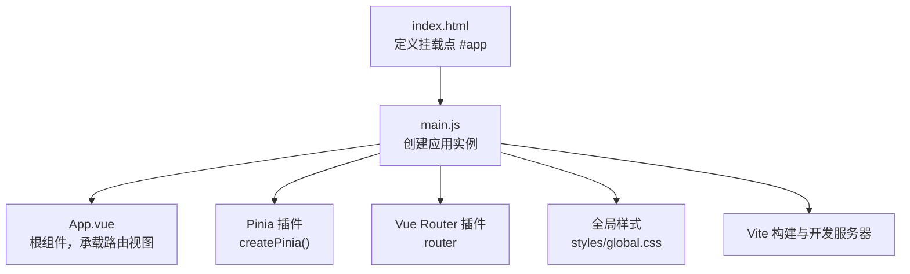
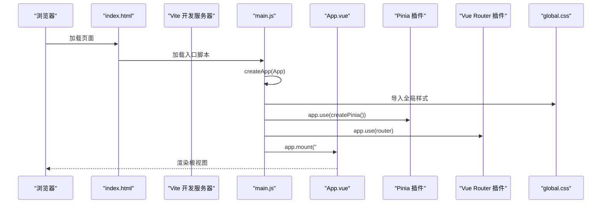
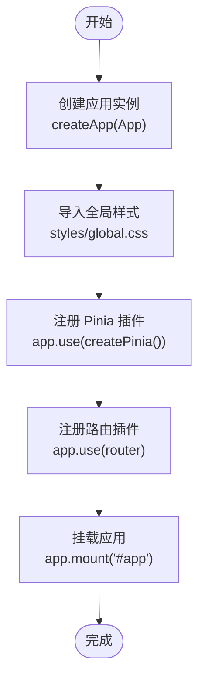
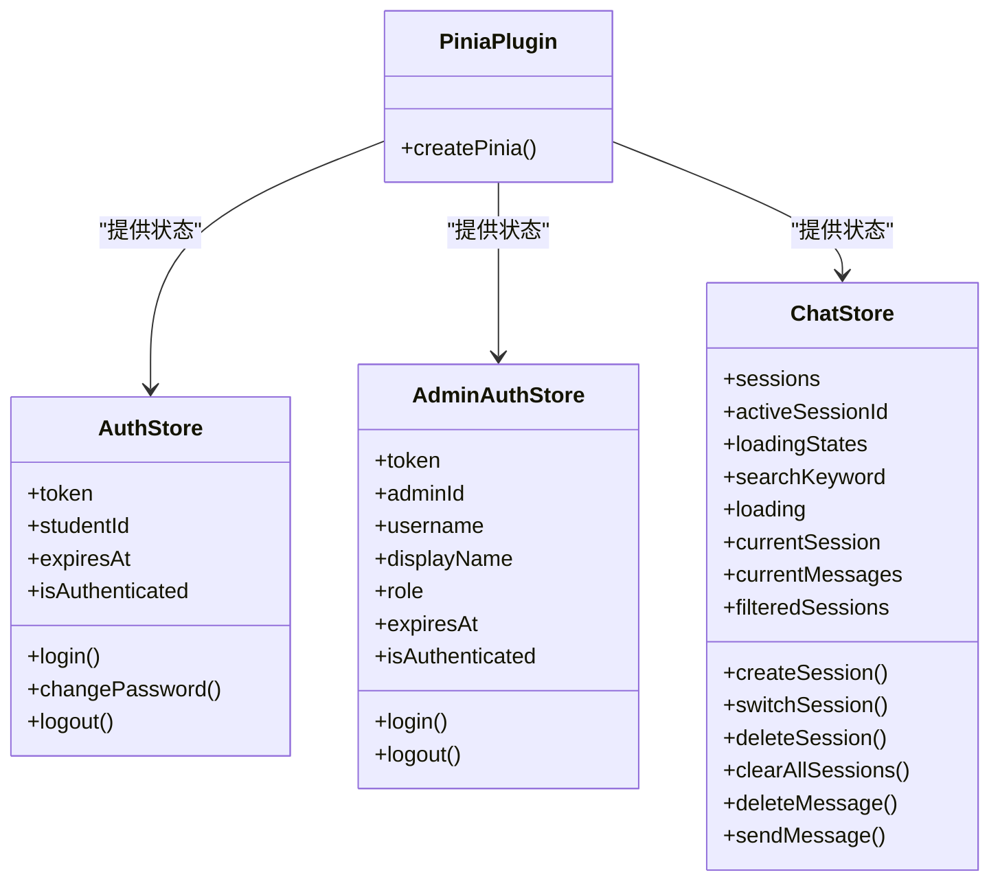
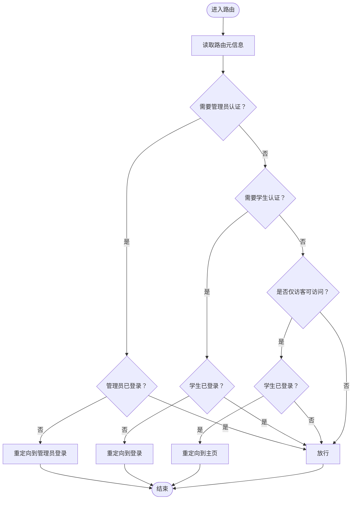
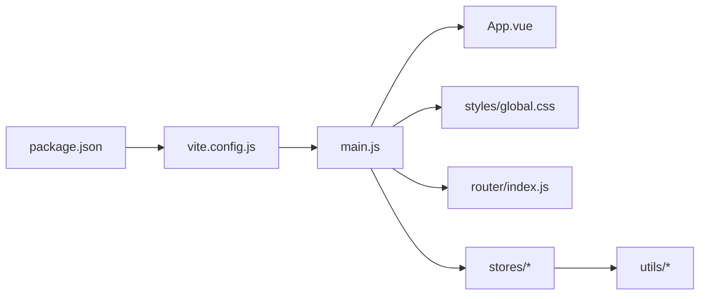

# 应用入口与初始化

<cite>
**本文引用的文件**
- [main.js](file://frontend/ai_assistant/src/main.js)
- [App.vue](file://frontend/ai_assistant/src/App.vue)
- [index.html](file://frontend/ai_assistant/index.html)
- [package.json](file://frontend/ai_assistant/package.json)
- [vite.config.js](file://frontend/ai_assistant/vite.config.js)
- [router/index.js](file://frontend/ai_assistant/src/router/index.js)
- [stores/auth.js](file://frontend/ai_assistant/src/stores/auth.js)
- [stores/adminAuth.js](file://frontend/ai_assistant/src/stores/adminAuth.js)
- [stores/chat.js](file://frontend/ai_assistant/src/stores/chat.js)
- [utils/crypto.js](file://frontend/ai_assistant/src/utils/crypto.js)
- [utils/session.js](file://frontend/ai_assistant/src/utils/session.js)
- [styles/global.css](file://frontend/ai_assistant/src/styles/global.css)
</cite>

## 目录
1. [简介](#简介)
2. [项目结构](#项目结构)
3. [核心组件](#核心组件)
4. [架构总览](#架构总览)
5. [详细组件分析](#详细组件分析)
6. [依赖关系分析](#依赖关系分析)
7. [性能考虑](#性能考虑)
8. [故障排查指南](#故障排查指南)
9. [结论](#结论)
10. [附录](#附录)

## 简介
本章节聚焦于AI校园助手前端应用的“应用入口与初始化”主题，系统性梳理从浏览器加载到Vue应用启动、插件注册、状态管理与路由集成、全局样式引入以及最终挂载的完整流程。文档面向不同技术背景的读者，既提供高层概览，也给出可操作的排错建议与最佳实践。

## 项目结构
前端工程位于 frontend/ai_assistant，采用Vite构建，Vue 3 + Vue Router + Pinia的状态管理方案。应用入口文件负责创建应用实例、注册插件、引入全局样式，并将应用挂载到DOM节点。

图表来源
- [index.html:1-13](file://frontend/ai_assistant/index.html#L1-L13)
- [main.js:1-10](file://frontend/ai_assistant/src/main.js#L1-L10)
- [App.vue:1-7](file://frontend/ai_assistant/src/App.vue#L1-L7)
- [vite.config.js:1-23](file://frontend/ai_assistant/vite.config.js#L1-L23)

章节来源
- [index.html:1-13](file://frontend/ai_assistant/index.html#L1-L13)
- [main.js:1-10](file://frontend/ai_assistant/src/main.js#L1-L10)
- [vite.config.js:1-23](file://frontend/ai_assistant/vite.config.js#L1-L23)

## 核心组件
- 应用入口与启动
  - 创建应用实例：使用 createApp(App) 将根组件 App 注入应用上下文。
  - 插件注册顺序：先注册 Pinia，再注册路由；顺序影响插件间依赖与生命周期钩子的执行。
  - 挂载应用：将应用挂载到 index.html 中的 #app 容器。
- 全局样式引入
  - 在入口文件中导入全局样式，确保在组件样式之前生效，便于覆盖默认样式与统一基础变量。
- 根组件设计
  - App.vue 采用 Composition API 的 <script setup> 形式，模板内仅包含 <router-view />，职责单一且清晰，便于路由切换时渲染对应视图。

章节来源
- [main.js:1-10](file://frontend/ai_assistant/src/main.js#L1-L10)
- [App.vue:1-7](file://frontend/ai_assistant/src/App.vue#L1-L7)
- [styles/global.css:1-113](file://frontend/ai_assistant/src/styles/global.css#L1-L113)

## 架构总览
下图展示了从浏览器请求到应用启动的关键步骤与模块交互：

图表来源
- [index.html:1-13](file://frontend/ai_assistant/index.html#L1-L13)
- [main.js:1-10](file://frontend/ai_assistant/src/main.js#L1-L10)
- [App.vue:1-7](file://frontend/ai_assistant/src/App.vue#L1-L7)
- [styles/global.css:1-113](file://frontend/ai_assistant/src/styles/global.css#L1-L113)

## 详细组件分析

### 应用入口与初始化流程
- 入口文件职责
  - 引入根组件 App.vue 与路由模块 router/index.js。
  - 导入全局样式 styles/global.css。
  - 创建应用实例并依次注册 Pinia 与路由插件，最后挂载到 #app。
- 插件注册顺序的重要性
  - Pinia 必须在路由之前注册，以确保路由守卫中可以安全地访问 Pinia Store（如认证状态）。
  - 路由注册在 Pinia 之后，保证导航守卫能够读取到最新的认证状态。
- 挂载点约定
  - index.html 中的 #app 是标准挂载点，main.js 中通过 app.mount("#app") 完成挂载。

图表来源
- [main.js:1-10](file://frontend/ai_assistant/src/main.js#L1-L10)
- [index.html:1-13](file://frontend/ai_assistant/index.html#L1-L13)

章节来源
- [main.js:1-10](file://frontend/ai_assistant/src/main.js#L1-L10)
- [index.html:1-13](file://frontend/ai_assistant/index.html#L1-L13)

### Pinia 状态管理插件集成
- 集成方式
  - 在入口文件中调用 createPinia() 并通过 app.use(createPinia()) 注册插件。
  - 该插件为后续各模块 Store 提供集中式状态管理能力。
- 认证 Store（学生端）
  - stores/auth.js 定义了 useAuthStore，包含 token、studentId、expiresAt 等状态，以及登录、修改密码、登出等动作。
  - 认证状态通过计算属性 isAuthenticated 统一对外暴露，供路由守卫与业务逻辑判断。
- 管理员认证 Store
  - stores/adminAuth.js 定义了 useAdminAuthStore，用于管理员登录态管理，结构与学生端类似。
- 聊天 Store
  - stores/chat.js 定义了 useChatStore，负责会话管理、消息发送与流式响应处理，内部使用 localStorage 持久化会话数据。

图表来源
- [stores/auth.js:1-77](file://frontend/ai_assistant/src/stores/auth.js#L1-L77)
- [stores/adminAuth.js:1-77](file://frontend/ai_assistant/src/stores/adminAuth.js#L1-L77)
- [stores/chat.js:1-278](file://frontend/ai_assistant/src/stores/chat.js#L1-L278)
- [main.js:1-10](file://frontend/ai_assistant/src/main.js#L1-L10)

章节来源
- [stores/auth.js:1-77](file://frontend/ai_assistant/src/stores/auth.js#L1-L77)
- [stores/adminAuth.js:1-77](file://frontend/ai_assistant/src/stores/adminAuth.js#L1-L77)
- [stores/chat.js:1-278](file://frontend/ai_assistant/src/stores/chat.js#L1-L278)
- [main.js:1-10](file://frontend/ai_assistant/src/main.js#L1-L10)

### 全局CSS样式引入机制
- 引入位置
  - 在入口文件 main.js 中导入 styles/global.css，确保在组件样式之前加载，便于统一基础样式与CSS变量。
- 样式范围
  - styles/global.css 定义了字体、颜色、阴影、圆角、滚动条等基础变量与通用规则，同时包含路由切换动画类名，为页面提供一致的视觉体验。
- 作用效果
  - 通过 :root 定义CSS变量，可在组件中按需使用，提升主题定制与维护效率。

章节来源
- [main.js:1-10](file://frontend/ai_assistant/src/main.js#L1-L10)
- [styles/global.css:1-113](file://frontend/ai_assistant/src/styles/global.css#L1-L113)

### 根组件 App.vue 设计理念
- 结构简洁
  - 采用 Composition API 的 <script setup> 形式，模板仅包含 <router-view />，职责单一，便于路由切换时渲染对应视图。
- 设计原则
  - 保持根组件轻量化，避免在根组件中引入复杂逻辑，将业务逻辑下沉至页面级组件与 Store。
- 与路由的关系
  - 根组件作为路由出口，配合路由配置实现页面级别的切换与嵌套路由渲染。

章节来源
- [App.vue:1-7](file://frontend/ai_assistant/src/App.vue#L1-L7)

### 路由与导航守卫
- 路由配置
  - router/index.js 定义了多条路由，包括管理员登录、管理员仪表盘、学生登录、主布局下的聊天、个人资料、修改密码等。
- 导航守卫
  - beforeEach 中根据路由元信息 meta 控制访问权限：requiresAuth、guest、requiresAdminAuth、adminGuest。
  - 未登录用户被重定向到登录页，已登录用户被重定向到主页；管理员相关路由遵循相应规则。

图表来源
- [router/index.js:57-73](file://frontend/ai_assistant/src/router/index.js#L57-L73)

章节来源
- [router/index.js:1-75](file://frontend/ai_assistant/src/router/index.js#L1-L75)

### 加密与会话工具
- 密码加密
  - utils/crypto.js 使用 AES-CBC 对密码进行加密，输出格式为 iv_base64:ciphertext_base64，满足后端要求。
- 会话与设备标识
  - utils/session.js 提供会话ID生成、设备ID生成与持久化、会话列表读写等功能，支撑聊天 Store 的本地持久化需求。

章节来源
- [utils/crypto.js:1-40](file://frontend/ai_assistant/src/utils/crypto.js#L1-L40)
- [utils/session.js:1-70](file://frontend/ai_assistant/src/utils/session.js#L1-L70)

## 依赖关系分析
- 包管理与构建
  - package.json 指定运行脚本与依赖版本，vite.config.js 配置了Vue插件、路径别名与开发服务器代理。
- 入口与运行时
  - main.js 作为运行时入口，负责创建应用、注册插件、引入样式与挂载；App.vue 作为根组件；index.html 提供挂载点。

图表来源
- [package.json:1-24](file://frontend/ai_assistant/package.json#L1-L24)
- [vite.config.js:1-23](file://frontend/ai_assistant/vite.config.js#L1-L23)
- [main.js:1-10](file://frontend/ai_assistant/src/main.js#L1-L10)
- [router/index.js:1-75](file://frontend/ai_assistant/src/router/index.js#L1-L75)
- [stores/auth.js:1-77](file://frontend/ai_assistant/src/stores/auth.js#L1-L77)
- [stores/adminAuth.js:1-77](file://frontend/ai_assistant/src/stores/adminAuth.js#L1-L77)
- [stores/chat.js:1-278](file://frontend/ai_assistant/src/stores/chat.js#L1-L278)
- [utils/crypto.js:1-40](file://frontend/ai_assistant/src/utils/crypto.js#L1-L40)
- [utils/session.js:1-70](file://frontend/ai_assistant/src/utils/session.js#L1-L70)

章节来源
- [package.json:1-24](file://frontend/ai_assistant/package.json#L1-L24)
- [vite.config.js:1-23](file://frontend/ai_assistant/vite.config.js#L1-L23)
- [main.js:1-10](file://frontend/ai_assistant/src/main.js#L1-L10)

## 性能考虑
- 插件注册顺序
  - 将 Pinia 放在路由之前注册，可避免路由守卫在初次渲染时访问尚未初始化的 Store。
- 路由懒加载
  - 路由组件采用动态导入，有助于减少首屏包体与提升初始加载速度。
- 全局样式
  - 将全局样式置于入口处导入，避免重复引入与样式覆盖成本。
- 本地存储
  - 聊天 Store 使用 localStorage 持久化会话，注意在移动端与隐私模式下的兼容性与容量限制。

## 故障排查指南
- 应用无法挂载
  - 检查 index.html 中是否存在 id 为 app 的容器元素。
  - 确认入口文件 main.js 中的挂载点与之对应。
- 路由跳转异常
  - 检查路由守卫逻辑与 Store 认证状态是否同步更新。
  - 确认导航元信息 meta 是否正确设置。
- Pinia Store 未生效
  - 确认插件注册顺序：先 Pinia 再路由。
  - 检查 Store 文件导出与命名导出是否正确。
- 全局样式未生效
  - 确认入口文件中已导入 styles/global.css。
  - 检查样式优先级与组件局部样式覆盖情况。
- 加密或会话问题
  - 确认 AES 秘钥环境变量配置正确。
  - 检查 localStorage 的可用性与容量。

章节来源
- [index.html:1-13](file://frontend/ai_assistant/index.html#L1-L13)
- [main.js:1-10](file://frontend/ai_assistant/src/main.js#L1-L10)
- [router/index.js:57-73](file://frontend/ai_assistant/src/router/index.js#L57-L73)
- [stores/auth.js:1-77](file://frontend/ai_assistant/src/stores/auth.js#L1-L77)
- [stores/adminAuth.js:1-77](file://frontend/ai_assistant/src/stores/adminAuth.js#L1-L77)
- [stores/chat.js:1-278](file://frontend/ai_assistant/src/stores/chat.js#L1-L278)
- [utils/crypto.js:1-40](file://frontend/ai_assistant/src/utils/crypto.js#L1-L40)
- [utils/session.js:1-70](file://frontend/ai_assistant/src/utils/session.js#L1-L70)

## 结论
AI校园助手前端应用的入口与初始化流程清晰、职责明确：入口文件负责创建应用、注册插件、引入全局样式并挂载；Pinia 提供集中式状态管理；路由守卫保障访问控制；全局样式统一基础风格。遵循上述流程与最佳实践，可确保应用稳定启动与良好用户体验。

## 附录
- 关键配置参考
  - 入口文件：[main.js:1-10](file://frontend/ai_assistant/src/main.js#L1-L10)
  - 根组件：[App.vue:1-7](file://frontend/ai_assistant/src/App.vue#L1-L7)
  - 挂载点：[index.html:1-13](file://frontend/ai_assistant/index.html#L1-L13)
  - 构建配置：[vite.config.js:1-23](file://frontend/ai_assistant/vite.config.js#L1-L23)
  - 依赖清单：[package.json:1-24](file://frontend/ai_assistant/package.json#L1-L24)
  - 路由配置：[router/index.js:1-75](file://frontend/ai_assistant/src/router/index.js#L1-L75)
  - 认证 Store：[stores/auth.js:1-77](file://frontend/ai_assistant/src/stores/auth.js#L1-L77)
  - 管理员认证 Store：[stores/adminAuth.js:1-77](file://frontend/ai_assistant/src/stores/adminAuth.js#L1-L77)
  - 聊天 Store：[stores/chat.js:1-278](file://frontend/ai_assistant/src/stores/chat.js#L1-L278)
  - 加密工具：[utils/crypto.js:1-40](file://frontend/ai_assistant/src/utils/crypto.js#L1-L40)
  - 会话工具：[utils/session.js:1-70](file://frontend/ai_assistant/src/utils/session.js#L1-L70)
  - 全局样式：[styles/global.css:1-113](file://frontend/ai_assistant/src/styles/global.css#L1-L113)