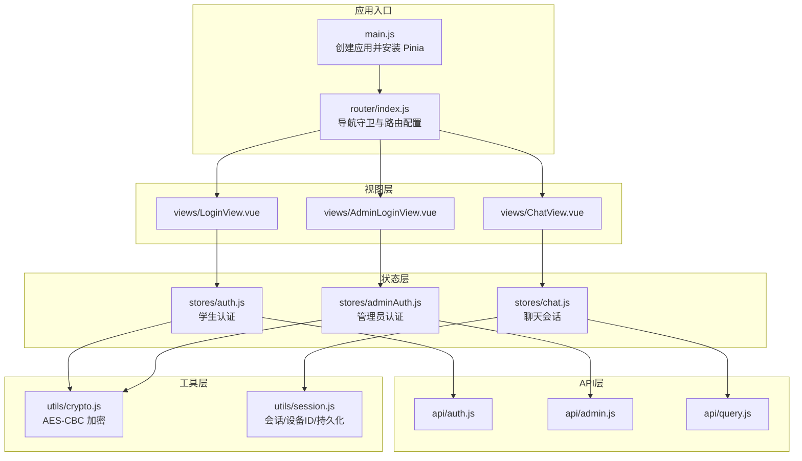
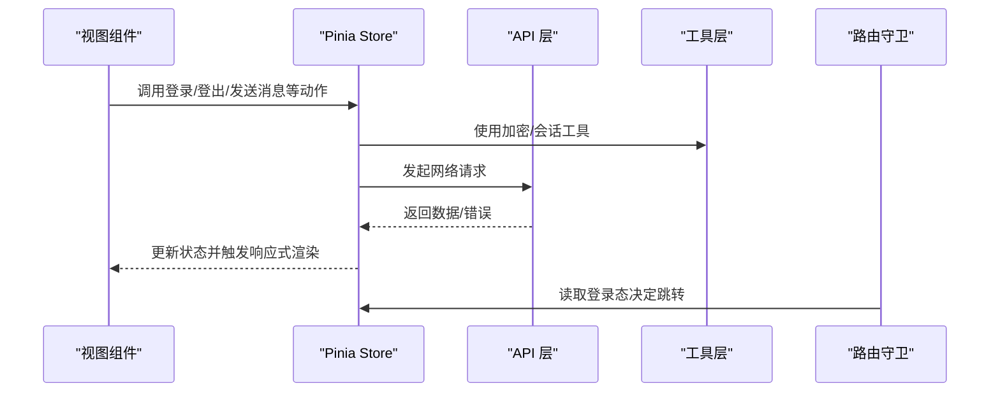
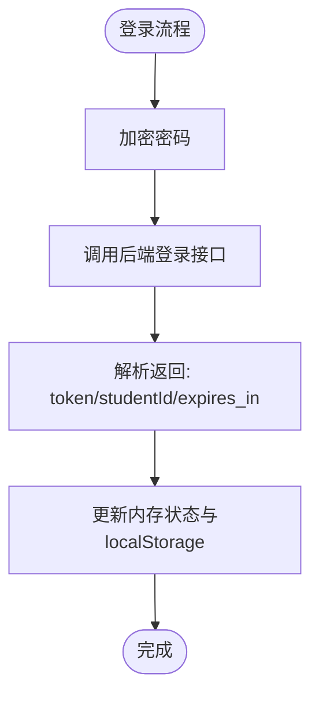
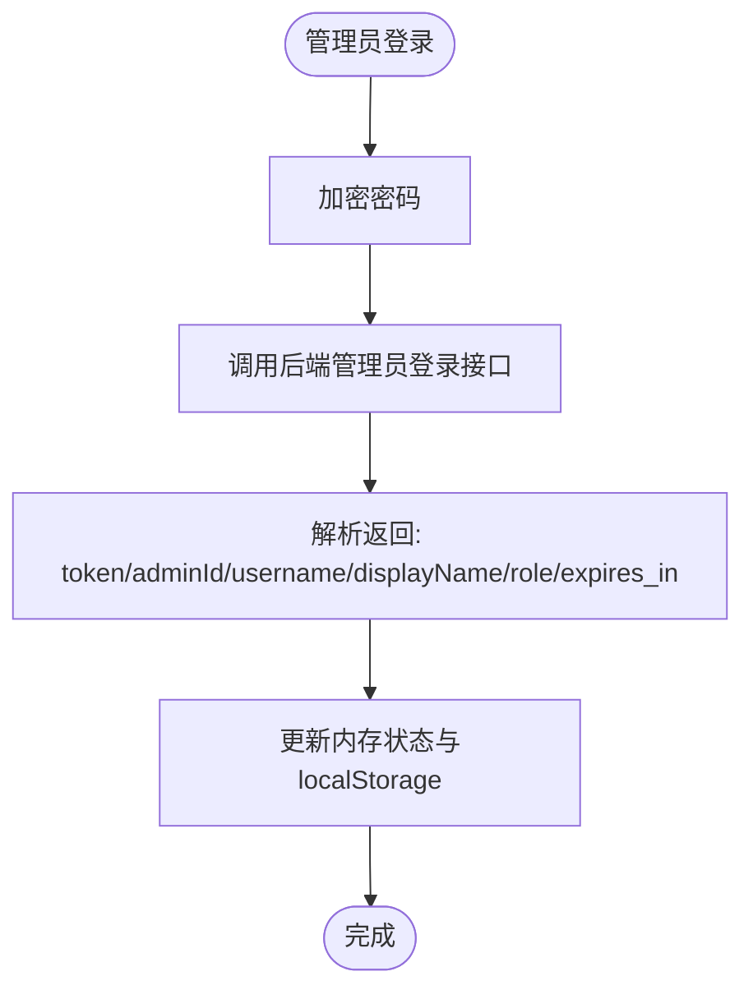
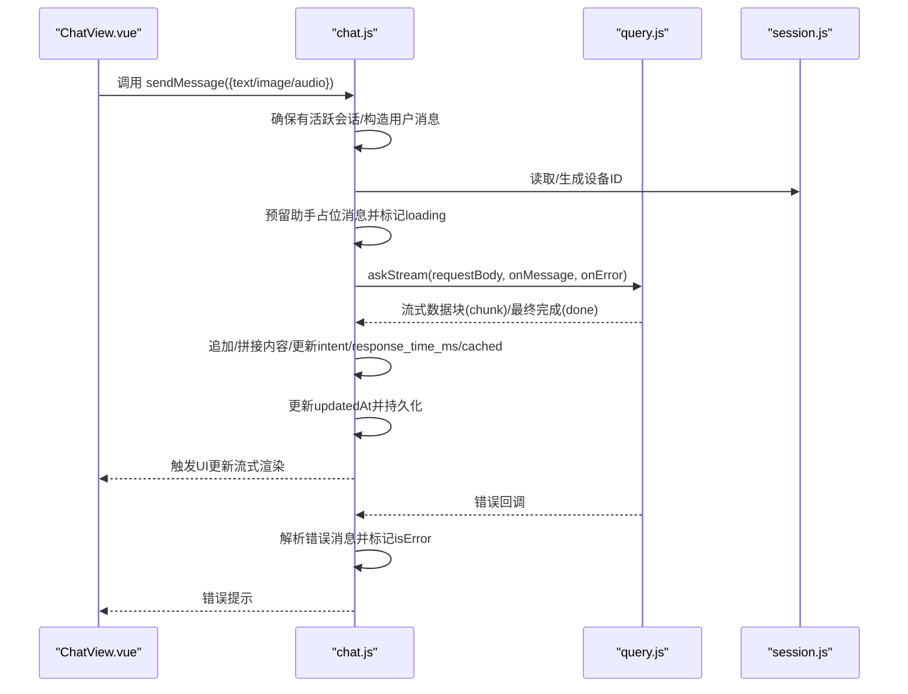
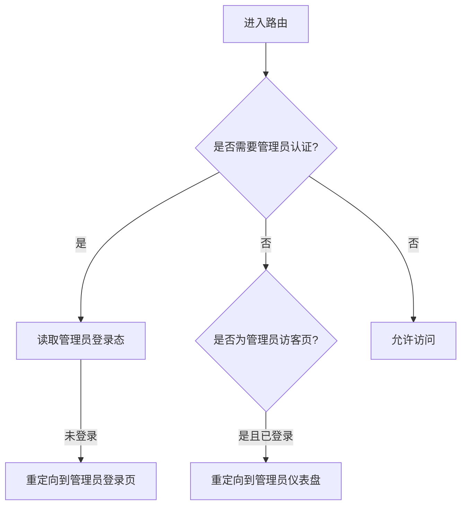
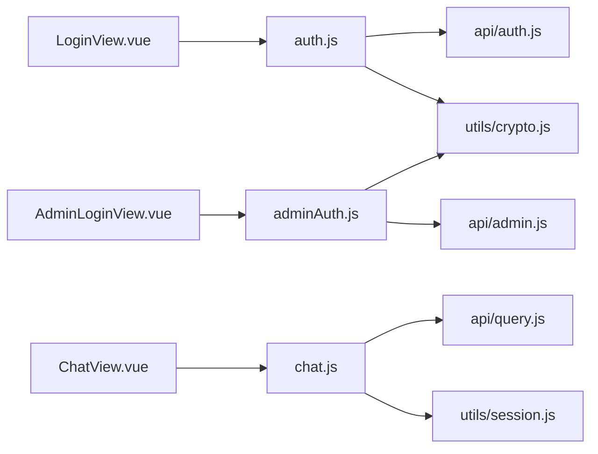

# 状态管理

<cite>
**本文引用的文件**
- [frontend/ai_assistant/src/main.js](file://frontend/ai_assistant/src/main.js)
- [frontend/ai_assistant/src/router/index.js](file://frontend/ai_assistant/src/router/index.js)
- [frontend/ai_assistant/src/stores/auth.js](file://frontend/ai_assistant/src/stores/auth.js)
- [frontend/ai_assistant/src/stores/adminAuth.js](file://frontend/ai_assistant/src/stores/adminAuth.js)
- [frontend/ai_assistant/src/stores/chat.js](file://frontend/ai_assistant/src/stores/chat.js)
- [frontend/ai_assistant/src/api/auth.js](file://frontend/ai_assistant/src/api/auth.js)
- [frontend/ai_assistant/src/api/admin.js](file://frontend/ai_assistant/src/api/admin.js)
- [frontend/ai_assistant/src/api/query.js](file://frontend/ai_assistant/src/api/query.js)
- [frontend/ai_assistant/src/utils/session.js](file://frontend/ai_assistant/src/utils/session.js)
- [frontend/ai_assistant/src/utils/crypto.js](file://frontend/ai_assistant/src/utils/crypto.js)
- [frontend/ai_assistant/src/views/LoginView.vue](file://frontend/ai_assistant/src/views/LoginView.vue)
- [frontend/ai_assistant/src/views/AdminLoginView.vue](file://frontend/ai_assistant/src/views/AdminLoginView.vue)
- [frontend/ai_assistant/src/views/ChatView.vue](file://frontend/ai_assistant/src/views/ChatView.vue)
</cite>

## 目录
1. [简介](#简介)
2. [项目结构](#项目结构)
3. [核心组件](#核心组件)
4. [架构总览](#架构总览)
5. [详细组件分析](#详细组件分析)
6. [依赖关系分析](#依赖关系分析)
7. [性能考量](#性能考量)
8. [故障排查指南](#故障排查指南)
9. [结论](#结论)
10. [附录](#附录)

## 简介
本文件面向AI校园助手项目的前端状态管理，系统性梳理基于 Pinia 的状态管理模式，重点覆盖：
- Store 设计原则与状态/计算属性/动作的组织方式
- 用户认证状态管理（登录、用户信息、令牌有效期）
- 聊天会话状态（消息列表、输入控制、实时流式更新）
- 管理员认证与权限控制
- 状态持久化策略（localStorage/sessionStorage）
- 最佳实践与常见问题

## 项目结构
前端采用 Vue 3 + Pinia 架构，状态集中在 stores 目录，配合 API 层与工具层协同工作；路由层负责鉴权守卫与页面跳转。

图表来源
- [frontend/ai_assistant/src/main.js:1-10](file://frontend/ai_assistant/src/main.js#L1-L10)
- [frontend/ai_assistant/src/router/index.js:1-75](file://frontend/ai_assistant/src/router/index.js#L1-L75)
- [frontend/ai_assistant/src/stores/auth.js:1-77](file://frontend/ai_assistant/src/stores/auth.js#L1-L77)
- [frontend/ai_assistant/src/stores/adminAuth.js:1-77](file://frontend/ai_assistant/src/stores/adminAuth.js#L1-L77)
- [frontend/ai_assistant/src/stores/chat.js:1-278](file://frontend/ai_assistant/src/stores/chat.js#L1-L278)
- [frontend/ai_assistant/src/api/auth.js:1-36](file://frontend/ai_assistant/src/api/auth.js#L1-L36)
- [frontend/ai_assistant/src/api/admin.js:1-41](file://frontend/ai_assistant/src/api/admin.js#L1-L41)
- [frontend/ai_assistant/src/api/query.js:1-141](file://frontend/ai_assistant/src/api/query.js#L1-L141)
- [frontend/ai_assistant/src/utils/crypto.js:1-40](file://frontend/ai_assistant/src/utils/crypto.js#L1-L40)
- [frontend/ai_assistant/src/utils/session.js:1-70](file://frontend/ai_assistant/src/utils/session.js#L1-L70)
- [frontend/ai_assistant/src/views/LoginView.vue:1-343](file://frontend/ai_assistant/src/views/LoginView.vue#L1-L343)
- [frontend/ai_assistant/src/views/AdminLoginView.vue:1-261](file://frontend/ai_assistant/src/views/AdminLoginView.vue#L1-L261)
- [frontend/ai_assistant/src/views/ChatView.vue:1-800](file://frontend/ai_assistant/src/views/ChatView.vue#L1-L800)

章节来源
- [frontend/ai_assistant/src/main.js:1-10](file://frontend/ai_assistant/src/main.js#L1-L10)
- [frontend/ai_assistant/src/router/index.js:1-75](file://frontend/ai_assistant/src/router/index.js#L1-L75)

## 核心组件
- 认证 Store（学生）：管理 token、学号、过期时间、登录/改密/登出动作，以及登录态计算属性。
- 管理员认证 Store：管理 token、管理员ID、用户名、显示名、角色、过期时间、登录/登出动作，以及登录态计算属性。
- 聊天 Store：管理会话列表、当前会话、消息列表、搜索关键字、加载状态、持久化、消息发送（含流式）、错误解析等。

章节来源
- [frontend/ai_assistant/src/stores/auth.js:17-77](file://frontend/ai_assistant/src/stores/auth.js#L17-L77)
- [frontend/ai_assistant/src/stores/adminAuth.js:16-77](file://frontend/ai_assistant/src/stores/adminAuth.js#L16-L77)
- [frontend/ai_assistant/src/stores/chat.js:22-278](file://frontend/ai_assistant/src/stores/chat.js#L22-L278)

## 架构总览
Pinia 在应用启动时被安装，随后各视图通过组合式 API 使用对应 Store。路由守卫根据 Store 的登录态决定页面可访问性。API 层负责与后端交互，工具层提供加密与会话/设备ID管理。

图表来源
- [frontend/ai_assistant/src/stores/auth.js:29-43](file://frontend/ai_assistant/src/stores/auth.js#L29-L43)
- [frontend/ai_assistant/src/stores/adminAuth.js:28-47](file://frontend/ai_assistant/src/stores/adminAuth.js#L28-L47)
- [frontend/ai_assistant/src/stores/chat.js:133-230](file://frontend/ai_assistant/src/stores/chat.js#L133-L230)
- [frontend/ai_assistant/src/api/query.js:28-141](file://frontend/ai_assistant/src/api/query.js#L28-L141)
- [frontend/ai_assistant/src/router/index.js:58-73](file://frontend/ai_assistant/src/router/index.js#L58-L73)

## 详细组件分析

### 认证状态管理（学生）
- 状态定义
  - token：JWT 认证令牌
  - studentId：学号
  - expiresAt：过期时间戳（毫秒）
- 计算属性
  - isAuthenticated：基于 token 是否存在且未过期
- 动作
  - login：加密密码 → 调用后端登录 → 写入 token、studentId、expiresAt，并持久化到 localStorage
  - changePassword：加密旧密码与新密码 → 调用后端修改密码
  - logout：清空状态并移除 localStorage 中的认证键
- 关键点
  - 令牌有效期通过 expiresAt 与当前时间比较判断
  - 密码加密使用 AES-CBC 并遵循 URL-safe Base64 格式

图表来源
- [frontend/ai_assistant/src/stores/auth.js:29-43](file://frontend/ai_assistant/src/stores/auth.js#L29-L43)
- [frontend/ai_assistant/src/api/auth.js:15-20](file://frontend/ai_assistant/src/api/auth.js#L15-L20)
- [frontend/ai_assistant/src/utils/crypto.js:26-40](file://frontend/ai_assistant/src/utils/crypto.js#L26-L40)

章节来源
- [frontend/ai_assistant/src/stores/auth.js:17-77](file://frontend/ai_assistant/src/stores/auth.js#L17-L77)
- [frontend/ai_assistant/src/api/auth.js:1-36](file://frontend/ai_assistant/src/api/auth.js#L1-L36)
- [frontend/ai_assistant/src/utils/crypto.js:1-40](file://frontend/ai_assistant/src/utils/crypto.js#L1-L40)

### 管理员认证状态管理
- 状态定义
  - token、adminId、username、displayName、role、expiresAt
- 计算属性
  - isAuthenticated：基于 token 是否存在且未过期
- 动作
  - login：加密密码 → 调用后端登录 → 写入管理员信息与过期时间，并持久化到 localStorage
  - logout：清空管理员状态并移除 localStorage 中的管理员键
- 关键点
  - 与学生认证类似，但字段更丰富，便于权限控制与展示

图表来源
- [frontend/ai_assistant/src/stores/adminAuth.js:28-47](file://frontend/ai_assistant/src/stores/adminAuth.js#L28-L47)
- [frontend/ai_assistant/src/api/admin.js:7-12](file://frontend/ai_assistant/src/api/admin.js#L7-L12)
- [frontend/ai_assistant/src/utils/crypto.js:26-40](file://frontend/ai_assistant/src/utils/crypto.js#L26-L40)

章节来源
- [frontend/ai_assistant/src/stores/adminAuth.js:16-77](file://frontend/ai_assistant/src/stores/adminAuth.js#L16-L77)
- [frontend/ai_assistant/src/api/admin.js:1-41](file://frontend/ai_assistant/src/api/admin.js#L1-L41)
- [frontend/ai_assistant/src/utils/crypto.js:1-40](file://frontend/ai_assistant/src/utils/crypto.js#L1-L40)

### 聊天会话状态管理
- 状态定义
  - sessions：会话数组（持久化于 localStorage）
  - activeSessionId：当前激活会话ID（持久化于 localStorage）
  - loadingStates：按会话ID记录加载状态
  - searchKeyword：会话/消息搜索关键词
- 计算属性
  - loading：当前会话是否处于加载中
  - currentSession：当前激活会话对象
  - currentMessages：当前会话的消息列表
  - filteredSessions：按关键词过滤的会话列表
- 动作
  - createSession / switchSession / deleteSession / clearAllSessions / deleteMessage
  - sendMessage：自动确保有活跃会话 → 构造用户消息 → 预留助手占位消息 → 流式接收数据 → 更新状态与持久化 → 解析错误消息
- 关键点
  - 会话与设备ID通过工具层生成与持久化
  - 流式更新通过 SSE/JSON 兼容逻辑处理，保证体验连续性
  - 首条用户消息自动设置会话标题

图表来源
- [frontend/ai_assistant/src/stores/chat.js:133-230](file://frontend/ai_assistant/src/stores/chat.js#L133-L230)
- [frontend/ai_assistant/src/api/query.js:28-141](file://frontend/ai_assistant/src/api/query.js#L28-L141)
- [frontend/ai_assistant/src/utils/session.js:24-31](file://frontend/ai_assistant/src/utils/session.js#L24-L31)

章节来源
- [frontend/ai_assistant/src/stores/chat.js:22-278](file://frontend/ai_assistant/src/stores/chat.js#L22-L278)
- [frontend/ai_assistant/src/api/query.js:1-141](file://frontend/ai_assistant/src/api/query.js#L1-L141)
- [frontend/ai_assistant/src/utils/session.js:1-70](file://frontend/ai_assistant/src/utils/session.js#L1-L70)

### 管理员认证与权限控制
- 路由守卫
  - requiresAdminAuth：需要管理员登录态才可访问
  - adminGuest：已登录管理员跳转至后台首页
- 视图层
  - 管理员登录页通过 useAdminAuthStore.login 完成登录
  - 登录成功后跳转至管理员仪表盘

图表来源
- [frontend/ai_assistant/src/router/index.js:58-73](file://frontend/ai_assistant/src/router/index.js#L58-L73)
- [frontend/ai_assistant/src/views/AdminLoginView.vue:75-105](file://frontend/ai_assistant/src/views/AdminLoginView.vue#L75-L105)

章节来源
- [frontend/ai_assistant/src/router/index.js:1-75](file://frontend/ai_assistant/src/router/index.js#L1-L75)
- [frontend/ai_assistant/src/views/AdminLoginView.vue:1-261](file://frontend/ai_assistant/src/views/AdminLoginView.vue#L1-L261)

## 依赖关系分析
- 组件耦合
  - 视图层仅依赖对应 Store，Store 依赖 API 与工具层，保持清晰分层
- 外部依赖
  - Pinia 提供响应式状态与动作
  - CryptoJS 提供 AES-CBC 加密
  - UUID 用于生成会话ID与设备ID
- 潜在风险
  - localStorage 作为持久化介质，需注意跨标签页同步与安全
  - 流式更新依赖浏览器 Fetch/ReadableStream，需兼容不同环境

图表来源
- [frontend/ai_assistant/src/views/LoginView.vue:81-121](file://frontend/ai_assistant/src/views/LoginView.vue#L81-L121)
- [frontend/ai_assistant/src/views/AdminLoginView.vue:62-105](file://frontend/ai_assistant/src/views/AdminLoginView.vue#L62-L105)
- [frontend/ai_assistant/src/views/ChatView.vue:224-333](file://frontend/ai_assistant/src/views/ChatView.vue#L224-L333)
- [frontend/ai_assistant/src/stores/auth.js:8-11](file://frontend/ai_assistant/src/stores/auth.js#L8-L11)
- [frontend/ai_assistant/src/stores/adminAuth.js:4-7](file://frontend/ai_assistant/src/stores/adminAuth.js#L4-L7)
- [frontend/ai_assistant/src/stores/chat.js:10-20](file://frontend/ai_assistant/src/stores/chat.js#L10-L20)

章节来源
- [frontend/ai_assistant/src/stores/auth.js:8-11](file://frontend/ai_assistant/src/stores/auth.js#L8-L11)
- [frontend/ai_assistant/src/stores/adminAuth.js:4-7](file://frontend/ai_assistant/src/stores/adminAuth.js#L4-L7)
- [frontend/ai_assistant/src/stores/chat.js:10-20](file://frontend/ai_assistant/src/stores/chat.js#L10-L20)

## 性能考量
- 响应式粒度
  - 将 loadingStates 按会话ID维护，避免全局状态变更引发不必要的重渲染
- 持久化策略
  - 会话列表与活跃会话ID使用 localStorage，减少刷新丢失
  - 令牌与敏感信息同样持久化，建议结合安全策略（如 HttpOnly Cookie）与最小暴露面
- 流式渲染
  - 逐块追加内容，及时更新 updatedAt 与持久化，提升交互流畅度
- 图片/语音处理
  - 前端压缩与尺寸限制，降低传输与解析成本

## 故障排查指南
- 登录失败
  - 检查后端返回状态码与 detail，前端已针对 401/403/502 等给出友好提示
  - 确认密码加密格式与后端一致（URL-safe Base64）
- 会话无响应或卡住
  - 确认流式接口是否正确返回 done 标记，必要时检查网关/代理配置
  - 若服务端未发送 done，前端已兜底结束状态
- 语音输入异常
  - 检查浏览器麦克风权限与录音时长/音量阈值
  - 后端静音/识别失败时，前端会将错误信息作为助手消息展示
- 令牌过期
  - 前端通过 expiresAt 判断登录态，过期后需重新登录
  - 建议在路由守卫中统一拦截 401 并引导重新登录

章节来源
- [frontend/ai_assistant/src/views/LoginView.vue:94-121](file://frontend/ai_assistant/src/views/LoginView.vue#L94-L121)
- [frontend/ai_assistant/src/views/AdminLoginView.vue:75-105](file://frontend/ai_assistant/src/views/AdminLoginView.vue#L75-L105)
- [frontend/ai_assistant/src/stores/chat.js:235-257](file://frontend/ai_assistant/src/stores/chat.js#L235-L257)
- [frontend/ai_assistant/src/api/query.js:136-140](file://frontend/ai_assistant/src/api/query.js#L136-L140)

## 结论
本项目采用 Pinia 实现清晰、可维护的状态管理：
- 认证与聊天两大域分别独立管理，职责边界明确
- 通过工具层统一处理加密与会话/设备ID，降低重复逻辑
- 路由守卫与 Store 计算属性共同保障访问控制与登录态一致性
- 流式更新与本地持久化提升了用户体验与健壮性

## 附录
- 状态设计原则
  - 单一职责：每个 Store 管理一个业务域
  - 响应式优先：使用 ref/computed 管理状态与派生数据
  - 动作内聚：将副作用（网络请求、本地存储）封装在动作内部
- 最佳实践
  - 将敏感信息（令牌）与非敏感信息（UI 状态）分离持久化
  - 为关键动作提供错误解析与降级提示
  - 对流式更新进行兜底处理，确保 UI 不会永远处于“加载中”
- 常见问题
  - 密码加密格式不一致导致登录失败
  - 流式接口未正确发送 done 导致 UI 卡住
  - 本地存储容量上限与跨标签页同步问题