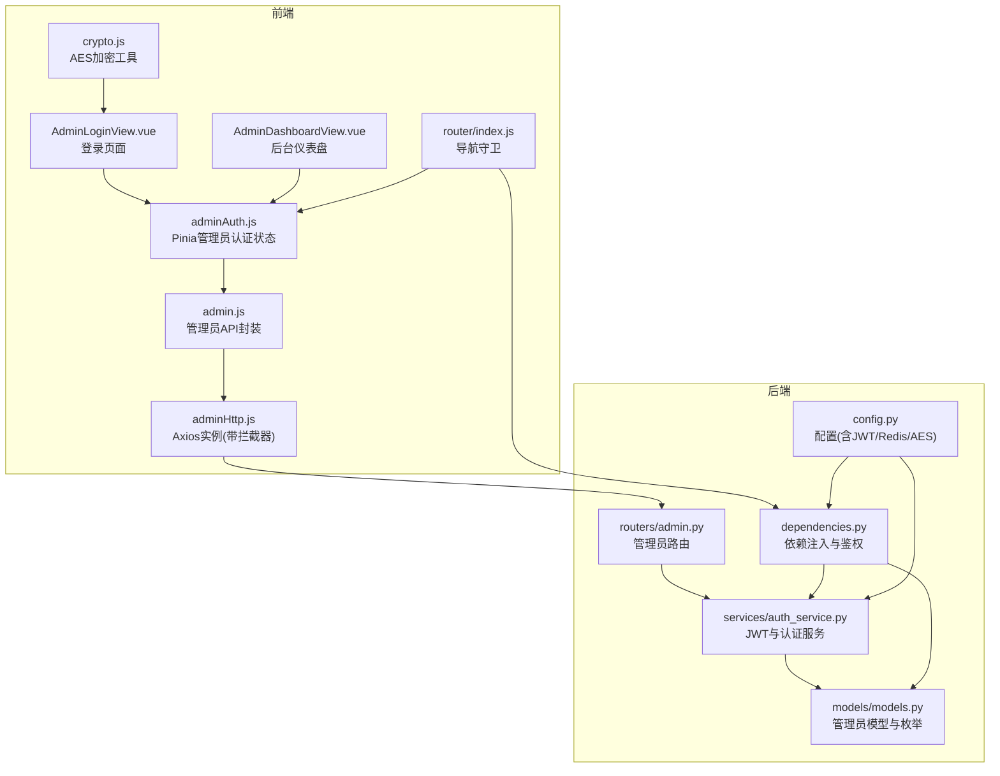
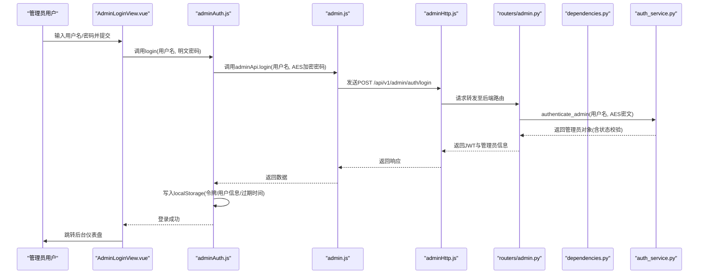
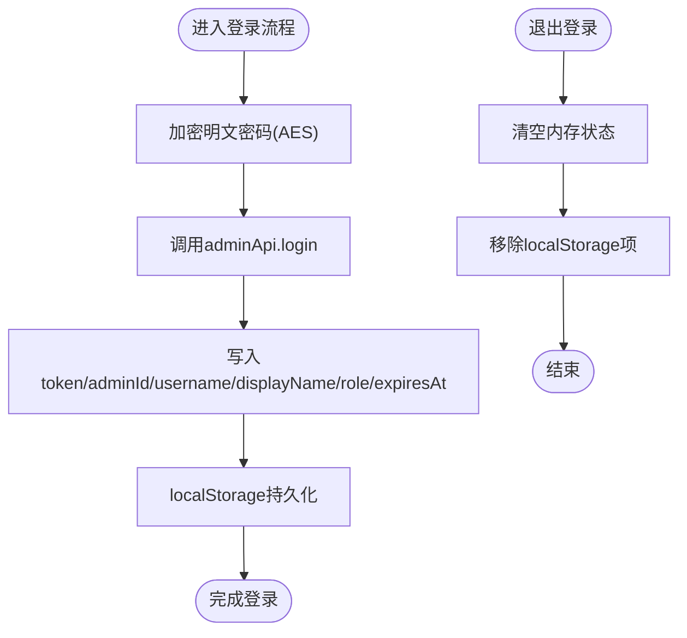
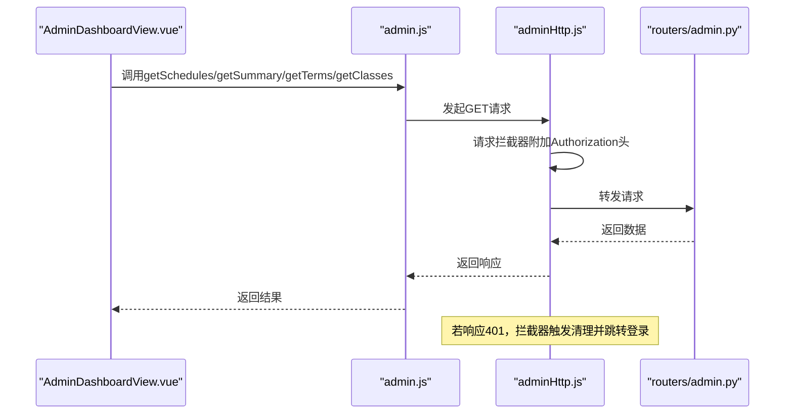
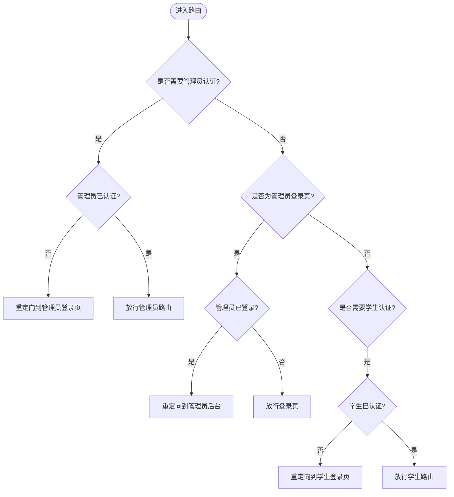
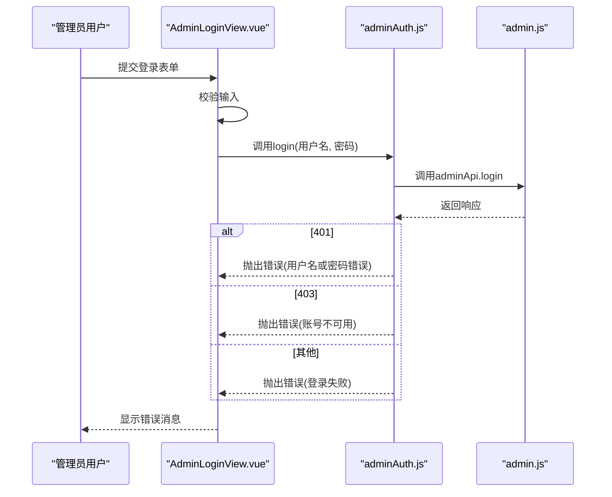
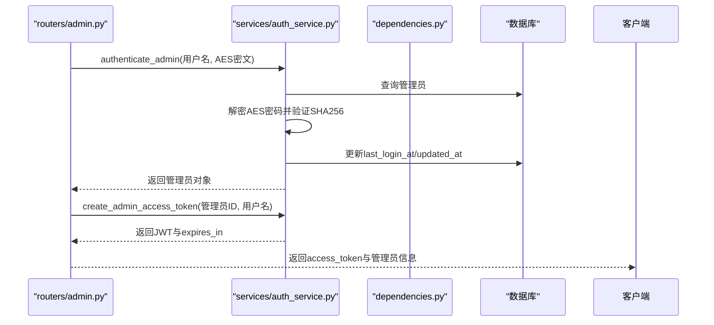
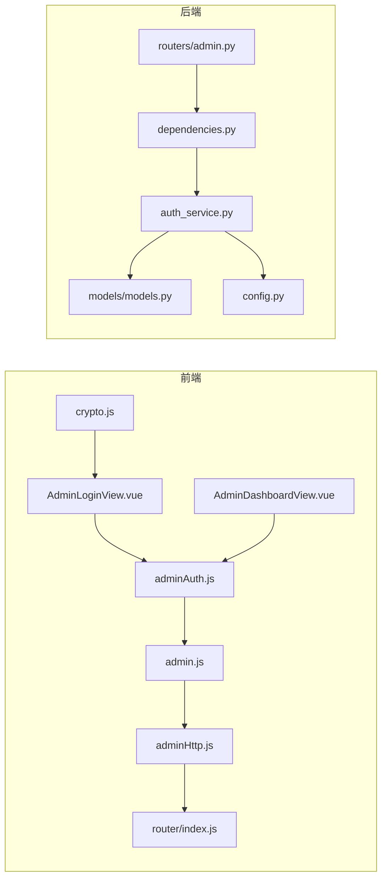

# 管理员认证状态

<cite>
**本文引用的文件**
- [frontend/ai_assistant/src/stores/adminAuth.js](file://frontend/ai_assistant/src/stores/adminAuth.js)
- [frontend/ai_assistant/src/api/admin.js](file://frontend/ai_assistant/src/api/admin.js)
- [frontend/ai_assistant/src/api/adminHttp.js](file://frontend/ai_assistant/src/api/adminHttp.js)
- [frontend/ai_assistant/src/views/AdminLoginView.vue](file://frontend/ai_assistant/src/views/AdminLoginView.vue)
- [frontend/ai_assistant/src/views/AdminDashboardView.vue](file://frontend/ai_assistant/src/views/AdminDashboardView.vue)
- [frontend/ai_assistant/src/router/index.js](file://frontend/ai_assistant/src/router/index.js)
- [frontend/ai_assistant/src/utils/crypto.js](file://frontend/ai_assistant/src/utils/crypto.js)
- [service/ai_assistant/app/routers/admin.py](file://service/ai_assistant/app/routers/admin.py)
- [service/ai_assistant/app/services/auth_service.py](file://service/ai_assistant/app/services/auth_service.py)
- [service/ai_assistant/app/dependencies.py](file://service/ai_assistant/app/dependencies.py)
- [service/ai_assistant/app/models/models.py](file://service/ai_assistant/app/models/models.py)
- [service/ai_assistant/app/config.py](file://service/ai_assistant/app/config.py)
</cite>

## 目录
1. [简介](#简介)
2. [项目结构](#项目结构)
3. [核心组件](#核心组件)
4. [架构总览](#架构总览)
5. [详细组件分析](#详细组件分析)
6. [依赖关系分析](#依赖关系分析)
7. [性能考量](#性能考量)
8. [故障排查指南](#故障排查指南)
9. [结论](#结论)

## 简介
本文件聚焦于AI校园助手项目的“管理员认证状态管理”。内容涵盖：
- 管理员登录状态的特殊处理机制与权限校验
- 管理员认证与普通用户认证的差异与特殊逻辑
- 管理员状态的持久化策略与安全考虑
- 管理员权限检查与路由保护的实现方式
- 管理员状态在后台管理界面中的使用示例
- 管理员认证失败的处理与安全防护措施

## 项目结构
该功能横跨前端与后端两部分：
- 前端负责UI交互、状态存储、请求封装与路由守卫
- 后端负责JWT签发与校验、管理员权限校验、资源访问控制

图表来源
- [frontend/ai_assistant/src/views/AdminLoginView.vue:1-261](file://frontend/ai_assistant/src/views/AdminLoginView.vue#L1-L261)
- [frontend/ai_assistant/src/views/AdminDashboardView.vue:1-688](file://frontend/ai_assistant/src/views/AdminDashboardView.vue#L1-L688)
- [frontend/ai_assistant/src/stores/adminAuth.js:1-77](file://frontend/ai_assistant/src/stores/adminAuth.js#L1-L77)
- [frontend/ai_assistant/src/api/admin.js:1-41](file://frontend/ai_assistant/src/api/admin.js#L1-L41)
- [frontend/ai_assistant/src/api/adminHttp.js:1-44](file://frontend/ai_assistant/src/api/adminHttp.js#L1-L44)
- [frontend/ai_assistant/src/router/index.js:1-75](file://frontend/ai_assistant/src/router/index.js#L1-L75)
- [frontend/ai_assistant/src/utils/crypto.js:1-40](file://frontend/ai_assistant/src/utils/crypto.js#L1-L40)
- [service/ai_assistant/app/routers/admin.py:1-388](file://service/ai_assistant/app/routers/admin.py#L1-L388)
- [service/ai_assistant/app/services/auth_service.py:1-253](file://service/ai_assistant/app/services/auth_service.py#L1-L253)
- [service/ai_assistant/app/dependencies.py:1-109](file://service/ai_assistant/app/dependencies.py#L1-L109)
- [service/ai_assistant/app/models/models.py:1-200](file://service/ai_assistant/app/models/models.py#L1-L200)
- [service/ai_assistant/app/config.py:1-113](file://service/ai_assistant/app/config.py#L1-L113)

章节来源
- [frontend/ai_assistant/src/router/index.js:1-75](file://frontend/ai_assistant/src/router/index.js#L1-L75)
- [service/ai_assistant/app/routers/admin.py:1-388](file://service/ai_assistant/app/routers/admin.py#L1-L388)

## 核心组件
- 管理员认证状态管理（Pinia Store）
  - 关键字段：token、adminId、username、displayName、role、expiresAt
  - 计算属性：isAuthenticated（基于token存在性与过期时间判断）
  - 方法：login（加密密码、调用API、写入localStorage）、logout（清空状态与localStorage）
- 管理员API封装
  - login、me、getSummary、getTerms、getClasses、getSchedules、updateScheduleStatus
- 管理员Axios实例
  - 请求拦截：自动附加Authorization头
  - 响应拦截：401自动清理状态并跳转登录页
- 路由守卫
  - requiresAdminAuth：需要管理员认证才可访问
  - adminGuest：已登录管理员禁止访问登录页
- 管理员登录视图
  - 表单校验、错误提示、提交流程
- 管理员后台视图
  - 展示管理员信息、加载统计数据、筛选与分页、状态切换

章节来源
- [frontend/ai_assistant/src/stores/adminAuth.js:1-77](file://frontend/ai_assistant/src/stores/adminAuth.js#L1-L77)
- [frontend/ai_assistant/src/api/admin.js:1-41](file://frontend/ai_assistant/src/api/admin.js#L1-L41)
- [frontend/ai_assistant/src/api/adminHttp.js:1-44](file://frontend/ai_assistant/src/api/adminHttp.js#L1-L44)
- [frontend/ai_assistant/src/router/index.js:1-75](file://frontend/ai_assistant/src/router/index.js#L1-L75)
- [frontend/ai_assistant/src/views/AdminLoginView.vue:1-261](file://frontend/ai_assistant/src/views/AdminLoginView.vue#L1-L261)
- [frontend/ai_assistant/src/views/AdminDashboardView.vue:1-688](file://frontend/ai_assistant/src/views/AdminDashboardView.vue#L1-L688)

## 架构总览
管理员认证采用前后端分离的JWT方案：
- 前端使用AES加密密码，后端使用AES解密并校验SHA256哈希
- 后端签发管理员JWT，包含role=admin、username等声明
- 前端通过Axios拦截器自动附加Authorization头
- 后端依赖注入解析JWT，校验role=admin与账户状态
- 路由守卫根据meta标记进行访问控制

图表来源
- [frontend/ai_assistant/src/views/AdminLoginView.vue:75-105](file://frontend/ai_assistant/src/views/AdminLoginView.vue#L75-L105)
- [frontend/ai_assistant/src/stores/adminAuth.js:28-47](file://frontend/ai_assistant/src/stores/adminAuth.js#L28-L47)
- [frontend/ai_assistant/src/api/admin.js:7-12](file://frontend/ai_assistant/src/api/admin.js#L7-L12)
- [frontend/ai_assistant/src/api/adminHttp.js:12-18](file://frontend/ai_assistant/src/api/adminHttp.js#L12-L18)
- [service/ai_assistant/app/routers/admin.py:51-82](file://service/ai_assistant/app/routers/admin.py#L51-L82)
- [service/ai_assistant/app/services/auth_service.py:212-252](file://service/ai_assistant/app/services/auth_service.py#L212-L252)
- [service/ai_assistant/app/dependencies.py:75-107](file://service/ai_assistant/app/dependencies.py#L75-L107)

## 详细组件分析

### 管理员认证状态管理（Pinia Store）
- 状态字段
  - token：JWT令牌
  - adminId、username、displayName：管理员标识与展示信息
  - role：管理员角色（super_admin、scheduler_admin、security_admin、readonly_admin）
  - expiresAt：过期时间戳
- 计算属性isAuthenticated
  - 基于token存在性与当前时间与过期时间比较
- 方法
  - login：加密密码、调用后端登录接口、写入localStorage
  - logout：清空状态并移除localStorage项

图表来源
- [frontend/ai_assistant/src/stores/adminAuth.js:28-63](file://frontend/ai_assistant/src/stores/adminAuth.js#L28-L63)
- [frontend/ai_assistant/src/utils/crypto.js:26-40](file://frontend/ai_assistant/src/utils/crypto.js#L26-L40)

章节来源
- [frontend/ai_assistant/src/stores/adminAuth.js:1-77](file://frontend/ai_assistant/src/stores/adminAuth.js#L1-L77)

### 管理员API封装与Axios实例
- admin.js
  - 提供login、me、getSummary、getTerms、getClasses、getSchedules、updateScheduleStatus等方法
- adminHttp.js
  - 创建axios实例，设置基础URL与超时
  - 请求拦截：自动附加Authorization头
  - 响应拦截：401时清理管理员认证状态并跳转登录页

图表来源
- [frontend/ai_assistant/src/api/admin.js:1-41](file://frontend/ai_assistant/src/api/admin.js#L1-L41)
- [frontend/ai_assistant/src/api/adminHttp.js:20-41](file://frontend/ai_assistant/src/api/adminHttp.js#L20-L41)
- [service/ai_assistant/app/routers/admin.py:102-144](file://service/ai_assistant/app/routers/admin.py#L102-L144)

章节来源
- [frontend/ai_assistant/src/api/admin.js:1-41](file://frontend/ai_assistant/src/api/admin.js#L1-L41)
- [frontend/ai_assistant/src/api/adminHttp.js:1-44](file://frontend/ai_assistant/src/api/adminHttp.js#L1-L44)

### 路由守卫与权限控制
- 路由元信息
  - requiresAdminAuth：需要管理员认证
  - adminGuest：已登录管理员禁止访问登录页
- 导航守卫逻辑
  - 管理员路由：未登录则重定向至管理员登录页；已登录则放行
  - 管理员登录页：已登录则重定向至后台
  - 学生路由：同理区分requiresAuth/guest

图表来源
- [frontend/ai_assistant/src/router/index.js:58-73](file://frontend/ai_assistant/src/router/index.js#L58-L73)

章节来源
- [frontend/ai_assistant/src/router/index.js:1-75](file://frontend/ai_assistant/src/router/index.js#L1-L75)

### 管理员登录视图与错误处理
- 表单校验：用户名与密码非空
- 登录流程：调用adminAuth.login，成功跳转后台，失败根据HTTP状态码显示不同错误信息
- 错误类型：401用户名或密码错误、403账号不可用、其他未知错误

图表来源
- [frontend/ai_assistant/src/views/AdminLoginView.vue:75-105](file://frontend/ai_assistant/src/views/AdminLoginView.vue#L75-L105)
- [frontend/ai_assistant/src/stores/adminAuth.js:28-47](file://frontend/ai_assistant/src/stores/adminAuth.js#L28-L47)
- [frontend/ai_assistant/src/api/admin.js:7-12](file://frontend/ai_assistant/src/api/admin.js#L7-L12)

章节来源
- [frontend/ai_assistant/src/views/AdminLoginView.vue:1-261](file://frontend/ai_assistant/src/views/AdminLoginView.vue#L1-L261)

### 管理员后台仪表盘与状态使用
- 展示管理员信息：displayName/username/role
- 加载统计数据：pending_adjustments、active_schedules、cancelled_schedules、total_classes、total_terms
- 支持筛选与分页：term_id、class_id、week_no、schedule_status、keyword
- 状态切换：点击启用/停用课表，调用updateScheduleStatus并刷新数据

章节来源
- [frontend/ai_assistant/src/views/AdminDashboardView.vue:1-688](file://frontend/ai_assistant/src/views/AdminDashboardView.vue#L1-L688)

### 后端JWT签发与校验
- 管理员登录
  - authenticate_admin：查找管理员、校验状态、解密AES密码、验证SHA256哈希
  - create_admin_access_token：签发JWT，包含role=admin、username等
- 依赖注入与鉴权
  - get_current_admin：解析JWT，校验role=admin与账户状态
- 管理员路由
  - /admin/auth/login：返回JWT与管理员信息
  - /admin/auth/me：返回当前管理员信息
  - /admin/dashboard/summary：统计信息
  - /admin/schedules：课表列表与状态更新

图表来源
- [service/ai_assistant/app/routers/admin.py:51-82](file://service/ai_assistant/app/routers/admin.py#L51-L82)
- [service/ai_assistant/app/services/auth_service.py:212-252](file://service/ai_assistant/app/services/auth_service.py#L212-L252)
- [service/ai_assistant/app/dependencies.py:75-107](file://service/ai_assistant/app/dependencies.py#L75-L107)

章节来源
- [service/ai_assistant/app/routers/admin.py:1-388](file://service/ai_assistant/app/routers/admin.py#L1-L388)
- [service/ai_assistant/app/services/auth_service.py:1-253](file://service/ai_assistant/app/services/auth_service.py#L1-L253)
- [service/ai_assistant/app/dependencies.py:1-109](file://service/ai_assistant/app/dependencies.py#L1-L109)

### 管理员权限模型与角色管理
- 角色枚举：super_admin、scheduler_admin、security_admin、readonly_admin
- 状态枚举：active、disabled、locked
- 依赖注入中对管理员状态进行二次校验（active）

章节来源
- [service/ai_assistant/app/models/models.py:28-58](file://service/ai_assistant/app/models/models.py#L28-L58)
- [service/ai_assistant/app/dependencies.py:100-107](file://service/ai_assistant/app/dependencies.py#L100-L107)

## 依赖关系分析
- 前端依赖
  - adminAuth.js依赖admin.js与crypto.js
  - admin.js依赖adminHttp.js
  - adminHttp.js依赖router与adminAuth.js（用于401拦截）
  - AdminLoginView与AdminDashboardView依赖adminAuth.js
  - router/index.js依赖两个store以实现路由守卫
- 后端依赖
  - routers/admin.py依赖dependencies.py与auth_service.py
  - dependencies.py依赖auth_service.py与models/models.py
  - auth_service.py依赖config.py与models/models.py

图表来源
- [frontend/ai_assistant/src/stores/adminAuth.js:1-77](file://frontend/ai_assistant/src/stores/adminAuth.js#L1-L77)
- [frontend/ai_assistant/src/api/admin.js:1-41](file://frontend/ai_assistant/src/api/admin.js#L1-L41)
- [frontend/ai_assistant/src/api/adminHttp.js:1-44](file://frontend/ai_assistant/src/api/adminHttp.js#L1-L44)
- [frontend/ai_assistant/src/router/index.js:1-75](file://frontend/ai_assistant/src/router/index.js#L1-L75)
- [frontend/ai_assistant/src/views/AdminLoginView.vue:1-261](file://frontend/ai_assistant/src/views/AdminLoginView.vue#L1-L261)
- [frontend/ai_assistant/src/views/AdminDashboardView.vue:1-688](file://frontend/ai_assistant/src/views/AdminDashboardView.vue#L1-L688)
- [frontend/ai_assistant/src/utils/crypto.js:1-40](file://frontend/ai_assistant/src/utils/crypto.js#L1-L40)
- [service/ai_assistant/app/routers/admin.py:1-388](file://service/ai_assistant/app/routers/admin.py#L1-L388)
- [service/ai_assistant/app/dependencies.py:1-109](file://service/ai_assistant/app/dependencies.py#L1-L109)
- [service/ai_assistant/app/services/auth_service.py:1-253](file://service/ai_assistant/app/services/auth_service.py#L1-L253)
- [service/ai_assistant/app/models/models.py:1-200](file://service/ai_assistant/app/models/models.py#L1-L200)
- [service/ai_assistant/app/config.py:1-113](file://service/ai_assistant/app/config.py#L1-L113)

章节来源
- [frontend/ai_assistant/src/router/index.js:1-75](file://frontend/ai_assistant/src/router/index.js#L1-L75)
- [service/ai_assistant/app/routers/admin.py:1-388](file://service/ai_assistant/app/routers/admin.py#L1-L388)

## 性能考量
- 前端
  - Pinia状态仅保存必要字段，避免冗余
  - localStorage读写在登录与登出时进行，减少频繁IO
  - Axios拦截器统一处理401，避免重复逻辑
- 后端
  - JWT签发与解析为轻量操作，主要开销在数据库查询与密码校验
  - 依赖注入按需获取数据库连接与Redis客户端
  - 管理员状态校验在get_current_admin中完成，确保每次受保护路由均进行校验

[本节为通用性能讨论，不直接分析具体文件]

## 故障排查指南
- 登录失败（401）
  - 可能原因：用户名或密码错误
  - 前端表现：显示“用户名或密码错误”
  - 后端原因：authenticate_admin中用户名不存在或密码哈希不匹配
- 登录失败（403）
  - 可能原因：管理员账号不可用（状态非active）
  - 前端表现：显示“账号不可用，请联系系统管理员”
  - 后端原因：authenticate_admin中状态校验失败
- 401未授权（运行中）
  - 前端表现：自动清理管理员认证状态并跳转登录页
  - 触发条件：adminHttp响应拦截器捕获401
- 令牌过期
  - 前端表现：isAuthenticated计算属性为false
  - 处理建议：重新登录获取新令牌

章节来源
- [frontend/ai_assistant/src/views/AdminLoginView.vue:95-101](file://frontend/ai_assistant/src/views/AdminLoginView.vue#L95-L101)
- [service/ai_assistant/app/services/auth_service.py:229-235](file://service/ai_assistant/app/services/auth_service.py#L229-L235)
- [frontend/ai_assistant/src/api/adminHttp.js:31-41](file://frontend/ai_assistant/src/api/adminHttp.js#L31-L41)
- [frontend/ai_assistant/src/stores/adminAuth.js:24-26](file://frontend/ai_assistant/src/stores/adminAuth.js#L24-L26)

## 结论
本项目通过前后端协作实现了完善的管理员认证与权限控制：
- 前端采用Pinia集中管理管理员状态，Axios统一处理请求与401响应
- 后端通过JWT与依赖注入实现强校验，结合管理员角色与状态枚举保障安全性
- 路由守卫确保管理员专属页面的访问控制
- 后台界面充分利用管理员状态进行数据展示与业务操作