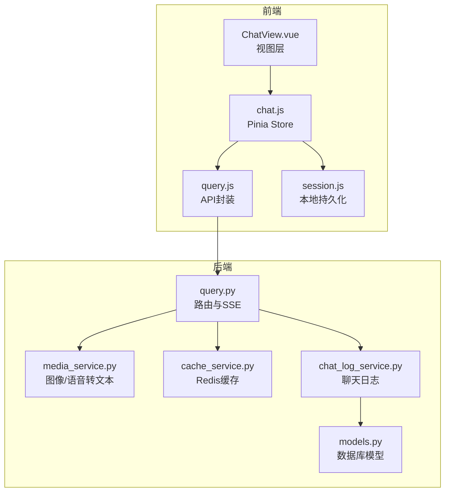
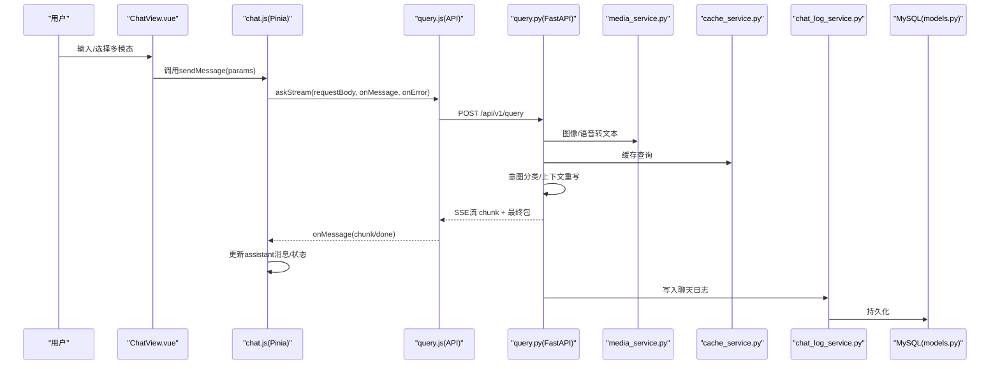
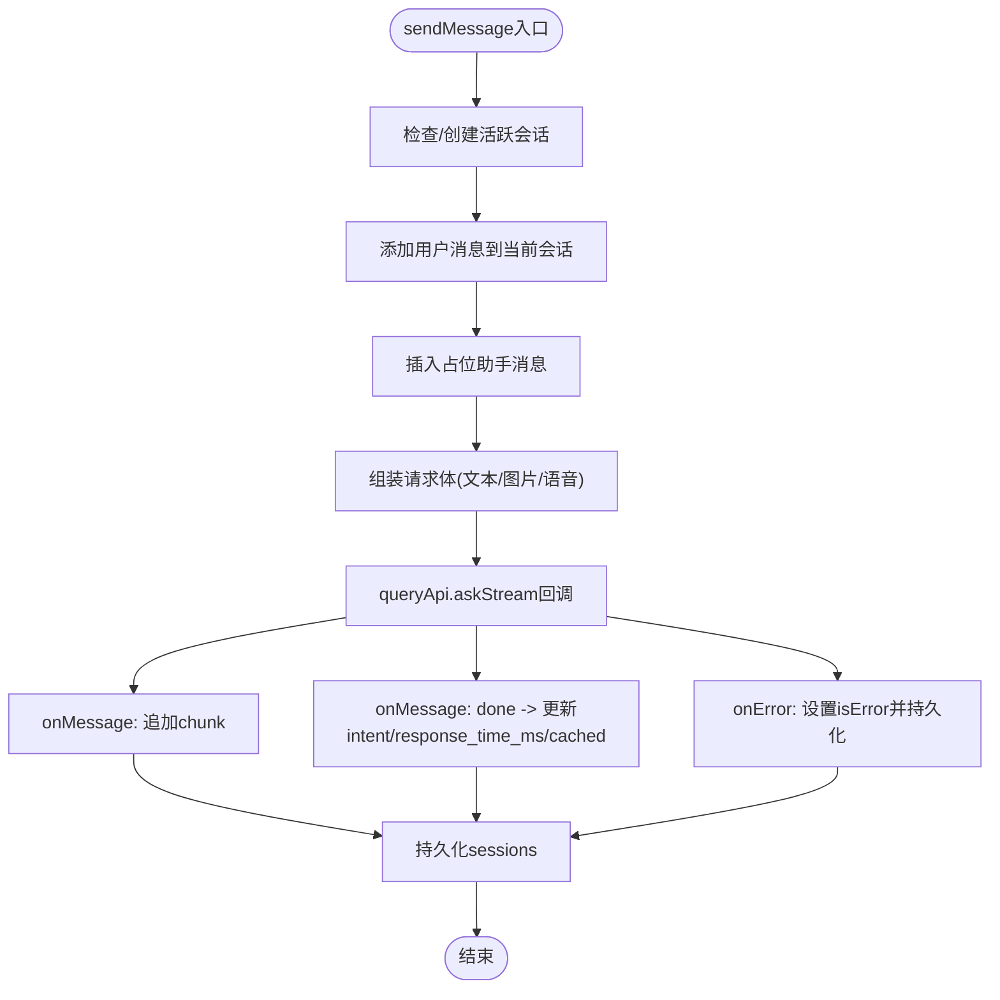
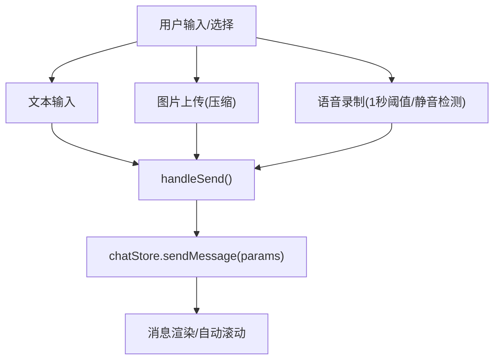
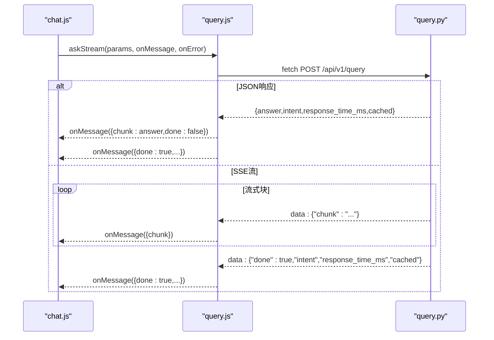
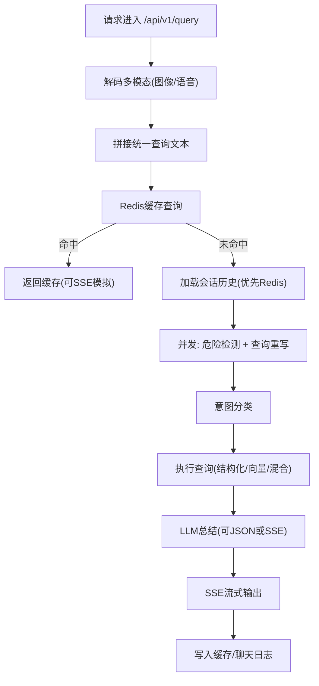
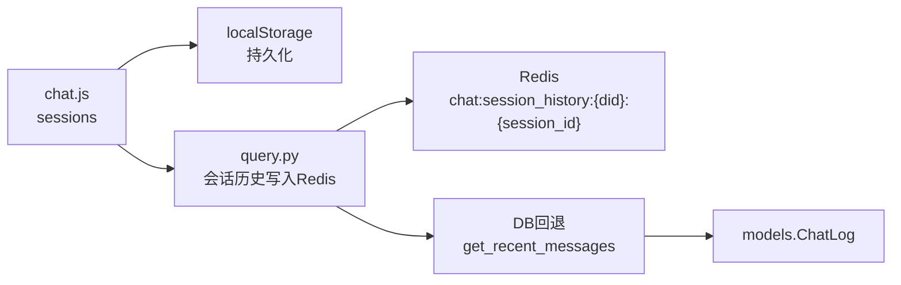
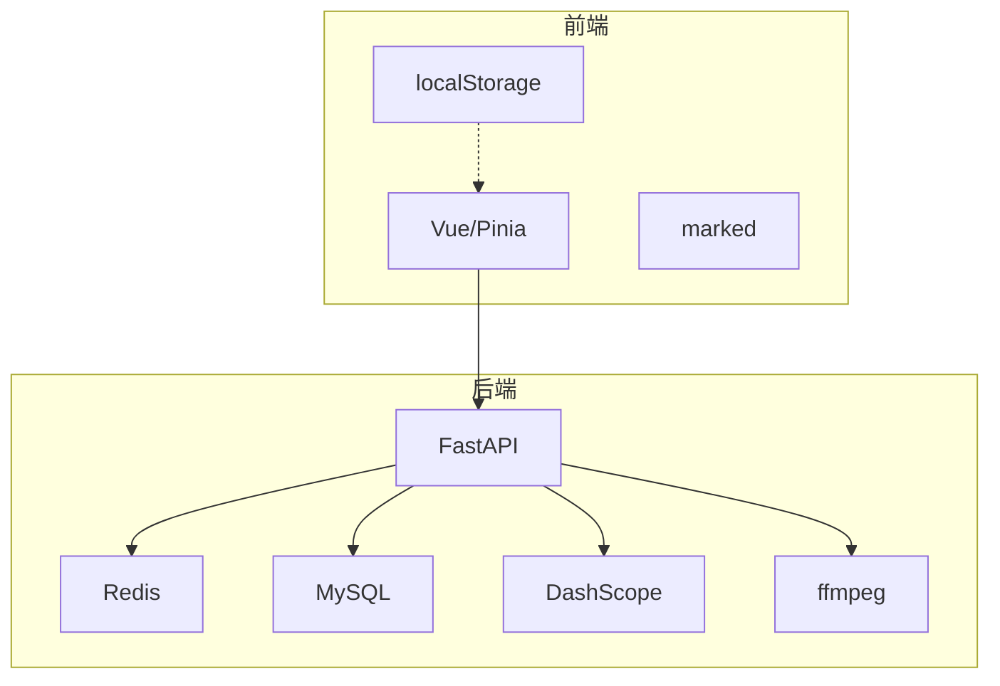

# 聊天状态管理

<cite>
**本文档引用的文件**
- [chat.js](file://frontend/ai_assistant/src/stores/chat.js)
- [ChatView.vue](file://frontend/ai_assistant/src/views/ChatView.vue)
- [session.js](file://frontend/ai_assistant/src/utils/session.js)
- [query.js](file://frontend/ai_assistant/src/api/query.js)
- [query.py](file://service/ai_assistant/app/routers/query.py)
- [chat_log_service.py](file://service/ai_assistant/app/services/chat_log_service.py)
- [models.py](file://service/ai_assistant/app/models/models.py)
- [cache_service.py](file://service/ai_assistant/app/services/cache_service.py)
- [media_service.py](file://service/ai_assistant/app/services/media_service.py)
- [config.py](file://service/ai_assistant/app/config.py)
- [main.js](file://frontend/ai_assistant/src/main.js)
</cite>

## 目录
1. [简介](#简介)
2. [项目结构](#项目结构)
3. [核心组件](#核心组件)
4. [架构总览](#架构总览)
5. [详细组件分析](#详细组件分析)
6. [依赖分析](#依赖分析)
7. [性能考虑](#性能考虑)
8. [故障排查指南](#故障排查指南)
9. [结论](#结论)
10. [附录](#附录)

## 简介
本文件面向AI校园助手项目的聊天状态管理，系统性阐述以下主题：
- 聊天会话状态设计：消息列表管理、用户输入状态、AI响应处理
- 消息状态生命周期：发送中、已接收、错误状态
- 实时消息流与SSE连接管理
- 聊天历史的存储与恢复
- 多模态输入状态管理：文本、图片、语音
- 组件中的响应式使用示例
- 性能优化与内存管理策略

## 项目结构
前端采用Vue 3 + Pinia，后端采用FastAPI + Redis + MySQL。聊天状态主要由前端Pinia Store集中管理，后端负责多模态处理、意图识别、缓存与SSE流式输出。

图表来源
- [ChatView.vue](file://frontend/ai_assistant/src/views/ChatView.vue)
- [chat.js](file://frontend/ai_assistant/src/stores/chat.js)
- [query.js](file://frontend/ai_assistant/src/api/query.js)
- [query.py](file://service/ai_assistant/app/routers/query.py)
- [media_service.py](file://service/ai_assistant/app/services/media_service.py)
- [cache_service.py](file://service/ai_assistant/app/services/cache_service.py)
- [chat_log_service.py](file://service/ai_assistant/app/services/chat_log_service.py)
- [models.py](file://service/ai_assistant/app/models/models.py)

章节来源
- [main.js:1-10](file://frontend/ai_assistant/src/main.js#L1-L10)
- [chat.js:1-278](file://frontend/ai_assistant/src/stores/chat.js#L1-L278)
- [ChatView.vue:1-535](file://frontend/ai_assistant/src/views/ChatView.vue#L1-L535)
- [session.js:1-70](file://frontend/ai_assistant/src/utils/session.js#L1-L70)
- [query.js:1-141](file://frontend/ai_assistant/src/api/query.js#L1-L141)
- [query.py:1-788](file://service/ai_assistant/app/routers/query.py#L1-L788)
- [media_service.py:1-246](file://service/ai_assistant/app/services/media_service.py#L1-L246)
- [cache_service.py:1-177](file://service/ai_assistant/app/services/cache_service.py#L1-L177)
- [chat_log_service.py:1-76](file://service/ai_assistant/app/services/chat_log_service.py#L1-L76)
- [models.py:625-660](file://service/ai_assistant/app/models/models.py#L625-L660)

## 核心组件
- Pinia聊天Store：集中管理会话、消息、搜索、加载状态与持久化
- ChatView视图：渲染消息列表、输入区、多模态交互与滚动控制
- API封装：统一POST /api/v1/query，支持SSE流式接收
- 后端路由：多模态输入解码、意图识别、缓存、SSE流式输出
- 历史与缓存：Redis会话历史隔离、聊天日志持久化、缓存TTL与失效策略
- 媒体服务：图像/语音转文本，前置体积与格式优化

章节来源
- [chat.js:22-278](file://frontend/ai_assistant/src/stores/chat.js#L22-L278)
- [ChatView.vue:222-535](file://frontend/ai_assistant/src/views/ChatView.vue#L222-L535)
- [query.js:7-141](file://frontend/ai_assistant/src/api/query.js#L7-L141)
- [query.py:198-745](file://service/ai_assistant/app/routers/query.py#L198-L745)
- [cache_service.py:92-177](file://service/ai_assistant/app/services/cache_service.py#L92-L177)
- [chat_log_service.py:14-76](file://service/ai_assistant/app/services/chat_log_service.py#L14-L76)
- [media_service.py:115-246](file://service/ai_assistant/app/services/media_service.py#L115-L246)

## 架构总览
从前端到后端的典型交互链路如下：

图表来源
- [ChatView.vue:311-333](file://frontend/ai_assistant/src/views/ChatView.vue#L311-L333)
- [chat.js:133-230](file://frontend/ai_assistant/src/stores/chat.js#L133-L230)
- [query.js:28-141](file://frontend/ai_assistant/src/api/query.js#L28-L141)
- [query.py:207-745](file://service/ai_assistant/app/routers/query.py#L207-L745)
- [media_service.py:115-246](file://service/ai_assistant/app/services/media_service.py#L115-L246)
- [cache_service.py:92-177](file://service/ai_assistant/app/services/cache_service.py#L92-L177)
- [chat_log_service.py:14-76](file://service/ai_assistant/app/services/chat_log_service.py#L14-L76)
- [models.py:641-660](file://service/ai_assistant/app/models/models.py#L641-L660)

## 详细组件分析

### Pinia聊天Store（消息与会话状态）
- 状态字段
  - sessions：会话数组，每项含id、title、createdAt、updatedAt、messages
  - activeSessionId：当前激活会话ID
  - loadingStates：按会话ID标记加载状态
  - searchKeyword：搜索关键词
- 计算属性
  - loading：基于activeSessionId与loadingStates
  - currentSession/currentMessages：当前会话与消息列表
  - filteredSessions：按标题或消息内容过滤
- 关键操作
  - createSession/switchSession/deleteSession/clearAllSessions：会话生命周期
  - deleteMessage：删除单条消息
  - sendMessage：核心发送逻辑，含多模态参数、占位助手消息、SSE回调、错误处理与持久化
- 错误解析
  - resolveErrorMessage：根据后端状态码与错误详情生成用户可读提示

图表来源
- [chat.js:133-230](file://frontend/ai_assistant/src/stores/chat.js#L133-L230)

章节来源
- [chat.js:22-278](file://frontend/ai_assistant/src/stores/chat.js#L22-L278)

### ChatView视图（响应式UI与多模态输入）
- 欢迎界面与消息列表渲染
- 头像、图片、语音气泡、Markdown渲染、意图标签、缓存/耗时/设备ID徽章
- 输入区：文本域自适应、图片预览与压缩、语音录制（MediaRecorder）、发送按钮禁用逻辑
- 语音播放：Web Audio + base64 data URI，互斥播放与错误兜底
- 自动滚动到底部，监听消息长度变化

图表来源
- [ChatView.vue:311-333](file://frontend/ai_assistant/src/views/ChatView.vue#L311-L333)
- [ChatView.vue:335-395](file://frontend/ai_assistant/src/views/ChatView.vue#L335-L395)
- [ChatView.vue:397-482](file://frontend/ai_assistant/src/views/ChatView.vue#L397-L482)
- [ChatView.vue:483-525](file://frontend/ai_assistant/src/views/ChatView.vue#L483-L525)

章节来源
- [ChatView.vue:1-535](file://frontend/ai_assistant/src/views/ChatView.vue#L1-L535)

### API封装与SSE流式处理
- ask：一次性JSON响应
- askStream：SSE流式解析，兼容网关改写，兜底未发送done包
- 错误处理：HTTP状态码解析、服务端错误字段解析、抛出可捕获异常

图表来源
- [query.js:28-141](file://frontend/ai_assistant/src/api/query.js#L28-L141)
- [query.py:115-125](file://service/ai_assistant/app/routers/query.py#L115-L125)
- [query.py:659-745](file://service/ai_assistant/app/routers/query.py#L659-L745)

章节来源
- [query.js:1-141](file://frontend/ai_assistant/src/api/query.js#L1-L141)
- [query.py:198-745](file://service/ai_assistant/app/routers/query.py#L198-L745)

### 后端路由：多模态、意图与SSE
- 多模态输入解码：图像转文本、语音转文本
- 缓存查找：命中则直接返回或模拟SSE
- 历史加载：Redis会话隔离历史，降级到DB
- 并发任务：危险内容检测、查询重写
- 意图分类与修正：structured/vector/hybrid/smalltalk
- SSE生成器：分块输出，最终包携带intent/response_time_ms/cached
- 缓存与日志：写入Redis缓存与聊天日志

图表来源
- [query.py:207-745](file://service/ai_assistant/app/routers/query.py#L207-L745)
- [media_service.py:115-246](file://service/ai_assistant/app/services/media_service.py#L115-L246)
- [cache_service.py:92-177](file://service/ai_assistant/app/services/cache_service.py#L92-L177)
- [chat_log_service.py:14-76](file://service/ai_assistant/app/services/chat_log_service.py#L14-L76)

章节来源
- [query.py:1-788](file://service/ai_assistant/app/routers/query.py#L1-L788)
- [media_service.py:1-246](file://service/ai_assistant/app/services/media_service.py#L1-L246)
- [cache_service.py:1-177](file://service/ai_assistant/app/services/cache_service.py#L1-L177)
- [chat_log_service.py:1-76](file://service/ai_assistant/app/services/chat_log_service.py#L1-L76)

### 聊天历史存储与恢复
- 本地存储：localStorage持久化sessions与activeSessionId
- 会话隔离历史：Redis按did:session_id键存储最近N条消息，避免并发会话串话
- DB回退：Redis异常时降级到按did查询最近消息
- 聊天日志：按sender、system_action、response_time_ms等字段持久化

图表来源
- [session.js:37-70](file://frontend/ai_assistant/src/utils/session.js#L37-L70)
- [query.py:153-196](file://service/ai_assistant/app/routers/query.py#L153-L196)
- [chat_log_service.py:58-73](file://service/ai_assistant/app/services/chat_log_service.py#L58-L73)
- [models.py:641-660](file://service/ai_assistant/app/models/models.py#L641-L660)

章节来源
- [session.js:1-70](file://frontend/ai_assistant/src/utils/session.js#L1-L70)
- [query.py:157-196](file://service/ai_assistant/app/routers/query.py#L157-L196)
- [chat_log_service.py:1-76](file://service/ai_assistant/app/services/chat_log_service.py#L1-L76)
- [models.py:625-660](file://service/ai_assistant/app/models/models.py#L625-L660)

### 多模态输入状态管理
- 文本：直接作为请求体字段
- 图片：前端压缩至合理尺寸与格式，后端进一步优化并调用图像理解模型
- 语音：前端录制并校验时长与静音阈值，后端转换为WAV并调用ASR模型
- 状态字段：消息对象包含image_base64、audio_base64、audioDuration、isPlaying等

章节来源
- [chat.js:145-154](file://frontend/ai_assistant/src/stores/chat.js#L145-L154)
- [ChatView.vue:335-395](file://frontend/ai_assistant/src/views/ChatView.vue#L335-L395)
- [ChatView.vue:397-482](file://frontend/ai_assistant/src/views/ChatView.vue#L397-L482)
- [media_service.py:115-246](file://service/ai_assistant/app/services/media_service.py#L115-L246)

### 组件中的响应式使用示例
- 在ChatView中注入useChatStore，绑定输入状态与消息列表
- 通过watch监听消息数量变化自动滚动
- 通过computed属性与模板指令实现条件渲染与禁用逻辑
- 通过事件处理函数触发sendMessage，实现多模态发送

章节来源
- [ChatView.vue:222-535](file://frontend/ai_assistant/src/views/ChatView.vue#L222-L535)
- [chat.js:22-56](file://frontend/ai_assistant/src/stores/chat.js#L22-L56)

## 依赖分析
- 前端依赖
  - Vue 3 + Pinia：状态与响应式
  - marked：Markdown渲染
  - localStorage：会话持久化
- 后端依赖
  - FastAPI：路由与SSE
  - Redis：缓存与会话历史
  - MySQL：聊天日志持久化
  - DashScope：图像理解与语音识别
  - ffmpeg：音频格式转换

图表来源
- [ChatView.vue:222-286](file://frontend/ai_assistant/src/views/ChatView.vue#L222-L286)
- [query.py:1-788](file://service/ai_assistant/app/routers/query.py#L1-L788)
- [config.py:1-113](file://service/ai_assistant/app/config.py#L1-L113)

章节来源
- [config.py:1-113](file://service/ai_assistant/app/config.py#L1-L113)

## 性能考虑
- 前端
  - 消息列表渲染：使用TransitionGroup与key绑定，减少重绘
  - 图片上传：前端压缩与尺寸限制，避免超限
  - 语音录制：静音与时长阈值，减少无效请求
  - 持久化：批量更新后一次性持久化，避免频繁IO
- 后端
  - 并发任务：危险检测与查询重写并行，缩短总耗时
  - 缓存策略：敏感/非敏感不同TTL；日期敏感与课表敏感版本控制
  - SSE：及时释放数据库连接，避免长事务占用
  - Redis会话历史：固定长度与过期策略，防止无限增长

章节来源
- [ChatView.vue:335-395](file://frontend/ai_assistant/src/views/ChatView.vue#L335-L395)
- [query.py:347-352](file://service/ai_assistant/app/routers/query.py#L347-L352)
- [cache_service.py:85-177](file://service/ai_assistant/app/services/cache_service.py#L85-L177)
- [query.py:652-745](file://service/ai_assistant/app/routers/query.py#L652-L745)

## 故障排查指南
- 常见错误与提示
  - 400：至少提供文本、图片或语音之一
  - 401：登录过期，需重新登录
  - 502：AI服务不可用或语音未识别
  - 语音静音：后端明确提示“未检测到清晰语音内容”
- 前端SSE解析
  - 网关可能改写流格式，兼容解析与兜底done包
  - 服务端错误字段会被包装为客户端异常
- 后端异常
  - 图像/语音处理失败：检查DashScope配置与ffmpeg可用性
  - Redis异常：降级到DB历史加载
- 日志定位
  - 后端路由与服务层均包含详细日志，便于追踪

章节来源
- [chat.js:235-257](file://frontend/ai_assistant/src/stores/chat.js#L235-L257)
- [query.js:136-141](file://frontend/ai_assistant/src/api/query.js#L136-L141)
- [query.py:238-260](file://service/ai_assistant/app/routers/query.py#L238-L260)
- [query.py:740-744](file://service/ai_assistant/app/routers/query.py#L740-L744)

## 结论
本项目通过Pinia集中管理聊天状态，结合后端SSE流式输出与多模态处理能力，实现了流畅的实时对话体验。前端在输入与渲染层面做了多项优化，后端在缓存、历史隔离与并发处理方面提供了稳健支撑。整体架构清晰、职责分离明确，具备良好的扩展性与可维护性。

## 附录
- 关键配置项
  - MAX_HISTORY_COUNT：会话历史条数上限
  - CACHE_TTL_SENSITIVE/CACHE_TTL_NORMAL：缓存TTL
  - LLM_MODEL_*：各环节模型配置
- 数据模型
  - ChatLog：聊天日志表，包含sender、system_action、response_time_ms等

章节来源
- [config.py:46-84](file://service/ai_assistant/app/config.py#L46-L84)
- [models.py:641-660](file://service/ai_assistant/app/models/models.py#L641-L660)