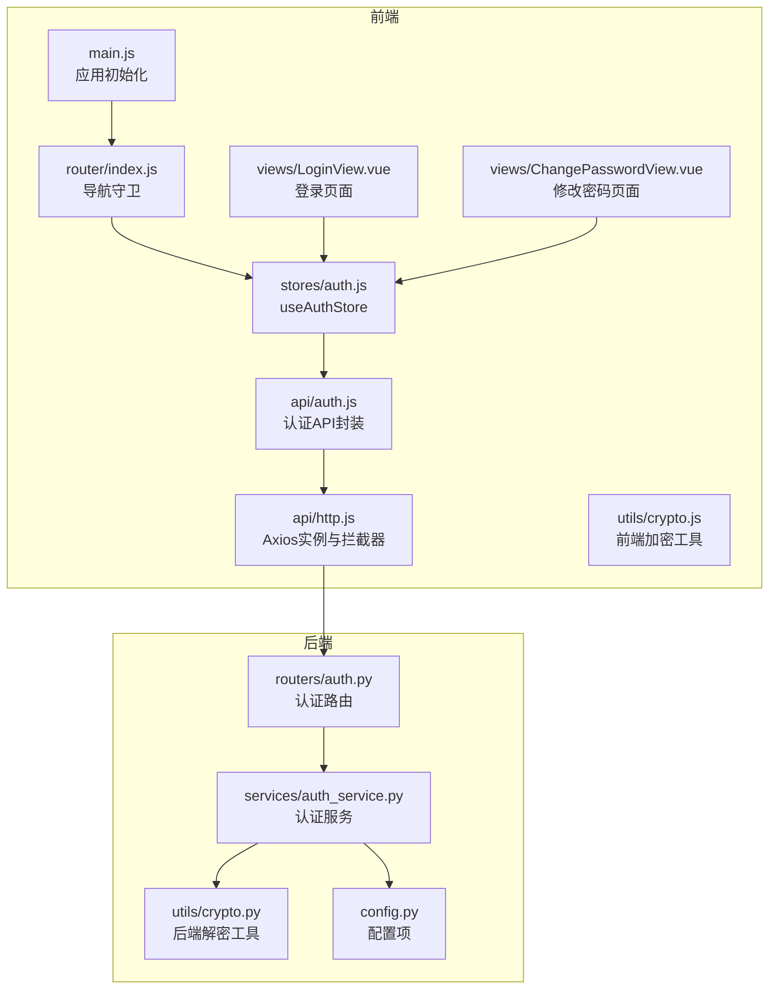
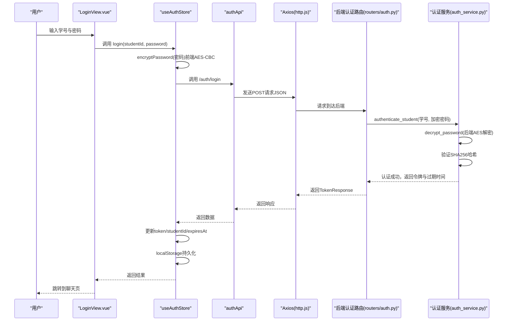
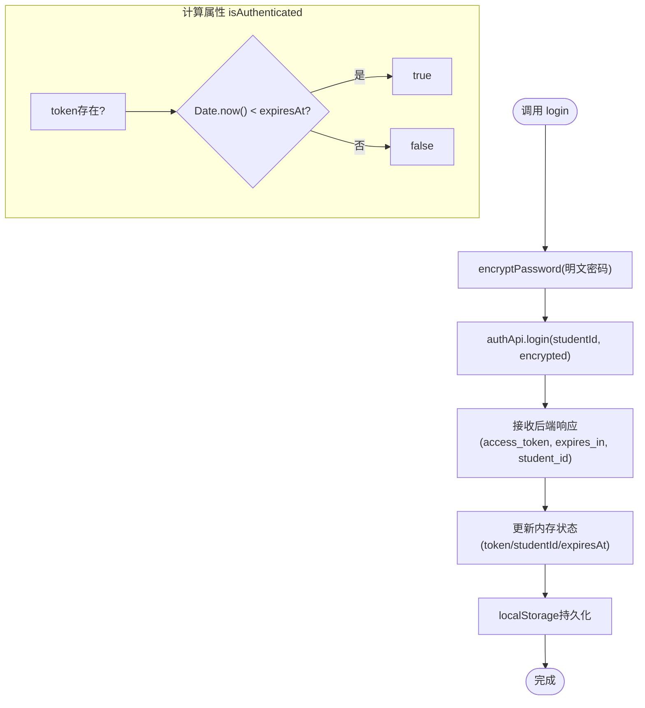
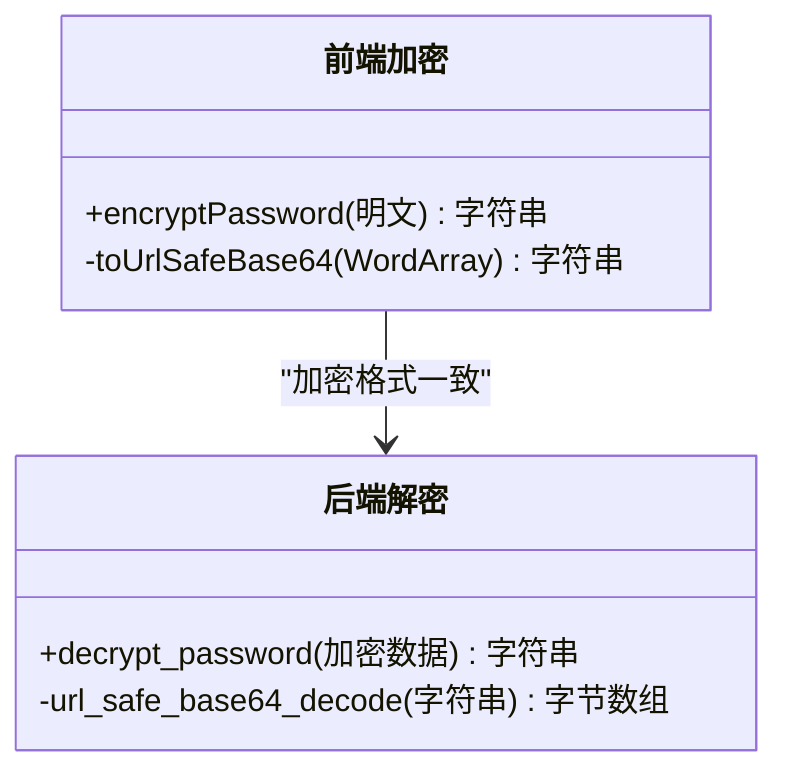
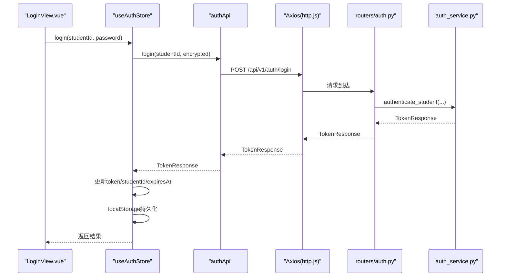
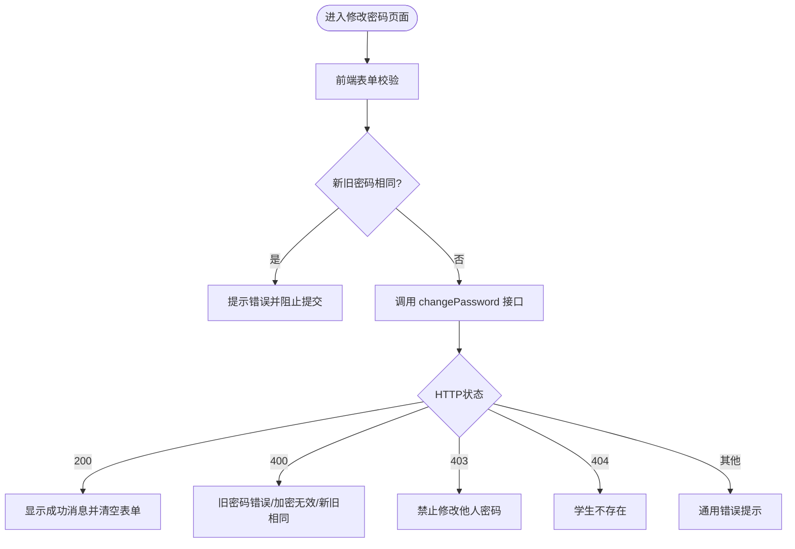
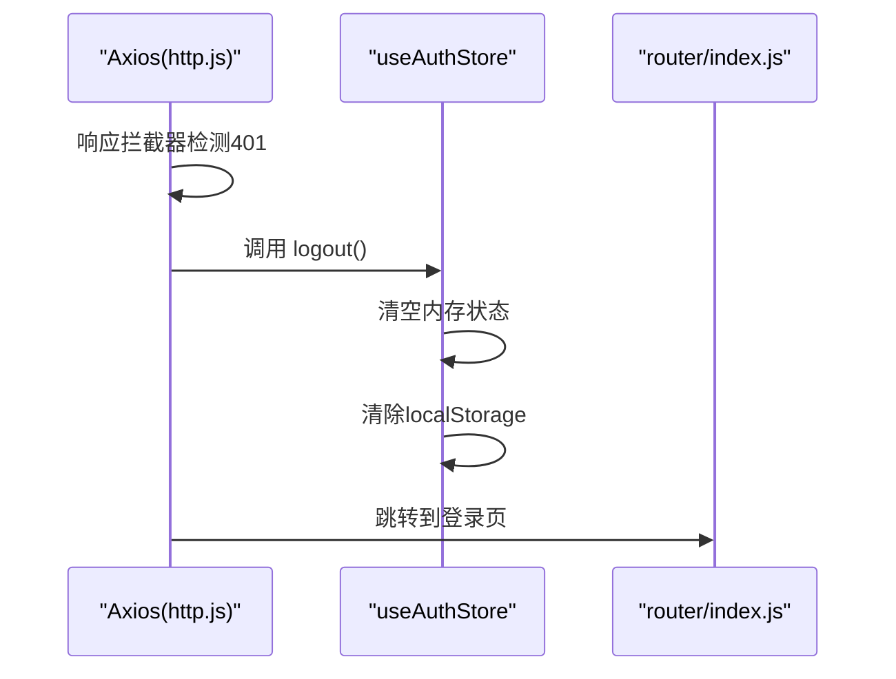
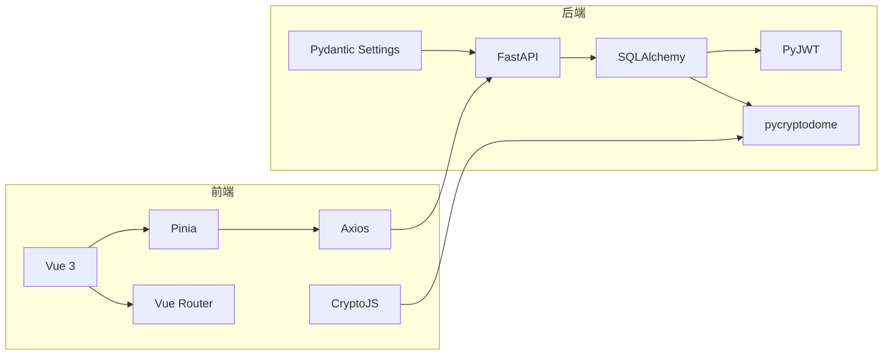

# 认证状态管理

<cite>
**本文引用的文件**
- [auth.js](file://frontend/ai_assistant/src/stores/auth.js)
- [crypto.js](file://frontend/ai_assistant/src/utils/crypto.js)
- [auth.js](file://frontend/ai_assistant/src/api/auth.js)
- [http.js](file://frontend/ai_assistant/src/api/http.js)
- [LoginView.vue](file://frontend/ai_assistant/src/views/LoginView.vue)
- [ChangePasswordView.vue](file://frontend/ai_assistant/src/views/ChangePasswordView.vue)
- [index.js](file://frontend/ai_assistant/src/router/index.js)
- [main.js](file://frontend/ai_assistant/src/main.js)
- [auth.py](file://service/ai_assistant/app/routers/auth.py)
- [auth_service.py](file://service/ai_assistant/app/services/auth_service.py)
- [crypto.py](file://service/ai_assistant/app/utils/crypto.py)
- [config.py](file://service/ai_assistant/app/config.py)
</cite>

## 目录
1. [简介](#简介)
2. [项目结构](#项目结构)
3. [核心组件](#核心组件)
4. [架构总览](#架构总览)
5. [详细组件分析](#详细组件分析)
6. [依赖分析](#依赖分析)
7. [性能考虑](#性能考虑)
8. [故障排除指南](#故障排除指南)
9. [结论](#结论)
10. [附录](#附录)

## 简介
本文件面向AI校园助手项目的认证状态管理，重点解析前端useAuthStore的实现，涵盖以下方面：
- JWT令牌管理与本地存储
- 用户登录状态跟踪与计算属性isAuthenticated
- 密码加密处理（AES-CBC）与前后端一致性
- 登录流程（密码加密、后端认证、令牌存储）
- 密码修改的安全实现与错误处理
- 登出操作的状态清理与本地存储清除
- 在组件中的使用示例与最佳实践
- 错误处理与状态恢复策略

## 项目结构
认证相关代码主要分布在前端store、API层、视图组件与路由守卫，以及后端FastAPI路由与服务层。整体采用“前端Pinia状态 + Axios拦截器 + Vue Router守卫”的模式，配合后端JWT签发与AES解密。

图表来源
- [main.js:1-10](file://frontend/ai_assistant/src/main.js#L1-L10)
- [index.js:1-75](file://frontend/ai_assistant/src/router/index.js#L1-L75)
- [auth.js:1-77](file://frontend/ai_assistant/src/stores/auth.js#L1-L77)
- [http.js:1-49](file://frontend/ai_assistant/src/api/http.js#L1-L49)
- [auth.js:1-36](file://frontend/ai_assistant/src/api/auth.js#L1-L36)
- [crypto.js:1-40](file://frontend/ai_assistant/src/utils/crypto.js#L1-L40)
- [LoginView.vue:1-343](file://frontend/ai_assistant/src/views/LoginView.vue#L1-L343)
- [ChangePasswordView.vue:1-466](file://frontend/ai_assistant/src/views/ChangePasswordView.vue#L1-L466)
- [auth.py:1-102](file://service/ai_assistant/app/routers/auth.py#L1-L102)
- [auth_service.py:1-253](file://service/ai_assistant/app/services/auth_service.py#L1-L253)
- [crypto.py:1-73](file://service/ai_assistant/app/utils/crypto.py#L1-L73)
- [config.py:1-113](file://service/ai_assistant/app/config.py#L1-L113)

章节来源
- [main.js:1-10](file://frontend/ai_assistant/src/main.js#L1-L10)
- [index.js:1-75](file://frontend/ai_assistant/src/router/index.js#L1-L75)

## 核心组件
本节聚焦useAuthStore，它是认证状态管理的核心，负责：
- 状态：token、studentId、expiresAt
- 计算属性：isAuthenticated（基于token存在性与过期时间判断）
- 方法：login（密码加密、调用后端、存储令牌）、changePassword（加密旧/新密码、调用后端）、logout（清空状态与本地存储）

章节来源
- [auth.js:1-77](file://frontend/ai_assistant/src/stores/auth.js#L1-L77)

## 架构总览
认证流程从用户输入开始，经过前端加密与API调用，后端验证并通过JWT签发令牌；Axios拦截器自动附加Authorization头；路由守卫根据isAuthenticated控制访问；401时自动登出并跳转登录页。

图表来源
- [LoginView.vue:94-121](file://frontend/ai_assistant/src/views/LoginView.vue#L94-L121)
- [auth.js:29-43](file://frontend/ai_assistant/src/stores/auth.js#L29-L43)
- [auth.js:15-20](file://frontend/ai_assistant/src/api/auth.js#L15-L20)
- [http.js:18-34](file://frontend/ai_assistant/src/api/http.js#L18-L34)
- [auth.py:33-52](file://service/ai_assistant/app/routers/auth.py#L33-L52)
- [auth_service.py:125-169](file://service/ai_assistant/app/services/auth_service.py#L125-L169)
- [crypto.py:39-73](file://service/ai_assistant/app/utils/crypto.py#L39-L73)

## 详细组件分析

### useAuthStore：认证状态与令牌管理
- 状态字段
  - token：JWT访问令牌
  - studentId：当前登录学生ID
  - expiresAt：令牌过期时间戳（毫秒）
- 计算属性isAuthenticated
  - 判断条件：token存在且当前时间早于expiresAt
  - 作用：统一控制路由守卫与组件渲染
- 方法
  - login：前端AES加密密码，调用后端登录接口，接收access_token、expires_in、student_id，计算expiresAt并持久化localStorage
  - changePassword：前端分别加密旧密码与新密码，调用后端修改密码接口
  - logout：清空内存状态并移除localStorage中的令牌、学生ID与过期时间

图表来源
- [auth.js:17-43](file://frontend/ai_assistant/src/stores/auth.js#L17-L43)
- [auth.js:24-26](file://frontend/ai_assistant/src/stores/auth.js#L24-L26)

章节来源
- [auth.js:1-77](file://frontend/ai_assistant/src/stores/auth.js#L1-L77)

### 密码加密与解密：前后端一致性
- 前端加密（CryptoJS AES-CBC）
  - 使用固定长度密钥（来自环境变量），随机IV，PKCS7填充
  - 输出格式：iv_base64:ciphertext_base64（URL安全编码）
- 后端解密（Python Crypto.Cipher AES-CBC）
  - 从配置读取密钥，还原URL安全编码并解码
  - 解密后去除PKCS7填充得到明文
- 一致性要求
  - 前端与后端密钥长度与内容必须一致
  - 加密格式与编码方式保持一致

图表来源
- [crypto.js:26-40](file://frontend/ai_assistant/src/utils/crypto.js#L26-L40)
- [crypto.py:39-73](file://service/ai_assistant/app/utils/crypto.py#L39-L73)

章节来源
- [crypto.js:1-40](file://frontend/ai_assistant/src/utils/crypto.js#L1-L40)
- [crypto.py:1-73](file://service/ai_assistant/app/utils/crypto.py#L1-L73)

### 登录流程：从视图到后端
- 视图层(LoginView.vue)
  - 表单校验（学号/密码非空）
  - 调用useAuthStore.login
  - 成功后跳转到聊天页；失败按HTTP状态码映射错误消息
- 状态层(useAuthStore)
  - 调用authApi.login
  - 接收后端返回的access_token、expires_in、student_id
  - 计算expiresAt并写入localStorage
- API层(auth.js)
  - 封装POST /auth/login，携带student_id与encrypted_password
- 网络层(http.js)
  - 请求拦截：自动附加Authorization: Bearer token
  - 响应拦截：401时触发useAuthStore.logout并跳转登录页

图表来源
- [LoginView.vue:94-121](file://frontend/ai_assistant/src/views/LoginView.vue#L94-L121)
- [auth.js:29-43](file://frontend/ai_assistant/src/stores/auth.js#L29-L43)
- [auth.js:15-20](file://frontend/ai_assistant/src/api/auth.js#L15-L20)
- [http.js:18-47](file://frontend/ai_assistant/src/api/http.js#L18-L47)
- [auth.py:33-52](file://service/ai_assistant/app/routers/auth.py#L33-L52)
- [auth_service.py:125-169](file://service/ai_assistant/app/services/auth_service.py#L125-L169)

章节来源
- [LoginView.vue:1-343](file://frontend/ai_assistant/src/views/LoginView.vue#L1-L343)
- [auth.js:1-77](file://frontend/ai_assistant/src/stores/auth.js#L1-L77)
- [auth.js:1-36](file://frontend/ai_assistant/src/api/auth.js#L1-L36)
- [http.js:1-49](file://frontend/ai_assistant/src/api/http.js#L1-L49)

### 密码修改：安全实现与错误处理
- 视图层(ChangePasswordView.vue)
  - 前端表单校验：新旧密码长度、一致性、强度评分
  - 调用useAuthStore.changePassword
  - 根据HTTP状态码映射后端错误（400/403/404等）
- 状态层(useAuthStore)
  - 分别加密旧密码与新密码
  - 调用authApi.changePassword(studentId, encryptedOld, encryptedNew)
- 后端(routers/auth.py, services/auth_service.py)
  - 校验student_id与当前登录用户一致
  - 解密旧密码与新密码，验证旧密码哈希，确保新旧不同
  - 成功则更新数据库中的密码哈希

图表来源
- [ChangePasswordView.vue:155-232](file://frontend/ai_assistant/src/views/ChangePasswordView.vue#L155-L232)
- [auth.js:46-56](file://frontend/ai_assistant/src/stores/auth.js#L46-L56)
- [auth.py:61-101](file://service/ai_assistant/app/routers/auth.py#L61-L101)
- [auth_service.py:173-210](file://service/ai_assistant/app/services/auth_service.py#L173-L210)

章节来源
- [ChangePasswordView.vue:1-466](file://frontend/ai_assistant/src/views/ChangePasswordView.vue#L1-L466)
- [auth.js:1-77](file://frontend/ai_assistant/src/stores/auth.js#L1-L77)
- [auth.py:1-102](file://service/ai_assistant/app/routers/auth.py#L1-L102)
- [auth_service.py:1-253](file://service/ai_assistant/app/services/auth_service.py#L1-L253)

### 登出：状态清理与本地存储清除
- useAuthStore.logout
  - 清空token、studentId、expiresAt
  - 移除localStorage中的令牌、学生ID与过期时间键
- http.js响应拦截器
  - 检测401时自动调用useAuthStore.logout并跳转登录页
- 路由守卫
  - 未登录访问受保护路由时重定向至登录页

图表来源
- [http.js:36-47](file://frontend/ai_assistant/src/api/http.js#L36-L47)
- [auth.js:58-66](file://frontend/ai_assistant/src/stores/auth.js#L58-L66)
- [index.js:57-73](file://frontend/ai_assistant/src/router/index.js#L57-L73)

章节来源
- [auth.js:1-77](file://frontend/ai_assistant/src/stores/auth.js#L1-L77)
- [http.js:1-49](file://frontend/ai_assistant/src/api/http.js#L1-L49)
- [index.js:1-75](file://frontend/ai_assistant/src/router/index.js#L1-L75)

### 认证状态在组件中的使用示例与最佳实践
- 在视图组件中
  - 登录页：通过useAuthStore.login发起登录，捕获401并展示友好错误
  - 修改密码页：使用computed校验表单有效性，调用useAuthStore.changePassword
- 在路由守卫中
  - 根据meta.requiresAuth与useAuthStore.isAuthenticated控制跳转
- 在API请求中
  - Axios拦截器自动附加Authorization头，无需手动设置
- 最佳实践
  - 所有密码均在前端加密后再传输
  - 严格区分student与admin角色，避免跨权限操作
  - 401时立即登出并提示用户重新登录
  - 令牌过期时间由后端配置，前端仅消费expires_in并本地计算过期点

章节来源
- [LoginView.vue:78-121](file://frontend/ai_assistant/src/views/LoginView.vue#L78-L121)
- [ChangePasswordView.vue:136-232](file://frontend/ai_assistant/src/views/ChangePasswordView.vue#L136-L232)
- [index.js:57-73](file://frontend/ai_assistant/src/router/index.js#L57-L73)
- [http.js:18-47](file://frontend/ai_assistant/src/api/http.js#L18-L47)

## 依赖分析
- 前端依赖
  - Vue 3 + Pinia：状态管理
  - Vue Router：路由守卫与导航
  - Axios：HTTP客户端与拦截器
  - CryptoJS：AES-CBC加密
  - UUID：会话ID生成（用于会话管理工具）
- 后端依赖
  - FastAPI：路由与依赖注入
  - SQLAlchemy：异步数据库访问
  - PyJWT：JWT签发与解码
  - pycryptodome：AES解密
  - Pydantic Settings：配置管理

图表来源
- [main.js:1-10](file://frontend/ai_assistant/src/main.js#L1-L10)
- [index.js:1-75](file://frontend/ai_assistant/src/router/index.js#L1-L75)
- [http.js:1-49](file://frontend/ai_assistant/src/api/http.js#L1-L49)
- [auth.py:1-102](file://service/ai_assistant/app/routers/auth.py#L1-L102)
- [auth_service.py:1-253](file://service/ai_assistant/app/services/auth_service.py#L1-L253)
- [config.py:1-113](file://service/ai_assistant/app/config.py#L1-L113)

章节来源
- [main.js:1-10](file://frontend/ai_assistant/src/main.js#L1-L10)
- [package.json:1-24](file://frontend/ai_assistant/package.json#L1-L24)

## 性能考虑
- 前端
  - AES加密开销较小，但建议在批量操作时合并请求以减少网络往返
  - localStorage读写为同步操作，避免在高频事件中频繁写入
- 后端
  - JWT签发与解码为轻量操作，主要瓶颈在数据库查询与密码哈希验证
  - 建议对用户表建立索引以优化按学号查询
  - 密码哈希验证使用SHA256，注意日志敏感信息脱敏

## 故障排除指南
- 常见错误与定位
  - 401 未授权：Axios拦截器会自动登出并跳转登录页；检查令牌是否过期或被篡改
  - 400 参数错误：多因旧密码错误、新旧密码相同、加密数据无效；前端已做基础校验，后端会给出明确原因
  - 403 禁止修改他人密码：请求体中的student_id与当前登录用户不一致
  - 404 学生不存在：学号错误或账户未注册
- 本地存储问题
  - 若出现状态异常，可手动清除localStorage中的campus_ai_*相关键值
- 密钥与加密问题
  - 前后端AES密钥必须一致且长度合法（16/24/32字节）
  - 加密格式必须为 iv_base64:ciphertext_base64，且使用URL安全编码

章节来源
- [http.js:36-47](file://frontend/ai_assistant/src/api/http.js#L36-L47)
- [auth.py:61-101](file://service/ai_assistant/app/routers/auth.py#L61-L101)
- [auth_service.py:173-210](file://service/ai_assistant/app/services/auth_service.py#L173-L210)
- [crypto.py:17-73](file://service/ai_assistant/app/utils/crypto.py#L17-L73)

## 结论
useAuthStore通过简洁的状态管理与计算属性isAuthenticated，结合Axios拦截器与路由守卫，实现了端到端的认证闭环。前端AES加密与后端解密保证了密码传输安全，后端JWT签发与校验提供了可靠的会话管理。配合完善的错误处理与状态恢复机制，系统在可用性与安全性之间取得了良好平衡。

## 附录
- 关键配置项
  - JWT密钥与算法、过期时间（分钟）
  - AES密钥（前后端一致）
  - CORS允许源（开发环境）
- 建议
  - 生产环境务必使用HTTPS与安全的密钥管理
  - 定期轮换JWT密钥与AES密钥
  - 对敏感日志输出进行脱敏处理

章节来源
- [config.py:32-40](file://service/ai_assistant/app/config.py#L32-L40)