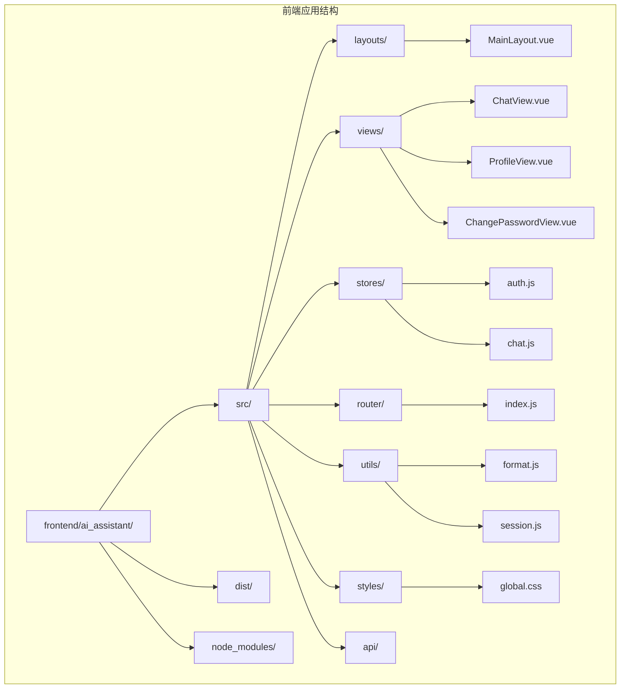
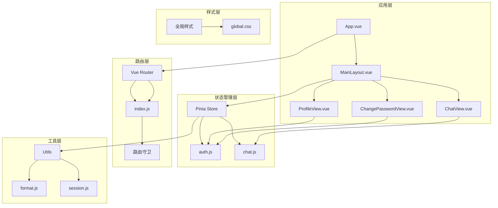
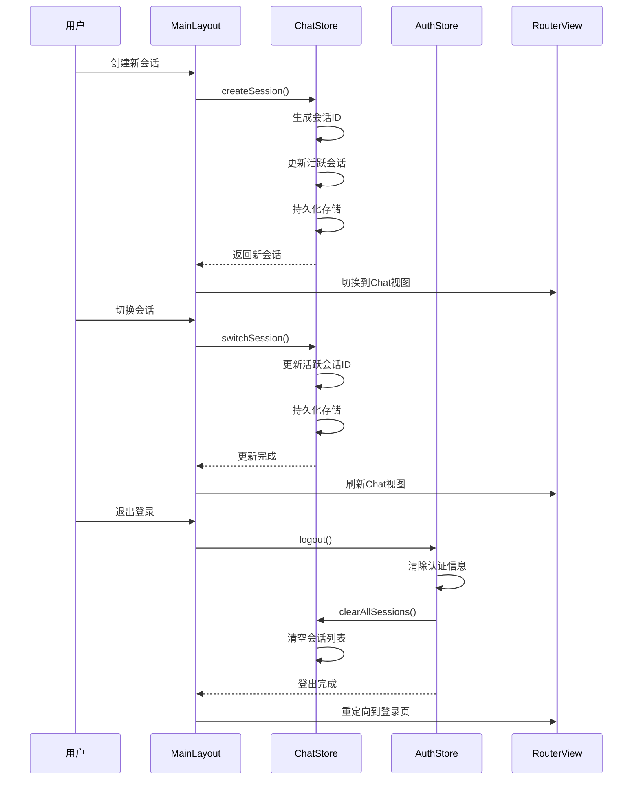
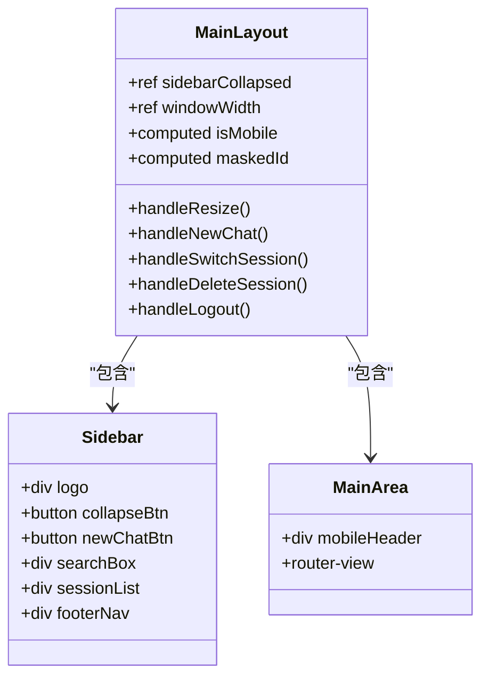
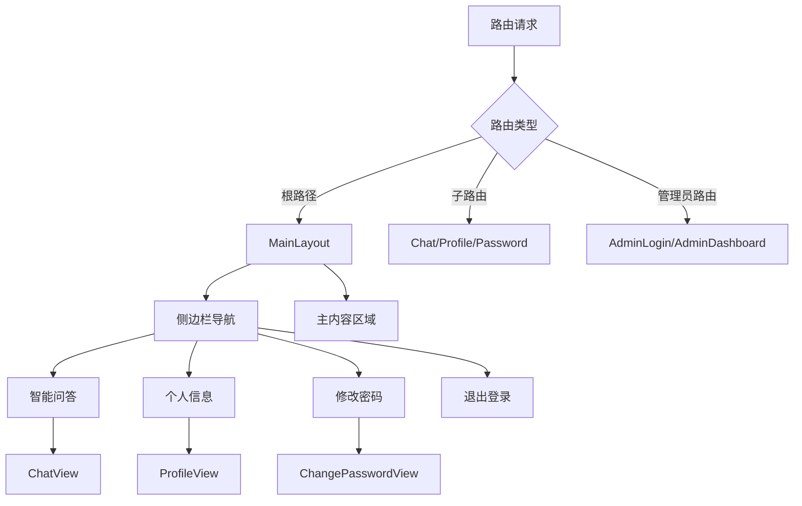
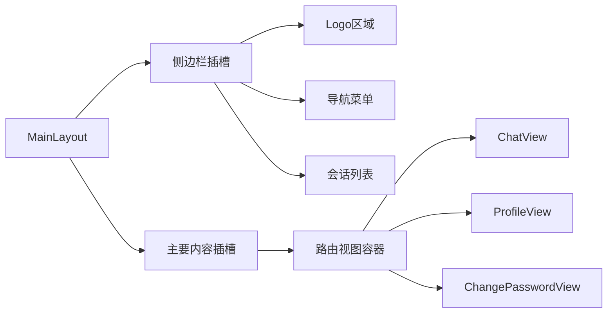
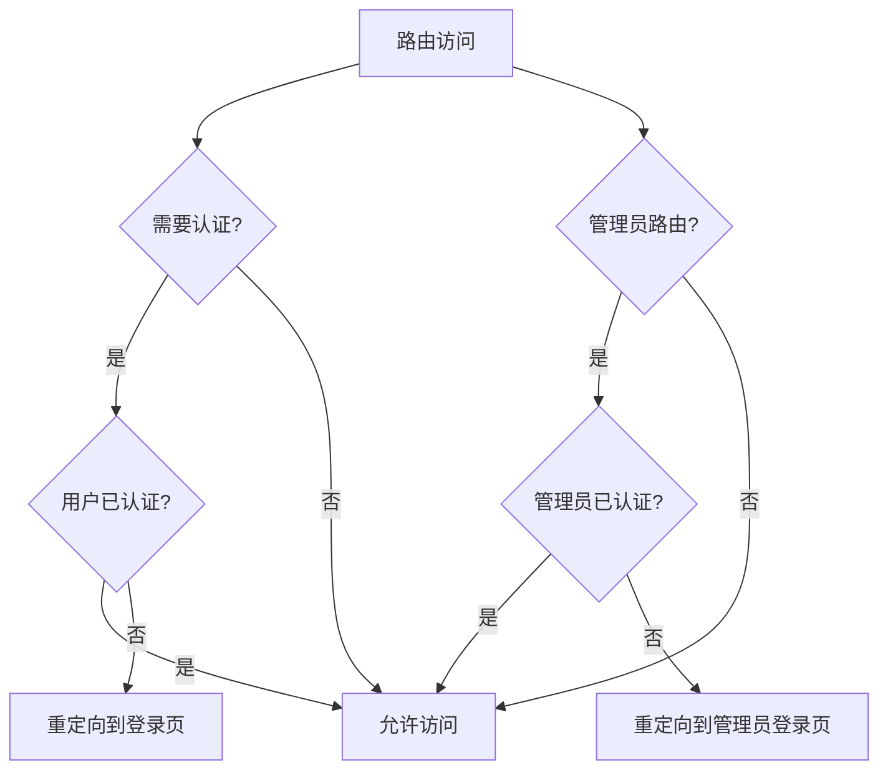
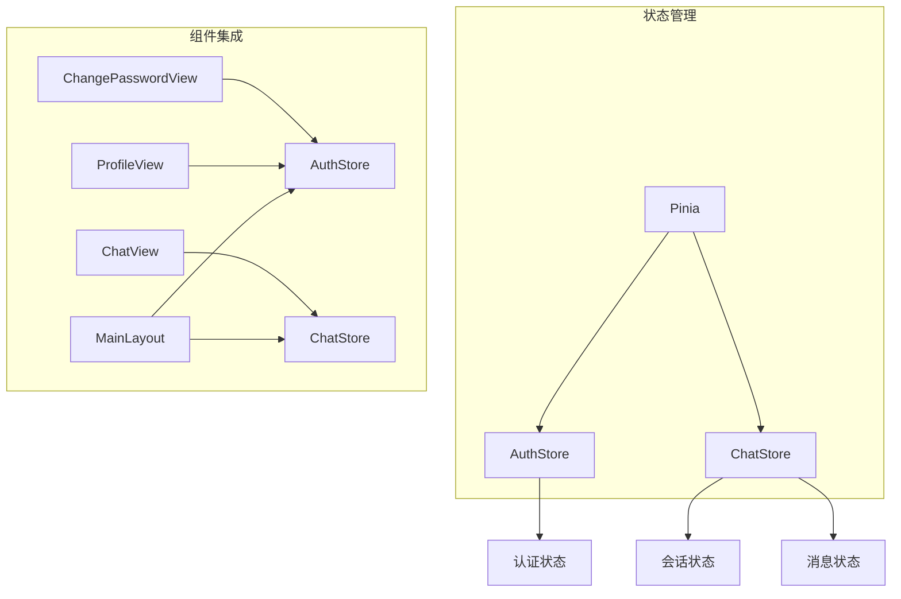
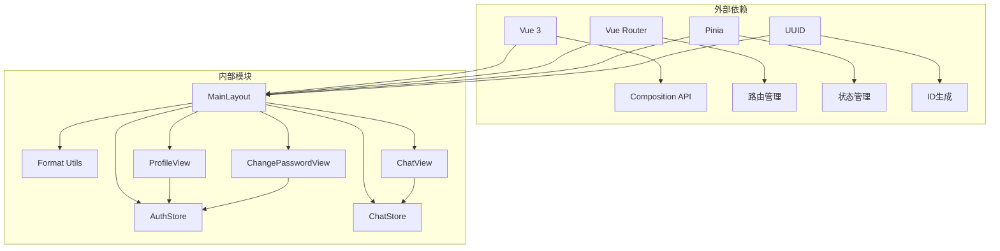

# 布局组件

<cite>
**本文档引用的文件**
- [MainLayout.vue](file://frontend/ai_assistant/src/layouts/MainLayout.vue)
- [index.js](file://frontend/ai_assistant/src/router/index.js)
- [App.vue](file://frontend/ai_assistant/src/App.vue)
- [main.js](file://frontend/ai_assistant/src/main.js)
- [auth.js](file://frontend/ai_assistant/src/stores/auth.js)
- [chat.js](file://frontend/ai_assistant/src/stores/chat.js)
- [global.css](file://frontend/ai_assistant/src/styles/global.css)
- [ChatView.vue](file://frontend/ai_assistant/src/views/ChatView.vue)
- [ProfileView.vue](file://frontend/ai_assistant/src/views/ProfileView.vue)
- [ChangePasswordView.vue](file://frontend/ai_assistant/src/views/ChangePasswordView.vue)
- [format.js](file://frontend/ai_assistant/src/utils/format.js)
- [session.js](file://frontend/ai_assistant/src/utils/session.js)
</cite>

## 目录
1. [简介](#简介)
2. [项目结构](#项目结构)
3. [核心组件](#核心组件)
4. [架构概览](#架构概览)
5. [详细组件分析](#详细组件分析)
6. [依赖关系分析](#依赖关系分析)
7. [性能考虑](#性能考虑)
8. [故障排除指南](#故障排除指南)
9. [结论](#结论)

## 简介

AI校园助手项目的布局组件是一个基于Vue 3和Pinia的状态管理构建的响应式主布局系统。该组件提供了完整的校园智能问答应用的骨架结构，包括侧边栏导航、主要内容区域和移动端适配功能。布局组件采用现代化的设计理念，集成了会话管理、用户认证和实时消息处理等功能。

## 项目结构

AI校园助手项目采用典型的Vue 3单页应用架构，主要目录结构如下：

**图表来源**
- [MainLayout.vue:1-487](file://frontend/ai_assistant/src/layouts/MainLayout.vue#L1-L487)
- [index.js:1-75](file://frontend/ai_assistant/src/router/index.js#L1-L75)

**章节来源**
- [MainLayout.vue:1-487](file://frontend/ai_assistant/src/layouts/MainLayout.vue#L1-L487)
- [index.js:1-75](file://frontend/ai_assistant/src/router/index.js#L1-L75)

## 核心组件

### MainLayout主布局组件

MainLayout是整个应用的核心布局组件，采用了模块化的架构设计，包含以下主要功能模块：

#### 响应式布局系统
- **桌面端布局**：固定宽度侧边栏（280px），主要内容区域自适应填充剩余空间
- **移动端适配**：当屏幕宽度小于768px时，侧边栏变为可滑动的抽屉式布局
- **断点管理**：使用CSS媒体查询实现精确的响应式行为控制

#### 导航菜单组织结构
- **顶部Logo区域**：显示应用标识和折叠控制按钮
- **新建对话功能**：提供快速创建新会话的入口
- **搜索功能**：支持按会话标题和消息内容搜索
- **会话列表**：动态显示用户的历史对话记录
- **底部导航**：包含智能问答、个人信息、修改密码和退出登录功能

#### 页面容器管理机制
- **路由视图容器**：通过`<router-view>`实现动态页面切换
- **移动端遮罩层**：防止背景滚动和提供安全关闭机制
- **顶栏导航**：移动端专用的顶部导航栏

**章节来源**
- [MainLayout.vue:1-487](file://frontend/ai_assistant/src/layouts/MainLayout.vue#L1-L487)

## 架构概览

### 整体架构设计

**图表来源**
- [App.vue:1-7](file://frontend/ai_assistant/src/App.vue#L1-L7)
- [MainLayout.vue:1-487](file://frontend/ai_assistant/src/layouts/MainLayout.vue#L1-L487)
- [index.js:1-75](file://frontend/ai_assistant/src/router/index.js#L1-L75)
- [auth.js:1-77](file://frontend/ai_assistant/src/stores/auth.js#L1-L77)
- [chat.js:1-278](file://frontend/ai_assistant/src/stores/chat.js#L1-L278)

### 数据流架构

**图表来源**
- [MainLayout.vue:146-174](file://frontend/ai_assistant/src/layouts/MainLayout.vue#L146-L174)
- [chat.js:66-116](file://frontend/ai_assistant/src/stores/chat.js#L66-L116)
- [auth.js:59-66](file://frontend/ai_assistant/src/stores/auth.js#L59-L66)

**章节来源**
- [main.js:1-10](file://frontend/ai_assistant/src/main.js#L1-L10)
- [index.js:57-73](file://frontend/ai_assistant/src/router/index.js#L57-L73)

## 详细组件分析

### MainLayout组件深度分析

#### 组件结构设计

MainLayout采用了清晰的三段式布局设计：

**图表来源**
- [MainLayout.vue:1-175](file://frontend/ai_assistant/src/layouts/MainLayout.vue#L1-L175)

#### 响应式设计实现

##### 断点管理系统
- **桌面端断点**：≥768px，侧边栏固定显示
- **移动端断点**：<768px，侧边栏变为抽屉式布局
- **自动适配**：窗口大小变化时自动调整布局模式

##### 移动端交互优化
- **滑动手势**：支持从左侧边缘滑出侧边栏
- **遮罩层**：提供半透明遮罩防止背景交互
- **顶栏导航**：移动端专用的顶部导航栏

#### 导航系统集成

##### 动态路由集成
MainLayout通过Vue Router实现了完整的路由集成：

**图表来源**
- [index.js:5-50](file://frontend/ai_assistant/src/router/index.js#L5-L50)

##### 导航高亮机制
- **路由状态监听**：通过`$route.name`实现导航项高亮
- **动态类绑定**：根据当前路由动态切换CSS类名
- **视觉反馈**：提供即时的视觉状态变化

#### 插槽系统设计

虽然MainLayout没有显式的插槽定义，但其结构天然支持内容插槽：

**图表来源**
- [MainLayout.vue:1-115](file://frontend/ai_assistant/src/layouts/MainLayout.vue#L1-L115)

#### 会话管理系统

##### 会话存储机制
- **本地存储**：使用localStorage持久化会话数据
- **会话ID生成**：基于UUID的唯一标识符生成
- **活跃会话跟踪**：维护当前激活的会话状态

##### 会话操作功能
- **创建会话**：自动生成新会话并设置为活跃状态
- **切换会话**：在多个会话间快速切换
- **删除会话**：支持单个或批量删除会话
- **搜索过滤**：按标题和内容搜索历史会话

**章节来源**
- [MainLayout.vue:118-175](file://frontend/ai_assistant/src/layouts/MainLayout.vue#L118-L175)
- [chat.js:66-116](file://frontend/ai_assistant/src/stores/chat.js#L66-L116)
- [session.js:17-70](file://frontend/ai_assistant/src/utils/session.js#L17-L70)

### 路由系统集成

#### 权限控制系统

**图表来源**
- [index.js:58-73](file://frontend/ai_assistant/src/router/index.js#L58-L73)

#### 页面切换动画

应用使用了全局的路由过渡效果：

- **淡入淡出**：路由切换时的平滑过渡
- **滑动动画**：提供方向性的页面切换体验
- **性能优化**：使用CSS硬件加速确保流畅度

**章节来源**
- [index.js:57-73](file://frontend/ai_assistant/src/router/index.js#L57-L73)
- [global.css:92-113](file://frontend/ai_assistant/src/styles/global.css#L92-L113)

### 状态管理集成

#### Pinia Store集成

MainLayout与Pinia状态管理的深度集成体现在：

**图表来源**
- [auth.js:17-77](file://frontend/ai_assistant/src/stores/auth.js#L17-L77)
- [chat.js:22-278](file://frontend/ai_assistant/src/stores/chat.js#L22-L278)

#### 实时状态同步

- **响应式更新**：状态变化自动触发UI更新
- **跨组件通信**：通过store实现组件间数据共享
- **持久化机制**：关键状态自动保存到localStorage

**章节来源**
- [auth.js:17-77](file://frontend/ai_assistant/src/stores/auth.js#L17-L77)
- [chat.js:22-278](file://frontend/ai_assistant/src/stores/chat.js#L22-L278)

## 依赖关系分析

### 组件依赖图

**图表来源**
- [main.js:1-10](file://frontend/ai_assistant/src/main.js#L1-L10)
- [session.js](file://frontend/ai_assistant/src/utils/session.js#L8)

### 外部依赖管理

#### Vue生态系统集成
- **Vue 3 Composition API**：提供响应式状态和生命周期管理
- **Vue Router**：实现客户端路由和导航
- **Pinia**：现代状态管理解决方案

#### 第三方库使用
- **UUID**：生成唯一标识符
- **marked**：Markdown渲染支持
- **CryptoJS**：密码加密功能

**章节来源**
- [main.js:1-10](file://frontend/ai_assistant/src/main.js#L1-L10)
- [session.js:8](file://frontend/ai_assistant/src/utils/session.js#L8)

## 性能考虑

### 响应式性能优化

#### 内存管理
- **事件监听器清理**：组件卸载时自动移除窗口大小监听
- **状态清理**：登出时清理所有本地存储的数据
- **DOM优化**：使用CSS transform替代position变更

#### 渲染性能
- **虚拟滚动**：会话列表使用TransitionGroup优化渲染
- **懒加载**：路由组件按需加载
- **防抖处理**：窗口大小变化事件的防抖处理

### 网络性能优化

#### API调用优化
- **请求去重**：避免重复的API调用
- **错误缓存**：合理处理网络错误和超时
- **流式响应**：支持AI服务的流式响应处理

**章节来源**
- [MainLayout.vue:136-144](file://frontend/ai_assistant/src/layouts/MainLayout.vue#L136-L144)
- [chat.js:189-230](file://frontend/ai_assistant/src/stores/chat.js#L189-L230)

## 故障排除指南

### 常见问题诊断

#### 布局显示问题
- **侧边栏不显示**：检查CSS变量和媒体查询
- **移动端滑动失效**：验证触摸事件处理
- **导航高亮异常**：确认路由名称匹配

#### 状态管理问题
- **会话数据丢失**：检查localStorage权限和容量
- **认证状态不同步**：验证store实例化和依赖注入
- **消息更新延迟**：检查响应式数据绑定

#### 性能问题
- **渲染卡顿**：优化大型列表的虚拟化
- **内存泄漏**：确保事件监听器正确清理
- **网络超时**：实现合理的重试机制

### 调试技巧

#### 开发工具使用
- **Vue DevTools**：监控组件状态和生命周期
- **浏览器开发者工具**：分析CSS和JavaScript性能
- **网络面板**：监控API调用和响应时间

#### 日志记录
- **状态变更日志**：记录重要的状态变化
- **错误捕获**：统一处理和记录异常
- **性能指标**：监控关键性能指标

**章节来源**
- [MainLayout.vue:136-144](file://frontend/ai_assistant/src/layouts/MainLayout.vue#L136-L144)
- [chat.js:235-257](file://frontend/ai_assistant/src/stores/chat.js#L235-L257)

## 结论

AI校园助手项目的布局组件展现了现代前端开发的最佳实践。通过精心设计的响应式架构、完善的权限控制和高效的性能优化，该组件为整个应用提供了稳定可靠的基础框架。

### 主要优势

1. **响应式设计**：完美适配各种设备和屏幕尺寸
2. **状态管理**：通过Pinia实现清晰的状态分离和管理
3. **路由集成**：与Vue Router无缝集成，提供流畅的导航体验
4. **性能优化**：采用多种技术手段确保应用的高性能表现
5. **可扩展性**：模块化的架构设计便于功能扩展和维护

### 技术亮点

- **现代化的Vue 3 Composition API**：提供更好的代码组织和复用
- **TypeScript支持**：增强代码的类型安全性和开发体验
- **CSS变量系统**：实现灵活的主题定制和样式管理
- **移动端优先**：从设计之初就考虑移动设备的使用体验

该布局组件不仅满足了当前的功能需求，更为未来的功能扩展和技术演进奠定了坚实的基础。通过持续的优化和完善，它将继续为AI校园助手项目提供强大的技术支持。