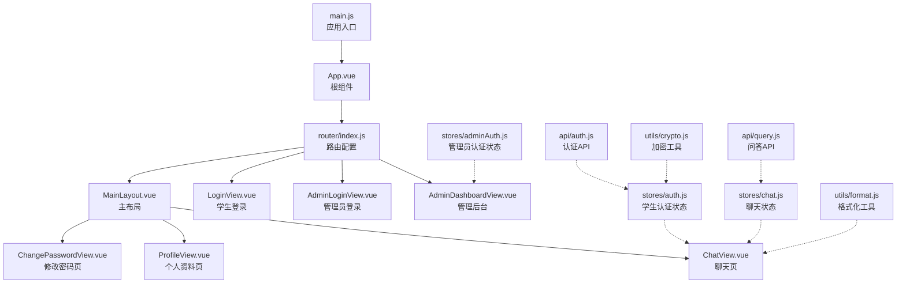
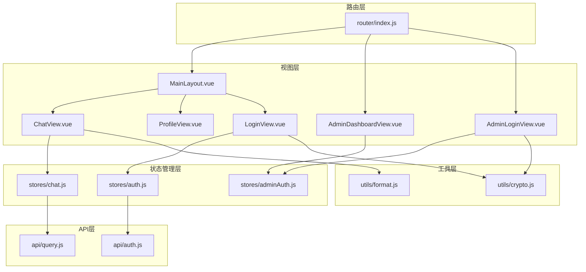
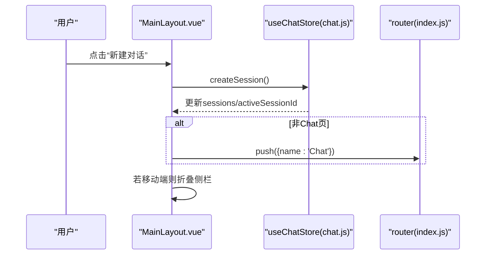
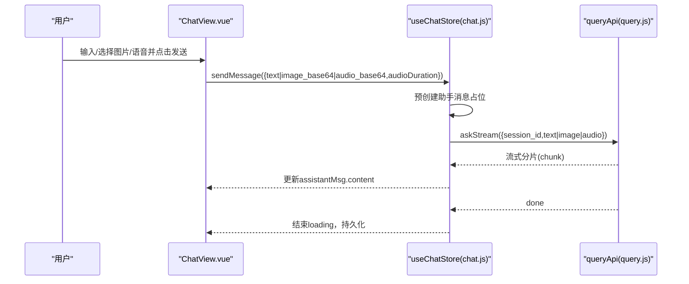
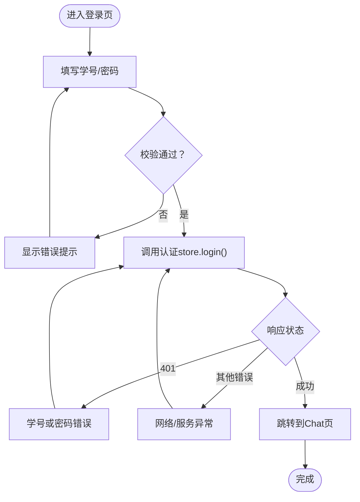
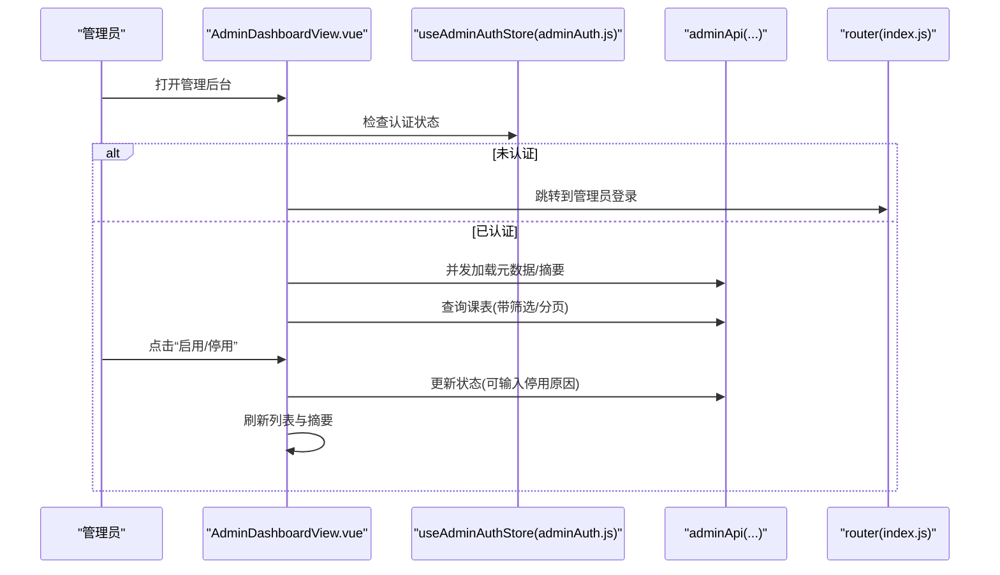
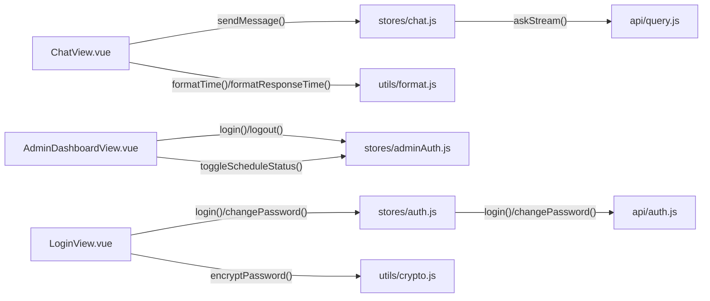

# 组件设计

<cite>
**本文引用的文件**
- [App.vue](file://frontend/ai_assistant/src/App.vue)
- [main.js](file://frontend/ai_assistant/src/main.js)
- [MainLayout.vue](file://frontend/ai_assistant/src/layouts/MainLayout.vue)
- [ChatView.vue](file://frontend/ai_assistant/src/views/ChatView.vue)
- [LoginView.vue](file://frontend/ai_assistant/src/views/LoginView.vue)
- [AdminDashboardView.vue](file://frontend/ai_assistant/src/views/AdminDashboardView.vue)
- [AdminLoginView.vue](file://frontend/ai_assistant/src/views/AdminLoginView.vue)
- [ProfileView.vue](file://frontend/ai_assistant/src/views/ProfileView.vue)
- [index.js](file://frontend/ai_assistant/src/router/index.js)
- [auth.js](file://frontend/ai_assistant/src/stores/auth.js)
- [adminAuth.js](file://frontend/ai_assistant/src/stores/adminAuth.js)
- [chat.js](file://frontend/ai_assistant/src/stores/chat.js)
- [auth.js](file://frontend/ai_assistant/src/api/auth.js)
- [query.js](file://frontend/ai_assistant/src/api/query.js)
- [format.js](file://frontend/ai_assistant/src/utils/format.js)
- [crypto.js](file://frontend/ai_assistant/src/utils/crypto.js)
</cite>

## 目录
1. [引言](#引言)
2. [项目结构](#项目结构)
3. [核心组件](#核心组件)
4. [架构总览](#架构总览)
5. [详细组件分析](#详细组件分析)
6. [依赖关系分析](#依赖关系分析)
7. [性能考量](#性能考量)
8. [故障排查指南](#故障排查指南)
9. [结论](#结论)
10. [附录](#附录)

## 引言
本文件面向AI校园助手项目的前端Vue组件体系，系统梳理单文件组件（SFC）的结构、通信与生命周期管理，重点覆盖以下方面：
- 页面组件：ChatView聊天界面、LoginView登录界面、AdminDashboardView管理界面的设计要点与实现细节
- 布局组件：MainLayout主布局的结构、路由嵌套与响应式交互
- 组件通信：props传递、事件发射、provide/inject模式的使用现状与建议
- 复用性与可扩展性：组件抽象、组合式API与插槽的运用
- 最佳实践：命名规范、状态管理策略、性能优化技巧
- 具体实现示例与设计模式应用：通过源码路径定位关键实现，避免直接粘贴代码

## 项目结构
前端采用Vite + Vue 3 + Pinia + Vue Router的现代技术栈，目录组织遵循“按功能域”划分：
- 布局：layouts/MainLayout.vue
- 视图：views 下各页面组件
- 路由：router/index.js
- 状态：stores 下的认证与聊天状态
- API：api 下的接口封装
- 工具：utils 下的加密、格式化等工具
- 入口：main.js、App.vue

图表来源
- [main.js:1-10](file://frontend/ai_assistant/src/main.js#L1-L10)
- [App.vue:1-7](file://frontend/ai_assistant/src/App.vue#L1-L7)
- [index.js:1-75](file://frontend/ai_assistant/src/router/index.js#L1-L75)
- [MainLayout.vue:1-116](file://frontend/ai_assistant/src/layouts/MainLayout.vue#L1-L116)
- [ChatView.vue:1-220](file://frontend/ai_assistant/src/views/ChatView.vue#L1-L220)
- [LoginView.vue:1-122](file://frontend/ai_assistant/src/views/LoginView.vue#L1-L122)
- [AdminDashboardView.vue:1-176](file://frontend/ai_assistant/src/views/AdminDashboardView.vue#L1-L176)
- [AdminLoginView.vue:1-106](file://frontend/ai_assistant/src/views/AdminLoginView.vue#L1-L106)
- [ProfileView.vue:1-96](file://frontend/ai_assistant/src/views/ProfileView.vue#L1-L96)
- [auth.js:1-77](file://frontend/ai_assistant/src/stores/auth.js#L1-L77)
- [adminAuth.js:1-77](file://frontend/ai_assistant/src/stores/adminAuth.js#L1-L77)
- [chat.js:1-278](file://frontend/ai_assistant/src/stores/chat.js#L1-L278)
- [auth.js:1-36](file://frontend/ai_assistant/src/api/auth.js#L1-L36)
- [query.js:1-141](file://frontend/ai_assistant/src/api/query.js#L1-L141)
- [format.js:1-67](file://frontend/ai_assistant/src/utils/format.js#L1-L67)
- [crypto.js:1-40](file://frontend/ai_assistant/src/utils/crypto.js#L1-L40)

章节来源
- [main.js:1-10](file://frontend/ai_assistant/src/main.js#L1-L10)
- [App.vue:1-7](file://frontend/ai_assistant/src/App.vue#L1-L7)
- [index.js:1-75](file://frontend/ai_assistant/src/router/index.js#L1-L75)

## 核心组件
本节聚焦关键组件的职责、状态与行为。

- 根组件 App.vue
  - 作用：承载路由视图，作为应用的挂载容器
  - 关键点：模板仅包含router-view，脚本注释说明其职责

- 主布局 MainLayout.vue
  - 作用：统一的侧边栏、移动端遮罩、主内容区与底部导航；集成聊天会话列表、搜索、新建/切换/删除会话、登出等
  - 关键点：响应式宽度监听、移动端侧栏折叠、与Pinia聊天状态联动、与路由联动跳转

- 聊天页 ChatView.vue
  - 作用：多模态问答界面，支持文本、图片、语音输入；消息渲染、意图标签、缓存/耗时元信息展示；滚动到底部、自动高度适配
  - 关键点：Markdown渲染、媒体录制与播放、流式响应处理、消息删除、图片压缩上传

- 登录页 LoginView.vue
  - 作用：学生登录表单，密码可见性切换，错误提示，跳转管理员入口
  - 关键点：Pinia认证状态、表单校验、错误分类提示

- 管理后台 AdminDashboardView.vue
  - 作用：管理员课表管理与统计面板，筛选器、分页、状态切换、汇总指标
  - 关键点：并发加载元数据与摘要、分页计算、状态切换确认与原因输入

- 管理员登录 AdminLoginView.vue
  - 作用：管理员登录表单与返回入口
  - 关键点：Pinia管理员认证状态、错误分类提示

- 个人资料 ProfileView.vue
  - 作用：展示学生信息、令牌有效期、设备ID、会话与消息统计，系统健康检查与版本查询
  - 关键点：格式化工具、系统信息刷新、清除会话数据

章节来源
- [App.vue:1-7](file://frontend/ai_assistant/src/App.vue#L1-L7)
- [MainLayout.vue:1-175](file://frontend/ai_assistant/src/layouts/MainLayout.vue#L1-L175)
- [ChatView.vue:1-534](file://frontend/ai_assistant/src/views/ChatView.vue#L1-L534)
- [LoginView.vue:1-122](file://frontend/ai_assistant/src/views/LoginView.vue#L1-L122)
- [AdminDashboardView.vue:1-361](file://frontend/ai_assistant/src/views/AdminDashboardView.vue#L1-L361)
- [AdminLoginView.vue:1-106](file://frontend/ai_assistant/src/views/AdminLoginView.vue#L1-L106)
- [ProfileView.vue:1-179](file://frontend/ai_assistant/src/views/ProfileView.vue#L1-L179)

## 架构总览
整体采用“布局-页面-状态-API-工具”的分层架构，路由负责页面级导航，Pinia负责跨组件状态共享，API模块封装后端交互，工具模块提供通用能力。

图表来源
- [index.js:1-75](file://frontend/ai_assistant/src/router/index.js#L1-L75)
- [MainLayout.vue:1-116](file://frontend/ai_assistant/src/layouts/MainLayout.vue#L1-L116)
- [ChatView.vue:1-220](file://frontend/ai_assistant/src/views/ChatView.vue#L1-L220)
- [LoginView.vue:1-122](file://frontend/ai_assistant/src/views/LoginView.vue#L1-L122)
- [AdminDashboardView.vue:1-176](file://frontend/ai_assistant/src/views/AdminDashboardView.vue#L1-L176)
- [AdminLoginView.vue:1-106](file://frontend/ai_assistant/src/views/AdminLoginView.vue#L1-L106)
- [ProfileView.vue:1-96](file://frontend/ai_assistant/src/views/ProfileView.vue#L1-L96)
- [auth.js:1-77](file://frontend/ai_assistant/src/stores/auth.js#L1-L77)
- [adminAuth.js:1-77](file://frontend/ai_assistant/src/stores/adminAuth.js#L1-L77)
- [chat.js:1-278](file://frontend/ai_assistant/src/stores/chat.js#L1-L278)
- [auth.js:1-36](file://frontend/ai_assistant/src/api/auth.js#L1-L36)
- [query.js:1-141](file://frontend/ai_assistant/src/api/query.js#L1-L141)
- [format.js:1-67](file://frontend/ai_assistant/src/utils/format.js#L1-L67)
- [crypto.js:1-40](file://frontend/ai_assistant/src/utils/crypto.js#L1-L40)

## 详细组件分析

### 布局组件：MainLayout 主布局
- 结构与职责
  - 侧边栏：Logo、折叠按钮、新建对话、搜索、会话列表、底部导航、用户信息
  - 主内容区：移动端顶栏、router-view
  - 移动端遮罩：在侧栏展开时显示，点击收起
- 响应式设计
  - 监听窗口宽度，小于阈值时默认折叠侧栏，并在移动端显示顶栏菜单按钮
- 与状态/路由协作
  - 与Pinia聊天状态联动：新建/切换/删除会话、搜索过滤、活动会话高亮
  - 与Pinia认证状态联动：显示脱敏学号、登出清理会话
  - 与路由联动：导航到对应页面、移动端菜单控制

图表来源
- [MainLayout.vue:146-152](file://frontend/ai_assistant/src/layouts/MainLayout.vue#L146-L152)
- [chat.js:65-80](file://frontend/ai_assistant/src/stores/chat.js#L65-L80)
- [index.js:28-44](file://frontend/ai_assistant/src/router/index.js#L28-L44)

章节来源
- [MainLayout.vue:1-175](file://frontend/ai_assistant/src/layouts/MainLayout.vue#L1-L175)
- [chat.js:1-278](file://frontend/ai_assistant/src/stores/chat.js#L1-L278)
- [index.js:1-75](file://frontend/ai_assistant/src/router/index.js#L1-L75)

### 页面组件：ChatView 聊天界面
- 功能特性
  - 欢迎屏：示例问题与快捷操作
  - 消息列表：用户/助手消息、头像、图片/语音展示、意图标签、缓存/耗时/设备元信息、删除
  - 输入区：文本域自适应高度、图片预览与压缩上传、语音录制与播放、发送按钮禁用逻辑
  - 流式响应：SSE/JSON兼容解析，首包处理、done兜底、错误解析
- 设计模式
  - 组合式API：响应式状态、计算属性、生命周期钩子
  - 状态管理：Pinia聊天store集中管理会话与消息
  - 工具函数：格式化时间/耗时、Markdown渲染
- 性能与体验
  - 自动滚动到底部、过渡动画、图片压缩、语音播放去重

图表来源
- [ChatView.vue:312-333](file://frontend/ai_assistant/src/views/ChatView.vue#L312-L333)
- [chat.js:133-230](file://frontend/ai_assistant/src/stores/chat.js#L133-L230)
- [query.js:28-141](file://frontend/ai_assistant/src/api/query.js#L28-L141)

章节来源
- [ChatView.vue:1-534](file://frontend/ai_assistant/src/views/ChatView.vue#L1-L534)
- [chat.js:1-278](file://frontend/ai_assistant/src/stores/chat.js#L1-L278)
- [query.js:1-141](file://frontend/ai_assistant/src/api/query.js#L1-L141)
- [format.js:1-67](file://frontend/ai_assistant/src/utils/format.js#L1-L67)

### 页面组件：LoginView 登录界面
- 功能特性
  - 表单：学号、密码、可见性切换
  - 提交流程：表单校验、调用认证store、错误分类提示、成功跳转
- 设计模式
  - 组合式API：响应式表单、提交状态、错误信息
  - 状态管理：Pinia认证store封装登录与变更密码
  - 安全：密码加密传输

图表来源
- [LoginView.vue:94-121](file://frontend/ai_assistant/src/views/LoginView.vue#L94-L121)
- [auth.js:28-43](file://frontend/ai_assistant/src/stores/auth.js#L28-L43)
- [auth.js:15-20](file://frontend/ai_assistant/src/api/auth.js#L15-L20)

章节来源
- [LoginView.vue:1-122](file://frontend/ai_assistant/src/views/LoginView.vue#L1-L122)
- [auth.js:1-77](file://frontend/ai_assistant/src/stores/auth.js#L1-L77)
- [auth.js:1-36](file://frontend/ai_assistant/src/api/auth.js#L1-L36)
- [crypto.js:1-40](file://frontend/ai_assistant/src/utils/crypto.js#L1-L40)

### 页面组件：AdminDashboardView 管理界面
- 功能特性
  - 摘要卡片：待处理调课、启用/停用课表、班级/学期总数
  - 筛选器：学期、班级、状态、周次、关键词
  - 数据表格：课表ID、学期、课程、教师、教室、时间、班级、状态、版本、更新时间、操作（启用/停用）
  - 分页：每页数量、上一页/下一页
- 设计模式
  - 组合式API：响应式筛选、分页计算、异步加载
  - 并发加载：元数据与摘要并行
  - 状态管理：Pinia管理员认证store
  - 错误处理：统一错误提示与兜底

图表来源
- [AdminDashboardView.vue:233-272](file://frontend/ai_assistant/src/views/AdminDashboardView.vue#L233-L272)
- [adminAuth.js:16-77](file://frontend/ai_assistant/src/stores/adminAuth.js#L16-L77)
- [index.js:58-73](file://frontend/ai_assistant/src/router/index.js#L58-L73)

章节来源
- [AdminDashboardView.vue:1-361](file://frontend/ai_assistant/src/views/AdminDashboardView.vue#L1-L361)
- [adminAuth.js:1-77](file://frontend/ai_assistant/src/stores/adminAuth.js#L1-L77)
- [index.js:1-75](file://frontend/ai_assistant/src/router/index.js#L1-L75)

### 页面组件：ProfileView 个人资料
- 功能特性
  - 展示学号、账户状态、令牌有效期、设备ID、会话数、消息总数、套餐、认证方式
  - 系统信息：健康检查、版本查询、刷新按钮
  - 操作：修改密码、清除所有对话
- 设计模式
  - 组合式API：计算属性格式化时间与统计、异步刷新
  - 工具函数：格式化时间、设备ID生成

章节来源
- [ProfileView.vue:1-179](file://frontend/ai_assistant/src/views/ProfileView.vue#L1-L179)
- [format.js:1-67](file://frontend/ai_assistant/src/utils/format.js#L1-L67)

### 组件通信机制
- props传递
  - 本项目主要通过Pinia store在组件间共享状态，较少显式props传递
- 事件发射
  - 组件内部通过事件控制UI交互（如侧栏折叠、输入框聚焦），未见跨层级事件发射
- provide/inject
  - 未发现provide/inject使用，当前通过Pinia store实现跨组件状态共享

章节来源
- [MainLayout.vue:118-175](file://frontend/ai_assistant/src/layouts/MainLayout.vue#L118-L175)
- [ChatView.vue:222-534](file://frontend/ai_assistant/src/views/ChatView.vue#L222-L534)

### 组件复用性与可扩展性
- 抽象与组合
  - 将通用UI元素（如按钮、卡片、表格）抽象为可复用的样式类与结构
  - 使用组合式API与工具函数提升可测试性与可维护性
- 插槽使用
  - 本项目未使用具名/作用域插槽，可通过未来扩展引入以增强布局灵活性

章节来源
- [MainLayout.vue:1-175](file://frontend/ai_assistant/src/layouts/MainLayout.vue#L1-L175)
- [AdminDashboardView.vue:1-176](file://frontend/ai_assistant/src/views/AdminDashboardView.vue#L1-L176)

## 依赖关系分析
- 组件耦合
  - ChatView与Pinia chat store强耦合，负责消息与会话的增删改查
  - LoginView与Pinia auth store强耦合，负责登录与密码变更
  - AdminDashboardView与Pinia adminAuth store强耦合，负责管理员认证
- 外部依赖
  - API层封装HTTP请求，兼容SSE与JSON响应
  - 工具层提供加密与格式化能力

图表来源
- [ChatView.vue:312-333](file://frontend/ai_assistant/src/views/ChatView.vue#L312-L333)
- [chat.js:133-230](file://frontend/ai_assistant/src/stores/chat.js#L133-L230)
- [LoginView.vue:94-121](file://frontend/ai_assistant/src/views/LoginView.vue#L94-L121)
- [auth.js:28-56](file://frontend/ai_assistant/src/stores/auth.js#L28-L56)
- [AdminDashboardView.vue:329-351](file://frontend/ai_assistant/src/views/AdminDashboardView.vue#L329-L351)
- [adminAuth.js:28-63](file://frontend/ai_assistant/src/stores/adminAuth.js#L28-L63)
- [query.js:28-141](file://frontend/ai_assistant/src/api/query.js#L28-L141)
- [auth.js:15-35](file://frontend/ai_assistant/src/api/auth.js#L15-L35)
- [format.js:10-35](file://frontend/ai_assistant/src/utils/format.js#L10-L35)
- [crypto.js:26-40](file://frontend/ai_assistant/src/utils/crypto.js#L26-L40)

章节来源
- [chat.js:1-278](file://frontend/ai_assistant/src/stores/chat.js#L1-L278)
- [auth.js:1-77](file://frontend/ai_assistant/src/stores/auth.js#L1-L77)
- [adminAuth.js:1-77](file://frontend/ai_assistant/src/stores/adminAuth.js#L1-L77)
- [query.js:1-141](file://frontend/ai_assistant/src/api/query.js#L1-L141)
- [auth.js:1-36](file://frontend/ai_assistant/src/api/auth.js#L1-L36)
- [format.js:1-67](file://frontend/ai_assistant/src/utils/format.js#L1-L67)
- [crypto.js:1-40](file://frontend/ai_assistant/src/utils/crypto.js#L1-L40)

## 性能考量
- 渲染优化
  - 使用Transition/TransitionGroup实现列表与消息的平滑过渡，减少闪烁
  - 消息列表使用key绑定与条件渲染，避免不必要的重排
- 状态与存储
  - Pinia store集中管理会话与消息，配合localStorage持久化，减少重复请求
- 网络与流式
  - API层兼容SSE与JSON响应，确保在不同网关环境下稳定工作
  - 流式分片增量更新，避免一次性渲染大量内容
- 媒体与资源
  - 图片上传前压缩，降低带宽与后端压力
  - 语音播放去重，避免同时播放多个音频

章节来源
- [MainLayout.vue:40-67](file://frontend/ai_assistant/src/layouts/MainLayout.vue#L40-L67)
- [ChatView.vue:58-141](file://frontend/ai_assistant/src/views/ChatView.vue#L58-L141)
- [ChatView.vue:335-390](file://frontend/ai_assistant/src/views/ChatView.vue#L335-L390)
- [ChatView.vue:397-525](file://frontend/ai_assistant/src/views/ChatView.vue#L397-L525)
- [query.js:28-141](file://frontend/ai_assistant/src/api/query.js#L28-L141)

## 故障排查指南
- 登录失败
  - 现象：401学号/密码错误、403账号不可用、网络异常
  - 排查：检查用户名/密码、网络连通性、后端服务状态
- 语音输入异常
  - 现象：无法访问麦克风、录音时间过短、未检测到声音
  - 排查：浏览器权限设置、设备可用性、录音时长与音量
- 流式响应未结束
  - 现象：前端一直显示“正在思考”
  - 排查：确认后端SSE输出、网关是否正确转发、兜底done处理
- 管理员状态异常
  - 现象：无法访问管理后台或被强制跳转
  - 排查：检查管理员认证状态、token有效期、路由守卫逻辑

章节来源
- [LoginView.vue:94-121](file://frontend/ai_assistant/src/views/LoginView.vue#L94-L121)
- [ChatView.vue:400-481](file://frontend/ai_assistant/src/views/ChatView.vue#L400-L481)
- [query.js:101-135](file://frontend/ai_assistant/src/api/query.js#L101-L135)
- [index.js:58-73](file://frontend/ai_assistant/src/router/index.js#L58-L73)

## 结论
本项目采用现代化的Vue 3架构，通过Pinia实现跨组件状态共享，结合组合式API与工具函数，构建了高内聚、低耦合的组件体系。布局组件承担统一交互与导航职责，页面组件聚焦业务逻辑与用户体验。未来可在插槽与provide/inject方面进一步增强组件抽象与复用性，同时持续优化媒体处理与流式响应的稳定性与性能。

## 附录
- 组件命名规范建议
  - 布局：MainLayout.vue
  - 页面：XxxView.vue
  - 状态：xxx.js（位于stores目录）
  - API：xxx.js（位于api目录）
  - 工具：xxx.js（位于utils目录）
- 状态管理策略
  - 将跨页面共享的状态放入Pinia store，避免props逐层传递
  - 使用计算属性派生数据，减少重复计算
- 性能优化技巧
  - 使用虚拟滚动/分页处理大数据集
  - 图片与媒体资源在前端压缩与懒加载
  - 合理使用keep-alive与缓存策略