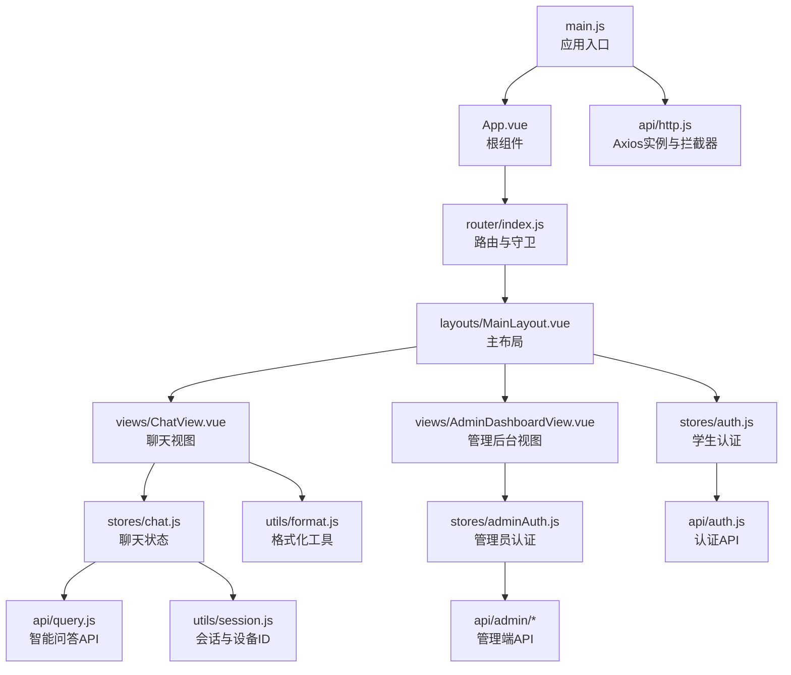
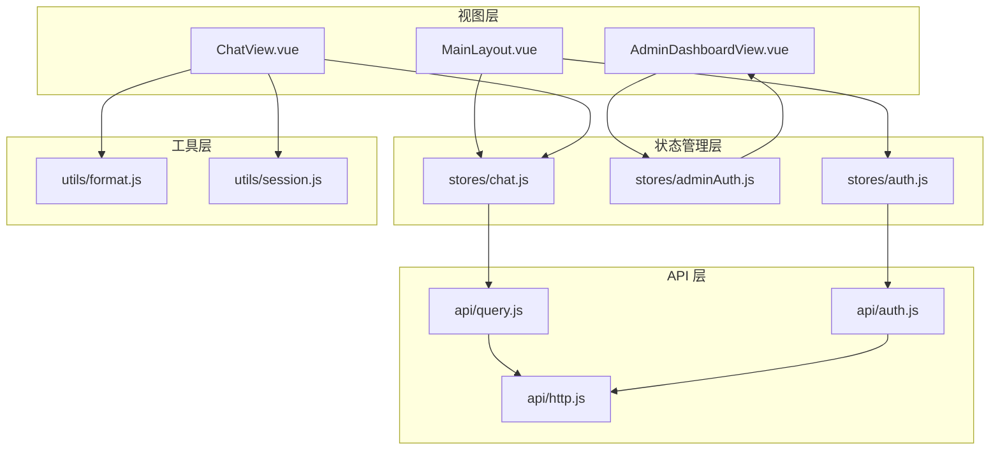
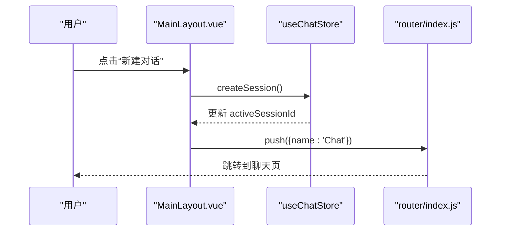
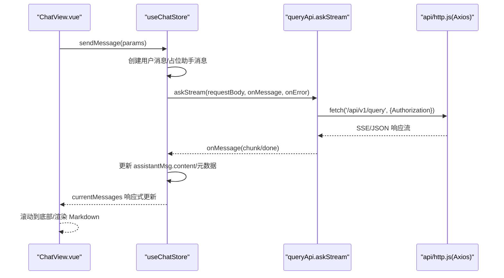
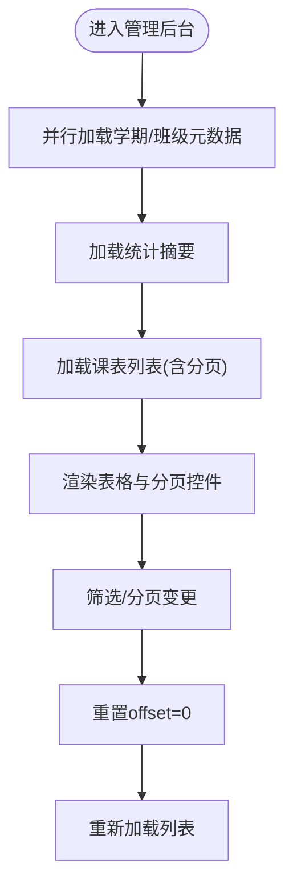
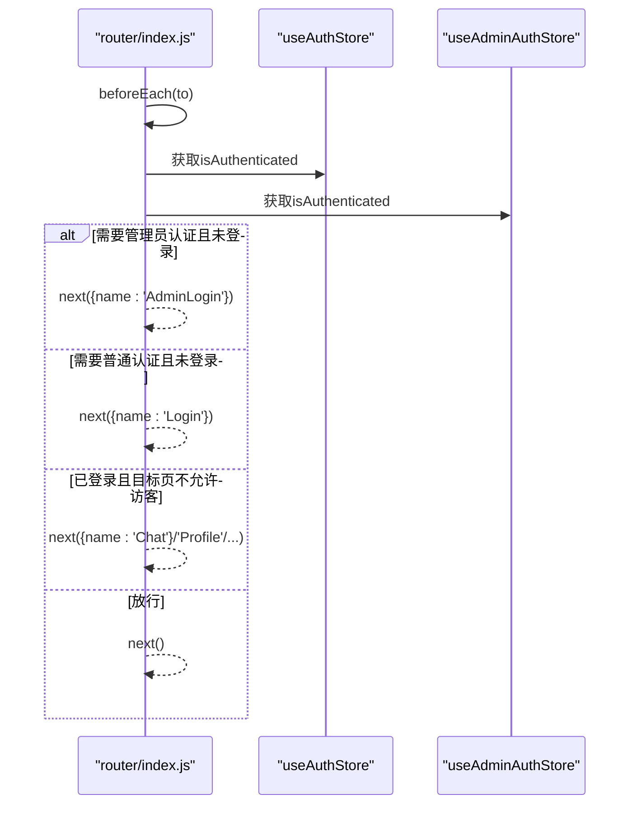
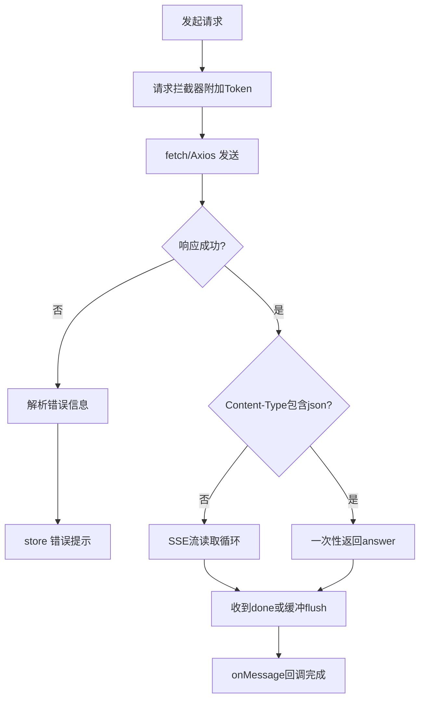
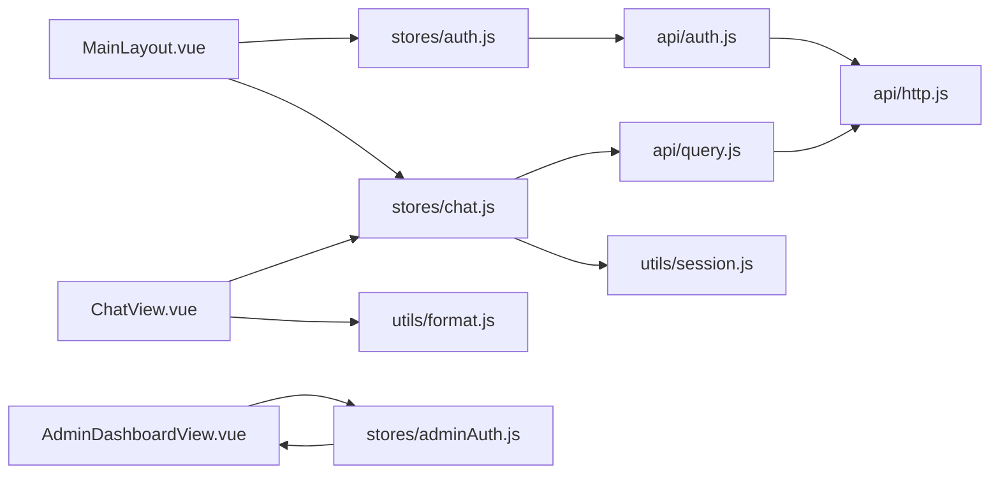

# 组件通信机制

<cite>
**本文引用的文件**
- [main.js](file://frontend/ai_assistant/src/main.js)
- [App.vue](file://frontend/ai_assistant/src/App.vue)
- [router/index.js](file://frontend/ai_assistant/src/router/index.js)
- [layouts/MainLayout.vue](file://frontend/ai_assistant/src/layouts/MainLayout.vue)
- [views/ChatView.vue](file://frontend/ai_assistant/src/views/ChatView.vue)
- [views/AdminDashboardView.vue](file://frontend/ai_assistant/src/views/AdminDashboardView.vue)
- [stores/auth.js](file://frontend/ai_assistant/src/stores/auth.js)
- [stores/adminAuth.js](file://frontend/ai_assistant/src/stores/adminAuth.js)
- [stores/chat.js](file://frontend/ai_assistant/src/stores/chat.js)
- [api/auth.js](file://frontend/ai_assistant/src/api/auth.js)
- [api/query.js](file://frontend/ai_assistant/src/api/query.js)
- [api/http.js](file://frontend/ai_assistant/src/api/http.js)
- [utils/format.js](file://frontend/ai_assistant/src/utils/format.js)
- [utils/session.js](file://frontend/ai_assistant/src/utils/session.js)
</cite>

## 目录
1. [引言](#引言)
2. [项目结构](#项目结构)
3. [核心组件](#核心组件)
4. [架构总览](#架构总览)
5. [详细组件分析](#详细组件分析)
6. [依赖关系分析](#依赖关系分析)
7. [性能考量](#性能考量)
8. [故障排查指南](#故障排查指南)
9. [结论](#结论)
10. [附录](#附录)

## 引言
本文件系统性梳理 AI 校园助手前端的组件通信机制，覆盖以下主题：
- Vue 组件间通信模式：父子、兄弟与跨层级通信策略
- Pinia 状态管理：store 定义、状态订阅与动作调用
- API 客户端与组件集成：HTTP 请求封装、错误处理与响应处理
- 数据流向与状态同步：单向数据流与响应式更新
- 事件总线与发布订阅：全局事件与局部事件处理
- 最佳实践：性能优化、内存泄漏预防与调试技巧
- 架构设计指导与具体实现示例路径

## 项目结构
前端采用 Vite + Vue 3 + Pinia + Vue Router 架构，核心目录与职责如下：
- src/main.js：应用入口，注册 Pinia 与路由
- src/App.vue：根组件，承载路由视图
- src/router/index.js：路由配置与导航守卫
- src/layouts/MainLayout.vue：主布局，承载侧边栏与主内容区
- src/views/*.vue：页面级视图组件
- src/stores/*：Pinia 状态管理模块
- src/api/*：API 客户端封装与拦截器
- src/utils/*：通用工具函数

图表来源
- [main.js:1-10](file://frontend/ai_assistant/src/main.js#L1-L10)
- [App.vue:1-7](file://frontend/ai_assistant/src/App.vue#L1-L7)
- [router/index.js:1-75](file://frontend/ai_assistant/src/router/index.js#L1-L75)
- [layouts/MainLayout.vue:1-487](file://frontend/ai_assistant/src/layouts/MainLayout.vue#L1-L487)
- [views/ChatView.vue:1-800](file://frontend/ai_assistant/src/views/ChatView.vue#L1-L800)
- [views/AdminDashboardView.vue:1-688](file://frontend/ai_assistant/src/views/AdminDashboardView.vue#L1-L688)
- [stores/chat.js:1-278](file://frontend/ai_assistant/src/stores/chat.js#L1-L278)
- [stores/auth.js:1-77](file://frontend/ai_assistant/src/stores/auth.js#L1-L77)
- [stores/adminAuth.js:1-77](file://frontend/ai_assistant/src/stores/adminAuth.js#L1-L77)
- [api/query.js:1-141](file://frontend/ai_assistant/src/api/query.js#L1-L141)
- [api/auth.js:1-36](file://frontend/ai_assistant/src/api/auth.js#L1-L36)
- [api/http.js:1-49](file://frontend/ai_assistant/src/api/http.js#L1-L49)
- [utils/session.js:1-70](file://frontend/ai_assistant/src/utils/session.js#L1-L70)
- [utils/format.js:1-67](file://frontend/ai_assistant/src/utils/format.js#L1-L67)

章节来源
- [main.js:1-10](file://frontend/ai_assistant/src/main.js#L1-L10)
- [router/index.js:1-75](file://frontend/ai_assistant/src/router/index.js#L1-L75)

## 核心组件
- 根组件与应用启动：在入口中创建应用实例，安装 Pinia 与路由，挂载到 DOM
- 路由与导航守卫：根据认证状态与页面元信息进行重定向与权限控制
- 主布局：承载侧边栏、会话列表、搜索与底部导航；负责与聊天 store 协作
- 聊天视图：输入区、消息列表、多媒体输入（图片/语音）、Markdown 渲染与滚动控制
- 管理后台视图：筛选、分页、状态切换与统计面板
- 认证与聊天 store：统一管理登录态、会话与消息状态
- API 客户端：封装 HTTP 请求、流式响应与拦截器

章节来源
- [App.vue:1-7](file://frontend/ai_assistant/src/App.vue#L1-L7)
- [router/index.js:57-73](file://frontend/ai_assistant/src/router/index.js#L57-L73)
- [layouts/MainLayout.vue:118-175](file://frontend/ai_assistant/src/layouts/MainLayout.vue#L118-L175)
- [views/ChatView.vue:222-534](file://frontend/ai_assistant/src/views/ChatView.vue#L222-L534)
- [views/AdminDashboardView.vue:178-361](file://frontend/ai_assistant/src/views/AdminDashboardView.vue#L178-L361)
- [stores/auth.js:17-77](file://frontend/ai_assistant/src/stores/auth.js#L17-L77)
- [stores/adminAuth.js:16-77](file://frontend/ai_assistant/src/stores/adminAuth.js#L16-L77)
- [stores/chat.js:22-278](file://frontend/ai_assistant/src/stores/chat.js#L22-L278)
- [api/http.js:10-49](file://frontend/ai_assistant/src/api/http.js#L10-L49)

## 架构总览
整体采用“布局组件承载 + 页面组件渲染 + Pinia 状态驱动 + API 客户端封装”的分层架构。数据从 API 流入 store，再由 store 通过响应式绑定到视图组件。

图表来源
- [layouts/MainLayout.vue:118-175](file://frontend/ai_assistant/src/layouts/MainLayout.vue#L118-L175)
- [views/ChatView.vue:222-534](file://frontend/ai_assistant/src/views/ChatView.vue#L222-L534)
- [views/AdminDashboardView.vue:178-361](file://frontend/ai_assistant/src/views/AdminDashboardView.vue#L178-L361)
- [stores/auth.js:17-77](file://frontend/ai_assistant/src/stores/auth.js#L17-L77)
- [stores/adminAuth.js:16-77](file://frontend/ai_assistant/src/stores/adminAuth.js#L16-L77)
- [stores/chat.js:22-278](file://frontend/ai_assistant/src/stores/chat.js#L22-L278)
- [api/auth.js:8-36](file://frontend/ai_assistant/src/api/auth.js#L8-L36)
- [api/query.js:7-141](file://frontend/ai_assistant/src/api/query.js#L7-L141)
- [api/http.js:10-49](file://frontend/ai_assistant/src/api/http.js#L10-L49)
- [utils/format.js:1-67](file://frontend/ai_assistant/src/utils/format.js#L1-L67)
- [utils/session.js:1-70](file://frontend/ai_assistant/src/utils/session.js#L1-L70)

## 详细组件分析

### 布局组件与侧边栏通信（父子与跨层级）
- 父子通信：MainLayout 作为布局父组件，直接持有并操作 chatStore 与 authStore，通过 v-model 与事件处理实现与子元素的交互
- 跨层级通信：通过 Pinia store 提供全局状态，布局组件与聊天视图无需直接互相传参，而是各自订阅 store 状态，实现解耦
- 事件处理：侧边栏的“新建对话”“切换会话”“删除会话”“退出登录”等均通过 store 动作与路由跳转完成

图表来源
- [layouts/MainLayout.vue:146-151](file://frontend/ai_assistant/src/layouts/MainLayout.vue#L146-L151)
- [stores/chat.js:66-80](file://frontend/ai_assistant/src/stores/chat.js#L66-L80)
- [router/index.js:57-73](file://frontend/ai_assistant/src/router/index.js#L57-L73)

章节来源
- [layouts/MainLayout.vue:118-175](file://frontend/ai_assistant/src/layouts/MainLayout.vue#L118-L175)
- [stores/chat.js:22-116](file://frontend/ai_assistant/src/stores/chat.js#L22-L116)
- [router/index.js:57-73](file://frontend/ai_assistant/src/router/index.js#L57-L73)

### 聊天视图与 store 的数据流（单向数据流与响应式更新）
- 单向数据流：视图通过 store 动作发起请求，store 内部更新状态，视图基于响应式数据渲染
- 响应式更新：store 使用 ref/computed 管理状态与派生数据；视图通过 watch 监听消息长度变化自动滚动
- 流式响应：queryApi.askStream 通过回调逐块推送数据，store 在 onMessage 中增量更新消息内容

图表来源
- [views/ChatView.vue:312-333](file://frontend/ai_assistant/src/views/ChatView.vue#L312-L333)
- [stores/chat.js:133-230](file://frontend/ai_assistant/src/stores/chat.js#L133-L230)
- [api/query.js:28-141](file://frontend/ai_assistant/src/api/query.js#L28-L141)
- [api/http.js:19-47](file://frontend/ai_assistant/src/api/http.js#L19-L47)

章节来源
- [views/ChatView.vue:222-534](file://frontend/ai_assistant/src/views/ChatView.vue#L222-L534)
- [stores/chat.js:22-278](file://frontend/ai_assistant/src/stores/chat.js#L22-L278)
- [api/query.js:1-141](file://frontend/ai_assistant/src/api/query.js#L1-L141)
- [api/http.js:1-49](file://frontend/ai_assistant/src/api/http.js#L1-L49)

### 管理后台视图与 store 的协作
- 管理员认证：通过 adminAuth store 管理登录态与角色信息，用于页面渲染与权限控制
- 数据加载：使用 Promise.all 并行加载元数据与汇总统计，再加载课表列表
- 状态同步：筛选条件变更时重置 offset 并刷新列表；分页通过 offset/limit 控制

图表来源
- [views/AdminDashboardView.vue:233-272](file://frontend/ai_assistant/src/views/AdminDashboardView.vue#L233-L272)
- [stores/adminAuth.js:16-77](file://frontend/ai_assistant/src/stores/adminAuth.js#L16-L77)

章节来源
- [views/AdminDashboardView.vue:178-361](file://frontend/ai_assistant/src/views/AdminDashboardView.vue#L178-L361)
- [stores/adminAuth.js:16-77](file://frontend/ai_assistant/src/stores/adminAuth.js#L16-L77)

### 认证流程与导航守卫
- 导航守卫：根据路由 meta 标记与 store 认证状态决定是否放行或重定向
- 登录/登出：auth store 与 adminAuth store 分别维护学生与管理员登录态，并持久化到 localStorage

图表来源
- [router/index.js:57-73](file://frontend/ai_assistant/src/router/index.js#L57-L73)
- [stores/auth.js:24-26](file://frontend/ai_assistant/src/stores/auth.js#L24-L26)
- [stores/adminAuth.js:24-26](file://frontend/ai_assistant/src/stores/adminAuth.js#L24-L26)

章节来源
- [router/index.js:1-75](file://frontend/ai_assistant/src/router/index.js#L1-L75)
- [stores/auth.js:17-77](file://frontend/ai_assistant/src/stores/auth.js#L17-L77)
- [stores/adminAuth.js:16-77](file://frontend/ai_assistant/src/stores/adminAuth.js#L16-L77)

### API 客户端与错误处理
- Axios 实例：统一设置 baseURL、超时与 Content-Type；请求头自动附加 Authorization；401 统一登出并跳转
- 流式响应：queryApi.askStream 支持 SSE/JSON 两种返回格式，兼容网关改写；逐块解析并回调 onMessage/onError
- 错误解析：chat store 的 resolveErrorMessage 将后端状态码与 detail 映射为用户可读提示

图表来源
- [api/http.js:19-47](file://frontend/ai_assistant/src/api/http.js#L19-L47)
- [api/query.js:28-141](file://frontend/ai_assistant/src/api/query.js#L28-L141)
- [stores/chat.js:235-257](file://frontend/ai_assistant/src/stores/chat.js#L235-L257)

章节来源
- [api/http.js:1-49](file://frontend/ai_assistant/src/api/http.js#L1-L49)
- [api/query.js:1-141](file://frontend/ai_assistant/src/api/query.js#L1-L141)
- [stores/chat.js:220-257](file://frontend/ai_assistant/src/stores/chat.js#L220-L257)

## 依赖关系分析
- 组件依赖：ChatView 依赖 chat store；MainLayout 依赖 auth 与 chat store；AdminDashboardView 依赖 adminAuth store
- API 依赖：queryApi 与 authApi 依赖 http；chat store 在 sendMessage 中调用 queryApi
- 工具依赖：format 用于时间与响应时间格式化；session 用于会话与设备 ID 管理

图表来源
- [views/ChatView.vue:222-534](file://frontend/ai_assistant/src/views/ChatView.vue#L222-L534)
- [layouts/MainLayout.vue:118-175](file://frontend/ai_assistant/src/layouts/MainLayout.vue#L118-L175)
- [views/AdminDashboardView.vue:178-361](file://frontend/ai_assistant/src/views/AdminDashboardView.vue#L178-L361)
- [stores/chat.js:22-278](file://frontend/ai_assistant/src/stores/chat.js#L22-L278)
- [stores/auth.js:17-77](file://frontend/ai_assistant/src/stores/auth.js#L17-L77)
- [stores/adminAuth.js:16-77](file://frontend/ai_assistant/src/stores/adminAuth.js#L16-L77)
- [api/query.js:7-141](file://frontend/ai_assistant/src/api/query.js#L7-L141)
- [api/auth.js:8-36](file://frontend/ai_assistant/src/api/auth.js#L8-L36)
- [api/http.js:10-49](file://frontend/ai_assistant/src/api/http.js#L10-L49)
- [utils/format.js:1-67](file://frontend/ai_assistant/src/utils/format.js#L1-L67)
- [utils/session.js:1-70](file://frontend/ai_assistant/src/utils/session.js#L1-L70)

章节来源
- [stores/chat.js:10-21](file://frontend/ai_assistant/src/stores/chat.js#L10-L21)
- [stores/auth.js:8-11](file://frontend/ai_assistant/src/stores/auth.js#L8-L11)
- [stores/adminAuth.js:6](file://frontend/ai_assistant/src/stores/adminAuth.js#L6)

## 性能考量
- 响应式更新优化
  - 使用 computed 管理派生数据（如 currentSession/currentMessages/filteredSessions），减少重复计算
  - 在 ChatView 中通过 watch 监听消息长度变化滚动，避免不必要的整页重绘
- 渲染优化
  - 使用 TransitionGroup 与 v-if/v-show 控制列表与欢迎界面的切换，降低 DOM 变更成本
  - 图片上传前前端压缩，避免超限导致网关拒绝与二次传输
- 网络与流式处理
  - queryApi.askStream 支持流式输出，首包到达即开始渲染，提升感知速度
  - 401 统一拦截登出，避免无效请求堆积
- 存储与持久化
  - 会话列表与活跃会话 ID 本地持久化，减少初始化开销

章节来源
- [stores/chat.js:29-56](file://frontend/ai_assistant/src/stores/chat.js#L29-L56)
- [views/ChatView.vue:528-531](file://frontend/ai_assistant/src/views/ChatView.vue#L528-L531)
- [views/ChatView.vue:335-390](file://frontend/ai_assistant/src/views/ChatView.vue#L335-L390)
- [api/query.js:28-141](file://frontend/ai_assistant/src/api/query.js#L28-L141)
- [api/http.js:36-47](file://frontend/ai_assistant/src/api/http.js#L36-L47)
- [utils/session.js:37-70](file://frontend/ai_assistant/src/utils/session.js#L37-L70)

## 故障排查指南
- 登录态失效
  - 现象：401 错误后自动跳转登录页
  - 处理：检查 localStorage 中 token 是否存在；确认拦截器是否正确附加 Authorization
- 流式响应异常
  - 现象：长时间“正在思考”或无响应
  - 处理：确认后端返回 content-type 与数据格式；检查 askStream 的 done 标记与兜底逻辑
- 语音输入失败
  - 现象：录音时间过短、无声音或 Safari 播放失败
  - 处理：前端校验录音时长与音频大小；Safari 可能不支持 webm，需降级处理
- 会话列表不同步
  - 现象：侧边栏与聊天页会话不一致
  - 处理：确认 activeSessionId 与 localStorage 同步；检查 store.persist 调用时机

章节来源
- [api/http.js:36-47](file://frontend/ai_assistant/src/api/http.js#L36-L47)
- [api/query.js:78-139](file://frontend/ai_assistant/src/api/query.js#L78-L139)
- [views/ChatView.vue:400-481](file://frontend/ai_assistant/src/views/ChatView.vue#L400-L481)
- [stores/chat.js:61-63](file://frontend/ai_assistant/src/stores/chat.js#L61-L63)

## 结论
本项目通过 Pinia 实现集中式状态管理，结合 Vue 组合式 API 与路由守卫，构建了清晰的单向数据流与响应式渲染体系。API 客户端统一拦截与流式处理提升了用户体验与健壮性。建议在后续迭代中进一步引入事件总线或 mitt 以支持跨层级非父子通信场景，并完善 store 动作的幂等性与错误边界，持续优化渲染与网络性能。

## 附录
- 组件通信最佳实践
  - 优先使用 Pinia store 进行跨层级状态共享
  - 严格区分“动作调用”与“事件发射”，避免滥用事件总线造成耦合
  - 对高频渲染区域使用 computed 与浅比较，减少不必要重渲染
  - 对异步请求与流式处理，确保错误回调与 finally 分支的完整性
- 调试技巧
  - 使用 Vue DevTools 观察 store 状态变化与组件渲染次数
  - 在 store 动作中打印关键路径日志，定位数据流向
  - 对流式响应使用最小化示例复现，逐步排除网络与解析问题