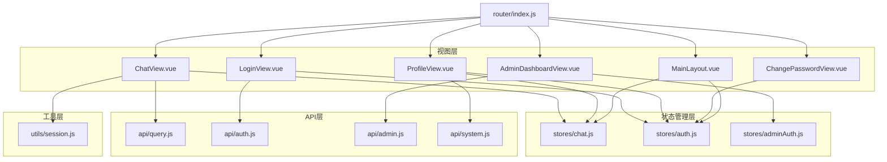
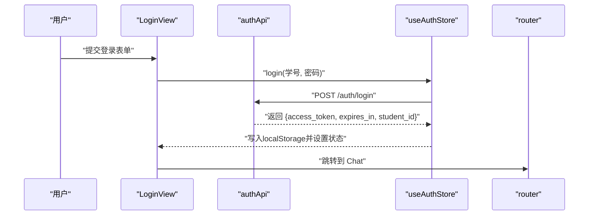
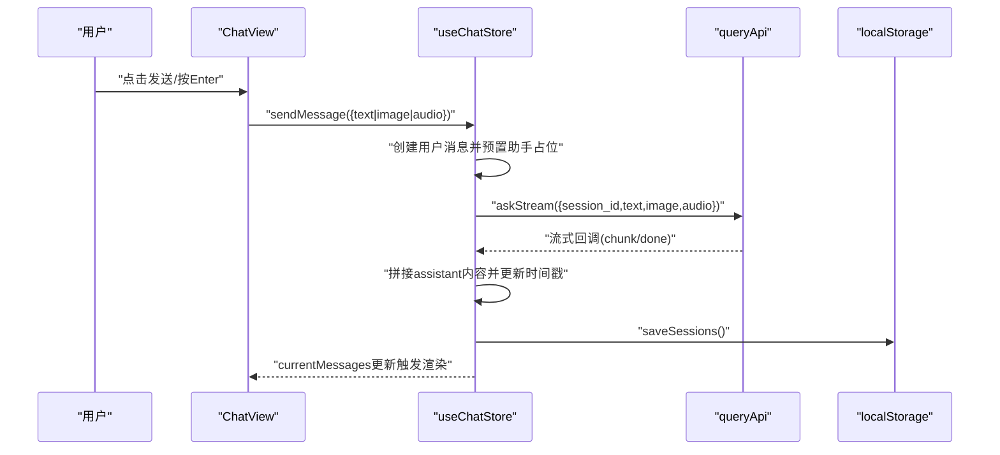
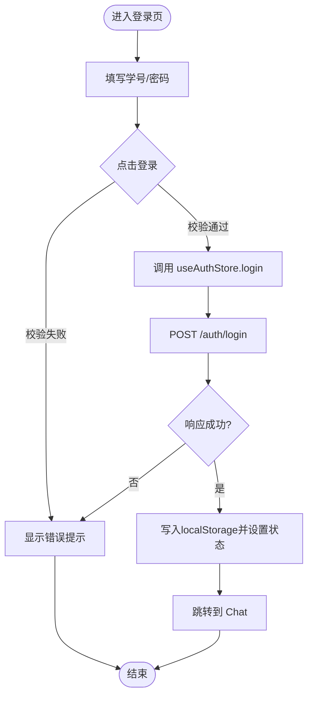
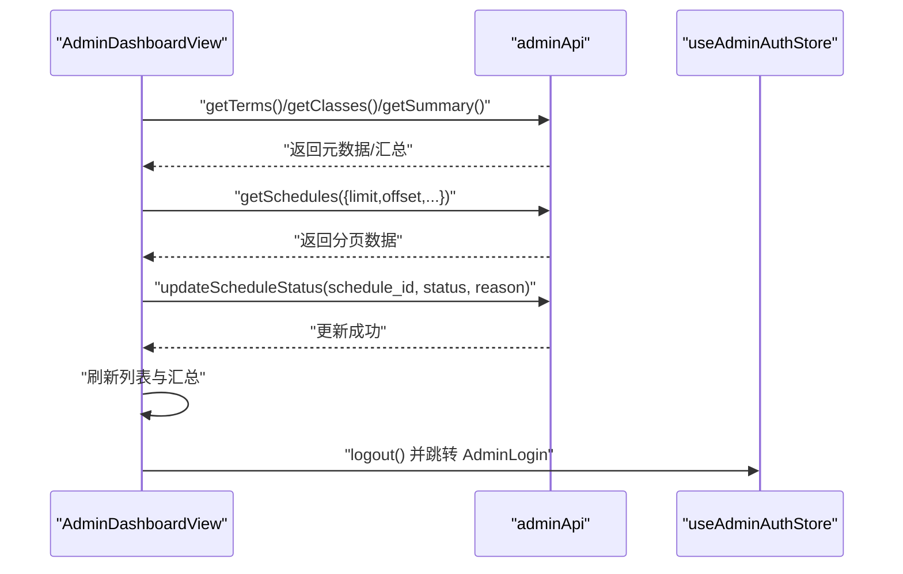
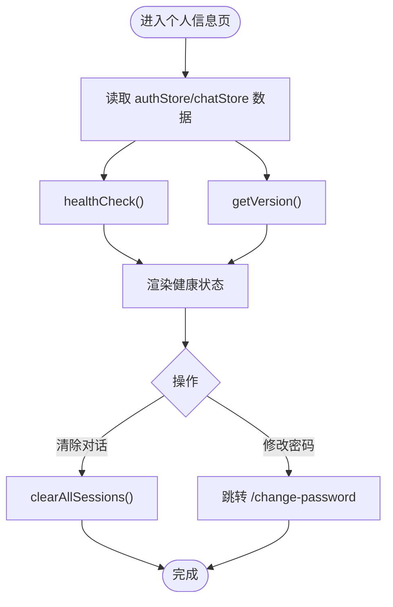
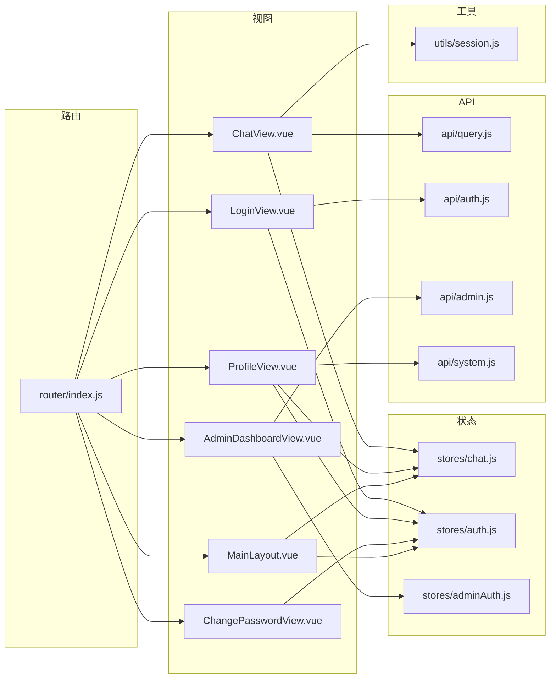

# 页面组件

<cite>
**本文引用的文件**
- [ChatView.vue](file://frontend/ai_assistant/src/views/ChatView.vue)
- [LoginView.vue](file://frontend/ai_assistant/src/views/LoginView.vue)
- [AdminDashboardView.vue](file://frontend/ai_assistant/src/views/AdminDashboardView.vue)
- [ProfileView.vue](file://frontend/ai_assistant/src/views/ProfileView.vue)
- [ChangePasswordView.vue](file://frontend/ai_assistant/src/views/ChangePasswordView.vue)
- [MainLayout.vue](file://frontend/ai_assistant/src/layouts/MainLayout.vue)
- [router/index.js](file://frontend/ai_assistant/src/router/index.js)
- [stores/chat.js](file://frontend/ai_assistant/src/stores/chat.js)
- [stores/auth.js](file://frontend/ai_assistant/src/stores/auth.js)
- [stores/adminAuth.js](file://frontend/ai_assistant/src/stores/adminAuth.js)
- [api/auth.js](file://frontend/ai_assistant/src/api/auth.js)
- [api/admin.js](file://frontend/ai_assistant/src/api/admin.js)
- [api/query.js](file://frontend/ai_assistant/src/api/query.js)
- [api/system.js](file://frontend/ai_assistant/src/api/system.js)
- [utils/session.js](file://frontend/ai_assistant/src/utils/session.js)
</cite>

## 目录
1. [简介](#简介)
2. [项目结构](#项目结构)
3. [核心组件](#核心组件)
4. [架构总览](#架构总览)
5. [详细组件分析](#详细组件分析)
6. [依赖关系分析](#依赖关系分析)
7. [性能考虑](#性能考虑)
8. [故障排查指南](#故障排查指南)
9. [结论](#结论)
10. [附录](#附录)

## 简介
本文件面向AI校园助手项目的前端页面组件，围绕以下目标展开：
- 深入解释各页面组件的设计与实现：ChatView聊天界面的多模态输入处理、消息渲染与实时更新；LoginView登录界面的认证流程与表单验证；AdminDashboardView管理界面的数据展示与操作；ProfileView个人信息界面的资料管理与密码修改入口。
- 说明页面组件的状态管理、生命周期钩子使用、事件处理与用户交互设计。
- 阐述页面组件与Pinia状态管理的集成方式，包括store的使用模式与数据绑定策略。
- 提供性能优化建议（懒加载、虚拟滚动、内存管理）与最佳实践。

## 项目结构
前端采用Vue 3 + Vite + Pinia + Vue Router组织，页面组件位于views目录，状态管理位于stores目录，API封装位于api目录，通用工具位于utils目录，主布局与路由在layouts与router目录。

图表来源
- [ChatView.vue:1-1168](file://frontend/ai_assistant/src/views/ChatView.vue#L1-L1168)
- [LoginView.vue:1-343](file://frontend/ai_assistant/src/views/LoginView.vue#L1-L343)
- [AdminDashboardView.vue:1-688](file://frontend/ai_assistant/src/views/AdminDashboardView.vue#L1-L688)
- [ProfileView.vue:1-380](file://frontend/ai_assistant/src/views/ProfileView.vue#L1-L380)
- [ChangePasswordView.vue:1-466](file://frontend/ai_assistant/src/views/ChangePasswordView.vue#L1-L466)
- [MainLayout.vue:1-487](file://frontend/ai_assistant/src/layouts/MainLayout.vue#L1-L487)
- [router/index.js:1-75](file://frontend/ai_assistant/src/router/index.js#L1-L75)
- [stores/chat.js:1-278](file://frontend/ai_assistant/src/stores/chat.js#L1-L278)
- [stores/auth.js:1-77](file://frontend/ai_assistant/src/stores/auth.js#L1-L77)
- [stores/adminAuth.js:1-77](file://frontend/ai_assistant/src/stores/adminAuth.js#L1-L77)
- [api/query.js:1-141](file://frontend/ai_assistant/src/api/query.js#L1-L141)
- [api/auth.js:1-36](file://frontend/ai_assistant/src/api/auth.js#L1-L36)
- [api/admin.js:1-41](file://frontend/ai_assistant/src/api/admin.js#L1-L41)
- [api/system.js:1-18](file://frontend/ai_assistant/src/api/system.js#L1-L18)
- [utils/session.js:1-70](file://frontend/ai_assistant/src/utils/session.js#L1-L70)

章节来源
- [router/index.js:1-75](file://frontend/ai_assistant/src/router/index.js#L1-L75)
- [MainLayout.vue:1-487](file://frontend/ai_assistant/src/layouts/MainLayout.vue#L1-L487)

## 核心组件
- ChatView：聊天主界面，支持文本、图片、语音多模态输入，流式渲染助手回复，自动滚动与意图/缓存/耗时等元信息展示。
- LoginView：学生登录，表单校验、错误提示、跳转逻辑。
- AdminDashboardView：管理员后台，筛选、分页、状态切换、汇总统计。
- ProfileView：个人信息与系统健康状态查看，提供清除对话与修改密码入口。
- ChangePasswordView：密码修改，前端强度校验与后端加密传输。
- MainLayout：侧边栏、会话列表、搜索、导航与登出。
- Pinia Store：chat、auth、adminAuth；API封装：auth、admin、query、system；工具：session。

章节来源
- [ChatView.vue:1-1168](file://frontend/ai_assistant/src/views/ChatView.vue#L1-L1168)
- [LoginView.vue:1-343](file://frontend/ai_assistant/src/views/LoginView.vue#L1-L343)
- [AdminDashboardView.vue:1-688](file://frontend/ai_assistant/src/views/AdminDashboardView.vue#L1-L688)
- [ProfileView.vue:1-380](file://frontend/ai_assistant/src/views/ProfileView.vue#L1-L380)
- [ChangePasswordView.vue:1-466](file://frontend/ai_assistant/src/views/ChangePasswordView.vue#L1-L466)
- [MainLayout.vue:1-487](file://frontend/ai_assistant/src/layouts/MainLayout.vue#L1-L487)
- [stores/chat.js:1-278](file://frontend/ai_assistant/src/stores/chat.js#L1-L278)
- [stores/auth.js:1-77](file://frontend/ai_assistant/src/stores/auth.js#L1-L77)
- [stores/adminAuth.js:1-77](file://frontend/ai_assistant/src/stores/adminAuth.js#L1-L77)
- [api/auth.js:1-36](file://frontend/ai_assistant/src/api/auth.js#L1-L36)
- [api/admin.js:1-41](file://frontend/ai_assistant/src/api/admin.js#L1-L41)
- [api/query.js:1-141](file://frontend/ai_assistant/src/api/query.js#L1-L141)
- [api/system.js:1-18](file://frontend/ai_assistant/src/api/system.js#L1-L18)
- [utils/session.js:1-70](file://frontend/ai_assistant/src/utils/session.js#L1-L70)

## 架构总览
页面组件通过Pinia store与API模块解耦，路由守卫控制访问权限，布局组件统一承载导航与会话列表。

图表来源
- [LoginView.vue:94-121](file://frontend/ai_assistant/src/views/LoginView.vue#L94-L121)
- [api/auth.js:15-20](file://frontend/ai_assistant/src/api/auth.js#L15-L20)
- [stores/auth.js:29-43](file://frontend/ai_assistant/src/stores/auth.js#L29-L43)
- [router/index.js:58-73](file://frontend/ai_assistant/src/router/index.js#L58-L73)

## 详细组件分析

### ChatView 聊天界面
- 多模态输入
  - 文本：textarea自适应高度，Enter发送。
  - 图片：文件选择与前端压缩（<800KB直传，否则Canvas缩放+JPEG压缩），预览与移除。
  - 语音：MediaRecorder录音，前端时长与体积校验，发送base64与时长。
- 实时更新与渲染
  - 流式SSE：queryApi.askStream接收增量块，store动态拼接assistant消息，完成后持久化。
  - Markdown渲染：marked解析，错误回退。
  - 元信息：意图标签、缓存命中、响应耗时、设备ID等。
- 交互与状态
  - 消息删除、滚动到底部、欢迎页示例与快捷操作填充。
  - loading状态基于store的会话级loadingStates。
- 与Pinia集成
  - 使用useChatStore，读取currentSession/currentMessages，调用sendMessage。
  - 本地会话持久化与活跃会话ID管理来自utils/session。
- 生命周期与事件
  - onMounted滚动到底部；watch监听消息长度变化自动滚动；textarea输入自适应。

图表来源
- [ChatView.vue:312-333](file://frontend/ai_assistant/src/views/ChatView.vue#L312-L333)
- [stores/chat.js:133-230](file://frontend/ai_assistant/src/stores/chat.js#L133-L230)
- [api/query.js:28-140](file://frontend/ai_assistant/src/api/query.js#L28-L140)
- [utils/session.js:50-52](file://frontend/ai_assistant/src/utils/session.js#L50-L52)

章节来源
- [ChatView.vue:1-1168](file://frontend/ai_assistant/src/views/ChatView.vue#L1-L1168)
- [stores/chat.js:1-278](file://frontend/ai_assistant/src/stores/chat.js#L1-L278)
- [api/query.js:1-141](file://frontend/ai_assistant/src/api/query.js#L1-L141)
- [utils/session.js:1-70](file://frontend/ai_assistant/src/utils/session.js#L1-L70)

### LoginView 登录界面
- 表单与校验
  - 学号与密码必填校验；密码可见性切换；提交禁用与加载指示。
- 认证流程
  - 调用useAuthStore.login，内部加密密码后请求后端，成功写入localStorage并设置状态。
  - 失败根据HTTP状态与后端detail提示用户。
- 路由联动
  - 登录成功跳转到Chat；路由守卫确保未登录用户无法访问受保护页面。

图表来源
- [LoginView.vue:94-121](file://frontend/ai_assistant/src/views/LoginView.vue#L94-L121)
- [stores/auth.js:29-43](file://frontend/ai_assistant/src/stores/auth.js#L29-L43)
- [api/auth.js:15-20](file://frontend/ai_assistant/src/api/auth.js#L15-L20)
- [router/index.js:58-73](file://frontend/ai_assistant/src/router/index.js#L58-L73)

章节来源
- [LoginView.vue:1-343](file://frontend/ai_assistant/src/views/LoginView.vue#L1-L343)
- [stores/auth.js:1-77](file://frontend/ai_assistant/src/stores/auth.js#L1-L77)
- [api/auth.js:1-36](file://frontend/ai_assistant/src/api/auth.js#L1-L36)
- [router/index.js:1-75](file://frontend/ai_assistant/src/router/index.js#L1-L75)

### AdminDashboardView 管理界面
- 数据加载
  - 初始化：Promise.all加载学期/班级元数据与汇总统计，随后加载课表列表。
  - 分页与筛选：limit/offset构建查询参数，关键词、学期、班级、周次、状态筛选。
- 操作与交互
  - 切换课表状态：弹窗确认与停用原因输入，调用adminApi.updateScheduleStatus。
  - 刷新统计与退出登录。
- 展示与格式化
  - 时间格式化、班级列表合并、状态徽章样式。

图表来源
- [AdminDashboardView.vue:233-360](file://frontend/ai_assistant/src/views/AdminDashboardView.vue#L233-L360)
- [api/admin.js:18-39](file://frontend/ai_assistant/src/api/admin.js#L18-L39)
- [stores/adminAuth.js:49-63](file://frontend/ai_assistant/src/stores/adminAuth.js#L49-L63)

章节来源
- [AdminDashboardView.vue:1-688](file://frontend/ai_assistant/src/views/AdminDashboardView.vue#L1-L688)
- [api/admin.js:1-41](file://frontend/ai_assistant/src/api/admin.js#L1-L41)
- [stores/adminAuth.js:1-77](file://frontend/ai_assistant/src/stores/adminAuth.js#L1-L77)

### ProfileView 个人信息界面
- 信息展示
  - 学号、账户状态、令牌有效期、设备ID(DID)、会话数与消息总数、套餐与认证方式。
- 系统健康
  - 健康检查与版本信息，状态指示灯（加载/正常/异常）。
- 操作
  - 清除所有对话（调用chatStore.clearAllSessions并同步后端）。
  - 修改密码入口（路由到ChangePasswordView）。

图表来源
- [ProfileView.vue:98-179](file://frontend/ai_assistant/src/views/ProfileView.vue#L98-L179)
- [api/system.js:10-17](file://frontend/ai_assistant/src/api/system.js#L10-L17)
- [stores/auth.js:1-77](file://frontend/ai_assistant/src/stores/auth.js#L1-L77)
- [stores/chat.js:104-116](file://frontend/ai_assistant/src/stores/chat.js#L104-L116)

章节来源
- [ProfileView.vue:1-380](file://frontend/ai_assistant/src/views/ProfileView.vue#L1-L380)
- [api/system.js:1-18](file://frontend/ai_assistant/src/api/system.js#L1-L18)
- [stores/auth.js:1-77](file://frontend/ai_assistant/src/stores/auth.js#L1-L77)
- [stores/chat.js:1-278](file://frontend/ai_assistant/src/stores/chat.js#L1-L278)

### ChangePasswordView 密码修改
- 表单与校验
  - 旧密码必填、新密码≥6位、确认密码一致；前端强度评分与规则提示。
- 提交流程
  - 调用useAuthStore.changePassword，内部加密后请求后端；根据HTTP状态映射错误信息。
- 交互反馈
  - 成功/错误消息提示，清空表单。

章节来源
- [ChangePasswordView.vue:1-466](file://frontend/ai_assistant/src/views/ChangePasswordView.vue#L1-L466)
- [stores/auth.js:46-56](file://frontend/ai_assistant/src/stores/auth.js#L46-L56)
- [api/auth.js:29-35](file://frontend/ai_assistant/src/api/auth.js#L29-L35)

### MainLayout 侧边栏与导航
- 功能
  - 新建对话、搜索会话、会话列表、底部导航、移动端侧栏与遮罩。
  - 退出登录时清理auth与chat状态并跳转登录页。
- 与ChatView协作
  - 通过chatStore的filteredSessions驱动列表渲染，支持删除与切换。

章节来源
- [MainLayout.vue:1-487](file://frontend/ai_assistant/src/layouts/MainLayout.vue#L1-L487)
- [stores/chat.js:48-56](file://frontend/ai_assistant/src/stores/chat.js#L48-L56)
- [stores/auth.js:59-66](file://frontend/ai_assistant/src/stores/auth.js#L59-L66)

## 依赖关系分析

图表来源
- [router/index.js:1-75](file://frontend/ai_assistant/src/router/index.js#L1-L75)
- [ChatView.vue:1-1168](file://frontend/ai_assistant/src/views/ChatView.vue#L1-L1168)
- [LoginView.vue:1-343](file://frontend/ai_assistant/src/views/LoginView.vue#L1-L343)
- [AdminDashboardView.vue:1-688](file://frontend/ai_assistant/src/views/AdminDashboardView.vue#L1-L688)
- [ProfileView.vue:1-380](file://frontend/ai_assistant/src/views/ProfileView.vue#L1-L380)
- [ChangePasswordView.vue:1-466](file://frontend/ai_assistant/src/views/ChangePasswordView.vue#L1-L466)
- [MainLayout.vue:1-487](file://frontend/ai_assistant/src/layouts/MainLayout.vue#L1-L487)
- [stores/chat.js:1-278](file://frontend/ai_assistant/src/stores/chat.js#L1-L278)
- [stores/auth.js:1-77](file://frontend/ai_assistant/src/stores/auth.js#L1-L77)
- [stores/adminAuth.js:1-77](file://frontend/ai_assistant/src/stores/adminAuth.js#L1-L77)
- [api/query.js:1-141](file://frontend/ai_assistant/src/api/query.js#L1-L141)
- [api/auth.js:1-36](file://frontend/ai_assistant/src/api/auth.js#L1-L36)
- [api/admin.js:1-41](file://frontend/ai_assistant/src/api/admin.js#L1-L41)
- [api/system.js:1-18](file://frontend/ai_assistant/src/api/system.js#L1-L18)
- [utils/session.js:1-70](file://frontend/ai_assistant/src/utils/session.js#L1-L70)

章节来源
- [router/index.js:1-75](file://frontend/ai_assistant/src/router/index.js#L1-L75)
- [MainLayout.vue:1-487](file://frontend/ai_assistant/src/layouts/MainLayout.vue#L1-L487)

## 性能考虑
- 懒加载
  - 路由按需加载组件，减少首屏体积与初次渲染压力。
- 虚拟滚动
  - 对于超长消息列表或大量会话项，建议引入虚拟滚动库（如vue-virtual-scroller）以降低DOM节点数量。
- 内存管理
  - ChatView中音频播放器实例currentAudioPlayer需在播放结束或切换时释放；store中仅保留必要字段，避免冗余快照。
  - 图片上传前压缩，避免过大Blob导致内存峰值过高。
- 渲染优化
  - 使用Transition/TransitionGroup时，合理设置key与动画时长；对频繁更新的列表使用track-by或稳定key。
  - Markdown渲染marked在长文本时可考虑分段或节流更新。
- 网络与缓存
  - queryApi兼容JSON与SSE两种返回，兜底确保done标记正确，避免UI长期处于“正在思考”。

[本节为通用性能建议，无需特定文件引用]

## 故障排查指南
- 登录失败
  - 检查后端返回状态与detail，401提示学号/密码错误，其他网络异常提示检查连通性。
- 语音输入异常
  - 录音时长过短或音频过小会被拒绝；麦克风权限被拒时需引导用户开启权限。
- 流式渲染卡顿
  - 确认后端SSE响应头与格式；若网关改写格式，前端已具备容错解析逻辑。
- 管理员权限
  - 未登录管理员或已登录但非管理员将被重定向至相应入口。
- 本地存储
  - 若会话/令牌异常，可清理localStorage对应键值后重试。

章节来源
- [LoginView.vue:94-121](file://frontend/ai_assistant/src/views/LoginView.vue#L94-L121)
- [ChatView.vue:400-481](file://frontend/ai_assistant/src/views/ChatView.vue#L400-L481)
- [api/query.js:78-140](file://frontend/ai_assistant/src/api/query.js#L78-L140)
- [router/index.js:58-73](file://frontend/ai_assistant/src/router/index.js#L58-L73)

## 结论
本项目通过清晰的页面职责划分、Pinia状态集中管理与API封装，实现了从登录认证到聊天交互、从个人信息到管理员后台的完整用户体验。ChatView在多模态输入与流式渲染方面表现突出，LoginView与ChangePasswordView提供了完善的表单校验与安全传输，AdminDashboardView覆盖了典型后台的数据筛选与状态变更需求，ProfileView则整合了用户信息与系统健康状态。配合路由守卫与布局组件，整体具备良好的可维护性与扩展性。

[本节为总结性内容，无需特定文件引用]

## 附录
- 最佳实践清单
  - 组件内尽量只做UI与事件处理，业务逻辑下沉至store与API。
  - 表单校验优先在组件内完成，再交给store/API，减少无效请求。
  - 对长列表与高频更新场景，优先考虑虚拟滚动与防抖节流。
  - 对多媒体资源（图片/音频）务必做压缩与体积限制，避免影响网络与内存。
  - 错误处理统一在store或API层解析，组件内仅负责展示友好提示。

[本节为通用建议，无需特定文件引用]